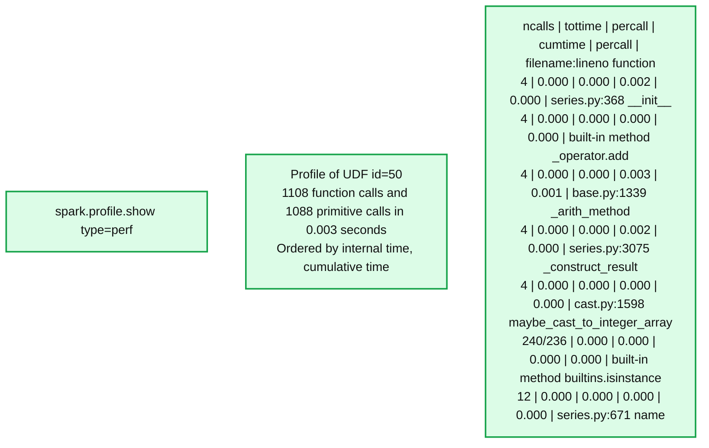
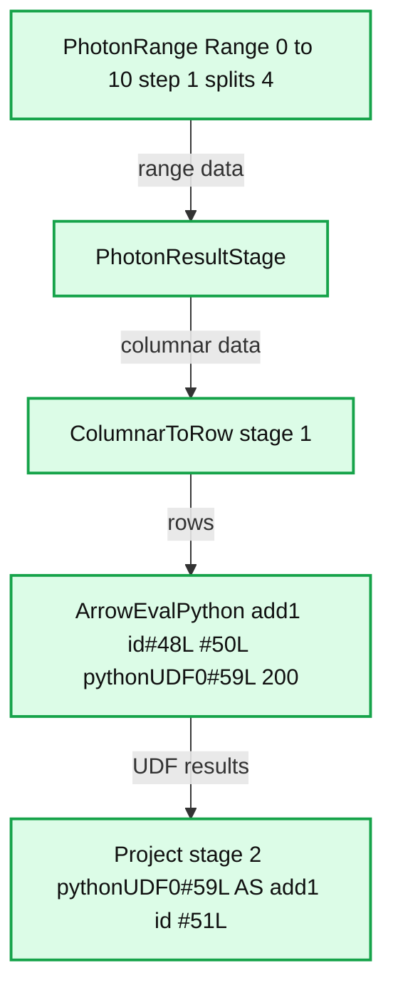
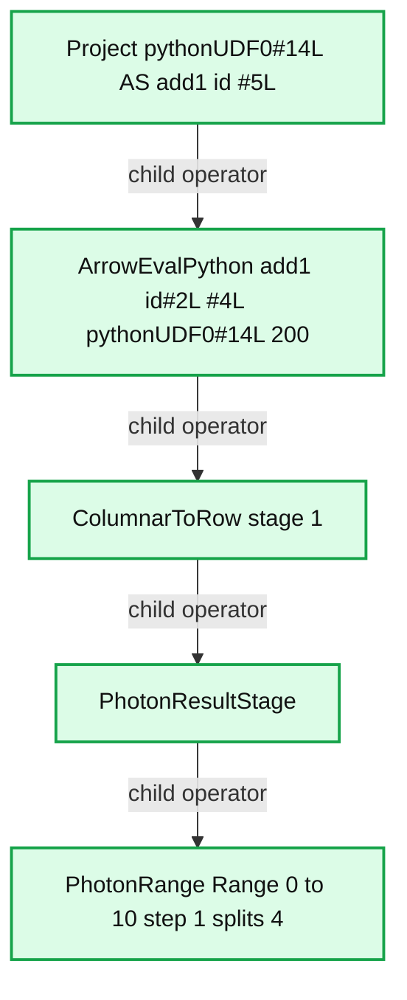

# PySpark UDF Unified Profiling

*Optimizing PySpark UDFs with Unified Profiling: Enhanced Performance and Memory Insights*

- Source: https://www.databricks.com/blog/pyspark-udf-unified-profiling
- Published: 2025-06-09
- Authors: Xinrong Meng, Takuya Ueshin
- Categories: engineering, open-source
- Images: 5 total, 4 extracted as architecture

**Key takeaways**

- Introducing PySpark UDF Unified Profiling – Learn how performance and memory profiling for UDFs in Databricks Runtime 17.0 helps optimize execution and resource usage.
- Enhancing Performance and Debugging – Explore how to track function calls, execution time, and memory consumption to identify bottlenecks and improve efficiency.
- Replacing Legacy Profiling with a Unified Approach – Understand the benefits of the new SparkSession-based profiling, its compatibility with Spark Connect, and how to enable, visualize, and manage profiling results.

We are excited to release Unified Profiling for PySpark User-Defined Functions (UDFs) as part of Databricks Runtime 17.0 ([release notes](https://docs.databricks.com/aws/en/release-notes/runtime/17.0)). Unified Profiling for PySpark UDFs lets developers profile the performance and memory usage of their PySpark UDFs, including tracking function calls, execution time, memory usage, and other metrics. This enables PySpark developers to easily identify and address bottlenecks, leading to faster and more resource-efficient UDFs.

The unified profilers can be enabled by setting the [Runtime SQL configuration](https://spark.apache.org/docs/latest/configuration.html#runtime-sql-configuration) “spark.sql.pyspark.udf.profiler” to “perf” or “memory” to enable the performance or memory profiler, respectively, as shown below.

## Replacement for Legacy Profiling

Legacy profiling [[1](https://www.databricks.com/blog/how-profile-pyspark), [2](https://www.databricks.com/blog/2022/11/30/memory-profiling-pyspark.html)] was implemented at the SparkContext level and, thus, did not work with Spark Connect. The new profiling is SparkSession-based, applies to Spark Connect, and can be enabled or disabled at runtime. It maximizes API parity with legacy profiling by providing “show” and “dump” commands to visualize profile results and save them to a workspace folder. Additionally, it offers convenience APIs to help manage and reset profile results on demand. Lastly, it supports registered UDFs, which were not supported by the legacy profiling.

## PySpark Performance Profiler

The PySpark performance profiler leverages Python's built-in profilers to extend profiling capabilities to the driver and UDFs executed on executors in a distributed manner.

Let's dive into an example to see the PySpark performance profiler in action. We run the following code on Databricks Runtime 17.0 notebooks.

The added.show() command displays performance profiling results as shown below.

**Summary:** PySpark performance profiling output shows function call counts and execution timings for UDF id 50.

**Components:**
- `spark.profile.show(type="perf")`: PySpark performance profile display command.
- `Profile of UDF<id=50>`: Python function profiling results, ordered by internal time and cumulative time.
- `ncalls`, `tottime`, `percall`, `cumtime`, `percall`, `filename:lineno(function)`: profiling table columns.
- `series.py:368(__init__)`, `base.py:1339(_arith_method)`, `series.py:3075(_construct_result)`, `cast.py:1598(maybe_cast_to_integer_array)`, `series.py:671(name)`: Python source functions.
- `_operator.add`, `builtins.isinstance`: Python built-in functions.

**Flows:**
- none. No arrows are visible.

**Numbers:**
- UDF id: `50`.
- `1108` function calls, including `1088` primitive calls, in `0.003` seconds.
- Timing columns below are in seconds; source line numbers appear in the final column.

| ncalls | tottime | percall | cumtime | percall | filename:lineno(function) |
|---:|---:|---:|---:|---:|---|
| 4 | 0.000 | 0.000 | 0.002 | 0.000 | series.py:368(__init__) |
| 4 | 0.000 | 0.000 | 0.000 | 0.000 | built-in method _operator.add |
| 4 | 0.000 | 0.000 | 0.003 | 0.001 | base.py:1339(_arith_method) |
| 4 | 0.000 | 0.000 | 0.002 | 0.000 | series.py:3075(_construct_result) |
| 4 | 0.000 | 0.000 | 0.000 | 0.000 | cast.py:1598(maybe_cast_to_integer_array) |
| 240/236 | 0.000 | 0.000 | 0.000 | 0.000 | built-in method builtins.isinstance |
| 12 | 0.000 | 0.000 | 0.000 | 0.000 | series.py:671(name) |

source image: https://www.databricks.com/sites/default/files/inline-images/pyspark-udf-unified-profiling-blog-img-1.png

The output includes information such as the number of function calls, total time spent in the given function, and the filename, along with the line number to aid navigation. This information is essential for identifying tight loops in your PySpark programs and enabling you to make decisions to improve performance.

It's important to note that the UDF id in these results directly correlates with the one found in the Spark plan, by observing the “ArrowEvalPython [add1(...)#50L]”, which is revealed when calling the explain method on the dataframe.

**Summary:** The Spark physical plan for `added.explain()` shows a Photon range feeding a Python UDF evaluation and a final projection.

**Components:**
- `added.explain()`: PySpark command displaying the physical plan.
- `Project`: Spark projection of `pythonUDF0#59L AS add1(id)#51L`.
- `ArrowEvalPython`: Spark Python UDF evaluation with `add1(id#48L)#50L` and output `pythonUDF0#59L`.
- `ColumnarToRow`: Spark conversion from columnar data to rows.
- `PhotonResultStage`: Photon execution stage.
- `PhotonRange`: Photon range source.

**Flows:**
- PhotonRange -> PhotonResultStage: range data.
- PhotonResultStage -> ColumnarToRow: columnar data.
- ColumnarToRow -> ArrowEvalPython: rows for UDF evaluation.
- ArrowEvalPython -> Project: Python UDF results.

**Numbers:**
- `*(2)` on Project; `*(1)` on ColumnarToRow.
- `0` in `pythonUDF0`; `1` in `add1`.
- Identifiers: `#59L`, `#51L`, `#48L`, `#50L`.
- `200` on ArrowEvalPython.
- Range: start `0`, end `10`, step `1`, splits `4`.

source image: https://www.databricks.com/sites/default/files/inline-images/pyspark-udf-unified-profiling-blog-img-2.png

Finally, we can dump the profiling results to a folder and clear the result profiles as shown below.

## PySpark Memory Profiler

It is based on [memory-profiler](https://pypi.org/project/memory-profiler/), which can profile the driver, as seen [here](https://spark.apache.org/docs/latest/api/python/development/debugging.html#id4). PySpark has expanded its usage to include profiling UDFs, which are executed on executors in a distributed manner.

To enable memory profiling on a cluster, we should install the [memory-profiler](https://pypi.org/project/memory-profiler/) on the cluster as shown below.

The above example modifies the last two lines by:

Then we obtain memory profiling results as shown below.

**Summary:** PySpark memory profiling output reports line-level memory usage, increments, and execution counts for a pandas UDF.

**Components:**
- `spark.profile.show(type="memory")`: PySpark command displaying memory profiling results.
- `Profile of UDF<id=4>`: Profile identifying the measured UDF.
- `Filename`: Python source location `/root/.ipykernel/1259/command-1653643849461535-3519972363`.
- `Line #`, `Mem usage`, `Increment`, `Occurrences`, `Line Contents`: Memory profiler output columns.
- `@pandas_udf("long")`, `def add1(x):`, `return x + 1`: Profiled Python pandas UDF.

**Flows:**
- none

**Numbers:**
- UDF id: 4.
- Filename numeric segments: 1259, 1653643849461535, 3519972363.
- Line 4: memory usage 606.5 MiB, increment 606.5 MiB, occurrences 4.
- Line 5: no measurements displayed.
- Line 6: memory usage 606.5 MiB, increment 0.0 MiB, occurrences 4.
- Function name `add1` contains 1; return expression adds 1.

```mermaid
%% PySpark memory profiling output for pandas UDF id 4
flowchart TD
    A["spark.profile.show type memory"]
    B["Profile of UDF id 4"]
    C["Filename /root/.ipykernel/1259/command-1653643849461535-3519972363"]
    D["Line # | Mem usage | Increment | Occurrences | Line Contents"]
    E["4 | 606.5 MiB | 606.5 MiB | 4 | @pandas_udf long"]
    F["5 | blank | blank | blank | def add1 x"]
    G["6 | 606.5 MiB | 0.0 MiB | 4 | return x + 1"]

    classDef client fill:#dbeafe,stroke:#2563eb,stroke-width:2px,color:#111
    classDef service fill:#dcfce7,stroke:#16a34a,stroke-width:2px,color:#111
    classDef store fill:#ede9fe,stroke:#7c3aed,stroke-width:2px,color:#111
    classDef cache fill:#fef3c7,stroke:#d97706,stroke-width:2px,color:#111
    classDef queue fill:#cffafe,stroke:#0891b2,stroke-width:2px,color:#111
    classDef critical fill:#fee2e2,stroke:#dc2626,stroke-width:4px,color:#111
    classDef external fill:#e5e7eb,stroke:#6b7280,stroke-width:2px,color:#111,stroke-dasharray:4 3
    classDef decision fill:#fce7f3,stroke:#db2777,stroke-width:2px,color:#111
    class A,B,C,D,E,F,G service
```

source image: https://www.databricks.com/sites/default/files/inline-images/pyspark-udf-unified-profiling-blog-img-4.png

The output includes several columns that give you a comprehensive view of how your code performs in terms of memory usage. "Mem usage" reveals the memory usage after executing that line. "Increment" details the change in memory usage from the previous line, helping you spot where memory usage spikes. "Occurrences" indicates how many times each line was executed.

The UDF id in these results also directly correlates with the one found in the Spark plan, the same as performance profiling results, by observing the “ArrowEvalPython [add1(...)#4L]”, which is revealed when calling the explain method on the dataframe as shown below.

**Summary:** The Spark physical plan for `added.explain()` connects Photon range generation, row conversion, Python UDF evaluation, and projection.

**Components:**
- `added.explain()`: PySpark plan inspection.
- `Physical Plan`: Spark execution plan.
- `Project [pythonUDF0#14L AS add1(id)#5L]`: Spark projection.
- `ArrowEvalPython [add1(id#2L)#4L], [pythonUDF0#14L], 200`: Spark Arrow Python UDF evaluation.
- `ColumnarToRow`: Spark columnar-to-row conversion.
- `PhotonResultStage`: Photon execution stage.
- `PhotonRange Range (0, 10, step=1, splits=4)`: Photon range source.

**Flows:**
- Project -> ArrowEvalPython: child operator.
- ArrowEvalPython -> ColumnarToRow: child operator.
- ColumnarToRow -> PhotonResultStage: child operator.
- PhotonResultStage -> PhotonRange: child operator.

**Numbers:** Project stage `2`; ColumnarToRow stage `1`; `pythonUDF0#14L` contains `0` and identifier `14L`; `add1(id)#5L` contains `1` and identifier `5L`; `add1(id#2L)#4L` contains `1` and identifiers `2L` and `4L`; ArrowEvalPython value `200`; range start `0`, end `10`, step `1`, splits `4`.

source image: https://www.databricks.com/sites/default/files/inline-images/pyspark-udf-unified-profiling-blog-img-5.png

Please note that for this functionality to work, the [memory-profiler](https://pypi.org/project/memory-profiler/) package must be installed on your cluster.

## Conclusion

PySpark Unified Profiling, which includes performance and memory profiling for UDFs, is available in Databricks Runtime 17.0. Unified Profiling provides a streamlined method for observing important aspects such as function call frequency, execution durations, and memory consumption. It simplifies the process of pinpointing and resolving bottlenecks, paving the way for the development of faster and more resource-efficient UDFs.

Ready to explore more? Check out the PySpark API documentation for detailed guides and examples.
