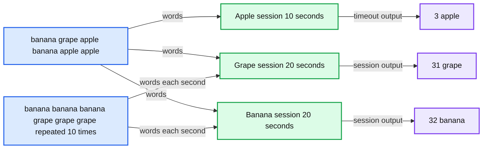

# Python Arbitrary Stateful Processing in Structured Streaming

*How to execute a Python function with a state in Structured Streaming*

- Source: https://www.databricks.com/blog/python-arbitrary-stateful-processing-structured-streaming
- Published: 2022-10-18
- Authors: Hyukjin Kwon, Jungtaek Lim
- Categories: engineering, data-engineering, data-streaming
- Images: 2 total, 1 extracted as architecture

More and more customers are using Databricks for their [real-time analytics and machine learning workloads](https://www.databricks.com/product/data-streaming) to meet the ever increasing demand of their businesses and customers. This is why we started [Project Lightspeed](https://www.databricks.com/blog/2022/06/28/project-lightspeed-faster-and-simpler-stream-processing-with-apache-spark.html), which aims to improve Structured Streaming in Apache Spark™ around latency, functionalities, ecosystem connectors, and ease of operations. With real-time stream processing, new data is constantly being generated and you need to process the data in a continuous manner. For example, tracking and counting the number of consecutive credit card transactions by a given user over a short window of time. To perform continuous processing, you often need to keep and then manipulate the intermediate results in a state store until the final results are computed. Structured Streaming provides [arbitrary stateful operations](https://www.databricks.com/blog/2017/10/17/arbitrary-stateful-processing-in-apache-sparks-structured-streaming.html) to address such advanced processing needs but this capability has only been accessible to Scala users, until now.

Today we are introducing arbitrary stateful operation support in Structured Streaming with PySpark along with a code sample of a session window scenario. This unblocks a massive number of real-time analytics and machine learning use cases in Python in Spark. This functionality is available from Databricks Runtime 11.3 onwards and in the upcoming Apache Spark 3.4.0.

## DataFrame.groupby.applyInPandasWithState

The user-facing PySpark API for arbitrary stateful operations is slightly different from its Scala counterpart. In Scala, the `Dataset.groupByKey.mapGroupsWithState` and `Dataset.groupByKey.flatMapGroupsWithState` methods support arbitrary stateful operations. Both methods are *statically typed* whereas the Python language uses *dynamic typing* instead, aligning with PySpark's `DataFrame.groupby.applyInPandas` API. In the presence of dynamic typing, PySpark state only supports storing a tuple that matches with the user-specified schema. Here is the API signature:

The signature of the user-provided Python function is as follows:

Users can invoke their own user-defined function that acquires or updates the state:

## Session window word count scenario

This section walks through an example with an actual session window scenario that counts words. You can copy and paste the code snippets below into a [Databricks notebook](https://docs.databricks.com/structured-streaming/examples.html#examples-for-working-with-structured-streaming-on-databricks) or the pyspark shell. Please feel free to try it out!

The example ingests words in text files in a streaming fashion and then prints the word and the number of words aggregated for the specified session timeout which defaults to ten seconds. The session state retains the words and counts and aggregates them until no more such words in the input exist for more than 10 seconds, then prints them out afterwards.

**Summary:** The diagram shows streaming word inputs grouped into timed sessions and emitted as aggregated word counts after inactivity timeouts.

**Components:**

- Streaming input batches containing banana, grape, and apple words
- Apple session with a 10-second timeout
- Grape session with a 20-second duration
- Banana session with a 20-second duration
- Aggregated output counts for apple, grape, and banana
- Time axis

**Flows:**

- Streaming input -> Apple session: apple words
- Streaming input -> Grape session: grape words
- Streaming input -> Banana session: banana words
- Apple session -> Apple output: count 3 after 10 seconds of inactivity
- Grape session -> Grape output: count 31 after 20 seconds
- Banana session -> Banana output: count 32 after 20 seconds

**Numbers:** 10 seconds, 20 seconds, 3 apple, 31 grape, 32 banana, * 10

source image: https://www.databricks.com/sites/default/files/inline-images/db-373-blog-img-1.png

The streaming input in the example includes:

- The first input includes one grape, two bananas, and three apples.
- After that, the next inputs include three bananas and three grapes each second for a total of ten seconds.

Therefore, the console output becomes:

- After ten seconds, the word "apples" maps to a count of three because no apple was found for the last ten seconds.
- After twenty seconds, the word "grapes" maps to a count of 31 (1 + 3 * 10) and "bananas" to a count of 32 (2 + 3 * 10) because no bananas and grapes were found for the last ten seconds.

In this way, the "apple" session window lasts for ten seconds, and both the "grape" and the "banana" session windows last for twenty seconds.

Now, let's try the example scenario. Begin by importing the necessary Python classes and packages and creating an input directory `words_dir:`

In the next step, we define a query that reads and ingests all words in the text files inside the directory we created:

Then, we define the session window logic with `DataFrame.groupby.applyInPandasWithState`. Our user-specified function aggregates the counts for each word and then stores it into the session state. When each state reaches the timeout of ten seconds, it resets the state and then returns the result which is printed out to the console:

Now we provide the input to the query. It first writes one count of "grape", two counts of "banana", and three counts of "apple" to our session state. Then it writes three counts of "banana" and three counts of "grape" each second for a total of ten seconds:

The "apple" session window lasts for a total of ten seconds, and then the console shows a count of three for "apple" as aggregated during the session window. The session window for "apple" is finished at this point because there were no more instances of "apple" for the last ten seconds. In the case of our "grape" and "banana" window sessions, each lasts 20 seconds and the console prints 31 grapes and 32 bananas because there are instances of "grape" and "banana" for the first ten seconds.

This feature is available in Databricks Runtime 11.3, and in the upcoming Apache Spark 3.4.0. Please try out this new capability today on Databricks using DBR 11.3!
