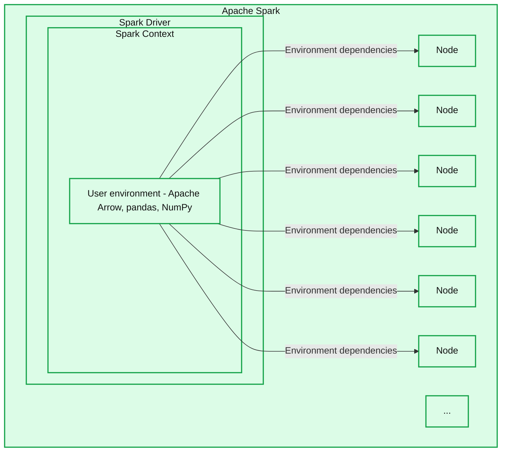
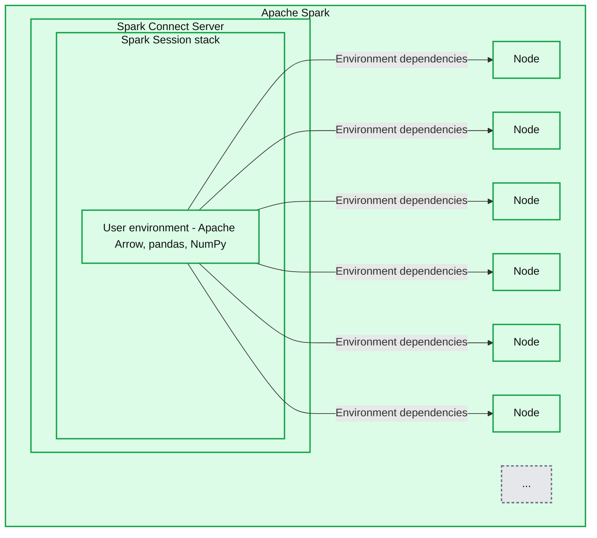

# Python Dependency Management in Spark Connect

*How to manage Python dependencies with Spark Connect*

- Source: https://www.databricks.com/blog/python-dependency-management-spark-connect
- Published: 2023-11-14
- Authors: Hyukjin Kwon, Ruifeng Zheng
- Categories: engineering, data-engineering
- Images: 2 total, 2 extracted as architecture

Managing the environment of an application in a distributed computing environment can be challenging. Ensuring that all nodes have the necessary environment to execute code and determining the actual location of the user's code are complex tasks. Apache Spark™ offers various methods such as Conda, venv, and PEX; see also [How to Manage Python Dependencies in PySpark](https://www.databricks.com/blog/2020/12/22/how-to-manage-python-dependencies-in-pyspark.html) as well as submit script options like `--jars, --packages,` and Spark configurations like `spark.jars.*`. These options allow users to seamlessly handle dependencies in their clusters.

However, the current support for managing dependencies in Apache Spark has limitations. Dependencies can only be added statically and cannot be changed during runtime. This means that you must always set the dependencies before starting your Driver. To address this issue, we have introduced session-based dependency management support in Spark Connect, starting from Apache Spark 3.5.0. This new feature allows you to update Python dependencies dynamically during runtime. In this blog post, we will discuss the comprehensive approach to controlling Python dependencies during runtime using Spark Connect in Apache Spark.

## Session-based Artifacts in Spark Connect

*One environment for each Spark Context*

**Summary:** One user environment within the Apache Spark Context is distributed from the Spark Driver to six visible nodes.

**Components:**
- Apache Spark: enclosing system.
- Spark Driver: Apache Spark driver containing the Spark Context.
- Spark Context: Apache Spark context containing the user environment.
- User environment: Apache Arrow, pandas, and NumPy.
- Six boxes labeled Node: execution nodes; their individual technologies are not specified.
- Ellipsis: additional nodes omitted from view.

**Flows:**
- User environment -> Node 1: user environment dependencies.
- User environment -> Node 2: user environment dependencies.
- User environment -> Node 3: user environment dependencies.
- User environment -> Node 4: user environment dependencies.
- User environment -> Node 5: user environment dependencies.
- User environment -> Node 6: user environment dependencies.

**Numbers:** none

source image: https://www.databricks.com/sites/default/files/inline-images/db-784-blog-img-1.png

[One environment for each Spark Context](https://www.databricks.com/sites/default/files/inline-images/db-784-blog-img-1.png)

When using the Spark Driver without Spark Connect, the Spark Context adds the archive (user environment) which is later automatically unpacked on the nodes, guaranteeing that all nodes possess the necessary dependencies to execute the job. This functionality simplifies dependency management in a distributed computing environment, minimizing the risk of environment contamination and ensuring that all nodes have the intended environment for execution. However, this can only be set once statically before starting the Spark Context and Driver, limiting flexibility.

*Separate environment for each Spark Session*

**Summary:** Apache Spark contains a Spark Connect Server with separate Spark Session user environments whose dependencies are distributed to execution nodes.

**Components:**
- Apache Spark: outer system containing the server and nodes.
- Spark Connect Server: Apache Spark server hosting stacked Spark Sessions.
- Spark Session: overlapping session boxes representing separate sessions.
- User environment: session environment containing Apache Arrow, pandas, and NumPy.
- Six Node boxes: Spark execution nodes.
- Ellipsis: additional nodes.

**Flows:**
- User environment -> leftmost Node: environment dependencies.
- User environment -> second Node: environment dependencies.
- User environment -> third Node: environment dependencies.
- User environment -> fourth Node: environment dependencies.
- User environment -> fifth visible Node: environment dependencies.
- User environment -> rightmost Node: environment dependencies.

The arrows are unlabeled; their dependency meaning is inferred from the depicted environment and destinations.

**Numbers:** none

source image: https://www.databricks.com/sites/default/files/inline-images/db-784-blog-img-2.png

[Separate environment for each Spark Session](https://www.databricks.com/sites/default/files/inline-images/db-784-blog-img-2.png)

With Spark Connect, dependency management becomes more intricate due to the prolonged lifespan of the connect server and the possibility of multiple sessions and clients - each with its own Python versions, dependencies, and environments. The proposed solution is to introduce session-based archives. In this approach, each session has a dedicated directory where all related Python files and archives are stored. When Python workers are launched, the current working directory is set to this dedicated directory. This guarantees that each session can access its specific set of dependencies and environments, effectively mitigating potential conflicts.

## Using Conda

Conda is a highly popular Python package management system many utilize. PySpark users can leverage Conda environments directly to package their third-party Python packages. This can be achieved by leveraging [conda-pack](https://conda.github.io/conda-pack/index.html), a library designed to create relocatable Conda environments.

The following example demonstrates creating a packed Conda environment that is later unpacked in both the driver and executor to enable session-based dependency management. The environment is packed into an archive file, capturing the Python interpreter and all associated dependencies.

## Using PEX

Spark Connect supports using [PEX](https://pex.readthedocs.io/en/latest/) to bundle Python packages together. PEX is a tool that generates a self-contained Python environment. It functions similarly to Conda or virtualenv, but a `.pex` file is an executable on its own.

In the following example, a `.pex` file is created for both the driver and executor to utilize for each session. This file incorporates the specified Python dependencies provided through the `pex` command.

After you create the `.pex` file, you can now ship them to the session-based environment so your session uses the isolated .pex file.

## Using Virtualenv

[Virtualenv](https://virtualenv.pypa.io/en/latest/) is a Python tool to create isolated Python environments. Since Python 3.3.0, a subset of its features has been integrated into Python as a standard library under the [venv](https://docs.python.org/3/library/venv.html) module. The venv module can be leveraged for Python dependencies by using [venv-pack](https://jcristharif.com/venv-pack/index.html) in a similar way as conda-pack. The example below demonstrates session-based dependency management with venv.

## Conclusion

Apache Spark offers multiple options, including Conda, virtualenv, and PEX, to facilitate shipping and management of Python dependencies with Spark Connect dynamically during runtime in Apache Spark 3.5.0, which overcomes the limitation of static Python dependency management.

In the case of Databricks notebooks, we provide a more elegant solution with a user-friendly interface for Python dependencies to address this problem. Additionally, users can directly utilize [pip and Conda for Python dependency management](https://www.databricks.com/blog/2020/06/17/simplify-python-environment-management-on-databricks-runtime-for-machine-learning-using-pip-and-conda.html). Take advantage of these features today with [a free trial on Databricks](https://www.databricks.com/try-databricks).
