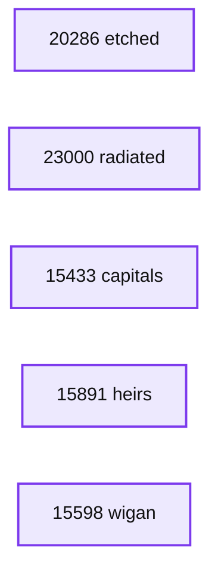
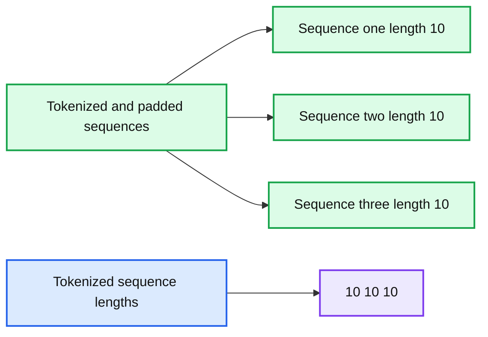
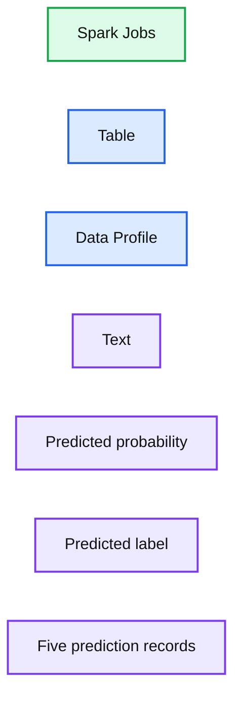
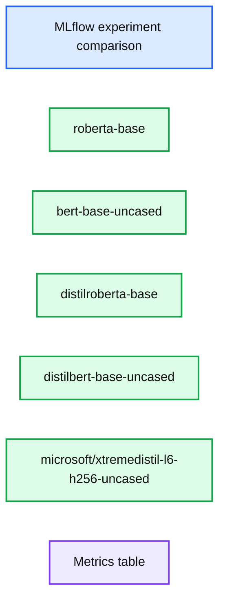
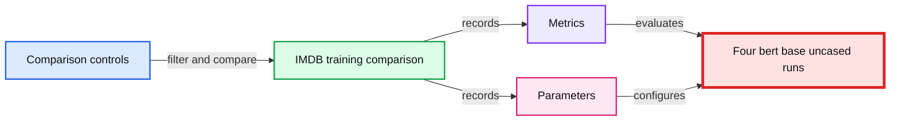
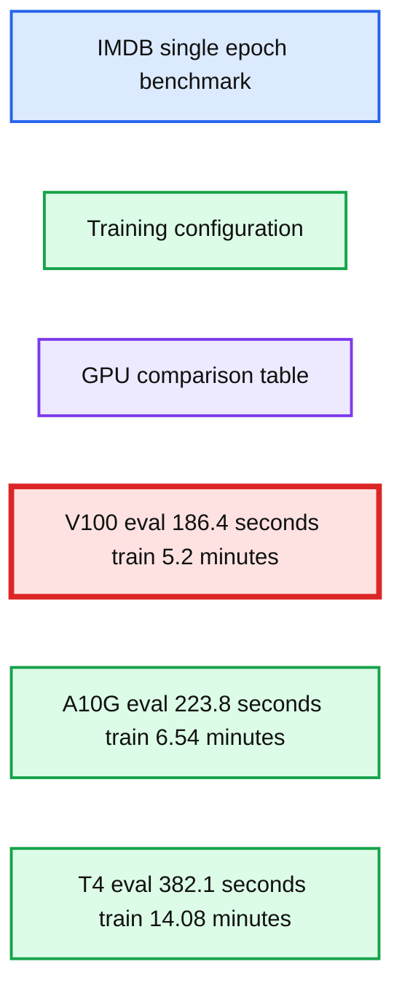

# Rapid NLP Development With Databricks, Delta, and Transformers

- Source: https://www.databricks.com/blog/rapid-nlp-development-databricks-delta-and-transformers
- Published: 2022-09-09
- Authors: Marshall Carter
- Categories: engineering, data-engineering
- Images: 12 total, 6 extracted as architecture

Free form text data can offer actionable insights unavailable in structured data fields. An insurance company may leverage its claims adjusters’ notes to understand characteristics of a claim that are otherwise unknowable. An IT division may efficiently analyze support ticket requests to route them to the proper in-depth team. Generating this level of value from free-form text can be challenging but a family of models, referred to as transformer models, provide a powerful toolset that enterprise data science practitioners can easily leverage.

Transformer models use a neural network architecture called [self-attention](https://proceedings.neurips.cc/paper/2017/file/3f5ee243547dee91fbd053c1c4a845aa-Paper.pdf) that captures text semantics more effectively and efficiently than prior methods. They are also a form of [transfer learning](https://en.wikipedia.org/wiki/Transfer_learning), meaning they have been trained on large text corpuses by the model developers using techniques such as [masked language modeling](https://www.youtube.com/watch?v=mqElG5QJWUg) and next sentence prediction. The models are designed to generate [word embeddings](https://en.wikipedia.org/wiki/Word_embedding) that can be used for a wide variety of downstream tasks including text classification, the focus of this article.

This article provides a high-level overview of transformer models and considerations when training them. For more in depth implementation details, including integration with [Delta Lake](https://docs.databricks.com/delta/index.html) and [Managed MLflow](https://www.databricks.com/product/managed-mlflow), see the [solution accelerator](https://github.com/marshackVB/rapid_nlp_blog).

## Getting started with transformers

[Hugging Face](https://huggingface.co/course/chapter1/1) is a company that focuses on making transformer models discoverable and accessible. It provides access to a wide variety of models and datasets. Using the [transformers library](https://huggingface.co/docs/transformers/index), which is maintained by Hugging Face, artifacts can be downloaded and used within your Databricks Workspace. The library is included in Databricks ML Runtime version 10.4 and above and can be [pip installed](https://pypi.org/project/transformers/) in earlier versions.

To start using the library, pick a transformer architecture, such as [bert-base-uncased](https://huggingface.co/bert-base-uncased), from the Hugging Face [model hub](https://huggingface.co/models). Then, execute the code below to download its tokenizer and model.

## Data pre-processing with tokenizers

The tokenizer performs several pre-processing steps. First, it splits text into tokens and maps tokens to the model’s vocabulary. [BERT’s](https://arxiv.org/abs/1810.04805) vocabulary consists of 30,522 entries of words, pieces of words, numbers, punctuation and symbols. The model also contains special tokens that capture information such as the start of an observation ([CLS]) and the separation of sequences ([SEP]).

**Summary:** The image shows five token IDs mapped to their corresponding BERT vocabulary tokens.

**Components:**

- Token ID 20286 mapped to etched
- Token ID 23000 mapped to radiated
- Token ID 15433 mapped to capitals
- Token ID 15891 mapped to heirs
- Token ID 15598 mapped to wigan

**Flows:**

- none

**Numbers:** 20286, 23000, 15433, 15891, 15598

source image: https://www.databricks.com/sites/default/files/inline-images/db-289-blog-img-12.jpg

The first handful of token ids and tokens from BERT’s vocabulary as well as the special tokens.

If a token does not exist within BERT’s vocabulary, such as the token “Databricks”, it is split into pieces to make a match.

A tokenized sequence generates a list of token ids that can be mapped back to BERT’s vocabulary and special tokens.

Tokenizers also perform truncation and padding of input sequences. Each model has a maximum accepted tokenized sequence length. In the case of BERT and many other models, that length is 512 tokens. When tokenizing an input text, all resulting tokens generated after the first 512 will be dropped, or ‘truncated’.

Additionally, token sequences will be ‘padded’. Transformer models are trained on batches of data rather than the entire training data set at once. Each batch must be of the same length, though the length of text observations can vary widely. Some tokenized sequences may be much longer than 512 elements, others may be much shorter. Padding adds zeros to the tokenized sequences when necessary to create uniform lengths. This zero value represents the token id for another special token in BERT’s vocabulary, [PAD].

*Tokenized and padded text sequences in the same processing step*

**Summary:** Tokenized text sequences are padded to a uniform length of 10 elements.

**Components:**

- Tokenized and padded sequences
- Tokenized sequence lengths

**Flows:**

- none visible

**Numbers:** 101, 19081, 2024, 3733, 2000, 2448, 2006, 2951, 25646, 102, 2064, 3191, 2013, 7160, 0, 3928, 10, 10, 10

source image: https://www.databricks.com/sites/default/files/inline-images/db-289-blog-img-9.png

Tokenized and padded text sequences in the same processing step

A tokenizer’s truncation and padding behavior are configurable and there are [various strategies](https://huggingface.co/docs/transformers/pad_truncation) that can be tested and compared. Truncating to shorter lengths speed’s training time; though if longer sequences are common, the loss of information could hinder predictive performance. Consider [dynamic padding](https://www.youtube.com/watch?v=7q5NyFT8REg) as a good, general strategy—this technique pads sequences during model training rather than tokenization. Since the only requirement is that records within a batch are of the same length, dynamic padding pads each batch to the length of the longest sequence in the batch, keeping the number of padded tokens to a minimum.

## Classifying text using word embeddings

The tokenized text can be passed directly to the model to generate word embeddings, with one embedding for each input token, including the special tokens. These embeddings can then be used for a variety of natural language processing tasks.

Embedding lengths and dimensions generated by the model’s last layer (last hidden state)

For text classification, for example, it is common to use only the embedding associated with each observation's special [CLS] token. That embedding can be passed to a feed-forward neural network that classifies the text into a set of user-defined categories. The transformers library implements this architecture out of the box through its [AutoModelForSequenceClassification](https://huggingface.co/transformers/v3.0.2/model_doc/auto.html#automodelforsequenceclassification) class. This class allows the user to pass a transformer model name and a ‘classification head’ will be attached to the end of the model’s neural network layers. Simply specify the number of labels to classify. As an example, the [banking77 dataset](https://huggingface.co/datasets/banking77) available on the Hugging Face data hub contains banking-related questions classified into 77 intents. Therefore, the model’s num_labels parameter is set to 77.

A BERT transformer model with an added classification head for multi-class classification

The model can then be fine-tuned on a training dataset. During training, the learnable parameters of all layers in the network can be updated, including the layers that generate the embeddings and the classification head. From this fine-tuned model, we can generate predicted labels and their probabilities.

*Predictions generated from a transformer model fine tuned on the banking77 dataset.*

**Summary:** A Databricks table displays five banking77 text predictions with confidence probabilities and predicted intent labels.

**Components:**

- Spark Jobs section
- Table tab
- Data Profile tab
- Text column
- Predicted probability column
- Predicted label column
- Five prediction records

**Flows:**

- none

**Numbers:** 1, 2, 3, 4, 5, 0.9696, 0.9347, 0.9576, 0.8902, 0.9243

source image: https://www.databricks.com/sites/default/files/inline-images/db-289-blog-img-1.jpg

Predictions generated from a transformer model fine tuned on the banking77 dataset.

See the [solution accelerator](https://github.com/marshackVB/rapid_nlp_blog) for a detailed model training implementation using the banking77 dataset and others.

**Optimizing transformer models**

Transformer models are large and computationally intensive to train and apply for inference. The BERT model discussed in this article has 110 million learnable parameters. Some more recent architectures are vastly larger; as an extreme example, GPT-3, has 175 billion parameters. Fortunately, there are methods to decrease model training time and speed up inference.

A family of models, referred to as [distilled models](https://arxiv.org/abs/1910.01108), reduces the model size and computational complexity by compressing a larger model, a teacher, into a smaller version, a student. In the Hugging Face model hub, these models typically include ‘distil’ in their name, for example, [distilbert-base-uncased](https://huggingface.co/distilbert-base-uncased). Distilled models can be fine tuned more quickly and can score records much faster than their larger teachers. The below [Experiment](https://docs.databricks.com/applications/mlflow/tracking.html) compares models on the [IMDB dataset](https://huggingface.co/datasets/imdb), which includes movie reviews and their sentiment. Notice the large variation in model size, GPU memory consumption, training time, and time to score all evaluation dataset records. Interestingly, predictive performance is similar across the models.

*Model comparisons using the default transformer Trainer arguments and a training and evaluation batch size of 16.*

**Summary:** Benchmark table comparing five transformer models on IMDB sentiment classification across accuracy, evaluation time, GPU memory, model size, and training time.

**Components:**

- MLflow experiment comparison interface
- roberta-base model
- bert-base-uncased model
- distilroberta-base model
- distilbert-base-uncased model
- microsoft/xtremedistil-l6-h256-uncased model
- Metrics table with model performance and resource measurements

**Flows:**

- none

**Numbers:**

- 5 matching runs
- roberta-base: best model epoch 1, eval F1 0.941, eval seconds 330.8, GPU memory used 14413 MB, model size 475.6 MB, train minutes 36.78
- bert-base-uncased: best model epoch 2, eval F1 0.928, eval seconds 328.8, GPU memory used 14267 MB, model size 417.7 MB, train minutes 36.92
- distilroberta-base: best model epoch 2, eval F1 0.928, eval seconds 211.7, GPU memory used 8343 MB, model size 313.3 MB, train minutes 31.44
- distilbert-base-uncased: best model epoch 2, eval F1 0.923, eval seconds 213.1, GPU memory used 8035 MB, model size 255.4 MB, train minutes 20.87
- microsoft/xtremedistil-l6-h256-uncased: best model epoch 3, eval F1 0.922, eval seconds 64.15, GPU memory used 4613 MB, model size 48.7 MB, train minutes 12.93

source image: https://www.databricks.com/sites/default/files/inline-images/db-289-blog-img-2.jpg

Model comparisons using the default transformer Trainer arguments and a training and evaluation batch size of 16.

In addition to distillation, [training configuration and GPU type](https://huggingface.co/docs/transformers/performance) have a large impact. Training and inference times can be reduced considerably by adjusting the settings in the transformer's [Trainer](https://huggingface.co/docs/transformers/main_classes/trainer#transformers.TrainingArguments) class, which governs the fine-tuning process. When fine-tuning a model on the IMDB data set, adjusting settings related to batch size, [numerical precision](https://huggingface.co/docs/transformers/perf_train_gpu_one#floating-data-types) during training (referred to as fp16 below), and [gradient accumulation steps](https://huggingface.co/docs/transformers/perf_train_gpu_one#gradient-accumulation) led to major reductions in training and inference times over a single training epoch.

*Comparing different training configurations over a single epoch.*

**Summary:** The table compares four BERT training configurations for the IMDB dataset over one training epoch using metrics and parameters.

**Components:**

- IMDB training comparison
- Run name
- Metrics: eval_f1, eval_seconds, gpu_memory_used_mb, train_minutes
- Parameters: fp16, gradient_accumulation_steps, group_by_length, per_device_eval_batch_size
- Four bert-base-uncased runs
- Filtering and comparison controls

**Flows:**

- Training configurations -> Metrics: measured evaluation and training results
- Training configurations -> Parameters: recorded training settings
- Filter controls -> Matching runs: narrows displayed results

**Numbers:** 1 epoch; 4 matching runs; eval_f1 values 0.934, 0.939, 0.939, 0.936; eval_seconds values 185.1, 109.1, 109.4, 337.2; gpu_memory_used_mb values 11143, 14881, 11235, 14267; train_minutes values 5.19, 5.94, 6.87, 18.57; gradient_accumulation_steps values 4, 1, 1, 1; per_device_eval_batch_size values 16, 24, 16, 16; fp16 values True, True, True, False; group_by_length values True, True, True, False; 4 columns of metrics; 4 parameter columns.

source image: https://www.databricks.com/sites/default/files/inline-images/db-289-blog-img-3.jpg

Comparing different training configurations over a single epoch.

In addition, the choice of GPU type impacts training and inference times.

*The NVIDIA V100 GPU type provided fastest training for the IMDB dataset though it is also the most expensive.*

**Summary:** The benchmark table compares single epoch IMDB training performance across V100, A10G, and T4 GPUs.

**Components:**

- IMDB training benchmark using fp16, length grouping, and gradient accumulation
- Databricks run comparison table
- Metrics: eval seconds, total GPU memory, used GPU memory, and training minutes
- Parameters: GPU type
- Runs: bert-base-uncased

**Flows:**

- none

**Numbers:**

- Single training epoch
- fp16 = True
- group_by_length = True
- gradient_accumulation_steps = 4
- per_device_train_batch_size = 16
- per_device_eval_batch_size = 16
- 3 matching runs
- V100: eval 186.4 seconds, total memory 16160 MB, used memory 11143 MB, training 5.2 minutes
- A10G: eval 223.8 seconds, total memory 22731 MB, used memory 11749 MB, training 6.54 minutes
- T4: eval 382.1 seconds, total memory 15109 MB, used memory 10974 MB, training 14.08 minutes
- Search filter: rmse < 1
- Search filter: model = tree

source image: https://www.databricks.com/sites/default/files/inline-images/db-289-blog-img-4.jpg

The NVIDIA V100 GPU type provided fastest training for the IMDB dataset though it is also the most expensive.

Although a GPU-backed instance is required for training and also speeds up inference considerably, CPU inference is an option. Consider using distilled models with [quantization](https://pytorch.org/docs/stable/quantization.html) to boost CPU inference speeds. Quantization uses faster, less precise numerical representations to reduce inference latency. It can be easily applied directly to fine-tuned transformer models.

Quantizing the linear layers of a distilbert-base-uncased model fine tuned on the banking77 dataset reduced its size by about half. CPU-based inference latency was reduced by two-thirds, while the model’s F1 score on the test dataset declined by only 0.01.

## Pre-trained and pre-fine tuned

In some cases, it may not be necessary to fine-tune your own text classification model because an out-of-the-box option already exists. For example, the model, [distilbert-base-uncased-finetuned-sst-2-english](https://huggingface.co/distilbert-base-uncased-finetuned-sst-2-english), consists of a pre-trained distilbert-base-uncased model that was fine-tuned on the [SST-2 dataset](https://huggingface.co/datasets/sst2), which contains text and sentiment classifications. The model and tokenizer can be loaded in the form of a [pipeline](https://huggingface.co/docs/transformers/main_classes/pipelines) and applied directly to raw text without any additional training. A [prior Databricks blog](https://www.databricks.com/blog/2021/10/28/gpu-accelerated-sentiment-analysis-using-pytorch-and-huggingface-on-databricks.html) dives deeper into this topic.

Generating sentiment predictions from a fine-tuned classification pipeline

## Conclusion

Transformers are powerful and accessible, and the Databricks Lakehouse Platform excels at training and managing this family of models. Delta Lake provides the necessary data foundation for efficient and accurate machine learning and analytics. The flexibility to provision [Clusters](https://docs.databricks.com/clusters/index.html) through a friendly user interface, including GPU-backed instances equipped with the [Machine Learning Runtime](https://www.databricks.com/product/machine-learning-runtime), empowers Data Scientists to train transformers right away. Also, experimentation with different models and training configurations is easily handled by [Managed MLFlow](https://www.databricks.com/product/managed-mlflow); results are clearly documented and shareable, work is never lost, and final models are easily deployed.

To get started training and comparing transformer models, [clone this repository](https://github.com/marshackVB/rapid_nlp_blog) as a Repo in your Databricks Workspace.
