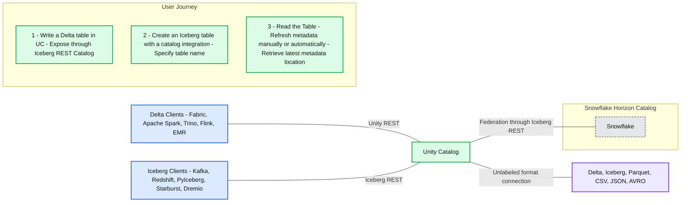

# How to Read Unity Catalog Tables in Snowflake, in 3 Easy Steps

*Unity Catalog now works with Snowflake, Dremio, Starburst, EMR, and more - to help you unify data and AI*

- Source: https://www.databricks.com/blog/read-unity-catalog-tables-in-snowflake
- Published: 2024-12-09
- Authors: Aniruth Narayanan, Randy Pitcher, Susan Pierce, Ryan Johnson
- Categories: engineering, data-engineering
- Images: 2 total, 1 extracted as architecture

**Key takeaways**

- Learn how to connect to Unity Catalog's Iceberg REST APIs from Snowflake to read a single source data file as Iceberg.

**Update**: This blog has been updated to reflect Snowflake's support for catalog-vended credentials.

Databricks pioneered the open data [lakehouse architecture](https://www.databricks.com/product/data-lakehouse) and has been at the forefront of format interoperability. We’re excited to see more platforms adopt the lakehouse architecture and start to embrace interoperable formats and standards. Interoperability lets customers reduce expensive data duplication by using a single copy of data with their choice of analytics and AI tools for their workloads. In particular, a common pattern for our customers is to use Databricks’ [best-in-class ETL price/performance](https://www.databricks.com/blog/2023/04/14/how-we-performed-etl-one-billion-records-under-1-delta-live-tables.html) for upstream data, accessing it from BI and analytics tools, such as Snowflake.

[Unity Catalog](http://unitycatalog.io/) is a unified and open governance solution for data and AI assets. A key feature of Unity Catalog is its implementation of the Iceberg REST Catalog APIs. This makes it simple to use an Iceberg-compliant reader without having to manually refresh your metadata location. 

In this blog post, we will cover why the Iceberg REST Catalog is useful and walk through an example of how to read Unity Catalog tables in Snowflake.

 

***Note: ***This functionality is available across cloud providers. The following instructions are specific to AWS S3, but it is possible to use other object storage platforms such as Azure Data Lake Storage (ADLS) or Google Cloud Storage (GCS).

 

**Summary:** Unity Catalog connects Delta and Iceberg clients to table formats and enables Snowflake to read Unity Catalog tables through Iceberg REST catalog federation.

**Components:**

- Delta Clients: Fabric, Apache Spark, Trino, Flink, and EMR.
- Unity REST: interface connecting Delta clients to Unity Catalog.
- Iceberg Clients: Kafka, Redshift, PyIceberg, Starburst, and Dremio.
- Iceberg REST: interface connecting Iceberg clients to Unity Catalog.
- Unity Catalog: central catalog for the displayed clients and data formats.
- Data formats: Delta, Iceberg, Parquet, CSV, JSON, and AVRO.
- Federation through Iceberg REST: connection between Unity Catalog and Snowflake Horizon Catalog.
- Snowflake Horizon Catalog: catalog containing the Snowflake component.
- Step 1, Write a Delta table in UC: tables are exposed via Unity Catalog's Iceberg REST Catalog.
- Step 2, Create an Iceberg table with a catalog integration: the Snowflake user creates an Iceberg table by specifying the table name.
- Step 3, Read the Table: Snowflake reads the table; metadata can be refreshed manually or automatically at a set interval, and the latest metadata file location is retrieved automatically from the catalog integration.

**Flows:**

- Delta Clients -> Unity Catalog: Unity REST connection.
- Iceberg Clients -> Unity Catalog: Iceberg REST connection.
- Unity Catalog -> Snowflake Horizon Catalog: federation through Iceberg REST.
- Unity Catalog -> Data formats: connection to the displayed formats; the line is unlabeled.

The visible connections have no arrowheads, so the directions above indicate relationships rather than explicit flow direction.

**Numbers:** 1, 2, and 3 are user journey step numbers. No numeric refresh interval is shown.

source image: https://www.databricks.com/sites/default/files/inline-images/ucblog.png

 

## Iceberg REST API Catalog Integration

Apache Iceberg™  maintains atomicity and consistency by creating new metadata files for each table change. This ensures that incomplete writes do not corrupt an existing metadata file. The Iceberg catalog tracks the new metadata per write. However, not all engines can connect to every Iceberg catalog, forcing customers to manually keep track of the new metadata file location.

Iceberg solves interoperability across engines and catalogs with the Iceberg REST Catalog API. The Iceberg REST catalog is a [standardized, open API specification](https://github.com/apache/iceberg/blob/main/open-api/rest-catalog-open-api.yaml) which is a unified interface for Iceberg catalogs, decoupling catalog implementations from clients.

Unity Catalog has implemented the Iceberg REST Catalog APIs since the launch of Universal Format (UniForm) in 2023. Unity Catalog exposes the latest table metadata, guaranteeing interoperability with any Iceberg client compatible with the Iceberg REST Catalog such as Apache Spark™, Apache Trino, and Snowflake. Unity Catalog’s Iceberg REST Catalog endpoints allow external systems to access tables and benefit from performance enhancements like [Liquid Clustering](https://docs.databricks.com/en/delta/clustering.html) and [Predictive Optimization](https://docs.databricks.com/en/optimizations/predictive-optimization.html), while Databricks workloads continue to benefit from advanced Unity Catalog features like [Change Data Feed](https://docs.delta.io/latest/delta-change-data-feed.html). In addition, the Unity Catalog Iceberg REST Catalog endpoints extend governance via [vended credentials](https://docs.databricks.com/en/data-governance/unity-catalog/access-open-api.html).

Snowflake’s [REST API catalog integration](https://docs.snowflake.com/en/user-guide/tables-iceberg-configure-catalog-integration-rest) lets you connect to Unity Catalog’s Iceberg REST APIs to retrieve the latest metadata file location. This means that with Unity Catalog, you can read tables directly in Snowflake. 

 

***Note:***** **As of writing, Snowflake’s support of the Iceberg REST Catalog is in Public Preview. However, Unity Catalog’s Iceberg REST APIs are Generally Available.

There are 3 steps to creating a REST catalog integration in Snowflake:

1. Enable UniForm on a Delta Lake table in Databricks to generate Iceberg metadata
2. Register Unity Catalog in Snowflake as your catalog
3. Create an Iceberg table in Snowflake so you can query your data

## **Getting Started**

We’ll start in Databricks, with our Unity Catalog-managed table, and we’ll ensure it can be read as Iceberg. Then, we’ll move to Snowflake to complete the remaining steps.

Before we start, there are a few components needed:

- A Databricks account with Unity Catalog (This is enabled by default for new workspaces)
- An AWS S3 bucket and IAM privileges
- A Snowflake account that can access your Databricks instance and S3

Unity Catalog namespaces follow a catalog_name.schema_name.table_name format. In the example below, we’ll use uc_catalog_name.uc_schema_name.uc_table_name for our Databricks table. 

## **Step 1: Enable UniForm on a Delta table in Databricks**

In Databricks, you can enable UniForm on a Delta Lake table. By default, new tables are managed by Unity Catalog. Full instructions are available in the [UniForm documentation](https://docs.databricks.com/en/delta/uniform.html) but are also included below.

For a new table, you can enable UniForm during table creation in your workspace:

If you have an existing table, you can do this via an ALTER TABLE command:

You can confirm that a Delta table has UniForm enabled in the Catalog Explorer under the Details tab, with the metadata location. It should look something like this:

## **Step 2: Register Unity Catalog in Snowflake**

While still in Databricks, [create a service principal](https://docs.databricks.com/en/dev-tools/auth/oauth-m2m.html) from the workspace admin settings and generate the accompanying secret and client ID. Instead of a service principal, you can also [authenticate with personal tokens](https://docs.databricks.com/en/dev-tools/auth/oauth-u2m.html) for debugging and testing purposes. We recommend using a service principal for development and production workloads. For this step, you will need your <deployment-name> and the values for your OAuth <client-id> and <secret> so you can authenticate the integration in Snowflake.

Now switch over to your Snowflake account.

***Note:** *There are a few naming differences between Databricks and Snowflake that may be confusing:

- A “catalog” in Databricks is a “warehouse” in the Snowflake Iceberg catalog integration configuration.
- A “schema” in Databricks is a “catalog_namespace” in the Snowflake Iceberg catalog integration.

You’ll see in the example below that the CATALOG_NAMESPACE value is uc_schema_name from our Unity Catalog table.

In Snowflake, [create a catalog integration for Iceberg REST catalogs](https://docs.snowflake.com/en/user-guide/tables-iceberg-configure-catalog-integration-rest#oauth). Following that process, you’ll create a catalog integration as below:

The REST API Catalog Integration also unlocks vended credentials and time-based automatic refresh.

Vended credentials include both a table’s storage location and a temporary access credential to access that location. This allows clients to access tables through the catalog without configuring the client’s direct access to the table’s storage location. We recommend using vended credentials to simplify and centralize governance in the catalog. In the above example, we configure Snowflake to use Unity Catalog’s vended credentials with the ACCESS_DELEGATION_MODE = VENDED_CREDENTIALS parameter in the REST_CONFIG object.

Currently, Snowflake only supports vended credentials for tables in AWS S3. For tables in Azure Data Lake Storage (ADLS) or Google Cloud Storage (GCS), Snowflake requires direct access to the table’s storage location with an [external volume](https://docs.snowflake.com/en/user-guide/tables-iceberg-configure-external-volume).

With automatic refresh, Snowflake will poll for the latest metadata location from Unity Catalog on a time interval defined for the catalog integration. However, automatic refresh is incompatible with manual refresh, requiring users to wait up to the time interval after a table update. The REFRESH_INTERVAL_SECONDS parameter configured on the catalog integration applies to all Snowflake Iceberg tables created with this integration. It is not customizable per table.

 

## **Step 3: Create an Apache Iceberg™  table in Snowflake**

In Snowflake, [create an Iceberg table](https://docs.snowflake.com/en/sql-reference/sql/create-iceberg-table-rest) with the previously created catalog integration to connect to the Delta Lake table. You can choose the name for your Iceberg table in Snowflake; it does not need to match the Delta Lake table in Databricks.

***Note:** *The correct mapping for the CATALOG_TABLE_NAME in Snowflake is the Databricks table name. In our example, this is uc_table_name. You do not need to specify the catalog or schema at this step, because they were already specified in the catalog integration. 

Optionally, you can [enable auto-refresh](https://docs.snowflake.com/en/user-guide/tables-iceberg-auto-refresh#create-an-iceberg-table-with-automated-refresh) using the catalog integration time interval by adding AUTO_REFRESH = TRUE to the command. Note that if auto-refresh is enabled, manual refresh is disabled.

You have now successfully read the Delta Lake table in Snowflake.

## **Finishing up: Test the Connection**

In Databricks, update the Delta table data by inserting a new row.

If you previously enabled auto-refresh, the table will update automatically on the specified time interval. If you did not, you can manually refresh by running ALTER ICEBERG TABLE <snowflake_table_name> REFRESH.

*Note:* if you previously enabled auto-refresh, you cannot run the manual refresh command and will need to wait for the auto-refresh interval to complete to refresh the table.

We are thrilled by continued support for the lakehouse architecture. Customers no longer have to duplicate data, reducing cost and complexity. This architecture also allows customers to choose the right tool for the right workload.

The key to an open lakehouse is storing your data in an open format such as Delta Lake or Iceberg. Proprietary formats lock customers into an engine, but open formats give you flexibility and portability. No matter the platform, we encourage customers to always own their own data as the first step into interoperability. In the coming months, we will continue to build features that make it simpler to manage an open data lakehouse with Unity Catalog.
