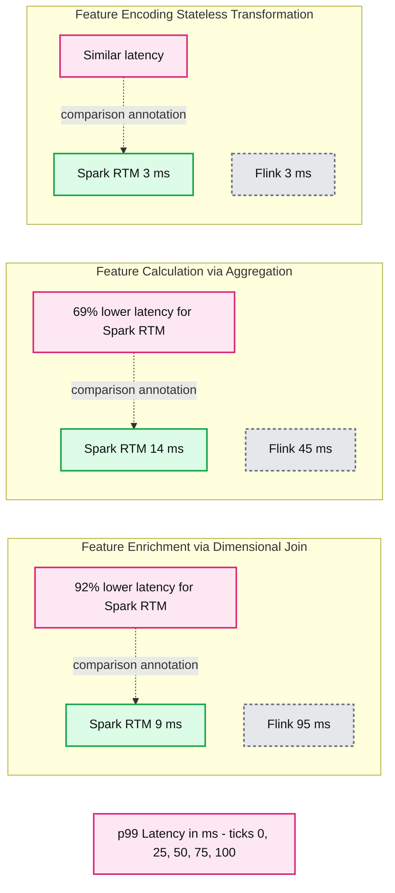

# Real-Time Mode: Ultra-low latency streaming on Spark APIs without a second engine

*Process streaming data in milliseconds on Apache Spark, without any of the overhead of Apache Flink*

- Source: https://www.databricks.com/blog/real-time-mode-ultra-low-latency-streaming-spark-apis-without-second-engine
- Published: 2026-03-02
- Authors: Navneeth Nair, Jerry Peng, Abhay Bothra
- Categories: product, data-engineering
- Images: 1 total, 1 extracted as architecture

**Key takeaways**

- Unification: Learn how Real-Time Mode (RTM) in Apache Spark unifies offline training and ultra-low-latency online feature engineering into a single, high-performance engine.
- Performance: Discover the re-architecture that enables ultra-low latency in Spark, with a performance analysis comparing Apache Spark RTM against Apache Flink.
- Simplicity & Adoption: RTM offers many operational advantages, including simplified migration, a unified API to prevent "logic drift," and real-world customer use cases.

*Editor's note: updated to include link with details on data sets and queries.*

Apache Spark Structured Streaming has long powered mission-critical data pipelines at scale, from streaming ETL to analytics and machine learning. But as operational use cases evolved, teams began demanding something more: sub-second latencies for applications such as fraud detection, personalization, anomaly detection, real-time alerting and reporting.

Historically, meeting these ultra-low latency requirements meant introducing specialized systems alongside Spark. With the introduction of Real-Time Mode in Spark Structured Streaming, that tradeoff is no longer necessary. In this blog, we explore how Spark simplifies real-time streaming architecture for common use cases such as feature engineering, eliminates long standing operational complexity, and delivers industry-leading performance.

## Real-time streaming no longer requires running multiple disparate systems

The ability to process and act on data in real-time is now a core requirement. Modern applications, especially AI agents, rely on a continuous stream of fresh context to function. If the underlying data is incomplete or lagging, the user experience suffers. Real-time performance is not only needed for traditional use cases such as fraud detection, but for every common interaction where a user expects precise, up-to-date responses. In this environment, latency directly impacts revenue, customer trust, and competitive advantage. 

Data teams building real-time streaming applications have historically had to manage two distinct data processing stacks: Apache Spark™ for large-scale analytics and specialized systems such as Apache Flink® or Kafka Streams for sub-second, latency sensitive applications. This fragmentation requires teams to maintain duplicated codebases, manage separate governance models, and hire specialized talent to tune and maintain engine-specific infrastructure.

Launched in public preview in August 2025, [Real-Time Mode (RTM) for Apache Spark Structured Streaming](https://www.databricks.com/blog/introducing-real-time-mode-apache-sparktm-structured-streaming) is designed to eliminate this friction. By fundamentally evolving the Spark execution engine, we have removed the need for a second system. This shift allows engineers to address the entire spectrum of use cases—from high-throughput ETL to low-latency real-time apps—using the same Spark API they already know. This means less time managing infrastructure, and more time to focus on the business use case.

## Spark can now process events in milliseconds; up to 92% faster than Flink 

Real-Time Mode (RTM) introduced a new optimized execution engine that enables Spark to deliver consistent sub-second latencies. To evaluate performance, we conducted a side-by-side comparison between Spark RTM and Apache Flink. The testing was based on real-time feature computation workloads we commonly see in production. These feature computation patterns are representative of most low-latency ETL use cases, such as fraud detection, personalization, and operational analytics.

We evaluated three common feature patterns:

- Feature encoding (stateless transformation): Truncating input rows and  encoding
- Feature enrichment (via join): Joining a stream with  a static table
- Feature calculation (via aggregation): GroupBy + Count aggregation 

The results demonstrate that Spark's evolved architecture provides a latency profile comparable to specialized streaming frameworks.

**Summary:** Apache Spark Real-Time Mode and Apache Flink are compared by p99 latency for feature enrichment, calculation, and encoding.

**Components:**
- Spark RTM: Apache Spark Real-Time Mode, represented by green bars.
- Flink: Apache Flink, represented by dark teal bars.
- Feature Enrichment via Dimensional Join: Spark RTM and Flink join benchmark.
- Feature Calculation via Aggregation: Spark RTM and Flink aggregation benchmark.
- Feature Encoding, Stateless Transformation: Spark RTM and Flink transformation benchmark.
- Latency callouts: 92% lower latency, 69% lower latency, and similar latency for Spark RTM.
- Horizontal axis: p99 latency in milliseconds.

**Flows:**
- 92% lower latency callout -> Spark RTM feature enrichment bar: dashed comparison annotation.
- 69% lower latency callout -> Spark RTM feature calculation bar: dashed comparison annotation.
- Similar latency callout -> Spark RTM feature encoding bar: dashed comparison annotation.

**Numbers:**
- Feature enrichment: Spark RTM 9 ms; Flink 95 ms; callout states 92% lower latency for Spark RTM.
- Feature calculation: Spark RTM 14 ms; Flink 45 ms; callout states 69% lower latency for Spark RTM.
- Feature encoding: Spark RTM 3 ms; Flink 3 ms.
- Metric: p99 latency, in ms.
- Axis ticks: 0, 25, 50, 75, 100.

source image: https://www.databricks.com/sites/default/files/inline-images/2026-02-RTM-blog-1200x628.png

*For more information on the data sets and queries referenced above, see this *[*GitHub repository*](https://github.com/databricks-solutions/latency-benchmarks)*.*

This performance is enabled by three key technical innovations in RTM:

- **Continuous data flow:** Data is processed as it arrives instead of discretized, periodic chunks.
- **Pipeline scheduling:** Stages run simultaneously without blocking, allowing downstream tasks to process data immediately without waiting for upstream stages to finish.
- **Streaming shuffle:** Data is passed between tasks immediately, bypassing the latency bottlenecks of traditional disk-based shuffles.

Together, these transform Spark into a high-performance, low-latency engine capable of handling the most demanding operational use cases.

## Teams operate lesser infrastructure, and move faster with Spark

While raw speed is essential, the true value of real-time mode is in its ability to eliminate the operational complexity that typically stalls building ultra-low latency pipelines. Spark RTM makes your architecture significantly simpler through three core advantages. To make this concrete, we describe these in the context of real time machine learning applications.

**Minimize "logic drift" between training and inference:** Real-time ML, like fraud detection, requires a seamless handoff between high-throughput batching (for model training) and low-latency streaming (for live inference). Spark is the preferred choice for data scientists for model training, and forcing a switch from Spark to Flink for inference would create a  business logic gap. You end up with one version of the logic in Spark for training and a completely different codebase in Flink for production. This replication of business logic  can be error prone and leads to logic drift, where your model is trained on one reality but scores on another. With Spark RTM, your transformation code remains identical, enabling you to productionize features faster and with great accuracy. 

**Freshness on-demand with a single-line code change:** Business requirements are rarely static. A feature pipeline that starts with a 1-minute SLA today might require sub-second latency tomorrow as the model's freshness needs evolve. Conversely, for many use cases, "going slower" (e.g., daily or hourly batches) is significantly more cost-effective when immediate freshness isn't required. Spark provides the room to grow and scale alongside your product. It enables  you to easily pivot your feature engineering strategy with a single-line code change. For instance, you can set your trigger to AvailableNow to run a pipeline on a daily or hourly schedule. When business needs shift, you can transition to continuous, ultra-low-latency streaming simply by switching to real-time mode: .trigger(RealTimeTrigger.apply()). In contrast, achieving this in Flink is a manual process. It often requires you to tune parallelism and orchestrate the shutdown and restart of compute resources just to match a new processing frequency. 

**Accelerate development: **RTM is built on the same Spark API that your team already knows. This eliminates the friction of maintaining multiple systems, allowing you to move faster by building and scaling real-time applications within a single, consistent environment.

## Customers are running several real-time applications on Spark

Early adopters are using RTM to power a range of low-latency applications, across industries. 

**Fraud Detection:** A leading digital asset platform computes dynamic risk features such as velocity checks and aggregate spend patterns from Kafka streams, updating their online feature store in under 200 milliseconds to block fraudulent transactions at the point of sale.

**Personalized Experiences:** An  e-commerce platform computes real-time intent features based on a user's current session, allowing models to refresh recommendations the moment a user interacts with a product.

**IoT monitoring:** A transport and logistics company ingests live telemetry to drive anomaly detection, moving from reactive to proactive decision-making in milliseconds.

**DraftKings**, one of North America’s largest sportsbook and fantasy sports services, uses RTM to power feature computation for their fraud detection models.

> “In live sports betting, fraud detection demands extreme velocity. The introduction of Real-Time Mode together with the transformWithState API in Spark Structured Streaming has been a game changer for us. We achieved substantial improvements in both latency and pipeline design, and for the first time, built unified feature pipelines for ML training and online inference, achieving ultra-low latencies that were simply not possible earlier.” —Maria Marinova, Sr. Lead Software Engineer, DraftKings

## Start building with Spark Real-Time Mode

The era of choosing between "easy" and "fast" is over. Why manage two engines, two security models, and two sets of specialized skills when one engine now does it all? RTM delivers the sub-second speed your real-time applications demand, with the architectural simplicity your team deserves. By removing the "operating  tax," you can finally focus on building value rather than managing infrastructure.

Ready to eliminate the complexity of your real-time stack?

- **Dive into the details:** Explore the [RTM documentation](https://docs.databricks.com/aws/en/structured-streaming/real-time) to understand the full technical specifications, supported sources and sinks, and example queries. You’ll find everything you need to enable the new trigger and configure your streaming workloads.
- **See it in action: **To go deeper into the engineering behind RTM, watch this [technical deep dive session](https://www.databricks.com/dataaisummit/session/real-time-mode-technical-deep-dive-how-we-built-sub-300-millisecond), which walks through the design and implementation.
