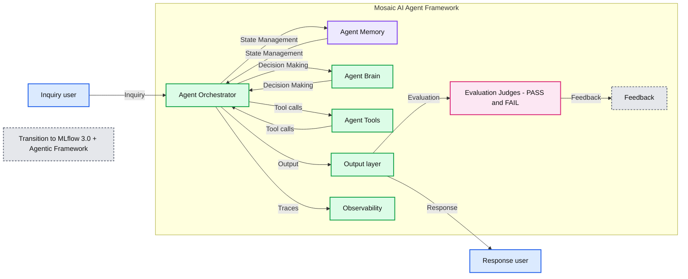
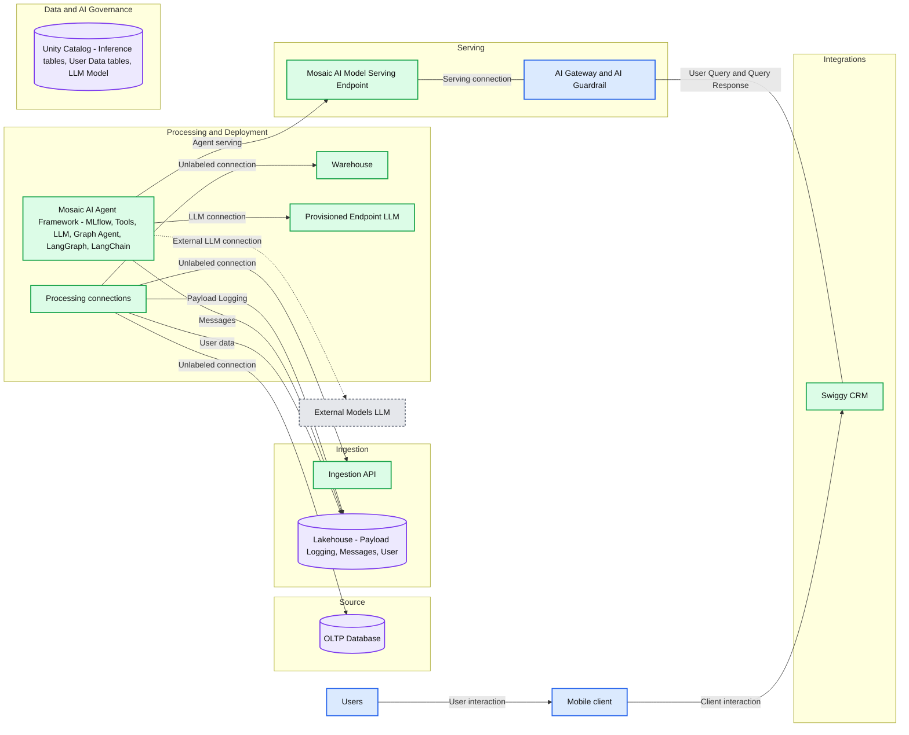

# Redefining Customer Support: Swiggy’s Enterprise-Scale AI Agent Built with Databricks

*How Swiggy transformed customer engagement with an enterprise-class AI Agent — achieving full automation, hyper-scalability, and industry-leading personalization.*

- Source: https://www.databricks.com/blog/redefining-customer-support-swiggys-enterprise-scale-ai-agent-built-databricks
- Published: 2025-10-21
- Authors: Gireesh Sreedhar, Shrinath Agarwal
- Categories: platform, product, engineering, data-science-machine-learning, industries, retail-and-consumer-goods, data-strategy, industry-insights, company, customers
- Images: 6 total, 6 extracted as architecture

**Key takeaways**

- Swiggy’s Transformation With Enterprise AI Agents: How Swiggy and Databricks designed and scaled a ground-breaking AI solution to automate and personalize customer support at a massive scale.
- Step-by-Step Journey to Production AI: The full innovation roadmap, from initial prototypes and model selection to advanced multi-agent systems, real-time monitoring, and seamless CRM integration.
- Key Results, Lessons, and Best Practices: The measurable impact on customer experience and operations, plus practical insights and lessons for deploying AI agent architectures in real-world enterprise environments.

## Raising the Bar: Swiggy’s Vision for Scalable, Intelligent Customer Support

Swiggy, India’s leading on-demand delivery platform, is dedicated to continually elevating operational efficiency and customer experience. While its rule-based engine provided a solid foundation for scalable support, Swiggy saw opportunities for greater personalization, adaptive context handling, and flexibility as its customer base rapidly expanded. Seizing this momentum, Swiggy partnered with Databricks to design and launch an enterprise-class AI Solution — delivering instant, empathetic, and hyper-scalable support that sets a new benchmark for intelligent customer engagement.

This blog explores the innovation journey, technical breakthroughs, and strategic business value achieved — offering insights into the future of intelligent, scalable customer support in digital commerce.

## The Challenge: Why Legacy Approaches No Longer Fit

Swiggy, headquartered in Bangalore, delivers millions of restaurant orders each day across India, reflecting its commitment to seamless and delightful customer experiences at scale.  As the platform rapidly expanded, inquiry volumes and complexity rose sharply.

Swiggy places customer satisfaction at the heart of its operations and views this challenge as an opportunity to enhance the customer experience by combining human expertise with AI.

### Challenges:

-

Scalability challenges exist, as rule-based workflows require more manual oversight and lack the flexibility to adapt to sudden demand spikes.

-

Difficulty delivering personalized and contextually relevant support, as the rule-based system lacked personalization and context awareness.

-

Limited agility in updating or expanding support workflows makes deploying new solutions quickly for evolving customer needs difficult.

-

Delivery of generic, impersonal responses, with the rule-based engine unable to effectively handle complex or nuanced inquiries. Rule-based systems’ rigid, one-size-fits-all responses.

### Objectives:

-

Achieve always-on instant support with a human-like touch

-

Automate handling of the maximum number of queries possible

-

Reduce reliance on, and costs associated with, human agents by reducing direct human intervention and moving to human-in-the-loop

-

Seamlessly absorb demand spikes without manual intervention

-

Personalize and humanize every customer interaction

-

Reduce average handling time (AHT)

### **Experimentation and Rapid Prototyping: Swiggy’s AI Agent Journey**

Faced with an uncharted landscape with few proven templates, Swiggy and Databricks adopted an agile, iterative prototyping approach, rapidly leveraging state-of-the-art advances in large language models (LLMs) and agent frameworks. Instead of starting with a complex architecture, we began with mature and simple architectures for POC. The limitations were identified with each iteration, and the architecture and technology refinements were made until the technical and functional objectives were met.

The experimentation journey below shows the solution's evolution and how it adapted to accelerated technological change, taking advantage of the latest technologies to improve and meet business objectives.

**Summary:** Swiggy’s experimentation journey progresses from two-tier LLM intent identification and response through RAG, agent orchestration, model evaluation, and tuning to a multi-agent solution.

**Components:**

- Two-tier intent identification and response with LLM: Uses an LLM to identify the user’s goal and respond.
- Intent identification and response with RAG-based pipeline: Uses RAG to identify the user’s goal and respond with augmentation.
- Agent AI framework experimentation: Explores orchestration for the agent; no specific framework is named.
- Agent’s LLM evaluation and selection: Uses Mosaic AI Playground to select the agent’s model.
- Agent evaluation and tuning: Uses MLflow and the Databricks Evaluation framework to fit the agent to its tasks.
- Multi-agent architecture: Uses multiple agents working together to handle distinct tasks.

**Flows:**

- Two-tier LLM response -> RAG-based pipeline: Experimentation progresses to augmented responses.
- RAG-based pipeline -> Agent AI framework experimentation: Experimentation progresses to agent orchestration.
- Agent AI framework experimentation -> LLM evaluation and selection: Experimentation progresses to model selection.
- LLM evaluation and selection -> Agent evaluation and tuning: Experimentation progresses to task fitness.
- Agent evaluation and tuning -> Multi-agent architecture: Experimentation progresses to collaborating agents.

The connecting lines indicate journey progression, rather than runtime data transfers.

**Numbers:** Two tiers, written as “Two tier”; no other numbers, units, percentages, or sizes are visible.

```mermaid
%% Experimentation journey from simple LLM to multi-agent solution
flowchart LR
    A[Two-tier intent identification and response with LLM]
    B[Intent identification and augmented response with RAG pipeline]
    C[Agent AI framework experimentation for orchestration]
    D[Agent LLM evaluation and selection with Mosaic AI Playground]
    E[Agent evaluation and tuning with MLflow and Databricks Evaluation framework]
    F[Multi-agent architecture for distinct tasks working together]

    A -->|Add augmentation| B
    B -->|Explore orchestration| C
    C -->|Evaluate and select LLM| D
    D -->|Evaluate and tune agent| E
    E -->|Multiple agents collaborate| F

    classDef client fill:#dbeafe,stroke:#2563eb,stroke-width:2px,color:#111
    classDef service fill:#dcfce7,stroke:#16a34a,stroke-width:2px,color:#111
    classDef store fill:#ede9fe,stroke:#7c3aed,stroke-width:2px,color:#111
    classDef cache fill:#fef3c7,stroke:#d97706,stroke-width:2px,color:#111
    classDef queue fill:#cffafe,stroke:#089b2,stroke-width:2px,color:#111
    classDef critical fill:#fee2e2,stroke:#dc2626,stroke-width:4px,color:#111
    classDef external fill:#e5e7eb,stroke:#6b7280,stroke-width:2px,color:#111,stroke-dasharray:4 3
    classDef decision fill:#fce7f3,stroke:#db2777,stroke-width:2px,color:#111

    class A,B,F service
    class C,D,E decision
```

source image: https://www.databricks.com/sites/default/files/inline-images/image5_30.png

### **Key Phases**

**1. Two-Tier Intent + LLM Response Model:**
The journey started with a two-layered pipeline architecture with an LLM as the intelligent layer.  
The first layer, the Intent Identification Layer, primarily determines the underlying goal or purpose behind a user's input — what the user wants to achieve by interacting with the agent (e.g., order status, refund request, greeting, gratitude, etc.). A basic prompt-based intent classification using LLM was used for intent identification. The second layer, Response Formatting Layer, primarily aims to generate structured and business-relevant responses based on the identified Intent and order-related information collected from backend systems. The response is formatted into a clear, contextually appropriate and user-friendly response.

**Summary:** A two-tier customer support pipeline uses an LLM to identify inquiry intent, processes that intent with backend user and order data, and formats a response for the user.

**Components:**
- Inquiring user: mobile client.
- Large Language Model: LLM-based intent classification.
- Intent classification, labeled “Indent Classification”: intent categories including Order Status, Refund, Greeting, Help Request, Gratitude, and Escalation.
- Transformation Pipeline: processing technology unspecified.
- Backend System: supplies user and order data; technology unspecified.
- Response Formatter: response formatting technology unspecified.
- Receiving user: mobile client.

**Flows:**
- Inquiring user -> Large Language Model: inquiry.
- Large Language Model -> Intent classification: identified intent.
- Intent classification -> Transformation Pipeline: intent.
- Transformation Pipeline -> Backend System: bidirectional exchange labeled user and order data.
- Backend System -> Transformation Pipeline: user and order data.
- Transformation Pipeline -> Response Formatter: output for response formatting.
- Response Formatter -> Receiving user: response.

**Numbers:** “Two tier” in the bottom caption; no other numbers, units, percentages, or sizes.

```mermaid
%% Two-tier intent identification and response formatting with an LLM
flowchart LR
    A[Inquiring user on mobile] -->|Inquiry| B[Large Language Model intent classification]
    B -->|Identified intent| C[Intent classification categories]
    C -->|Intent| D[Transformation Pipeline]
    D -->|User and order data exchange| E[Backend System]
    E -->|User and order data| D
    D -->|Format response| F[Response Formatter]
    F -->|Response| G[Receiving user on mobile]

    classDef client fill:#dbeafe,stroke:#2563eb,stroke-width:2px,color:#111
    classDef service fill:#dcfce7,stroke:#16a34a,stroke-width:2px,color:#111
    classDef store fill:#ede9fe,stroke:#7c3aed,stroke-width:2px,color:#111
    classDef cache fill:#fef3c7,stroke:#d97706,stroke-width:2px,color:#111
    classDef queue fill:#cffafe,stroke:#0891b2,stroke-width:2px,color:#111
    classDef critical fill:#fee2e2,stroke:#dc2626,stroke-width:4px,color:#111
    classDef external fill:#e5e7eb,stroke:#6b7280,stroke-width:2px,color:#111,stroke-dasharray:4 3
    classDef decision fill:#fce7f3,stroke:#db2777,stroke-width:2px,color:#111
    class A,G client
    class B,C,D,E,F service
```

source image: https://www.databricks.com/sites/default/files/inline-images/image2_57.png

LLM-driven intent detection and response formatting enabled quick wins, but hit limits in context handling and extensibility.

**2. Addition of RAG (Retrieval-Augmented Generation):**
The journey of the two-layered pipeline continued with the addition of the RAG pipeline to the intelligence layer. This approach enhanced the LLM by providing additional context based on retrievals, which is expected to improve the outcomes. This approach has serious limitations as follows:

-

**Hardcoded Logic:** Each intent required manual branching, making the system rigid and challenging to extend for new workflows.

-

**Lack of Context Retention:** The RAG approach was stateless, leading to context loss in multi-turn conversations and making it unsuitable for scenarios requiring follow-up actions or escalation.

-

**No Feedback Loop:** There was no mechanism to learn from previous interactions or improve over time.

**Summary:** Customer inquiries pass through RAG-assisted intent identification, classification, a transformation pipeline connected to backend data, and response formatting.

**Components:**
- Customer sending inquiry: mobile client; technology unspecified.
- Intent identification: brain icon representing intent processing; model unspecified.
- RAG: retrieval storage represented by a database icon; database technology unspecified.
- Indent Classification: label shown above intent categories including Order Status, Refund, Greeting, Help Request, Escalation, and Gratitude; classifier technology unspecified.
- Transformation Pipeline: intent processing with user and order data; technology unspecified.
- BACKEND SYSTEM: connected data and system resources; technologies unspecified.
- Response Formater: formats the response; technology unspecified.
- Customer receiving response: mobile client; technology unspecified.

**Flows:**
- Customer sending inquiry -> Intent identification: Inquiry.
- Intent identification -> Indent Classification: Identified Intent.
- Intent identification -> RAG: Search and retrieve request.
- RAG -> Intent identification: Retrieved information.
- Indent Classification -> Transformation Pipeline: Intent.
- Transformation Pipeline -> BACKEND SYSTEM: User and order data exchange.
- BACKEND SYSTEM -> Transformation Pipeline: User and order data exchange.
- Transformation Pipeline -> Response Formater: Format Response.
- Response Formater -> Customer receiving response: Response.

**Numbers:** none

source image: https://www.databricks.com/sites/default/files/inline-images/image1_67.png

```mermaid
%% Intent identification and response with RAG
flowchart LR
    A[Customer sending inquiry] -->|Inquiry| B[Intent identification]
    B -->|Identified Intent| C[Indent Classification]
    B -->|Search and retrieve| D[RAG]
    D -->|Retrieved information| B
    C -->|Intent| E[Transformation Pipeline]
    E -->|User and order data| F[BACKEND SYSTEM]
    F -->|User and order data| E
    E -->|Format Response| G[Response Formater]
    G -->|Response| H[Customer receiving response]

    classDef client fill:#dbeafe,stroke:#2563eb,stroke-width:2px,color:#111
    classDef service fill:#dcfce7,stroke:#16a34a,stroke-width:2px,color:#111
    classDef store fill:#ede9fe,stroke:#7c3aed,stroke-width:2px,color:#111
    classDef cache fill:#fef3c7,stroke:#d97706,stroke-width:2px,color:#111
    classDef queue fill:#cffafe,stroke:#0891b2,stroke-width:2px,color:#111
    classDef critical fill:#fee2e2,stroke:#dc2626,stroke-width:4px,color:#111
    classDef external fill:#e5e7eb,stroke:#6b7280,stroke-width:2px,color:#111,stroke-dasharray:4 3
    classDef decision fill:#fce7f3,stroke:#db2777,stroke-width:2px,color:#111
    class A,H client
    class B,C,E,F,G service
    class D store
```

**3. Agentic AI Transition:**
The limitations of the simple LLM and RAG approach, especially around extensibility, rules management and context management, prompted a shift to a more flexible framework, intelligent and autonomous solutions. This was when Agentic AI was taking baby steps, and we captured this opportunity to take Agentic AI as our next frontier for the POC. The immediate benefits we realised with Agent were

-

**Stateful Conversations: **enabled persistent memory, allowing the agent to maintain context across multiple turns.

-

**Modular Design:** The node-based graph execution allowed different intent handlers to be modeled as graph branches, improving maintainability and extensibility.

-

**Feedback Integration: **The new setup supported feedback loops, enabling the agent to learn and adapt from user interactions.

-

**Improved Reusability:** Decoupling logic from intent handling made adding new features and workflows easier.

**Summary:** The agent orchestrator coordinates memory, decision making, tools, output, evaluation, and observability within the Mosaic AI Agent Framework, with a transition to MLflow 3.0 + Agentic Framework.

**Components:**

- Inquiry user: client using a mobile phone; technology unspecified.
- Agent Orchestrator: central agent coordinator; technology unspecified.
- Agent Memory: state storage; technology unspecified.
- Agent Brain: decision-making component; technology unspecified.
- Agent Tools: database, code, and integration symbols; specific technologies unspecified.
- Output layer: response-producing component; technology unspecified.
- Evaluation Judges: evaluation component with PASS and FAIL outcomes; technology unspecified.
- Feedback: speech-bubble endpoint; technology unspecified.
- Observability: trace monitoring component; technology unspecified.
- Response user: client using a mobile phone; technology unspecified.
- Mosaic AI Agent Framework: labeled framework containing the agent components.
- Transition to MLflow 3.0 + Agentic Framework: caption identifying the framework transition.

**Flows:**

- Inquiry user -> Agent Orchestrator: Inquiry.
- Agent Orchestrator -> Agent Memory: State Management.
- Agent Memory -> Agent Orchestrator: State Management.
- Agent Orchestrator -> Agent Brain: Decision Making.
- Agent Brain -> Agent Orchestrator: Decision Making.
- Agent Orchestrator -> Agent Tools: Tool calls.
- Agent Tools -> Agent Orchestrator: Tool calls.
- Agent Orchestrator -> Output layer: Output.
- Output layer -> Evaluation Judges: Evaluation.
- Evaluation Judges -> Feedback: Feedback.
- Output layer -> Response user: Response.
- Agent Orchestrator -> Observability: Traces.

**Numbers:** 3.0, the MLflow version.

source image: https://www.databricks.com/sites/default/files/inline-images/image7_19.png

**4. Large Language Model (LLM) Evaluation and Selection**
The LLM acts as an Agent's brain that processes inputs received, understands its inputs and goals to be achieved. Since this is the most critical component of the Agent, evaluations were conducted on various models to determine the most suitable model capable of matching task requirements, performance, deployment requirements and at optimum cost. We leveraged Databricks [AI Playground](https://docs.databricks.com/aws/en/generative-ai/agent-framework/ai-playground-agent) for quick experiments with models for candidate model selection. The summary of LLM experiments is as follows:

-

**Model ‘family A’** - Most effective for conversational tasks, offering coherent multi-turn dialogue with minimal prompt engineering.

-

**Model ‘family B’** - Demonstrated strong reasoning capabilities and provided concise responses, but requires significant prompt tuning to align with conversational expectations, making them less ideal for general dialogue use cases.

-

**Model ‘family C’** - Demonstrated reasoning capabilities but failed in making tool calls, resulting in technical errors.

Based on experiment observations, Model ‘family C’ was eliminated after initial iterations, and we continued with ‘family A’ and ‘family B’. Even though ‘family B’ outperformed ‘family A’ in reasoning-heavy tasks, we selected ‘family A’ for its more natural conversational output and minimal prompt engineering efforts. 

**5. Agent Tuning and Robust Evaluation:**
Once the Agent framework and LLM choice are finalised, we enter the final phase of the Agent’s evaluation and tuning. Here, we focused on two key aspects: the Evaluation of the Agent and tuning/refining the Agent.

**Evaluation of the Agent **— Evaluation ensures the tasks charted for the Agent work, including functional, non-functional and behavioral aspects. The critical areas in the assessment for our task are Accuracy, Factual correctness, Stability (consistency and reliability), Cost, Latency, Response Style, Conversational coherence and Security.

The evaluation is made comprehensive and straightforward by [MLflow 3.0](https://docs.databricks.com/aws/en/mlflow3/genai/), providing advanced evaluation techniques using SDK and UI to define evaluation criteria specific to our needs. Features like built-in [AI judges](https://docs.databricks.com/aws/en/mlflow3/genai/eval-monitor/predefined-judge-scorers), custom [AI judges](https://docs.databricks.com/aws/en/mlflow3/genai/eval-monitor/custom-judge/), and a [review app](https://docs.databricks.com/aws/en/mlflow3/genai/human-feedback/expert-feedback/label-existing-traces) for human reviews cover all qualitative and quantitative metrics used to evaluate the quality of the experimentations.

**6. Tuning of Agent (prompt engineering) **- Providing effective prompts is crucial for directing LLM toward Agent's goals. Prompt is an area that needs a lot of iterations to get to a prompt that can maximise the agent's performance. We explored various prompt engineering techniques to improve the quality, consistency, and relevance. This included approaches such as Meta prompting, ReAct prompting (Reasoning and Acting), and Chain-of-Thought (CoT) prompting. Each technique was tested across multiple scenarios to assess its impact on reasoning ability, factual correctness, and conversational coherence.

These experiments helped us understand the strengths and trade-offs of each method — for example, Chain-of-Thought prompting improved step-by-step reasoning but increased response length, while ReAct prompting enhanced decision-making in interactive flows.

MLflow’s [Prompt Registry](https://docs.databricks.com/aws/en/mlflow3/genai/prompt-version-mgmt/prompt-registry/evaluate-prompts) simplifies prompt engineering by systematically evaluating different prompt versions to identify the most effective prompt for the agent.

**7. Multi-Agent Architecture:**
We enhanced the Agent with a multi-agent solution to support multi-intent conversations and better handle modular tasks. Here, a new agent instance is launched for each distinct disposition to enable clear functional separation, which improves the outcomes besides providing better code isolation, self-contained agents, flexibility to control and handle each task with a dedicated agent and improved operation, which can be controlled at the disposition level.

**8. Experimentation Platform:**
We harnessed the Databricks Data + AI Platform and Swiggy in-house experiment platform for rapid prototyping, evaluation and iteration of solutions. Platform features like AI playground (model experimentation), Model serving (out-of-box serving), and MLflow (tracing, prompt registry, out-of-box evaluation and monitoring) and the flexibility to serve any model provided us with the best features and flexibility to focus on achieving POC goals quickly.

## **Architecture and Deployment: End-to-End Integration for Scalability and Trust**

**1. System Architecture**
The high-level system architecture encompasses all system components and the end-to-end integration of Agent into the user journey. The key guiding principles and objectives we achieved were:

-

Seamless end-to-end integration of Agent with all systems, giving the user a seamless experience.

-

Scalable and elastic to handle traffic bursts and slumps with low latency at optimal cost.

-

Real-time granular tracing to track each step of the Agent to produce real-time operational and functional observability.

-

Real-time evaluation of the Agent’s output against evaluation criteria, flexibility to sample evaluation to keep cost and operational overhead in check.

-

Extensible to plug in new intents, responses, tools and flows for Agents.

-

Provide a framework for new plug-ins and new agents for new use cases.

-

A graceful fallback to human agents in case of a fallback needs to be identified.

-

Fall back capability at the component level, including auto LLM fall-backs.

-

Holistic state management is used to improve outcomes and manage failure recovery.

-

Component-level flexibility to scale and replace components to suit business and operational needs.
 

**2. Deployment **

**Summary:** Swiggy’s chatbot connects Lakehouse data and a Mosaic AI agent framework to model serving, AI Gateway guardrails, and Swiggy CRM, with Unity Catalog providing governance.

**Components:**

- Source: OLTP database.
- Ingestion API: API interface.
- Lakehouse: payload logging, user chat messages, Messages, and User data.
- Data Science & ML: processing and serving area.
- Warehouse: warehouse component.
- Mosaic AI Agent Framework: MLflow, tools, LLM, and Graph Agent, with LangGraph and LangChain.
- Provisioned Endpoint LLM: API-accessible LLM endpoint.
- External Models LLM: external LLM API.
- Mosaic AI Model Serving Endpoint: serving API.
- AI Gateway & AI Guardrail: gateway and guardrail components.
- Swiggy CRM: integration handling User Query and Query Response.
- Mobile client: phone interface.
- Users: chatbot users.
- Data & AI Governance: Unity Catalog covering inference tables, user data tables, and the LLM model.
- Source, Ingestion, Processing & Deployment, Serving, and Integrations: architectural stage labels.

**Flows:**

- Upper processing connection -> Ingestion API: unlabeled connection pointing into the API.
- Upper processing connection -> OLTP database: unlabeled connection pointing into the database.
- Processing connection -> Warehouse: unlabeled connection pointing into the warehouse.
- Processing connection -> Payload Logging: payload logging connection.
- Agent framework -> Messages: message connection pointing into Messages.
- Processing connection -> User: user data connection pointing into User.
- Mosaic AI Agent Framework -> Mosaic AI Model Serving Endpoint: agent serving connection.
- Mosaic AI Agent Framework -> Provisioned Endpoint LLM: LLM invocation connection.
- Mosaic AI Agent Framework -> External Models LLM: dotted external LLM connection.
- Mosaic AI Model Serving Endpoint -> AI Gateway & AI Guardrail: connecting line; direction is not explicitly marked.
- AI Gateway & AI Guardrail -> Swiggy CRM: User Query and Query Response connection; direction is not explicitly marked.
- Users -> Mobile client: user interaction.
- Mobile client -> Swiggy CRM: client interaction.

**Numbers:** none

source image: https://www.databricks.com/sites/default/files/inline-images/image3_58.png

The deployment phase primarily focused on providing the infrastructure, governance, security, monitoring, observability, online evaluation and integration. The key components for Agent deployment are

**Agent Bricks AI Gateway**: We used Gateway to manage centralized permissions, rate limits for Agent access, payload logging and traffic fallback. This ensured compliance, security, auditing, monitoring compliance and system reliability.

**Agent Bricks AI Gateway Guardrails**: We ensured secure Agent interactions by providing the Guardrails that block unsafe, non-compliant, or harmful data at model endpoints.

**Model Serving**: This is the critical component of our deployment, which provides the infrastructure to run our Agent. We leveraged the optimised auto scaling of model serving to enable our Agent to handle highly variable traffic patterns without compromising latency and performance. Besides deep inbuilt integration with data platforms,  MLflow 3.0 enabled seamless tool calls and granular real-time tracing capabilities.

**MLflow 3.0 Tracing**: The tracing capabilities were built on MLflow. We used Agent tracing provided by MLflow 3.0 to capture inputs, outputs, and metadata and track each Agent step in real time, which fueled our monitoring and observability. 

**MLflow 3.0 Evaluation**: To achieve our business objectives, we evaluated Agent outputs on Accuracy, Factual correctness, Stability (consistency and reliability), Cost, Latency, Response Style, and Conversational coherence. The evaluations are built using a combination of MLflow’s built-in judges and custom-built judges using MLflow’s SDKs.

**Tracing, monitoring and observability**: Real-time observability was enabled from Model Serving using MLflow 3.0. We further customized the tracing feed to add operational metrics to provide deep visibility into the internal workings of Agents in real time. These metrics were fed into Swiggy's centralized monitoring system to enable monitoring teams to monitor Agents and take corrective actions when required.

**Unity Catalog**: We used Unity Catalog to organize, secure, access, and track all data and AI assets.

**CRM integration**: We implemented a structured action-trigger integration to enable seamless collaboration between the Agent and the CRM platform. Whenever the Agent makes intelligent decisions, the required corresponding actions will be executed in the CRM backend. These decisions are based on dynamic context and business rules and are communicated to the CRM system as action signals.

**3. Agent Monitoring and Observability (Agent Ops)**
Our agent is autonomous and complex, so implementing robust monitoring and observability systems is critical for ensuring reliability and performance. Our Agent becomes a "black box," difficult to debug and trust without proper observability. We defined key KPI for operations (like p99 latency < 500ms) and quality (accuracy > 99%), and enabled an alert mechanism when operational KPI or quality KPI do not meet the defined standards. Besides, granular observability from MLflow 3.0 Tracing allows deep visibility into the Agent’s internal working, like tool usage patterns, latency, Model calls, etc., providing real-time insight into the agent’s behaviour.

We closely monitor Conversation Quality Score, Completeness Score, Factfulness Score by Hour, and Resolution Efficiency Score to track the effectiveness of our chatbots. These metrics help us ensure that conversations are clear, accurate, and resolved quickly.

**Summary:** Four hourly charts track conversation quality, completeness, factfulness, and resolution efficiency.

**Components:**
- Conversation Quality Score: average conversation quality by hour; technology unspecified.
- Completeness Score: average dialogue completeness by hour; technology unspecified.
- Factfulness Score by Hour: average factfulness score; technology unspecified.
- Resolution Efficiency Score: average dialogue resolution efficiency, assessing how efficiently the bot resolves conversations; technology unspecified.

**Flows:**
- none; no arrows are visible.

**Numbers:** Hour ticks: 0, 5, 10, 15, 20. Score ticks visible across the charts: 0, 0.5, 1, 2. Individual data points have no numeric labels.

```mermaid
%% Four charts tracking chatbot conversation metrics by hour
flowchart TD
    A[Conversation Quality Score]
    B[Completeness Score]
    C[Factfulness Score by Hour]
    D[Resolution Efficiency Score]

    classDef client fill:#dbeafe,stroke:#2563eb,stroke-width:2px,color:#111
    classDef service fill:#dcfce7,stroke:#16a34a,stroke-width:2px,color:#111
    classDef store fill:#ede9fe,stroke:#7c3aed,stroke-width:2px,color:#111
    classDef cache fill:#fef3c7,stroke:#d97706,stroke-width:2px,color:#111
    classDef queue fill:#cffafe,stroke:#0891b2,stroke-width:2px,color:#111
    classDef critical fill:#fee2e2,stroke:#dc2626,stroke-width:4px,color:#111
    classDef external fill:#e5e7eb,stroke:#6b7280,stroke-width:2px,color:#111,stroke-dasharray:4 3
    classDef decision fill:#fce7f3,stroke:#db2777,stroke-width:2px,color:#111
    class A,B,C,D service
```

source image: https://www.databricks.com/sites/default/files/inline-images/image8_10.png

**Lessons Learned and Best Practices**
Implementing the AI agent for customer support brings significant benefits and introduces various technical, operational, and organizational challenges. Below is a structured overview of the most common hurdles, the key lessons learned from our real-world deployment and the best practices we adopted.

**Complexity in handling multi-intent conversations:** A single Agent handling complex multi-intent discussions does not provide functional segregation, lacks flexibility, creates maintenance overhead and impacts output quality. To overcome these, we implemented a multi-agent architecture where a new agent will handle a distinct task disposition to enable clear functional separation.  

**Integration with CRM system:** Seamless integration between Agent and CRM system is a challenge, especially initiating dynamic actions in the CRM system based on intelligent decisions made by Agents. We implemented and structured action-trigger integration between Agent and CRM, where decisions by Agents are communicated to CRM as action signals that are integrated into CRM.

**Over-reliance on short-term memory:** We identified inaccurate responses (failed to return up-to-date information) due to the Agent’s over-reliance on short-term memory (incorrect assumption by Agent that it already has data in memory) instead of performing toll calls to get the latest information, leading to outdated information in response. This was resolved using a combination of Signal categorization (static and dynamic), prompting to refresh data and adding deterministic control in the tool call (use at least one tool instead of making the tool call optional)

**Agent assignment optimisation:** Giving agent assignment decisions entirely to LLM achieved 90% accuracy. However, the goal was 100% accuracy, which is a challenge with LLMs’ probabilistic behaviour. We tackled this issue by combining rule-based routing (intent-based trigger) and decoupling the Agent assignment task from the Agent to a dedicated lightweight LLM with tailored assignment prompts.

**Cost optimization:** We performed multiple cost optimizations to ensure efficient utilisation and maintain agents’ ROI. Databricks Model serving provided the infrastructure cost optimizations. Besides, we optimised the prompt to reduce LLM inference cost by removing emojis (save token without compromising semantic meaning), reducing few-shot examples and converting them to single-shot examples.

**Model optimization:** Instead of using a powerful reasoning model for all Agent tasks, we matched LLM capability with task complexity. We built the Agent with multiple LLM options (simple LLM, small reasoning LLM, large reasoning LLM) to provide a simple model for simple tasks, a small reasoning model for moderate tasks and a large reasoning model for complex tasks. This multi-model design helped to optimise cost and reduce latency. 

**Autoscaling of Model serving:** Since the traffic pattern was highly variable and 24*7, the Databricks model serving was tuned to provide an extensive range of dynamic autoscaling (near zero to hundreds of nodes) to serve traffic at optimal cost and minimum latency.

**Fine-tuning of model:** We fine-tuned an open source model, which improved outcomes. However, we faced the issue of catastrophic forgetting (unlearning previously learned capabilities), which impacted overall performance. Further trade-off of effort required for fine-tuning vs. outcome is not worth it. The better approach is to focus more on other techniques, like prompt engineering.

**Results and Strategic Impact**
Created a pioneering AI Agent, the first of its kind at this scale, with granular monitoring and observability in the industry.

-

Scalability: The AI agent system handled thousands of concurrent support sessions, with sub-second latency.

-

Automation: 100% of customer queries were fully automated without human intervention.

-

Satisfaction: Customer satisfaction scores (CSAT) improved due to faster, more consistent, and personalized responses, with reduced resolution times.

-

Cost Savings: Operational costs were reduced by automating low-complexity, high-frequency inquiries, and the system flexibly scaled resources in line with real-time volume.

-

Best-in-Class Observability: Real-time monitoring, deep traceability, and rigorous evaluation cycles enabled rapid iteration, strong SLAs, and a measurable reduction in agent errors.

-

Strategic Positioning: Swiggy established a foundation for further AI-driven automation and innovation, positioning customer service teams as business differentiators rather than cost centers.

## **Conclusion: A Blueprint for Enterprise-Grade AI Agents**

Swiggy’s transformation showcases what’s possible when technical leadership, operational excellence, and advanced LLMs converge on a real-world business problem. This blueprint — rooted in rapid experimentation, architectural rigor, and strategic partnership — offers technical and business leaders a roadmap for deploying GenAI agents at scale, unlocking lasting cost, efficiency, and customer experience advantages.

Ready to build hyper-scalable AI Agents? Learn more about [AI Agents on Databricks](https://www.databricks.com/resources/demos/videos/ai-agents-on-mosaic-ai-in-5-minutes) in 5 Minutes.
