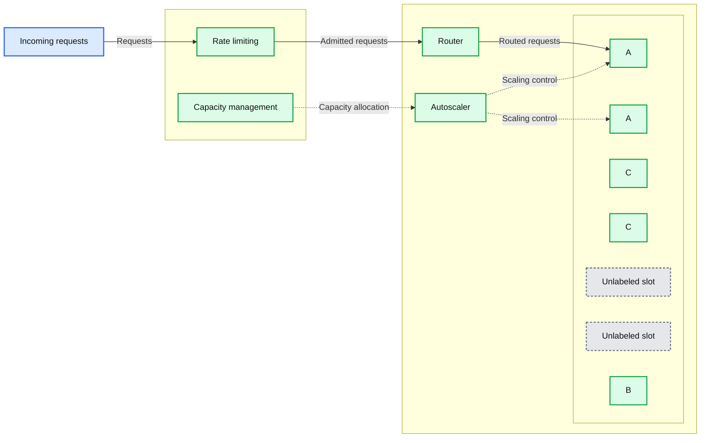
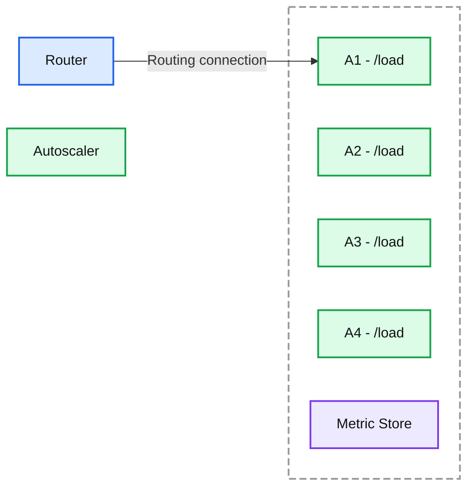
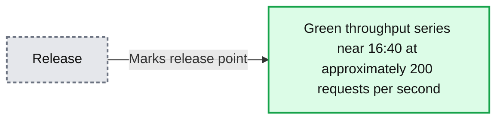

# Reliable LLM Inference at Scale

*Lessons from building reliable LLM inference infrastructure*

- Source: https://www.databricks.com/blog/reliable-llm-inference-scale
- Published: 2026-05-27
- Authors: Ying Chen, Wendy Hu, Ankit Mathur, Mike Eastham, Pei-Lun Liao, Wai Wu, Arjun DCunha
- Categories: engineering, databricks-ai, ai-engineering
- Images: 6 total, 6 extracted as architecture

**Key takeaways**

- Multi-tenant LLM serving requires reasoning about capacity across workloads. "Model units" provide a VM-like abstraction that makes it possible to allocate, route, and scale GPU resources per customer.
- Cost-aware load balancing and autoscaling, built on model units, saved over 80% in GPU costs versus static provisioning while maintaining latency targets.
- Runtime reliability mechanisms like black-box health checks detect and recover from silent failures automatically, while profiling multimodal bottlenecks unlocked 3x throughput gains.

At Databricks, we’ve built a unique inference platform that serves every frontier model, from open source models like Kimi and Qwen to proprietary models like OpenAI, Gemini, and Claude. We power inference for some of the largest agentic applications in the world, including [Superhuman](https://www.databricks.com/blog/how-superhuman-and-databricks-built-200k-qps-inference-platform-together), Yipit Data, Fox Sports, and others. Today, we serve more than 125T tokens per month.

What makes LLM serving hard at scale is reliability. With agents becoming the interface to how we work and live, inference demand is growing exponentially. We see extremely spiky demand curves that peak during working hours.

*Figure 1: 2 days of traffic for one of our largest customers on LLM Serving. Within hours, we see dramatic spikes of traffic.*

**Summary:** Request throughput varies sharply over two days, with the green series peaking near 230,000 QPS and later falling below 80,000 QPS.

**Components:**

- `200, 4XX, 5XX QPS`: chart title identifying HTTP response categories and queries per second.
- Horizontal axis: dates and times.
- Vertical axis: QPS.
- Green trace: throughput over time; no visible legend identifies its response category.
- Baseline traces: nearly flat at zero; no visible legend identifies their response categories.

**Flows:**

- none. No arrows are visible.

**Numbers:**

- Response labels: `200`, `4XX`, `5XX`.
- Unit: QPS.
- Vertical ticks: 0, 20000, 40000, 60000, 80000, 100000, 120000, 140000, 160000, 180000, 200000, 220000, 240000, 260000.
- Horizontal ticks: 05/05 08:00, 05/05 12:00, 05/05 16:00, 05/05 20:00, 05/06 00:00, 05/06 04:00, 05/06 08:00, 05/06 12:00, 05/06 16:00, 05/06 20:00, 05/07 00:00, 05/07 04:00.

```mermaid
%% Shows throughput traces against time with two prominent peaks and near-zero baseline traces
flowchart TD
    A[200, 4XX, 5XX QPS]
    B[Green trace rises to a first peak then falls and rises to a lower second peak]
    C[Baseline traces remain near zero]
    D[Vertical axis 0 to 260000 QPS]
    E[Time ticks from 05/05 08:00 to 05/07 04:00]

    classDef client fill:#dbeafe,stroke:#2563eb,stroke-width:2px,color:#111
    classDef service fill:#dcfce7,stroke:#16a34a,stroke-width:2px,color:#111
    classDef store fill:#ede9fe,stroke:#7c3aed,stroke-width:2px,color:#111
    classDef cache fill:#fef3c7,stroke:#d97706,stroke-width:2px,color:#111
    classDef queue fill:#cffafe,stroke:#0891b2,stroke-width:2px,color:#111
    classDef critical fill:#fee2e2,stroke:#dc2626,stroke-width:4px,color:#111
    classDef external fill:#e5e7eb,stroke:#6b7280,stroke-width:2px,color:#111,stroke-dasharray:4 3
    classDef decision fill:#fce7f3,stroke:#db2777,stroke-width:2px,color:#111
    class A,B,C,D,E service
```

source image: https://www.databricks.com/sites/default/files/inline-images/customer-traffic.png

Figure 1: 2 days of traffic for one of our largest customers on LLM Serving. Within hours, we see dramatic spikes of traffic.

## Challenges of running LLM Inference at scale

What does it mean to be a reliable inference platform? The contract appears simple. Availability is whether the request can be processed. But, in practice, different use cases have significantly different latency requirements, and this factors into availability. The most advanced agents cannot afford for p95 time to first token (TTFT) and output tokens per second (OPTS) to degrade.

In a multi-tenant system for LLM serving, achieving both reliability and latency is challenging.

**Reliability**

Frontier performance requires the latest GPUs with high bandwidth interconnect for KV cache transfer. These compute setups are fundamentally less reliable than classical CPU systems, and they are expensive. Given that all-to-all communication is required,, a single node’s downtime requires reconfiguration for multiple other nodes in disaggregated prefill/decode setups. The highest bandwidth networking requires single-spine connectivity in a single physical rack (e.g. NVL72 systems). This means failures in specific systems within a single datacenter rack can create a wide-blast-radius outage. Standard tricks in distributed systems like multi-AZ or leveraging backup instance types mean keeping expensive backup GPUs idling, a cost-prohibitive option. Overprovisioning is another classic trick, but given compute supply is so constrained, it’s extremely expensive and impractical. Thus, systems must remain operational under heavy strain.

Shipping velocity also needs to remain high under these constraints - our inference demand has grown multiple orders of magnitude year-over-year, and fueling that growth while shipping innovative features was challenging. Features like images, videos, and safety classification each require different preprocessing systems which all must scale independently.

Finally, achieving best-in-class performance and supporting new model architectures requires optimizations that span the gamut from custom kernels to proprietary inference engines. As architectures subtly change, new low-level software often gets introduced that can fail in opaque ways at scale, surfacing in difficult debugging scenarios ranging from server hangs to GPU crashes. 

**Latency**

Keeping latency under control with *diverse *load patterns is challenging. This is because the **cost to serve a request is highly variable and hard to estimate a priori. **Even healthy servers under heavier load process all requests more slowly, exposing a tradeoff between throughput (and thus cost efficiency) and the fastest latency that products need to handle. This can *also *manifest as a reliability problem, since servers can unexpectedly enter unhealthy states very quickly based on the mix of requests assigned to them.

*Figure 2: Realistic concurrency vs. latency benchmarking based on a large customer’s customer support agent workload.*

**Summary:** Single-server p50, p90, and p99 latency rises with concurrent requests, exceeding the 5-second p90 target under heavier load.

**Components:**
- Title: Concurrency vs Latency - Single-server latency scales with concurrency.
- Horizontal axis: Concurrent requests. Serving technology unspecified.
- Vertical axis: Latency in seconds.
- p50 latency: Blue solid line.
- p90 latency: Orange solid line.
- p99 latency: Red solid line.
- p90 target: Green dashed horizontal line.

**Flows:**
- none. The lines represent benchmark series, with no arrows.

**Numbers:**
- Concurrent request axis ticks: 5, 10, 15, 20, 25, 30.
- Latency axis ticks: 0, 5, 10, 15, 20 seconds.
- Percentile labels: p50, p90, p99.
- p90 target: 5 seconds.
- Approximate plotted values read from the lines:

| Concurrent requests | p50 latency, seconds | p90 latency, seconds | p99 latency, seconds |
|---:|---:|---:|---:|
| 1 | 2.8 | 2.9 | 3.0 |
| 4 | 4.1 | 4.3 | 4.6 |
| 6 | 4.4 | 4.8 | 5.4 |
| 8 | 4.6 | 4.8 | 5.0 |
| 12 | 6.5 | 7.8 | 8.7 |
| 16 | 8.8 | 9.2 | 9.5 |
| 32 | 17.6 | 18.1 | 18.6 |

```mermaid
%% Single-server concurrency versus latency benchmark series and target
flowchart TD
    T[Concurrency vs Latency - Single-server latency scales with concurrency]
    X[Concurrent requests - ticks 5, 10, 15, 20, 25, 30]
    Y[Latency in seconds - ticks 0, 5, 10, 15, 20]
    P50[p50 latency - blue solid line]
    P90[p90 latency - orange solid line]
    P99[p99 latency - red solid line]
    TARGET[p90 target - green dashed line at 5 seconds]

    classDef client fill:#dbeafe,stroke:#2563eb,stroke-width:2px,color:#111
    classDef service fill:#dcfce7,stroke:#16a34a,stroke-width:2px,color:#111
    classDef store fill:#ede9fe,stroke:#7c3aed,stroke-width:2px,color:#111
    classDef cache fill:#fef3c7,stroke:#d97706,stroke-width:2px,color:#111
    classDef queue fill:#cffafe,stroke:#0891b2,stroke-width:2px,color:#111
    classDef critical fill:#fee2e2,stroke:#dc2626,stroke-width:4px,color:#111
    classDef external fill:#e5e7eb,stroke:#6b7280,stroke-width:2px,color:#111,stroke-dasharray:4 3
    classDef decision fill:#fce7f3,stroke:#db2777,stroke-width:2px,color:#111

    class T,X,Y external
    class P50,P90,P99 service
    class TARGET decision
```

source image: https://www.databricks.com/sites/default/files/inline-images/concurrency-vs-latency.png

Figure 2: Realistic concurrency vs. latency benchmarking based on a large customer’s customer support agent workload.

Additionally, latency is dominated by output token generation, but up-front estimation of cost is hard, since it’s difficult to predict how long the model will talk for. Thus, low latency serving requires complex capacity management, load balancing, and request prioritization systems. 

## Overall architecture

Before we dive into the specifics of how to address those problems, let’s walk through a high level overview of our serving infrastructure.

In the data plane,

- The **inference runtime** (open source and proprietary in-house engines) is deployed on frontier GPUs
- To handle traffic across model deployments, the data plane runs a **router, **which we call Axon, that balances load among replicas of the same model, and an **autoscaler** that adjusts replica counts.

In the control plane,

- Requests go through** rate limiting** before reaching the data plane.
- Based on request metrics, the **capacity management** algorithm determines how much GPU capacity each workload gets, which the autoscaler then enforces.

**Summary:** Rate limiting and capacity management feed a router and autoscaler that manage workloads labeled A, B, and C.

**Components:**

- Rate limiting: request admission component; technology unspecified.
- Capacity management: capacity allocation component; technology unspecified.
- Router: request routing component; technology unspecified.
- Autoscaler: scaling component; technology unspecified.
- A: two purple workload boxes; technology unspecified.
- B: one long blue workload box; technology unspecified.
- C: two orange workload boxes; technology unspecified.
- Two empty dashed boxes: unlabeled slots; technology unspecified.

**Flows:**

- Incoming arrow -> Rate limiting: incoming requests.
- Rate limiting -> Router: admitted requests.
- Router -> First A box: routed requests.
- Capacity management -> Autoscaler: capacity allocation, shown with a dashed line.
- Autoscaler -> First A box: scaling control, shown with a dashed line.
- Autoscaler -> Second A box: scaling control, shown with a dashed line.

**Numbers:** none

source image: https://www.databricks.com/sites/default/files/inline-images/control-plane-and-data-plane.png

### Getting a handle on capacity

We need to be able to *roughly *reason about capacity - how much we have, how much we’ve sold, and how much customers are using. To do this, we introduced an abstraction called "model units." If we project that a replica can process a fixed number of model units per minute (e.g., 100), we can make the following assumptions:

- Requests with long input or output consume more model units, since fewer can complete in the same time window.
- Prefill and decode have different throughput characteristics, so requests with long output cost more than those with long input.

*Figure 3: Cost of a request varies non-linearly and in complex multidimensional ways, depending on the input and output token distribution. This is in sharp contrast to classical AI systems where latency per request is roughly uniformly distributed.*

**Summary:** Server throughput varies non-linearly with input and output token counts, with overlaid circles marking agentic-coding shapes.

**Components:**

- Title: Cost of requests to the server is non-linear.
- Horizontal axis: Number of Input Tokens. No technology specified.
- Vertical axis: Number of Output Tokens. No technology specified.
- Colored contour regions: Throughput in requests/min, ranging from purple for lower throughput to yellow for higher throughput.
- Circle overlay: agentic-coding shapes. No technology specified.

**Flows:**

- none. No arrows are shown.

**Numbers:**

- Input token axis ticks: 2500, 5000, 7500, 10000.
- Output token axis ticks: 250, 500, 750, 1000.
- Throughput color scale: 0, 150, 300, 450, 600, 750, 900, 1050, 1200 requests/min.

```mermaid
%% Non-linear server throughput by input and output tokens with agentic-coding shapes
flowchart TD
    T[Cost of requests to the server is non-linear]
    Y[Number of Output Tokens - ticks 250 500 750 1000]
    C[Colored throughput contours - purple low to yellow high]
    X[Number of Input Tokens - ticks 2500 5000 7500 10000]
    S[Throughput in requests/min - 0 150 300 450 600 750 900 1050 1200]
    O[Circle overlay - agentic-coding shapes]

    classDef client fill:#dbeafe,stroke:#2563eb,stroke-width:2px,color:#111
    classDef service fill:#dcfce7,stroke:#16a34a,stroke-width:2px,color:#111
    classDef store fill:#ede9fe,stroke:#7c3aed,stroke-width:2px,color:#111
    classDef cache fill:#fef3c7,stroke:#d97706,stroke-width:2px,color:#111
    classDef queue fill:#cffafe,stroke:#0891b2,stroke-width:2px,color:#111
    classDef critical fill:#fee2e2,stroke:#dc2626,stroke-width:4px,color:#111
    classDef external fill:#e5e7eb,stroke:#6b7280,stroke-width:2px,color:#111,stroke-dasharray:4 3
    classDef decision fill:#fce7f3,stroke:#db2777,stroke-width:2px,color:#111
    class T,Y,C,X,S,O service
```

source image: https://www.databricks.com/sites/default/files/inline-images/cost-of-requests-to-the-server-is-non-linear.png

Figure 3: Cost of a request varies non-linearly and in complex multidimensional ways, depending on the input and output token distribution. This is in sharp contrast to classical AI systems where latency per request is roughly uniformly distributed.

Therefore, we model request cost using a multi-dimensional function such as:

The coefficients α, β, γ are determined by automated benchmarking for each model on each hardware type. Model units can be further adjusted for optimizations like prefix caching, and they must account for features like multi-modality. 

Such estimations are structurally imperfect, but they serve as a way for us to break a multi-tenant system into something more manageable that resembles cloud VMs. VMs have the desirable property of offering predictable performance that can be allocated to specific customers. For production agentic workloads, it’s important to offer guarantees around low latency and capacity, and without such allocation systems, the best we can do is offer “best-effort” capacity that could be clawed back if too many customers use the system.

### Cost-based load balancing and autoscaling

Since requests have a highly variable impact on servers, it’s important to make nearly optimal routing decisions. In general, load balancing tends to lean on statistical approaches like P2C (power of two choices), which estimate load based on queue size and leverage sampling to reduce the memory and latency overheads of understanding all the possible targets. However, LLM latencies tend to be high, server counts are lower than scaled out CPU systems, and the cost of misrouting is severe. Therefore, LLM serving necessitates a different approach.

Today, we use [Dicer](https://www.databricks.com/blog/open-sourcing-dicer-databricks-auto-sharder), Databricks' auto-sharder, to dynamically route workloads across servers. Without load-aware routing, long-context requests cause individual servers to become hotspots while others sit underutilized. We integrated model units with Dicer so that **routing decisions are based on server load in model units** rather than traditional request-based heuristics. Dicer also provides **stateful sessions**, making request routing sticky. A workload's requests go to only a subset of servers, which improves cache hit rates (crucial for latency-sensitive workloads like coding agents) and limits blast radius.

We can also tune the load metrics and even use more optimal routing systems in the future based on higher fidelity cost metrics, as we learn more.

*Figure 4: The router and autoscaler both consume server load, so a small number of expensive long-context requests can trigger different routing and scaling decisions than many cheap short requests.*

**Summary:** A router points to server A1 within a dashed boundary containing four servers with /load endpoints and a Metric Store, while an Autoscaler sits outside.

**Components:**
- Router: request routing component; technology unspecified.
- Autoscaler: scaling component; technology unspecified.
- A1: server with a /load endpoint; technology unspecified.
- A2: server with a /load endpoint; technology unspecified.
- A3: server with a /load endpoint; technology unspecified.
- A4: server with a /load endpoint; technology unspecified.
- Metric Store: metrics storage component; technology unspecified.
- Dashed boundary: unlabeled grouping containing the servers and Metric Store.

**Flows:**
- Router -> A1: routing connection; the arrow has no visible label.

**Numbers:** 1, 2, 3, and 4 appear in server identifiers A1, A2, A3, and A4. No quantitative values or units are visible.

source image: https://www.databricks.com/sites/default/files/inline-images/inference-dataplane.png

Figure 4: The router and autoscaler both consume server load, so a small number of expensive long-context requests can trigger different routing and scaling decisions than many cheap short requests.

A similar problem exists in autoscaling. Pending request counts alone don't reflect true load. A spike in long-context requests looks identical to a spike in short ones, and CPU and memory metrics are similarly uncorrelated with actual GPU utilization.

Using model units, our autoscaler can decide whether to scale up or down based on the **model unit utilization ratio**. When the inference engine is running close to some percent of its maximum model units (determined by hardware type and workload shape), it's approaching peak throughput, which triggers scale-up. The reverse triggers scale-down. Rather than manually adjusting auto-scaling rules for each model, this approach allows for model-agnostic scaling infrastructure.

Building autoscaling on top of LLM inference patterns saved us from always scaling to max replicas. For models with bursty traffic, autoscaling kept replica counts close to actual demand, translating to **over 80% GPU savings** compared to static provisioning at peak.

## Runtime Reliability

Smart routing and scaling provided a great foundation, but they don't prevent failures at the engine level. No matter which inference engine we deploy (our in-house engine or popular open-source options), edge cases and resource contention emerge at production scale. We need mechanisms to detect and recover from failures automatically.

### Detecting and recovering from silent failures

One failure mode we encounter is **silent hangs**. Requests involving edge cases (structured output, multimodal inputs) can trigger unhandled errors in the multi-process architecture of inference engines, causing servers to stop responding without surfacing errors.

We detect this with periodic black-box health checks: minimal end-to-end requests sent when no real requests have completed recently. If a health check fails, the Kubernetes liveness probe restarts the server. This works across all engines regardless of internal implementation.

However, under high load, health checks themselves can time out, causing the liveness probe to kill servers that are actually healthy. This risks cascading failures. To solve this, we **assign health check requests the highest scheduling priority**, ensuring they complete even under heavy load. With prioritized health checks, the full cycle of detecting a hang, killing the unhealthy server, and recovering takes less than 5 minutes. False liveness probe failures dropped from **several per week to zero**.

### Handling unexpected load from multimodal requests

When large batches of multimodal requests arrived, we saw spikes in error rates and timeouts from a completely different source.

Investigations revealed that requests weren't even reaching the inference engine's core processes. Serving image requests is more resource-expensive than text-only requests, not just from the additional vision encoder running on GPUs, but also from **CPU-intensive image processing**. For certain models, the image processing was extremely slow, blocking the event loop entirely.

Moving blocking operations into separate threads and processes didn't solve the problem; requests still piled up under high image load. So we profiled the Python processes and made several discoveries:

- Among all CPU operations for images, image processing (resizing and normalization) is 10x slower than other operations like base64 decoding.
- Some Hugging Face models default to the PIL-based image processor, while others use the faster **Torchvision-based processor**.
- In containerized environments, OMP_NUM_THREADS (which controls the number of OpenMP threads used by Torch for CPU operations) defaults to the number of vCPUs on the host machine. In multitenant setups, this is a poor default: a host might have 192 vCPUs, but a container only has access to 12. The result is far more running threads than available cores. This drives CPU usage past the container's limit and triggers throttling.

By switching to Torchvision-based image processors and properly configuring OMP_NUM_THREADS, we sustained much higher QPS and fully leveraged the GPUs. After the fix shipped, requests completed per second jumped **>3x** with the same replicas and load. CPU throttling disappeared, and servers ran in a much healthier state.

*Figure 5: RPS per server after we optimized the image processing bottlenecks*

**Summary:** Requests per second rise from approximately 200 before the marked release to a peak near 900 afterward.

**Components:**
- Requests per second: chart title and throughput metric; technology unspecified.
- Green line: unlabeled throughput series.
- Blue and purple lines: unlabeled series near zero.
- Release: blue annotation marking the green line near 16:40.

**Flows:**
- Release -> Green line near 16:40: blue arrow identifies the release point at approximately 200 requests per second.

**Numbers:**
- Vertical axis, requests per second: 0, 200, 400, 600, 800, 1000.
- Horizontal axis, time: 16:20, 16:30, 16:40, 16:50, 17:00, 17:10, 17:20.
- Approximate green series values: 230 initially, 200 at release, 900 at peak, and 760 at the end.

source image: https://www.databricks.com/sites/default/files/inline-images/requests-per-second.png

Figure 5: RPS per server after we optimized the image processing bottlenecks

## Conclusion

Serving LLMs reliably at scale requires work across every layer of the inference stack. We've covered autoscaling and load balancing infrastructure designed around LLM workloads, and runtime mechanisms that stay stable regardless of engine or workload. There's a lot more to the story: fast container start, safe rollouts across GPU fleets, GPU capacity management across clouds and regions. If these are the kinds of problems you want to work on, [we’re hiring](https://www.databricks.com/company/careers/open-positions?department=Engineering&location=all)!
