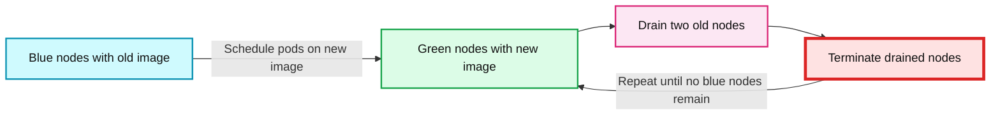
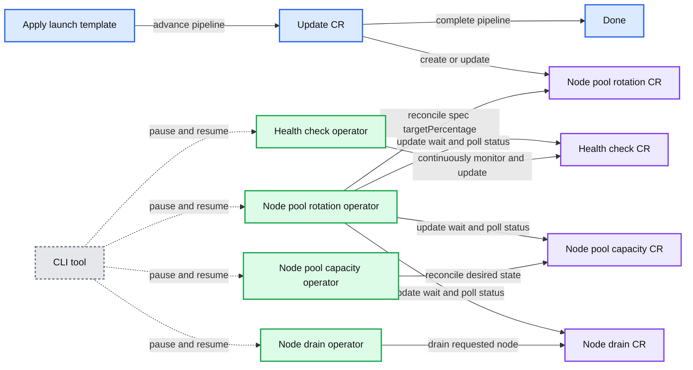
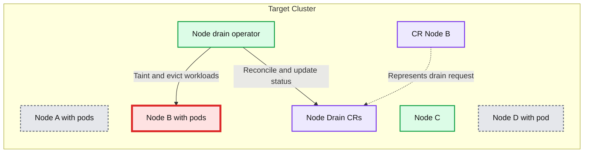
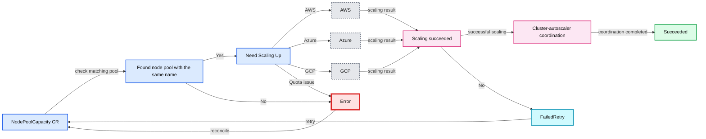
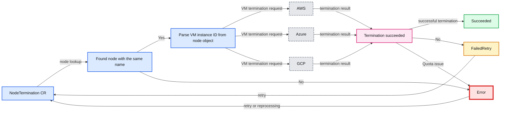
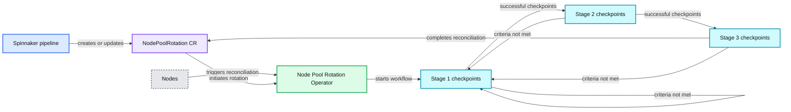
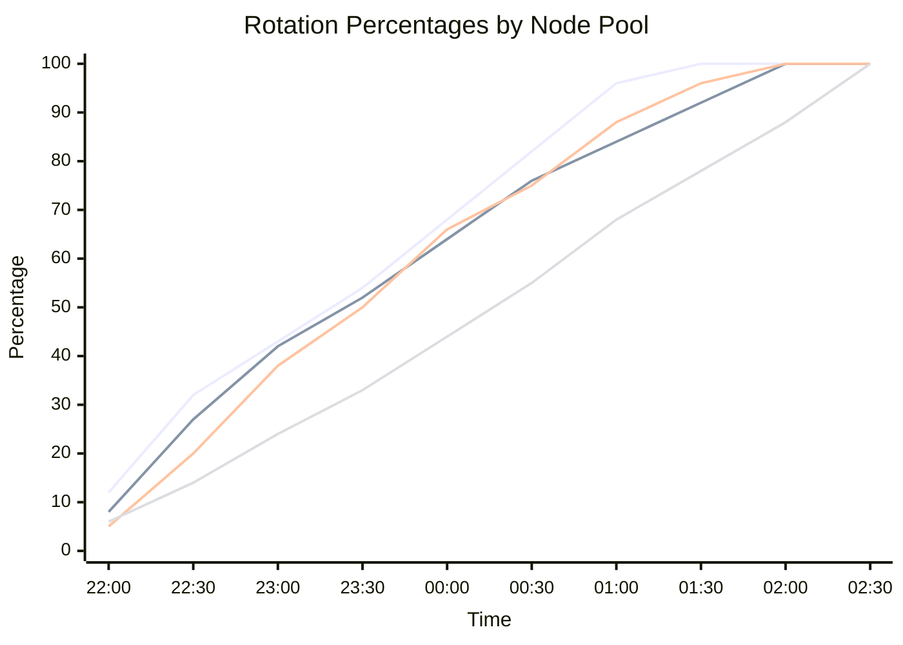
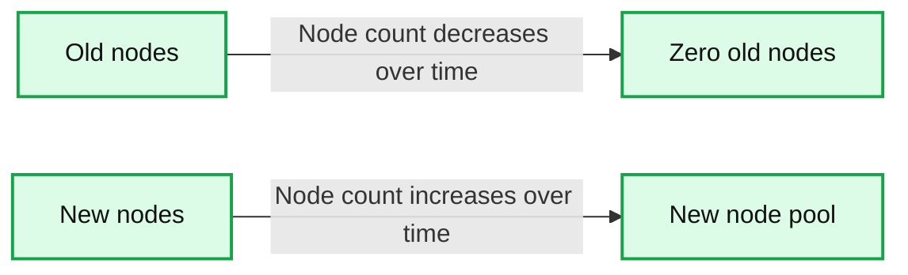
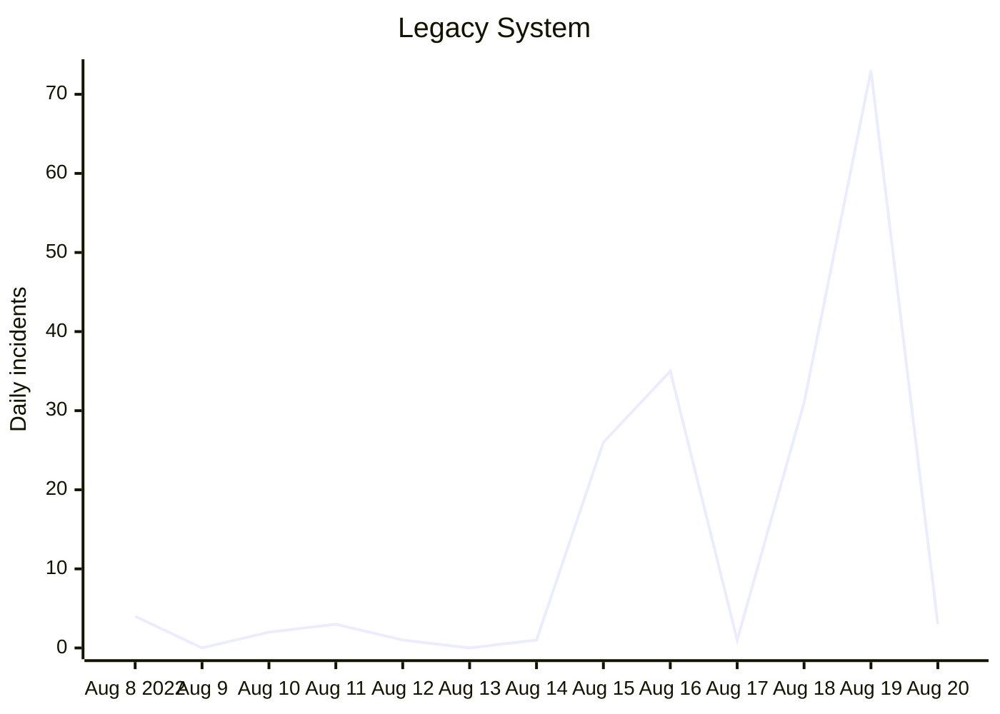
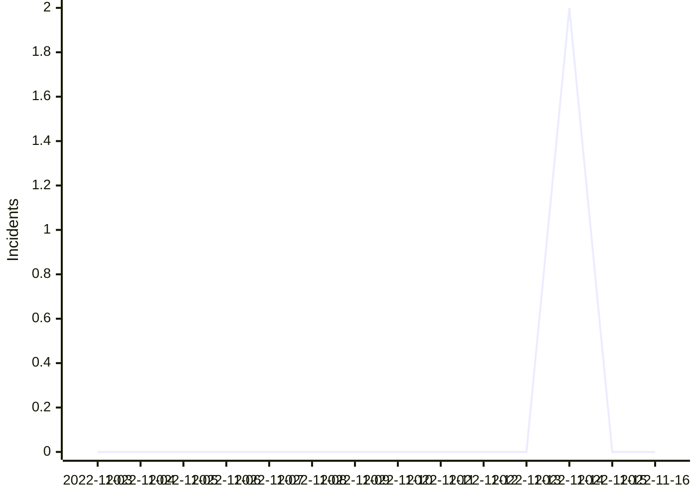

# Scalable Kubernetes Upgrade Using Operators

- Source: https://www.databricks.com/blog/scalable-kubernetes-upgrade-using-operators
- Published: 2022-12-15
- Authors: Ziyuan Chen
- Categories: engineering, open-source
- Images: 13 total, 13 extracted as architecture

At Databricks, we run our compute infrastructure on AWS, Azure, and GCP. We orchestrate containerized services using Kubernetes clusters. We develop and manage our own OS images that bootstrap cloud VMs into [Kubernetes nodes](https://kubernetes.io/docs/concepts/architecture/nodes/). These OS images include [critical components](https://cloud.google.com/compute/docs/instance-groups#managed_instance_groups) for Kubernetes, such as the kubelet, container runtime, and kube-proxy, etc. They also contain OS-level customizations necessary to Databricks' services.

Self-managed OS images require regular updates to pick up [CVE](https://ubuntu.com/security/cves) patches, [kernel](https://ubuntu.com/kernel) updates, code changes to custom configurations, etc. Regularly releasing OS images to a large fleet of clusters across three clouds is very challenging.

This blog post covers how we went from a legacy system using [Spinnaker](https://spinnaker.io/), [Jenkins](https://www.jenkins.io/), and Python scripts to a new one based on [Kubernetes operators](https://kubernetes.io/docs/concepts/extend-kubernetes/operator/). The new approach is cloud native, scalable, fast, reliable, and addresses a number of pain points that we will cover in later sections.

## Legacy system

*Illustration of the legacy system*

**Summary:** The diagram shows a legacy single-cluster upgrade pipeline using Spinnaker, Jenkins, and a Python script to update Cluster A.

**Components:**

- Meta Spinnaker pipeline using Spinnaker
- Cluster A Stage using Spinnaker
- Single-cluster update Spinnaker pipeline for cluster A using Spinnaker
- Jenkins stage using Jenkins
- Python script using Python
- Cluster A using Kubernetes

**Flows:**

- Cluster A Stage -> Single-cluster update Spinnaker pipeline for cluster A: triggers the cluster update pipeline
- Jenkins stage -> Python script: runs the upgrade script
- Python script -> Cluster A: performs the cluster upgrade

**Numbers:** none

```text
%% mermaid failed to render; kept as text
%% Legacy single-cluster upgrade pipeline using Spinnaker Jenkins and Python
flowchart LR
    meta[Meta Spinnaker pipeline] --> stage[Cluster A Stage]
    stage --> pipeline[Single cluster update Spinnaker pipeline for cluster A]
    pipeline --> jenkins[Jenkins stage]
    jenkins --> python[Python script]
    python --> cluster[Cluster A]

    classDef client   fill:#dbeafe,stroke:#2563eb,stroke-width:2px,color:#111
    classDef service  fill:#dcfce7,stroke:#16a34a,stroke-width:2px,color:#111
    classDef store    fill:#ede9fe,stroke:#7c3aed,stroke-width:2px,color:#111
    classDef cache    fill:#fef3c7,stroke:#d97706,stroke-width:2px,color:#111
    classDef queue    fill:#cffafe,stroke:#0891b2,stroke-width:2px,color:#111
    classDef critical fill:#fee2e2,stroke:#dc2626,stroke-width:4px,color:#111
    classDef external fill:#e5e7eb,stroke:#6b7280,stroke-width:2px,color:#111,stroke-dasharray:4 3
    classDef decision fill:#fce7f3,stroke:#db2777,stroke-width:2px,color:#111
    client = clients edge gateway LB, service = stateless compute, store = databases durable storage
    cache = Redis CDN or anything losable, queue = Kafka streams async pipes
    critical = the bottleneck or SPOF, external = third party, decision = a trade off point

    class meta,stage,pipeline external
    class jenkins,python service
    class cluster store
```

<sub>source image: https://www.databricks.com/sites/default/files/inline-images/db-438-blog-img-1.png</sub>

Illustration of the legacy system

Infrastructure operations at Databricks had traditionally been performed using [Spinnaker](https://spinnaker.io/), [Jenkins](https://www.jenkins.io/), and Python scripts. A Spinnaker pipeline consisting of many Jenkins stages, each running a Python script, was the implementation for blue-green node upgrade. The workflow of an engineer performing such an upgrade was:

1. The engineer triggers a "meta" Spinnaker pipeline that knows the list of Kubernetes clusters to upgrade. There is one stage of execution per cluster, and in each stage, child Spinnaker pipelines are triggered for node pools in the Kubernetes cluster within that stage.
2. The child Spinnaker pipeline executes several stages, each being a Jenkins job that runs the Python script with certain flags.
3. If any of the Spinnaker stages failed for any reason, the oncall engineer would be notified. The engineer would need to use the Spinnaker UI to manually investigate and restart the failed Spinnaker stages in order for the whole upgrade process to proceed.

The Python script contains the core blue-green upgrade algorithm with the following steps to upgrade Kubernetes nodes with services running on them without downtime.

For each node pool in a cluster:

1. Select a batch size 1 <= n <= N, where N is the total number of nodes in the node pool.
2. Bring up n new nodes that use the new image, then drain n nodes that use the old image, while respecting [PodDisruptionBudgets](https://kubernetes.io/docs/tasks/run-application/configure-pdb/) (PDBs).
3. Terminate the n nodes drained in the previous step.
4. Repeat the above for all nodes running the old image, until all such nodes are terminated, and the entire node pool contains only nodes running the new image.

*Illustration of the blue-green upgrade algorithm*

**Summary:** The diagram shows a blue-green Kubernetes node upgrade performed in batches of n = 2 nodes.

**Components:**

- Blue nodes: nodes running the old image
- Green nodes: nodes running the new image
- Pods: workloads scheduled on blue or green nodes
- Batch size n = 2: number of nodes handled per iteration
- Steps 1, 2, 3, and 4: upgrade algorithm stages

**Flows:**

- Blue node pods -> Green nodes: pods are rescheduled onto nodes running the new image

**Numbers:** n = 2, 1, 2, 3, 4



<sub>source image: https://www.databricks.com/sites/default/files/inline-images/db-438-blog-img-2.png</sub>

Illustration of the blue-green upgrade algorithm

We chose to handle the blue-green upgrade in small batches over many iterations, instead of performing a full blue-green upgrade of all nodes in one iteration, to reduce the maximum total number of nodes in the cluster during an upgrade operation. This reduces the chance of encountering cloud quota issues, and the cloud cost on VM instances.

### Pain points

This legacy system presented many issues mainly in the following aspects:

#### Reliability

The legacy system depended on Spinnaker and Jenkins, so it was subject to Spinnaker and Jenkins reliability issues. Its Python script also contained many external dependencies added over the years, resulting in numerous points of failure. The purely sequential nature of the Python scripts meant that the system was subject to transient issues in production Kubernetes clusters and cloud provider APIs, such as when a pod could not be evicted, a pod could not be scheduled on a new node, certain signals indicated the cluster was in a bad state, etc. It was also highly susceptible to timeouts of any operation, as there was only a finite number of retries that can be had in a sequential logic. Therefore, **95%** of the oncall pages were due to self-recoverable issues that the legacy system could not tolerate, and it amounted to > **100-150** oncall alerts per week for our fleet. The oncall engineer had to constantly manually restart and track (on a spreadsheet!) the failed Spinnaker stages.

#### Idempotency

Because self-recoverable errors are frequent, any system that performs the node upgrades would have to have many retries. However, due to both technical debt and the sequential nature of Python scripts, it was very difficult to ensure the idempotency of every piece of logic, and even impossible in some cases. This is because if a Python script exited due to an error or a timeout, then the oncall engineer would have to manually restart the Jenkins stage, which would re-run the Python script from a clean state. Because of the ephemeral nature of Jenkins jobs, the restarted Jenkins job would be oblivious of the context. This could result in incorrect behaviors such as bringing up 2n nodes for updating a batch of n nodes.

#### Scalability

The scalability of the legacy system was poor in two ways.
 Firstly, each Jenkins job was deployed as a pod, and required the Jenkins scheduler to reserve a large amount of computing resources due to the inefficiency in the Python script. Jenkins was hosted in one single Kubernetes cluster, creating a scalability bottleneck due to that cluster's limited resources.
 Secondly, the human operational scalability was poor. As mentioned in Reliability, the oncall engineer had to respond to 100-150 pages a week, greatly straining the engineer.

#### Testability

Jenkins and Spinnaker pipelines were non-testable other than manual tests on real Kubernetes clusters, which would take many hours to test only one possible code path. The Python scripts, although testable, had low test coverage due to historical neglect of unit tests. As a result, the legacy system was poorly tested, and the team often discovered breaking changes during real cluster node upgrade operations.

## New system based on Kubernetes operators

To solve the problems mentioned above, the team decided to move the majority of the node upgrade operations into a new implementation in the form of Kubernetes operators. Kubernetes operators have many advantages over the legacy system, but the major ones are:

1. **Idempotent.**
2. **Declarative.** In our case, the goal state is that all nodes in a node pool are running the new OS image. Even outside of node upgrade operations, the operators can continuously ensure that all nodes are running the correct OS image by draining and terminating any incorrectly-created nodes that run the incorrect OS image.
3. **No external infra dependency.** They can be hosted in the same Kubernetes clusters they perform upgrades on, improving the scalability and eliminating cross-cluster dependencies in the legacy system.
4. **Better ecosystem support.** They are written in Go using [KubeBuilder](https://book.kubebuilder.io/) and [controller-runtime](https://github.com/kubernetes-sigs/controller-runtime). They have better Kubernetes support, better performance, better testability, and higher reliability than the old Python scripts, which are non-typed and interpreted.
5. Easily **end-to-end testable.**
6. Their model is **asynchronous**, allowing different node pools to be upgraded in parallel, greatly reducing the time needed for a full cluster node upgrade.

### New user workflow

In this new system, the workflow of an engineer performing a node upgrade is:

1. The engineer triggers a meta Spinnaker pipeline that knows the list of Kubernetes clusters to upgrade. It, in each of its stages, creates/updates Kubernetes Custom Resources for the node pools in the cluster to kick-start the node upgrades.
2. The oncall engineer can assume that the upgrade is progressing without issues unless alerted by the system. There is also a monitoring dashboard to track the overall progress in all clusters.

### High-level architecture

*Overall architecture of the Kubernetes-operator-based system*

**Summary:** The diagram shows a Spinnaker-driven Kubernetes node-pool rotation system coordinated by four operators and their Custom Resources in a target cluster.

**Components:**

- Spinnaker pipeline using Python code in Jenkins
- Apply ASG or VMSS or MIG launch template step
- Update CR pipeline step
- Done pipeline step
- Node-pool-rotation operator using Go code in the cluster
- Node pool rotation CR, a Kubernetes Custom Resource
- Health-check operator using Go code in the cluster
- Health check CR, a Kubernetes Custom Resource
- Node-pool-capacity operator using Go code in the cluster
- Node pool capacity CR, a Kubernetes Custom Resource
- Node-drain operator using Go code in the cluster
- Node drain CR, a Kubernetes Custom Resource
- CLI tool for pausing and resuming operators, operated from a human machine
- Target cluster containing the operators and Custom Resources

**Flows:**

- Apply launch template -> Update CR: pipeline advances
- Update CR -> Done: pipeline completes
- Update CR -> Node pool rotation CR: creates or updates the Custom Resource
- Node pool rotation operator -> Node pool rotation CR: reconciles and updates spec targetPercentage
- Node pool rotation operator -> Health check CR: updates the Custom Resource, then waits and polls status
- Node pool rotation operator -> Node pool capacity CR: updates the Custom Resource, then waits and polls status
- Node pool rotation operator -> Node drain CR: updates the Custom Resource, then waits and polls status
- Health check operator -> Health check CR: continuously monitors and updates status
- Node pool capacity operator -> Node pool capacity CR: reconciles desired node-pool state
- Node drain operator -> Node drain CR: drains the requested node
- CLI tool -> Operators: pauses and resumes operators
- CLI tool -> Custom Resources: controls operator-related operations

**Numbers:** none



<sub>source image: https://www.databricks.com/sites/default/files/inline-images/db-438-blog-img-3.png</sub>

Overall architecture of the Kubernetes-operator-based system

The system consists of four Kubernetes operators whose controllers are run as pods in each of our Kubernetes clusters. They each have their [CustomResourceDefinition](https://kubernetes.io/docs/tasks/extend-kubernetes/custom-resources/custom-resource-definitions/)(CRD) as the API interface between them and their callers.

The Spinnaker pipeline still exists, but is greatly simplified. It now only contains two operations: (1) applying the new launch template such that in the new [ASG](https://docs.aws.amazon.com/autoscaling/ec2/userguide/auto-scaling-groups.html)/[VMSS](https://learn.microsoft.com/en-us/azure/virtual-machine-scale-sets/overview)/[MIG](https://cloud.google.com/compute/docs/instance-groups#managed_instance_groups) so that new nodes will be using the new OS image, and (2) updating the "node pool rotation" [CustomResource](https://kubernetes.io/docs/concepts/extend-kubernetes/api-extension/custom-resources/)(CR). The node-pool-rotation operator, upon observing the upgrade on the node-pool-rotation CR(s), will start reconciling the corresponding node pools in parallel. It will invoke the three child operators using their respective CRDs to perform node-draining, health-checking, and node-pool-scaling, all of which are needed to perform a blue-green upgrade without causing service downtime.

### Child operators

#### Node-drain operator

The node drain operator is responsible for draining workloads running on any given node, while respecting their PDBs and special handling requirements.

*Illustration of how the node-drain operator interacts with nodes*

**Summary:** The diagram shows a Kubernetes node-drain operator tainting and evicting workloads from Node-B while reconciling node-drain custom resources and updating their status.

**Components:**

- Target Cluster: Kubernetes cluster
- Node-A: Kubernetes worker node with pods
- Node-B: Kubernetes worker node with pods
- Node-C: Kubernetes worker node hosting the node-drain operator
- Node-D: Kubernetes worker node with a pod
- Node-drain operator: Kubernetes operator
- Node Drain CRs: Kubernetes custom resources
- CR Node-B: Node-drain custom resource for Node-B

**Flows:**

- Node-drain operator -> Node-B: Taint
- Node-drain operator -> Node-B: Evict workloads
- Node-drain operator -> Node Drain CRs: Reconcile and update status

**Numbers:** none



<sub>source image: https://www.databricks.com/sites/default/files/inline-images/db-438-blog-img-4.png</sub>

Illustration of how the node-drain operator interacts with nodes

The node-drain operator, being self-hosted in the Kubernetes cluster, will inevitably drain itself and other three operators. But due to the idempotent and declarative nature of the operators, once their pods are rerunning on new nodes, they will pick up where they left off.

#### Node-pool-capacity operator

The node-pool-capacity operator consists of two Kubernetes controllers: the node-pool-capacity controller of the same name, and the node-termination controller. They both use cloud providers' Go SDKs to interact with their APIs.

The node-pool-capacity controller is illustrated below. It uses cloud provider APIs to adjust the number of VMs in a node pool's underlying ASG/VMSS/MIG. It also coordinates with the cluster-autoscaler, which we have deployed to our Kubernetes clusters as well, to ensure that any newly-brought-up nodes will not be scaled down by the latter during the node upgrade operation.

*State transition flow chart of the node-pool-capacity controller*

**Summary:** State transition flow chart for the node-pool-capacity controller, showing cloud scaling, cluster-autoscaler coordination, retries, errors, and success.

**Components:**

- NodePoolCapacity CR: Kubernetes custom resource
- Found node pool with the same name: node-pool lookup
- Need Scaling Up: scaling decision
- AWS: AWS cloud provider API
- Azure: Azure cloud provider API
- GCP: GCP cloud provider API
- Scaling succeeded: scaling result decision
- Cluster-autoscaler coordination: Kubernetes cluster-autoscaler
- Succeeded: successful terminal state
- FailedRetry: retry state
- Error: error state
- Quota issue: quota-related failure path

**Flows:**

- NodePoolCapacity CR -> Found node pool with the same name: checks for a matching node pool
- Found node pool with the same name -> Need Scaling Up: matching node pool found
- Found node pool with the same name -> Error: no matching node pool
- Need Scaling Up -> AWS: requests scaling through AWS
- Need Scaling Up -> Azure: requests scaling through Azure
- Need Scaling Up -> GCP: requests scaling through GCP
- Need Scaling Up -> Scaling succeeded: scaling result
- Scaling succeeded -> Cluster-autoscaler coordination: scaling completed
- Cluster-autoscaler coordination -> Succeeded: coordination completed
- Scaling succeeded -> FailedRetry: scaling did not succeed
- FailedRetry -> NodePoolCapacity CR: retries reconciliation
- Need Scaling Up -> Error: quota issue
- Error -> NodePoolCapacity CR: returns to reconciliation

**Numbers:** none



<sub>source image: https://www.databricks.com/sites/default/files/inline-images/db-438-blog-img-5.png</sub>

State transition flow chart of the node-pool-capacity controller

The node-termination controller is illustrated below. It terminates any given node by finding its underlying VM in the cloud provider, and terminates the underlying VM by calling the corresponding cloud API.

*State transition flow chart of the node-termination controller*

**Summary:** The diagram shows the node-termination controller state flow for locating a node VM, terminating it through AWS, Azure, or GCP, and handling success, quota issues, errors, and retries.

**Components:**

- NodeTermination CR: Kubernetes custom resource
- Found node with the same name: Kubernetes node lookup
- Parse VM instance ID from node object: Kubernetes node metadata parsing
- AWS: Cloud provider API
- Azure: Cloud provider API
- GCP: Cloud provider API
- Termination succeeded: termination decision
- Succeeded: successful terminal state
- FailedRetry: retry state
- Error: error state

**Flows:**

- NodeTermination CR -> Found node with the same name: node lookup
- Found node with the same name -> Parse VM instance ID from node object: Yes
- Found node with the same name -> Error: No
- Parse VM instance ID from node object -> AWS: VM termination request
- Parse VM instance ID from node object -> Azure: VM termination request
- Parse VM instance ID from node object -> GCP: VM termination request
- AWS -> Termination succeeded: termination result
- Azure -> Termination succeeded: termination result
- GCP -> Termination succeeded: termination result
- Termination succeeded -> Succeeded: successful termination
- Termination succeeded -> FailedRetry: No
- Termination succeeded -> Error: Quota issue
- FailedRetry -> NodeTermination CR: retry
- Error -> NodeTermination CR: retry or reprocessing

**Numbers:** none



<sub>source image: https://www.databricks.com/sites/default/files/inline-images/db-438-blog-img-6.png</sub>

State transition flow chart of the node-termination controller

#### Health-check operator

The health-check operator analyzes Kubernetes events and certain internal signals to determine the cluster's health (including the services running on it). It exports the health status to CR instances of the HealthCheck CRD. These CRs are consumed by the node-pool-rotation operator at many points during its reconciliation to ensure that the cluster and workloads remain in a healthy state after certain critical migration / update steps.

The operator's core logic is illustrated below:

*Flow chart showing how the health-check operator provides cluster health signals*

**Summary:** The diagram shows an operator processing Kubernetes events and internal signals to validate cluster health and update custom resource status.

**Components:**

- Operator starts - Kubernetes operator
- K8s event go-routine starts - Kubernetes event handling
- K8s-event validation and confirmation - Kubernetes event validation
- Update CR status - Kubernetes custom resource status
- sleep - Delayed retry or polling
- Other internal signals go-routine starts - Internal operator signals
- Internal signals lookup - Internal signal lookup

**Flows:**

- Operator starts -> K8s event go-routine starts: starts event-processing goroutine
- Operator starts -> Other internal signals go-routine starts: starts internal-signals goroutine
- K8s event go-routine starts -> K8s-event validation and confirmation: asynchronous Kubernetes event
- K8s-event validation and confirmation -> Update CR status: validated event result
- Update CR status -> sleep: wait after status update
- sleep -> K8s-event validation and confirmation: retry or continued validation loop
- Other internal signals go-routine starts -> Internal signals lookup: starts signal lookup
- Internal signals lookup -> Update CR status: internal health signal
- Internal signals lookup -> sleep: wait before repeating lookup
- sleep -> Internal signals lookup: retry or continued lookup loop

**Numbers:** none

```text
%% mermaid failed to render; kept as text
%% Shows operator Kubernetes event and internal signal processing flows
flowchart LR
    A[Operator starts]
    B[K8s event go-routine starts]
    C[K8s-event validation and confirmation]
    D[Update CR status]
    E[sleep]
    F[Other internal signals go-routine starts]
    G[Internal signals lookup]

    A -->|starts event goroutine| B
    A -->|starts signals goroutine| F
    B -->|async Kubernetes event| C
    C -->|validated event result| D
    D -->|wait| E
    E -->|retry validation| C
    F -->|starts lookup| G
    G -->|internal health signal| D
    G -->|wait| E
    E -->|retry lookup| G

    classDef client   fill:#dbeafe,stroke:#2563eb,stroke-width:2px,color:#111
    classDef service  fill:#dcfce7,stroke:#16a34a,stroke-width:2px,color:#111
    classDef store    fill:#ede9fe,stroke:#7c3aed,stroke-width:2px,color:#111
    classDef cache    fill:#fef3c7,stroke:#d97706,stroke-width:2px,color:#111
    classDef queue    fill:#cffafe,stroke:#0891b2,stroke-width:2px,color:#111
    classDef critical fill:#fee2e2,stroke:#dc2626,stroke-width:4px,color:#111
    classDef external fill:#e5e7eb,stroke:#6b7280,stroke-width:2px,color:#111,stroke-dasharray:4 3
    classDef decision fill:#fce7f3,stroke:#db2777,stroke-width:2px,color:#111
    A,B,C,D,E,F,G service
```

<sub>source image: https://www.databricks.com/sites/default/files/inline-images/db-438-blog-img-7.png</sub>

Flow chart showing how the health-check operator provides cluster health signals

#### Node-pool-rotation operator

The node pool rotation operator watches both the NodePoolRotation CR and all nodes in the cluster. If a node pool rotation CR is updated or a node running the incorrect OS image is brought up, then it will trigger a reconciliation. The reconciliation follows the following stage and checkpoint model:

Stage 1: Pre-checking, initialization, cleaning up certain objects in bad states, calculations
 Stage 2: Performing the batch update of n nodes from the old OS image to the new OS image
 Stage 3: Post-checking, cleanup, post-handling of nodes requiring special handling

*Flow chart showing the stages in the node-pool-rotation operator*

**Summary:** The diagram shows the staged reconciliation and checkpoint flow of the NodePoolRotation operator, including requeue paths for failed checkpoints.

**Components:**

- Spinnaker pipeline
- Nodes
- NodePoolRotation CR
- Node Pool Rotation Operator
- Stage 1 checkpoints
- Stage 2 checkpoints
- Stage 3 checkpoints

**Flows:**

- Spinnaker pipeline -> NodePoolRotation CR: creates or updates the custom resource
- Nodes -> Node Pool Rotation Operator: triggers reconciliation
- NodePoolRotation CR -> Node Pool Rotation Operator: initiates rotation workflow
- Node Pool Rotation Operator -> Stage 1 checkpoints: starts pre-checking and initialization
- Stage 1 checkpoints -> Stage 2 checkpoints: advances after successful checkpoint processing
- Stage 2 checkpoints -> Stage 3 checkpoints: advances after successful checkpoint processing
- Stage 3 checkpoints -> NodePoolRotation CR: completes reconciliation
- Stage 1 checkpoints -> Stage 1 checkpoints: requeues if criteria are not met
- Stage 2 checkpoints -> Stage 1 checkpoints: requeues if criteria are not met
- Stage 3 checkpoints -> Stage 1 checkpoints: requeues if criteria are not met

**Numbers:** 1, 2, 3



<sub>source image: https://www.databricks.com/sites/default/files/inline-images/db-438-blog-img-8.png</sub>

Flow chart showing the stages in the node-pool-rotation operator

A "checkpoint" is defined as a step during the upgrade of a batch of n nodes. For example, "bringing up n nodes running the new OS image" is a checkpoint, and "drain n nodes running the old OS image" is another checkpoint. The checkpoint model is illustrated below:

*Illustration of the logic within each checkpoint*

**Summary:** The diagram shows the checkpoint logic for evaluating skip conditions, executing actions, validating success, and requeuing when necessary.

**Components:**

- Checkpoint - technology unspecified
- Skipping criteria - pure evaluation function
- Actions - checkpoint operations
- Passing criteria - pure validation function
- Requeue - reconciliation queue

**Flows:**

- Checkpoint -> Skipping criteria: evaluate skip conditions
- Skipping criteria -> Checkpoint completion: met, skip actions
- Skipping criteria -> Actions: not met
- Actions -> Passing criteria: succeeded
- Actions -> Requeue: failed or requeue without error
- Passing criteria -> Checkpoint completion: met
- Passing criteria -> Requeue: not met
- Requeue -> Checkpoint: retry reconciliation

**Numbers:** none

```text
%% mermaid failed to render; kept as text
%% Checkpoint evaluation, action execution, validation, and requeue logic
flowchart LR
    C[Checkpoint] --> S[Skipping criteria]
    S -->|Met| Done[Checkpoint completion]
    S -->|Not met| A[Actions]
    A -->|Succeeded| P[Passing criteria]
    A -->|Failed or requeue without error| R[Requeue]
    P -->|Met| Done
    P -->|Not met| R
    R -->|Retry| C

    classDef client   fill:#dbeafe,stroke:#2563eb,stroke-width:2px,color:#111
    classDef service  fill:#dcfce7,stroke:#16a34a,stroke-width:2px,color:#111
    classDef store    fill:#ede9fe,stroke:#7c3aed,stroke-width:2px,color:#111
    classDef cache    fill:#fef3c7,stroke:#d97706,stroke-width:2px,color:#111
    classDef queue    fill:#cffafe,stroke:#0891b2,stroke-width:2px,color:#111
    classDef critical fill:#fee2e2,stroke:#dc2626,stroke-width:4px,color:#111
    classDef external fill:#e5e7eb,stroke:#6b7280,stroke-width:2px,color:#111,stroke-dasharray:4 3
    classDef decision fill:#fce7f3,stroke:#db2777,stroke-width:2px,color:#111
    client = clients/edge/gateway/LB, service = stateless compute, store = databases/durable storage, cache = Redis/CDN/anything losable, queue = Kafka/streams/async pipes, critical = the bottleneck or SPOF, external = third-party, decision = a trade-off point

    class C service
    class S,P decision
    class A service
    class R queue
    class Done service
```

<sub>source image: https://www.databricks.com/sites/default/files/inline-images/db-438-blog-image-9.1.png</sub>

Illustration of the logic within each checkpoint

This model ensures idempotency by requiring all function calls in the skipping criteria and the passing criteria are pure functions, excluding the calls to any APIs, which are inherently not idempotent.

We also made sure that Stage 2 were to be executed as an atomic unit, even if any checkpoint in Stage 2 failed and the reconciliation was requeued. This is because this stage contains the core sequence of "bring up new nodes, drain old nodes, terminate old nodes" and cannot be idempotent unless atomic. For example, if we are in the process of bringing up 5 new nodes, and we requeued because the status of the node-pool-capacity operator is not "ready", then when we reconcile again, we may find that 3 out of 5 nodes have been brought up, but the reconciler has no historical knowledge that we were bringing up 5 new nodes, so it will try to bring up 5 new nodes again. This will result in the cluster's size growing indefinitely. We ensure such atomicity by writing the state of this stage to the "status" field of the NodePoolRotation CR to provide the reconciler with the historical context.

### Monitoring and alerting

In the new workflow, we follow a "trigger and forget" model where the Spinnaker pipeline merely kick-starts the upgrade, then completes. As a result, we need a way to observe the progress of such upgrades and alert us if anything goes wrong.
 We rely on Prometheus metrics to report both the upgrade progress and any errors. We use Grafana to build dashboards visualizing these metrics.

*Tracking the percentages of node pool upgrades*

**Summary:** A Grafana-style chart tracks node pool upgrade rotation percentages over time.

**Components:**

- Rotation percentage time-series chart
- Node pool upgrade series
- Percentage axis from 0% to 100%
- Time axis spanning approximately 22:00 to 02:30

**Flows:**

- None visible

**Numbers:** 0%, 20%, 40%, 60%, 80%, 100%; 22:00, 22:30, 23:00, 23:30, 00:00, 00:30, 01:00, 01:30, 02:00, 02:30



<sub>source image: https://www.databricks.com/sites/default/files/inline-images/db-438-blog-img-10.png</sub>

Tracking the percentages of node pool upgrades

 

*Tracking the bring-up of new nodes and termination of old nodes in a node pool*

**Summary:** Line chart tracking new-node bring-up and old-node termination over time in a Kubernetes node pool.

**Components:**

- New nodes series - node pool metrics
- Old nodes series - node pool metrics
- Time axis - monitoring timeline
- Node count axis - node-count metric

**Flows:**

- none

**Numbers:** Node-count ticks: 0, 25, 50, 75, 100, 125. Time labels: 20:30, 21:00, 21:30, 22:00, 22:30, 23:00, 23:30, 00:00, 00:30, 01:00, 01:30, 02:00, 02:30, 03:00, 03:30.



<sub>source image: https://www.databricks.com/sites/default/files/inline-images/db-438-blog-img-11.png</sub>

Tracking the bring-up of new nodes and termination of old nodes in a node pool

There can be gaps of up to a few minutes in the metrics, because as mentioned in the "Node-drain operator" section, the operators themselves, which are single-replica, are drained and re-spawned during an upgrade, but this has minimal impact on the accuracy of our metrics.

Only non-self-recoverable issues will cause an alert and page the oncall engineer. This is done by exporting Prometheus metrics tracking all non-self-recoverable errors, and by adding a timeout alert in case the node-pool-rotation operator has not made progress (i.e. stuck at a checkpoint for a certain percentage of new nodes brought up thus far) for several hours.

## Results

The new node upgrade architecture significantly improved operational efficiency (number of incidents due to node upgrade system failures reduced by more than 95%), operation velocity (reduced the time to upgrade each Kubernetes cluster by about 90%), and testability (in addition to our end-to-end tests, we achieved a unit test code coverage of >95%). Below are the number of daily incidents during our node update weeks in the legacy vs. new system.

*Legacy System*

**Summary:** Legacy System daily incident counts during the node update period from August 8 to August 20, 2022.

**Components:**

- Legacy System, technology not specified
- Daily incident count axis
- Date axis

**Flows:**

- none

**Numbers:** 0, 1, 2, 3, 4, 10, 20, 26, 30, 31, 35, 40, 50, 60, 70, 73; Aug 8, Aug 9, Aug 10, Aug 11, Aug 12, Aug 13, Aug 14, Aug 15, Aug 16, Aug 17, Aug 18, Aug 19, Aug 20; 2022



<sub>source image: https://www.databricks.com/sites/default/files/inline-images/db-438-blog-image-12.1.png</sub>

Legacy System

*New System*

**Summary:** The chart shows daily incidents in the New System from November 3 to November 15, 2022, with one spike to 2 incidents on November 14.

**Components:**

- New System: node upgrade system
- Date axis: daily dates from 2022-11-03 through 2022-11-16
- Incident count axis: daily incident totals

**Flows:**

- 2022-11-03 -> 2022-11-14: incident count remains 0
- 2022-11-14 -> 2022-11-15: incidents decrease from 2 to 0
- 2022-11-15 -> 2022-11-16: incident count remains 0

**Numbers:** 2022-11-03, 2022-11-04, 2022-11-05, 2022-11-06, 2022-11-07, 2022-11-08, 2022-11-09, 2022-11-10, 2022-11-11, 2022-11-12, 2022-11-13, 2022-11-14, 2022-11-15, 2022-11-16, 0, 0.5, 1, 1.5, 2



<sub>source image: https://www.databricks.com/sites/default/files/inline-images/db-438-blog-image-13.1.png</sub>

New System

## What's next

We will work on improving our infrastructure to reduce and hope to eliminate the remaining failures that can happen during the node upgrade process. We are optimistic that soon we will achieve zero-touch, fully automated node upgrades in our entire Kubernetes fleet.

## Conclusion

By utilizing Kubernetes operators, we have built a scalable, reliable, high-performance, automated node upgrade system that can tolerate any recoverable issues during upgrades. We greatly reduced our operational load, allowing our software engineers to spend their time on more productive tasks.

Databricks is working on many exciting projects in large-scale multi-cloud Kubernetes cluster management, container orchestration and isolation, cloud infrastructure, and distributed systems. If any of these topics interest you, please consider [joining us](https://www.databricks.com/company/careers), in San Francisco/Mountain View, Amsterdam, or our new [Seattle location](https://www.databricks.com/blog/2021/11/22/announcing-databricks-seattle-rd-site.html)!

## Acknowledgements

We'd like to thank the team (Tian Ouyang, Xuejia Lu, Max Wolffe, Charlene Zhao, Tony Zhao) for working together on designing and implementing this Kubernetes node upgrade system.
