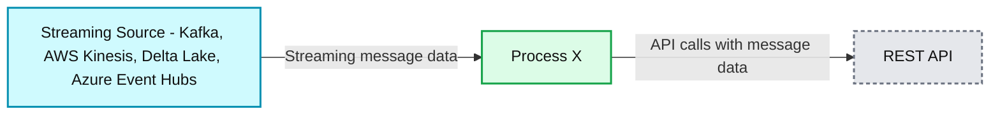
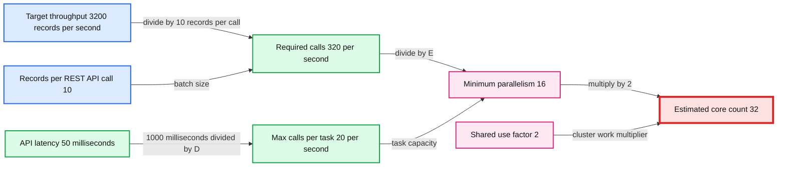

# Scalable Spark Structured Streaming for REST API Destinations

*How to use Spark Structured Streaming's foreachBatch to scalably publish data to REST APIs*

- Source: https://www.databricks.com/blog/scalable-spark-structured-streaming-rest-api-destinations
- Published: 2023-03-02
- Authors: Art Rask, Jay Palaniappan
- Categories: engineering, data-streaming
- Images: 5 total, 5 extracted as architecture

Spark Structured Streaming is the widely-used open source engine at the foundation of [data streaming on the Databricks Lakehouse Platform](https://www.databricks.com/product/data-streaming). It can elegantly handle diverse logical processing at volumes ranging from small-scale ETL to the largest Internet services. This power has led to adoption in many use cases across industries.

Another strength of Structured Streaming is its ability to handle a variety of both sources and sinks (or destinations). In addition to numerous sink types supported natively (incl. Delta, AWS S3, Google GCS, Azure ADLS, Kafka topics, Kinesis streams, and more), Structured Streaming supports a specialized sink that has the ability to perform arbitrary logic on the output of a streaming query: the foreachBatch extension method. With [foreachBatch](https://docs.databricks.com/structured-streaming/foreach.html), any output target addressable through Python or Scala code can be the destination for a stream.

In this post we will share best practice guidance we've given customers who have asked how they can scalably turn streaming data into calls against a REST API. Routing an incoming stream of data to calls on a REST API is a requirement seen in many integration and data engineering scenarios.

Some practical examples that we often come across are in Operational and Security Analytics workloads. Customers want to ingest and enrich real-time streaming data from sources like kafka, eventhub, and Kinesis and publish it into operational search engines like Elasticsearch, Opensearch, and Splunk. A key advantage of Spark Streaming is that it allows us to enrich, perform data quality checks, and aggregate (if needed) before data is streamed out into the search engines. This provides customers a high quality real-time data pipeline for operational and security analytics.

The most basic representation of this scenario is shown in Figure 1. Here we have an incoming stream of data - it could be a Kafka topic, AWS Kinesis, Azure Event Hub, or any other streaming query source. As messages flow off the stream we need to make calls to a REST API with some or all of the message data.

*Figure 1*

**Summary:** Data flows from a streaming source through Process X to a REST API.

**Components:**
- Streaming Source: Apache Kafka, AWS Kinesis, Delta Lake, and Azure Event Hubs, represented by logos.
- Process X: Processing component with unspecified technology.
- REST API: API destination with unspecified technology.

**Flows:**
- Streaming Source -> Process X: Streaming message data.
- Process X -> REST API: API calls carrying message data.

**Numbers:** none



<sub>source image: https://www.databricks.com/sites/default/files/inline-images/db-504-blog-img-1.png</sub>

Figure 1

In a greenfield environment, there are many technical options to implement this. Our focus here is on teams that already have streaming pipelines in Spark for preparing data for machine learning, data warehousing, or other analytics-focused uses. In this case, the team will already have skills, tooling and DevOps processes for Spark. Assume the team now has a requirement to route some data to REST API calls. If they wish to leverage existing skills or avoid re-working their tool chains, they can use Structured Streaming to get it done.

## Key Implementation Techniques, and Some Code

A basic code sample is included as Exhibit 1. Before looking at it in detail, we will call out some key techniques for effective implementation.

For a start, you will read the incoming stream as you would any other streaming job. All the interesting parts here are on the output side of the stream. If your data must be transformed in flight before posting to the REST API, do that as you would in any other case. This code snippet reads from a Delta table; as mentioned, there are many other possible sources.

For directing streamed data to the REST API, take the following approach:

1. Use the foreachBatch extension method to pass incoming micro-batches to a handler method `(callRestAPIBatch)` which will handle calls to the REST API.
2. Whenever possible, group multiple rows from the input on each outgoing REST API call. In relative terms, making the API call over HTTP will be a slow part of the process. Your ability to reach high throughput will be dramatically improved if you include multiple messages/records on the body of each API call. Of course, what you can do will be dictated by the target REST API. Some APIs allow a POST body to include many items up to a maximum body size in bytes. Some APIs have a max count of items on the POST body. Determine the max you can fit on a single call for the target API. In your method invoked by foreachBatch, you will have a prep step to transform the micro-batch dataframe into a pre-batched dataframe where each row has the grouped records for one call to the API. This step is also a chance for any last transform of the records to the format expected by the target API. An example is shown in the code sample in Exhibit 1 with the call to a helper function named `preBatchRecordsForRestCall`.
3. In most cases, to achieve a desired level of throughput, you will want to make calls to the API from parallel tasks. You can control the degree of parallelism by calling `repartition` on the dataframe of pre-batched data. Call `repartition` with the number of parallel tasks you want calling the API. This is actually just one line of code.  It is worth mentioning (or admitting) that using repartition here is a bit of an anti-pattern. Explicit repartitioning with large datasets can have performance implications, especially if it causes a shuffle between nodes on the cluster. In most cases of calling a REST API, the data size of any micro-batch is not massive. So, in practical terms, this technique is unlikely to cause a problem. And, it has a big positive effect on throughput to the API.
4. Execute a dataframe transformation that calls a nested function dedicated to making a single call to the REST API. The input to this function will be one row of pre-batched data. In the sample, the `payload` column has the data to include on a single call. Call a dataframe action method to invoke execution of the transformation.
5. Inside the nested function which will make one API call, use your libraries of choice to issue an HTTP POST against the REST API. This is commonly done with the [Requests](https://pypi.org/project/requests/) library but any library suitable for making the call can be considered. See the `callRestApiOnce` method in Exhibit 1 for an example.
6. Handle potential errors from the REST API call by using a try..except block or checking the HTTP response code. If the call is unsuccessful, the overall job can be failed by throwing an exception (for job retry or troubleshooting) or individual records can be diverted to a dead letter queue for remediation or later retry.

The six elements above should prepare your code for sending streaming data to a REST API, with the ability to scale for throughput and to handle error conditions cleanly. The sample code in Exhibit 1 is an example implementation. Each point stated above is reflected in the full example.

Exhibit 1

## Design and Operational Considerations

### Exactly Once vs At Least Once Guarantees

As a general rule in Structured Streaming, using foreachBatch only provides at-least-once delivery guarantees. This is in contrast to the exactly-once delivery guarantee provided when writing to sinks [like a Delta table](https://docs.databricks.com/structured-streaming/delta-lake.html#delta-table-as-a-sink) like a Delta table or file sinks. Consider, for example, a case where 1,000 records arrive on a micro-batch and your code in foreachBatch begins calling the REST API with the batch. In a hypothetical failure scenario, let's say that 900 calls succeed before an error occurs and fails the job. When the stream restarts, processing will resume by re-processing the failed batch. Without additional logic in your code, the 900 already-processed calls will be repeated. It is important that you determine in your design whether this is acceptable, or whether you need to take additional steps to protect against duplicate processing.

The general rule when using foreachBatch is that your target sink (REST API in this case) should be idempotent or that you must do additional tracking to account for multiple calls with the same data.

### Estimating Cluster Core Count for a Target Throughput

Given these techniques to call a REST API with streaming data, it will quickly become necessary to estimate how many parallel executors/tasks are necessary to achieve your required throughput. And you will need to select a cluster size. The table below shows an example calculation for estimating the number of worker cores to provision in the cluster that will run the stream.

**Summary:** The table estimates the Spark cluster core count required to sustain a target REST API throughput.

**Components:**

- Target throughput: 3200 records/sec required by the stream and REST API
- Records per REST API call: 10 records per POST body
- Required API call rate: 320 calls/sec
- API latency: 50 ms per call
- Per-task call capacity: 20 calls/sec
- Minimum task parallelism: 16 tasks
- Shared use factor: 2
- Estimated core count: 32 worker cores

**Flows:**

- Target throughput -> Required API call rate: records divided by records per call
- API latency -> Per-task call capacity: 1000 ms divided by latency
- Required API call rate -> Minimum task parallelism: calls divided by per-task capacity
- Minimum task parallelism -> Estimated core count: multiplied by shared use factor

**Numbers:** 3200 records/sec, 10 records per REST API call, 320 calls/sec, 50 ms, 20 calls per task per second, 16 tasks, 2 shared use factor, 32 worker cores, 1000 ms, A / B rounded up, 1000 ms / D rounded up, C / E rounded up, F * G rounded up



<sub>source image: https://www.databricks.com/sites/default/files/inline-images/db-504-blog-img-2.png</sub>

Line H in the table shows the estimated number of worker cores necessary to sustain the target throughput. In the example shown here, you could provision a cluster with two 16-core workers or 4 8-core workers, for example. For this type of workload, fewer nodes with more cores per node is preferred.

Line H is also the number that would be put in the repartition call in foreachBatch, as described in item 3 above.

Line G is a rule of thumb to account for other activity on the cluster. Even if your stream is the only job on the cluster, it will not be calling the API 100% of the time. Some time will be spent reading data from the source stream, for example. The value shown here is a good starting point for this factor - you may be able to fine tune it based on observations of your workload.

Obviously, this calculation only provides an estimated starting point for tuning the size of your cluster. We recommend you start from here and adjust up or down to balance cost and throughput.

## Other Factors to Consider

There are other factors you may need to plan for in your deployment. These are outside the scope of this post, but you will need to consider them as part of implementation. Among these are:

1. Authentication requirements of the target API: It is likely that the REST API will require authentication. This is typically done by adding required headers in your code before making the HTTP POST.
2. Potential rate limiting: The target REST API may implement rate limiting which will place a cap on the number of calls you can make to it per second or minute. You will need to ensure you can meet throughout targets within this limit. You'll also want to be ready to handle throttling errors that may occur if the limit is exceeded.
3. Network path required from worker subnet to target API: Obviously, the worker nodes in the host Spark cluster will need to make HTTP calls to the REST API endpoint. You'll need to use the available cloud networking options to configure your environment appropriately.
4. If you control the implementation of the target REST API (e.g., an internal custom service), be sure the design of that service is ready for the load and throughput generated by the streaming workload.

## Measured Throughput to a Mocked API with Different Numbers of Parallel Tasks

To provide representative data of scaling REST API calls as described here, we ran tests using code very similar to Example 1 against a mocked up REST API that persisted data in a log.

Results from the test are shown in Table 1. These metrics confirm near-linear scaling as the task count was increased (by changing the partition count using repartition). All tests were run on the same cluster with a single 16-core worker node.

*Table 1*

**Summary:** Table 1 benchmarks REST API processing throughput and latency across different rows per API call and partition counts.

**Components:**

- Rows per API Call: benchmark input size
- Partitions threads: parallel Spark task count
- Total calls: REST API request volume
- Seconds to complete processing: total processing duration
- Rows per second: processing throughput
- Calls per second: API request throughput
- Calls per thread per second: per-thread request throughput
- Apprx API Latency ms: approximate REST API latency

**Flows:**

- none

**Numbers:** 1, 4, 8, 16, 21,932, 179, 122, 30.5, 34, 88, 249, 31.1, 33, 49, 447, 27.9, 38, 10, 48, 456, 45, 11.3, 91, 25, 877, 87, 10.9, 100, 13, 1687, 168, 10.5, 100, ms

```text
%% mermaid failed to render; kept as text
%% Shows benchmark table rows for REST API processing
flowchart LR
  H1[Rows per API Call]
  H2[Partitions threads]
  H3[Total calls]
  H4[Seconds to complete processing]
  H5[Rows per second]
  H6[Calls per second]
  H7[Calls per thread per second]
  H8[Apprx API Latency ms]

  R1[1 | 4 | 21932 | 179 | 122 | 122 | 30.5 | 34]
  R2[1 | 8 | 21932 | 88 | 249 | 249 | 31.1 | 33]
  R3[1 | 16 | 21932 | 49 | 447 | 447 | 27.9 | 38]
  R4[10 | 4 | 21932 | 48 | 456 | 45 | 11.3 | 91]
  R5[10 | 8 | 21932 | 25 | 877 | 87 | 10.9 | 100]
  R6[10 | 16 | 21932 | 13 | 1687 | 168 | 10.5 | 100]

  classDef client fill:#dbeafe,stroke:#2563eb,stroke-width:2px,color:#111
  classDef service fill:#dcfce7,stroke:#16a34a,stroke-width:2px,color:#111
  classDef store fill:#ede9fe,stroke:#7c3aed,stroke-width:2px,color:#111
  classDef cache fill:#fef3c7,stroke:#d97706,stroke-width:2px,color:#111
  classDef queue fill:#cffafe,stroke:#0891b2,stroke-width:2px,color:#111
  classDef critical fill:#fee2e2,stroke:#dc2626,stroke-width:4px,color:#111
  classDef external fill:#e5e7eb,stroke:#6b7280,stroke-width:2px,color:#111,stroke-dasharray:4 3
  classDef decision fill:#fce7f3,stroke:#db2777,stroke-width:2px,color:#111
  H1,H2,H3,H4,H5,H6,H7,H8 service
  R1,R2,R3,R4,R5,R6 store
```

<sub>source image: https://www.databricks.com/sites/default/files/inline-images/db-504-blog-img-3.png</sub>

Table 1

## Representative All up Pipeline Designs

1. Routing some records in a streaming pipeline to REST API (in addition to persistent sinks)

This pattern applies in scenarios where a Spark-based data pipeline already exists for serving analytics or ML use cases. If a requirement emerges to post cleansed or aggregated data to a REST API with low latency, the technique described here can be used.

**Summary:** An Autoloader-based Databricks streaming pipeline moves data from ADLS through Bronze, Silver, and Gold tables to BI reporting, REST API delivery, and notebook ML training.

**Components:**

- ADLS Container
- Autoloader
- Ingest Stream
- Bronze Table using Databricks
- Cleansing Stream
- Silver Table using Databricks
- Aggregation Stream
- Gold Table using Databricks
- BI Reporting
- REST API
- Notebook ML Training

**Flows:**

- ADLS Container -> Autoloader: incoming data files
- Autoloader -> Ingest Stream: ingested records
- Ingest Stream -> Bronze Table: raw streaming data
- Bronze Table -> Cleansing Stream: bronze records
- Cleansing Stream -> Silver Table: cleansed streaming data
- Silver Table -> Aggregation Stream: silver records
- Aggregation Stream -> Gold Table: aggregated streaming data
- Gold Table -> BI Reporting: analytics-ready data
- Silver Table -> Notebook ML Training: data for ML training
- Silver Table -> To API: cleansed data for API delivery
- To API -> REST API: API requests

**Numbers:** none



<sub>source image: https://www.databricks.com/sites/default/files/inline-images/db-504-blog-img-4.png</sub>

```mermaid
%% Streaming pipeline from ADLS to analytics, ML training, and REST API delivery
flowchart LR
    A[ADLS Container] -->|incoming data files| B[Autoloader]
    B -->|ingested records| C[Ingest Stream]
    C -->|raw streaming data| D[Bronze Table]
    D -->|bronze records| E[Cleansing Stream]
    E -->|cleansed streaming data| F[Silver Table]
    F -->|silver records| G[Aggregation Stream]
    G -->|aggregated streaming data| H[Gold Table]
    H -->|analytics-ready data| I[BI Reporting]
    F -->|data for ML training| J[Notebook ML Training]
    F -->|cleansed data for API delivery| K[To API]
    K -->|API requests| L[REST API]

    classDef client fill:#dbeafe,stroke:#2563eb,stroke-width:2px,color:#111
    classDef service fill:#dcfce7,stroke:#16a34a,stroke-width:2px,color:#111
    classDef store fill:#ede9fe,stroke:#7c3aed,stroke-width:2px,color:#111
    classDef cache fill:#fef3c7,stroke:#d97706,stroke-width:2px,color:#111
    classDef queue fill:#cffafe,stroke:#0891b2,stroke-width:2px,color:#111
    classDef critical fill:#fee2e2,stroke:#dc2626,stroke-width:4px,color:#111
    classDef external fill:#e5e7eb,stroke:#6b7280,stroke-width:2px,color:#111,stroke-dasharray:4 3
    classDef decision fill:#fce7f3,stroke:#db2777,stroke-width:2px,color:#111

    class A,L external
    class B,C,E,G,K service
    class D,F,H store
    class I,J client
```

2. Simple Autoloader to REST API job

This pattern is an example of leveraging the diverse range of sources supported by Structured Streaming. Databricks makes it simple to consume incoming near real-time data - for example using Autoloader to ingest files arriving in cloud storage. Where Databricks is already used for other use cases, this is an easy way to route new streaming sources to a REST API.

**Summary:** The diagram shows data flowing from an ADLS container through Autoloader and an ingest stream to a REST API.

**Components:**

- ADLS Container - Azure Data Lake Storage
- Autoloader - Databricks file ingestion
- Ingest Stream - Structured Streaming
- REST API - HTTP endpoint

**Flows:**

- ADLS Container -> Autoloader: incoming files
- Autoloader -> Ingest Stream: ingested data
- Ingest Stream -> REST API: streamed records

**Numbers:** none



<sub>source image: https://www.databricks.com/sites/default/files/inline-images/db-504-blogs-img-5.png</sub>

```mermaid
%% Shows data flowing from ADLS through Autoloader and an ingest stream to a REST API
flowchart LR
    A[ADLS Container] -->|incoming files| B[Autoloader]
    B -->|ingested data| C[Ingest Stream]
    C -->|streamed records| D[REST API]

    classDef client   fill:#dbeafe,stroke:#2563eb,stroke-width:2px,color:#111
    classDef service  fill:#dcfce7,stroke:#16a34a,stroke-width:2px,color:#111
    classDef store    fill:#ede9fe,stroke:#7c3aed,stroke-width:2px,color:#111
    classDef cache    fill:#fef3c7,stroke:#d97706,stroke-width:2px,color:#111
    classDef queue    fill:#cffafe,stroke:#0891b2,stroke-width:2px,color:#111
    classDef critical fill:#fee2e2,stroke:#dc2626,stroke-width:4px,color:#111
    classDef external fill:#e5e7eb,stroke:#6b7280,stroke-width:2px,color:#111,stroke-dasharray:4 3
    classDef decision fill:#fce7f3,stroke:#db2777,stroke-width:2px,color:#111

    class A store
    class B,C service
    class D external
```

## Summary

We have shown here how structured streaming can be used to send streamed data to an arbitrary endpoint - in this case, via HTTP POST to a REST API. This opens up many possibilities for flexible integration with analytics data pipelines. However, this is really just one illustration of the power of foreachBatch in Spark Structured Streaming.

The foreachBatch sink provides the ability to address many endpoint types that are not among the native sinks. Besides REST APIs, these can include databases via JDBC, almost any supported Spark connector, or other cloud services that are addressable via a helper library or API. One example of the latter is pushing data to certain AWS services using the boto3 library.

This flexibility and scalability enables Structured Streaming to underpin a vast range of real-time solutions across industries.

If you are a Databricks customer, simply follow the [getting started tutorial](https://docs.databricks.com/getting-started/streaming.html) to familiarize yourself with Structured Streaming. If you are not an existing Databricks customer, [sign up for a free trial](https://www.databricks.com/try-databricks).
