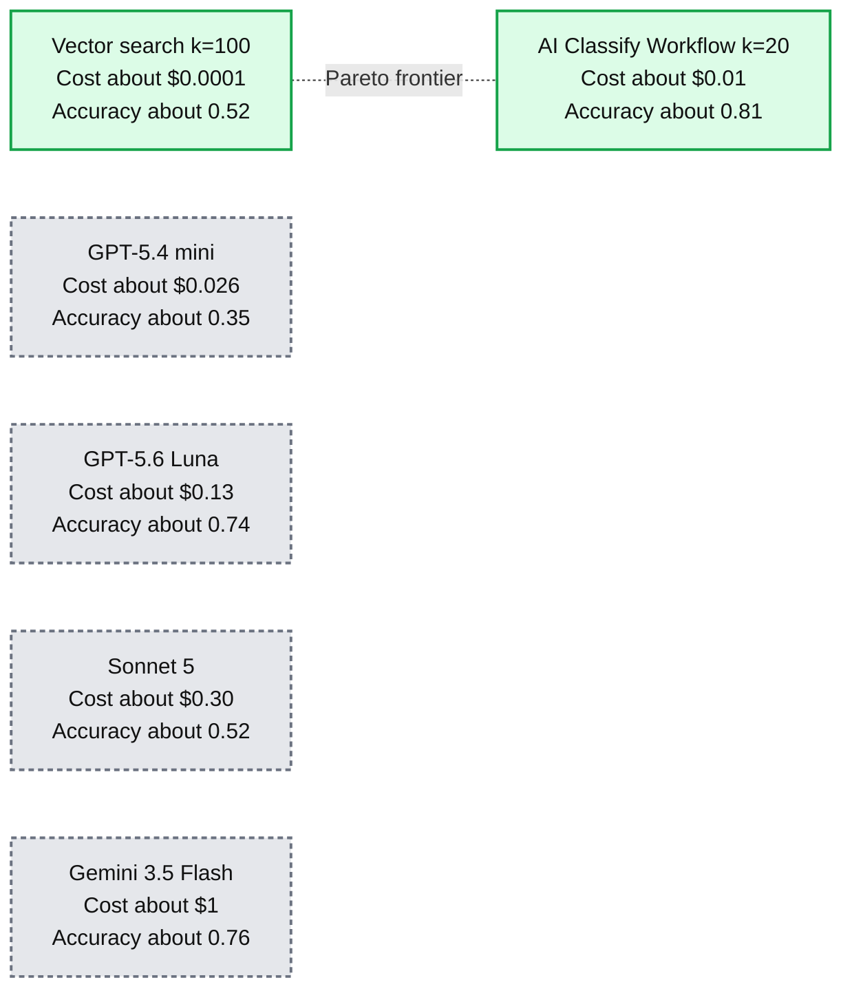

# Scaling document classification to 100k+ labels

*How combining AI Classify with vector search beats frontier models on accuracy and cost.*

- Source: https://www.databricks.com/blog/scaling-document-classification-100k-labels
- Published: 2026-07-20
- Authors: Jane Zhang, Arnav Singhvi
- Categories: engineering, data-science-machine-learning, databricks-ai
- Images: 1 total, 1 extracted as architecture

**Key takeaways**

- Mapping text to large taxonomies of 100,000+ labels, whether that's biomedical entity linking, vendor normalization, or company deduplication, is a common production problem where regex, trained classifiers, and direct LLM calls all struggle on cost, maintenance, and context limits.
- Our solution pairs vector search with the Databricks AI Classify function: retrieve a shortlist of candidate labels per document, then let the AI Classify function pick from that shortlist instead of the full taxonomy.
- Across three benchmarks spanning these use cases, SQL-native vector search plus AI Classify beat the best cost-efficient frontier model by five points of accuracy at roughly a hundredth of the token cost.

Across Databricks, thousands of customers build production workloads that map freeform text to normalized taxonomies of 100k+ labels. A few common use cases include:

- *Biomedical entity linking. *Clinical notes and research papers mention diseases, drugs, and procedures that must be matched to a concept in the [Unified Medical Language System](https://www.nlm.nih.gov/research/umls/index.html), a vocabulary with thousands of biomedical concept identifiers.
- *Vendor normalization. *To analyze spending patterns, financial companies normalize raw transaction strings like "SBUX #4471 SEATTLE WA" against a set of 100,000+ merchants.
- *Company normalization.* Enterprises deduplicate customer records across different internal systems by matching company descriptions against a set of 100,000+ companies.

Each of these use cases defines a large set of labels, also called a *taxonomy*, and every input must be mapped to one or more of its labels. Customers typically evaluate their production solution based on these criteria:

1. **Quality:** Produce classifications that are accurate enough to drive downstream decisions.
2. **Cost:** Keep the per-document classification cost low, especially at scale.
3. **Throughput:** Process large workflows, often on the order of hundreds of thousands of documents, within a reasonable timeframe.

Meeting all three requirements makes production large taxonomy classification difficult, and we prioritize researching and building solutions to them at Databricks.

## Why existing approaches fall short

Historically, organizations approached large taxonomy classification by relying on custom regex rules, keyword matching, and supervised machine learning classifiers. However, these approaches fall short on a few dimensions:

**Brittle pattern matching. **Regex and keyword rules depend on exact matches, so they break on unpredictable formatting from real life data. Companies like [YipitData](https://www.databricks.com/customers/yipitdata/ai) needed to continuously update their regex patterns to address edge cases and taxonomy changes which are difficult to maintain at the scale of thousands of labels.

**Sparse and skewed ground truth.** Real label distributions are long-tailed: a handful of labels cover most documents, while thousands appear rarely. Most customers lack ground truth documents for every label in their taxonomy, which makes supervised classifiers hard to train. A classifier cannot learn to classify labels that are not included in the training data, and class imbalance causes classifiers to over-predict commonly represented labels and under-predict rare labels.

**Taxonomy drift. **Labels and their descriptions are constantly added, retired, and rewritten to account for new business use cases and to improve classification quality. On each new taxonomy version, regex patterns need to be updated and classifiers retrained and deployed.

Recently, we've seen more customers use large language models (LLMs) for classification.* *With LLMs, customers no longer need to train models or maintain brittle regex patterns. However, at the scale of hundreds of thousands of labels, LLMs struggle to fit and reason over the taxonomy within their context window. With thousands of candidates in a single prompt, models also begin to hallucinate, returning labels that do not exist in the taxonomy at all. Passing the entire taxonomy for hundreds of thousands of documents to a frontier model is also costly at scale, even when taking advantage of prompt caching.

## How we approach large label classification

We evaluate three different methods to find the best balance of cost and quality for large taxonomies:

### **Method 1: Vector search**

The first method we test is using vector search to retrieve the best label given the input. We embed every label, with its description when present, and the input document using the Qwen3-Embedding-8B model, [a top-ranked open-weight embedding model](https://huggingface.co/spaces/mteb/leaderboard) as of July 2026. We then score each label’s relevance to the document with a hybrid score that weighs both semantic and lexical similarity.

The semantic score is determined by calculating the cosine similarity between the document and label embeddings; a higher cosine similarity means the label matches the document closely in meaning even if the text does not exactly match. The lexical score is computed with the [BM25 algorithm](https://en.wikipedia.org/wiki/Okapi_BM25), which weights each shared term by its inverse document frequency across the label set, so a generic verb like "use" that occurs in thousands of labels receives a low weight while a rare token like "ETL" receives a high one.

Each search method returns its own ranked list of labels. We merge the two lists with Reciprocal Rank Fusion, which scores each label by its position in each list. We take the top k, sweeping k over 1, 5, 10, 20, 50, 100, and 200 to find the value with the best average accuracy and use the top-ranked label as the prediction.

At the scale of hundreds of thousands of labels, embedding the taxonomy once and building an in-memory index is more cost effective than creating a hosted vector search index. Embedding 100k labels uses ~1.6 GB of storage assuming Qwen3-8B 4096-dim float32 embeddings and takes approximately 1-3 minutes to embed using the [Databricks AI Query function](https://docs.databricks.com/aws/en/sql/language-manual/functions/ai_query). Then at the start of a workload, we create a vector search instance in memory, ingest the persisted embeddings, and use the index for all documents throughout the duration of the workload. You can find example code for our vector search implementation in this [tutorial notebook](https://docs.databricks.com/aws/en/large-language-models/classify-documents-labels-tutorial).

### **Method 2: Vector search + AI Classify**

The second method we test is a two-step workflow combining the vector search approach and the Databricks AI Classify function. [AI Classify](https://docs.databricks.com/aws/en/sql/language-manual/functions/ai_classify) is a Databricks AI function that takes a document and a map of labels to descriptions and returns the best-matching label or set of labels. The AI Classify function uses a combination of techniques to manage large documents and taxonomies while maintaining classification quality.

The AI Classify function can be run with SQL as follows:

We create a two-step workflow by using the same vector search retrieval described in method 1 to shortlist the k most similar labels per document, then pass only the shortlist to AI Classify. We tune k to the smallest value where accuracy stops improving and take the result of AI Classify as the prediction.

### **Method 3: Direct frontier model call**

The last method we test calls a frontier LLM directly with the input document and the list of labels, including descriptions where present, then prompts the model to return the correct label. The tested models are GPT-5.6 Luna, GPT-5.4 mini, Gemini 3.5 Flash, and Claude Sonnet 5—the latest models within reach of our customers’ typical production classification budgets. Flagship models like Claude Opus 4.8, Claude Fable 5, and GPT-5.6 Sol cost three to ten times more per-token and are typically out of budget for customers running classification workflows with thousands of documents per day.

When the taxonomy exceeds a model's context length, we crop the label list to fit in the context window. We pass the taxonomy consistently across calls for each document to take advantage of prompt caching.

## How we evaluate

We benchmark each method on three datasets that cover the most common customer use cases mentioned above. Labels are embedded with their descriptions unless noted:

- **Transactions (100k labels, 200 eval docs):** synthetically generated transaction strings based on 100k top company names from [Crunchbase](https://www.crunchbase.com/).
- **Companies (100k labels, 200 eval docs):** company descriptions mapped to the same[Crunchbase](https://www.crunchbase.com/) company-name catalog as Transactions. Labels are names only.
- **MedMentions (35k labels, 200 eval docs):** biomedical mention linking to Unified Medical Language System concept identifiers from the[MedMentions corpus](https://github.com/chanzuckerberg/MedMentions).

Each dataset is scored on accuracy: the fraction of documents whose predicted label matches the ground truth label. We enable the model provider’s prompt caching option for all direct frontier model calls.

## Results

We plot accuracy against cost per document, averaged across the three datasets, for each approach. The cost includes the document embedding and LLM tokens with provider prompt-caching discounts applied. We exclude taxonomy embedding, a one-time cost that does not scale with workload size (see the storage estimates for our vector search configuration under "How we approach large label classification").

**Summary:** AI Classify Workflow achieves the highest average accuracy at a lower per-document cost than the four direct models shown.

**Components:**
- Vector search, k=100: Databricks vector search.
- AI Classify Workflow, k=20: Databricks classification workflow.
- GPT-5.6 Luna: OpenAI model.
- GPT-5.4 mini: OpenAI model.
- Sonnet 5: Anthropic model.
- Gemini 3.5 Flash: Google model.
- Pareto frontier: dashed line connecting vector search and AI Classify Workflow.

**Flows:**
- No directional arrows are visible. The dashed Pareto frontier connects vector search and AI Classify Workflow to indicate their accuracy-cost trade-off.

**Numbers:**
- Average accuracy axis: 0.0, 0.1, 0.2, 0.3, 0.4, 0.5, 0.6, 0.7, 0.8, 0.9, 1.0.
- Average cost per document axis, in dollars on a logarithmic scale: $0.0001, $0.001, $0.01, $0.1, $1.
- Approximate plotted values:
  - Vector search, k=100: $0.0001 per document, 0.52 accuracy.
  - AI Classify Workflow, k=20: $0.01 per document, 0.81 accuracy.
  - GPT-5.6 Luna: $0.13 per document, 0.74 accuracy.
  - GPT-5.4 mini: $0.026 per document, 0.35 accuracy.
  - Sonnet 5: $0.30 per document, 0.52 accuracy.
  - Gemini 3.5 Flash: $1 per document, 0.76 accuracy.
- Model-name numbers: 5.6, 5.4, 5, 3.5.

source image: https://www.databricks.com/sites/default/files/blog_images/scaling-document-classification-to-100k-labels-blog-img-1.png

Across all datasets, the AI Classify Workflow scores above every direct frontier model, with 0.81 average accuracy against 0.76 for the next-best option, Gemini 3.5 Flash, at a hundredth of the per-document cost. The quality of the AI Classify Workflow, on average, is best when we shortlist the top twenty labels from vector search to pass to the AI Classify function.

Vector search alone is close to a hundred times cheaper than the AI Classify Workflow, since only the document needs to be embedded and the CPU cost of ranking is negligible. However, even after tuning k, it scores more than twenty points below the AI Classify Workflow.

For the largest taxonomies, the direct frontier call cannot fit the full label set in the model's context window. On MedMentions, only GPT-5.6 Luna held the entire taxonomy inside its 1M-token context; after tokenization, no other model could fit the label set within its limit. At this point, teams can choose to evaluate batch, multi-step, and agentic strategies to manage context—capabilities our team has built and continue to refine in the AI Classify function.

## Conclusion

Across three benchmarks spanning 35,000 to 100,000 labels, the AI Classify workflow combining vector search and the Databricks AI Classify function gave the best balance of cost and quality. It exceeds the strongest direct frontier model, Gemini 3.5 Flash, by five points at roughly a hundredth of the per-document cost. When the taxonomy changes, retired labels can be removed and new labels embedded and ingested at the start of the workflow, with no retraining or redeployment.

For teams facing classification at this scale, creating a workflow with AI Classify and vector search is a great place to start. This[step-by-step tutorial](https://docs.databricks.com/aws/en/large-language-models/classify-documents-labels-tutorial) walks through the full workflow on Databricks, from embedding the label set to selecting K.

[Try AI Classify Workflow](https://docs.databricks.com/aws/en/large-language-models/classify-documents-labels-tutorial)
