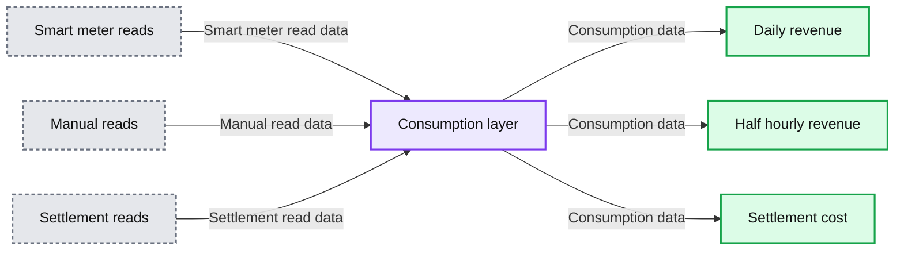

# Scaling for MHHS: 50x cost-efficient margin data engineering at Octopus Energy

*How a team of three engineers re-architected Octopus Energy’s data pipelines to handle a 48x increase in data volume, and cut projected costs by 50x in the process.*

- Source: https://www.databricks.com/blog/scaling-mhhs-how-octopus-energy-achieved-50x-cost-reduction-margin-data-engineering
- Published: 2026-05-23
- Authors: Saad Ali, David Poulet, Daniel Taylor, Ismail Makhlouf
- Categories: platform, solutions, engineering, data-engineering, industries, energy, data-strategy, industry-insights, company, customers
- Images: 1 total, 1 extracted as architecture

**Key takeaways**

- What it is: How Octopus Energy re-architected its margin data pipelines on Databricks to meet UK Market-wide Half-Hourly Settlement (MHHS) regulation.
- The challenge: MHHS multiplies settlement data volume 48x. One profiled monthly consumption value per household becomes 48 half-hourly settled values per day. Under the existing single-grain architecture, this was projected to add around $1 million a year to pipeline costs.
- The outcome: Three engineers rebuilt the pipelines from the ground up. Cost per settlement date fell from $23.63 to $0.48, which is 50x cheaper than the original projection. Incremental processing through Delta Lake Change Data Feed (CDF) and microbatch dbt drove a 98.8% reduction in rows processed, from 25 billion to 300 million. Data freshness rose from weekly to daily.

## The energy transition has a data problem

The UK grid is in the middle of its most significant structural transformation in decades. As wind and solar take a larger share of generation, intermittency becomes the binding constraint. Electricity is cheap when the sun shines and expensive when it doesn’t.

The settlement model the country has run on for thirty years cannot price that signal. A household on a non-half-hourly tariff is read once a month at the meter, and that single reading is profiled across the month against an industry profile class. The settlement input is a meters’ monthly number shaped by an average customer’s half-hourly pattern. Demand never shifts to match supply because no one ever sees the price.

Market-wide Half-Hourly Settlement is the regulatory response. Meter reads move from monthly to half-hourly. Consumption settles at meters’ half-hourly granularity. For a supplier like Octopus Energy with over 8 million customers, that is a 48x increase in the data volume feeding every margin calculation, every settlement obligation, and every commercial decision downstream. Without re-architecture, the cost of running Octopus Energy’s margin pipelines under MHHS was projected to rise by $1 million a year.

## Why throwing compute at this doesn't work

The instinct, when a dataset goes up 48x, is to provision more infrastructure. The cheapest fix is often to buy the next tier of cluster and move on.

This was not one of those problems. The projected cost per settlement date under the legacy architecture was $23.63, a 33x increase on historical norms. Across settlement windows, the bill compounds quickly enough to make the cluster-tier argument collapse on first inspection.

The deeper issue was that the pipeline was built around a single grain. Billing ran monthly. Settlement ran monthly. Industry data arrived monthly. The architecture assumed those grains would stay aligned, and they did, until MHHS.

After MHHS, the alignment broke on the cost side first. Industry cost data started arriving at half-hourly granularity, 48 data points per customer per day. Margin is revenue minus cost, and you cannot net a half-hourly actual cost against a monthly profiled revenue without introducing reconciliation error that compounds across 8 million customers. Revenue had to move to match. For standard tariff customers that meant daily actuals at minimum. For smart tariff customers on electric vehicle (EV), heat pump, and time-of-use products, it meant half-hourly actuals, because the price signal those products are sold on is itself half-hourly.

Three grains, all forced by the same arithmetic constraint. None of which a monolithic monthly pipeline could serve.

## The architecture: three streams, one source of truth

The rebuild was led by Ve Gomez, Lily Chau, and Ben Wood. They re-architected the pipeline around three streams, each running at the grain its margin arithmetic required.

**Settlement cost. **Half-hourly granularity for regulatory settlement and industry cost allocation. Industry charges at 48 data points per meter per day, and this stream matches that grain exactly.

**Half-hourly revenue. **Half-hourly revenue calculation for smart tariff customers on EV, heat pump, and time-of-use products. The half-hourly cost from Settlement nets against half-hourly revenue from this stream. Margin is computed at the grain the customer is actually being priced at.

**Daily revenue.** Daily actuals for customers on standard tariffs with non-half hourly rates. The grain is finer than the legacy monthly profiled input, because daily is the minimum grain at which a meaningful margin can be calculated against half-hourly settlement costs. Billing still settles monthly for the customer. The internal margin view runs daily.

The three streams run under a “Job of Jobs” orchestration pattern, where a parent Databricks workflow manages dependencies and parallel execution across child jobs. Each stream is independently tunable. Spark optimisations that work for Settlement are not necessarily right for daily revenue.

Beneath all three sits the consumption layer: a unified, multi-grain source of truth consolidating meter reads, smart meter data, and industry flows at multi-terabyte scale. It reconciles billing against settlement across all three grains.

**Summary:** Smart meter, manual, and settlement reads feed a consumption layer that supplies daily revenue, half hourly revenue, and settlement cost.

**Components:**
- Smart meter reads: input data; technology unspecified.
- Manual reads: input data; technology unspecified.
- Settlement reads: input data; technology unspecified.
- Consumption layer: shared consumption data layer; technology unspecified.
- Daily revenue: revenue output; technology unspecified.
- Half hourly revenue: revenue output; technology unspecified.
- Settlement cost: cost output; technology unspecified.

**Flows:**
- Smart meter reads -> Consumption layer: smart meter read data.
- Manual reads -> Consumption layer: manual read data.
- Settlement reads -> Consumption layer: settlement read data.
- Consumption layer -> Daily revenue: consumption data for daily revenue.
- Consumption layer -> Half hourly revenue: consumption data for half hourly revenue.
- Consumption layer -> Settlement cost: consumption data for settlement cost.

**Numbers:** none

source image: https://www.databricks.com/sites/default/files/inline-images/three-streams.png

## Incremental processing: 98.8% fewer rows

Gross Margin sits downstream of platform-owned sources and does not control whether CDF is enabled at the upstream table. The approach had to be hybrid. Where CDF was already enabled by the platform, the pipeline used it to detect and read only changed records. Where CDF was not available, microbatch dbt did the same job a different way: small, frequent batch runs reading on a watermark, processing only the slice of data that had landed since the last run. Both mechanisms produce incremental consumption datasets that the downstream layer consumes identically.

Rows processed per run dropped from 25 billion to 300 million, a 98.8% reduction. Data freshness improved from weekly to daily, which means margin visibility at the grain where pricing decisions actually get made.

The annualised savings figures below exclude the additional savings from incremental processing on the consumption layer. The full efficiency gain is larger than the headline number.

## Spark & Delta optimisation, and what to remove

With 48x more data flowing through the system, the team applied targeted optimisations across the four parts, each validated by measurement.

**Lineage and input/output (I/O) reduction. **Data was consolidated earlier in the pipeline to cut downstream joins and shuffle operations. Columns and rows were pruned at the earliest possible stage, keeping I/O overhead off the expensive transformations downstream.

**Join and partition tuning.** Broadcast joins for reference tables under 500MB removed shuffle from complex multi-key joins with date ranges. Partitioning was enabled across multiple tables on columns frequently used in filters and joins, namely time and location. This minimised data shuffling across the cluster and drastically sped up the transformations and the downstream operations.

**Trust the optimiser. **In several cases, Spark’s Adaptive Query Execution (AQE) outperformed hand-tuned logic. Custom optimisation code was removed and AQE allowed to run.

The last point matters more than it sounds. Removing unjustified compute operations was as impactful as adding new optimisations. Z-ordering and ANALYZE applied without measurement may be costing more than they save. The discipline is to check.

## Serverless as a development accelerator

Databricks Serverless made the delivery window viable. Zero cluster startup time meant the team could iterate at the pace of thought. Write, run, measure, adjust. The Serverless UI enabled side-by-side run comparisons, which made it practical to isolate the effect of individual optimisations rather than guessing.

From the team: “The testing and development process could not have been done without serverless. The serverless UI helped us identify bottlenecks and make easy comparisons between runs.”

## Results

| **Metric** | **Before** | **After** | **Change** |
|---|---|---|---|
| Rows processed per run | 25 billion | 300 million | 98.8% reduction |
| Cost per settlement date (projected MHHS) | $23.63 | $0.48 | ~50x reduction |
| Cost per settlement date (vs legacy) | $0.71 | $0.48 | 2x more efficient |
| Savings per month-end run | - | ~$83,000 | vs unoptimised projection |
| Annualised cost avoidance | - | ~$1,000,000 | excludes upstream savings |
| Data freshness | Weekly | Daily | 7x improvement |

The pipeline meets the half-hourly settlement regulation, and is more efficient than the one it replaced, on 48x the data.

## What this means beyond energy

MHHS is a UK energy regulation but the underlying pattern is not. Any time a system moves from monthly to daily, daily to real-time, or aggregate to transactional, the same dynamics apply: a single-grain pipeline meeting a multi-grain world, and a compute bill that scales with the mismatch rather than the workload.

Grain misalignment is the hidden cost driver. When a pipeline processes everything at the finest grain regardless of business need, you pay for it in compute, freshness, and maintenance complexity. Identify the natural grains in the data and align processing to them. It is a design decision, not a tuning decision.

Incremental processing transforms pipeline economics in a way no amount of tuning will match. The 98.8% row reduction here came from incremental logic, not join strategy. The mechanism matters less than the principle: read only what changed.

## The bigger picture

In Saad’s words: “By making our systems faster and more efficient, we can offer smarter tariffs that help our customers use energy when it’s cheapest and cleanest.”

A lower cost base removes the economic barrier to high-frequency data processing. Grid balancing becomes viable as a product. Smart tariffs become widely accessible to everyday consumers. MHHS compliance was the mandate. Making sustainable energy the affordable option is the mission. Data engineering is what connects the two.
