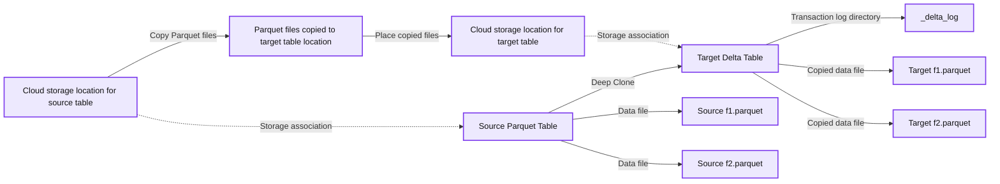
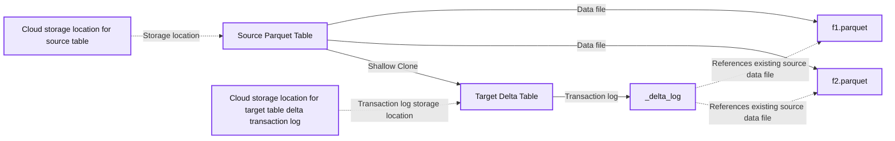
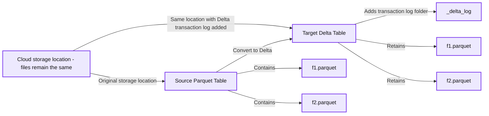
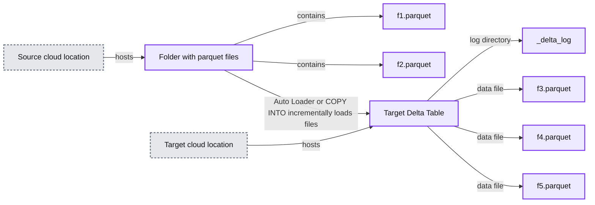

# Seamlessly Migrate Your Apache Parquet Data Lake to Delta Lake

- Source: https://www.databricks.com/blog/seamlessly-migrate-your-apache-parquet-data-lake-delta-lake
- Published: 2023-06-06
- Authors: Dipankar Kushari, Uday Satapathy
- Categories: engineering, data-engineering
- Images: 4 total, 4 extracted as architecture

[Apache Parquet](https://parquet.apache.org/) is one of the most popular open source file formats in the big data world today. Being column-oriented, Apache Parquet allows for efficient data storage and retrieval, and this has led many organizations over the past decade to adopt it as an essential way to store data in data lakes. Some of these companies went one step further and decided to use Apache Parquet files as 'database tables' – performing CRUD operations on them. However, Apache Parquet files, being just data files, without any transaction logging, statistics collection and indexing capabilities aren't good candidates for ACID compliant database operations. Building such tooling is a monumental task that would require a huge development team to develop on their own and to maintain it. The result was an Apache Parquet Data Lake. It was a makeshift solution at its best, suffering from issues such as accidental corruption of tables arising from brittle ACID compliance.

The solution came in the form of the [Delta Lake](https://delta.io/) format. It was designed to solve the exact problems Apache Parquet data lakes were riddled with. Apache Parquet was adopted as the base data storage format for Delta Lake and the missing transaction logging, statistics collection and indexing capabilities were built in, providing it with the much needed ACID compliance and guarantees. Open source Delta Lake, under the Linux Foundation, has been going from strength to strength, finding wide usage in the industry.

Over time, organizations have realized significant benefits moving their Apache Parquet data lake to Delta Lake, but it takes planning and selection of the right approach to migrate the data. There can even be scenarios where a business needs the Apache Parquet Data Lake to co-exist even after migrating the data to Delta Lake. For example, you might have an ETL pipeline that writes data to tables stored in Apache Parquet Data lake and you need to perform a detailed impact analysis before gradually migrating the data to Delta Lake. Until such time, you need to keep their Apache Parquet Data Lake and Delta Lake in sync. In this blog we will discuss a few similar use cases and show you how to tackle them.

## Advantages of moving from Apache Parquet to Delta Lake

- Any dataset composed solely of Apache Parquet files, without any transaction log tracking 'what has changed', leads to a brittle behavior with respect to ACID transactions. Such behavior may cause inconsistent reads during appending and modification of existing data. If write jobs fail mid-way, they may cause partial writes. These inconsistencies may make stakeholders lose trust on the data in regulated environments that require reproducibility, auditing, and governance. Delta Lake format, in contrast, is a fully ACID compliant data storage format.
- The time-travel feature of Delta Lake enables teams to be able to track versions and the evolution of data sets. If there are any issues with the data, the rollback feature gives teams the ability to go back to a prior version. You can then replay the data pipelines after implementing corrective measures.
- Delta Lake, owing to the bookkeeping processes in the form of transaction logs, file metadata, data statistics and clustering techniques, leads to a significant query performance improvement over Apache Parquet based data lake.
- Schema enforcement rejects any new columns or other schema changes that aren't compatible with your table. By setting and upholding these high standards, analysts and engineers can trust that their data has the highest levels of integrity, and reason about it with clarity, allowing them to make better business decisions. With Delta Lake users have access to simple semantics to control the schema, which includes schema enforcement, that prevents users from accidentally polluting their tables with mistakes or garbage data.
 Schema evolution complements enforcement by making it easy for intended schema changes to take place automatically. Delta Lake makes it simple to automatically add new columns of rich data when those columns belong.

You can refer to this [Databricks Blog series](https://www.databricks.com/blog/2019/08/21/diving-into-delta-lake-unpacking-the-transaction-log.html) to understand Delta Lake internal functionality.

## Considerations before migrating to Delta Lake

The methodology that needs to be adopted for the migration of Apache Parquet Data Lake to Delta Lake depends on one or many migration requirements which are documented in the matrix below.

| Requirements ⇨ Methods ⇩ | Complete overwrite at source | Incremental with append at source | Duplicates data | Maintains data structure | Backfill data | Ease of use |
|---|---|---|---|---|---|---|
| Deep CLONE Apache Parquet | Yes | Yes | Yes | Yes | Yes | Easy |
| Shallow CLONE Apache Parquet | Yes | Yes | No | Yes | Yes | Easy |
| CONVERT TO DELTA | Yes | No | No | Yes | No | Easy |
| Auto Loader | Yes | Yes | Yes | No | Optional | Some configuration |
| Batch Apache Spark job | Custom logic | Custom logic | Yes | No | Custom logic | Custom logic |
| COPY INTO | Yes | Yes | Yes | No | Optional | Some configuration |

Table 1 - Matrix to show options for migrations

Now let's discuss the migration requirements and how that impacts the choice of migration methodologies.

### Requirements

- **Complete overwrite at source**: This requirement specifies that the data processing program completely refreshes the data in source Apache Parquet data lake whenever it runs and data should be completely refreshed in the target Delta Lake after the conversion has begun
- **Incremental with append at source**: This requirement specifies that the data processing program refreshes the data in source Apache Parquet data lake by using UPSERT (INSERT, UPDATE or DELETE) whenever it runs and data should be incrementally refreshed in the target Delta Lake after the conversion has begun
- **Duplicates data**: This requirement specifies that data is written to a new location from the Apache Parquet Data Lake to Delta Lake. If data duplication is not preferred and there is no impact to the existing applications then the Apache Parquet Data Lake is modified to Delta Lake in place.
- **Maintains data structure**: This requirement specifies if the data partitioning strategy at source is maintained during conversion.
- **Backfill data**: Data backfilling involves filling in missing or outdated data from the past on a new system or updating old records. This process is typically done after a data anomaly or quality issue has resulted in incorrect data being entered into the data warehouse. In the context of this blog, the 'backfill data' requirement specifies the functionality that supports backfilling data that has been added to the conversion source after the conversion has begun.
- **Ease of use**: This requirement specifies the level of user effort to configure and run the data conversion.

### Methodologies with Details

#### Deep CLONE Apache Parquet

You can use Databricks [deep clone](https://docs.databricks.com/delta/clone.html#clone-types-1) functionality to [incrementally convert data](https://docs.databricks.com/delta/clone-parquet.html) from the Apache Parquet Data lake to the Delta Lake. Use this approach when **all** of the below criteria are satisfied:

- you need to either completely refresh or incrementally refresh the target Delta Lake table from a source Apache Parquet table
- in-place upgrade to Delta Lake is not possible
- data duplication (maintaining multiple copies) is acceptable
- the target schema needs to match the source schema
- you have a need for data backfill. In this context, it means in future you could have additional data coming into the source table. Through a subsequent Deep Clone operation, such new data would get copied into and synchronized with the target Delta Lake table.

*Fig 1: Deep CLONE Apache Parquet table*

**Summary:** Deep Clone copies a source Parquet table’s files into a target cloud storage location, where the target Delta table includes the copied files and a `_delta_log` directory.

**Components:**
- Cloud storage location for source table: source cloud storage.
- Source Parquet Table: Apache Parquet table.
- Source `f1.parquet`: Parquet data file.
- Source `f2.parquet`: Parquet data file.
- Parquet files copied to target table's location: copied Parquet files.
- Deep Clone: table cloning operation.
- Cloud storage location for target table: target cloud storage.
- Target Delta Table: Delta Lake table.
- `_delta_log`: Delta transaction log directory.
- Target `f1.parquet`: copied Parquet data file.
- Target `f2.parquet`: copied Parquet data file.

**Flows:**
- Source cloud storage -> Copied Parquet files: source files copied.
- Copied Parquet files -> Target cloud storage: files placed at the target location.
- Source cloud storage -> Source Parquet Table: source storage association, shown dashed.
- Target cloud storage -> Target Delta Table: target storage association, shown dashed.
- Source Parquet Table -> Source `f1.parquet`: data file association.
- Source Parquet Table -> Source `f2.parquet`: data file association.
- Source side -> Target side: Deep Clone operation, shown as a standalone rightward arrow.
- Target Delta Table -> `_delta_log`: transaction log directory association.
- Target Delta Table -> Target `f1.parquet`: copied data file association.
- Target Delta Table -> Target `f2.parquet`: copied data file association.

**Numbers:** File labels contain `1` and `2` in `f1.parquet` and `f2.parquet`, each appearing on both source and target sides. No quantities, units, percentages, or sizes are shown.

source image: https://www.databricks.com/sites/default/files/inline-images/db-581-blog-img-1.png

Fig 1: Deep CLONE Apache Parquet table

#### Shallow CLONE Apache Parquet

You can use Databricks [shallow clone](https://docs.databricks.com/delta/clone.html#clone-types-1) functionality to [incrementally convert data](https://docs.databricks.com/delta/clone-parquet.html) from Apache Parquet Data lake to Delta Lake, when you:

- want to either completely refresh or incrementally refresh the target Delta Lake table from a source Apache Parquet table
- don't want the data to be duplicated (or copied)
- want the same schema between the source and target
- also have a need for data backfilling. It means in future you could have additional data coming into the source side. Through a subsequent Shallow Clone operation, such new data would get recognized (but not copied) in the target Delta Lake table.

*Fig 2: Shallow CLONE Apache Parquet table*

**Summary:** A shallow clone creates a target Delta table with a separate transaction log that references the source Parquet table’s existing data files.

**Components:**

- Cloud storage location for source table: cloud storage containing source Parquet data.
- Source Parquet Table: Apache Parquet table.
- f1.parquet: Parquet data file.
- f2.parquet: Parquet data file.
- Shallow Clone: cloning operation connecting the source and target conceptually.
- Cloud storage location for target table's delta transaction log: cloud storage for the Delta transaction log.
- Target Delta Table: Delta Lake table.
- _delta_log: Delta transaction log referencing existing source data files.

**Flows:**

- Source cloud storage -> Source Parquet Table: source table storage location.
- Source Parquet Table -> f1.parquet: source data file association.
- Source Parquet Table -> f2.parquet: source data file association.
- Source side -> Target side: Shallow Clone operation.
- Target transaction log cloud storage -> Target Delta Table: target transaction log storage location.
- Target Delta Table -> _delta_log: transaction log association.
- _delta_log -> f1.parquet: reference to an existing source data file.
- _delta_log -> f2.parquet: reference to an existing source data file.

**Numbers:** The filenames f1.parquet and f2.parquet contain the identifiers 1 and 2. No quantities, units, percentages, or sizes are shown.

source image: https://www.databricks.com/sites/default/files/inline-images/db-581-blog-img-2.png

Fig 2: Shallow CLONE Apache Parquet table

#### CONVERT TO DELTA

You can use [Convert to Delta Lake](https://docs.databricks.com/delta/convert-to-delta.html#convert-to-delta-lake) feature if you have requirements for:

- only complete refresh (and not incremental refresh) of the target Delta Lake table
- no multiple copies of the data i.e. data needs to be converted in place
- the source and target tables to have the same schema
- no backfill of data. In this context, it means that data written to the source directory **after** the conversion has started may not reflect in the resultant target Delta table.

Since the source is transformed into a target Delta Lake table in-place, all future CRUD operations on the target table need to happen through Delta Lake ACID transactions.

Note - Please refer to the [Caveats](https://docs.databricks.com/sql/language-manual/delta-convert-to-delta.html#caveats) before using the CONVERT TO DELTA option. You should avoid updating or appending data files during the conversion process. After the table is converted, make sure all writes go through Delta Lake.

*Fig 3: Convert to Delta*

**Summary:** Converting a source Parquet table to Delta preserves its files in the same cloud storage location and adds a Delta transaction log folder.

**Components:**
- Cloud storage location: stores the existing files and the added Delta transaction log.
- Source Parquet Table: Apache Parquet table containing f1.parquet and f2.parquet.
- Source f1.parquet: Parquet data file.
- Source f2.parquet: Parquet data file.
- Convert to Delta: conversion operation.
- Target Delta Table: Delta table retaining the original Parquet files.
- _delta_log: Delta transaction log folder.
- Target f1.parquet: unchanged Parquet data file.
- Target f2.parquet: unchanged Parquet data file.

**Flows:**
- Cloud storage location -> Source Parquet Table: original files reside in cloud storage.
- Cloud storage location -> Target Delta Table: files remain in the same location, with a transaction log folder added.
- Source Parquet Table -> Source f1.parquet: table references the data file.
- Source Parquet Table -> Source f2.parquet: table references the data file.
- Source Parquet Table -> Target Delta Table: Convert to Delta.
- Target Delta Table -> _delta_log: added transaction log folder.
- Target Delta Table -> Target f1.parquet: retained data file.
- Target Delta Table -> Target f2.parquet: retained data file.

**Numbers:** File labels f1.parquet and f2.parquet appear on both sides; no quantitative values or units are shown.

source image: https://www.databricks.com/sites/default/files/inline-images/db-581-blog-img-3.png

Fig 3: Convert to Delta

#### Auto Loader

You can use [Auto Loader](https://docs.databricks.com/ingestion/auto-loader/index.html) to incrementally copy all data from a given cloud storage directory to a target Delta table. This approach can be used for the below conditions:

- you have requirements for either complete refresh or incremental refresh of the Delta Lake from Apache Parquet files stored in cloud object storage
- in place upgrade to a Delta Lake table is not possible
- data duplication (multiple copies of files) is allowed
- maintaining the data structure (schema) between source and target after the migration is not a requirement
- you do not have a specific need for data backfilling, but still want to have it as an option if need arises in the future

#### COPY INTO

You can use [COPY INTO](https://docs.databricks.com/ingestion/copy-into/index.html) SQL command to incrementally copy all data from a given cloud storage directory to a target Delta table. This approach can be used for the below conditions:

- If you have requirements for either complete refresh or incremental refresh of the Delta Lake table from the Apache Parquet files stored in the cloud object storage
- in-place upgrade to a Delta Lake table is not possible
- data duplication (multiple copies of files) is allowed
- adhering to the same schema between source and target after migration is not a requirement
- you do not have a specific need for data backfill

Both Auto Loader and COPY INTO allow the users plenty of options to configure the data movement process. Refer to this [link](https://docs.databricks.com/ingestion/index.html#when-to-use-copy-into-and-when-to-use-auto-loader) when you need to decide between COPY INTO and Auto Loader.

**Summary:** Auto Loader or COPY INTO incrementally loads Parquet files from a source cloud location into a Delta Lake table in a target cloud location.

**Components:**
- Source cloud location: cloud storage hosting the source files.
- Folder with parquet files: directory containing Parquet data.
- f1.parquet: source Parquet file.
- f2.parquet: source Parquet file.
- Autoloader / Copy Into: incremental loading into Delta Lake tables.
- Target cloud location: cloud storage hosting the target table.
- Target Delta Table: Delta Lake table.
- _delta_log: Delta Lake transaction log directory.
- f3.parquet: target Parquet file.
- f4.parquet: target Parquet file.
- f5.parquet: target Parquet file.

**Flows:**
- Source cloud location -> Folder with parquet files: source storage location.
- Folder with parquet files -> f1.parquet: contains source data file.
- Folder with parquet files -> f2.parquet: contains source data file.
- Source Parquet files -> Target Delta Table: Auto Loader or COPY INTO incrementally loads data, represented by the central arrow.
- Target cloud location -> Target Delta Table: target storage location.
- Target Delta Table -> _delta_log: table log directory.
- Target Delta Table -> f3.parquet: table data file.
- Target Delta Table -> f4.parquet: table data file.
- Target Delta Table -> f5.parquet: table data file.

**Numbers:** 1, 2, 3, 4, and 5 appear in the filenames f1.parquet through f5.parquet. No quantities or units are shown.

source image: https://www.databricks.com/sites/default/files/inline-images/db-581-blog-img-4.png

#### Batch Apache Spark job

Finally, you can use custom [Apache Spark](https://spark.apache.org/) logic to migrate to Delta Lake. It provides great flexibility in controlling how and when different data from your source system is migrated, but might require extensive configuration and customization to provide capabilities already built into the other methodologies discussed here.

To perform backfills or incremental migration, you might be able to rely on the partitioning structure of your data source, but might also need to write custom logic to track which files have been added since you last loaded data from the source. While you can use Delta Lake merge capabilities to avoid writing duplicate records, comparing all records from a large Parquet source table to the contents of a large Delta table is a complex and computationally expensive task.

Refer to this [link](https://docs.databricks.com/migration/parquet-to-delta-lake.html#migrate-parquet-data-with-clone-parquet) for more information on the methodologies of migrating your Apache Parquet Data Lake to Delta Lake.

## Conclusion

In this blog, we have described various options to migrate your Apache Parquet Data Lake to Delta Lake and discussed how you can determine the right methodology based on your requirements. To learn more about the Apache Parquet to Delta Lake migration and how to get started, please visit the guides ([AWS](https://docs.databricks.com/migration/parquet-to-delta-lake.html#migrate-a-parquet-data-lake-to-delta-lake), [Azure](https://learn.microsoft.com/en-us/azure/databricks/migration/parquet-to-delta-lake), [GCP](https://docs.gcp.databricks.com/migration/parquet-to-delta-lake.html)). In these [Notebooks](https://notebooks.databricks.com/notebooks/parquet-to-delta.dbc) we have provided a few examples for you to get started and try different options for migration. Also it is always recommended to follow [optimization best practices](https://docs.databricks.com/optimizations/index.html#optimization-recommendations-on-databricks) on Databricks after you migrate to Delta Lake.
