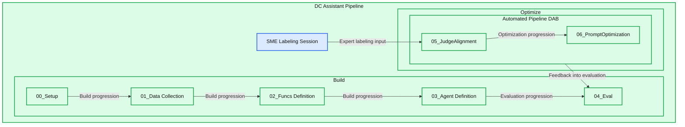

# Self-optimizing football chatbot guided by domain experts on Databricks

*A practical guide to authoring, deploying, evaluating, and governing an agentic assistant that helps defensive coordinators anticipate opponent tendencies and continuously optimizes based on subject matter feedback.*

- Source: https://www.databricks.com/blog/self-optimizing-football-chatbot-guided-domain-experts-databricks
- Published: 2026-02-03
- Authors: Wesley Pasfield, Nick Ragonese
- Categories: engineering
- Images: 9 total, 2 extracted as architecture

**Key takeaways**

- Purpose: Build a coach-facing agentic assistant that answers questions like “What will this offense do?” using governed, production-grade tools over play-by-play, participation, and roster data.
- Approach: Author a tool-calling agent with Unity Catalog functions (SQL analytics over Delta) and deploy via Agent Framework with MLflow Tracing. Implement a self-optimizing loop where SME feedback captured in MLflow labeling sessions trains aligned judges (align()) that drive automatic prompt improvement (optimize_prompts()), encoding expert football knowledge directly into the system.
- Outcome: Coordinators get situation-aware tendencies (down and distance, formation/personnel, two-minute drill, screen rates) with fast iteration and quality checks ready for game week installs. Developers get a reusable architecture for any domain: capture expert feedback, align judges to what “good” means for your use case, and let the system continuously improve with prompt optimization guided by the aligned judges.

Generic LLM judges and static prompts fail to capture domain-specific nuance. Determining what makes an football defensive analysis “good” requires deep football knowledge: coverage schemes, formation tendencies, situational context. General-purpose evaluators miss this. The same is true for legal review, medical triage, financial due diligence, or any domain where expert judgment matters.

This post walks through an architecture for **self-optimizing agents** built on Databricks Agent Framework, where enterprise-specific human expertise continuously improves AI quality using MLflow, and developers control the entire experience. We use an American Football Defensive Coordinator (DC) Assistant as the running example in this post: a tool-calling agent that can answer questions like "Who gets the ball in 11 personnel on 3rd-and-6" or "What does the opponent do in the last 2 minutes of halves?" The following example shows this agent interacting with a user via Databricks Apps.

## From Agent to Self-Optimizing System

The solution has two phases: build the agent, then optimize it continuously with expert feedback.

### Build

- **Ingest data:** Load domain data (play-by-play, participation, rosters) into governed Delta tables in Unity Catalog.
  - We ingested two years (2023–2024) of football participation and play-by-play data from `nflreadpy` as the data for this agent.
- **Create tools:** Define SQL functions as Unity Catalog tools the agent can call, leveraging the data extracted.
- **Define and deploy the agent:** Wire the tools to a `ResponsesAgent`, register a baseline system prompt in the Prompt Registry, and deploy to Model Serving.
- **Initial evaluation:** Run automated evaluation with LLM judges and log traces using baseline versions of custom judges.

### Optimize

- **Capture expert feedback:** SMEs review agent outputs and provide structured feedback through MLflow labeling sessions.
- **Align judges:** Use the MLflow `align()` function to calibrate the baseline LLM judge to match SME preferences, teaching it what “good” looks like for this domain.
- **Optimize prompts:** MLflow’s `optimize_prompts()` uses a GEPA optimizer guided by the aligned judge to iteratively improve the original system prompt.
- **Repeat:** Each MLflow labeling session is used to improve the judge, which in turn is used to optimize the system prompt. This entire process can be automated to automatically promote new prompt versions that exceed performance benchmarks, or it can inform manual updates to the agent, such as adding more tooling or data, based on observed failure modes.

The build phase gets you to an initial prototype and the optimize phase accelerates you to production, continuously optimizing your agent using domain expert feedback as the engine.

**Summary:** The DC Assistant Pipeline connects five build stages with an optimization pipeline driven by SME labeling and feeding back into evaluation.

**Components:**

- DC Assistant Pipeline: overall workflow.
- Build: initial development phase.
- 00_Setup: setup stage; technology unspecified.
- 01_Data Collection: data collection stage; technology unspecified.
- 02_Funcs Definition: function definition stage; technology unspecified.
- 03_Agent Definition: agent definition stage; technology unspecified.
- 04_Eval: evaluation stage; technology unspecified.
- SME Labeling Session: expert labeling input; technology unspecified.
- Optimize: optimization phase.
- Automated Pipeline (DAB): automation container labeled DAB.
- 05_JudgeAlignment: judge alignment stage within DAB.
- 06_PromptOptimization: prompt optimization stage within DAB.

**Flows:**

- 00_Setup -> 01_Data Collection: build progression.
- 01_Data Collection -> 02_Funcs Definition: build progression.
- 02_Funcs Definition -> 03_Agent Definition: build progression.
- 03_Agent Definition -> 04_Eval: evaluation progression.
- SME Labeling Session -> 05_JudgeAlignment: expert labeling input.
- 05_JudgeAlignment -> 06_PromptOptimization: optimization progression.
- Automated Pipeline (DAB) -> 04_Eval: feedback into evaluation.

Arrow meanings are inferred from stage labels; the arrows have no text labels.

**Numbers:** Stage identifiers: 00, 01, 02, 03, 04, 05, 06. No quantities or units are shown.

source image: https://www.databricks.com/sites/default/files/inline-images/2026-02-blog-nfl-chatbot-guided-by-domain-experts-on-databricks-inline-image.png

## Architecture Overview

The agent balances probabilism and determinism: an LLM interprets the semantic intent of user queries and selects the right tools, while deterministic SQL functions pull data with 100% accuracy. For example, when a coach asks “How does our opponent attack the Blitz?” the LLM interprets this as a request for pass-rush/coverage analysis and selects `success_by_pass_rush_and_coverage()`. The SQL function returns exact statistics from the underlying data. By using Unity Catalog functions, we ensure the stats are 100% accurate, while the LLM handles the conversational context.

| Step | Technology |
|---|---|
| Ingest data | Delta Lake + Unity Catalog |
| Create tools | Unity Catalog functions |
| Deploy agent | `ResponsesAgent` + Model Serving via `agents.deploy()` |
| Evaluate with LLM as a judge | MLflow GenAI `evaluate()` with built-in and custom judges |
| Capture feedback | MLflow labeling sessions for SME feedback |
| Align judges | MLflow `align()` using a custom SIMBA optimizer |
| Optimize prompts | MLflow `optimize_prompts()` using a GEPA optimizer |

Let's walk through each step with the code and outputs from the DC Assistant implementation.

## Build

### 1. Ingest data.

A setup notebook (*00_setup.ipynb*) defines all global configuration variables used throughout the workflow: workspace catalog/schema, MLflow experiment, LLM endpoints, model names, evaluation datasets, Unity Catalog tool names, and authentication settings. This configuration is persisted to *config/dc_assistant.json* and loaded by all downstream notebooks, ensuring consistency across the pipeline. This step is optional but helps with overall organization.

With this configuration in place, we load football data via *nflreadpy* and apply incremental processing to prepare it for agent consumption: dropping unused columns, standardizing schemas, and persisting clean Delta tables to Unity Catalog. Here’s a simple example of loading in the data that doesn’t touch on much of the data processing:

The outputs of this process are governed Delta tables in Unity Catalog (play-by-play, participation, rosters, teams, players) that are ready for tool creation and agent consumption.

### 2. Create tools.

The agent needs deterministic tools to query the underlying data. We define these as Unity Catalog SQL functions that compute offensive tendencies across various situational dimensions. Each function takes parameters like `team` and `season` and returns aggregated statistics the agent can use to answer coordinator questions. We just use SQL-based functions for this example, but it’s possible to configure [Python-based UC functions](https://docs.databricks.com/aws/en/sql/language-manual/sql-ref-syntax-ddl-create-sql-function#create-python-functions), [vector search indices](https://docs.databricks.com/aws/en/generative-ai/agent-framework/unstructured-retrieval-tools), [Model Context Protocol (MCP) tooling](https://docs.databricks.com/aws/en/generative-ai/agent-framework/agent-tool#tool-comparison), and [Genie spaces](https://docs.databricks.com/aws/en/generative-ai/agent-framework/multi-agent-genie) as additional functionality an agent can leverage to supplement the LLM supervising the process.

The following example shows `success_by_pass_rush_and_coverage()`, which computes pass/run splits, EPA (Expected Points Added), success rate, and yards gained, grouped by number of pass rushers and defensive coverage type. The function includes a `COMMENT` that describes its purpose, which the LLM uses to determine when to call it.

Because these functions live in Unity Catalog, they inherit the platform’s governance model: role-based access controls, lineage tracking, and discoverability across the workspace. Teams can find and reuse tools without duplicating logic, and administrators maintain visibility into what data the agent can access.

### 3. Define and deploy the agent.

Creating the agent can be as simple as using the AI Playground. Select the LLM you want to use, add your Unity Catalog tools, define your system prompt, and click “Create agent notebook” to export a notebook that produces an agent in the `ResponsesAgent` format. The following screenshot shows this workflow in action. The exported notebook contains the agent definition structure, wiring your UC functions to the agent via the `UCFunctionToolkit`.

To enable the self-optimizing loop, we register the system prompt in the Prompt Registry rather than hardcoding it. This allows the optimization phase to update the prompt without redeploying the agent:

Once the agent code is tested and the model is registered to Unity Catalog, deploying it to a persistent endpoint is as simple as the code below. This creates a Model Serving endpoint with MLflow Tracing enabled, inference tables for logging requests/responses, and automatic scaling:

For end user access, the agent can also be deployed as a Databricks App, providing a chat interface that coordinators and analysts can use directly without needing notebook or API access. The screenshot in the introduction shows this App-based deployment in action.

### 4. Initial evaluation.

With the agent deployed, we run automated evaluation using LLM judges to establish a baseline quality measurement. MLflow supports [multiple judge types](https://docs.databricks.com/aws/en/mlflow3/genai/eval-monitor/concepts/scorers), and we use three in combination.

**Built-in judges** handle common evaluation criteria out of the box`. RelevanceToQuery()` checks if the response addresses the user's question. **Guideline-based** judges evaluate against specific text-based rules in a pass/fail fashion. We define a guideline ensuring responses use appropriate professional football terminology:

**Custom judges** use `make_judge()` for domain-specific evaluation with full control over the scoring criteria. This is the judge we will align to SME feedback in the optimization phase:

With all judges defined, we can run an evaluation against the dataset:

The custom `football_analysis_base` judge provides a baseline score, but it just reflects a best-effort attempt at providing a rubric from scratch that the LLM can use for its judgements, rather than true domain expertise. The MLflow Experiments UI shows us the performance of the agent on this baseline judge as well as a rationale for the score in each example.

**Summary:** Evaluation results show four football chatbot traces with token counts, execution times, analysis scores, and language and relevance checks.

**Components:**
- Trace ID: identifiers for evaluated requests.
- Request: football questions about the Raiders, Chargers, Broncos, and Indianapolis Colts.
- Response: truncated chatbot answers.
- Tokens: token counts per trace.
- Execution time: elapsed time per trace in seconds.
- State: execution status, shown as OK.
- football_analysi...: numerical evaluation scores and a distribution.
- football_language: Pass, Fail, and Error results.
- Relevance: Pass, Fail, and Error results.
- No technology names are visible.

**Flows:**
- none. No arrows are visible.

**Numbers:**
- Analysis average: 4.26; distribution endpoints: 2 and 5.
- football_language: 94% overall pass; Pass 94%; Fail 6%; Error 2.
- Relevance: 87% overall pass; Pass 87%; Fail 13%; Error 2.
- Trace `tr-803b14fd...`: 18529 tokens; 20.057s; analysis score 5.
- Trace `tr-a7ad89c6...`: 55116 tokens; 35.095s; analysis score 4.
- Trace `tr-48659ce...`: 16144 tokens; 19.795s; analysis score 5.
- Trace `tr-e520cb30...`: 12129 tokens; 12.867s; analysis score 4.
- Request and response snippets include the year 2024; the Raiders request includes 3rd; the Colts response includes 2nd half.

```mermaid
%% Football chatbot evaluation metrics and four trace rows with no visible arrows
flowchart TD
    A["football_analysi... | AVG 4.26 | Distribution 2 to 5"]
    B["football_language | PASS 94% | Pass 94% | Fail 6% | Error 2"]
    C["Relevance | PASS 87% | Pass 87% | Fail 13% | Error 2"]
    H["Trace ID | Request | Response | Tokens | Execution time | State | Analysis | Language | Relevance"]
    R1["tr-803b14fd... | 2024 Raiders | Response excerpt | 18529 | 20.057s | OK | 5 | Pass | Pass"]
    R2["tr-a7ad89c6... | 2024 Chargers | Response excerpt | 55116 | 35.095s | OK | 4 | Pass | Pass"]
    R3["tr-48659ce... | 2024 Broncos | Response excerpt | 16144 | 19.795s | OK | 5 | Pass | Pass"]
    R4["tr-e520cb30... | 2024 Indianapolis Colts | Response excerpt | 12129 | 12.867s | OK | 4 | Pass | Pass"]

    classDef client fill:#dbeafe,stroke:#2563eb,stroke-width:2px,color:#111
    classDef service fill:#dcfce7,stroke:#16a34a,stroke-width:2px,color:#111
    classDef store fill:#ede9fe,stroke:#7c3aed,stroke-width:2px,color:#111
    classDef cache fill:#fef3c7,stroke:#d97706,stroke-width:2px,color:#111
    classDef queue fill:#cffafe,stroke:#0891b2,stroke-width:2px,color:#111
    classDef critical fill:#fee2e2,stroke:#dc2626,stroke-width:4px,color:#111
    classDef external fill:#e5e7eb,stroke:#6b7280,stroke-width:2px,color:#111,stroke-dasharray:4 3
    classDef decision fill:#fce7f3,stroke:#db2777,stroke-width:2px,color:#111
    class A,B,C,H,R1,R2,R3,R4 service
```

source image: https://www.databricks.com/sites/default/files/inline-images/self-optimizing-nfl-chatbot-guided-domain-experts-databricks-blog-img-4.png

In the optimization phase, we will align the football analysis judge with SME preferences, teaching it what “good” actually means for defensive coordinator analysis.

## Optimize

### 5. Capture expert feedback.

With the agent deployed and baseline evaluation complete, we enter the optimization loop. This is where domain expertise gets encoded into the system, first through aligned LLM judges, then directly into the agent through system prompt optimization guided by our aligned judge.

We start by creating a label schema that uses the same instructions and evaluation criteria as the football analysis judge we created with `make_judge()`. Then we create a labeling session that enables our domain expert to review responses for the same traces used in the `evaluate()` job and provide their scores and feedback via the [Review App](https://docs.databricks.com/aws/en/mlflow3/genai/human-feedback/) (pictured below).

This feedback becomes the ground truth for judge alignment. By looking at where the baseline judge and SME scores diverge, we learn what the judge is getting wrong about this specific domain.

### 6. Align judges.

Now that we have traces that include both domain expert feedback and LLM judge feedback, we can leverage the MLflow `align()` functionality to align our LLM judge to our domain expert feedback. An aligned judge reflects your domain experts’ perspective and your organization’s unique data. **Alignment brings domain experts into the development process in a way that wasn’t previously possible: domain feedback directly shapes how the system measures quality, making agent performance metrics both reliable and scalable.**

`align()` allows you to use your own optimizer or the default binary SIMBA (Simplified Multi-Bootstrap Aggregation) optimizer. We leverage a custom SIMBA optimizer in this case to calibrate a Likert-scale judge:

Next, we retrieve traces that have both LLM judge scores and SME feedback that we’ve tagged throughout the process. These paired scores are what SIMBA uses to learn the gap between generic and expert judgment.

The following screenshot shows the alignment process in progress. The model identifies gaps between the LLM judges and SME feedback, proposes new rules and details to incorporate into the judge to close these gaps, then evaluates the new candidate judges to see if they exceed the performance of the baseline judge.

The final output of this process is an aligned judge that directly reflects domain expert feedback with detailed instructions.

Tips for effective alignment:

- The goal of alignment is to make you feel like you have domain experts sitting next to you during development. This process may lead to lower performance scores for your baseline agent, which means your baseline judge was underspecified. Now that you have a judge that critiques the agent in the same way your SMEs would, you can make manual or automated improvements to improve performance.
- The alignment process is only as good as the feedback provided. Focus on quality over quantity. Detailed, consistent feedback on a smaller number of examples (minimum 10) produces better results than inconsistent feedback on many examples.

Defining quality is often the primary obstacle to driving better agent performance. No matter the optimization technique, if there’s no clear definition of quality, agent performance will underwhelm. Databricks offers a workshop that helps customers define quality through an iterative, cross-functional exercise. To find out more, please contact your Databricks account team or fill out [this form](https://docs.google.com/forms/d/e/1FAIpQLSf3sPR-NRqiB35A_kNFA647pZo8M6jnAGPs5F4clh8qmkN4RQ/viewform).

### 7. Optimize prompts.

With an aligned judge that reflects SME preferences, we can now automatically improve the agent’s system prompt. MLflow’s [`optimize_prompts()`](https://docs.databricks.com/aws/en/mlflow3/genai/prompt-version-mgmt/prompt-registry/automatically-optimize-prompts) function uses [GEPA](https://arxiv.org/pdf/2507.19457) to iteratively refine the prompt based on the aligned judge’s scoring. GEPA (Genetic-Pareto), co-created by Databricks CTO Matei Zaharia, is a genetic evolutionary prompt algorithm that leverages large language models to perform reflective mutations on prompts, enabling it to iteratively refine instructions and outperform traditional reinforcement learning techniques in optimizing model performance.

Instead of a developer guessing which adjectives to add to the system prompt, the GEPA optimizer mathematically evolves the prompt to maximize the specific score defined by the expert. The optimization process requires a dataset with expected responses that guide the optimizer toward desired behaviors, like this:

The GEPA optimizer takes the current system prompt and iteratively proposes improvements, evaluating each candidate against the aligned judge. Here, we grab the initial prompt, the optimization dataset we created, and the aligned judge to leverage MLflow’s `optimize_prompts()`. We then use the GEPA optimizer to create a new system prompt guided by our aligned judge:

The following screenshot shows the change in the system prompt–the old one is on the left and the new one is on the right. The final prompt chosen is the one that has the highest score as measured by our aligned judge. The new prompt has been truncated for space reasons, but it’s clear from this example that we have been able to incorporate domain expert responses to craft a prompt that is grounded in domain-specific language with explicit guidance on how to handle certain requests.

The ability to automatically generate this type of guidance using SME feedback essentially allows your SMEs to indirectly provide instruction to an agent by just giving feedback on traces from the agent.

In this case, the new prompt drove better performance on our optimization dataset according to our aligned judge, so we gave the newly registered prompt the production alias, enabling us to redeploy our agent with this improved prompt.

Tips for prompt optimization:

- The optimization dataset should cover the diversity of queries your agent will handle. Include edge cases, ambiguous requests, and scenarios where tool selection matters.
- Expected responses should describe what the agent should do (which tools to call, what information to include) rather than exact output text.
- Start with `max_metric_calls` set to between `50` and `100`. Higher values explore more candidates but increase cost and runtime.
- The GEPA optimizer learns from failure modes. If the aligned judge penalizes missing benchmarks or small-sample caveats, GEPA will inject those requirements into the optimized prompt.

### 8. Closing the loop: Automation and continuous improvement.

The individual steps we’ve walked through can be orchestrated into a continuous optimization pipeline where the domain expert labeling becomes the trigger for the optimization loop, and everything can be encompassed in a Databricks job using Asset Bundles:

1. SMEs label agent outputs through the MLflow Labeling Session UI, providing scores and comments on real production traces.
2. The pipeline detects new labels and pulls traces with both SME feedback and baseline LLM judge scores.
3. Judge alignment runs, producing a new judge version calibrated to the latest SME preferences.
4. Prompt optimization runs, using the aligned judge to iteratively improve the system prompt.
5. Conditional promotion pushes the new prompt to production if it exceeds performance thresholds. This could involve triggering another evaluation job to ensure the new prompt generalizes to other examples.
6. The agent improves automatically as the prompt registry serves the optimized version.

When domain experts complete a labeling session, an `evaluate()` job is triggered to generate LLM judge scores on the same traces. When the `evaluate()` job completes, an `align()` job executes to align the LLM judge with the domain expert feedback. When that job completes, an `optimize_prompts()` job runs to generate a new and improved system prompt that can be immediately tested against a new dataset and, if appropriate, promoted to production.

This entire process can be fully automated, but manual review can be injected in any step as well, giving developers complete control over the level of automation involved. The process repeats as SMEs continue labeling, resulting in quick performance testing on new versions of the agent, and cumulative performance gains that developers can actually trust.

## Conclusion

This architecture transforms how agents improve over time, using the Databricks Agent Framework and MLflow. Instead of developers guessing what makes a good response, domain experts directly shape agent behavior through expert feedback. The judge alignment and optimization processes translate domain expertise into concrete system changes while developers maintain control over the whole system, including which parts to automate and where to allow manual intervention.

In this post, we’ve illustrated how to tailor an agent to reflect the specific language and details that matter to domain experts in professional football. The DC Assistant demonstrates the pattern, but the approach works for any domain where expert judgment matters: legal document review, professional baseball at-bat preparation, medical triage, golf shot analysis, customer support escalation, or any other application where “good” is hard for developers to specify without the support of domain experts.

Try it on your own domain-specific problem and see how it can drive automated and continuous improvement based on SME feedback!

Learn more about Databricks Sports and Agent Bricks, or request a demo to see how your organization can drive competitive insights.
