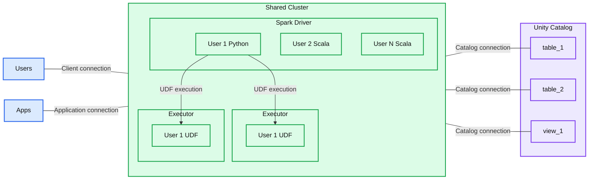

# Shared Clusters in Unity Catalog for the win: Introducing Cluster Libraries, Python UDFs, Scala, Machine Learning and more 

- Source: https://www.databricks.com/blog/shared-clusters-unity-catalog-win-introducing-cluster-libraries-python-udfs-scala-machine
- Published: 2023-09-04
- Authors: Jakob Mund, Stefania Leone, Martin Grund, Herman van Hövell, Andrew Li, Sven Wagner-Boysen
- Categories: engineering, open-source
- Images: 5 total, 1 extracted as architecture

We are thrilled to announce that you can run even more workloads on Databricks’ highly efficient multi-user clusters thanks to new security and governance features in Unity Catalog Data teams can now develop and run SQL, Python and Scala workloads securely on shared compute resources. With that, Databricks is the only platform in the industry offering fine-grained access control on shared compute for Scala, Python and SQL Spark workloads.

Starting with Databricks Runtime 13.3 LTS, you can seamlessly move your workloads to shared clusters, thanks to the following features that are available on shared clusters:

- **Cluster libraries and Init scripts:** Streamline cluster setup by installing cluster libraries and executing init scripts on startup, with enhanced security and governance to define who can install what.
- **Scala:** Securely run multi-user Scala workloads alongside Python and SQL, with full user code isolation among concurrent users and enforcing Unity Catalog permissions.
- **Python and Pandas UDFs.** Execute Python and (scalar) Pandas UDFs securely, with full user code isolation among concurrent users.
- **Single-node Machine Learning:** Run scikit-learn, XGBoost, prophet and other popular ML libraries using the Spark driver node,, and use MLflow for managing the end-to-end machine learning lifecycle.
- **Structured Streaming:** Develop real-time data processing and analysis solutions using structured streaming.

## Easier data access in Unity Catalog

When creating a cluster to work with data governed by Unity Catalog, you can choose between two access modes:

- **Clusters in *shared* access mode** – or just shared clusters – are the *recommended* compute options for most workloads. Shared clusters allow any number of users to attach and concurrently execute workloads on the same compute resource, allowing for significant cost savings, simplified cluster management, and holistic data governance including fine-grained access control. This is achieved by Unity Catalog's user workload isolation which runs any SQL, Python and Scala user code in full isolation with no access to lower-level resources.
- **Clusters in *single-user* access mode** are recommended for workloads requiring privileged machine access or using RDD APIs, distributed ML, GPUs, Databricks Container Service or R.

While single-user clusters follow the traditional Spark architecture, where user code runs on Spark with privileged access to the underlying machine, shared clusters ensure user isolation of that code. The figure below illustrates the architecture and isolation primitives unique to shared clusters: Any client-side user code (Python, Scala) runs fully isolated and UDFs running on Spark executors execute in isolated environments. With this architecture, we can securely multiplex workloads on the same compute resources and offer a collaborative, cost-efficient and secure solution at the same time.

**Summary:** A shared Spark cluster isolates Python and Scala user code on its driver and user UDFs on two executors, with connections to Unity Catalog tables and a view.

**Components:**
- Users: clients accessing the shared cluster.
- Apps: applications accessing the shared cluster.
- Shared Cluster: Spark compute boundary.
- Spark Driver: hosts isolated user environments.
- User 1: Python environment with an isolation shield.
- User 2: Scala environment with an isolation shield.
- User N: Scala environment with an isolation shield.
- Executor, left: Spark executor containing an isolated User 1 UDF.
- Executor, right: Spark executor containing an isolated User 1 UDF.
- Unity Catalog: boundary containing table_1, table_2, and view_1.
- table_1: catalog table.
- table_2: catalog table.
- view_1: catalog view.

**Flows:**
- Users -> Shared Cluster: client connection, shown without an arrowhead.
- Apps -> Shared Cluster: application connection, shown without an arrowhead.
- User 1 Python -> Left Executor: UDF execution.
- User 1 Python -> Right Executor: UDF execution.
- Shared Cluster -> table_1: catalog connection, shown without an arrowhead.
- Shared Cluster -> table_2: catalog connection, shown without an arrowhead.
- Shared Cluster -> view_1: catalog connection, shown without an arrowhead.

**Numbers:** Label identifiers only: 1 in User 1, both User 1 UDF labels, table_1, and view_1; 2 in User 2 and table_2. No quantitative measurements or units.

source image: https://www.databricks.com/sites/default/files/inline-images/shared-clusters.png

## Latest enhancements for Shared Clusters: Cluster Libraries, Init Scripts,  Python UDFs, Scala, ML, and Streaming Support

### Configure your shared cluster using cluster libraries & init scripts

Cluster libraries allow you to seamlessly share and manage libraries for a cluster or even across multiple clusters, ensuring consistent versions and reducing the need for repetitive installations. Whether you need to incorporate machine learning frameworks, database connectors, or other essential components into your clusters, cluster libraries provide a centralized and effortless solution now available on shared clusters.

Libraries can be installed from Unity Catalog volumes ([AWS](https://docs.databricks.com/en/data-governance/unity-catalog/create-volumes.html), [Azure](https://learn.microsoft.com/en-gb/azure/databricks/data-governance/unity-catalog/create-volumes), [GCP](https://docs.gcp.databricks.com/data-governance/unity-catalog/create-volumes.html)) , Workspace files ([AWS](https://docs.databricks.com/en/files/workspace.html#what-are-workspace-files), [Azure](https://learn.microsoft.com/en-gb/azure/databricks/files/workspace), [GCP](https://docs.gcp.databricks.com/files/workspace.html)), PyPI/Maven and cloud storage locations, using the existing Cluster UI or API.

Using init scripts, as a cluster administrator you can execute custom scripts during the cluster creation process to automate tasks such as setting up authentication mechanisms, configuring network settings, or initializing data sources.

Init scripts can be installed on shared clusters, either directly during cluster creation or for a fleet of clusters using cluster policies ([AWS](https://docs.databricks.com/en/administration-guide/clusters/policies.html), [Azure](https://learn.microsoft.com/en-gb/azure/databricks/administration-guide/clusters/policies), [GCP](https://docs.gcp.databricks.com/administration-guide/clusters/policies.html)). For maximum flexibility, you can choose whether to use an init script from Unity Catalog volumes ([AWS](https://docs.databricks.com/en/data-governance/unity-catalog/create-volumes.html), [Azure](https://learn.microsoft.com/en-gb/azure/databricks/data-governance/unity-catalog/create-volumes), [GCP](https://docs.gcp.databricks.com/data-governance/unity-catalog/create-volumes.html)) or cloud storage.

As an additional layer of security, we introduce an allowlist ([AWS](https://docs.databricks.com/en/data-governance/unity-catalog/manage-privileges/allowlist.html), [Azure](https://learn.microsoft.com/en-gb/azure/databricks/data-governance/unity-catalog/manage-privileges/allowlist), [GCP](https://docs.gcp.databricks.com/data-governance/unity-catalog/manage-privileges/allowlist.html)) that governs the installation of cluster libraries (jars) and init scripts. This puts administrators in control of managing them on shared clusters. For each metastore, the metastore admin can configure the volumes and cloud storage locations from which libraries (jars) and init scripts can be installed, thereby providing a centralized repository of trusted resources and preventing unauthorized installations. This allows for more granular control over the cluster configurations and helps maintain consistency across your organization's data workflows.

### Bring your Scala workloads

Scala is now supported on shared clusters governed by Unity Catalog. Data engineers can leverage Scala's flexibility and performance to handle all sorts of big data challenges, collaboratively on the same cluster and taking advantage of the Unity Catalog governance model.

Integrating Scala into your existing Databricks workflow is a breeze. Simply select Databricks runtime 13.3 LTS or later when creating a shared cluster, and you will be ready to write and execute Scala code alongside other supported languages.

### Leverage User-Defined Functions (UDFs), Machine Learning & Structured Streaming

That's not all! We are delighted to unveil more game-changing advancements for shared clusters.

**Support for Python and Pandas User Defined Functions (UDFs):** You can now harness the power of both Python and (scalar) Pandas UDFs also on shared clusters. Just bring your workloads to shared clusters seamlessly - no code adaptations are needed. By isolating the execution of UDF user code on Spark executors in a sandboxed environment, shared clusters provide an additional layer of protection for your data, preventing unauthorized access and potential breaches.

**Support for all popular ML libraries using Spark driver node and MLflow:** Whether you're working with Scikit-learn, XGBoost, prophet, and other popular ML libraries, you can now seamlessly build, train, and deploy machine learning models directly on shared clusters. To install ML libraries for all users, you can use the new cluster libraries. With integrated support for MLflow (2.2.0 or later), managing the end-to-end machine learning lifecycle has never been easier.

**Structured Streaming** is now also available on Shared Clusters governed by Unity Catalog. This transformative addition enables real-time data processing and analysis, revolutionizing how your data teams handle streaming workloads collaboratively.

## Start today, more good things to come

Discover the power of Scala, Cluster libraries, Python UDFs, single-node ML, and streaming on shared clusters today simply by using Databricks Runtime 13.3 LTS or above. Please refer to the quick start guides ([AWS](https://docs.databricks.com/en/data-governance/unity-catalog/compute.html), [Azure](https://learn.microsoft.com/en-gb/azure/databricks/data-governance/unity-catalog/compute), [GCP](https://docs.gcp.databricks.com/data-governance/unity-catalog/compute.html)) to learn more and start your journey toward data excellence.

In the coming weeks and months, we will continue to unify the Unity Catalog's compute architecture and make it even simpler to work with Unity Catalog!
