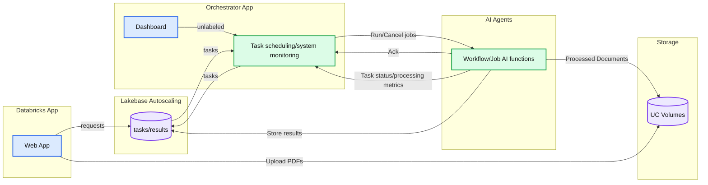

# Simplify AI agent orchestration with Lakebase Postgres

*How CLA built a Databricks-native solution for long-running tasks, observability and cost attribution*

- Source: https://www.databricks.com/blog/simplify-ai-agent-orchestration-lakebase-postgres
- Published: 2026-07-22
- Authors: Li Yu, Michelle JanneyCoyle, Jon Cormack, Yarri Bryn, Alec Sorensen, Darshana Nair
- Categories: platform, product, solutions, engineering, data-science-machine-learning, industries, financial-services, company, customers
- Images: 1 total, 1 extracted as architecture

**Key takeaways**

- Scale-Ready Task Queue on Postgres: A deep dive into the patterns that turn a pair of Lakebase tables into a durable, concurrent, crash-resilient queue for long-running agent tasks — no broker, cache, or scheduler required.
- Fully Databricks-Native Architecture: A reference design that stitches Lakebase, Databricks Apps, Lakeflow Jobs, MLflow, and Unity Catalog Volumes into an end-to-end pipeline for agentic document parsing, with no external infrastructure to operate.
- Real-Time Observability and Invariants: A deep dive into using Postgres LISTEN/NOTIFY triggers paired with Server-Sent Events (SSE) to build a low-latency operator dashboard that automatically tracks costs and tasks with zero overhead.

## Introduction

Traditionally, auditing is a tedious process that often requires detailed document review and information extraction. To accelerate this process, CLA (CliftonLarsonAllen LLP), a leading professional services firm with a growing global presence, worked with Databricks Forward Deployed Engineering team to build and productionize an agentic auditing solution. Jointly, we developed a document processing application that reduces extraction time from hours to minutes with no compromise in quality. The application is built entirely on Databricks, using [Lakebase Postgres](https://docs.databricks.com/aws/en/oltp/projects/), [Databricks Apps](https://docs.databricks.com/aws/en/dev-tools/databricks-apps/), [Lakeflow Jobs](https://docs.databricks.com/aws/en/jobs/), [MLflow](https://docs.databricks.com/aws/en/mlflow/), and [Unity Catalog Volumes](https://docs.databricks.com/aws/en/volumes/). In this blog, we focus on one key component of that system, the Lakebase-powered orchestration layer.

The orchestration layer is responsible for coordinating long-running tasks, managing retries, attributing cost, and providing real-time visibility. Lakebase and Databricks Apps, we eliminate the need for separate infrastructure for queueing, orchestration, and observability.

Lakebase also makes this architecture practical at scale by separating storage from compute. Unlike traditional Postgres deployments, compute can scale with demand while storage remains durable and independent. Together, these capabilities make Lakebase a practical foundation for a simpler, scalable orchestration pattern for long-running agentic workloads on Databricks.

## Orchestration Challenges for Agentic Workloads

Document parsing is a very common, high-volume agentic workload. Companies across industries need to convert large volumes of contracts, invoices, financial filings, and other documents into structured data. Running this at scale surfaces five distinct distributed-systems problems:

- **Unpredictable per-task latency:** A two-page invoice may be processed in seconds, while a two-hundred-page contract can take several minutes, making it difficult to predict how long any individual task will run.
- **Rate-limit-aware throttling:** LLM and vision model endpoints limit the number of requests and tokens they can process over a given period. Sending hundreds of tasks at once can overwhelm those limits, trigger throttling, and lead to repeated retries. The orchestrator must proactively limit in-flight work (by concurrent task count, by token budget, or both) rather than rely on reactive retry alone.
- **Workload prioritization:** Urgent submissions should not be delayed behind large bulk batches. Per-task priority ensures that higher-priority work (interactive submissions, premium-tier requests, operator-initiated reprocesses) is dispatched first.
- **Cost attribution per task:** Finance teams need to attribute spend to specific tasks, customers, and agents, broken down by AI token usage and compute consumption.
- **Real-time progress visibility:** Users uploading hundreds of documents need a live progress view.

Many organizations combine several specialized systems for orchestration and observability. Each system brings its own infrastructure, authentication, monitoring, and operational requirements, along with the work required to integrate them. For long-running, independent agentic tasks, that overhead is disproportionate to the actual scheduling complexity.

The Databricks-native solution we developed meets all of the above requirements with Lakebase as the foundation.

## Solution Architecture

**

**Summary:** A Databricks web app submits tasks to Lakebase, an orchestrator schedules and monitors AI agents, and agents store results in Lakebase and processed documents in Unity Catalog Volumes.

**Components:**
- Databricks App: hosts the Web App.
- Lakebase Autoscaling: Postgres database storing tasks/results.
- Orchestrator App: contains task scheduling/system monitoring and a Dashboard.
- AI Agents: execute Workflow/Job AI functions.
- Storage: UC Volumes storing PDFs and processed documents.

**Flows:**
- Web App -> tasks/results: requests.
- Web App -> UC Volumes: upload PDFs.
- tasks/results -> Task scheduling/system monitoring: tasks.
- Task scheduling/system monitoring -> tasks/results: tasks.
- Dashboard -> Task scheduling/system monitoring: unlabeled flow.
- Task scheduling/system monitoring -> Workflow/Job AI functions: run/cancel jobs.
- Workflow/Job AI functions -> Task scheduling/system monitoring: acknowledgment.
- Workflow/Job AI functions -> Task scheduling/system monitoring: task status/processing metrics.
- Workflow/Job AI functions -> tasks/results: store results.
- Workflow/Job AI functions -> UC Volumes: processed documents.

**Numbers:** none

source image: https://www.databricks.com/sites/default/files/inline-images/2026-06-blog-Your-Next-Agent-Orchestrator-Runs-on-a-Postgres-Table-Inline-960x734-2x.png

**

 The full application stack consists exclusively of Databricks services:

- **Web Application (Databricks Apps).** A FastAPI-based user interface where users upload PDFs (stored in Unity Catalog Volumes) and submit parse requests. Requests are written directly to the Lakebase task table.
- **Lakebase.** An autoscaling Postgres database hosting the orchestrator's relational state across related tables: tasks (documents to be parsed, holding status, lease information, and the structured result), and task_attempts (one row per execution attempt, capturing the Databricks Job run ID, MLflow trace ID, and per-attempt cost metadata). Lakebase serves as the single source of truth for the orchestrator state.
- **Orchestrator (Databricks Apps).** A long-running worker daemon and operator dashboard. The daemon dequeues tasks from Lakebase, dispatches them to the AI Agents layer, and writes results back. The dashboard reads the same tables to surface real-time status.
- **AI Agents (Lakeflow Jobs).** Lakeflow Jobs execute the parsing work. Each Job reads a PDF from Unity Catalog Volumes, processes it through [Intelligent Document Processing](https://docs.databricks.com/aws/en/agents/agent-bricks/intelligent-document-processing) and vision/LLM calls, stores parsed output in Lakebase, and acknowledges the orchestrator via webhook. [MLflow Tracing](https://docs.databricks.com/aws/en/mlflow3/genai/tracing/) captures execution details such as model calls, token usage, latency, and cost metadata. 

Data flows between components as follows. The Web App writes PDFs to Unity Catalog Volumes and parses requests to Lakebase. The Orchestrator dequeues tasks from Lakebase and dispatches Databricks Jobs to the AI Agents layer. The AI Agents process documents, write results back to Lakebase, and call back to the Orchestrator with status updates.

Due to these built-in capabilities on Databricks, we did not need to rely on external message brokers (Kafka, Redis), separate schedulers (Airflow, Temporal), or dedicated caching layers. 

## Task Queue Implementation

The task queue is backed by two Postgres tables in Lakebase. The tasks table holds one row per logical unit of work, recording the task's current status, lease information, agent assignment, parent extraction, and final result. The task_attempts table holds one row per execution attempt, capturing the Databricks Job run ID, MLflow trace ID, and per-attempt cost metadata. The parent-child relationship supports retries (a single task may have multiple attempts) and preserves attempt-level observability for cost attribution and debugging.

A pair of Postgres tables on their own are not yet a task queue. Four Postgres-native patterns transform them into a robust, concurrent, crash-resilient, rate-limit-aware queue suitable for long-running agentic workloads.

### Concurrent Priority Aware Dequeuing

A basic dequeue query might select the next available task using WHERE status = 'enqueued' and LIMIT batch_size. While that query correctly identifies an enqueued task, it is not sufficient when multiple workers are dequeuing concurrently. Without row locking several workers may select the same task before the status is updated. 

Adding FOR UPDATE SKIP LOCKED makes the dequeue concurrency-safe. Each worker locks the row it selects, while other workers skip that row and continue to the next available task. Additionally, an ORDER BY priority DESC, created_at clause ensures that higher-priority tasks are selected first while preserving FIFO ordering within each priority level. 

The complete concurrency-safe and priority-stable statement is: 

### Crash Recovery via Lease-Based Locking

Workers can terminate mid-task due to VM eviction, out-of-memory conditions, or deployment events. If terminated tasks remain marked as processing, they would be held indefinitely. The solution is to record an expiring lease at dequeue time:

A periodic sweeper re-enqueues any task whose lease_expires_at has passed. Tasks held by terminated workers are recovered automatically within minutes, without requiring an external coordination service.

### Rate-Limit-Aware Throttling

LLM and vision model endpoints typically enforce two distinct quotas: a request-per-second cap and a tokens-per-minute (TPM) cap. A single throttling strategy rarely fits both. The orchestrator supports three modes, selected per agent through configuration.

**Concurrency cap.** A MAX_CONCURRENT_TASKS parameter bounds the number of tasks the orchestrator dispatches concurrently. The cap is enforced at dequeue time by counting the current PROCESSING rows in the tasks table:

If the count is at or above the cap, no new task is dequeued. Anchoring the check on the database row count, rather than on the local executor's queue size, keeps the cap accurate across worker restarts, lease recoveries, and multi-replica deployments. This mode is well suited for endpoints constrained by request-per-second limits where each task's token usage is roughly uniform.

**Token budget.** A MAX_TPM parameter bounds the projected token rate across in-flight tasks. The orchestrator estimates a task's token count, and sums the projected token rate across all PROCESSING tasks. A new task is dequeued only if the sum plus the new task's projected tokens fits within the budget. 

**Combined cap.** When both MAX_CONCURRENT_TASKS and MAX_TPM are configured, the orchestrator applies whichever constraint is tighter. This mode handles workloads that are concurrency-bound under one regime (many short, cheap tasks) and token-bound under another (a single very long document saturating the per-minute quota). 

In all three modes, the throttling decision is made at dequeue time within the same transaction as FOR UPDATE SKIP LOCKED. A task that cannot fit within the current quota stays in the queue and is reconsidered on the next dequeue cycle - no separate scheduling state, no in-memory waiting queue, no coordination layer between worker replicas.

### Idempotent Webhook Callbacks

When the AI Agents layer completes a task, it posts a callback to the orchestrator with the result. Callback delivery is not exactly-once: Databricks may retry, networks may interrupt, and proxies may redeliver. The callback handler is designed to be idempotent: it accepts both PROCESSING and ENQUEUED states, and treats already-terminal tasks as no-ops. Identical payloads produce identical results, eliminating the risk of double-billing or duplicate processing.

These four patterns combined yield a task queue that is correct under concurrency, durable under crashes, rate-limit-aware under load, and idempotent under retry. Real-time visibility into the running system is provided by a separate mechanism described in the next section.

## Real-Time Operator Dashboard

When many documents are in flight, operators need a clear view of agent performance, task status, and workload cost. They should not have to continuously poll the orchestrator or rely on a separate metrics platform. The orchestrator integrates this functionality directly into a single dashboard surfaced by the same Databricks App that runs the worker daemon.

### Dashboard Capabilities

The operator-facing dashboard surfaces a set of operational metrics that together characterize the running system. All metrics support filtering by date range, task status, and agent.

- **Task totals by status.** Counts of tasks in each state (enqueued, processing, completed, failed, cancelled), updated in real time as state transitions occur.
- **Input and output tokens.** Per-task and aggregated token counts drawn from **MLflow Traces**.
- **LLM cost.** Both the model-emitted estimate from **MLflow Traces** (available within seconds of each model call).
- **Compute cost.** Serverless Jobs compute cost attributable to the orchestrator's task runs, drawn from system.billing.usage.
- **Median response time.** Computed across completed tasks. The median is used in place of the average to avoid distortion by retry-backoff outliers and queueing-tail latency under saturation.
- **Confidence.** Per-document confidence scores returned by the AI Agents layer, surfaced alongside task results.

### Implementation

State changes in the tasks table fire Postgres LISTEN/NOTIFY events. The backend maintains a single LISTEN connection and fans events out over **Server-Sent Events (SSE)** to connected dashboard clients. Browsers open an EventSource connection and receive live updates within approximately one second of each meaningful state change. The implementation requires no Redis, no WebSocket server, and no message bus.

Polling is retained as a permanent fallback at a default ten-second interval. Streaming connections through cloud ingress proxies can silently drop bytes without firing client-side error events; permanent polling ensures the dashboard remains current even in such cases. A UI indicator distinguishes between live (SSE active) and polling (SSE unavailable) channels.

The dashboard's data spans three sources of differing latency characteristics: Postgres (instant), MLflow's trace API (sub-second), and warehouse queries against system billing tables (occasionally tens of seconds). The fast queries feed every refresh cycle; the slow queries execute only on user action and return optimistically with a loading state until results are available.

### Per-Application Cost Attribution

Databricks system billing tables are account-scoped: every job, every model call, and every other application contributes to the same system.billing.usage rows. Without scoping, an application-level "OCR cost" tile would aggregate usage across every model call in the workspace.

The solution is to record which Databricks Job runs the orchestrator submitted (tracked in tasks.locked_by and task_attempts.run_id) and filter the billing query to that set. A single SQL warehouse can back multiple applications, and each dashboard surfaces only its own spend.

The same query architecture composes naturally with operator-driven filters. Cost figures, along with every other dashboard metric, can be further narrowed by date range, task status, or agent, supporting questions such as "what did failed tasks cost over the last seven days?" or "what was the median spend per task for agent X this month?" without leaving the dashboard.

This makes cost figures easy to monitor, allocate and report.

## Lakebase as the Orchestration Backbone

Postgres-as-queue patterns are well established in the data engineering community. Lakebase provides the additional operational characteristics that make the pattern viable as a production architecture on Databricks:

- **Autoscaling compute.** Lakebase scales Postgres compute units up and down with workload, allowing the orchestrator to lean on the database without paying for peak capacity around the clock.
- **OAuth-rotated authentication.** Lakebase uses short-lived OAuth tokens for connection authentication. Connection pools refresh tokens automatically, eliminating static credentials in application configuration and removing rotation runbooks.
- **Unity Catalog integration.** Lakebase shares identity, permissions, and governance with the rest of Databricks. The orchestrator's service principal receives explicit grants on the tasks and results tables; no separate IAM configuration is required.
- **Branching and snapshots.** Cloning a production task table into a development environment for debugging is a standard Lakebase operation, supported natively.

These capabilities eliminate the operational drag that typically motivates teams to adopt managed message brokers in place of self-hosted Postgres for task queueing.

## Impact and Conclusion

At CLA, the orchestration pattern described here supports a production document-processing workflow that reduces extraction time from hours to minutes. The architecture uses Databricks-native services with Lakebase Postgres at the center to manage queueing, scheduling, and observability without requiring external systems. This reduces integration overhead while taking full advantage of a unified platform build to scale. 

In production this pattern provides durable task management, priority control, rate-limit aware scheduling, real-time visibility, and per-task cost tracking. Together, these capabilities offer a practical way to orchestrate agentic workloads while keeping the surrounding infrastructure simple.

Ready to simplify AI agent orchestration on a single platform?[Try Databricks Free Edition](https://docs.databricks.com/aws/en/getting-started/free-edition), create your first[Lakebase Postgres](https://docs.databricks.com/aws/en/oltp/projects/) project and[Databricks App](https://docs.databricks.com/aws/en/dev-tools/databricks-apps/), then follow the[MLflow Tracing 10-minute demo](https://docs.databricks.com/aws/en/mlflow3/genai/getting-started/tracing/tracing-notebook) to add end-to-end observability to your agent workflow.
