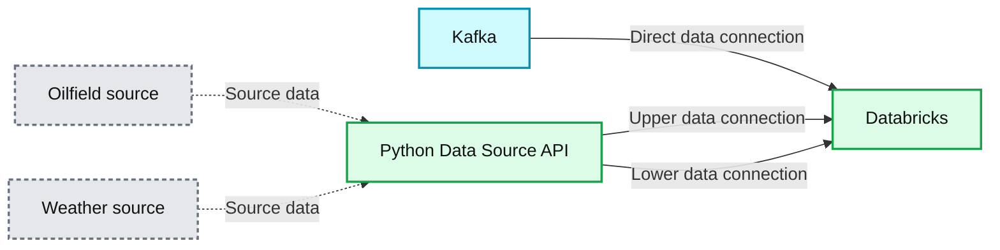

# Simplify Data Ingestion With the New Python Data Source API

- Source: https://www.databricks.com/blog/simplify-data-ingestion-new-python-data-source-api
- Published: 2024-12-10
- Authors: Craig Lukasik, Allison Wang
- Categories: engineering
- Images: 2 total, 1 extracted as architecture

**Key takeaways**

- This blog explores how Spark's new Python Data Source API streamlines IoT data ingestions.

Data engineering teams are frequently tasked with building bespoke ingestion solutions for myriad custom, proprietary, or industry-specific data sources. Many teams find that this work of building ingestion solutions is cumbersome and time-consuming. Recognizing these challenges, we have interviewed numerous companies across different industries to better understand their diverse data integration needs. This comprehensive feedback led us to the development of the **[Python Data Source API](https://docs.databricks.com/en/pyspark/datasources.html#pyspark-custom-data-sources) for Apache Spark™.**

One of the customers we have worked closely with is [Shell](https://www.databricks.com/customers/shell). Equipment failures in the energy sector can have significant consequences, impacting safety, the environment, and operational stability. At Shell, minimizing these risks is a priority, and one way they do this is by focusing on the reliable operation of equipment.

Shell owns a vast array of capital assets and equipment valued at over $180 billion. To manage the vast amounts of data that Shell's operations generate, they rely on advanced tools that enhance productivity and allow their data teams to work seamlessly across various initiatives. The Databricks [Data + AI Platform](https://www.databricks.com/product/data-intelligence-platform) plays a crucial role by democratizing data access and fostering collaboration among Shell's analysts, engineers, and scientists. However, integrating IoT data posed challenges for some use cases.

Using our work with Shell as an example, this blog will explore how this new API addresses previous challenges and provide example code to illustrate its application.

**Summary:** Kafka connects directly to Databricks, while oilfield and weather data sources connect through the Python Data Source API.

**Components:**
- Kafka: Apache Kafka, represented by its logo.
- Oilfield source: derrick icon; underlying technology unspecified.
- Weather source: weather icon; underlying technology unspecified.
- Python Data Source API: central integration component.
- Databricks: destination represented by its logo.

**Flows:**
- Kafka -> Databricks: direct data connection.
- Oilfield source -> Python Data Source API: dashed data connection.
- Weather source -> Python Data Source API: dashed data connection.
- Python Data Source API -> Databricks: upper solid data connection.
- Python Data Source API -> Databricks: lower solid data connection.

Connections have no arrowheads or labels; directions reflect their left-to-right arrangement.

**Numbers:** none

source image: https://www.databricks.com/sites/default/files/inline-images/databricks-simplify-complex-data-sources-blog-1.png

## The challenge

First, let's look at the challenge that Shell's data engineers experienced. Although many data sources in their data pipelines use built-in Spark sources (e.g., Kafka), some rely on REST APIs, SDKs, or other mechanisms to expose data to consumers. Shell's data engineers struggled with this fact. They ended up with bespoke solutions to join data from built-in Spark sources with data from these sources. This challenge burned data engineers’ time and energy. As often seen in large organizations, such bespoke implementations introduce inconsistencies in implementations and outcomes. [Bryce Bartmann](https://www.linkedin.com/in/bryce-bartmann-8b925417/), Shell's Chief Digital Technology Advisor, wanted simplicity, telling us, “We write a lot of cool REST APIs, including for streaming use cases, and would love to just use them as a data source in Databricks instead of writing all the plumbing code ourselves.”

>  “We write a lot of cool REST APIs, including for streaming use cases, and would love to just use them as a data source in Databricks instead of writing all the plumbing code ourselves.” - Bryce Bartmann, Chief Digital Technology Advisor, Shell

## The solution

The new Python custom data source API alleviates the pain by allowing the problem to be approached using object-oriented concepts. The new API provides abstract classes that allow custom code, such as REST API-based lookups, to be encapsulated and surfaced as another Spark source or sink.

Data engineers want simplicity and composability. For instance, imagine you are a data engineer and want to ingest weather data in your streaming pipeline. Ideally, you would like to write code that looks like this:

That code looks simple, and it is easy to use for data engineers because they are already familiar with the [DataFrame API](https://spark.apache.org/docs/latest/api/python/reference/pyspark.sql/api/pyspark.sql.DataFrame.html). Previously, a common approach to accessing a REST API in a Spark job was to use a [PandasUDF](https://docs.databricks.com/en/udf/pandas.html). [This article](https://www.databricks.com/blog/scalable-spark-structured-streaming-rest-api-destinations) shows how complicated it can be to write reusable code capable of sinking data to a REST API using a Pandas UDF. The new API, on the other hand, simplifies and standardizes how Spark jobs – streaming or batch, sink or source – work with non-native sources and sinks.

Next, let's examine a real-world example and show how the new API allows us to create a new data source ("weather" in this example). The new API provides capabilities for sources, sinks, batch, and streaming and the example below focuses on using the new streaming API to implement a new "weather" source.

## Using the Python Data Source API – a real-world scenario

Imagine you are a data engineer tasked with building a data pipeline for a predictive maintenance use case that requires pressure data from wellhead equipment. Let's assume the wellhead's temperature and pressure metrics flow through Kafka from the IoT sensors. We know Structured Streaming has native support for processing data from Kafka. So far, so good. However, the business requirements present a challenge: the same data pipeline must also capture the weather data related to the wellhead site, and this data just so happens to not be streaming through Kafka and is instead accessible via a REST API. The business stakeholders and data scientists know that weather impacts the lifespan and efficiency of equipment, and those factors impact equipment maintenance schedules.

### Start simple

The new API provides a simple option ​​suitable for many use cases: the `SimpleDataSourceStreamReader` API. The `SimpleDataSourceStreamReader` API is appropriate when the data source has low throughput and doesn’t require partitioning. We will use it in this example because we only need weather data readings for a limited number of wellhead sites, and the frequency of weather readings is low.

Let's look at a simple example that uses the `SimpleDataSourceStreamReader` API.
 We will explain a more complicated approach later. The other, more complex approach is ideal when building a partition-aware Python Data Source. For now, we won't worry about what that means. Instead, we will show an example that uses the simple API.

### Code example

The code example below assumes that the "simple" API is sufficient. The ` __init__ ` method is essential because that is how the reader class (`WeatherSimpleStreamReader` below) understands the wellhead sites that we need to monitor. The class uses a "locations" option to identify locations to emit weather information.

Now that we have defined the simple reader class, we need to wire it into an implementation of the `DataSource` abstract class.

Now that we have defined the DataSource and wired in an implementation of the streaming reader, we need to register the DataSource with the Spark session.

That means the weather data source is a new streaming source with the familiar DataFrame operations that data engineers are comfortable using. This point is worth stressing because these custom data sources benefit the wider team. With a more object-oriented approach, the broader team should benefit from this data source should they need weather data as part of their use case. Thus, the data engineers may want to extract the custom data sources into a Python wheel library for reuse in other pipelines.

Below, we see how easy it is for the data engineer to leverage the custom stream.

Example results:

## Other considerations

### When to use the partition-aware API

Now that we have walked through the Python Data Source's "simple" API, we will explain an option for partition awareness. Partition-aware data sources allow you to parallelize the data generation. In our example, a partition-aware data source implementation would result in worker tasks dividing the locations across multiple tasks so that the REST API calls can fan out across workers and the cluster. Again, our example does not include this sophistication because the expected data volume is low.

### Batch vs. Stream APIs

Depending on the use case and whether you need the API to generate the source stream or sink the data, you must focus on implementing different methods. In our example, we do not worry about sinking data. We also should have included the batch reader implementation. However, you can focus on implementing the necessary classes in your specific use case.

|  | source | sink |
|---|---|---|
| **batch** | reader() | writer() |
| **streaming** | streamReader() or simpleStreamReader() | streamWriter() |

### When to use the Writer APIs

This article has focused on the Reader APIs used in the `readStream`. The writer APIs allow similar arbitrary logic on the output side of the data pipeline. For example, let's assume that the operations managers at the wellhead want the data pipeline to call an API at the wellhead site that shows a red/yellow/green equipment status that leverages the pipeline's logic. The Writer API would allow data engineers the same opportunity to encapsulate the logic and expose a data sink that would operate like familiar `writeStream` formats.

## Conclusion

"Simplicity is the ultimate sophistication." - Leonardo da Vinci

As architects and data engineers, we now have an opportunity to simplify batch and streaming workloads using the PySpark custom data source API. As you find opportunities for new data sources that would benefit your data teams, consider separating the data sources for reuse across the enterprise, for example, through the use of a [Python wheel](https://docs.databricks.com/en/dev-tools/bundles/python-wheel.html).

>  The Python Data Source API is exactly what we needed. It provides an opportunity for our data engineers to modularize code necessary for interacting with our REST APIs and SDKs. The fact that we can now build, test, and surface reusable Spark data sources across the org will help our teams move faster and have more confidence in their work." - Bryce Bartmann, Chief Digital Technology Advisor, Shell

In conclusion, the Python Data Source API for Apache Spark™ is a powerful addition that addresses significant challenges previously faced by data engineers working with complex data sources and sinks, particularly in streaming contexts. Whether using the "simple" or partition-aware API, engineers now have the tools to integrate a broader array of data sources and sinks into their Spark pipelines efficiently. As our walkthrough and the example code demonstrated, implementing and using this API is straightforward, enabling quick wins for predictive maintenance and other use cases. The [Databricks documentation](https://docs.databricks.com/en/pyspark/datasources.html#pyspark-custom-data-sources) (and the Open Source documentation) explain the API in more detail, and several Python data source examples can be found [here](https://github.com/allisonwang-db/pyspark-data-sources/tree/master/pyspark_datasources).

Finally, the emphasis on creating custom data sources as modular, reusable components cannot be overstated. By abstracting these data sources into standalone libraries, teams can foster a culture of code reuse and collaboration, further enhancing productivity and innovation. As we continue to explore and push the boundaries of what's possible with big data and IoT, technologies like the Python Data Source API will play a pivotal role in shaping the future of data-driven decision-making in the energy sector and beyond.

If you are already a Databricks customer, grab and modify one of [these examples](https://github.com/allisonwang-db/pyspark-data-sources/tree/master/pyspark_datasources) to unlock your data that’s sitting behind a REST API. If you are not yet a Databricks customer, [get started for free](https://www.databricks.com/try-databricks#account) and try one of the examples today.
