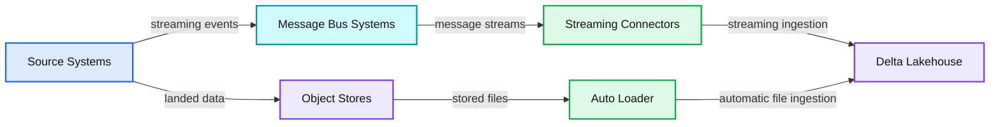
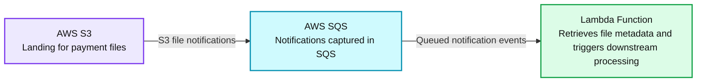
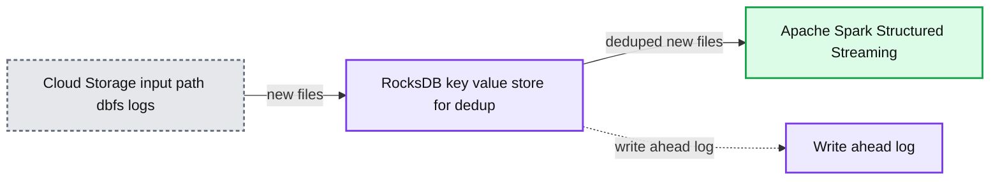

# Simplifying Streaming Data Ingestion into Delta Lake

- Source: https://www.databricks.com/blog/simplifying-streaming-data-ingestion-delta-lake
- Published: 2022-09-12
- Authors: Sachin Patil
- Categories: engineering, data-engineering, data-streaming
- Images: 3 total, 3 extracted as architecture

Most business decisions are time sensitive and require harnessing data in real time from different types of sources. Sourcing the right data at the right time is the key to enabling the timely decisions. Time sensitive data sources are spread across different technologies from IoT sensors, social media, click streams, change data capture from databases etc. In order to derive key insights from these data, it has to be ingested first into the lakehouse. The key characteristic of these data is the continuous arrival in an unbounded fashion aka [streaming](https://www.databricks.com/product/data-streaming). In this blog, we will focus on how streaming data is ingested into the lakehouse.

## High level data ingestion flow

Streaming data from diverse data sources is staged into a message bus system or cloud object store before ingestion into the lakehouse. The data from the staging area is consumed by Apache Spark Structured Streaming (SS) pipelines that write the data into the lakehouse. There are two prominent staging environments - cloud object storage and message bus systems that are discussed below.

- ***Cloud object storage*** is a secure, reliable and scalable storage and persistence layer in the cloud. Amazon S3, Azure ADLS/Blob storage or Google Cloud Storage (GCS) are examples of widely used object storage in the cloud. Usually, the events are captured into a batch and stored as a file in cloud object storage and these files need to be ingested in near real time as they arrive. Example use cases that require near real time data ingestion from cloud storage include telecom call data records, IoT event logs, etc.
- ***Message Bus Systems*** offer a loosely coupled data buffer that works on the publisher/subscriber model. Apache Kafka, Apache Pulsar, Azure EventHub, AWS Kinesis and GCP Pub/Sub are a few examples of message bus systems in open source and cloud. Message bus systems are suited for real time event capture because they ensure lower publish latency and larger fanout for supporting several consumers. Some example applications that use message buses for staging are click streams, credit card fraud detection, etc. For these applications, the data needs to be ingested in real time so that the downstream processing can deliver insights instantly.

The high level architecture of streaming data ingestion into the lakehouse from these two key data staging environments is shown in Figure 1.

*Figure 1. High level view of streaming data ingestion into delta lake*

**Summary:** The diagram shows data from change feeds and application sources landing in message buses or object stores before ingestion into the Delta Lakehouse.

**Components:**

- DB Change Data Feeds, clickstreams, machine and application logs, application events, mobile and IoT data
- Message Bus Systems using Kafka, Confluent, Pulsar, Amazon MSK, Amazon Kinesis Data Streams, Azure Event Hubs, and Google Cloud Pub/Sub
- Object Stores using Amazon S3, Azure Data Lake Storage, and Google Cloud Storage
- Streaming Connectors for message bus ingestion
- Auto Loader for object store ingestion
- Delta Lakehouse as the destination

**Flows:**

- DB Change Data Feeds and other source data -> Message Bus Systems: streaming events
- DB Change Data Feeds and other source data -> Object Stores: landed data
- Message Bus Systems -> Streaming Connectors: message streams
- Object Stores -> Auto Loader: stored files
- Streaming Connectors -> Delta Lakehouse: streaming ingestion
- Auto Loader -> Delta Lakehouse: automatic file ingestion

**Numbers:** none

source image: https://www.databricks.com/sites/default/files/inline-images/db-265-blog-img-1.png

Figure 1. High level view of streaming data ingestion into delta lake

As shown in the figure, data from various source systems first land in one of the staging areas either in object stores or in message buses. This data is ingested into the lakehouse either by streaming connectors for message buses or auto loader for object stores. [Delta Live Tables](https://www.databricks.com/blog/2022/08/09/low-latency-streaming-data-pipelines-with-delta-live-tables-and-apache-kafka.html) (DLT) is a simple declarative approach for creating reliable data pipelines and fully manages the underlying infrastructure at scale for batch and streaming data. It is also based on Spark Structured streaming and it is not covered in this blog. In the subsequent sections, we will describe in detail some of the challenges involved while ingesting streaming data from these sources.

## Data ingestion from object stores: Auto Loader

Usually, files are associated with batch data ingestion. However, continuous data ingestion from various sources into cloud based object stores in the form of files is often a common pattern. Typically, this pattern is preferred for use cases that need near real time processing wherein expected latency can be in a range of minutes. In addition, non-functional requirements, such as exactly once processing, reprocessing of failed ingestion jobs, time travel, and schema drift are needed as well.

To illustrate the challenges of loading from cloud object stores into the lakehouse, let us consider a credit card payment processing system in real time which is needed for improving the customer experience and detecting payment fraud. Typically, the transactions from different payment channels are batched together into files in the object store. These files need to be ingested into the lakehouse for further downstream processing. As these are payment transactions, we need to ensure they are processed exactly once with a provision to reprocess the failed transactions with no duplicates. If this were to be processed in the AWS cloud, it will require a complex architecture that includes:

- Tracking the payment transaction files landing in Amazon S3 in a scalable way using Amazon SQS (Simple Queue Service) notifications
- Amazon Lambda Functions to retrieve work from Amazon SQS and trigger the downstream processing
- Auditing the status of the payment transaction files using a control table

*Figure 2. Event Based file processing in the AWS Cloud*

**Summary:** Payment files flow from AWS S3 through AWS SQS to an AWS Lambda Function for metadata retrieval and downstream processing.

**Components:**

- AWS S3: landing storage for payment files
- AWS SQS: queue capturing S3 file notifications
- Lambda Function: retrieves file metadata and triggers downstream processing

**Flows:**

- AWS S3 -> AWS SQS: S3 file notifications
- AWS SQS -> Lambda Function: queued notification events

**Numbers:** none

source image: https://www.databricks.com/sites/default/files/inline-images/db-265-blog-img-2.png

Figure 2. Event Based file processing in the AWS Cloud

The key challenges are tracking large numbers of files landing in the object store, enabling exactly once processing of the data in those files and managing different schemas from various payment channels.

Auto Loader simplifies streaming data ingestion by incrementally processing new data files as they arrive in cloud object storage and it doesn't need a user to write a custom application. It keeps track of the files processed so far by maintaining an internal state. In the case of failure, it uses the state to start from the last processed file. Furthermore, if there is a need to replay or reprocess data, it provides an option to process the existing files in the directory. The key benefits of Auto Loader are:

- The ability to handle billions of files
- Asynchronous backfill using optimum utilization of the compute resources
- Optimized directory listing to improve the performance
- Support for schema inference and handling of schema drift
- Cost efficient file notification by leveraging automatic file notification service

### How does Auto Loader work?

Auto Loader supports two modes for detecting new files: file notification and directory listing.

**File notification**: Auto Loader can automatically set up a notification and queue service that subscribes to file events from the input directory. File notification mode is more performant and scalable for input directories with a high volume of files but requires additional cloud permissions. This option is better whenever files do not arrive in lexical order and obviates the need for explicit setting up of queues and notifications. To enable this mode, you need to set the option `cloudFiles.useNotifications` to true and provide the necessary permissions to create cloud resources. See more details about file notifications [here](https://docs.databricks.com/ingestion/auto-loader/file-detection-modes.html).

**Directory listing**: Another way to identify new files is by listing the input directory configured in the Auto Loader. Directory listing mode allows you to start Auto Loader streams without any additional permission configurations other than access to your data. From Databricks Runtime 9.1 onwards, Auto Loader can automatically detect whether files are arriving with lexical ordering to cloud storage and significantly reduce the amount of API calls it needs to make to detect new files. In the default mode, it triggers full directory listing after every seven consecutive incremental directory listings. However, the frequency of the full directory listing can be tweaked by setting the configuration `cloudFiles.backfillInterval`. One can explicitly enable or disable incremental listing by setting the configuration `cloudFiles.useIncrementalListing`. When this configuration is explicitly enabled, Auto Loader will not trigger full directory listings. See more details about directory listing [here](https://docs.databricks.com/ingestion/auto-loader/file-detection-modes.html).

As new files are discovered, their metadata is persisted in a scalable key-value store (RocksDB) in the checkpoint location of the Auto Loader pipeline. This serves as the state that keeps track of the files processed so far. The pipeline can both perform a backfill on a directory containing existing files and concurrently process new files that are being discovered through file notifications.

*Figure 3. Autoloader simplifies data ingestion from the Cloud Storage using RockDB based file metadata management and Structured Streaming*

**Summary:** Auto Loader ingests new files from cloud storage, tracks file metadata in a RocksDB key-value store, writes an audit log, and sends deduplicated files to Spark Structured Streaming.

**Components:**

- Cloud Storage input path `dbfs:/logs`
- RocksDB key-value store for deduplication
- Write-ahead log
- Apache Spark Structured Streaming

**Flows:**

- Cloud Storage -> RocksDB key-value store: new files
- RocksDB key-value store -> Apache Spark Structured Streaming: deduped new files

**Numbers:** none

source image: https://www.databricks.com/sites/default/files/inline-images/db-265-blog-img-3.png

Figure 3. Autoloader simplifies data ingestion from the Cloud Storage using RockDB based file metadata management and Structured Streaming

## Data ingestion from a message bus

Streaming data is generally unbounded in nature. This data is staged in message buses that serve as a buffer and provide an asynchronous method of communication where multiple producers can write into and many consumers can read from. Message buses are widely used for low latency use cases such as fraud detection, financial asset trading, and gaming. Popular message bus services include Apache Kafka, Apache Pulsar, Azure EventHubs, Amazon Kinesis and Google Cloud Pub/Sub. However, continuous data ingestion poses challenges such as scalability, resilience and fault tolerance.

For ingestion from message buses into lakehouse, an explicit Spark Structured Streaming (SS) pipeline is instantiated with the appropriate source connector for the message bus and the sink connector for the Lakehouse. The key challenges in this case are throughput and fault tolerance.

Let's discuss some common ingestion patterns from these sources. Although a message bus is a good choice for real time processing use cases, most applications need a design that balances between latency, throughput, fault tolerance requirements and cost. We will go through these design choices:

**Latency**: Achieving lower latency is not always better. Rather you can lower the cost by choosing the right latency, accuracy and cost tradeoff. Spark Structured Streaming processes data incrementally controlled by Triggers which define the timing of streaming data processing. Lower latency of Spark Structured Streaming jobs is achieved with a lower trigger interval. It is advised to [configure Structured Streaming trigger interval](https://docs.databricks.com/structured-streaming/triggers.html) to balance the latency requirements and the rate that data arrives in the source. If you specify a very low trigger interval, the system may perform unnecessary checks to see if new data arrives.

Spark Structured Streaming provides three [trigger types](https://spark.apache.org/docs/latest/structured-streaming-programming-guide.html#triggers):

Default: By default, Spark Structured Streaming processes the next batch as soon as the previous batch is completed. In most use cases, the default would suit your requirements.

Fixed Interval: Using fixed intervals, you can process the job at user specified intervals. Generally fixed intervals are used to wait for a specific time and run a larger microbatch.

One time: At times, data arrives at a fixed interval and it would be a waste of resources to keep the cluster up and running throughout the day. One of the options is to run the job in a batch mode. However executing Spark Structured Streaming jobs in trigger [Once](https://www.databricks.com/blog/2017/05/22/running-streaming-jobs-day-10x-cost-savings.html) or [AvailableNow](https://docs.databricks.com/release-notes/runtime/10.1.html?_gl=1*zxr4h7*_gcl_aw*R0NMLjE2NTY1MTM2MzQuQ2owS0NRanc4Ty1WQmhDcEFSSXNBQ012VkxQN0EzZE5xOHNKZDlXNk10bGRLZVNKZFR5YzdIN3NKMU1YSnBBTEhOTzZ5MEtuckVmYThCY2FBdkQwRUFMd193Y0I.&_ga=2.5872883.1775654412.1659882556-1041615556.1656355262&_gac=1.226415848.1656513637.Cj0KCQjw8O-VBhCpARIsACMvVLP7A3dNq8sJd9W6MtldKeSJdTyc7H7sJ1MXJpALHNO6y0KnrEfa8BcaAvD0EALw_wcB#triggeravailablenow-for-delta-source-streaming-queries) mode can be beneficial over the batch. With these execution settings, there is no need to keep the cluster running and you can significantly save the cost by periodically spinning a cluster, processing the data and shutting the cluster. Although it is similar to a batch job, it provides additional benefits such as bookkeeping management of data being processed, fault tolerance by maintaining table level atomicity and stateful operations across runs.

**Throughput:** There are multiple parameters that can be tuned to achieve high throughput within Spark Structured Streaming. Apart from choosing the trigger types, one of the key parameters is the parallel processing of data ingestion jobs. To achieve the higher throughput, you can increase the number of partitions on the message bus. Normally Spark has one-to-one mapping between the message bus partitions to Spark Structured Streaming partitions for Apache Kafka. However in the case of AWS Kinesis, the messages are pre-fetched in the memory and there is no direct mapping between the number of Kinesis Shards and the number of Spark tasks.

Let's consider a real world example where higher throughput was achieved by tuning the batch size and number of partitions. In one of the banking use cases, real time transactions were processed throughout the day using a streaming job. However, few of the events received in real time might be inaccurate. Hence a reconciliation batch was executed towards the end of the day to fix the issues. The reconciliation batch was processed using the same streaming code but different job instances. The number of partitions and batch size were increased to achieve high throughput compared to continuous flow data in another topic.

**Fault tolerance:** As Spark Structured Streaming executes the jobs in microbatches, it gives two distinct advantages to achieve fault tolerance:

- Tasks can efficiently recover from failures by rescheduling the tasks on any of the other executors
- The deterministic tasks ensure that multiple executions of the same tasks provide same output that enables exactly once processing

In Spark Structured Streaming the recovery of failed jobs is achieved using the checkpoint location of each query. The offset within the checkpoint location enables you to restart the job from the exact failure point. The option to provide the checkpoint location in queries is:

`option("checkpointLocation", "dbfs://checkpointPath")`

With replayable sources and idempotent sinks, Spark Structured Streaming jobs can achieve exactly-once semantics, which is often a requirement of production grade applications.

## Conclusion

Streaming data ingestion is the first step in enabling time sensitive decisions in the lakehouse. In this blog, we categorized the streaming data sources as continuous flow of files or message bus services. Auto Loader simplifies the near real time ingestion from file sources using Spark Structured Streaming and provides advanced features such as automatic detection of file arrival, scalability to process a large volume of data, schema inference and cost effective data ingestion. Whereas for data ingestion from message bus services, Spark Structured Streaming enables the robust data ingestion framework that integrates with most of the message bus services across different cloud providers. The most production grade applications need a trade off between latency and throughput to minimize the cost and achieve higher accuracy.
