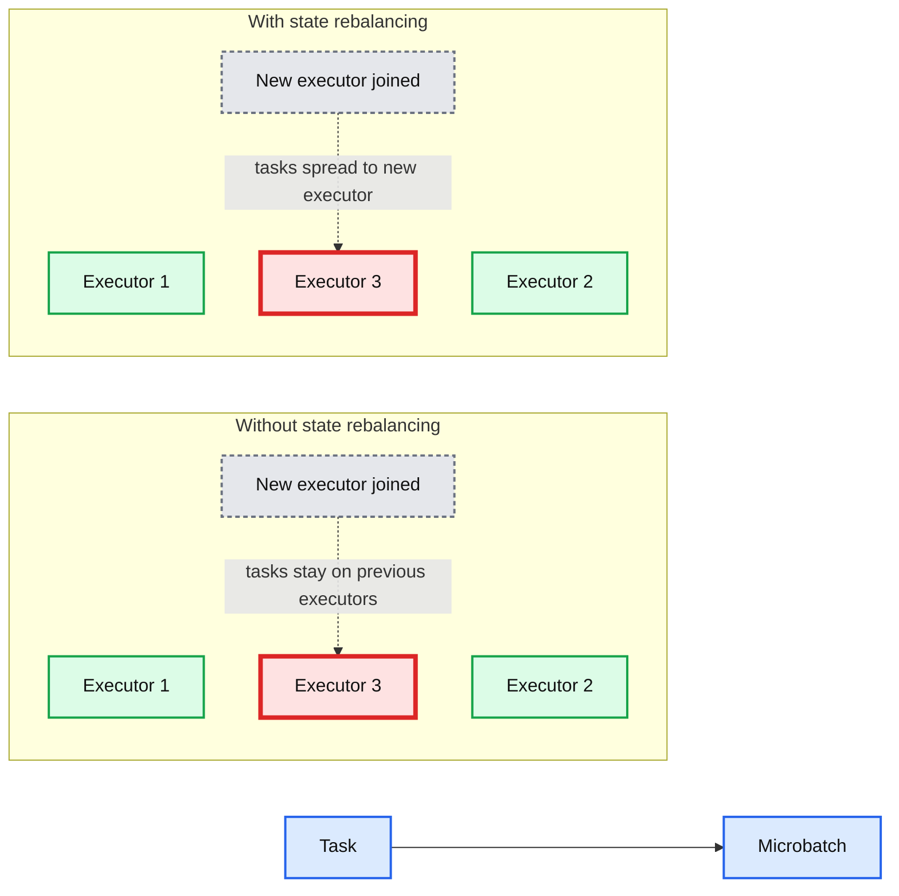

# State Rebalancing in Structured Streaming

- Source: https://www.databricks.com/blog/state-rebalancing-structured-streaming
- Published: 2022-10-04
- Authors: Tristen Wentling, Alex Balikov
- Categories: engineering, data-engineering, data-streaming
- Images: 3 total, 1 extracted as architecture

In light of the accelerated growth and adoption of Apache Spark Structured Streaming, Databricks announced [Project Lightspeed](https://www.databricks.com/blog/2022/06/28/project-lightspeed-faster-and-simpler-stream-processing-with-apache-spark.html) at Data + AI Summit 2022. Among the items outlined in the announcement was a goal of improving latency in Structured Streaming workloads. In this post we are excited to go deeper into just one of the ways that we've started to develop towards realizing the goal of lower latency with [Structured Streaming on Databricks](https://www.databricks.com/product/data-streaming).

## What's Changed?

State rebalancing for Structured Streaming is now available in preview with the release of DBR 11.1 and above. Enabling state rebalancing allows for increased cluster utilization and reduced overall micro-batch latency. The feature adds improvements in the execution of stateful operations by allowing for the redistribution of state information among executors. Stateful tasks will now execute on newly added Spark executors, instead of preferring the smaller set of existing executors what state data is already available because of the state-locality preference in task scheduling.

*State rebalancing improves utilization of available Spark executors*

**Summary:** The diagram compares stateful microbatch execution without state rebalancing, where tasks remain on existing executors, with execution using state rebalancing, where tasks spread to a newly joined executor.

**Components:**

- Task, Spark Structured Streaming task
- Microbatch, Spark Structured Streaming microbatch
- Executor 1, Spark executor
- Executor 2, Spark executor
- Executor 3, Spark executor
- State locality preference, task scheduling behavior

**Flows:**

- New executor joined -> Executor 3: Without rebalancing, existing tasks continue on previous executors
- New executor joined -> Executor 3: With rebalancing, tasks spread to utilize the new executor

**Numbers:** 1, 2, 3

source image: https://www.databricks.com/sites/default/files/inline-images/db-356-blog-img-1.png

State rebalancing improves utilization of available Spark executors

This feature will primarily benefit clusters supporting stateful workloads which go through any kind of cluster resizing operations such as autoscaling, but also may be beneficial in other scenarios.

For more details, see below or the official [Databricks documentation](https://docs.databricks.com/structured-streaming/state-rebalancing.html).

## What causes State Imbalance?

Structured Streaming allows customers to compute various aggregations over time windows. Such operations (and also streaming joins and others) are called stateful operators as they require the streaming engine to maintain persistent state information. The state information has to be partitioned to allow for distributed execution of the stateful operator tasks. Examples of stateful operators are count over a time window, stream joins, stream deduplication, mapGroupsWithState, and flatMapGroupsWithState.

When the streaming pipeline is launched, stateful partition tasks will be assigned to the available executors at random. As the state is cached on local disk, the task scheduler will prefer assigning the stateful partition tasks to the same executors they were assigned before. However, this behavior will also prevent the stateful operator execution to take advantage of the new executors when the Spark cluster is scaled up.

How do newly added executors affect task scheduler behavior? As mentioned above, autoscaling events like we might see in Delta Live Tables are a source of new executors. However, regular data engineering clusters can also intentionally be given additional resources by resizing with the [Clusters API 2.0](https://docs.databricks.com/dev-tools/api/latest/clusters.html#clusters-api-20) by editing the size of the cluster. In both cases clusters will gain executors which could remain largely idle. One other important case where this also applies, though, is when clusters lose and replace executors through normal operations. In these cases operation may continue on other existing executors after retrieving the prior state values. The new rebalancing would handle both scenarios.

The preference for task assignment in relation to the existing state partitions means that even though more compute resources are available, they are not necessarily going to be leveraged as efficiently as we'd like.

## State Rebalancing is the remedy

With state rebalancing in Structured Streaming, the task scheduler will periodically attempt to rebalance the state. When new executors are added to the cluster, the state can be rebalanced to these, improving parallelism. Newly added compute resources are more readily utilized, and overall we gain significant efficiency. When state rebalancing is triggered, e.g. due to a new executor being added to the cluster, a micro batch may have higher latency due to the state being loaded from cloud storage on the new executor. This latency spike should be amortized over the pipeline execution.In other words, by accepting a small increase in latency in a few batches (while the rebalancing is taking place) we are able to reduce the average batch latency overall in most cases.

## Testing the Performance

To test the effect of state rebalancing, we set up a [rate source](https://spark.apache.org/docs/latest/structured-streaming-programming-guide.html#input-sources) streaming query on a cluster with 2 executors, then increased the capacity to 4. When the feature was disabled, newly added executors were idle - no tasks had been assigned, as evidenced by the Spark UI:

Executors 2 and 3 are online, but have no tasks assigned to them

We then repeated this experiment on a cluster with state rebalancing enabled. In the Spark UI, we now see that the scheduler is leveraging the new executors:

Executors 2 and 3 are online and get tasks assigned to them after feature enablement

## Configuration

State rebalancing in Structured Streaming is available in preview in Databricks Runtime 11.1 and above.

Configuration is at the Spark cluster level and cannot be enabled on a streaming per-pipeline basis. To enable, set:

## Conclusion

For DBR 11.1 and above we now have a state rebalancing feature available in preview which will help improve stateful streaming efficiency. It primarily helps in situations where executors are added to clusters which today are not always utilized to their full potential. This leads to overall lower latencies in stateful Structured Streaming queries, with long running, autoscaling streams gaining the greatest efficiencies over time.
