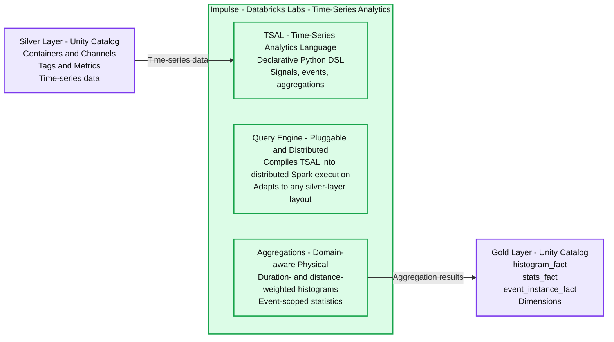
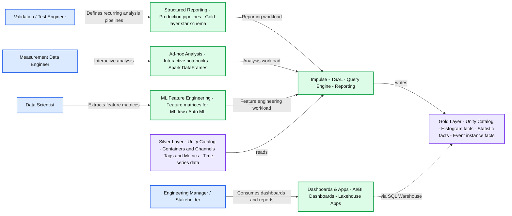

# From test bench to lakehouse: how AVL modernizes measurement data analytics with Impulse

- Source: https://www.databricks.com/blog/test-bench-lakehouse-how-avl-modernizes-measurement-data-analytics-impulse
- Published: 2026-06-25
- Authors: Dr. Thomas Bonfert, Jonathan Bräuer, Fabian Ade, Maxim Hammer, Florian Gorzitzke, David Crescence, Christa Simon, Jörg Zimmermann, Hannes Schneider
- Categories: platform, solutions, engineering, open-source, industries, manufacturing, data-strategy, data-leader, company, customers
- Images: 3 total, 3 extracted as architecture

**Key takeaways**

- Impulse is an open-source Databricks Labs framework that lets domain engineers analyze sensor data on Databricks with simple Python expressions.
- Impulse scales time-series analytics to hundreds of terabytes of measurement data, while keeping analyses reproducible, shareable across teams and governed by Unity Catalog.
- AVL replaced its legacy on-premise platform with Impulse on Databricks, cutting analysis time from days to minutes and standardizing measurement data analytics across the organization.

## 1. Introduction - Impulse: time-series analytics for measurement data

A single automotive test campaign produces hundreds of thousands of measurement recordings and hundreds of terabytes of time-series sensor data. This data is stored in binary formats like ASAM MDF4 and is traditionally analyzed with desktop tools such as NI DIAdem or MATLAB. Domain engineers like these tools for a good reason. They can focus on the actual analysis, deciding which signals to compare and which conditions define a critical event, without becoming experts in big-data frameworks and distributed computing. But the tools don't scale, analyses based on isolated scripts are hard to reproduce, and the data sits outside the governance the rest of a modern enterprise relies on.

[**Impulse**](https://github.com/databrickslabs/impulse) is a Python-based analytics library, published as a Databricks Labs project, that closes this gap on the Databricks Intelligence Platform. At its core (Figure 1), Impulse provides three key ingredients:

1. A declarative **Time Series Analytics Language (TSAL)** that lets engineers express signal arithmetic, event conditions, and aggregations in natural Python without requiring Spark expertise.
2. A **pluggable query engine** that compiles TSAL expressions into distributed Spark execution across thousands of recordings stored in any input data layout.
3. **Domain-aware abstractions** that map directly onto how engineers think about their data, including measurement containers, sensor channels, operating events, and duration- and distance-weighted aggregations.

In this blog post, we show how Impulse powers AVL's Lakehouse for Measurement Data on Databricks. AVL is a world-leading mobility technology company that specializes in the development, simulation, and testing of vehicle and energy systems. They work with measurement and simulation data to validate designs, understand system behavior, and accelerate data-driven product development from virtual models to real-world testing. We walk through the lakehouse architecture, three complementary usage modes that serve domain engineers, data engineers and data scientists alike, and the impact AVL has seen in production. Impulse builds on a hierarchical Silver-layer data model co-developed with Mercedes-Benz and described in our [previous blog post](https://www.databricks.com/blog/revolutionizing-car-measurement-data-storage-and-analysis-mercedes-benzs-petabyte-scale).

*Figure 1 – Architecture of Impulse. The framework comprises three components. TSAL is a declarative Python DSL for expressing signals, events, and aggregations without requiring Spark expertise. The pluggable Query Engine compiles TSAL expressions into distributed Spark execution plans and executes queries on Silver layer data. Domain-aware Aggregations include duration- and distance-weighted 1D/2D histograms and event-scoped statistics. Impulse eventually writes results to a Gold-layer star schema.*

**Summary:** Impulse processes Silver-layer time-series data through TSAL, a Query Engine, and domain-aware Aggregations to produce Gold-layer facts and dimensions.

**Components:**

- Silver Layer: Unity Catalog storage containing containers, channels, tags, metrics, and time-series data.
- Impulse: Databricks Labs time-series analytics framework enclosing three components.
- TSAL: Time-Series Analytics Language, a declarative Python DSL for signals, events, and aggregations.
- Query Engine: Pluggable, distributed engine compiling TSAL into Spark execution adapted to any Silver-layer layout.
- Aggregations: Domain-aware physical aggregations providing duration- and distance-weighted histograms and event-scoped statistics.
- Gold Layer: Unity Catalog storage containing `histogram_fact`, `stats_fact`, `event_instance_fact`, and dimensions.

**Flows:**

- Silver Layer -> TSAL: Time-series data enters Impulse.
- Aggregations -> Gold Layer: Aggregation results populate facts and dimensions.

**Numbers:** none

source image: https://www.databricks.com/sites/default/files/inline-images/2026-05-blog-how-avl-modernizes-measurement-data-analytics-with-impulse-inline-960x350.png

Figure 1 – Architecture of Impulse. The framework comprises three components. TSAL is a declarative Python DSL for expressing signals, events, and aggregations without requiring Spark expertise. The pluggable Query Engine compiles TSAL expressions into distributed Spark execution plans and executes queries on Silver layer data. Domain-aware Aggregations include duration- and distance-weighted 1D/2D histograms and event-scoped statistics. Impulse eventually writes results to a Gold-layer star schema.

## 2. The architecture - a lakehouse for measurement data

AVL’s platform follows the Medallion Architecture, with Unity Catalog providing governance across all layers and Databricks Workflows orchestrating the pipeline (see Figure 2).

**1. Source and Ingestion:** Raw measurement files (e.g in ASAM MDF4 format) are ingested into the Bronze layer using a Databricks Solution Accelerator. AVL extended this accelerator to work with [AVL Concerto](https://www.avl.com/en-de/testing-solutions/all-testing-products-and-software/connected-development-software-tools/avl-concerto), their measurement data management system that supports multiple proprietary file formats. Contextual metadata (vehicle IDs, software versions, project tags, etc.) is ingested alongside the recorded files.

**2. Silver Layer:** Bronze data is transformed into the hierarchical data model for measurement data. The model organizes data around containers (i.e. individual files) and channels (sensor signals), each enriched with container-level and channel-level attributes/tags and metrics. The silver layer stores validated and quality-assured data prepared for analytical processing. Data quality-assurance rules are implemented using the [Databricks DQX](https://github.com/databrickslabs/dqx) framework and are fully configurable and customizable to meet specific downstream analytics needs. Please see our [previously published blog post](https://www.databricks.com/blog/revolutionizing-car-measurement-data-storage-and-analysis-mercedes-benzs-petabyte-scale) for more details on the silver layer data model.

**3. + 4. From Silver to Gold:** The Silver layer feeds into Impulse, which translates declarative analysis logic into distributed Spark execution. Outputs can be a Gold-layer star schema for reporting, ad-hoc DataFrames for exploration, or feature matrices for ML (see Section 5).

**5. Serve and Analysis:** BI tools like Databricks Dashboards or Lakehouse Apps consume Gold-layer data via SQL Warehouses, enabling interactive exploration without touching the compute pipeline.

*Figure 2 – High-level reference architecture of the Lakehouse for Measurement Data. (1) Raw measurement files are ingested into the Bronze layer. (2) Data is transformed into the standardized Silver layer data model. (3+4) Impulse translates declarative analysis logic into distributed execution and produces Gold-layer outputs. (5) BI tools and Lakehouse Apps serve the results to end users. See text for details.*

**Summary:** Measurement files and contextual data pass through Bronze, Silver, and Gold Delta Lake layers, with Impulse supporting analysis and Databricks SQL serving results to apps and dashboards.

**Components:**
- Car Measurements: source data comprising MDF files and contextual data.
- Ingestion Tools: ingestion technology unspecified.
- Lakehouse Foundation: Databricks, using Medallion Architecture.
- Bronze Layer: raw measurement data in Delta Lake.
- Silver Layer: standardized data model for measurements and data in Delta Lake; filtered, cleaned, and augmented.
- Impulse: time-series analytics.
- Gold Layer: data model for every aggregation type in Delta Lake; business-level aggregations.
- Data Warehousing: Databricks SQL.
- Lakehouse App: application consuming warehouse results.
- Databricks Dashboards: dashboards consuming warehouse results.

**Flows:**
- Car Measurements -> Ingestion Tools: MDF files and contextual data.
- Ingestion Tools -> Bronze Layer: raw measurement data.
- Bronze Layer -> Silver Layer: data transformed into a standardized model.
- Silver Layer -> Gold Layer: data refined into business-level aggregations.
- Lakehouse Foundation -> Impulse: foundation connection through the shared line above Silver.
- Silver Layer -> Impulse: measurement data for time-series analytics.
- Impulse -> Gold Layer: analysis outputs.
- Gold Layer -> Data Warehousing: aggregated data for SQL serving.
- Data Warehousing -> Lakehouse App: query results.
- Data Warehousing -> Databricks Dashboards: query results.

**Numbers:** Step markers 1, 2, 3, 4, and 5. No units, percentages, or sizes are visible.

```mermaid
%% Measurement data lakehouse with Impulse analytics and SQL serving
flowchart LR
    C[Car Measurements - MDF files and contextual data]
    I[Ingestion Tools]
    B[Bronze Layer - Raw measurement data in Delta Lake]
    S[Silver Layer - Standardized filtered cleaned augmented data in Delta Lake]
    G[Gold Layer - Business-level aggregations in Delta Lake]
    F[Lakehouse Foundation - Databricks Medallion Architecture]
    P[Impulse - Time-series analytics]
    W[Data Warehousing - Databricks SQL]
    A[Lakehouse App]
    D[Databricks Dashboards]

    C -->|Measurement inputs| I
    I -->|1 Raw data ingestion| B
    B -->|2 Standardize data| S
    S -->|Business-level aggregation| G
    F -->|Foundation connection| P
    S -->|3 Measurement data for analysis| P
    P -->|4 Analysis outputs| G
    G -->|Aggregated data| W
    W -->|5 Query results| A
    W -->|Query results| D

    classDef client fill:#dbeafe,stroke:#2563eb,stroke-width:2px,color:#111
    classDef service fill:#dcfce7,stroke:#16a34a,stroke-width:2px,color:#111
    classDef store fill:#ede9fe,stroke:#7c3aed,stroke-width:2px,color:#111
    classDef cache fill:#fef3c7,stroke:#d97706,stroke-width:2px,color:#111
    classDef queue fill:#cffafe,stroke:#0891b2,stroke-width:2px,color:#111
    classDef critical fill:#fee2e2,stroke:#dc2626,stroke-width:4px,color:#111
    classDef external fill:#e5e7eb,stroke:#6b7280,stroke-width:2px,color:#111,stroke-dasharray:4 3
    classDef decision fill:#fce7f3,stroke:#db2777,stroke-width:2px,color:#111
    class C external
    class I,P,W service
    class B,S,G,F store
    class A,D client
```

source image: https://www.databricks.com/sites/default/files/inline-images/2026-05-blog-how-avl-modernizes-measurement-data-analytics-with-impulse-inline-960x395.png

Figure 2 – High-level reference architecture of the Lakehouse for Measurement Data. (1) Raw measurement files are ingested into the Bronze layer. (2) Data is transformed into the standardized Silver layer data model. (3+4) Impulse translates declarative analysis logic into distributed execution and produces Gold-layer outputs. (5) BI tools and Lakehouse Apps serve the results to end users. See text for details.

## 3. Putting Impulse to work: a complete analysis in 10 lines of Python

The best way to understand Impulse is to see it in action. In this section, we walk through a minimal but realistic example: selecting battery temperature sensors, defining a thermal runaway risk event based on those sensors, and calculating a duration-weighted histogram, all using the Time Series Analytics Language (TSAL).

**Selecting physical channels & defining virtual channels**

The starting point for any analysis is selecting the physical sensor channels of interest. The QueryBuilder searches the Silver-layer metadata tables and returns a TSAL expression. In the example below, we retrieve the highest and lowest cell temperatures from our EV platform and compute the temperature imbalance (delta):

Note that the single line for defining the virtual channel encodes a non-trivial computation. The framework automatically performs channel alias resolution, unit conversion, aligns channels to a common time axis and performs interpolation of data points before performing the arithmetic.

**Defining an event**

Events are time windows derived from signal conditions. Here, we define a critical safety event where the absolute maximum cell temperature exceeds a safe threshold (60°C) OR the temperature variation between cells is suspiciously high (greater than 5°C):

TSAL expressions are fully composable: virtual channels, boolean conditions, and aggregations can reference each other.

**Computing a histogram within the event**

Finally, we define a duration-weighted histogram of the maximum cell temperature, scoped to the thermal risk event. The histogram counts time spent in each temperature bin, producing physically meaningful results regardless of sensor sampling rate:

**Executing the analysis**

Two method calls trigger the distributed computation across all matching measurement recordings and persist the results as Gold-layer star schema tables in Unity Catalog. The entire analysis, from channel selection through virtual signal computation, event definition, histogram aggregation, and persistence, takes roughly 10 lines of Python. The user never writes a DataFrame transformation, a user defined function, a join, or a window function.

## 4. Three ways to use Impulse – reporting, ad-hoc analysis, and ML

Impulse supports three complementary usage modes (Figure 3), all built on the same TSAL expression language and query engine. In structured reporting mode, domain engineers define events and aggregations that are executed in parallel across all matching recordings and persisted to a Gold-layer star schema, ready for AI/BI Dashboards or Lakehouse Apps. The pipeline can be scheduled as a Databricks Workflow to update automatically as new measurements arrive. In ad-hoc mode, TSAL expressions are evaluated directly by the query engine and returned as Spark DataFrames for interactive exploration in notebooks, without writing to the Gold layer. In ML mode, event-scoped statistics and histogram distributions are extracted as flat feature matrices that can be passed directly to MLflow, AutoML, or custom training pipelines.

*Figure 3 – Four personas and their interaction with Impulse. All three active usage modes share the same TSAL core and query engine; stakeholders consume the results via Dashboards and Lakehouse Apps.*

**Summary:** Four personas use reporting, analysis, feature engineering, and dashboards with Impulse’s shared TSAL query engine and Unity Catalog Silver and Gold layers.

**Components:**

- Validation / Test Engineer: Defines recurring analysis pipelines on campaigns.
- Measurement Data Engineer: Defines recurring analysis pipelines on campaigns.
- Data Scientist: Extracts feature matrices for ML models.
- Engineering Manager / Stakeholder: Consumes dashboards and reports.
- Structured Reporting: Production pipelines using a Gold-layer star schema.
- Ad-hoc Analysis: Interactive notebooks and Spark DataFrames.
- ML Feature Engineering: Feature matrices for MLflow / Auto ML.
- Dashboards & Apps: AI/BI Dashboards and Lakehouse Apps.
- Impulse: TSAL, query engine, and reporting.
- Silver Layer: Unity Catalog containers and channels, tags and metrics, and time-series data.
- Gold Layer: Unity Catalog histogram facts, statistic facts, and event instance facts.

**Flows:**

- Validation / Test Engineer -> Structured Reporting: Defines recurring analysis pipelines.
- Measurement Data Engineer -> Ad-hoc Analysis: Uses interactive notebooks and Spark DataFrames.
- Data Scientist -> ML Feature Engineering: Extracts feature matrices.
- Engineering Manager / Stakeholder -> Dashboards & Apps: Consumes dashboards and reports.
- Structured Reporting -> Impulse: Reporting workload.
- Ad-hoc Analysis -> Impulse: Interactive analysis workload.
- ML Feature Engineering -> Impulse: Feature engineering workload.
- Silver Layer -> Impulse: Impulse reads measurement data.
- Impulse -> Gold Layer: Writes facts.
- Dashboards & Apps -> Gold Layer: Access via SQL Warehouse, shown as a dashed arrow.

**Numbers:** none

source image: https://www.databricks.com/sites/default/files/inline-images/2026-05-blog-how-avl-modernizes-measurement-data-analytics-with-impulse-inline-960x437.png

Figure 3 – Four personas and their interaction with Impulse. All three active usage modes share the same TSAL core and query engine; stakeholders consume the results via Dashboards and Lakehouse Apps.

**How AVL uses Impulse in practice**

In practice, AVL leverages the strengths of the Impulse framework by primarily using its structured reporting mode to build configurable, standardized analysis packages** **(“toolboxes”). These toolboxes are executed by domain engineers on incoming measurement campaigns, depending on their specific engineering task or analytical focus.

The resulting Gold-layer outputs are seamlessly integrated into Databricks Dashboards and Lakehouse Apps, where engineers can interactively explore results and create histograms, heatmaps, and other statistical visualizations to support data-driven engineering decisions.

## 5. Results and impact

With the help of the Impulse framework and the Databricks Data + AI Platform, AVL has built an end-to-end engineering data platform to support data-driven product development. The platform introduces a new standard in automotive data analysis and delivers improvements across multiple dimensions:

**Quantitative improvements**

- Significant reduction in analysis time (from days to minutes compared to traditional approaches)
- Ability to process a large number of measurement recordings in a single run
- Infrastructure cost savings compared to on-premise solutions

**Qualitative improvements**

- Empowerment of domain engineers through self-service analytics
- Fully reproducible and transparent analyses
- Cross-team standardization on a single, unified data platform

## 6. What’s next - open source and the road ahead

Impulse is being released as a Databricks Labs project (please see [here](https://github.com/databrickslabs/impulse)), open to community contributions in new aggregations, query solvers, and domain-specific extensions. The framework ships with a public demo dataset, full documentation and Databricks notebooks to demonstrate the reporting & ML usage modes.

For AVL, today's deployment is only the foundation of their lakehouse for measurement data. The roadmap extends Impulse to ADAS and autonomous driving validation, predictive maintenance, and simulation data, working toward end-to-end data-driven product development.
