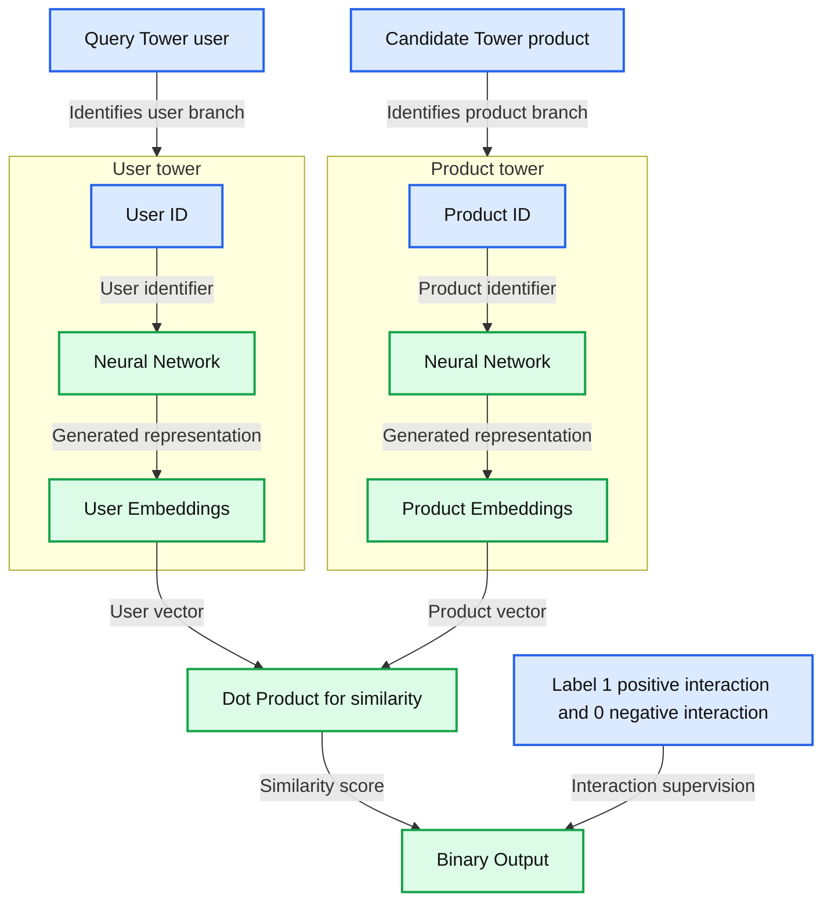
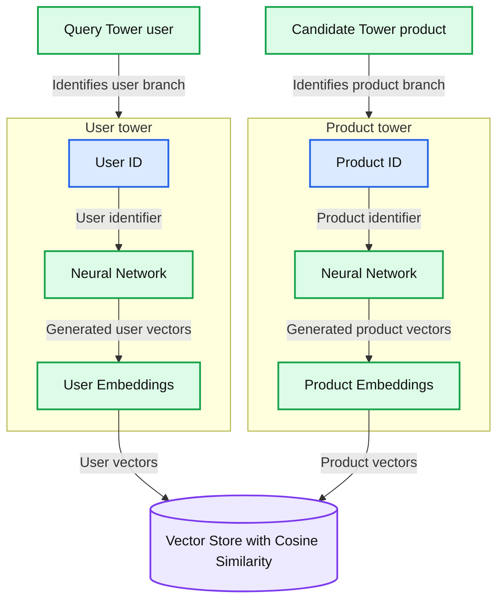
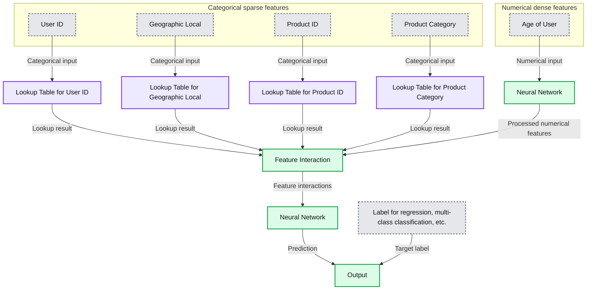

# Training Highly Scalable Deep Recommender Systems on Databricks (Part 1)

- Source: https://www.databricks.com/blog/training-deep-recommender-systems-1
- Published: 2024-09-04
- Authors: Rithwik Ediga Lakhamsani, Asfandyar Qureshi, Karan Jariwala, Lin Yuan, Lu Wang (Databricks), Saaketh Narayan, Ning Wang
- Categories: engineering, data-engineering, data-science-machine-learning, data-streaming, solution-accelerators, databricks-ai
- Images: 4 total, 4 extracted as architecture

Recommender systems (RecSys) have become an integral part of modern digital experiences, powering personalized content suggestions across various platforms. These sophisticated systems and algorithms analyze user behavior, preferences, and item characteristics to predict and recommend items of interest. In the era of big data and machine learning, recommender systems have evolved from simple collaborative filtering approaches to complex models that leverage deep learning techniques.

 

It can be challenging to scale these recommender systems, especially when dealing with millions of users or thousands of products. To do so requires finding a balance between cost, efficiency, and accuracy. A common approach to address this scalability issue involves a two-stage process: an initial, efficient "broad search" followed by a more computationally intensive "narrow search" on the most relevant items. For example, in movie recommendations, an effective model might first narrow the search space from thousands to about 100 items per user, and then apply a more complex model for precise ordering of the top 10 recommendations. This strategy optimizes resource utilization while maintaining recommendation quality, addressing scalability challenges in large-scale recommendation systems.

Many companies don’t have the resources to build and scale recommender systems of this size, but Databricks offers all the essential components — including data processing, feature engineering, model training, monitoring, governance and serving — that can be combined to create a state-of-the-art recommender system, as well as the technical support resources to help implement them. This article is the first in a series designed to demonstrate effective techniques for training and deploying recommendation models at scale on Databricks. In this installment, we focus on distributed data loading and training. Subsequent articles will explore distributed checkpointing, inference, and the integration of complementary components, such as vector stores, to create a robust, end-to-end recommender system pipeline.

*Figure 1: Example Recommender System Architecture*

**Summary:** A recommender pipeline combines user and product embeddings, vector retrieval, Spark filtering, feature tables, model reranking, and Spark ordering to produce user recommendations.

**Components:**
- User ID: user identifier, shown as a user feature.
- Embedding model: for example, two tower, using Machine Learning Runtime and Model Serving.
- Product ID: product identifier within a collection labeled Millions of products.
- Vector Store: stores product embeddings, categorized as Other Databricks products.
- Filtering: Spark and ETL.
- User feature tables: User ID, User age, and additional unspecified features.
- Product feature tables: Product ID, Product category, and additional unspecified features.
- Feature tables: combines features for reranking, categorized as Other Databricks products.
- Reranking model: for example, DLRM, using Machine Learning Runtime and Model Serving.
- Ordering: Spark and ETL.
- Recommendations for users: final results.
- Color legend: green identifies User features; red identifies Product features; dark teal identifies Machine Learning Runtime and Model Serving; orange identifies Spark; light gray identifies Other Databricks products; blue identifies Final results.

**Flows:**
- User ID -> User feature tables: bidirectional association with the table's User ID.
- User feature tables -> User ID: reverse direction of the User ID association.
- User ID -> Embedding model: user identifier.
- Product ID -> Embedding model: product identifier.
- Product ID -> Product feature tables: bidirectional association with the table's Product ID.
- Product feature tables -> Product ID: reverse direction of the Product ID association.
- Embedding model -> Vector Store: user embedding, indicated by the green arrow.
- Embedding model -> Vector Store: product embedding, indicated by the red arrow.
- Vector Store -> Filtering: retrieved products.
- Filtering -> Feature tables: filtered products.
- User feature tables -> Feature tables: user features.
- Product feature tables -> Feature tables: product features.
- Feature tables -> Reranking model: user features, indicated by the green arrow.
- Feature tables -> Reranking model: product features, indicated by the red arrow.
- Reranking model -> Ordering: reranked products.
- Ordering -> Recommendations for users: ordered recommendations.

**Numbers:** Millions of products, with no exact count. The model example is named two tower.

```mermaid
%% Recommender pipeline from user and product identifiers to ordered recommendations
flowchart LR
    U[User ID]
    P[Product ID - Millions of products]
    E[Embedding model - two tower]
    V[Vector Store - product embeddings]
    F[Filtering - Spark and ETL]
    UF[User feature tables - User ID - User age - ...]
    PF[Product feature tables - Product ID - Product category - ...]
    FT[Feature tables]
    R[Reranking model - DLRM]
    O[Ordering - Spark and ETL]
    OUT[Recommendations for users]

    U <-->|User ID association| UF
    P <-->|Product ID association| PF
    U -->|User ID| E
    P -->|Product ID| E
    E -->|User embedding| V
    E -->|Product embedding| V
    V -->|Retrieved products| F
    F -->|Filtered products| FT
    UF -->|User features| FT
    PF -->|Product features| FT
    FT -->|User features| R
    FT -->|Product features| R
    R -->|Reranked products| O
    O -->|Ordered recommendations| OUT

    classDef client fill:#dbeafe,stroke:#2563eb,stroke-width:2px,color:#111
    classDef service fill:#dcfce7,stroke:#16a34a,stroke-width:2px,color:#111
    classDef store fill:#ede9fe,stroke:#7c3aed,stroke-width:2px,color:#111
    classDef cache fill:#fef3c7,stroke:#d97706,stroke-width:2px,color:#111
    classDef queue fill:#cffafe,stroke:#0891b2,stroke-width:2px,color:#111
    classDef critical fill:#fee2e2,stroke:#dc2626,stroke-width:4px,color:#111
    classDef external fill:#e5e7eb,stroke:#6b7280,stroke-width:2px,color:#111,stroke-dasharray:4 3
    classDef decision fill:#fce7f3,stroke:#db2777,stroke-width:2px,color:#111

    class U,OUT client
    class E,F,R,O service
    class P,V,UF,PF,FT store
```

source image: https://www.databricks.com/sites/default/files/inline-images/Chart-01.png?v=1725474058

*Figure 1: Example Recommender System Architecture*

This article presents a suite of reference solutions that serve as a robust foundation for training enterprise-scale recommender systems on the Databricks Data + AI Platform. These solutions use [Mosaic Streaming](https://docs.mosaicml.com/projects/streaming/en/stable/index.html) as the dataloader and [TorchDistributor](https://docs.databricks.com/en/machine-learning/train-model/distributed-training/spark-pytorch-distributor.html) as the orchestrator for distributed training, both of which were developed in-house at Databricks. By using [TorchRec](https://pytorch.org/torchrec/), a highly scalable recommender system package leveraging PyTorch, we showcase implementations of two advanced deep learning models that align with the two-stage approach mentioned earlier: the [Two Tower model](https://marketplace.databricks.com/details/cc45e324-1523-4d8d-a2a0-b59eb7858e04/Databricks_Two-Tower-Recommendation-Model-Training), ideal for the efficient "broad search" phase, and Meta's [DLRM](https://marketplace.databricks.com/details/db8353e3-ea71-4437-a80b-6f584cffa42b/Databricks_DLRM-Recommendation-Model-Training) (Deep Learning Recommendation Model), suited for the more intensive "narrow search" phase. Both models are capable of handling millions of users and items efficiently, with the Two Tower model quickly narrowing down the candidate set from potentially millions to thousands, and DLRM providing precise ordering of the most relevant items. To facilitate seamless integration into your workspaces and projects, we've made these models available through the [Databricks marketplace](https://marketplace.databricks.com/).

## Two Tower

The [Two Tower model](https://marketplace.databricks.com/details/cc45e324-1523-4d8d-a2a0-b59eb7858e04/Databricks_Two-Tower-Recommendation-Model-Training) is an efficient architecture for large-scale recommender systems. As illustrated in the diagram, it comprises two parallel neural networks: the "query tower" for users and the "candidate tower" for products. Each tower processes its input (User ID or Product ID) to generate dense embeddings, representing users and products in a shared space. The model predicts user-item interactions by computing the similarity between these embeddings using a dot product, enabling quick identification of potentially relevant items from a vast catalog. This makes it ideal for the initial "broad search" phase in recommendation systems.

*Figure 2: Training phase of the Two Tower Architecture*

**Summary:** Two neural network towers transform user and product IDs into embeddings whose dot product produces a binary interaction output supervised by interaction labels.

**Components:**
- Query Tower, user: neural network branch for users.
- User ID: user identifier input; technology unspecified.
- Neural Network, user: generates user embeddings; framework unspecified.
- User Embeddings: dense user representations.
- Candidate Tower, product: neural network branch for products.
- Product ID: product identifier input; technology unspecified.
- Neural Network, product: generates product embeddings; framework unspecified.
- Product Embeddings: dense product representations.
- Dot Product, for similarity: vector dot product operation.
- Binary Output: binary interaction prediction.
- Label: positive or negative interaction supervision.

**Flows:**
- Query Tower label -> User tower boundary: identifies the user branch.
- User ID -> User Neural Network: user identifier.
- User Neural Network -> User Embeddings: generated user representation.
- User Embeddings -> Dot Product: user vector for similarity.
- Candidate Tower label -> Product tower boundary: identifies the product branch.
- Product ID -> Product Neural Network: product identifier.
- Product Neural Network -> Product Embeddings: generated product representation.
- Product Embeddings -> Dot Product: product vector for similarity.
- Dot Product -> Binary Output: similarity score.
- Label -> Binary Output: interaction supervision.

**Numbers:** 1: positive interaction; 0: negative interaction.

source image: https://www.databricks.com/sites/default/files/inline-images/Chart-02.png?v=1725474058

*Figure 2: Training phase of the Two Tower Architecture*

The Two Tower architecture's full potential is realized through its integration with a vector store. By leveraging a vector store to index candidate vectors, the system can efficiently and scalably retrieve hundreds of relevant candidates for each user during inference. In a future article in this series, we will demonstrate how to implement this integration using the [Databricks Vector Store](https://docs.databricks.com/en/generative-ai/vector-search.html) and the Two Tower model, showcasing the power of this combined approach.

*Figure 3: Two Tower Model with Vector Store. Note: Although not pictured here, Two Tower models generally also benefit from additional features other than just the User/Product IDs. However, it's crucial to consider the trade-off between the enhanced accuracy from these additional features and the potential increase in model complexity and inference time.*

**Summary:** User and product neural network towers generate embeddings that feed a vector store using cosine similarity.

**Components:**
- Query Tower, user: groups the user ID, neural network, and user embeddings.
- User ID: identifier input to the user neural network.
- Neural Network, user: generates user embeddings; framework unspecified.
- User Embeddings: vector output of the user tower.
- Candidate Tower, product: groups the product ID, neural network, and product embeddings.
- Product ID: identifier input to the product neural network.
- Neural Network, product: generates product embeddings; framework unspecified.
- Product Embeddings: vector output of the product tower.
- Vector Store: stores embeddings and uses cosine similarity; implementation unspecified.

**Flows:**
- Query Tower label -> User tower boundary: identifies the user branch.
- User ID -> User Neural Network: user identifier input.
- User Neural Network -> User Embeddings: generated user vectors.
- User Embeddings -> Vector Store: user vectors.
- Candidate Tower label -> Product tower boundary: identifies the product branch.
- Product ID -> Product Neural Network: product identifier input.
- Product Neural Network -> Product Embeddings: generated product vectors.
- Product Embeddings -> Vector Store: product vectors.

**Numbers:** none

source image: https://www.databricks.com/sites/default/files/inline-images/Chart-03.png?v=1725474058

*Figure 3: Two Tower Model with Vector Store. Note: Although not pictured here, Two Tower models generally also benefit from additional features other than just the User/Product IDs. However, it's crucial to consider the trade-off between the enhanced accuracy from these additional features and the potential increase in model complexity and inference time.*

## DLRM

The Deep Learning Recommendation Model (DLRM) by Meta, as illustrated in the following diagram, is a sophisticated architecture designed for large-scale recommendation systems. It efficiently handles both categorical (sparse) and numerical (dense) features, making it highly versatile for various recommendation tasks. The model uses lookup tables to embed categorical features, and these embeddings, along with numerical features are then processed through a feature interaction layer. This layer captures complex relationships between different feature types. The combined features are then fed into a neural network, which further processes the information to generate the final output. This output can be used for various tasks such as regression or multi-class classification, depending on the specific recommendation problem, but is most often used for predicting click-through rates. The DLRM's ability to handle diverse feature types and capture intricate feature interactions makes it particularly effective in the “narrow search” phase for precise item ranking in recommendation systems.

*Figure 4: Deep Learning Recommendation Model (DLRM) by Meta*

**Summary:** The DLRM combines categorical features processed through lookup tables with numerical features processed through a neural network, then applies feature interaction and another neural network to produce an output linked to a label.

**Components:**

- Categorical sparse features: group containing User ID, Geographic Local, Product ID, Product Category, and ellipses indicating additional features.
- User ID: categorical input.
- Geographic Local: categorical input.
- Product ID: categorical input.
- Product Category: categorical input.
- Lookup Table for User ID: lookup table.
- Lookup Table for Geographic Local: lookup table.
- Lookup Table for Product ID: lookup table.
- Lookup Table for Product Category: lookup table.
- Numerical dense features: group containing Age of User, with an ellipsis indicating additional features.
- Age of User: numerical input.
- Lower Neural Network: neural network processing the numerical input.
- Feature Interaction: layer combining lookup-table and neural-network results.
- Upper Neural Network: neural network processing feature interactions.
- Output: model output.
- Label: target for regression, multi-class classification, or other tasks.

**Flows:**

- Categorical sparse features -> categorical input group: identifies the grouped inputs.
- Numerical dense features -> numerical input group: identifies the grouped inputs.
- User ID -> Lookup Table for User ID: categorical input.
- Geographic Local -> Lookup Table for Geographic Local: categorical input.
- Product ID -> Lookup Table for Product ID: categorical input.
- Product Category -> Lookup Table for Product Category: categorical input.
- Age of User -> Lower Neural Network: numerical input.
- Lookup Table for User ID -> Feature Interaction: lookup result.
- Lookup Table for Geographic Local -> Feature Interaction: lookup result.
- Lookup Table for Product ID -> Feature Interaction: lookup result.
- Lookup Table for Product Category -> Feature Interaction: lookup result.
- Lower Neural Network -> Feature Interaction: processed numerical features.
- Feature Interaction -> Upper Neural Network: feature interactions.
- Upper Neural Network -> Output: prediction.
- Label -> Output: target label.

**Numbers:** none

source image: https://www.databricks.com/sites/default/files/inline-images/Chart-04_NEW.png?v=1725491094

*Figure 4: Deep Learning Recommendation Model (DLRM) by Meta*

For production-level DLRM model training, we recommend leveraging the [Databricks Feature Store](https://www.databricks.com/product/feature-store). This powerful tool enables the seamless creation of training datasets with diverse feature arrangements for both users and items. While the current Databricks documentation provides [examples](https://docs.databricks.com/en/machine-learning/feature-store/train-models-with-feature-store.html#language-Feature%C2%A0Engineering%C2%A0in%C2%A0Unity%C2%A0Catalog) for simpler recommender systems, a future article in this series will demonstrate how to integrate the Databricks Feature Store with the models discussed here.

## How to Train a Recommendation Model

Both examples of training recommendation models share a similar overall structure, employing state-of-the-art techniques for large-scale distributed training.

### Data Preprocessing and Data Loading with Mosaic Streaming

The examples in these stages leverage [Mosaic Streaming](https://streaming.docs.mosaicml.com/), an essential tool for optimizing the training process on large datasets stored in cloud environments. This approach maximizes efficiency, cost-effectiveness, and scalability. When training large recommender systems, particularly those that need to accommodate millions of users and/or items, multi-node training is often necessary. However, distributed data loading introduces a range of challenges, including synchronization issues, memory management, and reproducibility across runs.

 

Mosaic Streaming is purpose-built to address these challenges. It's specifically designed to support multi-node, distributed training of large models, with a focus on ensuring correctness guarantees, optimizing performance, providing flexibility, and enhancing ease-of-use. By tackling these critical aspects, Mosaic Streaming enables seamless scaling of recommender systems while mitigating the common pitfalls associated with distributed training environments.

 

The preprocessing stage involves several steps:

1. Collecting training data from a table in [Unity Catalog](https://www.databricks.com/product/unity-catalog)
2. Performing necessary data transformations
3. Utilizing Mosaic Streaming's dataframe_to_mds API to materialize the processed data into a Unity Catalog Volume
 

We then use Databricks [StreamingDataset](https://www.databricks.com/blog/mosaicml-streamingdataset) and [StreamingDataLoader](https://docs.mosaicml.com/projects/streaming/en/stable/api_reference/generated/streaming.StreamingDataLoader.html) APIs in our training function to easily load the relevant data for each node in a distributed environment. Note that StreamingDataLoader is required if you need mid-epoch resumption. If that’s not needed, using the native Torch DataLoader is fine as well!
 

### Parallelizing Model Training with TorchRec and the TorchDistributor

Recommender systems that need to scale to millions of users or items can become overwhelming for a single node to handle. As a result, scaling to multiple nodes often becomes necessary for training these large deep recommendation models. To address this challenge, solutions leverage a combination of PyTorch’s TorchRec library and PySpark’s TorchDistributor to efficiently scale recommendation model training on Databricks.

 

[TorchRec](https://pytorch.org/blog/introducing-torchrec/#:~:text=TorchRec%20has%20state%2Dof%2Dthe,will%20be%20in%20production%20soon.) is a domain-specific library built on PyTorch, aimed at providing the necessary sparsity and parallelism primitives for large-scale recommender systems. A key feature of TorchRec is its ability to efficiently shard large embedding tables across multiple GPUs or nodes using the DistributedModelParallel and EmbeddingShardingPlanner APIs. Notably, TorchRec has been instrumental in powering some of the largest models at Meta, including a 1.25 trillion parameter model and a 3 trillion parameter model.

 

Complementing TorchRec, [TorchDistributor](https://docs.databricks.com/en/machine-learning/train-model/distributed-training/spark-pytorch-distributor.html) is an open source module integrated into PySpark that facilitates distributed training with PyTorch on Databricks. It is designed to support all distributed training paradigms offered by PyTorch, such as Distributed Data Parallel and Tensor Parallel, in various configurations, including single-node multi-GPU and multi-node multi-GPU setups. Additionally, it provides a minimal API that allows users to execute training on functions defined within the current notebook or using external training files. An example usage of the TorchDistributor is as follows:
 

The combination of TorchRec and the TorchDistributor enables the efficient handling of massive datasets and complex models typical in enterprise-grade recommendation systems.

### Logging with MLflow

In the reference solutions provided, we use [MLflow](https://mlflow.org/) to log key items, like model hyperparameters, metrics, and the model’s state_dict. Note that while the approach taken in the example notebooks collects the distributed model onto one node before saving to MLflow, this wouldn’t work for models that are too big to fit on one node. To address this issue, the next article in this series will go into detail on how to do distributed model checkpointing and large-scale model inference on Databricks.

## Next Steps

In this article, we introduced reference solutions for how to implement and train highly scalable deep recommendation models on Databricks. We briefly discussed the Two Tower architecture, the DLRM architecture and where they fit inside the extended recommender system pipeline. Finally, we delved into the specifics of distributed data loading and distributed model training of these recommendation models on Databricks. This is just the start: in future articles in this series, we will discuss additional aspects of productionizing recommender systems, including distributed model saving, inference, and integration with other tools on Databricks.
