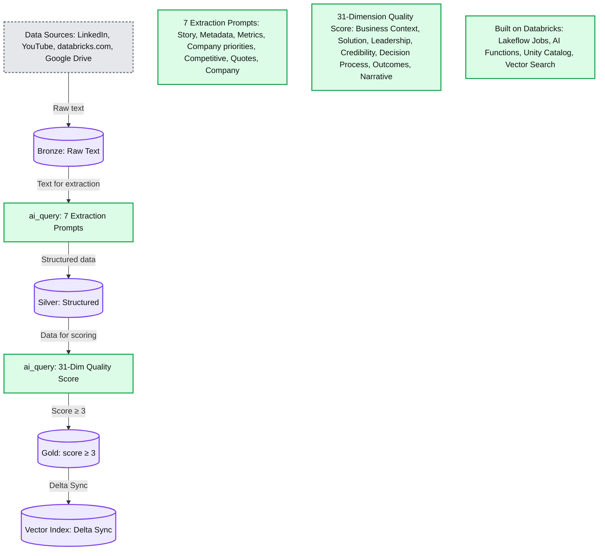
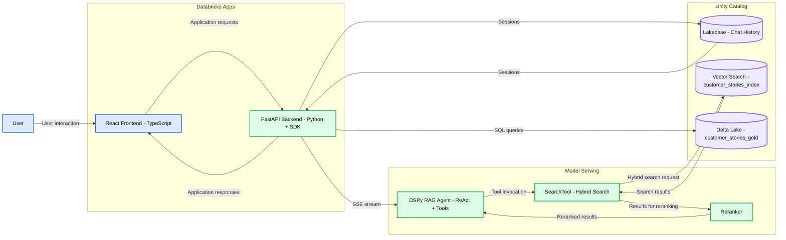
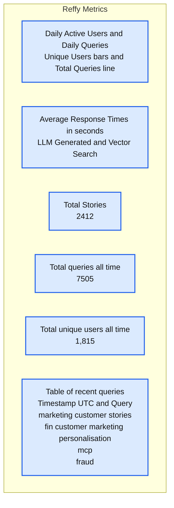

# From tribal knowledge to instant answers: Building Reffy on Databricks

- Source: https://www.databricks.com/blog/tribal-knowledge-instant-answers-building-reffy-databricks
- Published: 2026-03-02
- Authors: Rafi Kurlansik, Gavin Edgley, Sara Steffen
- Categories: engineering
- Images: 5 total, 3 extracted as architecture

**Key takeaways**

- Why finding the right customer reference at the right time was a persistent challenge across Databricks sales and marketing.
- How we built Reffy—a full-stack agentic app using RAG, AI Search, AI Functions, and Lakebase—to make over 2,400 customer stories instantly searchable.
- Since its launch in December 2025, over 1800 Databricks employees have run upwards of 7,500 queries on Reffy.

Finding the right customer story at the right time is surprisingly harder than it should be. To improve employee productivity, we built Reffy—an app that enables users to discover and analyze over 2,400 Databricks customer references, delivering personalized responses, cross-story analysis, quotes, and more. In its first two months, over 1,800 people in Databricks sales & marketing have run upward of 7,500 queries on Reffy. That translates into more relevant and consistent storytelling, faster campaign execution, and confidence that customer proof is used at scale. By making these stories discoverable and digestible, we solved the tribal knowledge problem surrounding customer references & unlocked the valuable work of so many people who have collected them over the years.

In this article we'll go into the motivation for Reffy, the complete Databricks solution, its impact on our organization, and how we plan to scale it even further internally.

## The challenge of democratizing tribal knowledge

"Who else has done this?" is a question that every seller hears. A prospect is intrigued by your pitch, but before they'll move forward, they want proof—a customer like them who's already walked this path. It should be easy to answer.

For our marketing team, customer stories are a core input to nearly every motion — campaigns, product launches, advertising, PR, analyst briefings, and executive communications. When those stories aren’t easy to find or evaluate, real problems compound: high-value references get overused, newer use cases or industries are missed, and marketing effectiveness becomes limited by tribal knowledge.

Databricks has thousands of YouTube talks, case studies on databricks.com, internal slides, LinkedIn articles, Medium posts. Somewhere in there is the perfect reference—a financial services company in Canada doing real-time fraud detection, a retailer who replaced a legacy data warehouse, a manufacturer scaling GenAI. But finding it? That's where things fall apart. The stories live across a dozen platforms with no unified search, and when you do find something, you can't immediately tell if it's strong—does it have credible business outcomes, or just vague claims?

So people do what people do: they message the marketing team on Slack, dig through folders they half-remember, or ask around until someone surfaces something usable. Sometimes they find gold. More often, they settle for "good enough" or give up entirely—never knowing if the perfect story was out there all along.

Clearly, we needed a better way for sales and marketing to discover the most relevant customer stories.

## Reffy: A full-stack solution on Databricks

To solve this problem, we consolidate all stories into a single table, categorize them, then use a RAG-based agent to power search—all surfaced through a vibe-coded Databricks app. The architecture spans the full Databricks platform: Lakeflow Jobs orchestrate our ETL pipelines, Unity Catalog governs our data, AI Search powers retrieval, Model Serving hosts our agent, Lakebase handles real-time reads and writes, and Databricks Apps delivers the frontend. Let's dig into the details.

*Data sources & ETL*

**Summary:** Reffy extracts and structures source text with AI, scores its quality, and syncs qualifying Gold data to a vector index on Databricks.

**Components:**
- Data Sources: LinkedIn, YouTube, databricks.com, and Google Drive.
- Bronze: raw text storage.
- Extraction: `ai_query()` with 7 extraction prompts.
- Silver: structured data storage.
- Quality scoring: `ai_query()` with a 31-dimension quality score.
- Gold: storage for data with score ≥ 3.
- Vector Index: Delta Sync.
- Extraction prompts: Story - title, summary, problem, solution, impact; Metadata - timing, validation, referenceable; Metrics - 3 key metrics with values and units; Company priorities; Competitive; Quotes; Company - name, country, industry.
- Quality dimensions: Business Context, Solution, Leadership, Credibility, Decision Process, Outcomes, and Narrative.
- Platform labels: Databricks, Lakeflow Jobs, AI Functions, Unity Catalog, and Vector Search.

**Flows:**
- Data Sources -> Bronze: raw text.
- Bronze -> Extraction: raw text for extraction.
- Extraction -> Silver: structured data.
- Silver -> Quality scoring: structured data for scoring.
- Quality scoring -> Gold: data with score ≥ 3.
- Gold -> Vector Index: Delta Sync.

**Numbers:**
- 7 extraction prompts, shown in the extraction step and detail panel.
- Prompt list numbered 1 through 7.
- 3 key metrics with values and units.
- 31 quality dimensions, shown in the scoring step and detail panel.
- Gold threshold: score ≥ 3.

source image: https://www.databricks.com/sites/default/files/inline-images/tribal-knowledge-instant-answers-building-reffy-databricks-blog-img-2.png

Our pipeline is defined in a series of Databricks Notebooks orchestrated with [Lakeflow Jobs](https://docs.databricks.com/aws/en/jobs/). The pipeline begins by collecting the text of stories from all of our data sources: we use standard Python webscraping libraries to gather YouTube transcripts, LinkedIn/Medium articles, and all public customer stories on [databricks.com](https://www.databricks.com/). Using Google Apps scripts, we also consolidate the text from hundreds of internal Google slides and docs into a single Google Sheet. All of these sources are processed with basic metadata and saved to a 'Bronze' Delta Lake table in Unity Catalog (UC).

Now we have all of our stories in one place, but we still don't have any insight into their quality. To remedy this, we classify the text by applying a rigorous 31-point scoring system (developed by our Value team) to each story via [AI Functions](https://docs.databricks.com/aws/en/large-language-models/ai-functions). We prompt Gemini 2.5 to judge overall story quality by identifying the business challenge, the solution, the credibility of the outcome, and why Databricks was uniquely positioned to deliver value. Judging stories like this also lets us filter out the lowest quality ones from Reffy. The prompt also extracts key metadata like country and industry, products used, competition, and quotes—and tags stories based on whether they are publicly sharable or internal only. This enriched dataset is saved to a 'Silver' table in UC.

The final steps of ETL include filtering out low-scoring stories and creating a new 'summary' column that concatenates essential story components together. The idea is simple: we sync this 'Gold' table to a [Databricks AI Search](https://docs.databricks.com/aws/en/vector-search/vector-search) index, with the summary column containing all of the essential information an LLM would need to match customer stories to queries.

*Agentic AI*

Using the [DSPy](https://dspy.ai/) framework, we define a tool-calling agent that can look up the most relevant customer references with hybrid keyword and semantic search. We love DSPy! Agents built with it are easy to test iteratively in a Databricks notebook without redeploying to a Model Serving endpoint every time, resulting in a faster dev cycle. The syntax is highly intuitive compared to other popular frameworks, and it includes excellent [prompt optimization](https://dspy.ai/learn/optimization/overview/) components. If you haven't yet, definitely check out DSPy.

We structure our customer stories agent to facilitate a lightning-fast pure keyword search and a longer-form LLM response with reasoning depending on the user input: if you ask a question, you'll get a carefully thought-out answer with sources, but if you just enter a few keywords, Reffy will return top results in less than two seconds. We also use the Databricks [re-ranker](https://www.databricks.com/blog/reranking-mosaic-ai-vector-search-faster-smarter-retrieval-rag-agents) for AI Search to improve results from RAG.

To ensure a balanced and professional response, we use the following system prompt:

The agent is logged to MLflow and deployed to [Databricks Model Serving](https://www.databricks.com/product/model-serving) using our [Agent Framework](https://www.databricks.com/product/machine-learning/retrieval-augmented-generation). Since most of the processing is done on the model provider's side, we can get away with deploying to a small CPU instance, saving on infrastructure costs compared to GPUs.

*The Databricks App*

**Summary:** Reffy connects a React and FastAPI app to a served DSPy RAG agent, hybrid search and reranking, with chat history, a vector index and Delta Lake data in Unity Catalog.

**Components:**
- User: application client.
- Databricks Apps: hosts the frontend and backend.
- React Frontend: TypeScript.
- FastAPI Backend: Python + SDK.
- Model Serving: hosts the agent, search tool and reranker.
- DSPy RAG Agent: ReAct + Tools.
- SearchTool: Hybrid Search.
- Reranker: reranking component.
- Unity Catalog: contains the three data services.
- Lakebase: Chat History.
- Vector Search: `customer_stories_index`.
- Delta Lake: `customer_stories_gold`.

**Flows:**
- User -> React Frontend: user interaction.
- React Frontend -> FastAPI Backend: application requests.
- FastAPI Backend -> React Frontend: application responses.
- FastAPI Backend -> Lakebase: sessions.
- Lakebase -> FastAPI Backend: sessions.
- FastAPI Backend -> DSPy RAG Agent: SSE stream.
- DSPy RAG Agent -> SearchTool: tool invocation.
- SearchTool -> Reranker: search results for reranking.
- Reranker -> DSPy RAG Agent: reranked results.
- SearchTool -> Vector Search: hybrid search request.
- Vector Search -> SearchTool: search results.
- FastAPI Backend -> Delta Lake: SQL queries.

**Numbers:** none

source image: https://www.databricks.com/sites/default/files/inline-images/tribal-knowledge-instant-answers-building-reffy-databricks-blog-img-3.png

Now that we have the data cleaned and indexed and the agent is working well, it's time to build an app to tie it all together and make it accessible to non-technical users. We chose a React frontend with a FastAPI Python backend. React is beautiful and snappy in the browser and supports streaming output from our Model Serving endpoint. FastAPI lets us leverage all of the benefits of the Databricks Python SDK in our app, namely:

- [**Unified authentication**](https://docs.databricks.com/aws/en/dev-tools/auth/unified-auth) — no code changes when authenticating locally during development vs. when deploying to Databricks Apps. Apps have the same environment variables as local auth, so the code works seamlessly.
- **Expansive API coverage** — we can call Model Serving, execute SQL queries, or whatever else we might need from a Databricks Workspace, all through a single SDK.

Reffy is primarily a chat app, so we use [Lakebase](https://www.databricks.com/blog/what-is-a-lakebase) to persist all conversation history, logs, and user identities for fast reads and writes, quality assurance, and thoughtful follow-up as users return or start new conversations.

*Ongoing monitoring & metrics*

**Summary:** Reffy Metrics tracks daily usage, average response latency, cumulative totals, and recent queries.

**Components:**

- Reffy Metrics: dashboard; implementation technology is not identified in the image.
- Daily Active Users | Daily Queries: teal bars for Unique Users and an orange line for Total Queries.
- Average Response Times: blue line for LLM Generated and orange line for Vector Search, measured in seconds.
- Total Stories: cumulative story count.
- Total queries, all time: cumulative query count.
- Total unique users, all time: cumulative unique user count.
- Table of recent queries: Timestamp UTC and Query columns.

**Flows:**

- none. No arrows or component connections are visible.

**Numbers:**

- Refresh status: 6m ago; Updated: 6 minutes ago.
- Daily usage axis: 0, 50, 100, 150, 200.
- Response time axis: 0, 20, 40, 60, 80 seconds.
- Both chart date axes: Jan 11, 2026; Jan 18, 2026; Jan 25, 2026; Feb 01, 2026; Feb 08, 2026.
- Total Stories: 2412.
- Total queries, all time: 7505.
- Total unique users, all time: 1,815.
- Recent query timestamps UTC:
  - 09/02/2026 17:23:01.127: marketing customer stories.
  - 09/02/2026 17:10:30.791: fin customer marketing personalisation.
  - 09/02/2026 17:04:52.468: mcp.
  - 09/02/2026 16:55:52.110: fraud.

source image: https://www.databricks.com/sites/default/files/inline-images/tribal-knowledge-instant-answers-building-reffy-databricks-blog-img-4.png

The logs from Lakebase are processed in a separate Lakeflow Job to surface key metrics, such as Daily Active Users & average response times, in an [AI/BI Dashboard](https://www.databricks.com/product/business-intelligence). This dashboard also shows us recent inputs and responses, and we go a step further to apply another AI Function to summarize the inputs and responses into recent themes and gap analysis. We want to understand which customer stories are popular and where we might have gaps, and the logs we collect from Reffy help us do just that. For instance, we discovered that users were especially eager to find stories on [Agent Bricks](https://www.databricks.com/product/artificial-intelligence/agent-bricks) and Lakebase, two of the newest Databricks products.

At the bottom of the dashboard, we include a static analysis of story quality across industries and content types.

*A note on development setup*

Most project development takes place in [Cursor](https://cursor.com/), & as mentioned earlier, the unified authentication between the Databricks CLI and the SDK keeps things simple. We [sign in once through the CLI](https://docs.databricks.com/aws/en/dev-tools/cli/authentication), and all of our local builds of Reffy that use the SDK are authenticated. When we want to test in Databricks Apps, we use the CLI to sync the latest code to our Workspace and then deploy the app. Databricks Apps checks for the same [environment variables](https://docs.databricks.com/aws/en/dev-tools/databricks-apps/system-env) for auth that we have set locally, so our calls to Model Serving and SQL Warehouses that rely on the SDK just work! Our iterative devloop becomes:

1. Sign into Workspace via CLI
2. Author code in Cursor
3. Test locally
4. Sync code to Workspace & deploy app
5. Test in Databricks Apps

Finally, to ensure proper CI/CD and portability, we use [Declarative Automation Bundles](https://docs.databricks.com/aws/en/dev-tools/bundles/) to bind all of the code and resources used by Reffy into a single package. This bundle is then deployed via GitHub Actions into our target production Workspace.

## What we learned

Several teams across Databricks had already solved pieces of this problem independently, gravitating naturally toward the most exciting work - the AI layer. However, data engineering still sits at the core & getting the ETL right, scoring stories for quality, and structuring data for effective retrieval proved just as critical as the agent itself.

Collaboration was equally essential. Customer stories touch nearly every corner of the organization: Sales, Marketing, Field Engineering, and PR all play a role. Building strong partnerships with these groups shaped both the product and the data that powers it.

## What’s next

While the application frontend delivers immediate value, the real power will emerge from connecting Reffy with other solutions across Databricks. We plan to provide that connectivity through an API and MCP server, enabling teams to access customer intelligence directly within their existing workflows and tools.

With Databricks and Lakebase, we can also understand how thousands of users interact with Reffy over time. These insights will allow us to continuously refine the tool and thoughtfully shape the stories added to this growing ecosystem.

For Databricks teams wrestling with customer reference discovery today, Reffy offers a concrete example of what's possible when these capabilities are brought together. To get started building your own agentic app on Databricks, go learn more about [Databricks Apps](https://docs.databricks.com/aws/en/dev-tools/databricks-apps/), our [RAG guide](https://docs.databricks.com/aws/en/generative-ai/retrieval-augmented-generation), [Lakebase](https://www.databricks.com/blog/what-is-a-lakebase), and [Agent Bricks](https://docs.databricks.com/aws/en/generative-ai/agent-bricks/).
