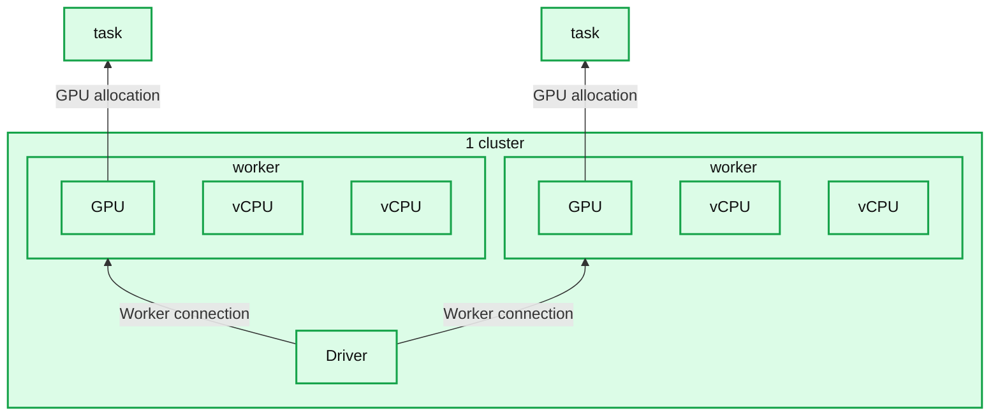
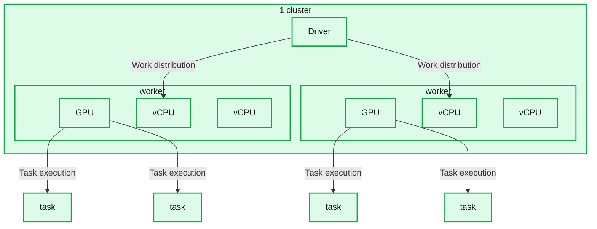
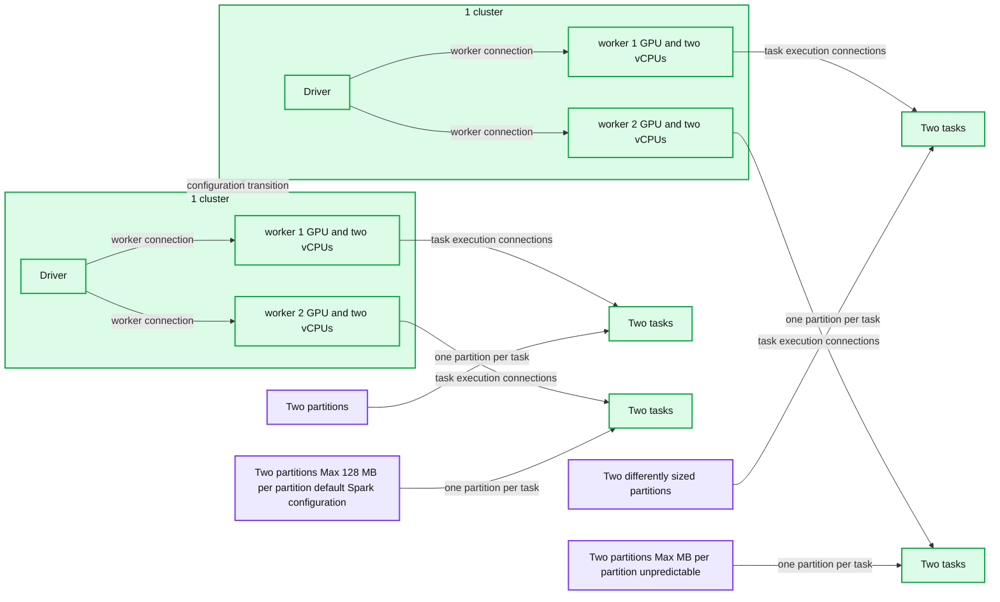
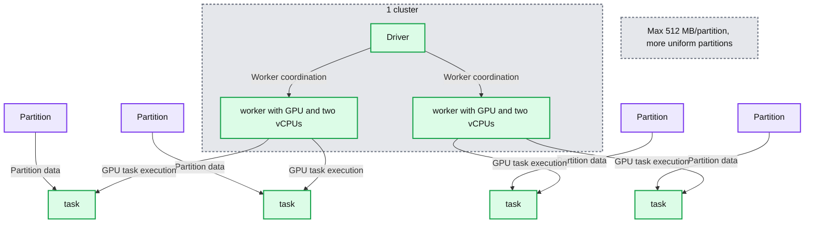

# Logically: Turbocharging GPU Inference with Databricks

- Source: https://www.databricks.com/blog/turbocharging-gpu-inference-logically-ai
- Published: 2024-10-22
- Authors: David Fodor (Logically AI), Neeraj Bhadani (Logically AI), Marc de Fontenay, Maria Zervou
- Categories: databricks-ai, industries, media-and-entertainment, platform, solutions, data-science-machine-learning, company, customers
- Images: 5 total, 5 extracted as architecture

**Key takeaways**

- By leveraging GPU acceleration technologies, ML engineers can significantly reduce training and inference times, allowing for more experimentation, faster iteration, and improved model performance. GPUs are in high demand. The current scarcity of this resource means that optimizing their utilization is key for the overall success of AI projects. This blog explores how Logically achieved improved results through optimizing their GPU resources for model inference.

Founded in 2017, [Logically](https://logically.com/) is a leader in using AI to augment clients’ intelligence capability. By processing and analyzing vast amounts of data from websites, social platforms, and other digital sources, Logically identifies potential risks, emerging threats, and critical narratives, organizing them into actionable insights that cybersecurity teams, product managers, and engagement leaders can act on swiftly and strategically. 

 

GPU acceleration is a key component in Logically’s platform, enabling the detection of narratives to meet the requirements of highly regulated entities. By using GPUs, Logically has been able to significantly reduce training and inference times, allowing for data processing at the scale required to combat the spread of false narratives on social media and the internet more broadly. The current scarcity of GPU resources also means that optimizing their utilization is key for achieving optimal latency and the overall success of AI projects.

 

Logically observed their inference times increasing steadily as their data volumes grew, and therefore had a need to better understand and optimize their cluster usage. Bigger GPU clusters ran models faster but were underutilized. This observation led to the idea of taking advantage of the distribution power of Spark to perform GPU model inference in the most optimal way and to determine whether an alternate configuration was required to unlock a cluster’s full potential.

 

By tuning concurrent tasks per executor and pushing more tasks per GPU, Logically was able to reduce the runtime of their flagship complex models by up to 40%. **This blog explores how.**

 

The key levers used were:

**1. Fractional GPU Allocation:** Controlling the GPU allocation per task when Spark schedules GPU resources allows for splitting it evenly across the tasks on each executor. This allows overlapping I/O and computation for optimal GPU utilization.

The default spark configuration is one task per GPU, as presented below. This means that unless a lot of data is pushed into each task, the GPU will likely be underutilized.

**Summary:** One cluster contains a driver connected to two workers, each with a GPU, two vCPUs, and one associated task.

**Components:**
- 1 cluster: contains the driver and both workers.
- Driver: coordinating compute component; technology unspecified.
- Left worker: compute component containing one GPU and two vCPUs.
- Right worker: compute component containing one GPU and two vCPUs.
- Left GPU: graphics processing resource within the left worker.
- Right GPU: graphics processing resource within the right worker.
- Four vCPU labels: two virtual CPU resources per worker.
- Two task labels: one task above each worker.

**Flows:**
- Driver -> Left worker: connection to worker resources; payload unspecified.
- Driver -> Right worker: connection to worker resources; payload unspecified.
- Left GPU -> Left task: GPU-to-task association.
- Right GPU -> Right task: GPU-to-task association.

**Numbers:** `1 cluster`.

source image: https://www.databricks.com/sites/default/files/inline-images/Figure1_1.png?v=1729632660

By setting `spark.task.resource.gpu.amount` to values below `1`, such as `0.5` or `0.25`, Logically achieved a better distribution of each GPU across tasks. The largest improvements were seen by experimenting with this setting. By reducing the value of this configuration, more tasks can run in parallel on each GPU, allowing the inference job to finish faster.

**Summary:** One cluster contains a driver connected to two workers, each with one GPU, two vCPUs, and connections to two tasks.

**Components:**
- 1 cluster: boundary containing the driver and both workers.
- Driver: coordinating compute component; technology unspecified.
- Left worker: compute component containing one GPU and two vCPUs.
- Right worker: compute component containing one GPU and two vCPUs.
- GPU, one per worker: graphics processing resource.
- vCPU, two per worker: virtual CPU resources.
- task, four boxes: execution tasks, two connected to each worker GPU.

**Flows:**
- Driver -> Left worker: work distribution; arrow enters the vCPU area.
- Driver -> Right worker: work distribution; arrow enters the vCPU area.
- Left GPU -> Left task 1: task execution connection.
- Left GPU -> Left task 2: task execution connection.
- Right GPU -> Right task 1: task execution connection.
- Right GPU -> Right task 2: task execution connection.

**Numbers:** `1 cluster`. No other numeric values or units are visible.

source image: https://www.databricks.com/sites/default/files/inline-images/Figure2_1.png?v=1729632660

Experimenting with this configuration is a good initial step and often has the most impact with the least tweaking. In the following configurations, we will go a bit deeper into how Spark works and the configurations we tweaked.

 

**2. Concurrent Task Execution**: Ensuring that the cluster runs more than one concurrent task per executor enables better parallelization.

 

In standalone mode, if `spark.executor.cores` is not explicitly set, each executor will use all available cores on the worker node, preventing an even distribution of GPU resources.

 

The `spark.executor.cores` setting can be set to correspond to the `spark.task.resource.gpu.amount` setting. For instance, `spark.executor.cores=2` allows two tasks to run on each executor. Given a GPU resource splitting of `spark.task.resource.gpu.amount=0.`5, these two concurrent tasks would run on the same GPU. 

 

Logically achieved optimal results by running one executor per GPU and evenly distributing the cores among the executors. For instance, a cluster with 24 cores and four GPUs would run with six cores (`--conf spark.executor.cores=6`) per executor. This controls the number of tasks that Spark puts on an executor at once.

**Summary:** Two Spark cluster configurations show partition sizing changing from a default maximum of 128 MB per partition to unpredictable maximum sizes, with tasks connected to GPU workers.

**Components:**
- Partition: four Spark data partitions on each side, uniformly sized on the left and differently sized on the right.
- task: four Spark tasks on each side, each connected to one partition.
- 1 cluster: one cluster enclosure on each side.
- worker: two compute workers per cluster.
- GPU: one GPU shown within each worker.
- vCPU: two virtual CPU labels within each worker.
- Driver: one Spark driver per cluster.
- Left sizing annotation: maximum 128 MB per partition under the default Spark configuration.
- Right sizing annotation: unpredictable maximum MB per partition.

**Flows:**
- Left Driver -> Left worker 1: driver connection to worker.
- Left Driver -> Left worker 2: driver connection to worker.
- Left worker 1 -> Left task 1: task execution connection.
- Left worker 1 -> Left task 2: task execution connection.
- Left worker 2 -> Left task 3: task execution connection.
- Left worker 2 -> Left task 4: task execution connection.
- Left partition 1 -> Left task 1: partition data.
- Left partition 2 -> Left task 2: partition data.
- Left partition 3 -> Left task 3: partition data.
- Left partition 4 -> Left task 4: partition data.
- Left cluster -> Right cluster: configuration transition.
- Right Driver -> Right worker 1: driver connection to worker.
- Right Driver -> Right worker 2: driver connection to worker.
- Right worker 1 -> Right task 1: task execution connection.
- Right worker 1 -> Right task 2: task execution connection.
- Right worker 2 -> Right task 3: task execution connection.
- Right worker 2 -> Right task 4: task execution connection.
- Right partition 1 -> Right task 1: partition data.
- Right partition 2 -> Right task 2: partition data.
- Right partition 3 -> Right task 3: partition data.
- Right partition 4 -> Right task 4: partition data.

**Numbers:**
- `128 MB/partition`: default Spark maximum partition size on the left.
- `1 cluster`: appears once on each side.
- `MB/partition`: right-side maximum is labeled unpredictable, with no numeric value.

source image: https://www.databricks.com/sites/default/files/inline-images/Figure3_3.png?v=1729654037

**3. Coalesce**:  Merging existing partitions into a smaller number reduces the overhead of managing a large number of partitions and allows for more data to fit into each partition. The relevance of `coalesce()` to GPUs revolves around **data distribution and optimization** for efficient GPU utilization. GPUs excel at processing large datasets due to their highly parallel architecture, which can execute many operations simultaneously. For efficient GPU utilization, we need to understand the following:

1. **Larger partitions** of data are often better because GPUs can handle massive parallel workloads. Larger partitions also lead to better GPU memory utilization, as long as they fit into the available GPU memory. If this limit is exceeded, you may run into OOMs.
2. **Under-utilized GPUs** (due to small partitions or small workloads, for simple reads, Spark aims for a partition size of 128MB) may lead to inefficiencies, with many GPU cores remaining idle.

In these cases, `coalesce() `can help by **reducing the number of partitions**, ensuring that each partition contains **more data**, which is often preferable for GPU processing. Larger data chunks per partition mean that the GPU can be better utilized, leveraging its parallel cores to process more data at once.

 

Coalesce combines existing partitions to create a smaller number of partitions, which can improve performance and resource utilization in certain scenarios. When possible, partitions are merged locally within an executor, avoiding a full shuffle of data across the cluster.

 

It is worth noting that coalesce does not guarantee balanced partitions, which may lead to skewed data distribution. In case you know that your data contains skew, then `repartition()` is preferred, as it performs a** full shuffle** that redistributes the data evenly across partitions. If repartition() works better for your use case, make sure you turn Adaprite Query Execution (AQE) off with the setting `spark.conf.set("spark.databricks.optimizer.adaptive.enabled","false)`. AQE can [dynamically coalesce partitions](https://docs.databricks.com/en/optimizations/aqe.html#dynamically-coalesce-partitions) which may interfere with the optimal partition we are trying to achieve with this exercise.

 

By controlling the number of partitions, the Logically team was able to push more data into each partition. Setting the number of partitions to a multiple of the number of GPUs available resulted in better GPU utilization.

 

Logically experimented with `coalesce(8)`, `coalesce(16)`, `coalesce(32)` and `coalesce(64)` and achieved optimal results with `coalesce(64)`.

*Table 1: Results of experiments executed by the Logically ML engineering team.*

**Summary:** Seven W2 configurations compare runtimes, with GPU amount 0.25 and coalesce 64 achieving the lowest runtime at 613.9550433158875 seconds.

**Components:**
- W2, base config: baseline configuration.
- W2, spark.task.resource.gpu.amount 0.25: Spark GPU resource configuration.
- W2, spark.task.resource.gpu.amount 0.25, spark.executor.cores 8: Spark GPU and executor core configuration.
- W2, spark.task.resource.gpu.amount 0.25, coalesce(8): Spark GPU and partition configuration.
- W2, spark.task.resource.gpu.amount 0.25, coalesce(16): Spark GPU and partition configuration.
- W2, spark.task.resource.gpu.amount 0.25, coalesce(32): Spark GPU and partition configuration.
- W2, spark.task.resource.gpu.amount 0.25, coalesce(64): Spark GPU and partition configuration, highlighted as fastest.
- Runtime: execution duration in seconds.

**Flows:**
- none. No arrows are visible.

**Numbers:**

| Config | Runtime |
|---|---:|
| W2, base config | 1010.7826244831085 seconds |
| W2, spark.task.resource.gpu.amount 0.25 | 662.9956719875336 seconds |
| W2, spark.task.resource.gpu.amount 0.25, spark.executor.cores 8 | 683.4369065761566 seconds |
| W2, spark.task.resource.gpu.amount 0.25, coalesce(8) | 925.2078623771667 seconds |
| W2, spark.task.resource.gpu.amount 0.25, coalesce(16) | 703.8416059017181 seconds |
| W2, spark.task.resource.gpu.amount 0.25, coalesce(32) | 644.4669740200043 seconds |
| W2, spark.task.resource.gpu.amount 0.25, coalesce(64) | 613.9550433158875 seconds |

```mermaid
%% W2 Spark configurations and their measured runtimes
flowchart TD
    A["W2, base config<br/>Runtime: 1010.7826244831085 seconds"]
    B["W2, spark.task.resource.gpu.amount 0.25<br/>Runtime: 662.9956719875336 seconds"]
    C["W2, spark.task.resource.gpu.amount 0.25, spark.executor.cores 8<br/>Runtime: 683.4369065761566 seconds"]
    D["W2, spark.task.resource.gpu.amount 0.25, coalesce 8<br/>Runtime: 925.2078623771667 seconds"]
    E["W2, spark.task.resource.gpu.amount 0.25, coalesce 16<br/>Runtime: 703.8416059017181 seconds"]
    F["W2, spark.task.resource.gpu.amount 0.25, coalesce 32<br/>Runtime: 644.4669740200043 seconds"]
    G["W2, spark.task.resource.gpu.amount 0.25, coalesce 64<br/>Runtime: 613.9550433158875 seconds"]

    classDef client fill:#dbeafe,stroke:#2563eb,stroke-width:2px,color:#111
    classDef service fill:#dcfce7,stroke:#16a34a,stroke-width:2px,color:#111
    classDef store fill:#ede9fe,stroke:#7c3aed,stroke-width:2px,color:#111
    classDef cache fill:#fef3c7,stroke:#d97706,stroke-width:2px,color:#111
    classDef queue fill:#cffafe,stroke:#0891b2,stroke-width:2px,color:#111
    classDef critical fill:#fee2e2,stroke:#dc2626,stroke-width:4px,color:#111
    classDef external fill:#e5e7eb,stroke:#6b7280,stroke-width:2px,color:#111,stroke-dasharray:4 3
    classDef decision fill:#fce7f3,stroke:#db2777,stroke-width:2px,color:#111
    class A,B,C,D,E,F external
    class G service
```

source image: https://www.databricks.com/sites/default/files/inline-images/Table1_0.png?v=1729654458

Table 1: Results of experiments executed by the Logically ML engineering team.

From the above experiments, we understood that there is a balance between how big or small the partitions should be in terms of size to achieve better GPU utilization. So, we tested the `maxPartitionBytes` configuration, aiming to create bigger partitions from the start instead of having to create them later on with `coalesce()` or `repartition()`.

`maxPartitionBytes` is a parameter that determines the **maximum size of each partition** in memory when **data is read from a file.** By default, this parameter is typically set to **128MB**, but in our case, we set it to **512MB aiming for bigger partitions**. This prevents Spark from creating excessively large partitions that could overwhelm the memory of an executor or GPU. The idea is to have **manageable partition sizes** that fit into available memory without causing performance degradation due to excessive disk spilling or memory errors.

**Summary:** One cluster contains a driver and two GPU workers serving four tasks, each associated with a partition capped at 512 MB.

**Components:**
- Driver: cluster driver; technology not specified.
- Two workers: each contains one GPU and two vCPU blocks.
- Two GPU blocks: GPU compute within the workers.
- Four vCPU blocks: virtual CPU resources within the workers.
- Four task blocks: execution tasks; technology not specified.
- Four Partition blocks: data partitions; storage technology not specified.
- 1 cluster: boundary containing the driver and workers.
- Partition annotation: “Max 512 MB/partition, more uniform partitions.”

**Flows:**
- Driver -> Left worker: worker coordination; payload unspecified.
- Driver -> Right worker: worker coordination; payload unspecified.
- Left GPU -> Task 1: task execution.
- Left GPU -> Task 2: task execution.
- Right GPU -> Task 3: task execution.
- Right GPU -> Task 4: task execution.
- Partition 1 -> Task 1: partition data.
- Partition 2 -> Task 2: partition data.
- Partition 3 -> Task 3: partition data.
- Partition 4 -> Task 4: partition data.

**Numbers:**
- 1 cluster.
- Max 512 MB/partition.

source image: https://www.databricks.com/sites/default/files/inline-images/Figure4_2.png?v=1729654458

These experimentations have opened the door to further optimizations across the Logically platform. This includes leveraging Ray to create distributed applications while benefiting from the breadth of the Databricks ecosystem, enhancing data processing and machine learning workflows. Ray can help maximize the parallelism of the GPU resources even further, for example through its built-in GPU auto scaling capabilities and GPU utilization monitoring. This represents an opportunity to increase value from GPU acceleration, which is key to Logically’s continued mission of protecting institutions from the spread of harmful narratives.

 

*This blog post was jointly authored by David Fodor (Logically AI), [Neeraj Bhadani (Logically AI)](https://www.linkedin.com/in/neerajbhadani/), [Marc de Fontenay](https://www.databricks.com/blog/author/marc-de-fontenay)[(Databricks)](https://www.linkedin.com/in/marcdefontenay/) and [Maria Zervou](https://www.databricks.com/blog/author/maria-zervou)[(Databricks)](https://www.linkedin.com/in/maria-zervou-533222107/).*

 

**For more information:**

- [Explore our GPU-enabled compute best practices for AI and ML](https://docs.databricks.com/en/compute/gpu.html#gpu-scheduling-for-ai-and-ml)
- [What is Ray on Databricks?](https://docs.databricks.com/en/machine-learning/ray/index.html)
