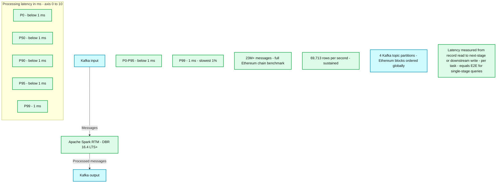
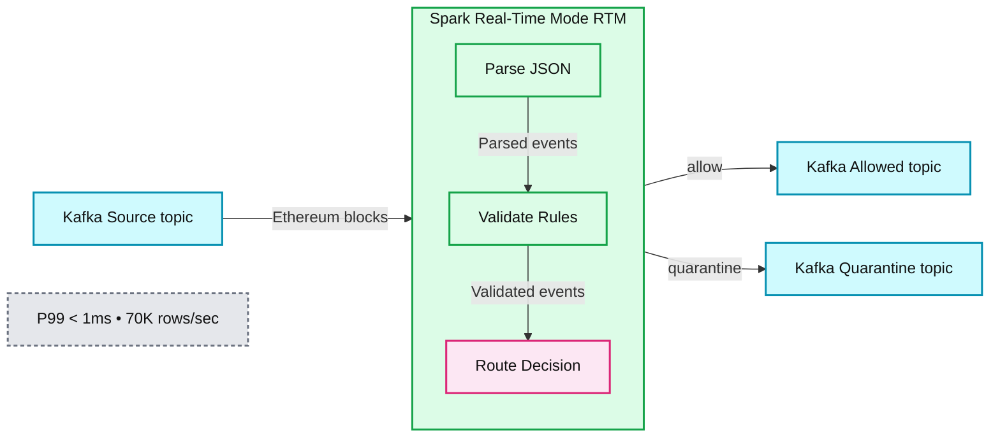

# Ultra-Fast Anomaly Detection using Apache Spark Real-Time Mode

*Implementing rule-based detection at scale*

- Source: https://www.databricks.com/blog/ultra-fast-anomaly-detection-using-apache-spark-real-time-mode
- Published: 2026-07-13
- Authors: Jitesh Soni
- Categories: data-engineering
- Images: 2 total, 2 extracted as architecture

This post establishes a reusable pattern for operational workloads that genuinely move the needle: fraud detection, IoT sensor monitoring, real-time personalization, security signal processing—any scenario where immediate response to events is critical for business outcomes.

The core objective: **When an event appears suspicious or invalid, flag it immediately and route it for appropriate downstream action.**

In this blog, we demonstrate anomaly detection on Ethereum blockchain transactions. We analyze Ethereum blockchain data and flag transactions with invalid patterns in real-time. Specifically, we detect:

1. **Data quality violations: **Blocks where `gas_used > gas_limit`* *are physically impossible under the Ethereum protocol, indicating data corruption, producer bugs, or schema parsing failures
2. **Payload hygiene violations: **The `extra_data` field containing recognizable PII or credential patterns (email addresses, JWT tokens, AWS access keys) signals data leakage or misconfigured producers

While we use Ethereum data for demonstration, this "suspicious or invalid" classification applies across numerous high-value use cases:

- **Fraud detection: **A transaction exhibits anomalous patterns → trigger downstream investigation workflows
- **IoT monitoring:** A sensor reading falls outside physically possible parameters → initiate automated response
- **Security operations:** Payload contains secrets or PII patterns → quarantine in real time with unified governance
- **Personalization engines: **Respond to specific behavioral events with immediate, contextual offers

The same detection logic maps directly onto any domain: financial transactions carrying unexpected PII, IoT payloads with out-of-range sensor readings, or API event logs containing secrets that should have been redacted. The Ethereum stream provides a clean, reproducible dataset to demonstrate the pattern at scale.

## About Spark Real-Time Mode

[Real-Time Mode (RTM)](https://docs.databricks.com/aws/en/structured-streaming/real-time/concepts) is a new trigger type for Apache Spark™ Structured Streaming that delivers millisecond-level latency to Spark APIs — [without a separate, specialized engine like Apache Flink](https://www.databricks.com/blog/real-time-mode-ultra-low-latency-streaming-spark-apis-without-second-engine).

While Structured Streaming's default microbatch mode operates like an airport shuttle bus that waits to fill up before departing, RTM operates like a high-speed moving walkway, processing each event as it arrives. It achieves this through three architectural innovations: **continuous data flow **(events are processed as they arrive, not in discrete chunks), **pipeline scheduling** (all query stages run simultaneously, with no blocking), and **streaming shuffle** (data is passed between tasks immediately in memory, bypassing disk).

RTM is purpose-built for operational workloads where latency directly impacts business outcomes — fraud detection, real-time personalization, ML feature computation, and IoT monitoring. For workloads that can tolerate 1–2 seconds of latency, traditional microbatch remains the more cost-effective choice.

*For this anomaly detection pipeline, Real-Time Mode enables immediate flagging and routing of suspicious events—exactly the response time these use cases demand.*

**Summary:** Apache Spark Real-Time Mode processes 23M+ Ethereum messages at 69,713 rows per second, with processing latency below 1 ms through P95 and 1 ms at P99.

**Components:**

- Kafka input: Apache Kafka topics carrying Ethereum blocks.
- Spark RTM: Apache Spark Real-Time Mode running on DBR 16.4 LTS+.
- Kafka output: Apache Kafka downstream destination.
- Latency chart: Spark RTM processing latency at P0, P50, P90, P95, and P99.
- Latency badges: P0-P95 below 1 ms and P99 equal to 1 ms.
- Volume metric: 23M+ messages processed in a full Ethereum chain benchmark.
- Throughput metric: Sustained processing rate of 69,713 rows per second.
- Partition metric: 4 Kafka topic partitions, with Ethereum blocks ordered globally.
- Processing latency definition: Time from reading a record to writing it to the next stage or downstream, reported per task. For single-stage queries, this equals E2E latency.

**Flows:**

- Kafka input -> Spark RTM: Messages for processing.
- Spark RTM -> Kafka output: Processed messages.

**Numbers:**

- Subtitle volume: 23M messages.
- Runtime: DBR 16.4 LTS+.
- P0: < 1 ms.
- P50: < 1 ms.
- P90: < 1 ms.
- P95: < 1 ms.
- P99: 1 ms.
- Processing latency axis: 0, 1, 2, 3, 4, 5, 6, 7, 8, 9, 10 ms.
- Upper badge: P0-P95, < 1 ms; exact value below 1 ms.
- Lower badge: P99, = 1 ms; slowest 1%.
- Messages processed: 23M+.
- Sustained processing rate: 69,713 rows / second.
- Kafka topics: 4 partitions.

source image: https://www.databricks.com/sites/default/files/inline-images/image_169.png

For this anomaly detection pipeline, Real-Time Mode enables immediate flagging and routing of suspicious events—exactly the response time these use cases demand.

## Why RTM is a Game Changer

### 1. Ultra-Fast: Sub-Second Latency Now Achievable

Real-Time Mode fundamentally changes what's possible with Apache Spark. End-to-end latencies **ranging from ~5ms to ~300ms, depending on workload complexity,** bring Spark into the territory previously dominated by specialized stream processing engines. Traditional micro-batch delivers 1–2 second latency; Real-Time Mode achieves ~5ms to ~300ms.
The architecture achieves this through pre-allocated execution pipelines and asynchronous checkpointing, eliminating the scheduling overhead that traditionally constrained micro-batch processing. For operational workloads where milliseconds matter—fraud detection, IoT monitoring, real-time offers—this level of performance is transformative.

### 2. Simplified Stack: No Separate Technology Required

Organizations frequently encounter a costly misconception: "Spark isn't performant enough for real-time use cases, so we need an entirely separate stack for this one requirement."

For workloads tolerating 1–2 seconds of latency, Spark micro-batch reliably delivers data into Delta Lake with strong price/performance characteristics. For operational workloads demanding sub-second response times, Real-Time Mode eliminates the need for separate technologies entirely — as validated by teams at [Coinbase](https://www.databricks.com/customers/coinbase/lakeflow), [DraftKings](https://www.databricks.com/blog/announcing-general-availability-real-time-mode-apache-spark-structured-streaming-databricks), and [MakeMyTrip](https://www.databricks.com/blog/how-makemytrip-achieved-millisecond-personalization-scale-databricks) who consolidated onto a single Spark-based stack for both analytical and operational workloads.

With Real-Time Mode, Spark handles both analytical (second-range) and operational (millisecond-range) workloads within a single, unified platform. This reduces:

- **Operational complexity:** One technology stack to manage, monitor, and troubleshoot
- **Training overhead: **Existing Spark expertise transfers directly to real-time use cases
- **Integration friction: **No complex handoffs between separate streaming engines
- **Total cost of ownership: **Consolidation reduces infrastructure, licensing, and operational costs

### 3. Developer-Friendly: Simple Trigger Change, No Code Rewrites

Perhaps the most compelling aspect of Real-Time Mode is its remarkable simplicity for developers already familiar with Structured Streaming. Enabling this powerful capability requires no **complex migration or fundamental code restructuring.**

Organizations can unlock millisecond-level latency by simply modifying the trigger configuration:

That's it. The same familiar Structured Streaming API. The same checkpoint management. The same at-least-once delivery semantics. Just **one configuration change** to enable sub-second operational intelligence.

**Note on Delivery Guarantees:** RTM with Kafka sink provides at-least-once delivery guarantees. Downstream consumers should handle potential duplicates via idempotent writes or deduplication logic.

This seamless integration represents a critical advantage. Teams can prototype and productionize operational workloads without the substantial overhead of learning, deploying, and managing entirely separate technology stacks. This approach dramatically accelerates innovation while reducing the risk traditionally associated with adopting new real-time capabilities.

Having established why Real-Time Mode matters, let's examine how to implement this pattern in practice. The following sections demonstrate a production-ready guardrail pipeline—the operational pattern that turns these capabilities into business value.

## Architecture Overview: Building an Operational Guardrail Stream

**Summary:** Spark Real-Time Mode parses Ethereum block events from Kafka, validates rules, and routes decisions to allowed or quarantine Kafka topics.

**Components:**

- Kafka Source topic: Apache Kafka input stream.
- Ethereum blocks: incoming event payload.
- Spark Real-Time Mode RTM: Apache Spark processing boundary.
- Parse JSON: JSON parsing within Spark RTM.
- Validate Rules: rule validation within Spark RTM.
- Route Decision: routing within Spark RTM.
- Kafka Allowed topic: Apache Kafka destination for allowed events.
- Kafka Quarantine topic: Apache Kafka destination for quarantined events.

**Flows:**

- Kafka Source topic -> Spark RTM: Ethereum blocks.
- Parse JSON -> Validate Rules: parsed events.
- Validate Rules -> Route Decision: validated events.
- Spark RTM -> Kafka Allowed topic: allow.
- Spark RTM -> Kafka Quarantine topic: quarantine.

**Numbers:**

- P99 < 1 ms.
- 70K rows/sec.

source image: https://www.databricks.com/sites/default/files/inline-images/image_170.png

Every incoming event undergoes immediate evaluation, producing an enriched downstream event containing:

- **Decision: **`ALLOW` versus `QUARANTINE`
- **Reasons: **Detailed explanation of any flags triggered (data quality violations, payload hygiene concerns)

This operational pattern serves as a single source of truth for real-time decision-making:

- Should this event be quarantined for investigation?
- How do we enrich events so downstream systems can react instantly?

While our demonstration uses Ethereum block data, this pattern applies universally: financial transactions, sensor readings, authentication logs, API calls—the architecture remains consistent.

### Validation at Scale

True to our commitment to production-quality solutions, we validated this pattern at scale. The complete Ethereum chain—approximately **95 GB** distributed across **4 partitions**, representing roughly **23 million messages**—was loaded into Kafka for testing.

## Defining Validation Rules for Event Classification

We implement intentionally straightforward, high-signal validation rules:

### Rule 1: Payload Hygiene Validation

Scan the `extra_data` field for patterns that clearly indicate data that shouldn't be present in production streams. The code examples demonstrate basic pattern detection (email addresses, JWT tokens, AWS key formats).

Organizations should replace these with rules specific to their compliance requirements—PII patterns, internal identifiers, API credentials, and similar sensitive data.

**The critical insight: **Real-time guardrails belong in the pipeline as part of unified governance, not discovered during post-incident analysis.

### Rule 2: Data Quality Validation

`gas_used > gas_limit`

This condition should never occur in valid data. When detected, it indicates one of several issues:

- Data corruption during transmission
- Producer-side data generation errors
- Schema parsing inconsistencies
- Upstream system failures

From an operational perspective, this is precisely the type of anomaly we want to flag immediately—enabling rapid response before downstream systems are affected.

With our validation logic established, we now turn to the streaming configuration that enables sub-second execution.

## Real-Time Mode: Essential Configuration

Real-Time Mode is enabled through the real-time trigger and operates in update mode. In PySpark, you specify an interval parameter (e.g., `"5 minutes"`).

### Two Critical Configuration Requirements:

1. **Cluster configuration: **Databricks documentation specifies the required job cluster settings and the RTM enablement flag
2. **Output mode: **Must use `update` mode with RTM triggers

Configuration used in this demo:

- Runtime: Databricks Runtime 16.4 LTS or later
- Compute: Dedicated (single-user) cluster with fixed worker count (autoscaling disabled)
- Photon: Disabled (not supported with RTM)
- Workers: 4 workers for this workload
- Output mode: update (required for RTM)

See the companion repository for the complete cluster_config.template.json.

## Implementation: Real-Time Guardrail Pipeline

This single-pass pipeline demonstrates seamless integration between Kafka and Spark Real-Time Mode:

1. Connect to the Kafka source
2. Parse incoming JSON payloads
3. Compute the decision and the reasons
4. Write enriched JSON back to Kafka

You can read the code [here](https://github.com/databricks-solutions/databricks-blogposts/tree/main/2026-04-rtm-sub-second-latency). 

## Results: Performance at Scale

We validated Real-Time Mode performance by processing Ethereum blockchain data—**~23 million messages** distributed over **4 Kafka partitions** in continuous streaming mode.

### Throughput Performance

The pipeline demonstrated impressive throughput characteristics:

- **Input rate: **65,592 rows/second
- **Processing rate: **69,713 rows/second (sustained)
- **Total records processed:** ~23,213,628 messages
- **Cluster configuration:** DBR 16.4 LTS, 4 workers (i3.xlarge), dedicated single-user mode, Photon disabled

### Latency Metrics

Driver logs capture detailed latency metrics via the `spark.streaming.madeProgress` event. Real-Time Mode reports `processingLatencyMs`, which measures the time between when the query reads a record and when it writes it to the downstream sink.

For this stateless validation pipeline processing ~23 million records, we observed:

- **P0, P50, P90, P95: **< 1 milliseconds (rounds to 0 in metrics) P99: 1 millisecond Processing Rate: 69,713 rows/second sustained
- **Understanding processingLatencyMs:** This metric measures the time between RTM reading a record and writing it to the downstream sink. It's measured per task and reported in the `rtmMetrics.processingLatencyMs` section of `StreamingQueryProgress` with percentiles (P0, P50, P90, P95, P99). For a single-stage Kafka-to-Kafka pipeline like this, it effectively represents end-to-end per-record latency.
- **What This Means: **The vast majority of records (95th percentile) were processed in under half a millisecond, with even the slowest 1% completing within 1 millisecond. The values showing "0" for P0-P95 indicate latencies under 0.5ms (rounded down by the metrics system).

*Note: These results represent performance on a stateless validation pipeline. More complex stateful operations (aggregations, windowing) may see higher latencies within the ~5ms to ~300ms RTM range, depending on workload complexity.*

### Key Performance Insights

- **Interpretation: **99% of all records were processed in under 1 millisecond, with only the slowest 1% reaching 1 millisecond. This demonstrates exceptionally consistent low-latency performance.
- **Throughput: **The pipeline sustained 69,713 rows/second while processing ~23 million records, demonstrating stable performance under continuous load.

These metrics validate that Real-Time Mode delivers production-grade sub-millisecond latency (P95 < 0.5ms, P99 = 1ms) while processing high-volume streams at nearly 70,000 rows/second—eliminating the traditional trade-off between unified platforms and low-latency requirements.

## Conclusion

Real-Time Mode extends Apache Spark™ Structured Streaming into a new class of workloads — operational, latency-sensitive applications that demand immediate response to streaming data. By bringing sub-second latency to the Spark APIs your team already uses, it eliminates the need to operate a separate specialized engine for your most time-critical pipelines.

The value proposition is compelling:

- **One unified platform **handles both analytical (second-range) and operational (millisecond-range) workloads
- **Existing Spark expertise **transfers directly — no separate specialization required
- **Minimal migration risk **— a single trigger configuration change unlocks real-time capabilities
- **Production-validated performance** — P99 latencies of 1ms with P95 under 0.5ms processing millions of events

Whether you're building fraud detection pipelines, personalization engines, or ML feature computation systems, Real-Time Mode delivers the latency your application demands while maintaining Spark's simplicity and ecosystem breadth.

### Get Started

Clone the [companion repository](https://github.com/databricks-solutions/databricks-blogposts/tree/main/2026-04-rtm-sub-second-latency) to run this guardrail pipeline end-to-end — it includes the full implementation, cluster configuration, and deployment guide. 

To go deeper, review the [Real-Time Mode documentation](https://docs.databricks.com/aws/en/structured-streaming/real-time) for configuration options and supported sources/sinks, or watch the [Real-Time Mode Technical Deep Dive](https://www.youtube.com/watch?v=sgUIcWwE8aQ&t=473s) for the full architecture walkthrough.

## Resources

- [Real-Time Mode Technical Deep Dive: How We Built Sub-300 Millisecond Streaming Into Apache Spark™](https://www.youtube.com/watch?v=sgUIcWwE8aQ&t=473s)
- [Delivering Sub-Second Latency for Operational Workloads on Databricks](https://www.youtube.com/watch?v=zGJvbV80FdU&t=1376s)
- [Databricks Real-Time Mode Documentation](https://docs.databricks.com/structured-streaming/real-time.html)
- [Companion Code Repository - Real-Time Mode Guardrail Demo](https://github.com/databricks-solutions/databricks-blogposts/tree/main/2026-04-rtm-sub-second-latency) - Production-ready implementation with comprehensive test suite, cluster configuration, and deployment guide
