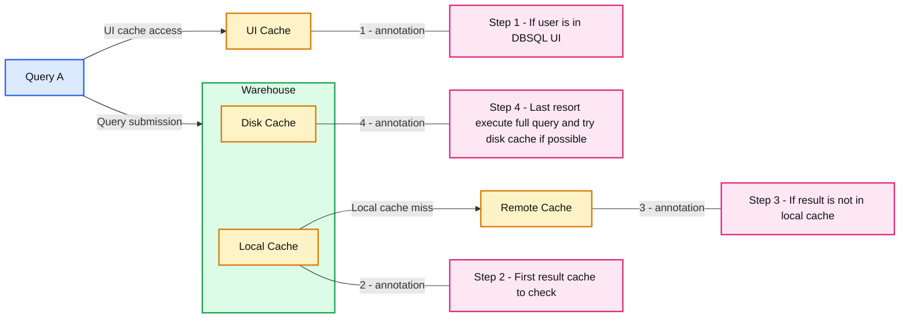

# Understanding Caching in Databricks SQL: UI, Result, and Disk Caches

- Source: https://www.databricks.com/blog/understanding-caching-databricks-sql-ui-result-and-disk-caches
- Published: 2023-05-04
- Authors: Jeremy Lewallen, Chris Stevens, Bogdan Ionut Ghit, Patrick Yang
- Categories: data-warehousing
- Images: 1 total, 1 extracted as architecture

Caching is an essential technique for improving the performance of data warehouse systems by avoiding the need to recompute or fetch the same data multiple times. In Databricks SQL, caching can significantly speed up query execution and minimize warehouse usage, resulting in lower costs and more efficient resource utilization.

This article will explore the benefits of caching and delve into DBSQL's three types of caching: User Interface Cache, Result Cache (Local and Remote), and Disk Cache (formerly Delta Cache).

## The Benefits of Caching

Caching provides numerous advantages in data warehouses, including:

1. **Speed:** By storing query results or frequently accessed data in memory or other fast storage mediums, caching can dramatically reduce query execution times. This storage is particularly beneficial for repetitive queries, as the system can quickly retrieve the cached results instead of recomputing them.
2. **Reduced Cluster Usage:** Caching minimizes the need for additional compute resources by reusing previously computed results. Reducing the overall warehouse uptime and the demand for additional compute clusters, leading to cost savings and better resource allocation.

## Types of DBSQL Caches

**Summary:** Databricks SQL checks UI, local, and remote caches before executing the full query with disk cache where possible.

**Components:**
- Query A: a Databricks SQL query.
- Warehouse: SQL compute containing Local Cache and Disk Cache.
- UI Cache: cached results for users in the DBSQL UI.
- Local Cache: the first result cache checked within the warehouse.
- Remote Cache: result cache checked if the result is absent from Local Cache.
- Disk Cache: cache used when executing the full query, if possible.
- Step 1: use UI Cache if the user is in DBSQL UI.
- Step 2: check Local Cache first for cached results.
- Step 3: check Remote Cache if the result is not in Local Cache.
- Step 4: execute the full query as a last resort, using Disk Cache if possible.

**Flows:**
- Query A -> Warehouse: query submitted to warehouse.
- Query A -> UI Cache: UI cache access for a user in DBSQL UI.
- Local Cache -> Remote Cache: result lookup following a local cache miss.

**Numbers:** 1, 2, 3, and 4 appear as cache badges and corresponding step labels.

source image: https://www.databricks.com/sites/default/files/inline-images/db-532-blog-img-1.png

1. **Databricks SQL UI Cache**
 The Databricks SQL UI Cache aims to optimize user experience within the Databricks SQL UI by swiftly providing access to the most recent query and dashboard results. When users first open a dashboard or SQL query, the cache displays the most recent query result, reducing strain on compute resources. This leads to faster response times and a more seamless experience in the UI.

 The UI Cache also plays a key role in managing scheduled executions. As a refresh is scheduled, the cache stores the updated data, ensuring that users can immediately access the latest information upon visiting the dashboard. This efficient process further boosts the user experience by making frequently accessed queries and visualizations easily accessible. The cache has at most a 7-day life cycle, and the cache is invalidated once the underlying tables have been updated.
2. **Result Cache**
 Result caching includes both Local and Remote Result Caches, which work together to improve query performance by storing query results in memory or remote storage mediums.
  - Local Cache
 The local cache is an in-memory cache that stores query results for the cluster's lifetime, or when the cache is full, whichever comes first. This cache is useful for speeding up repetitive queries, eliminating the need to recompute the same results. However, once the cluster is stopped or restarted, the cache is cleaned, and all query results are removed.
  - Remote Result Cache ****NEW in Q1 2023****
 The Remote Result Cache is a serverless-only cache system that retains query results by persisting them in cloud storage. Remote Result Cache addresses a common pain point in caching query results in-memory, which only remains available as long as the compute resources are running. The remote cache is a persistent shared cache across all warehouses in a Databricks workspace.

 Accessing the remote cache requires a running warehouse. When processing a query, a cluster will first look in its local cache and then look in the remote cache if necessary. Only if the query result isn't cached in either will it be executed.

 Remote result cache is available for queries using ODBC / JDBC clients and SQL Statement API *(more coming soon)*.

 For both Local and Remote caches, once the underlying tables have been updated, the cache is invalidated. Otherwise, the Local & Remote Cache has a max life cycle of 24 hours, which starts at cache entry.
3. **Disk cache, previously known as Delta cache**
 The Disk Cache is designed to enhance query performance by storing data on disk, allowing for accelerated data reads. Data is automatically cached when files are fetched, utilizing a fast intermediate format. By storing copies of the files on the local storage attached to compute nodes, the Disk Cache ensures the data is located closer to the workers, resulting in improved query performance.

 In addition to its primary function, the Disk Cache automatically detects changes to the underlying data files, ensuring that the cache remains up to date. However, it is important to note that the Disk Cache shares the same lifecycle characteristics as the Local Result Cache. This means that when the cluster is stopped or restarted, the cache is cleaned and will need to be repopulated.

These caching mechanisms are automatically allocated and managed by Databricks SQL based on the query requirements and available resources. As a user, you do not need to perform manual configurations, but understanding how these caching types work can help you optimize your query performance and resource utilization. The allocation and management of these caches do not directly depend on the warehouse's t-shirt size.

## Conclusion

Caching is a powerful technique that Databricks SQL provides out-of-the-box to boost performance for customers. By offering various caching mechanisms such as UI Cache, Query Result Cache, and Disk Cache, Databricks SQL ensures that users can efficiently access their data and enjoy a seamless experience. The DBSQL team constantly works to improve these caching layers and develop new strategies to enhance query performance, reduce resource consumption, and optimize overall system efficiency for an ever-evolving data landscape.
