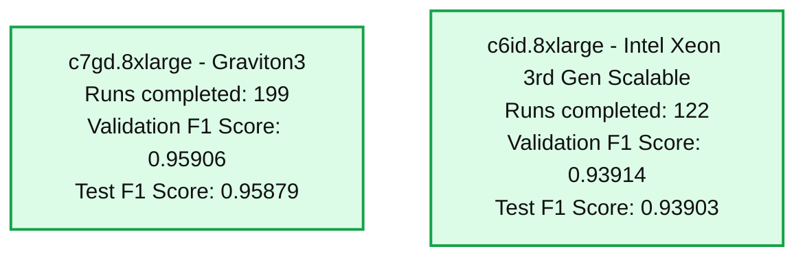
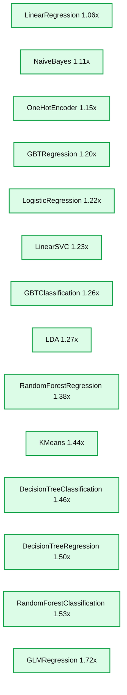
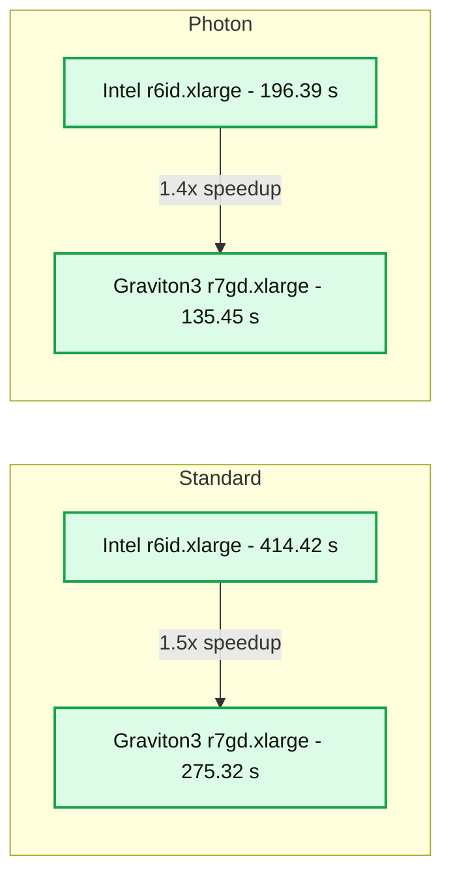

# Unlock Faster Machine Learning with Graviton

*Databricks Machine Learning Runtime now supports Graviton*

- Source: https://www.databricks.com/blog/unlock-faster-machine-learning-graviton
- Published: 2024-08-15
- Authors: Ying Chen, Lu Wang (Databricks), Lin Yuan
- Categories: engineering, data-science-machine-learning, databricks-ai, machine-learning
- Images: 4 total, 3 extracted as architecture

We are excited to announce that [Graviton](https://aws.amazon.com/ec2/graviton/), the ARM-based CPU instance offered by AWS, is now supported on the [Databricks ML Runtime](https://docs.databricks.com/en/machine-learning/index.html#databricks-runtime-for-machine-learning) cluster. There are several ways that Graviton instances provide value for machine learning workloads:

- **Speedups for various machine learning libraries: **ML libraries like XGBoost, LightGBM, Spark MLlib, and Databricks Feature Engineering could see up to 30-50% speedups.
- **Lower cloud vendor cost**: [Graviton instances](https://aws.amazon.com/ec2/graviton/) have lower rates on AWS than their x86 counterparts, making their price performance more appealing.

### **What are the benefits of Graviton for Machine Learning?**

When we compare Graviton3 processors with an x86 counterpart, [3rd Gen Intel® Xeon® Scalable processors](https://ark.intel.com/content/www/us/en/ark/products/series/204098/3rd-gen-intel-xeon-scalable-processors.html), we find that Graviton3 processors accelerate various machine learning applications without compromising model quality. 

- **XGBoost and LightGBM**: Up to 11% speedup when training classifiers for the [Covertype dataset](https://archive.ics.uci.edu/dataset/31/covertype). (1)
-

**Databricks AutoML**: When we launched a Databricks AutoML experiment to find the best hyperparameters for the Covertype dataset, AutoML could run 63% more hyperparameter tuning trials on Graviton3 instances than Intel Xeon instances, because each trial run (using libraries such as XGBoost or LightGBM) completes faster. (2) The higher number of hyperparameter tuning runs can potentially yield better results, as AutoML is able to explore the hyperparameter search space more exhaustively. In our AutoML experiment using the Covertype dataset, after 2 hours of exploration, the experiment on Graviton3 instances could find hyperparameter combinations with a better F1 score.

**Summary:** The benchmark compares completed runs and validation and test F1 scores for Graviton3 and Intel Xeon instances.

**Components:**
- c7gd.8xlarge: Graviton3 instance.
- c6id.8xlarge: Intel Xeon 3rd Gen Scalable instance.
- Runs completed: completed run count.
- Validation F1 Score: validation performance metric.
- Test F1 Score: test performance metric.

**Flows:**
- none

**Numbers:**
- c7gd.8xlarge, Graviton3: 199 runs completed, validation F1 score 0.95906, test F1 score 0.95879.
- c6id.8xlarge, Intel Xeon 3rd Gen Scalable: 122 runs completed, validation F1 score 0.93914, test F1 score 0.93903.

source image: https://www.databricks.com/sites/default/files/inline-images/Graviton_Fig1.png?v=1723683216

 

- **Spark MLlib**: Various algorithms from [Spark MLlib](https://spark.apache.org/mllib/) also run faster on Graviton3 processors, including decision trees, random forests, gradient-boosted trees, and more, with up to 1.7x speedup. (3)

**Summary:** Spark MLlib algorithms achieve approximately 1.06x to 1.72x speedup with Graviton 3.

**Components:**
- LinearRegression: Spark MLlib linear regression.
- NaiveBayes: Spark MLlib naive Bayes.
- OneHotEncoder: Spark MLlib categorical encoding.
- GBTRegression: Spark MLlib gradient-boosted tree regression.
- LogisticRegression: Spark MLlib logistic regression.
- LinearSVC: Spark MLlib linear support vector classification.
- GBTClassification: Spark MLlib gradient-boosted tree classification.
- LDA: Spark MLlib latent Dirichlet allocation.
- RandomForestRegression: Spark MLlib random forest regression.
- KMeans: Spark MLlib clustering.
- DecisionTreeClassification: Spark MLlib decision tree classification.
- DecisionTreeRegression: Spark MLlib decision tree regression.
- RandomForestClassification: Spark MLlib random forest classification.
- GLMRegression: Spark MLlib generalized linear model regression.

**Flows:**
- none. No arrows are shown.

**Numbers:**
- Processor generation: Graviton 3.
- Speedup ratio axis: 0.00, 0.25, 0.50, 0.75, 1.00, 1.25, 1.50, 1.75.
- Dashed baseline: 1.00.
- Approximate bar heights, read from the axis:
  - LinearRegression: 1.06x.
  - NaiveBayes: 1.11x.
  - OneHotEncoder: 1.15x.
  - GBTRegression: 1.20x.
  - LogisticRegression: 1.22x.
  - LinearSVC: 1.23x.
  - GBTClassification: 1.26x.
  - LDA: 1.27x.
  - RandomForestRegression: 1.38x.
  - KMeans: 1.44x.
  - DecisionTreeClassification: 1.46x.
  - DecisionTreeRegression: 1.50x.
  - RandomForestClassification: 1.53x.
  - GLMRegression: 1.72x.

source image: https://www.databricks.com/sites/default/files/inline-images/Graviton_Fig2_1.png?v=1723683216

- **Feature Engineering with Spark**: Spark's faster speed on Graviton3 instances makes time-series feature tables with a Point-in-Time join up to 1.5x faster than with 3rd Gen Intel Xeon Scalable processors.

### What about Photon + Graviton?

As mentioned in the previous [blog post](https://www.databricks.com/blog/accelerate-feature-engineering-photon), Photon accelerates Spark SQL and Spark DataFrames APIs, which is particularly useful for feature engineering. Can we combine the acceleration of Photon and Graviton for Spark? The answer is yes, Graviton provides additional speedup on top of Photon.

The figure below shows the run time of joining a feature table of 100M rows with a label table. (4) Whether or not Photon is enabled, swapping to Graviton3 processors provides up to a 1.5x speedup. Combined with enabling Photon, there is a total of 3.1x improvement when both accelerations are enabled with Databricks [Machine Learning Runtime](https://www.databricks.com/product/machine-learning-runtime).

**Summary:** Feature table join mean run times compare Intel and Graviton3 instances using Standard and Photon runtime engines, showing 1.5x and 1.4x speedups respectively.

**Components:**
- Feature Table Join Performance Comparison: benchmark of mean run time.
- Standard: runtime engine.
- Photon: runtime engine.
- r6id.xlarge: Intel instance, represented by dark bars.
- r7gd.xlarge: Graviton3 instance, represented by orange bars.
- Mean Run Time: vertical axis measured in seconds.
- Runtime Engine: horizontal axis grouping Standard and Photon.

**Flows:**
- Standard Intel -> Standard Graviton3: comparison indicating 1.5x speedup.
- Photon Intel -> Photon Graviton3: comparison indicating 1.4x speedup.

**Numbers:**
- Standard: Intel 414.42 s; Graviton3 275.32 s; 1.5x speedup.
- Photon: Intel 196.39 s; Graviton3 135.45 s; 1.4x speedup.
- Mean Run Time axis ticks: 0, 50, 100, 150, 200, 250, 300, 350, 400 s.
- Instance labels: r6id.xlarge and r7gd.xlarge; processor label: Graviton3.

source image: https://www.databricks.com/sites/default/files/inline-images/Graviton_Fig3.png?v=1723683216

### **Select Machine Learning Runtime with Graviton Instances**

Starting from Databricks Runtime 15.4 LTS ML, you can create a cluster with Graviton instances and Databricks Machine Learning Runtime. Select the runtime version as 15.4 LTS ML or above; to search for Graviton3 instances, type in “7g” in the search box to find instances that have “7g” in the name, such as r7gd, c7gd, and m7gd instances. Graviton2 instances (with “6g” in the instance name) are also supported on Databricks, but Graviton3 is a newer generation of processors and has better performance.

To learn more about Graviton and Databricks Machine Learning Runtime, here are some related documentation pages:

- [Databricks Runtime for Machine Learning](https://docs.databricks.com/en/machine-learning/index.html#databricks-runtime-for-machine-learning)
- [AWS Graviton instance types on Databricks](https://docs.databricks.com/en/compute/configure.html#aws-graviton-instance-types)

Notes:

1. The compared instance types are c7gd.8xlarge with Graviton3 processor, and c6id.8xlarge with 3rd Gen Intel Xeon Scalable processor.
2. Each AutoML experiment is run on a cluster with 2 worker nodes, and timeout set as 2 hours.
3. Each cluster used for comparison has 8 worker nodes. The compared instance types are m7gd.2xlarge (Graviton3) and m6id.2xlarge (3rd Gen Intel Xeon Scalable processors). The dataset has 1M examples and 4k features.
4. The feature table has 100 columns and 100k unique IDs, with 1000 timestamps per ID. The label table has 100k unique IDs, with 100 timestamps per ID. The setup was repeated five times to calculate the average run time.
