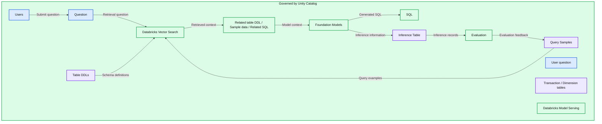

# ICE/NYSE: Unlocking Financial Insights with a Custom Text-to-SQL Application

- Source: https://www.databricks.com/blog/unlocking-financial-insights-nyse-ice
- Published: 2024-10-01
- Authors: Li Yu, Chengyin Eng, Suresh Koppisetti (NYSE/ICE), Meenakshi Venkatasubramanian (NYSE/ICE), Lavanya Mallapragada (NYSE/ICE)
- Categories: engineering, data-science-machine-learning, databricks-ai, industries, financial-services, company, customers
- Images: 6 total, 1 extracted as architecture

**Key takeaways**

- In collaboration with Intercontinental Exchange (ICE), we are breaking new ground by pioneering structured RAG applications that empower business users to effortlessly extract insights from their most valuable asset: structured data (tables). This application eliminates the need for end users to understand data models, schemas, or SQL queries. To achieve this, we leveraged the full stack of Databricks products – Unity Catalog, AI Search, Foundation Model APIs, and Model Serving – implementing the end-to-end lifecycle of RAG with robust evaluation. We adapted the widely recognized Spider evaluation benchmark for state-of-the-art text-to-SQL applications to suit our enterprise use case. By comparing syntax match and execution match metrics between ground truth queries and LLM-generated queries, we can identify incorrect queries for few-shot learning, thereby refining the quality of our SQL query outputs.

## Introduction

Retrieval-augmented generation (RAG) has revolutionized how enterprises harness their unstructured knowledge base using Large Language Models (LLMs), and its potential has far-reaching impacts. [Intercontinental Exchange (ICE)](https://www.ice.com/index) is a global financial organization operating exchanges, clearing houses, data services, and mortgage technology, including the largest stock exchange group in the world, the New York Stock Exchange (NYSE). ICE is breaking new ground by pioneering a seamless solution for natural language search for structured data products by having a structured RAG pipeline without the need for any data movement from the pre-existing application. This solution eliminates the need for end users to understand data models, schemas, or SQL queries.

 

The ICE team collaborated with Databricks engineers to leverage the full stack of Databricks products  ([Unity Catalog](https://www.databricks.com/product/unity-catalog), [AI Search](https://docs.databricks.com/en/generative-ai/vector-search.html), [Foundation Model APIs](https://docs.databricks.com/en/machine-learning/foundation-models/index.html), and [Model Serving](https://docs.databricks.com/en/machine-learning/model-serving/index.html))  and implement an end-to-end RAG lifecycle with robust evaluation. The team adapted the widely recognized [Spider evaluation benchmark](https://yale-lily.github.io/spider) for state-of-the-art text-to-SQL applications to suit their enterprise use case. By comparing syntax match and execution match metrics between ground truth queries and LLM-generated queries, ICE is able to identify incorrect queries for few-shot learning, thereby refining the quality of their SQL query outputs.

 

For the purpose of confidentiality, synthetic data is referenced in the code snippets shown throughout this blog post. 

## Big-Picture Workflow

**Summary:** ICE/NYSE’s text-to-SQL workflow retrieves context through Databricks Vector Search, generates SQL with foundation models, and feeds evaluation results back into query samples under Unity Catalog governance.

**Components:**
- Databricks and NYSE: organization labels at the top.
- Users: people submitting questions.
- Question: input question.
- Vector Search: Databricks retrieval service.
- Table DDLs: schema definitions, accompanied by a blue technology icon with no name.
- Query Samples: example queries, accompanied by the same unnamed blue icon.
- Transaction /Dimension tables: data tables, accompanied by the same unnamed blue icon.
- User question: question included in the model input.
- Related table DDL / Sample data / Related SQL: retrieved model context.
- Foundation Models: models generating SQL.
- Model Serving: Databricks model hosting.
- SQL: generated output.
- Inference Table: stored inference information.
- Evaluation: inference evaluation stage.
- Governed by Unity Catalog: Databricks governance across the workflow.

**Flows:**
- Users -> Question: submitted question.
- Question -> Vector Search: question for retrieval.
- Table DDLs -> Vector Search: schema definitions through a shared connector.
- Query Samples -> Vector Search: query examples through a shared connector.
- Vector Search -> Related table DDL / Sample data / Related SQL: retrieved context.
- Related table DDL / Sample data / Related SQL -> Foundation Models: model input context.
- Foundation Models -> SQL: generated SQL.
- Foundation Models -> Inference Table: inference information.
- Inference Table -> Evaluation: inference records for evaluation.
- Evaluation -> Query Samples: evaluation feedback.

**Numbers:** none

source image: https://www.databricks.com/sites/default/files/inline-images/databricks-unlocking-housing-and-crime-insights-graphic.png

The team leveraged AI Search for indexing table metadata to enable rapid retrieval of relevant tables and columns. [Foundation Model APIs](https://docs.databricks.com/en/machine-learning/foundation-models/index.html) gave ICE access to a suite of large language models (LLMs), facilitating seamless experimentation with various models during development.

 

Inference Tables, part of the [Agent Bricks AI Gateway](https://www.databricks.com/blog/new-updates-mosaic-ai-gateway-bring-security-and-governance-genai-models), were used to track all incoming queries and outgoing responses. To compute evaluation metrics, the team compared LLM-generated responses with ground truth SQL queries. Incorrect LLM-generated queries were then streamed into a query sample table, providing valuable data for few-shot learning.

 

This closed-loop approach enables continuous improvement of the text-to-SQL system, allowing for refinement and adaptation to evolving SQL queries. This system is designed to be highly configurable, with component settings easily adjustable via a YAML file. This modularity ensures the system remains adaptable and future-proof, ready to integrate with best-in-breed solutions for each component.

 

Read on for more details on how ICE and Databricks collaborated to build this text-to-SQL system.

## Setting up RAG

To generate accurate SQL queries from natural language inputs, we used few-shot learning in our prompt. We further augmented the input question with relevant context (table DDLs, sample data, sample queries), using two specialized retrievers: `ConfigRetriever` and `VectorSearchRetriever`.

 

`ConfigRetriever` reads context from a YAML configuration file, allowing users to quickly experiment with different table definitions and sample queries without the need to create tables and vector indexes in Unity Catalog. This retriever provides a flexible and lightweight way to test and refine the text-to-SQL system. Here is an example of the YAML configuration file:

`VectorSearchRetriever `reads context from two metadata tables: `table_definitions` and `sample_queries`. These tables store detailed information about the database schema and sample queries, which are indexed using AI Search to enable efficient retrieval of relevant context. By leveraging the `VectorSearchRetriever,` the text-to-SQL system can tap into a rich source of contextual information to inform its query generation.

## Metadata Tables

We created two metadata tables to store information about the tables and queries:
 

 

- `table_definitions`: The `table_definitions` table stores metadata about the tables in the database, including column names, column types, column descriptions/comments and table descriptions. 

Table comments/descriptions can be defined in a delta table using `COMMENT ON TABLE`. Individual column comment/description can be defined using `ALTER TABLE {table_name} ALTER COLUMN {column} COMMENT \”{comment}\”`. Table DDLs can be extracted from a delta table using the `SHOW CREATE TABLE` command. These table- and column-level descriptions are tracked and versioned using GitHub. 

The `table_definitions` table is indexed by the table Data Definition Language (DDL) via AI Search, enabling efficient retrieval of relevant table metadata.

 
- `sample_queries`: The `sample_queries` table stores pairs of questions and corresponding SQL queries, which serve as a starting point for the text-to-SQL system. This table is initialized with a set of predefined question-SQL pairs.

At runtime, the questions and LLM-generated SQL statements are logged in the [Inference Table](https://docs.databricks.com/en/machine-learning/model-serving/inference-tables.html?scid=7018Y000001Fi0MQAS&utm_medium=paid+search&utm_source=google&utm_campaign=17114500970&utm_adgroup=147740743372&utm_content=ebook&utm_offer=big-book-of-machine-learning-use-cases&utm_ad=665885917674&utm_term=databricks%20use&gad_source=1&gclid=Cj0KCQjw0Oq2BhCCARIsAA5hubXbjdmIBb3nk2apY-DL2UXnpSGIUwrQeXFus7fdaKOBZopORf3i-eIaAtJSEALw_wcB). To improve response accuracy, users can provide ground truth SQLs which will be utilized to evaluate the LLM-generated SQLs. Incorrect queries will be ingested into the `sample_queries` table. The ground truth for these incorrect queries can be utilized as context for related upcoming queries.

## Databricks AI Search 

To enable efficient retrieval of relevant context, we indexed both metadata tables using AI Search to retrieve the most relevant tables based on queries via similarity search.

### Context Retrieval

When a question is submitted, an embedding vector is created and matched against the vector indexes of the table_definitions and sample_queries tables. This retrieves the following context:

 

- Related table DDLs: We retrieve the table DDLs with column descriptions (comments) for the tables relevant to the input question.
- Sample data: We read a few sample data rows for each related table from Unity Catalog to provide concrete examples of the data.
- Example question-SQL pairs: We extract a few example question-SQL pairs from the sample_queries table that are relevant to the input question.

### Prompt Augmentation

The retrieved context is used to augment the input question, creating a prompt that provides the LLM with a rich understanding of the relevant tables, data, and queries. The prompt includes:

 

- The input question
- Related table DDLs with column descriptions
- Sample data for each related table
- Example question-SQL pairs

Here is an example of a prompt augmented with retrieved context:

The augmented prompt is sent to an LLM of choice, e.g., Llama3.1-70B, via the Foundation Model APIs. The LLM generates a response based on the context provided, from which we utilized regex to extract the SQL statement.

## Evaluation 

We adapted the popular [Spider benchmark](https://yale-lily.github.io/spider) to comprehensively assess the performance of our text-to-SQL system.  SQL statements can be written in various syntactically correct forms while producing identical results. To account for this flexibility, we employed two complementary evaluation approaches:

 

1. Syntactic matching: Compares the structure and syntax of generated SQL statements with ground truth queries.
2. Execution matching: Assesses whether the generated SQL statements, when executed, produce the same results as the ground truth queries. 

To ensure compatibility with the Spider evaluation framework, we preprocessed the generated LLM responses to standardize their formats and structures. This step involves modifying the SQL statements to conform to the expected input format of the evaluation framework, for example:

After generating the initial response, we applied a post-processing function to extract the SQL statement from the generated text. This critical step isolates the SQL query from any surrounding text or metadata, enabling accurate evaluation and comparison with the ground truth SQL statements. 

 

This streamlined evaluation with processing approach offers two significant advantages:

 

1. It facilitates evaluation on a large-scale dataset and enables online evaluation directly from the inference table.
2. It eliminates the need to involve LLMs as judges, which typically rely on arbitrarily human-defined grading rubrics to assign scores to generated responses.
 

By automating these processes, we ensure consistent, objective, and scalable evaluation of our text-to-SQL system's performance, paving the way for continuous improvement and refinement. We will provide additional details on our evaluation process later on in this blog post.

## Syntactic Matching 

We evaluated the syntactic correctness of our generated SQL queries by computing the F1 score to assess component matching and accuracy score for exact matching. More details are below: 

 

- Component Matching: This metric evaluates the accuracy of individual SQL components, such as SELECT, WHERE, and GROUP BY. The prediction is considered correct if the set of components matches exactly with the provided ground truth statements.
- Exact Matching: This measures whether the entire predicted SQL query matches the gold query. A prediction is correct only if all components are correct, regardless of the order. This also ensures that SELECT col2, col2 is evaluated the same as SELECT col2, col1. 

 

For this evaluation, we have 48 queries with ground truth SQL statements. Spider implements SQL Hardness Criteria, which categorizes queries into four levels of difficulty: easy, medium, hard, and extra hard. There were 0 easy, 36 medium, 7 hard, and 5 extra hard queries. This categorization helps analyze model performance across different levels of query difficulty. 

### Preprocessing for Syntactic Matching

Prior to computing syntactic matching metrics, we made sure that the table schemas conformed to the Spider’s format. In Spider, table names, column names and column types are all defined in individual lists and they are linked together by indexes. Here is an example of table definitions:

Each column name is a tuple of the table it belongs to and column name. The table is represented as an integer which is the index of that table in the table_names list. The column types are in the same order as the column names.

 

Another caveat is that the table alias needs to be defined with the `as` keyword. Column alias in the select clause is not supported and is removed before evaluation. SQL statements from both ground truth and prediction are preprocessed according to the specific requirements before running the evaluation. 

 

## Execution Matching

In addition to syntactic matching, we implemented execution matching to evaluate the accuracy of our generated SQL queries. We executed both the ground truth SQL queries and the LLM-generated SQL queries on the same dataset and compared the result dataframes using the following metrics:

 

- Row count: The number of rows returned by each query.
- Content: The actual data values returned by each query.
- Column types: The data types of the columns returned by each query.

 

In summary, this dual-pronged evaluation strategy of involving both syntactic and execution matches allowed us to robustly and deterministically assess our text-to-SQL system's performance. By analyzing both the syntactic accuracy and the functional equivalence of generated queries, we gained comprehensive insights into our system's capabilities. This approach not only provided a more nuanced understanding of the system's strengths but also helped us pinpoint specific areas for improvement, driving continuous refinement of our text-to-SQL solution.

## Continuous Improvement

To effectively monitor our text-to-SQL system’s performance, we leveraged the Inference Table feature within Model Serving. Inference Table continuously ingests serving request inputs (user-submitted questions) and responses (LLM-generated answers) from Databricks Model Serving endpoints. By consolidating all questions and responses into a single Inference Table, we simplified monitoring and diagnostics processes. This centralized approach enables us to detect trends and patterns in LLM behavior. With the extracted generated SQL queries from the inference table, we compare them against the ground truth SQL statements to evaluate model performance.

 

To create ground-truth SQLs, we extracted user questions from the inference table, downloaded the table as a .csv file, and then imported them into an open-source labeling tool called Label Studio. Subject matter experts can add ground-truth SQL statements on the Studio, and the data is imported back as an input table to Databricks and merged with the inference table using the table key `databricks_requests_id`. 

 

We then evaluated the predictions against the ground truth SQL statements using the syntactic and execution matching methods discussed above. Incorrect queries can be detected and logged into the `sample_queries` table. This process allows for a continuous loop that identifies the incorrect SQL queries and then uses those queries for few-shot learning, enabling the model to learn from its mistakes and improve its performance over time. This closed-loop approach ensures that the model is continuously learning and adapting to changing user needs and query patterns.

## Model Serving

We chose to implement this text-to-SQL application as a Python library, designed to be fully modular and configurable. Configurable components like retrievers, LLM names, inference parameters, etc., can be loaded dynamically based on a YAML configuration file for easy customization and extension of the application. A basic `ConfigRetriever` can be utilized for quick testing based on hard-coded context in the YAML configuration. For production-level deployment, `VectorSearchRetriever` is used to dynamically retrieve table DDLs, sample queries and data from Databricks Lakehouse.

 

We deployed this application as a Python .whl file and uploaded it to a Unity Catalog Volume so it can be logged with the model as a dependency. We can then seamlessly serve this model using Model Serving endpoints. To invoke a query from an MLflow model, use the following code snippet:

## Impact and Conclusion

In just five weeks, the Databricks and ICE team was able to develop a robust text-to-SQL system that answers non-technical business users’ questions with remarkable accuracy: 77% syntactic accuracy and 96% execution matches across ~50 queries. This achievement underscores two important insights: 

 

1. Providing descriptive metadata for tables and columns is highly important
2. Preparing an evaluation set of question-response pairs and SQL statements is critical in guiding the iterative development process. 

The Databricks Data + AI Platform's comprehensive capabilities, including data storage and governance (Unity Catalog), state-of-the-art LLM querying (Foundation Model APIs), and seamless application deployment (Model Serving), eliminated the technical complexities typically associated with integrating diverse tool stacks. This streamlined approach enabled us to deliver a high-caliber application in several week’s time. 

 

Ultimately, the Databricks Data + AI Platform has empowered ICE to accelerate the journey from raw financial data to actionable insights, revolutionizing their data-driven decision-making processes. 

 

*This blog post was written in collaboration with the NYSE/ICE AI Center of Excellence team led by Anand Pradhan, along with Suresh Koppisetti (Director of AI and Machine Learning Technology), Meenakshi Venkatasubramanian (Lead Data Scientist) and Lavanya Mallapragada (Data Scientist).*
