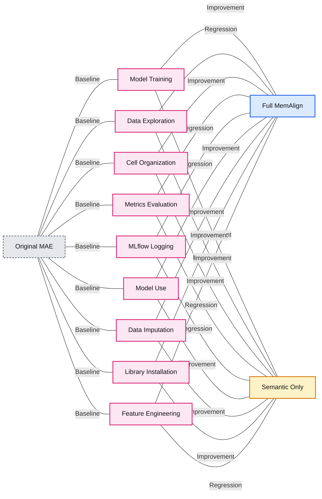

# Using MemAlign to Improve Evaluation of Traditional Machine Learning in Genie Code

*Closing the gap between LLM judges and human experts with MemAlign and MLflow.*

- Source: https://www.databricks.com/blog/using-memalign-improve-evaluation-traditional-machine-learning-genie-code
- Published: 2026-05-08
- Authors: Stepan Nosov, Pavle Martinović, Tejas Sundaresan, Alkis Polyzotis, Nemanja Petrovic
- Categories: engineering, databricks-ai, ai-engineering
- Images: 3 total, 3 extracted as architecture

**Key takeaways**

- Genie Code generates full ML notebooks from natural language prompts — we built nine LLM judges to evaluate their quality across dimensions like model training, data imputation, and feature engineering.
- Human annotation revealed that judges disagreed with experts by up to 0.68 MAE on a 3-point scale. MemAlign, an open-source alignment framework in MLflow, closed this gap using just ~50 labeled examples.
- On the three worst-aligned dimensions, MemAlign reduced judge error by 74-89%, and a followup study showed that both semantic and episodic memory are essential to the result.

Announced in March, [Genie Code](https://www.databricks.com/blog/introducing-genie-code) is Databricks’ autonomous AI partner purpose-built for data science and machine learning. It helps data teams run exploratory data analysis, create and validate features, train and evaluate models, and manage and optimize model deployments.

What sets [Genie Code](https://www.databricks.com/blog/introducing-genie-code) apart is its deep integration with Databricks. Genie Code understands your data in Unity Catalog, business context, and ML infrastructure like Model Serving. With this context, it can provide more accurate suggestions, take more meaningful action, and generate workflows that are better tailored to your organization.

That raises an important question: how do we ensure Genie Code uses all of this context effectively and generates outputs that follow ML best practices? For example, it should know when and how to use tools like MLflow to track model quality. Since the generated code greatly depends on the problem the customer is trying to solve, evaluating the quality of generated code is far from trivial.

In this post, we’ll walk through how we built an evaluation pipeline for Genie Code’s traditional ML capabilities, and how we used [MemAlign](https://www.databricks.com/blog/memalign-building-better-llm-judges-human-feedback-scalable-memory), a new open-source alignment framework in MLflow, to close a large gap between LLM judges and human experts. The improved judges helped us identify and fix gaps in Genie Code’s ML guidance that we would have otherwise missed.

## Building the Evaluation Framework

A robust evaluation framework is required for:

- **Hillclimbing:** quantify how prompts, tools, skills and architecture changes affect output.
- **Guarding against regressions:** Ensure that improving "Model Training" doesn't accidentally degrade "Data Exploration."
- **Benchmarking:** Measure how different foundation models (LLM backends) impact notebook quality.
- **CI:** Monitor how changes in the underlying agentic loop ripple through to the final ML tasks.

Evaluating traditional ML notebooks is one of the most complex evaluation tasks as it spans evaluation of code quality, best ML practices, and data-informed adaptations/tailoring. To handle a task as broad and messy as evaluating ML notebooks, we use an LLM-as-a-judge - an LLM “expert” taught by humans what exactly a good notebook looks like. We created nine judges which are prompted to evaluate the ML notebooks along nine dimensions that appear in most ML workflows:

| **Dimensions** | **What we grade** |
|---|---|
| Library Installation | Installs and imports the right dependencies |
| Exploratory Data Analysis | Explores the dataset to understand distributions, missing values, target behavior, and issues that might affect the model |
| Data Imputation | Handles missing values appropriately without introducing data leakage. |
| Feature Engineering | Selects, transforms, and encodes features in a way that is appropriate for the task. |
| Model Training | Trains suitable models using sound practices such as cross-validation, and hyperparameter tuning |
| Model Use | Reuses the trained model correctly to generate predictions or perform inference. |
| Metrics Evaluation | Evaluates model performance using metrics that are useful for the ML task. |
| MLflow Logging | Tracks experiments, metrics, and artifacts with MLflow. |
| Cell Organization | Structures the notebook into clear, readable, and well-documented cells. |

For each dimension, we wrote scoring rubrics (reused between human raters and LLM judges) that assign a score from 1 to 3, and 0 for "not applicable":

- **3 (Good): **The notebook meets a high bar for a dimension. It demonstrates best practices, covers the expected scope, and handles edge cases appropriately.
- **2 (Average): **Acceptable but with gaps. The basics are present, but the notebook misses refinements that an experienced practitioner would expect.
- **1 (Bad): **Fundamental problems. Key steps are missing, incorrect, or applied in a way that would lead to wrong conclusions.
- **N/A (Not Applicable): **This dimension isn’t applicable for this prompt (e.g. the dimension data imputation can’t be applied if the data set isn’t missing any values).

To give an idea of the granularity, here is the specific rubric we use for the ”data imputation” dimension:

Along with the judges, we maintain a set of evaluation test cases that span a range of ML tasks (classification, regression, forecasting), across different dataset sizes, domains, and complexity levels. Each test case includes a user prompt which tells Genie Code the ML task it is supposed to solve on the specified dataset (“I have airplane flight data in the tables flight_delays_prediction and flight_deplays_actual. Can you predict which planes will be delayed tomorrow?”). The evaluation loop consists of using Genie Code to generate a notebook (or multiple ones) for each test case, and then scoring every notebook along all applicable dimensions.

## Evaluating the evaluation system

By using LLM judges, instead of humans, to evaluate Genie Code artifacts, we essentially swapped one difficult problem for another: the out-of-box judge is unskilled on the task at hand and misaligned with human ratings. Our problem statement is to make the LLM judges score align with those of human evaluators.

The evaluation set for LLM-judge appraisal contains 50 Genie Code generated notebooks (“test cases”) where human experts graded every applicable dimension, providing both a score and a short justification to serve as our ground truth. In the grey areas between two scores, raters were allowed to express their own judgement, but the schemas were written in such a way that this is rarely the case.

The measure of human-machine alignment is the mean absolute error (MAE) between scores in each dimension. The results were mixed, some dimensions showed strong alignment (4 dimensions had a MAE of <= 0.10), while others revealed significant disagreement:

- **Model training:** MAE of 0.680
- **Model use:** MAE of 0.562
- **Data imputation:** MAE of 0.474
- **Data exploration:** MAE of 0.407

This gap exists because humans and LLMs don’t interpret the same rubric the same way. While a human rater can spot a subtly flawed imputation strategy or a training loop that 'works' but is logically unsound, an LLM judge often misses that technical nuance. We also found the judge suffered from a classic positivity bias - it was simply too 'polite' and this got in the way of getting objective results.

It became abundantly clear that given the same rubric, LLM judges and humans would not produce the same results - a misalignment. This is exactly the scenario MemAlign was designed to fix.

**Summary:** Human and LLM judge evaluations initially disagree despite a shared rubric, then MemAlign uses human feedback and learned memories to align the judge with human ratings.

**Components:**
- Scoring criteria: Shared rubric initially, then separate rubrics for the human and LLM judge.
- Human: Human rater evaluating notebooks.
- LLM-Judge: Large language model evaluator; no specific model named.
- Scores + justifications: Evaluation outputs from each evaluator.
- Misalignment: Disagreement between human and judge outputs.
- MemAlign: Reads human feedback and injects learned memories into the judge's context.
- Alignment: Judge scores match human ratings, guided by semantic and episodic memory.

**Flows:**
- Shared scoring criteria -> Human: Rubric guides human evaluation.
- Human -> Human scores + justifications: Human produces ratings and explanations.
- Shared scoring criteria -> LLM-Judge: Same rubric guides model evaluation.
- LLM-Judge -> Judge scores + justifications: Model produces ratings and explanations.
- Human scores + justifications <-> Judge scores + justifications: Misalignment identifies disagreement.
- Separate human scoring criteria -> Human: Human rubric guides evaluation.
- Separate judge scoring criteria -> LLM-Judge: Judge rubric guides evaluation.
- Judge scores + justifications -> Judge scoring criteria: Curved MemAlign feedback loop applies learned memories.
- Human scores + justifications <-> Judge scores + justifications: Alignment indicates matching ratings.

Repeated arrows across panels represent the same flows at successive stages.

**Numbers:** none

```mermaid
%% Shared-rubric disagreement progresses to separate rubrics and MemAlign alignment
flowchart TD
  subgraph Before
    R[Shared scoring criteria] -->|Rubric| H[Human]
    R -->|Rubric| J[LLM-Judge]
    H -->|Evaluation| HS[Human scores + justifications]
    J -->|Evaluation| JS[Judge scores + justifications]
    HS <-->|Misalignment| JS
  end

  subgraph After rubric separation and MemAlign
    HR[Human scoring criteria] -->|Rubric| H2[Human]
    JR[Judge scoring criteria] -->|Rubric| J2[LLM-Judge]
    H2 -->|Evaluation| HS2[Human scores + justifications]
    J2 -->|Evaluation| JS2[Judge scores + justifications]
    JS2 -->|MemAlign learned memories| JR
    HS2 <-->|Alignment| JS2
  end

  classDef client fill:#dbeafe,stroke:#2563eb,stroke-width:2px,color:#111
  classDef service fill:#dcfce7,stroke:#16a34a,stroke-width:2px,color:#111
  classDef store fill:#ede9fe,stroke:#7c3aed,stroke-width:2px,color:#111
  classDef cache fill:#fef3c7,stroke:#d97706,stroke-width:2px,color:#111
  classDef queue fill:#cffafe,stroke:#0891b2,stroke-width:2px,color:#111
  classDef critical fill:#fee2e2,stroke:#dc2626,stroke-width:4px,color:#111
  classDef external fill:#e5e7eb,stroke:#6b7280,stroke-width:2px,color:#111,stroke-dasharray:4 3
  classDef decision fill:#fce7f3,stroke:#db2777,stroke-width:2px,color:#111
  class H,H2 external
  class J,J2 service
  class R,HR,JR decision
  class HS,JS,HS2,JS2 store
```

source image: https://www.databricks.com/sites/default/files/inline-images/image_105.png

## Using MemAlign for alignment

[MemAlign](https://www.databricks.com/blog/memalign-building-better-llm-judges-human-feedback-scalable-memory) is a framework within MLflow that can, given a very small amount of human natural language feedback, perform alignment between the human raters and LLM judges. This is achieved through two types of “memories” formed from reading the human feedback:

- **Semantic memory** stores generalized guidelines - rules distilled from feedback that apply broadly
- **Episodic memory** stores specific examples - cases where the judge got it wrong, preserved as anchors for future decisions

At inference time, MemAlign constructs a working context by pulling all semantic guidelines and retrieving the most relevant episodic examples for the current input. The judge loads all of these into its context, along with the original rubric, and uses the accumulated knowledge to give a more accurate score to all future notebooks.

The key property that made MemAlign stand out is high performance using only a small number of examples. This is because MemAlign effectively distills learning from rich learning signals in natural language feedback, and incorporates them into the dual-memory system.

Here’s an example of some of the snippets of semantic memory generated for the “data imputation” dimension, filling in the gaps in the rubric we previously defined by generally providing anchor points, examples and counter-examples:

Moreover, as mentioned earlier, the semantic memory reflected in the prompt is complemented with relevant examples from the judge’s episodic memory at scoring time, thus giving the judge even more context in order to interpret the optimized instructions.

## Experiment Design

### K-Fold Cross-Validation

Following the ML training-testing paradigm, we applied K-fold cross-validation (K=4) on 50 test cases (notebooks) therefore avoiding data leakage and the need to label a separate test set. For each fold we did the following:

1. **Training phase: **MemAlign aligned the judge using traces from the other folds to get the judge.
2. **Evaluation phase: **Evaluated the notebooks in fold i with judge.

### Bootstrapping Confidence Intervals

To calculate the confidence intervals without additional labeled data, we generated 100 bootstrapped samples with replacement out of the original 50. By repeating this 10,000 times and tracking MAE between human and machine scores, we calculated the confidence intervals for human-machine alignment with a 95% CI defining a statistically significant change.

### Implementation

The evaluation pipeline is implemented as a single MLflow snippet that orchestrates the entire process:

The MemAlign optimizer is able to align LLM judges based on the test cases’ traces in just a couple of lines of code. We used this new “aligned” judge to calculate the new MAE. Aligning a judge on a single dimension takes roughly 25 seconds per fold, so the alignment itself is not a bottleneck.

## Results

**Summary:** MemAlign reduces judge-human mean absolute error in six of nine evaluation dimensions, with statistically significant improvements in Model Training, Model Use, and Data Imputation.

**Components:**
- Model Training ✓: evaluation dimension with significant improvement.
- Data Exploration: evaluation dimension.
- Cell Organization: evaluation dimension.
- Metrics Evaluation: evaluation dimension.
- MLflow Logging: evaluation dimension using MLflow.
- Model Use ✓: evaluation dimension with significant improvement.
- Data Imputation ✓: evaluation dimension with significant improvement.
- Library Installation: evaluation dimension.
- Feature Engineering: evaluation dimension.
- Original MAE: gray markers representing original judge error.
- Aligned MAE with 95% CI: blue markers and light blue confidence intervals representing MemAlign-aligned judge error.
- Statistically significant improvement: green highlighting.

**Flows:**
- none. Horizontal lines show confidence intervals and comparisons, without directional arrows.

**Numbers:**
- Horizontal MAE axis: 0.0, 0.1, 0.2, 0.3, 0.4, 0.5, 0.6, 0.7, 0.8. Lower is better.
- Confidence level: 95%.
- Approximate marker positions and confidence interval endpoints read from the image:

| Dimension | Original MAE | Aligned MAE | Aligned 95% CI |
|---|---:|---:|---:|
| Model Training | 0.683 | 0.179 | 0.008 to 0.341 |
| Data Exploration | 0.407 | 0.529 | 0.314 to 0.747 |
| Cell Organization | 0.393 | 0.307 | 0.142 to 0.476 |
| Metrics Evaluation | 0.029 | 0.055 | 0.000 to 0.142 |
| MLflow Logging | 0.055 | 0.107 | 0.017 to 0.186 |
| Model Use | 0.569 | 0.126 | 0.000 to 0.500 |
| Data Imputation | 0.483 | 0.048 | 0.000 to 0.266 |
| Library Installation | 0.100 | 0.039 | 0.000 to 0.126 |
| Feature Engineering | 0.300 | 0.258 | 0.128 to 0.350 |

source image: https://www.databricks.com/sites/default/files/2026-05/2026-05-blog-gepa-for-aligning-humans-and-llm-judges-og-1200x628-2x.png

Three out of 9 dimensions showed statistically significant improvement:

- **Model training** improved by 0.500 MAE (0.680 → 0.180), a 74% reduction
- **Model use** improved by 0.438 MAE (0.562 → 0.125), a 78% reduction
- **Data imputation** improved by 0.421 MAE (0.474 → 0.053), an 89% reduction

These 3 dimensions are among initial 4 dimensions that were heavily misaligned. A weak initial alignment is indicative of the LLMs and humans having a fundamentally different understanding of the shared rubrics, and the memory injected from MemAlign seems to provide enough context to get them “on the same page”.

- **Metrics evaluation **and MLflow logging were already well-aligned (MAE < 0.10 originally), and their degradation is not statistically significant (experiment noise)
- **Data exploration** showed a slight regression (-0.130), but not statistically significant given its confidence interval [-0.33, +0.09]. This dimension exhibited the highest inter-grader variance, and this noise prevented MemAlign from improving (and might have even hampered it).

### Semantic Memory Only Experiment

The dual-memory structure of MemAlign led us to question whether both of them are actually contributing to the judge alignment. In particular, the episodic memory is supposed to help the judge by giving a set of the most similar annotated notebooks as a reference point (utilizing the nearest neighbor search). But what if the retrieved notebooks (nearest neighbors) aren't actually similar to the current one - just the least dissimilar? Loading those into the judge's context might muddy things rather than help. The problem space we’re grading (ML notebooks) is very broad, and we initially hypothesized that a set of 50 notebooks would simply not be enough to get a sufficiently dense set of memories for the judge to recall.

Without episodic memory, the picture degrades substantially:

- **Model training** still improves (+0.420), but the gain is smaller than the +0.500 with full MemAlign, and the aligned MAE is 0.260 vs. 0.180.
- **Model use** loses statistical significance entirely - the improvement drops from +0.438 to +0.294, with the confidence interval now crossing zero.
- **Data imputation** goes from an 89% error reduction to zero improvement - the aligned MAE equals the original MAE (0.455).
- **MLflow logging and metrics evaluation** actually regress significantly. Without episodic examples to anchor the judge, the distilled guidelines alone introduce noise into dimensions that were already well-calibrated, pushing MLflow logging from 0.062 to 0.396 MAE.

**Summary:** Full MemAlign and semantic memory alone are compared against original mean absolute error across nine evaluation dimensions, with lower error indicating better performance.

**Components:**

- Original MAE: dark gray baseline markers.
- Full MemAlign: blue result markers.
- Semantic Only: orange result markers.
- Improvement: green connectors.
- Regression: red connectors.
- Model Training: evaluation dimension.
- Data Exploration: evaluation dimension.
- Cell Organization: evaluation dimension.
- Metrics Evaluation: evaluation dimension.
- MLflow Logging: evaluation dimension.
- Model Use: evaluation dimension.
- Data Imputation: evaluation dimension.
- Library Installation: evaluation dimension.
- Feature Engineering: evaluation dimension.

No implementation technologies are specified.

**Flows:**

The connectors show comparisons, without arrowheads or data flow.

- Original MAE -> Full MemAlign: improvement for Model Training, Cell Organization, Model Use, Data Imputation, Library Installation, and Feature Engineering.
- Original MAE -> Full MemAlign: regression for Data Exploration, Metrics Evaluation, and MLflow Logging.
- Original MAE -> Semantic Only: improvement for Model Training, Cell Organization, Model Use, Data Imputation, and Library Installation.
- Original MAE -> Semantic Only: regression for Data Exploration, Metrics Evaluation, MLflow Logging, and Feature Engineering.

**Numbers:** The MAE axis shows 0.0, 0.1, 0.2, 0.3, 0.4, 0.5, 0.6, 0.7, and 0.8. Individual markers have no numeric labels.

source image: https://www.databricks.com/sites/default/files/inline-images/full-memory-align-vs-semantic-memory.png

This was the opposite of what we expected. We initially hypothesized that our sparse annotated set would end up confusing the judge, but almost every dimension got worse without episodic memory. The one exception was Data Exploration, where dropping the episodic examples may have actually helped - without the specific notebooks our annotators disagreed on, the judge only had the distilled guidelines, and less noisy signal to work with.

The takeaway: even when your inputs are large and messy, episodic memory still improves the judge’s performance drastically. Both semantic and episodic memories are integral to the functioning of MemAlign.

## Conclusion: Closing the Expert Gap

Judging whether a coding agent is doing its job is hard enough, whereas evaluating an autonomous AI partner on building and executing traditional ML workflows is at another level of complexity. Due to the fast iteration on AI products, there is just not enough time to have experts monitor the agent’s “continuous integration". The only viable scalable solution are LLM judges - but we still need a jury of humans to keep the LLM judge in check.

By applying **MemAlign**, we cut the judge error by 74–89% on the dimensions where it mattered the most. But, as with any ML/LLM work, the result is only as good as the information you put in, so make sure the labeling is competent.

Takeaways:

- **Measure your measurement system:** A noisy system is not good for evaluation, and until we invested the time and resources to actually validate and improve the judges, we could not trust our evaluation system.
- **Rubrics aren’t enough on their own:** There are subtle differences between how a human perceives instructions and how an LLM perceives instructions. These differences should be accounted for, and alignment tooling like MemAlign is an effective way to bridge the gap.
- **Labeling quality > quantity:** When human annotators disagree with each other (as we saw in our Data Exploration regression), alignment has no coherent signal to learn from.

MemAlign ships with MLflow and it worked for us with just ~50 labeled examples. If your LLM judges aren't matching your experts, it's worth an afternoon.
