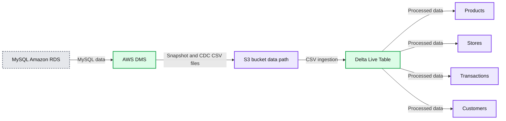
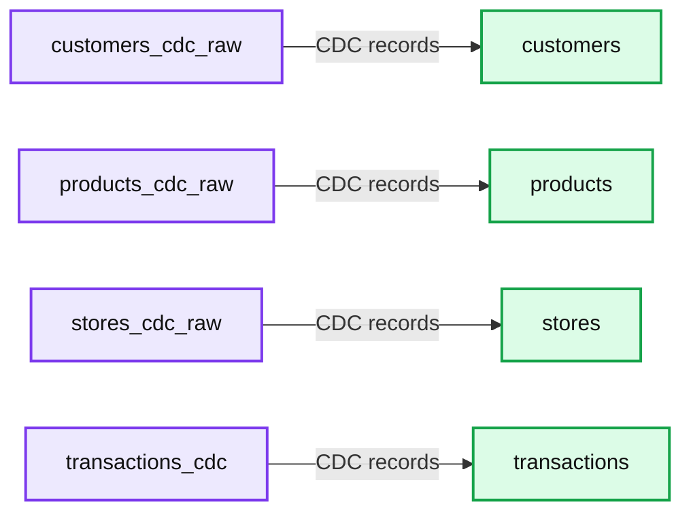
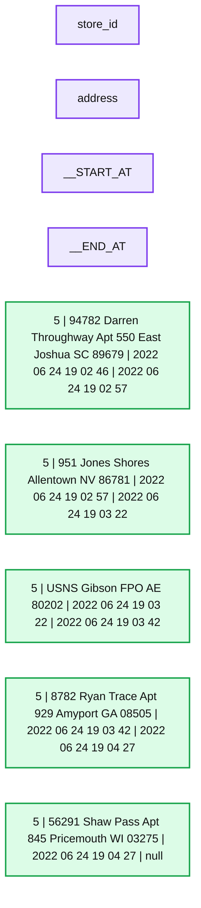

# Using Streaming Delta Live Tables and AWS DMS for Change Data Capture From MySQL

- Source: https://www.databricks.com/blog/using-streaming-delta-live-tables-and-aws-dms-change-data-capture-mysql
- Published: 2022-09-29
- Authors: Neil Patel
- Categories: platform, product, data-streaming
- Images: 4 total, 3 extracted as architecture

In this article we will walk you through the steps to create an end-to-end CDC pipeline with Terraform using Delta Live Tables, AWS RDS, and AWS DMS service. We also provide a GitHub repo containing all scripts.

*Note: This article is a follow-up to [Migrating Transactional Data to a Delta Lake using AWS DMS](https://www.databricks.com/blog/2019/07/15/migrating-transactional-data-to-a-delta-lake-using-aws-dms.html). Jump down to Change Data Capture read the beginning of this blog.*

*Previous blog goes over the Challenges with Moving Data and benefits of Delta Lake excerpt below*

## *Challenges with moving data from databases to data lakes*

*Large enterprises are moving transactional data from scattered data marts in heterogeneous locations to a centralized data lake. Business data is increasingly being consolidated in a data lake to eliminate silos, gain insights and build AI data products. However, building data lakes from a wide variety of continuously changing transactional databases and keeping data lakes up to date is extremely complex and can be an operational nightmare.*

*Traditional solutions using vendor-specific CDC tools or Apache SparkTM direct JDBC ingest are not practical in typical customer scenarios represented below:*

*(a) Data sources are usually spread across on-prem servers and the cloud with tens of data sources and thousands of tables from databases such as PostgreSQL, Oracle, and MySQL databases
 (b) Business SLA for change data captured in the data lake is within 15 mins
 (c) Data occurs with varying degrees of ownership and network topologies for Database connectivity.*

*In scenarios such as the above, building a data lake using Delta Lake and AWS Database Migration Services (DMS) to migrate historical and real-time transactional data proves to be an excellent solution. This blog post walks through an alternate easy process for building reliable data lakes using AWS Database Migration Service (AWS DMS) and Delta Lake, bringing data from multiple RDBMS data sources. You can then use the Databricks Unified Analytics Platform to do advanced analytics on real-time and historical data.*

## *What is Delta Lake?*

*Delta Lake is an open source storage layer that brings reliability to data lakes. Delta Lake provides ACID transactions, scalable metadata handling, and unifies [streaming](https://www.databricks.com/product/data-streaming) and batch data processing. Delta Lake runs on top of your existing data lake and is fully compatible with Apache Spark APIs.*

*Specifically, Delta Lake offers:*

- ***ACID transactions on Spark**: Serializable isolation levels ensure that readers never see inconsistent data.*
- ***Scalable metadata handling**: Leverages Spark's distributed processing power to handle all the metadata for petabyte-scale tables with billions of files at ease.*
- ***Streaming and batch unification**: A table in Delta Lake is a batch table as well as a streaming source and sink. Streaming data ingest, batch historic backfill, interactive queries all just work out of the box.*
- ***Schema enforcement**: Automatically handles schema variations to prevent insertion of bad records during ingestion.*
- ***Time travel**: Data versioning enables rollbacks, full historical audit trails, and reproducible machine learning experiments.*
- ***Upserts with Managed Delta Lake on Databricks**: The MERGE command allows you to efficiently upsert and delete records in your data lakes. MERGE dramatically simplifies how a number of common data pipelines can be built; all the complicated multi-hop processes that inefficiently rewrote entire partitions can now be replaced by simple MERGE queries. This finer-grained update capability simplifies how you build your big data pipelines for change data capture from AWS DMS changelogs.*

*This is the end of the excerpt from the previous blog.*

## Change Data Capture

As enterprises go along their journey to adopt the Databricks Lakehouse Platform, one of the most important data sources to bring into the data lakehouse is relational databases (RDBMS). These databases often power companies' external/internal applications and having that data in Delta Lake lets them do analysis with enrichment from other data sources, without putting a load on the databases themselves. AWS offers its Relational Database Service ([RDS](https://aws.amazon.com/rds/)) to easily manage an RDBMS with engines ranging from MySQL and Postgres to Oracle and SQL Server.

Change Data Capture (CDC) is the best and most efficient way to replicate data from these databases. In a CDC process, a listener is attached to the transaction log of the RDBMS and all of the record level changes to the data are captured and written to another location, along with metadata to signify if the change is an Insert, Update, Delete, etc. AWS offers its own service to perform this, called AWS Database Migration Service ([DMS](https://aws.amazon.com/dms/)). CDC captures the changes from an RDS instance and writes them to S3 on a continuous basis

Once you have configured AWS DMS to write the CDC data to Amazon S3, Databricks makes it easy to replicate this into your Delta Lake and keep the tables as fresh as possible. Delta Live Tables (DLT) with Autoloader can continuously ingest files in a streaming data pipeline as they arrive on S3. When writing to Delta Lake, DLT leverages the [APPLY CHANGES INTO API](https://docs.databricks.com/workflows/delta-live-tables/delta-live-tables-cdc.html) to upsert the updates received from the source database. With [APPLY CHANGES INTO](https://www.databricks.com/blog/2022/04/25/simplifying-change-data-capture-with-databricks-delta-live-tables.html), the complexity of checking for the most recent changes and replicating them, in the correct order, to a downstream table is abstracted away. Additionally, the API provides the option to capture the history of all changes using a Type 2 Slowly Changing Dimension update pattern. This preserves the full change history of a record, data that can be extremely valuable in Machine Learning and Predictive Analytics. By seeing the full history of a particular data point, e.g. customer's home address, Data Scientists can build more advanced predictive models.

## Architecture overview

Diagram below shows at a high level the services we deploy to build our CDC pipeline.

*Dataflow from RDS to Delta Table*

**Summary:** The diagram shows MySQL data flowing from Amazon RDS through AWS DMS and an S3 bucket into a Delta Live Table, which feeds downstream tables.

**Components:**

- MySQL on Amazon RDS
- AWS DMS
- Amazon S3 bucket at s3://dms-bucket/data/databricks
- Delta Live Table
- Products table
- Stores table
- Transactions table
- Customers table

**Flows:**

- Amazon RDS -> AWS DMS: MySQL data
- AWS DMS -> S3 bucket: Full snapshot and ongoing CDC files
- S3 bucket -> Delta Live Table: CSV data ingestion
- Delta Live Table -> Products table: Processed data
- Delta Live Table -> Stores table: Processed data
- Delta Live Table -> Transactions table: Processed data
- Delta Live Table -> Customers table: Processed data

**Numbers:** none

source image: https://www.databricks.com/sites/default/files/inline-images/db-300-blog-img-1.png

Dataflow from RDS to Delta Table

In a production environment the general flow is creating one to many DMS replication tasks that will do a full snapshot and ongoing CDC of a database (or specific tables) from your RDS. These get dropped to S3 as CSV files, which are ingested by Delta Live Tables using Auto Loader into the [Bronze table](https://www.databricks.com/glossary/medallion-architecture). This Bronze table is then used as the source for APPLY CHANGES INTOprocessing the data into a Silver quality table using SCD Type 1 or Type 2 semantics.

Example usage of the python API for APPLY CHANGES INTO:

The Terraform script will deploy a MySQL instance on AWS RDS and populate it with a database with tables and synthetic data using AWS Lambda. The AWS DMS Instance is created (including all relevant AWS artifacts) and will do an initial snapshot of the table data to S3 and monitor it for any changes. After the initial snapshot is done we then run AWS Lambda again to make updates in the database. AWS DMS will see these changes and pipe them over to S3 in the same location as the full snapshot.

From there we will create an Instance Profile that can access the S3 bucket where the data is located and update the Databricks Cross Account Role with the Instance Profile. Afterwards we will add the Notebook to your workspace and create and run Delta Live Table pipeline with the Instance Profile.

*Delta Live Table pipeline with the Instance Profile*

**Summary:** Delta Live Tables pipeline showing CDC raw tables flowing into processed customer, product, store, and transaction tables.

**Components:**

- customers_cdc_raw - raw CDC table
- customers - processed customer table
- products_cdc_raw - raw CDC table
- products - processed product table
- stores_cdc_raw - raw CDC table
- stores - processed store table
- transactions_cdc - raw CDC table
- transactions - processed transaction table

**Flows:**

- customers_cdc_raw -> customers: CDC records
- products_cdc_raw -> products: CDC records
- stores_cdc_raw -> stores: CDC records
- transactions_cdc -> transactions: CDC records

**Numbers:**

- customers_cdc_raw: 130 records, 0 errors, completed in 6s
- customers: completed in 6s
- products_cdc_raw: 25 records, 0 errors, completed in 7s
- products: completed in 6s
- stores_cdc_raw: 50 records, 0 errors, completed in 6s
- stores: completed in 6s
- transactions_cdc: 1K records, 0 errors, completed in 6s
- transactions: completed in 8s

source image: https://www.databricks.com/sites/default/files/inline-images/db-300-blog-img-2.png

Delta Live Table pipeline with the Instance Profile

Once this completes, an interactive cluster is created and another notebook is uploaded. A URL will be outputted from Terraform; clicking that link will take you to a notebook that can be attached to the interactive cluster and run.

Url for Databricks analysis notebook

When you run the notebook you be able to inspect the tables and will l see that it has the columns __START_AT and __END_AT that's because the pipeline runs in SCD Type 2. This lets us easily see that records were updated and when updated the old value has __END_AT filled with timestamp whereas the latest update __END_AT will be NULL indicating that it is the most recent and valid.

*SCD Type 2 lets us see the updates to store_id*

**Summary:** The table shows SCD Type 2 history for store_id 5, with address changes tracked by start and end timestamps.

**Components:**

- `store_id`: store identifier
- `address`: store address value
- `__START_AT`: validity start timestamp
- `__END_AT`: validity end timestamp

**Flows:**

- none

**Numbers:** 5; 94782; 550; 9879; 2022-06-24T19:02:46.000+0000; 2022-06-24T19:02:57.000+0000; 951; 86781; 2022-06-24T19:02:57.000+0000; 2022-06-24T19:03:22.000+0000; 80202; 2022-06-24T19:03:22.000+0000; 2022-06-24T19:03:42.000+0000; 8782; 929; 08505; 2022-06-24T19:03:42.000+0000; 2022-06-24T19:04:27.000+0000; 56291; 845; 03275; 2022-06-24T19:04:27.000+0000

source image: https://www.databricks.com/sites/default/files/inline-images/db-300-blog-img-4.png

SCD Type 2 lets us see the updates to store_id

## How to Run

In order to run this repo there are a set of prerequisites and environment variables needed. Please ensure that all are met in for this demo to run properly.

### Prerequisites

- [E2 Databricks Workspace](https://docs.databricks.com/administration-guide/account-settings-e2/workspaces.html)
- See Appendix if you need to create WS
- Admin on Databricks Workspace
  - We use Admin Databricks Account to keep the demo simple
- Admin on AWS Account
  - We use Admin AWS Account here to keep the demo simple
- Needs to run in the same AWS account and region that Databricks is Deployed in
- python3
- pip install databricks-cli
- [Terraform Installed](https://learn.hashicorp.com/tutorials/terraform/install-cli)
  - [Make sure TF can authenticate to AWS](https://registry.terraform.io/providers/hashicorp/aws/latest/docs#authentication-and-configuration)
    - [Environment Variable authentication](https://registry.terraform.io/providers/hashicorp/aws/latest/docs#environment-variables) is recommended for the demo
      - If you chose an alternative you will need to modify the aws provider blocks to authenticate properly
- Make sure TF can authenticate to Databricks
  - Create bash environment variables below
  - [How to generate PAT](https://docs.databricks.com/dev-tools/api/latest/authentication.html)

### Terraform Environment Variables

As part of this Terraform deployment we need to provide the Databricks Cross Account role name, this lets the deployment apply the IAM instance profile that we need to access the s3 bucket where the s3 files are located.

- When Databricks Workspace is deployed part of the deployment is a [Cross Account Role](https://docs.databricks.com/administration-guide/account-api/iam-role.html). An example of the *ARN* `*arn:aws:iam::<aws account id>:role/databricks*`, you need to provide just the role name e.g.

- AWS/Databricks Region where workspace is deployed in

### Steps

1. Fork [https://github.com/databricks/delta-live-tables-notebooks](https://github.com/databricks/delta-live-tables-notebooks)
2. Clone your fork
3. cd ./dms-dlt-cdc-demo/deployments/dms-dlt-cdc-demo
4. terraform init
5. terraform plan
6. terraform apply -auto-approve

When done you can run terraform destroy, which will tear down AWS RDS, DMS, and Lambda services.

### Appendix

If you do not have a Databricks Workspace deployed or wish to deploy a PoC environment for this Blog please follow the instructions below.

Same prerequisites as above aside from the environment variables you will need to provide the following

1. Fork [https://github.com/databricks/delta-live-tables-notebooks](https://github.com/databricks/delta-live-tables-notebooks)
2. Clone your fork
3. cd ./dms-dlt-cdc-demo/deployments/e2-simple-workspace
4. terraform init
5. terraform plan
6. terraform apply -auto-approve

When done you can run terraform destroy, which will tear down the databricks workspace and all aws infra associated with it.

[Try Databricks for free](https://www.databricks.com/try-databricks) to run this example.
