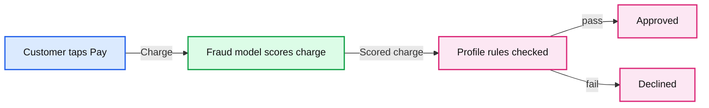

# What happens in the milliseconds after you tap pay

*A walkthrough of a Databricks App combining Model Serving route optimization, Lakebase, and autoscaling to score transactions in tens of milliseconds, with code and benchmarks at every layer.*

- Source: https://www.databricks.com/blog/what-happens-milliseconds-after-you-tap-pay
- Published: 2026-07-16
- Authors: Harsha Pasala, Subhadip Chanda
- Categories: engineering
- Images: 1 total, 1 extracted as architecture

**Key takeaways**

- A sample Databricks App (FastAPI + React) that scores credit card transactions for fraud in real time using Model Serving route optimization for low-latency inference and Lakebase Postgres for online feature and profile lookups.
- Fast inference alone is not enough. The app pairs route-optimized Model Serving with Lakebase, plus the connection pooling, OAuth token rotation, and autoscaling patterns that keep latency stable under load.
- Across 5,000 requests, the route-optimized endpoint returned in 27 ms at p50 and 37 ms at p95 end-to-end, with 8.9 ms median Lakebase feature lookups and 100% success, well inside checkout latency budgets.

You're standing at the register. You tap your card. A tiny spinner appears for maybe half a second, maybe less, and then it says Approved. Or it doesn't.

During that time, something had to decide whether this charge looks like you, or like someone who stole your card number in a data breach six months ago. It had to know things about you: your spending patterns, your daily limit, whether you even allow purchases from other countries. And it had to do all of that fast enough that you didn't notice it happened.

This post is about what that "something" looks like when you build it on Databricks. We'll walk through retail-app, a sample application (FastAPI backend, React frontend, deployed as a Databricks App) that brings two platform capabilities together:

- Model Serving with route optimization, a faster network path to your deployed model.
- Lakebase, a managed Postgres for the profile and feature data the model needs at prediction time, featuring autoscaling so the database scales with demand instead of becoming the new bottleneck.

The [full repo is on GitHub](https://github.com/databricks-solutions/lakebase-online-ml), you can fork it, deploy it to your workspace, and tap "pay" yourself.

## The flow: what actually happens on a transaction

Before we look at code, here's the plain story of a single payment. Two checks run in sequence: a model scores the charge, then the app checks your profile rules. Either one can decline the transaction.

**Summary:** A payment passes through fraud model scoring and profile rule checks before branching to approval or decline.

**Components:**
- Customer taps Pay: customer action; technology unspecified.
- Fraud model scores charge: fraud scoring model; technology unspecified.
- Profile rules checked: rule checking; technology unspecified.
- Approved: successful payment outcome; technology unspecified.
- Declined: unsuccessful payment outcome; technology unspecified.
- pass: approval branch label.
- fail: decline branch label.

**Flows:**
- Customer taps Pay -> Fraud model scores charge: charge submitted for scoring.
- Fraud model scores charge -> Profile rules checked: scored charge proceeds to rule checking.
- Profile rules checked -> Approved: pass.
- Profile rules checked -> Declined: fail.

**Numbers:** none

source image: https://www.databricks.com/sites/default/files/blog_images/what-happens-in-the-milliseconds-after-you-blog-img-1.png

The model runs first because we want its latency numbers regardless of the outcome. Then the profile lookup (daily spending cap, international transaction toggle, country of residence) feeds a handful of if-statements. The response includes timing for every step so you can see exactly where the milliseconds went.

**Updating your profile** (changing your daily limit, toggling international transactions) is a separate action. You save changes to the database, and the *next* payment picks them up. No redeployment, no cache invalidation.

## Route optimization: why the network path matters

When a model is deployed behind Databricks Model Serving, there's a network hop between your application and the inference container. For batch workloads, a few extra milliseconds per request is irrelevant. For a checkout experience, it's everything.

[Route optimization](https://docs.databricks.com/aws/en/machine-learning/model-serving/route-optimization) shortens that network path. When you enable route optimization on an endpoint, Databricks Model Serving improves the network path for inference requests, resulting in faster, more direct communication between your client and the model. This optimized routing unlocks higher queries per second (QPS) compared to non-optimized endpoints and provides more stable and lower latencies for your applications.

You enable it when you create the endpoint, and you query through the **data-plane** flow using OAuth, not personal access tokens. You get lower latency and higher throughput for the same compute, which is exactly what an interactive fraud-scoring use case needs.

In the sample app, the endpoint is called `fraud-detection-lakebase`. Here's the constant and the function that calls it:

A few things to notice:

- `**serving_endpoints_data_plane.query**`: This is the data-plane query path, which is what route optimization uses. The Databricks SDK handles the OAuth token exchange under the hood.
- `**asyncio.to_thread**`: The SDK's query method is synchronous. Wrapping it in `to_thread` keeps the FastAPI event loop free while the model runs.
- `**dataframe_records**`: The payload is a list of dictionaries (one per row). For fraud scoring, we send one transaction at a time.

The model itself returns `fraud_probability`, `fraud_flag`, and (crucially) its own internal timing: `lookup_ms` (how long the feature lookup inside the model container took), `inference_ms` (CatBoost prediction), and `total_ms`. The backend maps these through so the frontend can show a latency waterfall:

So when you see the latency breakdown in the UI ("Model Inference: 45ms" with "Feature Lookup: 8ms" nested underneath), they're the numbers measured at each layer and stitched together in a single response.

For more on setting this up: [Route optimization](https://docs.databricks.com/aws/en/machine-learning/model-serving/route-optimization) · [Querying route-optimized endpoints](https://docs.databricks.com/aws/en/machine-learning/model-serving/query-route-optimization).

## Lakebase: Postgres for the data the model needs

The fraud model doesn't just look at the transaction in isolation. It looks up the customer's historical features (average transaction amount, cross-border ratio, chargeback rate, velocity over the past 24 hours) using the first six digits of the credit card (the BIN) as the lookup key. Those features live in a [Lakebase](https://docs.databricks.com/aws/en/oltp) Postgres table called `customer_features`.

This is the same table the *backend* reads from for profile data (name, daily limit, international toggle). One table, two readers: the model container reads features for inference, the FastAPI app reads profile fields for business rules.

On the read side, the backend borrows a connection from the pool, runs a parameterized `SELECT` by `user_id`, and returns the connection in a `finally` block. Straightforward psycopg2, but the borrow/return discipline matters when this runs on every transaction. The query uses parameterized placeholders for user input, so the lookup key is never concatenated into the SQL.

On the write side, when a user changes their daily limit or toggles international transactions in the UI, the backend builds a dynamic `UPDATE` from an allowlist of editable columns. Only fields on that list are written; the client can't inject arbitrary column names. The write runs with `autocommit = True`, so the change is immediately visible: the very next transaction sees the updated limit without waiting for a batch flush or cache invalidation.

## Connection pooling and OAuth token rotation

Every transaction in this app hits Lakebase at least twice: once inside the model container for the feature lookup, and once in the backend for the profile check. Opening a fresh connection each time means a TCP handshake plus a TLS negotiation on every single request, which would easily add 20-50 ms of overhead per call. A connection pool keeps a handful of connections open and ready, so most requests just grab one and go.

Here's what that looks like in practice. Every database operation follows the same borrow/query/return pattern:

Borrow a connection, run your query, return the connection in a `finally` block so it always goes back even if something throws. Every read and write in the app follows this same shape.

The pool itself is a `psycopg2.pool.ThreadedConnectionPool` with 3–10 connections. But building it is where things get interesting, because Lakebase authenticates via OAuth. The app exchanges service principal credentials for an access token, then uses the **client ID as the Postgres username** and the **token as the password**. No long-lived database passwords.

That means when the token expires, you can't just keep using the old password on pooled connections, because they'd fail on the next query. So `_ensure_pool` checks whether the token has changed, and if it has, builds a fresh pool:

Most of the time, the fast path fires: the pool exists, the token hasn't changed, and we return immediately. When the token does rotate, the double-check locking keeps two threads from rebuilding the pool at the same time, and the 30-second timer on closing the old pool gives in-flight queries time to finish before their connections disappear.

## The model's side: feature lookup inside the container

The fraud model itself (deployed as an MLflow pyfunc) does its *own* Lakebase lookup at prediction time. It extracts the card BIN, queries `customer_features`, assembles a feature vector, and runs CatBoost inference. Each step is timed:

The model container maintains its own `ThreadedConnectionPool` to Lakebase (the `LakebaseConnectionPool` class in `fraud_model.py`), with background token refresh so the pool stays valid across long-running serving instances. This is the same pattern as the backend (pool + OAuth rotation), but running inside the model container rather than the FastAPI process.

Those `lookup_ms` and `inference_ms` values flow back through the serving response, through the backend, and into the frontend. That's how you get end-to-end visibility: the model reports its internal timing, the backend adds its own wall-clock measurement, and the user sees all of it.

## Business rules: the profile check

After the model scores the transaction, the backend reads the customer's profile from Lakebase and runs two simple rules. First, it compares the transaction amount against the user's daily spending limit. If the charge exceeds the cap, the transaction is declined with a message telling the user they can raise it in their profile settings. Second, if the user has disabled international transactions, the backend checks whether the transaction's country matches the user's country of residence. A mismatch means a decline.

Either rule can *override* a model approval. A transaction the model thinks is fine can still be declined because the user set a $500 daily cap. That's intentional. The model handles statistical risk; the profile handles user preferences. Both read from the same Lakebase table, but they serve different purposes.

The time spent on the profile lookup and rule checks is tracked as `business_logic_ms` and returned alongside the model timing, so you can see exactly how much overhead the business logic adds to each transaction.

## Lakebase autoscaling with scale-to-zero: handling demand

In production, your Postgres instance needs to handle both the model container's feature lookups *and* the backend's profile reads, potentially many of each per second during peak hours. [Lakebase autoscales](https://docs.databricks.com/aws/en/oltp/projects/autoscaling), adjusting compute within a configured min/max range so you're not paying for peak capacity at 3 AM, but you're also not dropping queries at noon.

In the benchmark results below, the consistent single-digit lookup times at p50 through p75 reflect what a warmed Lakebase instance delivers under steady load. The jump at p95 (13.9 ms) is typical of connection pool churn or brief scale-up events, still well within the latency budget for a checkout flow, and exactly the kind of spike that autoscaling absorbs before it becomes user-visible. With scale-to-zero enabled, you also stop paying when no transactions are flowing.

## Putting it together: end-to-end latency breakdown

Here's the full latency picture for a single transaction:

| **Measurement** | **What it captures** | **Where it's measured** |
|---|---|---|
| model_call_ms | Wall-clock time for the entire serving call | Backend (router.py) |
| model_lookup_ms | Feature lookup inside the model container | Model (fraud_model.py) |
| model_interfere_ms | CatBoost prediction time | Model (fraud_model.py) |
| model_total_ms | Total time inside the model container | Model (fraud_model.py) |
| business_logic_ms | Profile read + rule evaluation | Backend (router.py) |
| backend_total_ms | Wall-clock time from request start through fraud model call | Backend (router.py) |

The gap between `round_trip_ms `and `model_total_ms` is network overhead, and that's exactly where route optimization helps. The gap between `backend_total_ms` and `model_call_ms `is framework overhead (serialization, routing, etc.).

When you run the app and submit a transaction, the UI shows the key ones: Model Inference, Feature Lookup, and Business Logic. Makes it easy to see the difference route optimization makes, or to show that a Lakebase feature lookup adds single-digit milliseconds rather than the hundreds you might expect from a cold database connection.

## Results: How fast is it really?

We sent 5,000 sequential requests (concurrency = 1, 50ms delay between calls) to the route-optimized` fraud-detection-lakebase` endpoint (CPU, "Small" workload size, single Azure region) and collected latency at every layer, from within the model container to the caller's round-trip. The goal was to isolate per-request latency anatomy, where the milliseconds go at each layer (feature lookup, inference, network overhead), rather than load-test throughput under contention. These numbers come from the benchmark script (`scripts/benchmark.py`), which calls the model endpoint directly. The UI latency breakdown shows a different slice (Model Inference, Feature Lookup, and Business Logic) measured through the full backend route.

| **Metric** | **What it measures** | **p50** | **p75** | **p90** | **p95** |
|---|---|---|---|---|---|
| **Feature lookup** (model_lookup_ms) | Lakebase read inside the model container | 8.9 ms | 9.8 ms | 11.7 ms | 13.9 ms |
| **Inference** (model_inference_ms) | CatBoost prediction | 0.4 ms | 0.5 ms | 1.6 ms | 6.0 ms |
| **Total model time** (model_total_ms) | Lookup + inference + container overhead | 9.5 ms | 10.9 ms | 14.9 ms | 17.6 ms |
| **End-to-end round trip** (round_trip_ms) | Full data-plane call from caller to response | 27.2 ms | 29.6 ms | 33.8 ms | 37.3 ms |
| **Network overhead (**round_trip_ms - model_total_ms) | Round trip minus model time | 17.4 ms | 18.5 ms | 19.8 ms | 21.1 ms |

A few things stand out:

- **End-to-end round trip is 27 ms at the median, 37 ms at p95.** That's the full journey: caller → route-optimized data plane → model container → Lakebase lookup → CatBoost inference → response. Well within the latency budget for a checkout flow.
- **Feature lookup is single-digit milliseconds at p50 (8.9 ms).** The model's connection pool to Lakebase keeps connections warm, so most reads skip the TLS handshake entirely. Even at p95 the lookup stays under 14 ms.
- **Inference is essentially free.** CatBoost prediction on a 12-feature vector takes 0.4 ms at the median. The model's time is dominated by the feature lookup, not the prediction itself.
- **Network overhead is ~17 ms.** The gap between what the model container reports and what the caller sees is the serving infrastructure: request routing, serialization, and the data-plane hop. Route optimization keeps this consistent: the p50-to-p95 spread is only 4 ms.

## Try it yourself: deploy the app to your workspace

The app is built as a [Databricks App](https://docs.databricks.com/en/dev-tools/databricks-apps/app-development.html) (FastAPI backend, React frontend) using [apx](https://github.com/databricks-solutions/apx). Install it using:

You'll also need Databricks CLI authentication configured for the workspace where the model serving endpoint and Lakebase instance are deployed.

To run locally:

To deploy to your workspace:

The key files:

- `src/retail_app/backend/router.py`: Transaction endpoint, fraud check, business rules
- `src/retail_app/backend/postgres.py`: Lakebase connection pool, profile CRUD
- `model_training/fraud_model.py`: MLflow pyfunc with feature lookup and CatBoost
- `app.yml`: Deployment config (uvicorn entrypoint, environment variables)

## Related documentation

- [Model Serving: Route optimization](https://docs.databricks.com/aws/en/machine-learning/model-serving/route-optimization)
- [Querying route-optimized serving endpoints](https://docs.databricks.com/aws/en/machine-learning/model-serving/query-route-optimization)
- [Optimize serving endpoints for production](https://docs.databricks.com/aws/en/machine-learning/model-serving/production-optimization)
- [Lakebase (OLTP)](https://docs.databricks.com/aws/en/oltp)
- [Lakebase Autoscaling](https://docs.databricks.com/aws/en/oltp/projects/autoscaling)
- [Databricks Apps](https://docs.databricks.com/en/dev-tools/databricks-apps/app-development.html)
- [MLflow code-based models](https://mlflow.org/docs/latest/ml/model/)
- [Best Practices for High QPS Model Serving](https://www.databricks.com/blog/best-practices-high-qps-model-serving-databricks)
- [Github repo for source code](https://github.com/databricks-solutions/lakebase-online-ml)

Real-time use cases with sub-50ms latency requirements such as fraud scoring, personalization, dynamic pricing can be built natively on Databricks. Model Serving route optimization and Lakebase put the inference path and the data path on the same governed platform. If you've previously concluded that a lakehouse architecture couldn't meet checkout-grade latency, the benchmark numbers here (27ms median end-to-end with single-digit feature lookups) are worth a second look. If a real-time workload has been sitting on the "too hard" list, this is the moment to revisit it. Deploy the app in your own workspace to see the latency waterfall for yourself, and explore Lakebase and Databricks Model Serving.

It is worth noting that while these benchmark results reflect our specific model, actual performance will naturally vary based on your model's size and architecture. Databricks makes it simple to deploy and scale your workload either way. You can bring your own custom model using MLflow to maintain complete governance, and observability, or simply choose one of Databricks' pre-hosted models to get up and running fast.
