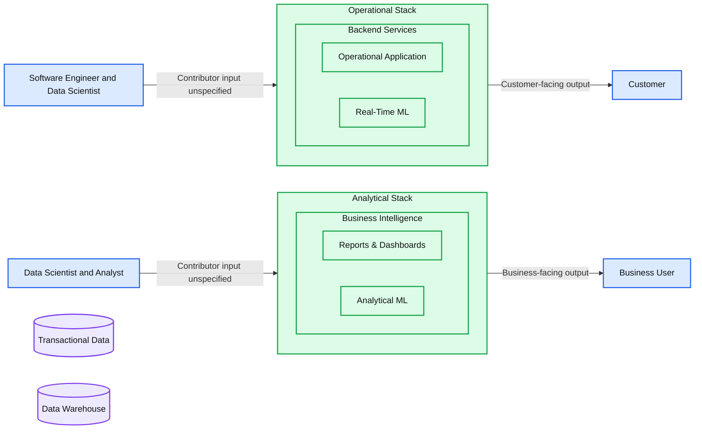

# What Is Real-Time Machine Learning?

- Source: https://www.databricks.com/blog/what-is-real-time-machine-learning
- Published: 2025-10-28
- Authors:  Gaetan Castelein
- Categories: data-science-machine-learning
- Images: 3 total, 3 extracted as architecture

*Real-time machine learning is the new operational machine learning, and data is more easily accessible than ever before. In the past few years, we’ve seen many large companies move from analytical (offline predictions + batch data sources) and operational machine learning (online predictions + batch data sources), to real-time machine learning (online predictions + batch AND real-time data sources).*

When Tecton’s co-founders, CEO Michael Del Balso and CTO Kevin Stumpf, were working at Uber when they rolled out [Michelangelo](https://www.tecton.ai/), they noticed that the majority of models were running in real time. More specifically, 80% of the models were running in production and making predictions in real time to support production applications, directly impacting Uber riders and drivers (think estimated wait times, arrival times, etc.). The other 20%? They were analytical machine learning use cases, which drove (no pun intended) analytical decision-making.

**This was interesting because the ratio was the opposite of how other enterprise businesses applied machine learning—for most, analytical machine learning was king.** Over the years, Uber and other ride-sharing services have increasingly relied on real-time machine learning to provide ever-more advanced end-user services, such as accurate price quotes,better ETA predictions, and improved fraud detection.

For a long time, real-time machine learning (ML) seemed like it was only available to the most advanced cloud-native organizations. But a lot has changed since Michelangelo, and today, there are many new technologies and tools that any company can use to switch from analytical machine ML to real-time ML, which we’ll cover in this post.

## What is real-time machine learning vs. analytical machine learning?

**Real-time machine learning is when an app uses a machine learning model to autonomously and continuously make decisions that impact the business in real time.** A great example is when you’re using a credit card to make a purchase—the credit card company has a bunch of data at its disposal, like your shopping history and average transaction amount, to immediately figure out whether it’s you making the purchase or whether it should be flagged as fraud. But the decision must be made in real time and milliseconds matter because there’s a user waiting on the other side for their transaction to be approved.

Other examples include recommendation systems, dynamic pricing for tickets to a sporting event, and loan application approvals. These types of applications are mission-critical and run “online” in production on a company’s operational stack.

In contrast, analytical ML lives in the “offline” world and is real-time ML’s older sibling. Analytical ML applications are designed for *human-in-the-loop decision making*. They help a business user make better decisions with machine learning, sit in a company’s analytical stack, and typically feed directly into reports, dashboards, and business intelligence tools. They’re much easier to deploy because they operate at human timescales. If an application goes down, the end user isn’t directly impacted—the human decision-maker will just have to wait a little longer to get their analytical report. Some examples you’ll see in everyday life are churn predictions, customer segmentation, and sales forecasting tools.

**Summary:** The operational stack delivers real-time ML to customers, while the analytical stack delivers analytical ML through reports and dashboards to business users.

**Components:**
- Software Engineer: operational-stack contributor; technology unspecified.
- Data Scientist: contributor to both stacks; technology unspecified.
- Operational Stack: contains backend services.
- Backend Services: contains Operational Application and Real-Time ML; technology unspecified.
- Operational Application: customer-facing application; technology unspecified.
- Real-Time ML: machine learning within the operational stack; technology unspecified.
- Transactional Data: storage beneath the operational stack; database technology unspecified.
- Customer: uses a mobile device; technology unspecified.
- Analyst: analytical-stack contributor; technology unspecified.
- Analytical Stack: contains business intelligence.
- Business Intelligence: contains Reports & Dashboards and Analytical ML; technology unspecified.
- Reports & Dashboards: analytical outputs; technology unspecified.
- Analytical ML: machine learning within the analytical stack; technology unspecified.
- Data Warehouse: storage beneath the analytical stack; warehouse technology unspecified.
- Business User: recipient of analytical-stack outputs; technology unspecified.

**Flows:**
- Software Engineer and Data Scientist -> Operational Stack: shared contributor arrow; payload unspecified.
- Operational Stack -> Customer: customer-facing output; payload unspecified.
- Data Scientist and Analyst -> Analytical Stack: shared contributor arrow; payload unspecified.
- Analytical Stack -> Business User: business-facing output; payload unspecified.

**Numbers:** none

source image: https://www.databricks.com/sites/default/files/inline-images/real-time-machine-learning-blog-img-1.png

Analytical ML and real-time ML are both necessary in an organization, serve different functions, and are implemented differently. The table below gives a high-level overview of the difference between the two.

|  | Analytical ML | Real-Time ML |
|---|---|---|
| Decision Automation | Human-in-the-loop | Fully autonomous |
| Decision Speed | Human speed | Real time |
| Optimized For | Large-scale batch processing | Low latency and high availability |
| Primary Audience | Internal business user | Customer |
| Powers | Reports & dashboards | Production applications |
| Examples | Sales forecasting Lead scoring Customer segmentation Churn predictions | Product recommendations Fraud detection Traffic prediction Real-time pricing |

*Analytical machine learning vs. real-time machine learning.*

## Real-time machine learning in the real world

Let’s take a look at a real-world real-time machine learning example from Uber Eats. When you open the app, it has a list of recommended restaurants, along with delivery time estimates. However, what looks really simple and easy in the app doesn’t tell the whole story—what goes on behind the scenes is quite complicated and involves many moving parts.

*How Uber Eats uses real-time machine learning to predict food delivery wait times and shows these predictions live in the app.*

**Summary:** Uber Eats transforms live and historical data into ML features, predicts delivery times and restaurant recommendations, and displays the predictions in its app.

**Components:**

- Raw Data Sources: Live Deliveries, Live Driver Locations, Live Restaurant Orders, Historical Customer Purchases, Historical Restaurant Ratings, and Customer Search Query. Technologies unspecified.
- Real-Time ML Pipeline: Contains feature inputs, an ML model, and predictions. Technology unspecified.
- ML Features: `30min_restaurant_order_count`, `5min_available_drivers_count`, and `30d_cust_fav_restaurant_category`. Technology unspecified.
- ML Model: Produces predictions from features. Model technology unspecified.
- Predictions: Delivery Time of “20-30 Min” and Top Restaurant of “Otto’s Tacos”.
- Uber Eats app: Mobile interface displaying the restaurant and delivery estimate. Platform unspecified.

**Flows:**

- Raw Data Sources -> ML Features: Live and historical inputs.
- ML Features -> ML Model: Restaurant order count, available driver count, and customer’s favorite restaurant category.
- ML Model -> Predictions: Delivery time estimate and top restaurant.
- Predictions -> Uber Eats app: Predictions displayed to the customer.

**Numbers:**

- `30min_restaurant_order_count`: 30-minute window; value 17.
- `5min_available_drivers_count`: 5-minute window; value 4.
- `30d_cust_fav_restaurant_category`: 30-day window.
- Predicted delivery time: 20-30 Min.
- App status time: 2:59.
- App address: 123 Sesame St.
- App restaurant details: 20-30 Min, 4.8 rating, 138 in parentheses, and $1.49 Delivery Fee.
- App price indicator: $$.

```mermaid
%% Uber Eats real-time ML pipeline from raw data to app predictions
flowchart LR
    A["Raw Data Sources<br/>Live Deliveries<br/>Live Driver Locations<br/>Live Restaurant Orders<br/>Historical Customer Purchases<br/>Historical Restaurant Ratings<br/>Customer Search Query"]
    subgraph P["Real-Time ML Pipeline"]
        B["ML Features<br/>30min_restaurant_order_count: 17<br/>5min_available_drivers_count: 4<br/>30d_cust_fav_restaurant_category: mexican"]
        C["ML Model"]
        D["Predictions<br/>Delivery Time: 20-30 Min<br/>Top Restaurant: Otto’s Tacos"]
    end
    E["Uber Eats app"]
    A -->|Live and historical data| B
    B -->|Feature values| C
    C -->|Model predictions| D
    D -->|Delivery estimate and restaurant recommendation| E

    classDef client fill:#dbeafe,stroke:#2563eb,stroke-width:2px,color:#111
    classDef service fill:#dcfce7,stroke:#16a34a,stroke-width:2px,color:#111
    classDef store fill:#ede9fe,stroke:#7c3aed,stroke-width:2px,color:#111
    classDef cache fill:#fef3c7,stroke:#d97706,stroke-width:2px,color:#111
    classDef queue fill:#cffafe,stroke:#0891b2,stroke-width:2px,color:#111
    classDef critical fill:#fee2e2,stroke:#dc2626,stroke-width:4px,color:#111
    classDef external fill:#e5e7eb,stroke:#6b7280,stroke-width:2px,color:#111,stroke-dasharray:4 3
    classDef decision fill:#fce7f3,stroke:#db2777,stroke-width:2px,color:#111
    class A external
    class B,C,D service
    class E client
```

source image: https://www.databricks.com/sites/default/files/inline-images/real-time-machine-learning-blog-img-2.png

[*How Uber Eats uses real-time machine learning to predict food delivery wait times and shows these predictions live in the app.*](https://www.databricks.com/sites/default/files/inline-images/real-time-machine-learning-blog-img-2.png)

For example, to recommend “Otto’s Tacos” and provide a 20-30 minute wait time in the app, Uber’s ML platform needs to pull a wide array of data from several different raw data sources, such as:

- How many drivers are near the restaurant at the moment? Are said drivers in the middle of delivering an order or are they available to pick up and deliver a new order?
- How busy is the restaurant’s kitchen? A slower kitchen with few orders means the restaurant can start working on a new order faster, and vice versa for a busy kitchen.
- What are the customer’s past restaurant ratings? (This will affect what the app shows as recommended restaurants, for example.)
- What cuisine is the user searching for right now?
- And finally, what is the user’s current location or set delivery location?

The Michelangelo feature platform takes all this data and converts it into **machine learning features—aka signals that a machine learning model is trained on.** The model then uses that information to make real-time predictions. For example, ‘`num_orders_last_30_min`‘ is used as an input feature to predict the delivery time, which will show up in your mobile app.

The steps laid out above—turning raw data from a myriad of different data sources into features and features into predictions—are common across all real-time ML use cases. It doesn’t matter if a system is trying to predict a car loan applicant’s interest rate, detect credit card fraud, or recommend what to watch next—the technical challenges remain the same.

And it’s this technical commonaility that allowed Tecton to build one central feature platform for all real-time machine learning use cases.

## The trends enabling real-time machine learning

Uber was positioned to take full advantage of real-time ML because it had built its entire tech stack on a modern data architecture and modern principles. Here’s what a modern data architecture that enables real-time ML looks like:

**Summary:** Data producers feed streaming and historical storage into an ML platform, which supports real-time predictions for customers and rapid iteration by a data scientist.

**Components:**
- Data Producers: source system group; technologies unspecified.
- Mobile App Analytics: analytics source; technology unspecified.
- Restaurant Order Processor: order processing source; technology unspecified.
- Driver Location Processor: location processing source; technology unspecified.
- Restaurant Ratings Service: ratings source; technology unspecified.
- Streaming Storage for Real-Time Data: streaming storage; technology unspecified.
- Data Warehouse for Historical Data: historical storage; technology unspecified.
- ML Platform: machine learning platform; technology unspecified.
- Data Scientist: human role associated with rapid iteration.
- Rapid Iteration: circular iteration loop around the data scientist.
- Real-Time ML: serving group; technology unspecified.
- Recommendations: recommendation capability; technology unspecified.
- ETA Predictions: arrival-time prediction capability; technology unspecified.
- Price Predictions: price prediction capability; technology unspecified.
- Driver/Rider Matching: matching capability; technology unspecified.
- Customer: recipient represented by a mobile device; technology unspecified.

**Flows:**
- Data Producers -> Streaming Storage for Real-Time Data: real-time data.
- Data Producers -> Data Warehouse for Historical Data: historical data.
- Streaming Storage for Real-Time Data -> ML Platform: streaming data through a shared input path.
- Data Warehouse for Historical Data -> ML Platform: historical data through a shared input path.
- ML Platform -> Real-Time ML: machine learning output; payload unspecified.
- Data Scientist -> Data Scientist: rapid iteration, shown as a circular arrow.
- Real-Time ML -> Customer: real-time ML results.

**Numbers:** none

source image: https://www.databricks.com/sites/default/files/inline-images/real-time-machine-learning-blog-img-3.png

```mermaid
%% Real-time machine learning from data producers through storage and an ML platform to customers
flowchart LR
    subgraph DP[Data Producers]
        A[Mobile App Analytics]
        B[Restaurant Order Processor]
        C[Driver Location Processor]
        D[Restaurant Ratings Service]
    end

    S[(Streaming Storage for Real-Time Data)]
    W[(Data Warehouse for Historical Data)]
    P[ML Platform]
    DS[Data Scientist]

    subgraph RT[Real-Time ML]
        R[Recommendations]
        E[ETA Predictions]
        PR[Price Predictions]
        M[Driver/Rider Matching]
    end

    U[Customer]

    DP -->|Real-time data| S
    DP -->|Historical data| W
    S -->|Streaming data| P
    W -->|Historical data| P
    P -->|ML output| RT
    DS -->|Rapid Iteration| DS
    RT -->|Real-time ML results| U

    classDef client fill:#dbeafe,stroke:#2563eb,stroke-width:2px,color:#111
    classDef service fill:#dcfce7,stroke:#16a34a,stroke-width:2px,color:#111
    classDef store fill:#ede9fe,stroke:#7c3aed,stroke-width:2px,color:#111
    classDef cache fill:#fef3c7,stroke:#d97706,stroke-width:2px,color:#111
    classDef queue fill:#cffafe,stroke:#0891b2,stroke-width:2px,color:#111
    classDef critical fill:#fee2e2,stroke:#dc2626,stroke-width:4px,color:#111
    classDef external fill:#e5e7eb,stroke:#6b7280,stroke-width:2px,color:#111,stroke-dasharray:4 3
    classDef decision fill:#fce7f3,stroke:#db2777,stroke-width:2px,color:#111
    class A,B,C,D,P,R,E,PR,M,DP,RT service
    class S,W store
    class DS,U client
```

Over the years, we’ve also seen similar modernization take place outside of the tech world. For instance:

### Historical data can now be preserved forever

Data storage costs have dropped precipitously. Companies are now able to collect, buy, and store information about every touchpoint with customers. All this data is crucial for ML because training a good, accurate model requires having a large amount of historical data. In short, without data, machine learning wouldn’t exist.

### Data silos are being broken up

From its very first day, Uber centralized nearly all of its data in its Hive-based distributed file system. Centralized data storage (or centralized access to decentralized data stores) is important because data scientists training ML models know what data is available, where to find it, and how to access it.

Even today, years after the launch of Michelangelo, many enterprises haven’t yet centralized all of their data. But architectural trends like the [modern data stack](https://www.moderndatastack.xyz/) are moving the data scientist’s dream of democratizing access to data closer to reality.

### Real-time data is now available with streaming (and no, we’re not talking about video streaming)

You can’t detect fraud in real time if you only know what happened 24 hours ago, but not 30 seconds ago. Data warehouses like Snowflake and data lakes like Databrick’s Delta Lake are purpose-built for long-term storage of historical data. Over the past few years, more companies are adopting the streaming infrastructure crucial for real-time ML, like Kafka or Kinesis, to provide applications with real-time data.

### Humans can’t keep up with the volume and speed of data

Analytical ML isn’t enough for many of today’s use cases because if you’re relying on human-in-the-loop decision-making, there’s no way you can keep up with the volumes and speed of data provided by modern infrastructure.

For example, it would be impossible for humans to manually quote every single Uber ride requested—Uber would need an army of employees just focusing on providing quotes. This is where real-time ML comes in. Real-time ML can be used to automate decisions at much higher speed and scale than could be supported by human decision-making. Simpler, more routine decisions can be handed off to models and used to directly power applications.

### MLOps = DevOps for machine learning

In many companies in the tech world, engineers are empowered to own their code; i.e., they’re responsible for their work from start to finish and can make daily changes in production when needed, and the process is supported by following and automating [DevOps principles](https://aws.amazon.com/devops/what-is-devops/).

Beyond the tech world, we’re seeing a growing number of teams bring DevOps principles and automation to their data science teams via MLOps. Compared to software, machine learning is still much more painful to get right at most companies, but the industry is heading toward a future where a typical data scientist at a typical Fortune 500 company will be able to iterate on a real-time ML model whenever they like—yes, even multiple times a day.

## Want to get started with real-time machine learning? Here’s how

### Choose a use case ideal for machine learning

As much as we’d like machine learning to be a panacea for all tech pains, it can’t solve everything (yet). Some things to look for that indicate a problem would be well suited for ML include:

- Your system is making many (at least tens of thousands) similar and repeated decisions
- Making the right decision—or wrong decision—will greatly impact your business
- You need a way to determine later on whether the decision was a good or bad one

### Choose a use case that matters

Pick a high-potential use case. Why? Because getting the first model to production isn’t going to be anywhere near easy—in fact, it’s going to be very difficult. Priorities change, leadership gets impatient, and it takes some time and a lot of effort to see any worthwhile payoff from any first ML application.

### Keep the team small for your first ML model

Have you heard of the phrase “Too many cooks in the kitchen”? Generally, if too many cooks are involved in making a broth, the result is less than ideal. And this applies to ML as well—the more handoffs that are involved in training and deploying an ML model, the more like the whole project will fail … or underperform expectations.

To avoid this, we recommend orgs start with a very small team of 2-3 people who have access to all the required data, know your production stack well enough to put an application into prod, and know how to train a simple ML model.

We believe ML engineers are the best fit for these teams when first starting out since they usually have a combination of data engineering, software engineering, and data science skills. (Note: We also recommend [scaling machine learning teams](https://www.tecton.ai/blog/why-centralized-machine-learning-teams-fail/) in this manner, with small groups of ML experts embedded into product teams vs. having them sit on an entirely separate team.)

### Don’t struggle alone

The [MLOps community](https://mlops.community/) is full of helpful people who have real-life experience putting simple and complex ML models into production and can be an invaluable resource. Join the community, ask questions, and learn from their mistakes so you can avoid making the same ones.

Real-time machine learning is still in its infant stages, but it has begun—and we believe likely will continue—revolutionizing entire industries. As we mentioned earlier, not all use cases are well suited for ML, but for the ones that are, the ability to do real-time machine learning will be the difference between leading the pack vs. trailing it.

If you have a use case today that could benefit from real-time ML, now is the time to start thinking about adopting and experimenting with elements of a modern data architecture.
