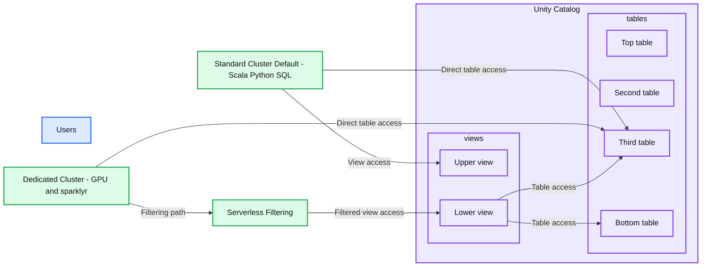
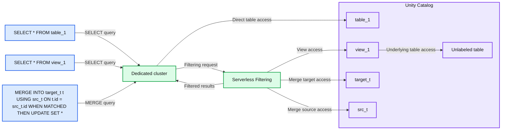
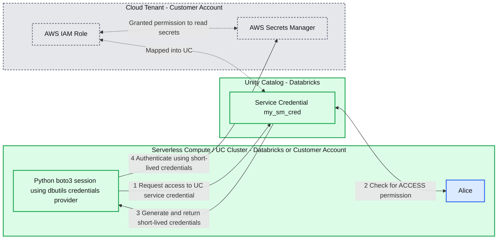

# What’s new in Unity Catalog Compute

*Simplified cluster creation, fine-grained access control everywhere, and service credentials!*

- Source: https://www.databricks.com/blog/whats-new-unity-catalog-compute
- Published: 2025-03-20
- Authors: Stefania Leone, Jakob Mund, Martin Grund, Scott Van Woudenberg, Nemanja Borić, Kelly Albano, Maria Timbur
- Categories: platform, product, engineering, data-engineering
- Images: 6 total, 3 extracted as architecture

**Key takeaways**

- Cluster creation is now simpler with clearer access modes: Standard (Shared), Dedicated (Single-User), and a new Auto mode for optimal selection.
- Dedicated clusters now allow group sharing and more control over access.
- Unity Catalog Service Credentials are now available for managing access to external cloud services securely.

We’re making it easier than ever for Databricks customers to run secure, scalable Apache Spark™ workloads on Unity Catalog Compute with [Unity Catalog Lakeguard](https://www.databricks.com/blog/unity-catalog-lakeguard-industry-first-and-only-data-governance-multi-user-apachetm-spark). In the past few months, we’ve simplified cluster creation, provided fine-grained access control everywhere, and enhanced service credential integrations—so that you can focus on building workloads, instead of managing infrastructure.

What’s new? Standard clusters (formerly shared) are the new default classic compute type, already trusted by over 9,000 Databricks customers. Dedicated clusters (formerly single-user) support fine-grained access control and can now be securely shared with a group. Plus, we’re introducing Unity Catalog Service Credentials for seamless authentication with third-party services.

Let’s dive in!

## Simplified Cluster Creation with Auto Mode

Databricks offers two classic compute access modes secured by Unity Catalog Lakeguard:

- **Standard Clusters** Databricks’ default multi-user compute for workloads in Python, Scala, and SQL. Standard clusters are the base architecture for Databricks’ serverless products.
- **Dedicated Clusters:** Compute designed for workloads requiring privileged machine access, such as ML, GPU, and R, exclusively assigned to a single user or group.

**Summary:** Standard and dedicated clusters access Unity Catalog views and tables, with a serverless filtering path for dedicated clusters.

**Components:**
- Users: unlabeled group and laptop icon.
- Standard Cluster Default: Scala, Python, and SQL compute.
- Dedicated Cluster: GPU and sparklyr compute.
- Serverless Filtering: filtering compute between the dedicated cluster and a Unity Catalog view.
- Unity Catalog: container with two view icons and four table icons under the labels views and tables.

**Flows:**
- Standard Cluster -> upper view: view access.
- Standard Cluster -> third table: direct table access.
- Dedicated Cluster -> third table: direct table access.
- Dedicated Cluster -> Serverless Filtering: access routed through filtering.
- Serverless Filtering -> lower view: filtered view access.
- Lower view -> third table: table access.
- Lower view -> bottom table: table access.

**Numbers:** none

source image: https://www.databricks.com/sites/default/files/inline-images/unity-catalog-compute-blog-img-1.png

Along with updated access mode names, we’re also rolling out **Auto mode**, a smart new default selector that automatically picks the recommended compute access mode based on your cluster’s configuration. The redesigned UI simplifies cluster creation by incorporating Databricks-recommended best practices, helping to set up clusters more efficiently and with greater confidence. Whether you're an experienced user or new to Databricks, this update ensures that you automatically choose the optimal compute for your workloads. Please see our documentation ([AWS](https://docs.databricks.com/aws/en/compute/simple-form#access-mode-updates), [Azure](https://learn.microsoft.com/en-us/azure/databricks/compute/simple-form#access-mode-updates), [GCP](https://docs.databricks.com/gcp/en/compute/simple-form#access-mode-updates)) for more information.

## Dedicated clusters: Fine-grained access control and sharing

Dedicated clusters used for workloads requiring privileged machine access, now support fine-grained access control and can be shared with a group!

### Fine-grained access control (FGAC) on dedicated clusters is GA

Starting with Databricks Runtime (DBR) 15.4, dedicated clusters support secure READ operations on tables with row- and column-level masking (RLS/CM), views, dynamic views, materialized views, and streaming tables. We are also adding support for WRITES to tables with RLS/CM using MERGE INTO - [sign-up for the private preview](https://docs.google.com/forms/d/e/1FAIpQLScGKUI-gYrhTLujTIqzrHef9g4Q-pQ4aUWocUfOZh0H-t0kdw/viewform)!

**Summary:** A dedicated cluster accesses Unity Catalog tables directly or through serverless filtering for view queries and MERGE operations.

**Components:**
- `SELECT * FROM table_1`: SQL table query.
- `SELECT * FROM view_1`: SQL view query.
- `MERGE INTO target_t t USING src_t ON t.id = src_t.id WHEN MATCHED THEN UPDATE SET *`: SQL merge statement.
- Dedicated cluster: query compute.
- Serverless Filtering: serverless compute.
- Unity Catalog: container for the depicted tables and view.
- `table_1`: table in Unity Catalog.
- `view_1`: view in Unity Catalog.
- Unlabeled table: table connected to `view_1`.
- `target_t`: merge target table.
- `src_t`: merge source table.

**Flows:**
- Table query -> Dedicated cluster: SELECT query.
- View query -> Dedicated cluster: SELECT query.
- Merge statement -> Dedicated cluster: MERGE query.
- Dedicated cluster -> `table_1`: direct table access.
- Dedicated cluster -> Serverless Filtering: filtering request.
- Serverless Filtering -> Dedicated cluster: filtered results.
- Serverless Filtering -> `view_1`: view access.
- `view_1` -> Unlabeled table: underlying table access.
- Serverless Filtering -> `target_t`: merge target access.
- Serverless Filtering -> `src_t`: merge source access.

**Numbers:** No quantitative numbers, units, percentages, or sizes. The digit `1` appears in the identifiers `table_1` and `view_1`.

source image: https://www.databricks.com/sites/default/files/inline-images/unity-catalog-compute-blog-img-3.png

Since Spark [overfetches data](https://www.databricks.com/blog/unity-catalog-lakeguard-industry-first-and-only-data-governance-multi-user-apachetm-spark) when processing queries accessing data protected by FGAC, such queries are transparently processed on serverless background compute to ensure that only data respecting UC permissions is processed on the cluster. Serverless filtering is priced at the rate of serverless jobs - you'll pay based on the compute resources you use, ensuring a cost-effective pricing model.

FGAC will automatically work when using DBR 15.4 or later with Serverless compute enabled in your workspace. For detailed guidance, refer to the Databricks FGAC documentation ([AWS](https://docs.databricks.com/aws/en/compute/single-user-fgac), [Azure](https://learn.microsoft.com/en-us/azure/databricks/compute/single-user-fgac), [GCP](https://docs.databricks.com/gcp/en/compute/access-mode-limitations)).

### Sharing dedicated clusters to a group is now GA

We’re excited to announce that dedicated clusters can now be shared with a group, so that for example a data scientist team can share a cluster using the machine learning runtime and GPUs for development. This enhancement reduces administrative toil and lowers costs by eliminating the need for provisioning separate clusters for each user.

Due to privileged machine access, dedicated clusters are “single-identity” clusters: they run using either a user or group identity. When assigning the cluster to a group, group members can automatically attach to the cluster. The individual user’s permissions are adjusted to the group’s permissions when running workloads on the dedicated cluster, enabling secure sharing of the cluster across members of the same group.

Audit logs for commands executed on a dedicated cluster shared with a group capture both the group that executed the command (run_as) and whose permissions were used for the execution, and the user who run the command (run_by), in the new identity_metadata column of the audit system table, as illustrated below.

The ability to assign all-purpose and jobs compute resources to a group on dedicated clusters is now generally available when using DBR 15.4 or later, on [AWS](https://docs.databricks.com/aws/en/compute/group-access), [Azure](https://learn.microsoft.com/en-us/azure/databricks/compute/group-access), and [GCP](https://docs.databricks.com/gcp/en/compute/group-access). 

## Introducing Service Credentials for Unity Catalog compute

Unity Catalog Service Credentials, now generally available on [AWS](https://docs.databricks.com/aws/en/connect/unity-catalog/cloud-services/service-credentials), [Azure](https://learn.microsoft.com/en-us/azure/databricks/connect/unity-catalog/cloud-services/service-credentials), [GCP](https://docs.databricks.com/gcp/en/connect/unity-catalog/cloud-services/service-credentials), provide a secure, streamlined way to manage access to external cloud services (e.g., AWS Secrets Manager, Azure Functions, GCP Secrets Manager) directly from within Databricks. UC Service Credentials eliminate the need for instance profiles on a per-compute basis. This enhances security, reduces misconfigurations, and allows per-user access control (service credentials) instead of per-machine access control to cloud services (instance profiles).

Service credentials can be managed via UI, API, or Terraform. They support all Unity Catalog compute (Standard and Dedicated clusters, SQL warehouses, Delta Live Tables (DLT) and serverless compute). Once configured, users can seamlessly access cloud services without modifying existing code, simplifying integrations and governance.

**Summary:** Unity Catalog service credentials let Alice’s compute session obtain short-lived AWS credentials and access Secrets Manager through a mapped IAM role.

**Components:**
- Serverless Compute / UC Cluster: compute in a Databricks or customer account.
- Alice: user accessing the Unity Catalog service credential.
- Python session: uses `boto3`, `botocore_session`, and `dbutils.credentials.getServiceCredentialsProvider('my_sm_cred')` to create a Secrets Manager client and call `get_secret_value`.
- Unity Catalog: Databricks service containing the service credential `my_sm_cred`.
- Cloud Tenant: customer AWS account containing the IAM role and Secrets Manager.
- IAM Role: AWS role mapped into Unity Catalog and granted permission to read secrets.
- Secrets Manager: AWS service accessed for `MySecretName` in `us-east-1`.

**Flows:**
- Python session -> Service Credential: request access to the UC service credential.
- Service Credential -> Alice: check for ACCESS permission, shown with a bidirectional arrow.
- Service Credential -> Python session: generate and return short-lived credentials.
- Python session -> Secrets Manager: authenticate using short-lived credentials.
- IAM Role -> Service Credential: role mapped into Unity Catalog, shown with a dashed bidirectional connection.
- IAM Role -> Secrets Manager: granted permission to read secrets, shown with a dashed bidirectional connection.

**Numbers:** Step numbers 1, 2, 3, and 4 appear on the flows and in the legend. Code identifiers contain `3` in `boto3` and `1` in `us-east-1`.

source image: https://www.databricks.com/sites/default/files/inline-images/unity-catalog-compute-blog-img-5.png

To try out UC Service Credentials, go to *External Data* > *Credentials* in Databricks Catalog Explorer to configure service credentials. You can also automate the process using the Databricks API or Terraform. Our official documentation pages ([AWS](https://docs.databricks.com/aws/en/connect/unity-catalog/cloud-services/service-credentials), [Azure](https://learn.microsoft.com/en-us/azure/databricks/connect/unity-catalog/cloud-services/service-credentials), [GCP](https://docs.databricks.com/gcp/en/connect/unity-catalog/cloud-services/service-credentials)) provide detailed instructions.

## What’s coming next

In the coming months, we have some exciting updates coming:

- We are extending **support for fine-grained access controls** on dedicated clusters to be able to write to tables with RLS/CM using MERGE INTO - [sign-up for the private preview](https://docs.google.com/forms/d/e/1FAIpQLScGKUI-gYrhTLujTIqzrHef9g4Q-pQ4aUWocUfOZh0H-t0kdw/viewform)!
- **Single node configuration** for standard clusters will allow you to configure small jobs, clusters or pipelines to only use one machine to reduce startup time and save costs
- **New features for UC Python UDFs** (available on all UC compute)
  - Use custom dependencies for UC Python UDFs, from PyPi or a wheel from UC volumes or cloud storage
  - Secure authentication to cloud services using UC service credentials
  - Improve performance by processing batches of data using vectorized UDFs
- We will expand ML support on Standard clusters, too! You will be able to run **SparkML** workloads on standard clusters - [sign-up for the private preview](https://docs.google.com/forms/d/e/1FAIpQLSdHd1wnT4nIE0cSZmtTSGANUx4A7MwmDL5Tpj_vgKCHn3UX3g/viewform).
- Updates to [UC Volumes](https://www.databricks.com/blog/announcing-general-availability-unity-catalog-volumes):
  - Cluster Log Delivery to Volumes([AWS](https://docs.databricks.com/aws/en/compute/configure#cluster-log-delivery), [Azure](https://learn.microsoft.com/en-gb/azure/databricks/compute/configure), [GCP](https://docs.databricks.com/gcp/en/compute/configure)) is available in Public Preview on all 3 clouds. You can now configure cluster log delivery to a Unity Catalog Volume destination for UC-enabled clusters with Shared or Single-user access mode. You can use the UI or API for configuration.

  - **You can now upload and download files of any size to UC Volumes using the [Python SDK](https://databricks-sdk-py.readthedocs.io/en/latest/)**. The previous 5 GB limit has been removed—your only constraint is the cloud provider’s maximum size limit. This feature is currently in Private Preview, with support for Go and Java SDKs, as well as the Files API, coming soon.

## Getting started

Check out these capabilities using the latest Databricks Runtime release. To learn more about compute best practices for running Apache Spark™ workloads, please refer to the compute configuration recommendation guides ([AWS](https://docs.databricks.com/aws/en/compute/cluster-config-best-practices), [Azure](https://learn.microsoft.com/en-us/azure/databricks/compute/cluster-config-best-practices), [GCP](https://docs.databricks.com/gcp/en/compute/configure)).
