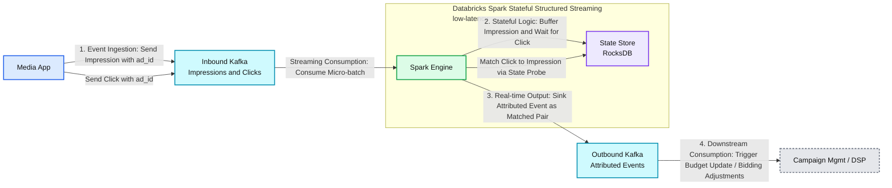
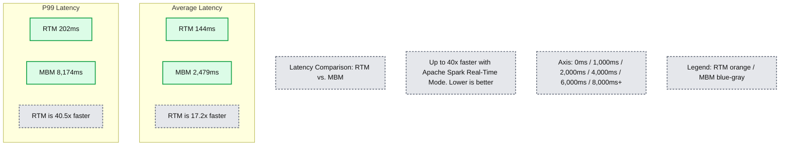

# Why Apache Spark Real-Time Mode is a game changer for ad attribution

*Achieve sub-second latency and eliminate infrastructure complexity by building stateful ad attribution pipelines entirely in Apache Spark*

- Source: https://www.databricks.com/blog/why-apache-spark-real-time-mode-game-changer-ad-attribution
- Published: 2026-02-09
- Authors: Craig Lukasik, Johanna Hughes, Dattatraya Walake
- Categories: engineering, data-streaming
- Images: 2 total, 2 extracted as architecture

**Key takeaways**

- Explore how Apache Spark™ Real-Time Mode enables millisecond-latency operational streaming workloads for ad attribution
- Learn how transformWithState powers scalable, stateful event correlation without external streaming engines, including timers, TTLs, and late data handling
- See how Databricks simplifies real-time architectures with unified governance, performance, and developer experience, built entirely on Spark Structured Streaming

Apache Spark™ Structured Streaming [Real-Time Mode](https://docs.databricks.com/aws/en/structured-streaming/real-time), [announced in the summer of 2025](https://www.databricks.com/blog/introducing-real-time-mode-apache-sparktm-structured-streaming), unlocks sub-second latency use cases across industries. This article explores an AdTech use case and how real-time mode, coupled with another recent Spark enhancement ([transformWithState](https://www.databricks.com/blog/introducing-transformwithstate-apache-sparktm-structured-streaming)), can be used to **achieve sub-second latency** delivery of advertising event data. 

By eliminating the need for an external streaming engine in low-latency use cases, Databricks customers can now benefit from a simplified stack, unified governance, and seamless integration with other Databricks capabilities. By delivering on its mission to democratize data and AI, enterprises can deliver business value more quickly, with less complexity and risk.

## Use Case Overview

### From Couch to Click: The Split-Second World of Streaming Ad Attribution

Picture this: you’re streaming your favorite ad-supported show. The moment an ad break begins, a rapid chain of events unfolds in the background—ad requests are fired based on viewer profiles, auctions run in real-time, and winning creatives are delivered in milliseconds. But serving the ad is just the start. 

Every impression must be stitched together with downstream signals, such as clicks, view completions, or purchases. Only when these events are correlated in real time can advertisers measure true performance and ensure accurate billing—an attribution challenge that demands both speed and precision. In the programmatic advertising sector, effectively managing ad inventory necessitates sub-second latency. 

Advertising contracts typically mandate a specific number of impressions (for instance, a shoe company seeking one million household views for a new ad). As soon as this contractual obligation is fulfilled, subsequent ad slots can be sold to a different bidder. This impression-matching operation occurs on a massive scale. Top streaming platforms handle millions of simultaneous ad events, frequently accumulating hundreds of terabytes of data daily, all while adhering to stringent latency standards. 

**Summary:** A media app sends impressions and clicks through Kafka to stateful Spark processing backed by RocksDB, then publishes attributed events for campaign budget and bidding adjustments.

**Components:**
- Media App: event producer; technology unspecified.
- Inbound Kafka: Apache Kafka carrying impressions and clicks.
- Spark Engine: Databricks Spark Stateful Structured Streaming, labeled low-latency.
- State Store: RocksDB holding attribution state.
- Outbound Kafka: Apache Kafka carrying attributed events.
- Campaign Mgmt / DSP: downstream campaign management and demand-side platform; technology unspecified.
- Processing stages: Event Ingestion, Streaming Consumption, Stateful Logic, Real-time Output, and Downstream Consumption.

**Flows:**
- Media App -> Inbound Kafka: send impression with ad_id.
- Media App -> Inbound Kafka: send click with ad_id.
- Inbound Kafka -> Spark Engine: consume micro-batch.
- Spark Engine -> State Store: buffer impression while waiting for a click.
- Spark Engine -> State Store: match click to impression via state probe.
- Spark Engine -> Outbound Kafka: sink attributed event containing the matched pair.
- Outbound Kafka -> Campaign Mgmt / DSP: trigger budget update / bidding adjustments.

**Numbers:** Stage numbers: 1. Event Ingestion; 2. Stateful Logic; 3. Real-time Output; 4. Downstream Consumption. No quantitative measurements are visible.

source image: https://www.databricks.com/sites/default/files/inline-images/Overall-process.png

### Ad Event Processing Fundamentals

Modern programmatic advertising isn't just about moving data; it's about correlating independent, high-velocity event streams in near real-time. A typical pipeline must ingest and harmonize three distinct signals:

- **Ad Requests (The Intent):** Generated the moment a user starts streaming. These payloads are rich in correlation keys (such as device IDs) and auction metadata required to sell the slot.
- **Ad Impressions (The Delivery):** The crucial "ack" signal fired when the ad is successfully rendered on the viewer's device.
- **Callback Events (The Outcome): **The downstream interactions that drive billing and optimization, such as clicks, view completions, or conversions.

**The Correlation Challenge: **The complexity lies in stitching these disparately timed events together. This is not a simple stateless join; it is a sophisticated stateful operation that must:

- **Bridge asynchronous timelines: **Match an "Impression" to a "Request" that may have occurred seconds or minutes earlier.
- **Resist network chaos: **Gracefully handle late-arriving events caused by client-side latency or network partitions.
- **Manage state lifecycle: **Enforce strict expiration policies (TTLs or timer-based state eviction) to prevent memory bloat from unclosed sessions.
- **Scale elasticity: **Process millions of events per second during major live sports or broadcast premieres.

### Legacy Implementations

For years, engineers faced a brutal choice: the simplicity of Spark for analytics, or the speed of specialized engines for operations. You couldn't have both. To hit sub-second SLAs, teams were forced to glue together fragmented stacks—often maintaining massive dedicated state stores just to track ad impressions.

**Real-world complexity: **One major media provider currently maintains a 170-node HBase cluster solely to manage state for their legacy ad platform. This isn't just expensive, it creates a governance nightmare where operational data is siloed away from the analytical lakehouse.

## Real-Time Mode for Operational Workloads: A New Era for Spark

Now Spark can address the entire spectrum of streaming use cases. With Real-Time Mode (RTM) in Apache Spark Structured Streaming, combined with the powerful transformWithState operator, we're witnessing the convergence of analytical and operational streaming capabilities within a single, unified platform. For the first time, teams can build sophisticated, low-latency ad attribution pipelines entirely within the Spark ecosystem.

### What is Real-Time Mode?

Real-time mode represents a fundamental architectural evolution in Spark Structured Streaming. Unlike traditional micro-batching, Real-time mode processes events continuously as they arrive, achieving p99 latencies as low as the single-digit milliseconds. Databricks benchmarks demonstrate remarkable performance characteristics:

- **P99 latencies: **Single-digit milliseconds to ~300ms depending on workload complexity
- **Throughput:** Maintains high processing rates while maintaining consistent low latency
- **Consistency: **Reliable sub-second performance across varying load patterns

This breakthrough enables Spark to compete directly with specialized streaming engines for the most demanding operational workloads, while maintaining the familiar DataFrame APIs and rich ecosystem integration that makes Spark so powerful for analytical use cases.

#### Spoiler Alert: Simplicity is the Star of the Show

Teams can enable Real-Time Mode with a single configuration change — no rewrites or replatforming required — while keeping the same Structured Streaming APIs they use today. All you need to do is apply the new trigger interval, as follows:

## Advantages of Real-Time Mode with transformWithState

The[transformWithState operator](https://www.databricks.com/blog/introducing-transformwithstate-apache-sparktm-structured-streaming) provides the sophisticated state management capabilities required for complex event correlation, a core requirement for the Ad Attribution use case. Key features of transformWithState include Object-Oriented State Management, Composite Data Types, Timer-Driven Logic, Automatic TTL Support, and Schema Evolution.
 

## Code Example: Building a Real-Time Ad Attribution Pipeline

### Pipeline Architecture Overview

A production ad attribution pipeline built on real-time mode follows this high-level architecture:

1. **Event Ingestion:** High-throughput Kafka topics receive ad requests, impressions, and callback events from distributed ad servers and client applications.
2. **Stateful Correlation: **transformWithState operators maintain correlation state, matching impressions to requests based on user sessions, campaign identifiers, and temporal windows.
3. **Attribution Logic:** Custom StatefulProcessor implementations apply business rules for attribution modeling, handling complex scenarios like view-through attribution and multi-touch attribution.
4. **Output Generation: **Matched attribution events are written to downstream Kafka topics for real-time campaign optimization and offline analytical processing.

### Implementation Deep-Dive

To explore an in-depth technical explanation of example code that you can run and observe RTM's performance, read this [Databricks Community blog](https://community.databricks.com/t5/technical-blog/apache-spark-s-real-time-mode-use-case-focus-ad-attribution/ba-p/146141). The source code in that blog post produces a benchmark chart like the one shown below, and the numbers illustrate the significant latency differences between micro-batch mode (MBM) and the new real-time mode (RTM):

**Summary:** Apache Spark Real-Time Mode has lower average and P99 latency than micro-batch mode, with reported speedups of 17.2x and 40.5x respectively.

**Components:**
- RTM: Apache Spark Real-Time Mode, represented by orange bars.
- MBM: Apache Spark micro-batch mode, represented by blue-gray bars.
- Average Latency: Comparison of mean latency for RTM and MBM.
- P99 Latency: Comparison of 99th-percentile latency for RTM and MBM.

**Flows:**
- none. No arrows are visible.

**Numbers:**
- Headline: Up to 40x faster; lower is better.
- Average latency: RTM 144ms; MBM 2,479ms; RTM is 17.2x faster.
- P99 latency: RTM 202ms; MBM 8,174ms; RTM is 40.5x faster.
- Axis labels: 0ms, 1,000ms, 2,000ms, 4,000ms, 6,000ms, 8,000ms+.

source image: https://www.databricks.com/sites/default/files/inline-images/RTM-Ad-Atttribtuion-bar-chart-horizontal.png

### State Management Strategy

Effective ad attribution requires sophisticated state management strategies:

- **Request Tracking: **Maintain active ad request state indexed by user session and campaign identifiers, with automatic expiration based on attribution windows.
- **Impression Correlation: **Match incoming impressions to tracked requests using composite keys, handling scenarios where multiple impressions may match a single request.
- **Late Event Handling: **Watermarking, combined with stateful processing, enforces late arrival policies to strike a balance between attribution accuracy, processing latency requirements, and system stability.
- **State Optimization: **Leverage transformWithState to achieve efficient state operations, which is particularly important at high event volumes.

### Production Considerations

#### Performance and Monitoring

Because Real-Time Mode fundamentally changes the execution model from periodic micro-batches to continuous processing, engineers must adapt their observability strategy to prioritize tail latency and stability over simple averages.

- **Latency Metrics: **Track end-to-end processing times with percentile distributions rather than average latencies.
- **Throughput Patterns: **Observe processing rates across varying load conditions and traffic spikes.
- **Error Recovery:** Implement proper exception handling within StatefulProcessor implementations.

## Conclusion

The introduction of real-time mode in Apache Spark™ Structured Streaming marks a pivotal moment in the evolution of stream processing. For the first time, organizations can build sophisticated, millisecond-latency operational workloads – like real-time ad attribution – entirely within the Spark ecosystem.

This breakthrough eliminates the architectural fragmentation that has long plagued data engineering teams. You no longer must choose between Spark's analytical power and specialized engines’ operational performance. With real-time mode and transformWithState, you can build unified pipelines that seamlessly bridge analytical and operational requirements.

The implications extend beyond technical capabilities. Teams can now:

- **Consolidate Infrastructure: **Reduce operational overhead by eliminating specialized streaming engines.
- **Accelerate Development: **Leverage existing Spark expertise across all streaming use cases.
- **Improve Reliability: **Benefit from Spark's mature fault tolerance and ecosystem integration.
- **Enable Innovation: **Focus on business logic rather than managing fragmented architectures.

Ready to revolutionize your real-time processing architecture? Real-time mode is available now in [Public Preview](https://docs.databricks.com/aws/en/structured-streaming/real-time) on Databricks Runtime 16.4 LTS and above. We recommend using the latest [DBR LTS](https://docs.databricks.com/aws/en/release-notes/runtime/databricks-runtime-ver#lts)version to take advantage of the latest platform improvements. Start building next-generation streaming applications today and discover the power of millisecond-latency processing with the simplicity and scale of Apache Spark™.

## FAQs

**What is Structured Streaming in Apache Spark™? **
Structured Streaming is Apache Spark’s stream processing framework that processes unbounded data incrementally using the same DataFrame and Dataset APIs as batch workloads, with Spark managing execution and fault tolerance.

**Where can I find the Structured Streaming Programming Guide for Spark 4.0.0 and later? **
As of Spark 4.0.0, the guide has been divided into smaller pages available [here](https://spark.apache.org/docs/latest/streaming/index.html).

**What is the difference between Kafka Streams and Spark Structured Streaming?**
Kafka streams and Spark Structured Streaming are two separate systems that serve different use cases. Kafka Streams is a lightweight stream processing library designed to build applications that process data stored in Kafka topics, typically embedded directly within Kafka client applications. Spark Structured Streaming is a distributed stream processing engine designed for large-scale analytics, stateful processing, and integration with diverse data sources and sinks beyond Kafka, including files, databases, and data lakes.

**What is the difference between Spark Streaming (DStreams) and Apache Spark Structured Streaming?**
Spark Structured Streaming is the modern and recommended streaming engine in Apache Spark. It uses DataFrame and Dataset APIs to provide a unified programming model for batch and streaming workloads, The older Spark Streaming API based on DStreams is considered legacy. [Spark recommends migrating to Structured Streaming](https://spark.apache.org/docs/latest/api/python/reference/api/pyspark.streaming.StreamingContext.html) and avoiding new development using DStreams.
