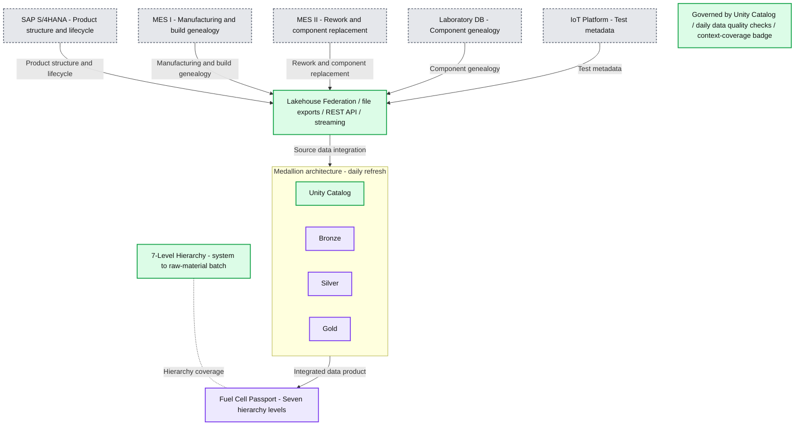
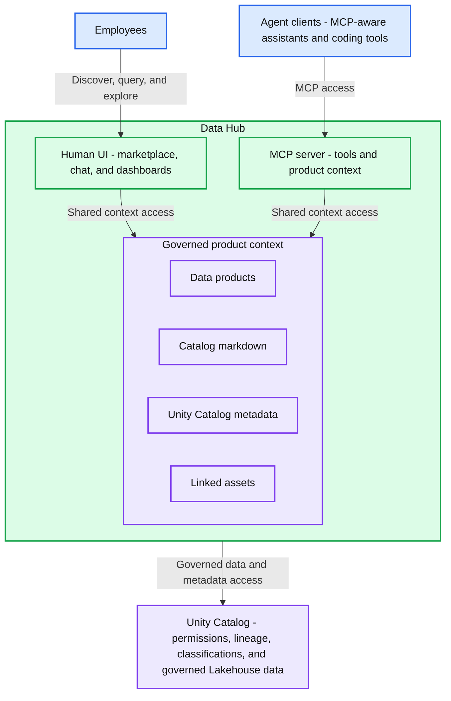
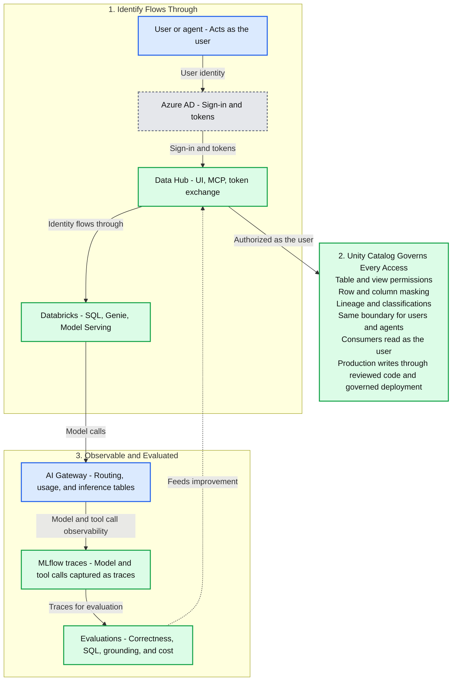

# Why R&D Data Belongs in the Lakehouse - and Why Agents Need It There

*How four years of Unity Catalog discipline, Lakehouse Federation, and data product engineering became a governed AI context layer with one UI for humans and an MCP server for agents.*

- Source: https://www.databricks.com/blog/why-rd-data-belongs-lakehouse-and-why-agents-need-it-there
- Published: 2026-07-21
- Authors: Sebastian Eberhardt, Dominik Bentele, Jonathan Bräuer
- Categories: platform, solutions, engineering, data-science-machine-learning, industries, manufacturing, data-strategy, industry-insights, company, customers
- Images: 3 total, 3 extracted as architecture

**Key takeaways**

- Cellcentric’s Data Hub is a governed context layer for data and AI, built on Databricks using Unity Catalog and Lakehouse Federation, which provides a single user interface for employees and an MCP server for agents.
- It solves the core data engineering problem of integrating scattered R&D data from various source systems (like IoT telemetry, SAP, and MES) into a unified, AI-ready product, which is the hard requirement for industrial AI.
- By making documentation a first-class quality metric, the platform dramatically accelerates complex R&D investigations from weeks to days, delivering cumulative value as each new data product adds reviewed business context to the platform.

## The setup

At cellcentric, a joint venture of Daimler Truck and Volvo Group, we develop and build hydrogen fuel cell systems for heavy-duty applications. Our work is R&D-heavy, engineering-heavy, and data-heavy. The questions our teams ask rarely fit inside one source system. They cross product hierarchy, manufacturing history, rework, laboratory evidence, test telemetry, and domain knowledge.

That is the central challenge for industrial AI in R&D. An agent is only useful if it can reason over the same governed context an engineer needs to trust an answer: where the data came from, what it means, how complete it is, which caveats matter, and whether the user is allowed to see it. Turning that into AI-ready context starts with data engineering before model selection.

That is why we spent the last four years building our data foundation on Azure and Databricks. Unity Catalog was part of the architecture from the beginning. Lakehouse Federation brought on-premises SQL sources into the lakehouse pattern. Delta Sharing helped us exchange data across boundaries. Declarative Automation Bundles gave us a production path for pipelines and data products. The result is the **Data Hub**: our governed context layer for data and AI, with a user interface for employees and an MCP server for agents.

The Data Hub began as a data products platform. In hindsight, that foundation is exactly why it works as an AI platform.

## The Fuel Cell Passport

The foundation is easiest to explain through one data product: the **Fuel Cell Passport**. It brings together five enterprise source systems, including SAP S/4HANA, two MES systems for manufacturing and rework, a laboratory database, and an IoT telemetry platform. It models seven hierarchy levels from system down to raw-material batch, refreshes daily, and uses a state-based temporal model so teams can answer both point-in-time configuration questions and full rework-history questions. Daily data quality checks monitor whether the product is complete enough to support engineering, quality, and manufacturing investigations. The name reflects the traceability and lifecycle concepts of a product passport, but the Fuel Cell Passport is an internal engineering data product - not a regulatory compliance artifact like the EU Digital Product Passport (DPP), though the same traceability foundation would support one.

*Figure 1: Five enterprise source systems converge through Unity Catalog into the Fuel Cell Passport data product.*

**Summary:** Five enterprise systems feed a Unity Catalog-governed medallion architecture that produces a Fuel Cell Passport covering seven hierarchy levels.

**Components:**

- SAP S/4HANA: product structure and lifecycle.
- MES I: manufacturing and build genealogy; technology unspecified.
- MES II: rework and component replacement; technology unspecified.
- Laboratory DB: component genealogy; database technology unspecified.
- IoT Platform: test metadata; technology unspecified.
- Integration: Lakehouse Federation, file exports, REST API, and streaming.
- Unity Catalog: governance for the lakehouse and data product.
- Bronze: medallion storage layer.
- Silver: medallion storage layer.
- Gold: medallion storage layer.
- Medallion architecture: daily refresh.
- Fuel Cell Passport: data product with seven hierarchy levels.
- 7-Level Hierarchy: system to raw-material batch.
- Governance label: Unity Catalog, daily data quality checks, and context-coverage badge.

**Flows:**

- SAP S/4HANA -> shared integration: product structure and lifecycle.
- MES I -> shared integration: manufacturing and build genealogy.
- MES II -> shared integration: rework and component replacement.
- Laboratory DB -> shared integration: component genealogy.
- IoT Platform -> shared integration: test metadata.
- Shared integration -> Unity Catalog-governed medallion architecture: source data through Lakehouse Federation, file exports, REST API, or streaming.
- Medallion architecture -> Fuel Cell Passport: integrated data product.
- 7-Level Hierarchy -> Fuel Cell Passport: dashed association showing coverage from system to raw-material batch.

**Numbers:**

- SAP S/4HANA: numeral 4 within the product name.
- MES I and MES II: source identifiers I and II.
- 7-Level Hierarchy and Seven hierarchy levels: seven levels.
- Daily refresh: daily cadence.
- Daily data quality checks: daily cadence.

source image: https://www.databricks.com/sites/default/files/inline-images/2026-06-Blog-Why-R-D-Data-Belongs-in-the-Lakehouse-and-Why-Agents-Need-It-There-Inline-960x493-2x.png

Figure 1: Five enterprise source systems converge through Unity Catalog into the Fuel Cell Passport data product.

That sounds like a conventional lakehouse success story: integrate the sources, model the domain, govern access, make the data reusable. For AI, the structural point is the attached context: a governed product around the modeled data.

## Context as a quality metric

Unity Catalog gives us the governed structure: tables, columns, ownership, lineage, classifications, and permissions. The Data Hub adds the product layer around it. A data product combines ownership, lifecycle state, domain assignment, linked governed assets, and context entries that explain what the product is for and how it should be used.

That distinction matters for AI. Agents need more than schema metadata, and they need more than a document. They need to understand which business questions a data product supports, how the important tables relate, what caveats matter, and which surrounding assets should be used with it. We persist that richer context in the data product layer, including extensive markdown catalog entries that are written during the development process while the project context is still fresh.

This changed how we think about data quality. Completeness and freshness still matter, but they are no longer enough. For AI-ready data, context coverage has become a first-class quality metric.

In our marketplace, every data product carries a context-coverage badge. It shows whether table descriptions are present and how much column-level documentation exists across the product's attached tables. The badge made the metric visible and actionable. Coverage went up because engineers could see the gap directly in the product surface where the data would be consumed.

The metric is not a claim that every semantic ambiguity has been solved. It is a practical proxy that makes missing context visible early enough to fix. Historically, **context coverage** improved because the badge turned documentation from an after-the-fact cleanup task into something engineers could see, measure, and improve as part of delivery.

Today, we have 27 published data products, all with rich markdown documentation. Published products average 90% column-comment coverage, with most column comments AI-assisted during data engineering work and reviewed by the engineer before merge. The catalog entry adds another layer of context: a long-form markdown summary of the development workflow, the domain decisions, the table relationships, the caveats, and the intended ways to consume the product.

The important shift is that documentation becomes part of the engineering workflow, then becomes available as structured product context for the next human or agent that needs to reason over the data.

## One UI for humans, one MCP for agents

The Data Hub is the layer that makes that substrate consumable. For human users, it is a marketplace and workbench. Employees can discover data products, see owners and lifecycle status, open linked dashboards and apps, query Unity Catalog-governed data, and use a chat interface for natural-language exploration. For AI clients, the same context is exposed through MCP. Any MCP-aware coding agent or assistant can access the same Unity Catalog metadata and data product context that the Data Hub uses.

*Figure 2: Employees and MCP-aware agents consume the same Data Hub context layer through different interfaces.*

**Summary:** Employees and MCP-aware agent clients access the same governed product context through the Data Hub's Human UI and MCP server, backed by Unity Catalog.

**Components:**

- Employees: Discover, query, and explore data products.
- Agent clients: MCP-aware assistants and coding tools.
- Data Hub: Contains both interfaces and the shared governed product context.
- Human UI: Marketplace, chat, and dashboards for governed exploration.
- MCP server: Agent-facing access to the same tools and product context using MCP.
- Governed product context: Shared context containing the four elements below.
- Data products: Technology unspecified.
- Catalog markdown: Context written in Markdown.
- Unity Catalog metadata: Metadata from Unity Catalog.
- Linked assets: Technology unspecified.
- Unity Catalog: Permissions, lineage, classifications, and governed Lakehouse data.

**Flows:**

- Employees -> Human UI: Data product discovery, queries, and exploration through the Data Hub.
- Agent clients -> MCP server: MCP access to tools and product context through the Data Hub.
- Human UI -> Governed product context: Access to shared governed context.
- MCP server -> Governed product context: Access to the same shared governed context.
- Data Hub -> Unity Catalog: Access to permissions, lineage, classifications, and governed Lakehouse data.

**Numbers:** none

source image: https://www.databricks.com/sites/default/files/inline-images/2026-06-Blog-Why-R-D-Data-Belongs-in-the-Lakehouse-and-Why-Agents-Need-It-There-Inline-960x658-2x.png

Figure 2: Employees and MCP-aware agents consume the same Data Hub context layer through different interfaces.

## The governance model

The architecture is deliberately built around one operating model. Identity flows through. Data access stays governed. Model and tool calls are observable. Traces and evaluations feed improvement.

This only works because governance was designed into the platform from the beginning. Production ownership, deployment, and consumption are separate concerns. Engineers change pipelines and product definitions through reviewed code and governed deployment paths. Consumers, including agents, do not receive production write identities. They access data through the Data Hub, dashboards, Genie, SQL tools, or MCP using the authenticated user's identity, with Unity Catalog making the final authorization decision.

That distinction is what makes agent access governable. An agent can reason over the same product context a user sees, and it can call tools on the user's behalf, but it cannot become a production writer or bypass Unity Catalog with a shared backend credential. If the user lacks access to a table, masked column, or governed view, the agent receives the same boundary. That operating model lets us allow agents to access data without creating a second, looser path around the platform.

Identity starts in Azure AD and flows through the Data Hub into Databricks using OAuth 2.0 token exchange — the on-behalf-of token passing pattern Databricks describes in its agent governance architecture. A user querying a table through the UI, an agent calling a SQL tool, and a Genie workspace invoked as a governed tool call all operate inside the same permission boundary. If the user cannot access the underlying data, neither can the agent acting on that user's behalf. That is the access model that lets the Data Hub be useful without becoming a parallel governance system.

On the AI side, we run custom agents on Databricks Model Serving, use Claude through Foundation Model APIs, and invoke Genie workspaces as governed tools where they fit. The MCP architecture is hybrid by design: Databricks-managed MCP delivers governed access to Databricks capabilities like Genie tool calls, and our own MCP delivers the richer context layer - Unity Catalog metadata, data product objects, and catalog markdown - plus the business-specific tools agents call on top of it. Agents need both.

*Figure 3: Identity flows through the Data Hub into Databricks, while Unity Catalog, AI Gateway, and MLflow keep agent access governed and observable.*

**Summary:** User identity flows through Azure AD and the Data Hub into Databricks, with Unity Catalog governing access and AI Gateway, MLflow traces, and evaluations supporting observability and improvement.

**Components:**
- User or agent: Acts as the user.
- Azure AD: Sign-in and tokens.
- Data Hub: UI, MCP, and token exchange.
- Databricks: SQL, Genie, and Model Serving.
- Unity Catalog: Governs every access through table and view permissions, row and column masking, and lineage and classifications.
- Access boundary: Users and agents share visibility permissions. Consumers read as the user; production writes use reviewed code and governed deployment.
- AI Gateway: Routing, usage, and inference tables.
- MLflow traces: Captures model and tool calls as traces.
- Evaluations: Checks correctness, SQL, grounding, and cost.
- Stage labels: Identify Flows Through; Unity Catalog Governs Every Access; Observable and Evaluated.

**Flows:**
- User or agent -> Azure AD: User identity for sign-in.
- Azure AD -> Data Hub: Sign-in and tokens.
- Data Hub -> Databricks: Identity through UI, MCP, and token exchange.
- Data Hub -> Unity Catalog: Access authorized as the user.
- Databricks -> AI Gateway: Model calls.
- AI Gateway -> MLflow traces: Model and tool call observability.
- MLflow traces -> Evaluations: Traces for evaluation.
- Evaluations -> Data Hub: Feeds improvement.

**Numbers:** 1, 2, and 3 identify the three stages.

source image: https://www.databricks.com/sites/default/files/inline-images/2026-06-Blog-Why-R-D-Data-Belongs-in-the-Lakehouse-and-Why-Agents-Need-It-There-Inline-960x613-2x.png

Figure 3: Identity flows through the Data Hub into Databricks, while Unity Catalog, AI Gateway, and MLflow keep agent access governed and observable.

## Observability and evaluation

Observability is where the architecture becomes operable. Unity AI Gateway now routes foundation model traffic in our environment. With a small model-client change, Data Hub model calls flow through a single governance and observability layer with usage tracking and inference tables enabled. Because requests and responses land in Unity Catalog Delta tables, they can be analyzed with the same SQL patterns we already use for business data.

MLflow tracing gives us the next layer of visibility. We standardize traces across our agent adapters so each interaction can be inspected as a structured execution path: model calls, tool calls, intermediate steps, and final answers. On top of those traces, we run a continuous evaluation framework with deterministic correctness and SQL-grounding scorers, cache-aware cost scorers, and LLM-judge scorers with domain-expert alignment. The purpose is broader than testing agent changes. The context layer itself needs evaluation: markdown can drift from pipelines and table definitions, system prompts evolve, tool contracts change, and domain assumptions age. Traces and evals let us test the agent, the tools, and the context it relies on together before any of them shape production behavior.

For the first time, the company has a single, governed entry point for employees to discover what data products exist and interact with them in natural language, subject to the same access controls as the underlying data.

## The same pattern, inside the development loop

The same pattern also changed how we build.

Our engineering workflow now includes agents inside the development loop. The exact coding tool is less important than the pattern: an engineer works in an AI-assisted development environment connected to Databricks capabilities and to our own context-layer MCP. When the engineer works on a data product, the agent can inspect relevant Unity Catalog metadata, read existing product documentation, understand nearby project context, and help scaffold pipelines, tests, table descriptions, and markdown catalog entries. The engineer remains responsible for review and merge, but the agent is present while the context is richest.

That timing matters. Documentation written after the fact is often incomplete because the project context has already moved on. Documentation written during development captures the reasoning, definitions, and caveats that make the data useful later — and once reviewed and committed, becomes context for the next workflow.

For many of our R&D and process-development workflows, what used to take weeks of cross-system data integration, KPI definition, and pipeline scaffolding now ships in days. The improvement shows up less as a single automation number and more as shorter time from investigation request to usable data product: fewer manual handoffs between domain experts and data engineers, less repeated source-system integration, faster agreement on KPI definitions, and earlier review of caveats while the context is still fresh. Some categories, especially complex multi-source investigations that demand careful domain review, remain substantial work, just substantially faster. The lasting benefit is cumulative: each product adds reviewed business context to the platform, so the next investigation starts with more of the domain already explained.

Databricks is now productizing parts of this pattern. The Unity AI Gateway Coding CLI, ucode, routes coding tools through AI Gateway and wires MCP servers into the developer workflow. Genie Code brings agentic coding and data work directly into Databricks surfaces.

## Where this goes next

For us, the next wave is to make agents aware of the operational context around the data as well as the tables themselves. In a quality or manufacturing investigation, an agent should be able to retrieve a trend, inspect the data quality checks attached to the product, and bring in related machine alarm logs from the same time window. The answer can then carry the caveat an engineer would expect: the trend points in this direction, but this slice needs caution because completeness was flagged and the operating context was abnormal.

The same idea applies to recurring work. Today, process knowledge is scattered across runbooks, wiki pages, local prompts, scripts, team conventions, and undocumented habits. A Skills Marketplace gives that knowledge the same platform treatment as data products: ownership, review, versioning, lifecycle state, and a central place where agents find the approved way to work. In this context, a skill packages the instructions, approved tools, templates, guardrails, and evaluation checks that tell an agent how a recurring task should be performed in our environment. Concretely, it would live in the marketplace alongside the data products it touches, be versioned and reviewed like code, and be invoked by name so the agent follows the same approved path every time. A skill might scaffold a domain-specific Databricks Asset Bundle in a remote repository, or guide an engineer through registering an IoT device and turning messy machine logs into a bronze pipeline.

That is the broader direction for the Data Hub: take the same lesson from the lakehouse foundation, govern the context first, and apply it to both the data agents query and the work they help perform.

## The takeaway

That is why R&D data belongs in the lakehouse. Industrial AI needs governed context: the data, the meaning, the permissions, the traces, and the feedback loop in one architecture.

For cellcentric, making industrial AI practical means giving agents that context on top of a proven lakehouse foundation. Unity Catalog, data products, identity, observability, and agent workflows work together to let humans and agents reason over R&D data safely. That is more than a best practice for us. It is how we are shaping the next generation of data-driven engineering.
