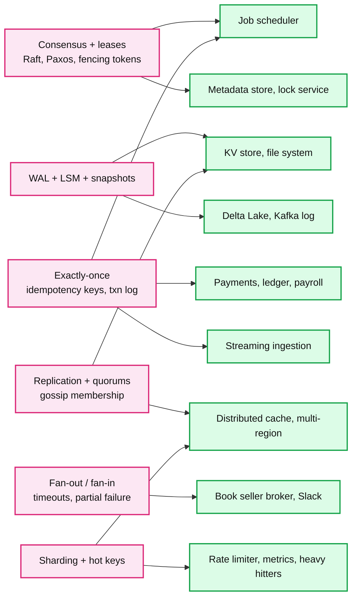
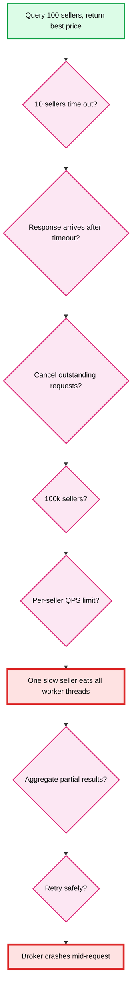

# HLD Practice Index

> One-line answer: 40 problems, tiered by how often they are reported at Databricks, Google, and Rippling, and by how much Staff-level depth they expose. Databricks weighted first.

Sources: two rounds of research. (a) Glassdoor, Blind, LeetCode Discuss, Exponent, Hello Interview, SystemDesignHandbook, DesignGurus (2024 to 2026). (b) A Sep 2026 aggregation of 76 Databricks candidate reports plus Google L6, Meta, and Amazon report collections. Report counts below come from (b). Per-company notes and links are in §5.

Status legend: `todo` | `attempted` (my-attempt.md exists) | `studied` (solution + edge-cases) | `done` (excalidraw drawn, all edge cases confident). See `hld/CLAUDE.md` for the per-problem folder layout.

---

## 1. Concept map

Most problems below are combinations of a small set of hard building blocks. Master the block once in `concepts/`, then reuse it.



### Concept notes in `concepts/`

One page per building block. High-level: every feature of the mechanism, how it is implemented, failure modes, trade-offs, numbers, and the follow-ups an interviewer asks. Source-verified depth lives in `popular_systems_deepdive/`, not here.

| Block | Note | One-liner | Unlocks |
|---|---|---|---|
| C1 Consensus | [`concepts/raft.md`](../concepts/raft.md) | One leader per term appends to a replicated log. Majority ack = committed. Election restriction means a new leader already has every committed entry. | #3 file system, #6 scheduler, #19 metadata store, #33 lock service, #16 Kafka (KRaft) |
| C1 Consensus | [`concepts/paxos.md`](../concepts/paxos.md) | Two majority rounds (prepare, accept). Proposer must adopt the highest accepted value it sees, so a chosen value can never change. Multi-Paxos = Raft with holes allowed and the election left to you. | #19 metadata store (Spanner style), #33 lock service (Chubby), Cassandra LWT in #20 cache |
| C4 Replication, membership | [`concepts/gossip-protocol.md`](../concepts/gossip-protocol.md) | Every node swaps versioned state with a few random peers each round. Reaches all N in log N rounds with no leader. Eventual only, so use it for liveness and hints, never ownership. | #20 cache, #7 throttling, #26 monitoring, #3 file system (chunk server liveness), #5 object store |
| C2 WAL + LSM + snapshots | `concepts/wal-and-lsm.md` | todo | #4, #3, #5, #15, #16 |
| C3 Exactly-once | `concepts/exactly-once.md` | todo | #1, #6, #8, #9, #18, #22 |
| C4 Quorums | `concepts/replication-and-quorums.md` | todo | #3, #4, #19, #20 |
| C5 Fan-out / fan-in | `concepts/fan-out-fan-in.md` | todo | #1, #2, #36 |
| C6 Sharding + hot keys | `concepts/sharding.md` | todo | #7, #20, #24, #30 |

The three written notes share one thread worth saying out loud in any coordination question: Raft and Paxos buy **agreement** with a leader and a quorum. Gossip gives agreement up to get **scale and no single point of failure**. Consul is the textbook split (SWIM gossip for membership, Raft for the catalog), and Cassandra 6.0 moving ring ownership from gossip onto a Paxos log is the cautionary tale.

---

## 2. Ranked problem list

### Tier 1: Databricks reported. Do these first.

| # | Problem | Folder | Reports | Concept under test | Status |
|---|---|---|---|---|---|
| 1 | Book seller broker: query N sellers async, aggregate, return best price | [`book-seller-broker/`](book-seller-broker/) | 22 | Fan-out / fan-in, timeouts, late responses, cancellation, per-seller QPS, slow-seller isolation, broker crash mid-request | studied |
| 2 | Slack / large-scale messaging platform | [`slack-messaging/`](slack-messaging/) | 15 | Per-channel ordering, fan-out to large channels, presence, offline delivery, multi-device sync | studied |
| 3 | Strongly consistent distributed file system without S3 (GFS style) | [`distributed-file-system/`](distributed-file-system/) | 8 | Metadata sharding, chunk replication, consensus, fencing, rename vs delete races, hot directories, DR with RPO/RTO | studied |
| 4 | In-memory KV store with write-ahead log | [`kv-store-wal/`](kv-store-wal/) | 6 | fsync semantics, crash recovery, snapshots, compaction, concurrent readers vs writers | studied |
| 5 | Immutable distributed object store | [`immutable-object-store/`](immutable-object-store/) | reported | Commit point, conditional PUT, range-partitioned metadata + hot prefix, RS(9,6) over 3 AZs and the 1.5x floor, repair window, delete via crypto-shred + compaction | studied |
| 6 | Distributed job scheduler with DAG dependencies | [`distributed-job-scheduler/`](distributed-job-scheduler/) | reported (also Meta, Google as "cron at scale") | Three planes (trigger, orchestration, execution), leased partitions with epochs, one owner per run, event log plus rows in one txn, at-least-once with idempotency key and at-most-once per task, lazy rows and jitter for the midnight second, backfill lane, repair run | studied |
| 7 | Datacenter network throttling / hierarchical rate limiting | [`network-throttling/`](network-throttling/) | reported | Local enforcement vs global counters, batch reporting and leases, overshoot bound, hierarchical max-min fairness, fail-open vs fail-closed per limit, allocator failover | studied |
| 8 | Visa-scale payments + ledger + duplicate payment prevention | [`payments-ledger/`](payments-ledger/) | reported (also Rippling, Stripe) | Idempotency row in the payment txn, attempt id per rail call and reversal on unknown outcome, deterministic entry ids, double-entry invariants, constrained-only balances and single-writer batch for hot accounts, clearing accounts across ledgers, 3-layer reconciliation | studied |
| 9 | Stock trading / order execution system | [`order-execution/`](order-execution/) | reported (also Coinbase) | Sequencer + replicated input log, deterministic single-writer matcher per symbol shard, output log as the only truth, three commit points, buying-power hold across two partition keys, epoch-fenced hot standby, per-session exec report sequencing, broker variant | studied |
| 10 | Ad budget / spend pacing system | `ad-budget-pacing/` | reported | Distributed budget counters, overspend bounds, pacing over the day, eventual reconciliation | todo |
| 11 | Async provisioning system (clusters, VMs) | `async-provisioning/` | reported | Long-running workflows, state machine per resource, idempotent cloud API calls, partial failure cleanup | todo |
| 12 | RAG retrieval service | `rag-retrieval/` | reported | Embedding pipeline, vector index sharding, freshness, hybrid search, latency budget | todo |
| 13 | Google Drive / Dropbox file sync | `file-sync/` | reported (also Google, Dropbox) | Chunking + dedup, delta sync, conflict resolution, metadata DB sharding | todo |
| 14 | Playlist / game transaction service with retry-safe semantics | `playlist-service/` | reported | Idempotent mutations, ordering, optimistic concurrency, small problem that gets mutated | todo |

### Tier 2: Databricks style. Their product in disguise.

| # | Problem | Folder | Asked at | Concept under test | Status |
|---|---|---|---|---|---|
| 15 | Delta Lake: transactional tables over object storage | `delta-lake-transactions/` | Databricks, Snowflake | Optimistic concurrency on a txn log, snapshots, time travel, compaction, schema evolution | todo |
| 16 | Kafka / distributed event log | `distributed-log/` | Databricks, Confluent | Partitions, ISR replication, offsets, retention, exactly-once producer | todo |
| 17 | Multi-tenant distributed SQL query engine (Spark / Photon) | `query-engine/` | Databricks, Snowflake | Execution DAG, shuffle, stragglers, resource isolation, cost per query | todo |
| 18 | Petabyte batch + streaming ingestion | `streaming-ingestion/` | Databricks, Confluent | Checkpoints, late events, backpressure, exactly-once sink, schema drift | todo |
| 19 | Multi-region metadata store with linearizable writes | `multi-region-metadata-store/` | Databricks, Google | Consensus across regions, quorum math, region loss, latency vs consistency | todo |
| 20 | Distributed cache from scratch | `distributed-cache/` | Databricks, Google | Consistent hashing, replication, eviction, hot keys, node failure, invalidation | todo |
| 21 | Autoscaling cluster manager | `cluster-manager/` | Databricks, Google | Bin packing, spot loss, warm pools, preemption | todo |
| 22 | Change data capture pipeline | `cdc-pipeline/` | Databricks | Log ordering, snapshot + stream handoff, exactly-once sink | todo |

### Tier 3: Google L6 and Rippling reported.

| # | Problem | Folder | Asked at | Concept under test | Status |
|---|---|---|---|---|---|
| 23 | Distributed deny / block list | `distributed-denylist/` | Google | Propagation, massive read rate, cache invalidation, consistency window | todo |
| 24 | Global trending hashtags | `trending-hashtags/` | Google | Streaming aggregation, heavy hitters, windows, locality | todo |
| 25 | Global ticket / hotel booking | `ticket-booking/` | Google, Rippling, Airbnb | Contention, inventory locks, overselling, saga vs 2PC, idempotent payment | todo |
| 26 | Server-health monitoring + alerting | `health-monitoring/` | Google | Time-series ingestion, cardinality, fault detection, alert dedup | todo |
| 27 | Google Maps Street View ingestion and storage | `streetview-ingestion/` | Google L6/L7 | Huge objects, spatial indexing, lifecycle, batch pipelines | todo |
| 28 | Real-time collaborative editing (Docs, notebooks) | `collaborative-editing/` | Google, Databricks | OT vs CRDT, presence, offline merge | todo |
| 29 | Multi-tenant payroll engine | `payroll-engine/` | Rippling | Exact money math, pay run as a saga, tenant isolation, audit trail | todo |
| 30 | Authorization / RBAC + ABAC at scale (Zanzibar) | `authorization-service/` | Rippling, Stripe, Google | Relation tuples, permission check consistency, cache invalidation, p99 < 10ms | todo |
| 31 | Rules / workflow automation engine | `rules-engine/` | Rippling | DSL versioning, deterministic evaluation, replay, blast radius of a bad rule | todo |
| 32 | Employee identity + integration platform (SCIM, connectors, webhooks) | `integration-platform/` | Rippling, Stripe | Idempotent sync, external API rate limits, partial failure, retry storms | todo |

### Tier 4: breadth. One per day after the above.

| # | Problem | Folder | Asked at | Concept under test | Status |
|---|---|---|---|---|---|
| 33 | Distributed lock / coordination service (Chubby, ZooKeeper) | `distributed-lock-service/` | generic | Raft, fencing tokens, lease vs GC pause, split brain | todo |
| 34 | LLM inference serving | `llm-inference-serving/` | Anthropic, Databricks | Continuous batching, KV cache, GPU packing, latency vs cost | todo |
| 35 | Feature store + recommendation / search platform | `feature-store-recsys/` | Meta, Netflix, Amazon | Online/offline skew, point-in-time joins, candidate gen vs ranking | todo |
| 36 | Feed, Instagram, WhatsApp (one pass, three variants) | `feed-and-messaging/` | Meta | Fan-out on write vs read, celebrity problem, delivery semantics | todo |
| 37 | Live comments for a billion-user livestream | `live-comments/` | Meta | Pub/sub hotspots, ordering, load shedding | todo |
| 38 | Nearby friends / proximity service | `proximity-service/` | Meta, Uber | Geospatial partitioning, moving users, privacy | todo |
| 39 | Amazon global inventory + 10x traffic | `inventory-10x/` | Amazon | Reservations, regional failure, bottleneck discovery, graceful degradation | todo |
| 40 | Experimentation / A-B testing platform | `experimentation-platform/` | Amazon | Assignment consistency, event pipeline, metric attribution | todo |

---

## 3. Suggested order

Time split for a Databricks-first prep: 50% distributed infra, 25% data systems, 15% generic distributed apps, 10% consumer scale. Group by shared concept so each problem builds on the last.

```
Week 1  Storage from first principles:   #4 KV+WAL -> #3 file system -> #5 immutable store -> #20 cache
Week 2  Coordination + exactly-once:     #33 lock service -> #19 metadata store -> #6 scheduler -> #16 Kafka
Week 3  Data systems:                    #15 Delta Lake -> #17 query engine -> #18 ingestion -> #22 CDC -> #21 cluster manager
Week 4  Databricks app-style prompts:    #1 book seller -> #2 Slack -> #7 throttling -> #11 provisioning -> #14 playlist
Week 5  Money + tenancy (Rippling):      #8 payments -> #29 payroll -> #9 trading -> #10 ad budget -> #30 authz -> #31 rules -> #32 integrations
Week 6  Google L6:                       #13 Drive -> #28 collab editing -> #23 denylist -> #24 hashtags -> #25 booking -> #26 monitoring -> #27 Street View
Week 7  Breadth:                         #12 RAG -> #34 LLM serving -> #35 recsys -> #36 to #40
```

---

## 4. How a "simple" prompt gets mutated

The book seller broker looks easy. Its value is the follow-up ladder. Prepare this ladder for every Tier 1 problem, not just this one.



The same ladder for the file system: who owns path to inode to chunks, rename vs delete race, leader dies after ack, split brain across DCs, storage node dies mid-upload (what is "committed"), 10 billion files (shard by path, inode, or subtree), hot directory, region loss and whether RPO conflicts with strong consistency. Each rung is an entry in `edge-cases.md`.

---

## 5. Per-company notes and sources

### Databricks
- Loop: coding, architecture (HLD), system programming, behavioral. Interviewers probe mechanisms, not boxes. Expect drilling into WAL recovery, coordination, consistency, concurrency until you run out of depth.
- Reported (76-report aggregation, Sep 2026): book seller platform, Slack, strongly consistent file system, KV cache with WAL, playlist system, immutable distributed file system, payments, trading, game transactions, job scheduler, ad budget system, async provisioning, RAG retrieval, Google Drive / Dropbox, network throttling.
- Sources: [Glassdoor Staff SWE](https://www.glassdoor.com/Interview/Databricks-Staff-Software-Engineer-Interview-Questions-EI_IE954734.0,10_KO11,34.htm), [SystemDesignHandbook](https://www.systemdesignhandbook.com/guides/databricks-system-design-interview/), [PracHub](https://prachub.com/companies/databricks/categories/system-design).
- Prep edge: read `popular_systems_deepdive/kafka` and `popular_systems_deepdive/kubernetes` first. Tier 2 is their product in disguise (Jobs, Delta, Photon, cluster manager).

### Google (L6)
- One 45-minute problem, collaborative. Same prompt as L4; grading differs. A clean single-service architecture is a down-level signal. Find the bottleneck before they point at it. Talk about multi-DC availability, partitioning, replication, and how the system evolves.
- Reported: distributed cache, distributed deny list, trending hashtags, ticket booking, server-health monitoring, Street View ingestion, Drive, Maps, YouTube, Docs.
- Sources: [DesignGurus Google L6](https://designgurus.substack.com/p/googles-system-design-interview-in), [Staff design bar](https://designgurus.substack.com/p/the-staff-engineers-system-design), [Hello Interview Staff guide](https://www.hellointerview.com/blog/staff-level-system-design).
- Prep edge: give numbers (QPS, bytes/day, p99) unprompted. State the consistency model per component.

### Rippling
- Multi-tenant HR / payroll / IT / finance. Emphasis on tenant isolation, money correctness, PII, idempotent third-party integrations. Practical designs win over exotic ones.
- Reported: payroll system, employee identity system, expense rules engine, hotel reservation with distributed transactions, prevent duplicate payments under load.
- Sources: [SystemDesignHandbook](https://www.systemdesignhandbook.com/guides/rippling-system-design-interview/), [PracHub](https://prachub.com/companies/rippling/categories/system-design).
- Prep edge: every design must answer "what happens if this runs twice" and "how does tenant A never see tenant B".

### Stripe (same shape as Rippling money questions)
- Reported: durable ledger, idempotent double-entry ledger, webhook delivery, authorization service with explicit RPS targets, rate limiter, metrics pipeline.
- Sources: [Exponent](https://www.tryexponent.com/blog/stripe-system-design-interview), [Glassdoor](https://www.glassdoor.com/Interview/Stripe-Staff-Engineer-Interview-Questions-EI_IE671932.0,6_KO7,21.htm).

### Others worth one pass
- Meta E6: Instagram, Feed, Messenger / WhatsApp, proximity, KV databases, file systems, auctions, search / recsys, live comments, job scheduler, ML platform. [Blind](https://www.teamblind.com/post/meta-e5e6-system-design-interview-prep-hzye6kwj)
- Amazon SDE III: warehouse / fulfillment, 10x Amazon traffic, inventory, lockers, ranking, ticketing, distributed cache, A/B platform. Graded on practicality, accuracy, efficiency, reliability, scalability.
- Uber L6: driver density heatmap over rolling 20-minute windows, queryable after 24h. [Blind](https://www.teamblind.com/post/uber-l6-staff-engineer-system-design-round-8euje85r)
- Coinbase: order book, hot/cold wallet, multi-chain ingestion, fraud, settlement. [SystemDesignHandbook](https://www.systemdesignhandbook.com/guides/coinbase-system-design-interview/)
- Anthropic: LLM inference serving, retrieval pipelines. Novel problems, interviewer may not have a fixed answer. [Exponent](https://www.tryexponent.com/blog/anthropic-system-design-interview)
- Snowflake: Dynamic Tables vs Streams + Tasks, distributed storage and indexing.
- Dropbox: file sync API lifecycle. [interviewing.io](https://interviewing.io/dropbox-interview-questions)
- Confluent: Spotify-like podcast service, API + pagination + schema. [LeetCode](https://leetcode.com/discuss/interview-question/4188001/Confluent-or-SeniorStaff-Software-Engineer-Experience/)

---

## 6. What changed in 2024 to 2026

- ML / LLM infra questions went from ~10% to ~50% of Staff design loops. #12 and #34 are no longer optional.
- "Use Postgres" is no longer an answer. Interviewers push straight to partitioning, indexing, and consistency at scale.
- Exactly-once and multi-region active-active are default Staff follow-ups, not bonus rounds.
- Generic "design Instagram" answers score poorly. Use the company's real constraints: storage mechanics and object-storage economics (Databricks), money correctness (Stripe, Rippling), platform boundaries and multi-DC (Google).

Grading for every attempt: the six Staff criteria in root `CLAUDE.md` §7, plus the eight dimensions: requirements, scale, data model, architecture, distributed algorithms, failure modes, evolution, operationalization.

---

## 7. Per-problem file index

One row per problem folder that exists. Updated in the same change as any file added, renamed, or removed.

| # | Problem | Status | Files |
|---|---|---|---|
| 1 | Book seller broker | studied | [README](book-seller-broker/README.md) · [solution](book-seller-broker/solution.md) · [diagrams](book-seller-broker/diagrams.md) · [edge-cases](book-seller-broker/edge-cases.md) · deep-dives: [deadlines-and-aggregation](book-seller-broker/deep-dives/deadlines-and-aggregation.md), [seller-limits-and-scale](book-seller-broker/deep-dives/seller-limits-and-scale.md), [crash-recovery](book-seller-broker/deep-dives/crash-recovery.md) · research: [sources](book-seller-broker/research/sources.md) · missing: excalidraw, my-attempt |
| 2 | Slack / messaging platform | studied | [README](slack-messaging/README.md) · [solution](slack-messaging/solution.md) · [diagrams](slack-messaging/diagrams.md) · [edge-cases](slack-messaging/edge-cases.md) · deep-dives: [ordering-and-sequencer](slack-messaging/deep-dives/ordering-and-sequencer.md), [fan-out-and-large-channels](slack-messaging/deep-dives/fan-out-and-large-channels.md), [connection-layer](slack-messaging/deep-dives/connection-layer.md), [sync-offline-multi-device](slack-messaging/deep-dives/sync-offline-multi-device.md), [message-storage](slack-messaging/deep-dives/message-storage.md), [presence](slack-messaging/deep-dives/presence.md) · research: [real-world-architectures-survey](slack-messaging/research/real-world-architectures-survey.md), [mechanisms-survey](slack-messaging/research/mechanisms-survey.md), [interview-framing-survey](slack-messaging/research/interview-framing-survey.md) · missing: excalidraw, my-attempt |
| 3 | Distributed file system | studied | [README](distributed-file-system/README.md) · [solution](distributed-file-system/solution.md) · [diagrams](distributed-file-system/diagrams.md) · [edge-cases](distributed-file-system/edge-cases.md) · deep-dives: [metadata-sharding](distributed-file-system/deep-dives/metadata-sharding.md), [write-path-and-commit](distributed-file-system/deep-dives/write-path-and-commit.md), [leases-fencing-epochs](distributed-file-system/deep-dives/leases-fencing-epochs.md), [durability-and-erasure-coding](distributed-file-system/deep-dives/durability-and-erasure-coding.md), [disaster-recovery](distributed-file-system/deep-dives/disaster-recovery.md) · research: [metadata-layer-survey](distributed-file-system/research/metadata-layer-survey.md), [data-layer-survey](distributed-file-system/research/data-layer-survey.md), [interview-framing-and-dr-survey](distributed-file-system/research/interview-framing-and-dr-survey.md) · missing: excalidraw, my-attempt |
| 4 | In-memory KV store with WAL | studied | [README](kv-store-wal/README.md) · [solution](kv-store-wal/solution.md) · [diagrams](kv-store-wal/diagrams.md) · [edge-cases](kv-store-wal/edge-cases.md) · deep-dives: [wal-format-and-fsync](kv-store-wal/deep-dives/wal-format-and-fsync.md), [crash-recovery-and-snapshots](kv-store-wal/deep-dives/crash-recovery-and-snapshots.md), [concurrency-model](kv-store-wal/deep-dives/concurrency-model.md), [replication-and-failover](kv-store-wal/deep-dives/replication-and-failover.md), [sharding-and-hot-keys](kv-store-wal/deep-dives/sharding-and-hot-keys.md) · research: [wal-and-durability-survey](kv-store-wal/research/wal-and-durability-survey.md), [snapshots-compaction-concurrency-survey](kv-store-wal/research/snapshots-compaction-concurrency-survey.md), [interview-framing-and-scaling-survey](kv-store-wal/research/interview-framing-and-scaling-survey.md) · missing: excalidraw, my-attempt |
| 5 | Immutable distributed object store | studied | [README](immutable-object-store/README.md) · [solution](immutable-object-store/solution.md) · [diagrams](immutable-object-store/diagrams.md) · [edge-cases](immutable-object-store/edge-cases.md) · deep-dives: [write-path-and-commit](immutable-object-store/deep-dives/write-path-and-commit.md), [erasure-coding-and-durability](immutable-object-store/deep-dives/erasure-coding-and-durability.md), [metadata-index-and-listing](immutable-object-store/deep-dives/metadata-index-and-listing.md), [placement-rebalancing-and-repair](immutable-object-store/deep-dives/placement-rebalancing-and-repair.md), [delete-gc-and-compaction](immutable-object-store/deep-dives/delete-gc-and-compaction.md), [hot-objects-and-read-path](immutable-object-store/deep-dives/hot-objects-and-read-path.md) · research: [real-world-architectures-survey](immutable-object-store/research/real-world-architectures-survey.md), [durability-and-placement-survey](immutable-object-store/research/durability-and-placement-survey.md), [metadata-consistency-and-interview-survey](immutable-object-store/research/metadata-consistency-and-interview-survey.md) · missing: excalidraw, my-attempt |
| 6 | Distributed job scheduler with DAG dependencies | studied | [README](distributed-job-scheduler/README.md) · [solution](distributed-job-scheduler/solution.md) · [diagrams](distributed-job-scheduler/diagrams.md) · [edge-cases](distributed-job-scheduler/edge-cases.md) · deep-dives: [trigger-plane-and-timers](distributed-job-scheduler/deep-dives/trigger-plane-and-timers.md), [orchestrator-and-dag-evaluation](distributed-job-scheduler/deep-dives/orchestrator-and-dag-evaluation.md), [dispatch-and-workers](distributed-job-scheduler/deep-dives/dispatch-and-workers.md), [exactly-once-and-idempotency](distributed-job-scheduler/deep-dives/exactly-once-and-idempotency.md), [leases-failover-and-fencing](distributed-job-scheduler/deep-dives/leases-failover-and-fencing.md), [backfill-rerun-and-stragglers](distributed-job-scheduler/deep-dives/backfill-rerun-and-stragglers.md), [metadata-store-and-sharding](distributed-job-scheduler/deep-dives/metadata-store-and-sharding.md) · research: [real-world-architectures-survey](distributed-job-scheduler/research/real-world-architectures-survey.md), [mechanisms-survey](distributed-job-scheduler/research/mechanisms-survey.md), [interview-framing-survey](distributed-job-scheduler/research/interview-framing-survey.md) · missing: excalidraw, my-attempt |
| 7 | Network throttling / hierarchical rate limiting | studied | [README](network-throttling/README.md) · [solution](network-throttling/solution.md) · [diagrams](network-throttling/diagrams.md) · [edge-cases](network-throttling/edge-cases.md) · deep-dives: [local-enforcement](network-throttling/deep-dives/local-enforcement.md), [allocator-and-control-loop](network-throttling/deep-dives/allocator-and-control-loop.md), [hierarchical-fair-allocation](network-throttling/deep-dives/hierarchical-fair-allocation.md), [accuracy-and-overshoot](network-throttling/deep-dives/accuracy-and-overshoot.md), [failure-modes-and-fail-policy](network-throttling/deep-dives/failure-modes-and-fail-policy.md), [bandwidth-throttling-variant](network-throttling/deep-dives/bandwidth-throttling-variant.md) · research: [interview-framing-survey](network-throttling/research/interview-framing-survey.md), [mechanisms-survey](network-throttling/research/mechanisms-survey.md), [real-world-architectures-survey](network-throttling/research/real-world-architectures-survey.md) · missing: excalidraw, my-attempt |
| 9 | Stock trading / order execution | studied | [README](order-execution/README.md) · [solution](order-execution/solution.md) · [diagrams](order-execution/diagrams.md) · [edge-cases](order-execution/edge-cases.md) · deep-dives: [order-book-and-matching](order-execution/deep-dives/order-book-and-matching.md), [sequencer-and-replicated-log](order-execution/deep-dives/sequencer-and-replicated-log.md), [failover-and-fencing](order-execution/deep-dives/failover-and-fencing.md), [risk-and-buying-power](order-execution/deep-dives/risk-and-buying-power.md), [execution-reports-and-market-data](order-execution/deep-dives/execution-reports-and-market-data.md), [post-trade-ledger-and-settlement](order-execution/deep-dives/post-trade-ledger-and-settlement.md), [broker-variant](order-execution/deep-dives/broker-variant.md) · research: [real-world-architectures-survey](order-execution/research/real-world-architectures-survey.md), [mechanisms-survey](order-execution/research/mechanisms-survey.md), [interview-framing-survey](order-execution/research/interview-framing-survey.md) · missing: excalidraw, my-attempt |
| 8 | Payments + ledger + duplicate prevention | studied | [README](payments-ledger/README.md) · [solution](payments-ledger/solution.md) · [diagrams](payments-ledger/diagrams.md) · [edge-cases](payments-ledger/edge-cases.md) · deep-dives: [idempotency-keys](payments-ledger/deep-dives/idempotency-keys.md), [ledger-and-double-entry](payments-ledger/deep-dives/ledger-and-double-entry.md), [hot-accounts-and-contention](payments-ledger/deep-dives/hot-accounts-and-contention.md), [rails-timeouts-and-unknown-outcome](payments-ledger/deep-dives/rails-timeouts-and-unknown-outcome.md), [reconciliation-and-audit](payments-ledger/deep-dives/reconciliation-and-audit.md), [durability-and-multi-region](payments-ledger/deep-dives/durability-and-multi-region.md) · research: [real-world-architectures-survey](payments-ledger/research/real-world-architectures-survey.md), [mechanisms-survey](payments-ledger/research/mechanisms-survey.md), [interview-framing-survey](payments-ledger/research/interview-framing-survey.md) · missing: excalidraw, my-attempt |
