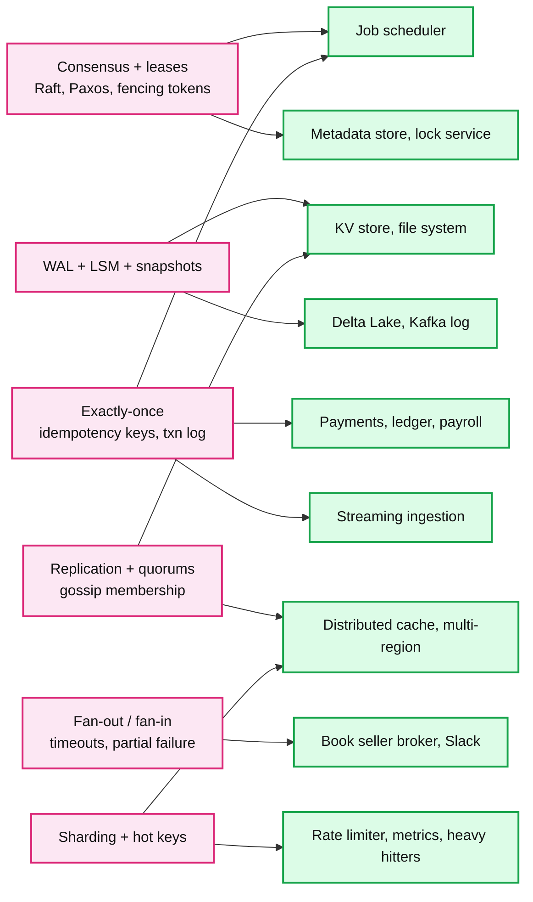
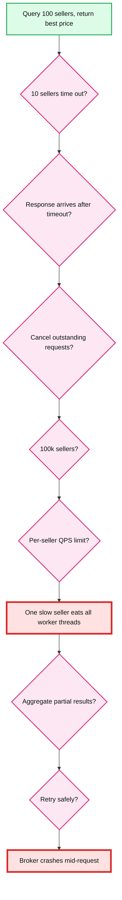

# HLD Practice Index

> One-line answer: 55 problems, tiered by how often they are reported at Databricks, Google, Rippling, and Intuit, and by how much Staff-level depth they expose. Databricks weighted first.

Sources: two rounds of research. (a) Glassdoor, Blind, LeetCode Discuss, Exponent, Hello Interview, SystemDesignHandbook, DesignGurus (2024 to 2026). (b) A Sep 2026 aggregation of 76 Databricks candidate reports plus Google L6, Meta, and Amazon report collections. Report counts below come from (b). (c) A 2026-09-30 pass on Intuit (Principal) and Rippling (Staff) that counts only candidate posts I opened, with Rippling design rounds re-checked 2026-10-02: see [`company-questions.md`](company-questions.md). Per-company notes and links are in §5.

Status legend: `todo` | `attempted` (my-attempt.md exists) | `studied` (solution + edge-cases) | `done` (excalidraw drawn, all edge cases confident). See `hld/CLAUDE.md` for the per-problem folder layout.

---

## 1. Concept map

Most problems below are combinations of a small set of hard building blocks. Master the block once in `concepts/`, then reuse it.


```mermaid
%% Which building blocks unlock which problem groups
flowchart LR
    C1[Consensus + leases<br/>Raft, Paxos, fencing tokens] --> P1[Job scheduler]
    C1 --> P2[Metadata store, lock service]
    C2[WAL + LSM + snapshots] --> P3[KV store, file system]
    C2 --> P4[Delta Lake, Kafka log]
    C3[Exactly-once<br/>idempotency keys, txn log] --> P1
    C3 --> P5[Payments, ledger, payroll]
    C3 --> P6[Streaming ingestion]
    C4[Replication + quorums<br/>gossip membership] --> P3
    C4 --> P7[Distributed cache, multi-region]
    C5[Fan-out / fan-in<br/>timeouts, partial failure] --> P8[Book seller broker, Slack]
    C6[Sharding + hot keys] --> P7
    C6 --> P9[Rate limiter, metrics, heavy hitters]

    class C1,C2,C3,C4,C5,C6 decision
    class P1,P2,P3,P4,P5,P6,P7,P8,P9 service

    classDef service  fill:#dcfce7,stroke:#16a34a,stroke-width:2px,color:#111
    classDef decision fill:#fce7f3,stroke:#db2777,stroke-width:2px,color:#111
```

### Concept notes in `concepts/`

One page per building block. High-level: every feature of the mechanism, how it is implemented, failure modes, trade-offs, numbers, and the follow-ups an interviewer asks. Source-verified depth lives in `popular_systems_deepdive/`, not here.

| Block | Note | One-liner | Unlocks |
|---|---|---|---|
| C1 Consensus | [`concepts/raft.md`](../concepts/raft.md) | One leader per term appends to a replicated log. Majority ack = committed. Election restriction means a new leader already has every committed entry. | #3 file system, #6 scheduler, #19 metadata store, #33 lock service, #16 Kafka (KRaft) |
| C1 Consensus | [`concepts/paxos.md`](../concepts/paxos.md) | Two majority rounds (prepare, accept). Proposer must adopt the highest accepted value it sees, so a chosen value can never change. Multi-Paxos = Raft with holes allowed and the election left to you. | #19 metadata store (Spanner style), #33 lock service (Chubby), Cassandra LWT in #20 cache |
| C4 Replication, membership | [`concepts/gossip-protocol.md`](../concepts/gossip-protocol.md) | Every node swaps versioned state with a few random peers each round. Reaches all N in log N rounds with no leader. Eventual only, so use it for liveness and hints, never ownership. | #20 cache, #7 throttling, #26 monitoring, #3 file system (chunk server liveness), #5 object store |
| C4 Replication, multi-master | [`concepts/crdt.md`](../concepts/crdt.md) | Merge is commutative, associative, idempotent (a lattice join), so every replica writes locally and all converge with no leader. Add-wins OR-Set, PN-Counter, sequence CRDT for text. Price: per-object metadata and tombstones, and no global invariants, so "claim this username" still needs a leader or escrow. | #28 collab editing, #20 cache (multi-region active-active), #2 Slack (presence, unread counts), #13 Drive (offline edits), #36 WhatsApp |
| C4 Replication, anti-entropy | [`concepts/merkle-tree.md`](../concepts/merkle-tree.md) | Hash blocks into leaves, hash pairs upward, one 32 B root commits to everything. Matching replicas compare one hash, differing ones walk log n hashes to the exact leaf, so repair streams only differences. log n sibling hashes prove one block belongs (SPV, Certificate Transparency). Trap: the leaf is the unit of transfer, depth-15 over 100 GB is 3 MB per leaf, so fix overstreaming with smaller ranges, not deeper trees. | #3 file system, #4 KV store, #5 object store, #13 Drive (sync), #20 cache (multi-region), Cassandra / Dynamo repair |
| C2 WAL + LSM + snapshots | [`concepts/lsm-tree.md`](../concepts/lsm-tree.md) | Append to WAL + sorted memtable, flush to immutable sorted files, compact in the background. Deletes are tombstones. The design is a write / read / space amplification triangle and compaction style is the dial. | #4, #3, #5, #15, #16 |
| C2 WAL + LSM + snapshots | [`concepts/skip-list.md`](../concepts/skip-list.md) | Sorted linked list with random express lanes. Expected O(log n) with no rebalancing, and an insert touches only local pointers, so it is the lock-free memtable under every LSM and the index in Redis sorted sets. | #4, #3, #15, #20 cache (Redis ZSET) |
| C2 WAL + LSM + snapshots | [`concepts/bloom-filter.md`](../concepts/bloom-filter.md) | Bit array + k hashes. Definite no, probable yes. 10 bits per key gives 1% false positives and never a false negative, so it is a safe pre-check in front of anything expensive. One per SST, pinned, is why LSM misses cost zero IO. | #4, #3, #5, #20 cache (one-hit wonders), #2 feed (already seen), Spark join pruning |
| C5 Fan-out, transport | [`concepts/realtime-client-server-communication.md`](../concepts/realtime-client-server-communication.md) | Two questions pick the transport: media or not (pull HTTP segments, WebRTC if sub-second), then does the client push continuously on the same channel (WebSocket, else SSE over HTTP/2). Only one side pings, client timeout >= 2x ping, jitter the reconnect, drain with a staggered 1001. | #2 Slack, #28 collab editing, #36 feed / WhatsApp, any dashboard or LLM streaming question |
| C2 WAL + LSM + snapshots | [`concepts/time-series-db.md`](../concepts/time-series-db.md) | An LSM keyed on (series, time). One compressed chunk per series (delta-of-delta ts + XOR floats, ~1.4 B/sample), inverted index over labels, blocks partitioned by time so retention is a directory delete. Scale by hashing series onto ingesters, RF=3, no consensus because samples are idempotent. Cardinality, not samples/s, is what breaks it. | #26 monitoring, #7 throttling, #24 trending, #9 (market data), #34 (GPU metrics) |
| C2 WAL + LSM + snapshots | [`concepts/columnar-db.md`](../concepts/columnar-db.md) | Each column stored as its own sorted, compressed array in row groups with min/max stats. Wins: read only needed columns, 5 to 10x compression via dictionary/RLE/delta, vectorised execution, zone map pruning. Writes are buffer + immutable parts + background merge (LSM again), so small inserts, updates and point lookups are the failure modes. Cassandra is not columnar. | #15 Delta Lake, #17 query engine, #18 ingestion, #22 CDC, #26 monitoring, #35 feature store |
| C7 Compute model | [`concepts/serverless-architecture.md`](../concepts/serverless-architecture.md) | Serverless is a billing contract, not a technology. Lambda wins under ~20% utilization and short, spiky, event-driven work; containers win above ~45% or for sockets, GPUs, > 15 min. At-least-once everywhere, so idempotency is mandatory. Per-unit pricing on a chatty steady workload is the Prime Video trap. | #7 throttling, #26 monitoring, #1 book seller (partner fan-out), any webhook / image pipeline / cron question |
| C5 Fan-out, transport | [`concepts/webrtc.md`](../concepts/webrtc.md) | Encrypted media and data over UDP, browser to browser. STUN learns your public address, TURN relays the 10 to 20% that cannot hole-punch. Two people go P2P, beyond four use an SFU that forwards packets without decoding, simulcast so each receiver gets the layer it can afford, one room pinned to one SFU, 3 s rejoin when it dies. | #37 live comments (video half), any Zoom / Meet / Discord voice / webinar question |
| C3 Exactly-once | [`concepts/exactly-once.md`](../concepts/exactly-once.md) | Exactly-once delivery is impossible, exactly-once effect is routine: client-generated idempotency key stored in the same txn as the side effect behind a unique constraint, response replayed on retry. Outbox on the producer, inbox on the consumer, no cross-system txn. Non-idempotent downstream (bank rail): attempt row before the call, query or reverse before a new attempt. Kafka is exactly-once only Kafka to Kafka. | #1, #6, #8, #9, #14, #18, #22, #29, #32 |
| C4 Quorums | [`concepts/replication-and-quorums.md`](../concepts/replication-and-quorums.md) | Single leader (order, failover), multi leader (conflicts), leaderless (R + W > N per key only). Sync to one, async to rest. Failover = detect, majority elect, fence with epoch, truncate old leader. Sloppy quorum breaks overlap; hints, read repair, Merkle repair within gc_grace bring eventual back. Lost writes on async failover = lag x rate. | #3, #4, #19, #20, #16 Kafka ISR |
| C5 Fan-out / fan-in | [`concepts/fan-out-fan-in.md`](../concepts/fan-out-fan-in.md) | 1 - 0.99^N: at N=100, 63% of requests hit a p99. Absolute deadline propagated per hop, per-backend timeout from its p99, cancel on deadline, hedge idempotent reads at p95 capped 5%, one retry layer with a budget. Merge at a quality threshold, mark missing backends. Write fan-out: async queue, idempotent inbox, skip inactive, pull above 10k followers. Side effects mean it is a saga. | #1, #2, #36, #37, #17 |
| C6 Sharding + hot keys | [`concepts/sharding.md`](../concepts/sharding.md) | Shard on the key the hot query has. Consistent hash ring with ~100 vnodes moves 1/N on membership change vs 91% for mod N (runnable). Range for scans, salt sequential keys, auto-split. Sharding spreads keys not traffic: count-min top-k detector, local cache for read-hot, suffix split for write-hot, directory move for hot tenant. Rebalance = snapshot, log catch-up, dual write, checksum, flip, keep source. | #7, #20, #24, #30, #36, #2 |
| C1 Consensus, ownership | [`concepts/leases-fencing-clocks.md`](../concepts/leases-fencing-clocks.md) | A lock alone is unsafe: the holder can pause, lose the lease, and write after a new holder took over. Fencing token (epoch, term, version) issued with every grant, carried on every write, checked by storage not the client. Leases on the monotonic clock, renew at T/3, step down at T - margin. Never order events by wall clock: Lamport, HLC, or TrueTime. | #3, #6, #33, #16 Kafka epochs, #19 |
| C3 Transactions | [`concepts/distributed-transactions.md`](../concepts/distributed-transactions.md) | 2PC is atomic but blocks every participant when the coordinator dies after prepare; fine only inside a system with consensus under it (Spanner, CockroachDB). Saga = local txns plus compensations, no isolation, persisted state before each step, least compensable step (the charge) as the pivot last. TCC where holds exist. Best move: one system owns the truth, write row plus outbox in one txn. | #8, #25, #29, #39, #6 |
| C6 Caching | [`concepts/caching-patterns.md`](../concepts/caching-patterns.md) | Cache-aside with delete-on-write, jittered TTL as the staleness bound (state it in seconds). Stale-fill race fixed by leases or versioned keys; CDC invalidation when the write path cannot be trusted. Hot-key expiry is the outage path: single-flight (runnable), probabilistic early refresh, stale-while-revalidate, negative caching. DB must survive the cache being gone. | #20, #23, #30, #36, #2 |
| C3 Streams | [`concepts/stream-processing.md`](../concepts/stream-processing.md) | Event time with a watermark trailing by measured p99 lateness; late events to a side output. Barrier checkpoints snapshot operator state plus source offsets, recovery replays one interval. Exactly-once internally; at the sink either 2PC tied to the checkpoint (latency = interval) or idempotent upsert. Backpressure to the Kafka log, lag in seconds is the alert. CDC: record log position, snapshot, tail, upsert. | #18, #22, #24, #26, #40, #15 |
| C6 Load control | [`concepts/rate-limiting-and-load-shedding.md`](../concepts/rate-limiting-and-load-shedding.md) | Token bucket per client on cost units (runnable), local buckets with 100 ms sync so overshoot is bounded and Redis is off the request path, fail open on local limits. Admission by Little's law concurrency, adaptive, shed by criticality with retries first, degrade before 503. Bounded queues and pull so backpressure reaches the source. Full-jitter backoff, 10% retry budget, one retry layer. | #7, #7b, #37, #39, #1 |
| C2 Isolation | [`concepts/mvcc-and-isolation.md`](../concepts/mvcc-and-isolation.md) | Versions tagged with writer txn id, readers see a snapshot, never block. Snapshot isolation permits write skew (check-then-act on different rows): FOR UPDATE, materialised invariant, or SSI with retries. Old versions reclaimed up to the oldest snapshot, so a 6-hour report bloats every table. Distributed needs one timestamp source: TrueTime, HLC, or an oracle. | #4, #14, #15, #19, #25 |
| C4 Durability | [`concepts/erasure-coding.md`](../concepts/erasure-coding.md) | RS(k,m): any k of k+m rebuild, overhead (k+m)/k, tolerance m. RS(10,4) is 1.4x for 4 losses vs 3x for 2. Reads and repairs touch k fragments, so small and hot objects stay replicated. Durability = P(m+1 failures within one MTTR), so repair speed is the lever; correlated failures, bit rot (scrub), and operator error are what actually lose data. | #5, #3, #27 |
| C6 Spatial | [`concepts/geospatial-index.md`](../concepts/geospatial-index.md) | Geohash (runnable), S2, H3 turn (lat, lon) into a sortable prefix so a radius query is 9 prefix scans (cell plus 8 neighbours at cell >= radius) then exact filter. Live locations in memory sharded by coarse cell with TTL, update only on cell change, pub/sub per cell for friends nearby. Hot cities are hot shards. | #38, #27 |
| C7 Retrieval | [`concepts/vector-index.md`](../concepts/vector-index.md) | HNSW: layered proximity graph, ~1 ms at 95% recall on 10M, 20 to 50M per node in RAM, deletes are tombstones until segment merge. IVF plus PQ at 100M+: 32x smaller, re-rank top 100 exactly. Filters are the trap: pre-filter under ~100k matches, partition by tenant, post-filter only for loose filters. Measure recall@10 against brute force nightly. | #12, #35 |
| C6 Sketches | [`concepts/stream-sketches.md`](../concepts/stream-sketches.md) | Count-min (runnable): d x w counters, min across rows, never underestimates, ~750 KB for eps 1e-4; plus a heap for top-k. HyperLogLog: 12 KB for a billion distinct at 0.8%, merge by register max across shards and days. Trending = per-minute sketches vs the key's own baseline. Sketches for dashboards and hot-key detection, exact batch for billing. | #24, #26, #20 hot keys, #7 |
| C7 Data path, auth | [`concepts/signed-url.md`](../concepts/signed-url.md) | A capability token shaped like a link: method, key, expiry, and signed headers under an HMAC that storage or a CDN verifies statelessly (runnable). Bytes go client to storage direct; the API does start (server names the key, row pending) and complete (HEAD, then committed), sweeper plus lifecycle rule for orphans. Bearer, so no revoke: TTL is the control, and a URL dies with the credential that signed it. Multipart above 100 MB, signed cookie over a prefix for feed pages, cache key on path not signature. | #2 Slack attachments, #5 object store, #13 Drive, #27 Street View ingest, #36 media upload |
| C3 Orchestration | [`concepts/temporal-durable-execution.md`](../concepts/temporal-durable-execution.md) | Durable execution: every activity result, timer, and signal is appended to a per-workflow event history in one txn with an outbox-style transfer task, and a fresh worker replays the code against it so finished steps never re-run. Workflow code must be deterministic (time, random, deploys are the traps), activities stay at-least-once so idempotency keys remain. Sticky cache avoids full replay, 5 s fallback. Ceiling is state transitions per second on persistence, shard count fixed at creation, 51,200 events / 50 MB per run so Continue-As-New. If the engine is the question, sections 3 to 6 are the design. | #6 scheduler, #11 provisioning, #25 booking, #29 payroll, #31 workflow engine, #32 integration platform, Uber / YouTube / flash sale |
| C1 Consensus, coordination | [`concepts/etcd.md`](../concepts/etcd.md) | One Raft group, 3 or 5 members, every write fsynced on a majority and stamped with a global revision. Revision is the fencing token and the watch cursor: watches resume from any revision with no gaps until compaction, then list + watch. Leases delete keys when the owner stops heartbeating; lock = Txn on create_revision, lowest wins, extended by 1 election timeout on leader change. Linearizable reads via ReadIndex, serializable reads local and stale. Sized for control-plane state: 2 to 8 GiB, 1.5 MiB per value, ~50k small writes/s max, fsync p99 < 10 ms, 1 s write stall per election. Not a database, not a queue. | #6 scheduler (partition leases), #20 cache (ring epoch), #3 file system, #33 lock service, #19 metadata store, every Kubernetes question |
| C1 Consensus, coordination | [`concepts/zookeeper.md`](../concepts/zookeeper.md) | Replicated in-memory tree with sessions, ephemeral nodes and one-shot watches over Zab. Writes linearizable through one leader (zxid = epoch + counter), reads local and sequentially consistent, `sync()` for fresh. Session expiry is decided by the cluster (4 to 40 s, HBase 90 s): every ephemeral node goes at once, so a GC pause hands your lock away and you fence with the sequence number. Lock recipe = ephemeral sequential, watch the predecessor only (no herd), GUID in the name for ConnectionLoss. Paper: 3 servers 87k reads / 21k writes per second, election under 200 ms. 1 MB per znode, 5 servers, txn log on its own disk. Kafka left for KRaft in 4.0 when metadata outgrew a tree. | #6 scheduler, #33 lock service, #3 file system (master election), #16 Kafka (pre-KRaft), HBase / Solr / Pulsar questions |
| C1 Consensus, coordination | [`concepts/chubby.md`](../concepts/chubby.md) | Google's lock service (OSDI 2006), the design ZooKeeper and etcd copied. 5 replicas, Paxos master with a ~12 s lease serves every read and write; sessions via KeepAlive RPCs the master blocks and uses to carry cache invalidations; consistent client cache so writes wait for every cacher; advisory coarse-grained locks with a sequencer (fencing token) and a 60 s lock-delay fallback; jeopardy then a 45 s grace period so sessions survive a 4 to 30 s fail-over; new master fences its past with a client epoch. Scale by cutting master traffic (leases, cache, proxies) not speeding it up: 90k sessions, 93% KeepAlives. Lessons: apps ignore outages, no quotas (256 KB cap later), data loss from software and operators, never disks. | #33 lock service, #3 file system (GFS master election), #19 metadata store, any leader-election or name-service question |

The written notes share one thread worth saying out loud in any coordination question: Raft and Paxos buy **agreement** with a leader and a quorum. Gossip gives agreement up to get **scale and no single point of failure**. Consul is the textbook split (SWIM gossip for membership, Raft for the catalog), and Cassandra 6.0 moving ring ownership from gossip onto a Paxos log is the cautionary tale. CRDTs are the third point on the line: no agreement on order at all, convergence guaranteed by the data type, usable only for facts that commute.

---

## 2. Ranked problem list

### Tier 1: Databricks reported. Do these first.

| # | Problem | Folder | Reports | Concept under test | Status |
|---|---|---|---|---|---|
| 1 | Book seller broker: query N sellers async, aggregate, return best price | [`book-seller-broker/`](book-seller-broker/) | 22 | Fan-out / fan-in, timeouts, late responses, cancellation, per-seller QPS, slow-seller isolation, broker crash mid-request | attempted + studied |
| 2 | Slack / large-scale messaging platform | [`slack-messaging/`](slack-messaging/) | 15 | Per-channel ordering, fan-out to large channels, presence, offline delivery, multi-device sync | studied |
| 3 | Strongly consistent distributed file system without S3 (GFS style) | [`distributed-file-system/`](distributed-file-system/) | 8 | Metadata sharding, chunk replication, consensus, fencing, rename vs delete races, hot directories, DR with RPO/RTO | studied |
| 4 | In-memory KV store with write-ahead log | [`kv-store-wal/`](kv-store-wal/) | 6 | fsync semantics, crash recovery, snapshots, compaction, concurrent readers vs writers | studied |
| 5 | Immutable distributed object store | [`immutable-object-store/`](immutable-object-store/) | reported | Commit point, conditional PUT, range-partitioned metadata + hot prefix, RS(9,6) over 3 AZs and the 1.5x floor, repair window, delete via crypto-shred + compaction | studied |
| 6 | Distributed job scheduler with DAG dependencies | [`distributed-job-scheduler/`](distributed-job-scheduler/) | reported (also Meta, Google as "cron at scale") | Three planes (trigger, orchestration, execution), leased partitions with epochs, one owner per run, event log plus rows in one txn, at-least-once with idempotency key and at-most-once per task, lazy rows and jitter for the midnight second, backfill lane, repair run | studied |
| 7 | Datacenter network throttling / hierarchical rate limiting | [`network-throttling/`](network-throttling/) | reported | Local enforcement vs global counters, batch reporting and leases, overshoot bound, hierarchical max-min fairness, fail-open vs fail-closed per limit, allocator failover | studied |
| 7b | VM network QoS: minimum bandwidth per VM on a shared host NIC, both directions | [`vm-network-qos/`](vm-network-qos/) | reported (screenshot 2026-09-16) | Ingress cannot be enforced on the receiver, off-host proxy tier with host-issued leases, guarantee as a placement invariant, floor-until-leased and the overshoot bound, HTB vs EDT vs SmartNIC, pps as a second bucket | attempted + studied |
| 8 | Visa-scale payments + ledger + duplicate payment prevention | [`payments-ledger/`](payments-ledger/) | reported (also Rippling, Stripe) | Idempotency row in the payment txn, attempt id per rail call and reversal on unknown outcome, deterministic entry ids, double-entry invariants, constrained-only balances and single-writer batch for hot accounts, clearing accounts across ledgers, 3-layer reconciliation | studied |
| 9 | Stock trading / order execution system | [`order-execution/`](order-execution/) | reported (also Coinbase) | Sequencer + replicated input log, deterministic single-writer matcher per symbol shard, output log as the only truth, three commit points, buying-power hold across two partition keys, epoch-fenced hot standby, per-session exec report sequencing, broker variant | studied |
| 10 | Ad budget / spend pacing system | `ad-budget-pacing/` | reported | Distributed budget counters, overspend bounds, pacing over the day, eventual reconciliation | todo |
| 11 | Async provisioning system (clusters, VMs) | `async-provisioning/` | reported | Long-running workflows, state machine per resource, idempotent cloud API calls, partial failure cleanup | todo |
| 12 | RAG retrieval service | `rag-retrieval/` | reported | Embedding pipeline, vector index sharding, freshness, hybrid search, latency budget | todo |
| 13 | Google Drive / Dropbox file sync | [`dropbox/`](dropbox/) | reported (also Google, Dropbox) | Chunking + dedup, delta sync, conflict resolution, metadata DB sharding | attempted |
| 14 | Playlist / game transaction service with retry-safe semantics | `playlist-service/` | reported | Idempotent mutations, ordering, optimistic concurrency, small problem that gets mutated | todo |

### Tier 2: Databricks style. Their product in disguise.

| # | Problem | Folder | Asked at | Concept under test | Status |
|---|---|---|---|---|---|
| 15 | Delta Lake: transactional tables over object storage | [`delta-lake-transactions/`](delta-lake-transactions/) | Databricks, Snowflake | The log is the truth and one put-if-absent is the commit, OCC with a four-question conflict check and blind appends that never fail, checkpoint size as the scaling wall (V2 sidecars), copy-on-write vs deletion vectors, `dataChange=false` compaction beside streams, retention as the time travel and VACUUM and GDPR knob, catalog as the optional arbiter | studied |
| 16 | Kafka / distributed event log | `distributed-log/` | Databricks, Confluent | Partitions, ISR replication, offsets, retention, exactly-once producer | todo |
| 17 | Multi-tenant distributed SQL query engine (Spark / Photon) | [`query-engine/`](query-engine/) | Databricks, Snowflake | Control plane (gateway, workload manager with cost-predicting admission, compute manager with a warm pool) over per-tenant warehouses of driver plus workers, stages cut at shuffles and re-planned from real sizes (coalesce, runtime broadcast, skew split at 5x median and 256 MB), the task as the fairness quantum, M x R shuffle blocks as the red node (broadcast, NVMe, push-merge, remote tier by threshold), statement retry for short queries vs task retry with spooled exchange for long ones, the warm pool as the provider's cost under per-second billing, billing from uptime and attribution from task-slot-seconds | studied |
| 18 | Petabyte batch + streaming ingestion | [`streaming-ingestion/`](streaming-ingestion/) | Databricks, Confluent | Table commit carries the source offsets (`txn` marker) so a re-run is a no-op, backpressure ends at Kafka and retention is the SLA, bronze by ingest time with event-time clustering and no watermark at ingestion, registry gates at register time and the pipeline rescues or quarantines in the same commit, replay is the same job bounded plus one `replaceWhere` swap, files per commit as the red node | studied |
| 19 | Multi-region metadata store with linearizable writes | [`multi-region-metadata-store/`](multi-region-metadata-store/) | Databricks, Google | Ranges as Raft groups placed 2 + 2 + 1 with the pair in the nearest region, leaseholder pinned to the tenant's home, one-RTT commit (~75 ms), lease reads bounded by clock drift with ReadIndex fallback, follower reads at a closed timestamp, read-your-writes tokens, term plus lease-epoch fencing and the paused-leader check, region loss timeline (RTO 5 to 12 s, RPO 0), single-range txns by key design and 2PC over Raft only inside a tenant, HLC uncertainty restarts vs TrueTime | studied |
| 20 | Distributed cache from scratch | [`distributed-cache/`](distributed-cache/) | Databricks, Google | Node count from memory not QPS, ring with 150 vnodes owned by a config service with epochs (never gossip), leases as the one mechanism for stampedes and stale sets, delete-on-write plus CDC backstop with a stated 1 s bound and two named holes, gutter and fill cap then RF = 2 decided by the DB-load division, client L1 and key replication for hot keys, slab classes and W-TinyLFU / S3-FIFO with the hit-rate number, staged ring weight and warm-from-old-owner | studied |
| 21 | Autoscaling cluster manager | [`cluster-manager/`](cluster-manager/) | Databricks, Google | Three loops per AZ cell (workload autoscaler on the Spark backlog, bin-packing scheduler with best fit plus alignment, capacity manager that counts in-flight VMs as supply), the cloud launch API (1,000 at once then 2/s per account) as the red node fixed by calendar pre-scale, 8 accounts and big instances, hot pool sized as safety stock (2% of fleet), spot workers over 6+ pools capped at 20% each with on-demand drivers and shuffle hand-off inside the 2-minute notice, preemption of lower-band workers only as a bridge, intent-then-launch with client tokens and orphan GC | studied |
| 22 | Change data capture pipeline | [`cdc-pipeline/`](cdc-pipeline/) | Databricks, Confluent | One serial reader per database on a replication slot or binlog, the slot as the red node (WAL pinned on the primary, capped and alarmed in hours of budget, lose the slot and re-snapshot rather than the database), version = (epoch, commit position, index) so every sink applies only newer versions and at-least-once becomes exactly-once effect, DBLog watermark chunks read from replicas with no lock and no time travel, failover slots plus `synchronized_standby_slots` against phantoms, epoch bump plus sweep after any lineage break, per-key order by default and opt-in transaction buffering, `FULL_TRANSITIVE` registry plus a CI gate for renames | studied |
| 43 | AI gateway for thousands of tenants (LLM + MCP) | [`ai-gateway/`](ai-gateway/) | Databricks (likely, from a prep note) | Token-based rate limiting with streaming (reserve an estimate, pod-local leases, exact per-request grants near a cap, overshoot within max($5, 1%)), multi-tenant isolation at the shared provider quota (fleet-wide provider leases plus per-tenant fair queuing, the red node), MCP governance under the stateless 2026-07-28 spec (route and authorize on `Mcp-Method` / `Mcp-Name`, verify against the body, per-user upstream credentials, no token passthrough), native Envoy where it fits and a Rust dynamic module where core cannot | studied |
| 48 | MapReduce: distributed batch processing framework | [`mapreduce/`](mapreduce/) | Databricks (Glassdoor snippet lists "MapReduce" among onsite designs [unverified]), Anthropic ML screen (PracHub), generic as "design Hadoop", "word count over 10 TB", "sort 1 PB" | One job master per job under a resource manager (YARN split, because one JobTracker topped out near 4,000 nodes and its death lost every job), locality-aware 128 MB map tasks writing one sorted file plus index, a per-node shuffle service that outlives tasks, completed maps re-run on node loss but committed reduces never do, a commit gate that lets exactly one attempt publish (manifest plus conditional put on object stores), LATE-style capped speculation that never copies a skewed task, skew split only for declared joins and aggregates, and the shuffle as the red node: the 100 TB sort is 7.8 B blocks of 12.8 KB, ~1.8 h of HDD seeks per node pulled vs ~1 to 1.5 min push-merged | studied |

### Tier 3: Google L6, Rippling, and Intuit reported.

| # | Problem | Folder | Asked at | Concept under test | Status |
|---|---|---|---|---|---|
| 23 | Distributed deny / block list | [`distributed-denylist/`](distributed-denylist/) | Google (Hello Interview lists it first among common L6 problems) | Whole list on every host in shared memory (255 MB, ~400 ns, zero remote calls, exact keys not 64-bit hashes), Spanner commit timestamp as the version, two deterministic leaderless publishers cutting 100 ms batches at a closed timestamp, three-level push tree with watermarks, heartbeats and a state checksum (99% of hosts in 10 s p99, ~1 s typical), fail-static with a site panic threshold, stage risky changes by breadth via shadow and canary modes on the entry plus host-side validation and quarantine (the publisher stream is the red node), filter plus confirm only for long-tail groups at 10x | studied |
| 24 | Global trending hashtags | `trending-hashtags/` | Google | Streaming aggregation, heavy hitters, windows, locality | todo |
| 25 | Global ticket / hotel booking | `ticket-booking/` | Google, Rippling (2 candidate posts, 3 PracHub pages, incl. a hotel listed on other aggregators), Airbnb | Contention, inventory locks, overselling, saga vs 2PC, idempotent payment | todo |
| 26 | Server-health monitoring + alerting | [`health-monitoring/`](health-monitoring/) | Google | Agent push plus a separate 5 s heartbeat, host DOWN only when 2 of 3 liveness replicas miss it and probes from 3 other racks plus the BMC confirm, topology correlation so a PDU or rack failure is one page, single-host failures to repair automation under a safety budget (30 to 80 a day vs 2 pages per shift), region-local stack with RF 3 across clusters and no dependency on what it monitors, cardinality limits at ingest as the red node, dedup key on pages | studied |
| 27 | Google Maps Street View ingestion and storage | [`streetview-ingestion/`](streetview-ingestion/) | Google L6/L7 (TryExponent "1000 cars", Hello Interview taxi cameras) | Car-day offload by cartridge plus onboard mirror because 1.4 TB is 150 h on LTE, wipe only after a registry LANDED commit against a signed manifest, per-drive durable workflow with manifest-last outputs and epoch-fenced publish, one CURRENT panorama per ~10 m road slot flipped in 1 km chunks after the tiles exist, S2 L16 plus time-desc index behind a cache and a CDN on immutable versioned tiles, unblurred raw crypto-shredded at 180 days and current imagery tiered by access (storage ~15 to 20x compute), blur requests as ground footprints that re-blur history and every future drive, depot ingest station as the red node | studied |
| 28 | Real-time collaborative editing (Docs, notebooks) | `collaborative-editing/` | Google, Databricks | OT vs CRDT, presence, offline merge | todo |
| 29 | Payroll run for ~1M small businesses / multi-tenant payroll engine | [`payroll-engine/`](payroll-engine/) | Rippling; Intuit (practice list, 2026-10) | The deadline is the bank's ACH cut-off: approve, freeze an immutable snapshot, deterministic gross-to-net in integer cents, instruction ids from (run, snapshot, payee, purpose), whole-run claims under a run lock, a file registry keyed per bank with a VOID tombstone, an unknown upload resolved by asking the bank (never re-sent the same night), our own reference in the Identification Number field for return matching, employer-debit return risk handled by tiers and a 4-day debit-first speed, the IRS $100k next-day rule and a DC holiday calendar, two ODFIs at 1x; the file builder plus bank gateway at the cut-off is the red node | studied |
| 30 | Authorization / RBAC + ABAC at scale (Zanzibar) | `authorization-service/` | Rippling, Stripe, Google | Relation tuples, permission check consistency, cache invalidation, p99 < 10ms | todo |
| 31 | Expense / corporate card rules engine (with reimbursement) | [`expense-rules-engine/`](expense-rules-engine/) | Rippling (SSE phone screen Apr 2026 as `evaluateRules`, then "scale it"; a coding round in 3 more posts; 7 PracHub pages, all tech screen) | Rules as data (JSON envelope + CEL) compiled into versioned bundles, one engine in three contexts (AUTH inside Stripe's 2 s deadline, CAPTURE, SUBMIT), a structured decision as the return type, counter rows locked in sorted order with holds that become spend at capture (the spend-control DB is the red node, ~250/s per counter), policy version chosen by spend time, three fallback layers (processor static controls, degraded cap + one adopt path, after-the-fact checks), simulate + shadow + forward-only versions, decisions replayable from stored facts, exactly-once payouts past a 24 h ledger key | studied |
| 32 | Employee identity + integration platform (SCIM, connectors, webhooks) | `integration-platform/` | Rippling, Stripe | Idempotent sync, external API rate limits, partial failure, retry storms | todo |
| 44 | News aggregator / personalized news feed | [`news-aggregator/`](news-aggregator/) | Rippling (most reported design prompt: 10 candidate posts, 2022 to 2026, incl. one labelled Staff, plus 16 PracHub pages) | Every publisher is a celebrity (200k subscribers on average), so fan-out on write is ~694k inserts/s to serve 3.5 articles/s; fan-out on read with the whole 72 h corpus (~0.9 GB) and per-source lanes (~25 MB) replicated into every feed server from an article stream; adaptive polling of ~10k "latest 25" endpoints under `T <= 25 / 2λ` with overlap-based gap detection, AIMD on 429 and a circuit per publisher (the fetcher at the publisher boundary is the red node); five dedup levels with syndicated copies attached to stories, not dropped; keyset for Following, a frozen 20-min session for ranked For You, a pill for new items; breaking news as a read-time lane an editor owns; a CDN top-stories fallback for 99.99% | studied |
| 45 | Tax refund status service (the read side of #49) | `tax-refund-status/` | Intuit Principal (Glassdoor snippet) | Status lookup behind a slow external dependency (IRS), push vs poll, notify on change, 5K to 300K TPS inside 2 hours on tax day | todo |
| 46 | Employee-ops bundle: tagged event counter, driver-pay ledger, termination orchestrator, LLM expense assistant | [`employee-ops-bundle/`](employee-ops-bundle/) | Rippling (one Senior+ AI-team loop, May 2026: four rounds, PracHub "hard") | Ack after Kafka `acks=all` and dedup downstream by `event_id`, billing hour as frozen offset ranges with a 35-day exact anti-join and a 4-link reconciliation, per-minute deltas into a summing store with no watermark, integer cent-seconds with effective-dated rates and append-only allocations, persisted termination DAG with an idempotency class per vendor action and attempt row plus read-back, freeze-then-cancel as the pivot, completeness by read-back plus inventory re-list plus token lifetime, connector quota as the layoff bottleneck, typed query plan with code-injected scope and validated-artifact streaming | studied |
| 49 | TurboTax e-file submission at the April 15 peak | [`turbotax-efile/`](turbotax-efile/) | Intuit (practice list, 2026-10; the read side is #45) | The postmark is our receipt time, in the filer's zone (Pub 1345), so the File click commits return, postmark and a pre-minted submission id in one transaction, and a gateway-signed receipt token survives a retry; IRS receipt within 2 days is a condition of timely filing; the transmitter drains to MeF at what it accepts (5 sessions per ASID, 100 per message, ~54 ASIDs, a relative-latency limiter); a send timeout goes to UNKNOWN and is resolved by Get Submission Status plus a watermark, never a new id (T0000-014 on a resend means it landed); acks fetched by id and every submission reconciled; the MeF channel is the red node | studied |
| 50 | QuickBooks multi-tenant ledger | [`quickbooks-ledger/`](quickbooks-ledger/) | Intuit (Principal/Staff practice list, 2026-10; not a reported candidate prompt) | Company = shard; one single-shard transaction appends balanced lines and a statement-level trigger upserts per-month balance rows last (~2 ms hot-row hold, ~500/s); edits are reversal plus new version; retained earnings computed at read; advisory-lock fence for close and shard moves; cross-region ack after the remote flush, capped at ~1 s; continuous verifier with independent key mapping; the hot period-balance row is the red node | studied |
| 51 | Bank feed aggregation | [`bank-feed-aggregation/`](bank-feed-aggregation/) | Intuit (Principal/Staff practice list, 2026-10; not a reported candidate prompt) | Fleet-wide per-institution governor that counts bank calls in flight; a grant unused within 1 s is void, so a stalled governor can only under-use the bank (largest bank ~857 calls/s usable, Monday peak ~111%); 14-day overlapping windows plus a weekly 60-day read, raw store, fingerprints with stored occurrence numbers, upsert; pending-to-posted matcher in both directions with continuity pairing; removal guard and empty-data breaker; the bank's limit is the red node | studied |
| 52 | QuickBooks Payments with inline risk decisioning | [`payments-risk-decisioning/`](payments-risk-decisioning/) | Intuit (Principal/Staff practice list, 2026-10; not a reported candidate prompt); plays to an Uber Risk background | 100 ms budget: grouped, hedged feature reads (~15 ms p99) with AZ ejection for gray failures, an in-process GBDT, rules; fallback ladder (validated partial, rules on what arrived, table) with per-merchant attempt-and-dollar buckets and step-up under $5, so a fallback cannot be used for card testing; the payment row is the decision of record; label delay, exploration slices, amount-dependent thresholds, per-rule auto-kill; payout holds and unseasoned-volume caps for merchant fraud; the feature-store fan-out is the red node | studied |
| 53 | Credit Karma score-change alerts for 100M+ members | [`credit-score-alerts/`](credit-score-alerts/) | Intuit (Principal/Staff practice list, 2026-10; not a reported candidate prompt) | Members hashed into weekly refresh slots (~165/s per bureau); diff against the visible snapshot into typed changes with exact per-bureau ids; possible-fraud alerts one per change with a re-entrant claim; a batch quality gate holds alerting and display, not ingestion; the delivery scheduler starts at ~1k pushes/s and ramps on measured read-path headroom (p x k from alert-tagged requests), spreads by member in the local morning and warms the cache before the push; the app read path after the push is the red node | studied |
| 54 | Mailchimp campaign sending | [`email-campaign-sending/`](email-campaign-sending/) | Intuit (Principal/Staff practice list, 2026-10; not a reported candidate prompt) | Throttle key is (sending IP, mailbox provider resolved from MX); quota leases plus AIMD on SMTP replies scoped by Gmail's 4.7.28 text; per-provider queues with fair share across accounts; frozen recipient snapshot in hashed chunks; suppression checked at snapshot, render and before SMTP; tiered IP pools, warm-up, per-tier second DKIM signer, and a canary for new and risky campaigns because Gmail reports complaints daily; buddy-replicated MTA journal (0 lost, ~130 duplicates per crash); Gmail's acceptance rate for our pool is the red node | studied |
| 55 | GenAI assistant over a customer's financial data (Intuit Assist style) | [`financial-ai-assistant/`](financial-ai-assistant/) | Intuit (Principal/Staff practice list, 2026-10; not a reported candidate prompt); closest reported prompt is the AI agent routing financial requests (company-questions.md §1.3 #7) | The model plans, code acts: a tool gateway binds tenant and user from the session and calls domain APIs with an on-behalf-of token (RFC 8693, RFC 8707); typed query tools (the model never writes SQL); claim slots rendered by code plus a lexicon check of metric, period and entity; untrusted text removes write capability for the turn (refused in code, so the prompt cache survives); confirmations with idempotency keys; IRC 7216 consent checked at context assembly; offline evals with structural red-team tests at 100% and behavioral rates with bounds; the model call is the red node | studied |

### Tier 4: breadth. One per day after the above.

| # | Problem | Folder | Asked at | Concept under test | Status |
|---|---|---|---|---|---|
| 33 | Distributed lock / coordination service (Chubby, ZooKeeper) | `distributed-lock-service/` | generic | Raft, fencing tokens, lease vs GC pause, split brain | todo |
| 34 | LLM inference serving | `llm-inference-serving/` | Anthropic, Databricks | Continuous batching, KV cache, GPU packing, latency vs cost | todo |
| 35 | Feature store + recommendation / search platform | `feature-store-recsys/` | Meta, Netflix, Amazon | Online/offline skew, point-in-time joins, candidate gen vs ranking | todo |
| 36 | Feed, Instagram, WhatsApp (one pass, three variants) | `feed-and-messaging/` | Meta | Fan-out on write vs read, celebrity problem, delivery semantics | todo |
| 37 | Live comments for a billion-user livestream | `live-comments/` | Meta | Pub/sub hotspots, ordering, load shedding | todo |
| 38 | Nearby friends / proximity service | `proximity-service/` | Meta, Uber | Geospatial partitioning, moving users, privacy | todo |
| 39 | Amazon global inventory + 10x traffic | `inventory-10x/` | Amazon | Reservations, regional failure, bottleneck discovery, graceful degradation | todo |
| 40 | Experimentation / A-B testing platform | `experimentation-platform/` | Amazon | Assignment consistency, event pipeline, metric attribution | todo |
| 41 | Uber / ride-hailing: request a ride, match a driver | [`uber-ride-hailing/`](uber-ride-hailing/) | generic (Uber, Lyft, DoorDash) | Location ingest (~1M writes/s) vs ride creates (~5K/s), geo index sharded by cell, exactly-once assignment in both directions (one driver per ride and one ride per driver), sequential offers with a timeout | attempted |
| 42 | Driver hot clusters / density heatmap (rolling 20 min, hourly export) | [`driver-hot-clusters/`](driver-hot-clusters/) | Uber (L6) | Exact distinct per cell via last-seen minute buckets (not sliding windows, not HLL), device time clamped to server time so one bad clock cannot blank a city, watermark only evicts, provisional stream vs final hourly batch with the same code, k-anonymised tumbling windows for institutions, per-cell distinct state as the red node | studied |
| 47 | Two-factor authenticator app (Google Authenticator) | [`two-factor-authenticator/`](two-factor-authenticator/) | Google (its product); asked generically as "design an OTP service" or "2FA" (Uber item in a Blind list) | Codes are an offline HMAC of secret and clock (0 QPS); the verifier charges each attempt before evaluating it (one conditional write, so 10,000 parallel guesses get 5), accepts each step once by CAS on `last_step`, refunds replays, forces a password reset after 5 failures (NIST cap 100 as backstop), ±1 step around T and a learned drift; the vault is the security model (server-held keys plus account takeover = every second factor, Retool): vault key sealed per device and to a recovery key pair, device join by QR with an HPKE PSK so the server cannot inject or forge keys, `item_id` derived from the secret, merge by HLC, tombstones pinned until every device has seen them (a 2,000-schedule simulation broke 899 schedules without these); recovery through PIN-gated HSM escrow with one shared attempt slot, 10 tries, a 24 h wait enforced in the HSMs, staged attempts and a signed heartbeat (the red node); TOTP and push are not phishing-resistant, so the RP must also offer passkeys (NIST §2.2.2) | studied |

---

## 3. Suggested order

Time split for a Databricks-first prep: 50% distributed infra, 25% data systems, 15% generic distributed apps, 10% consumer scale. Group by shared concept so each problem builds on the last.

```
Week 1  Storage from first principles:   #4 KV+WAL -> #3 file system -> #5 immutable store -> #20 cache
Week 2  Coordination + exactly-once:     #33 lock service -> #19 metadata store -> #6 scheduler -> #16 Kafka
Week 3  Data systems:                    #15 Delta Lake -> #17 query engine -> #18 ingestion -> #22 CDC -> #21 cluster manager -> #48 MapReduce
Week 4  Databricks app-style prompts:    #1 book seller -> #2 Slack -> #7 throttling -> #11 provisioning -> #14 playlist
Week 5  Money + tenancy (Rippling):      #44 news aggregator -> #46 employee-ops bundle -> #31 rules -> #8 payments -> #29 payroll -> #9 trading -> #10 ad budget -> #30 authz -> #32 integrations
Intuit Principal (case-study loop):      #52 payments risk -> #55 AI assistant -> #49 e-file -> #50 ledger -> #29 payroll -> #51 bank feeds -> #53 credit alerts -> #54 email -> #45 refund status -> #43 AI gateway -> #7 throttling (VIP rate limiter). Each new solution.md has a §12 10-slide deck outline.
Week 6  Google L6:                       #13 Drive -> #28 collab editing -> #23 denylist -> #24 hashtags -> #25 booking -> #26 monitoring -> #27 Street View
Week 7  Breadth:                         #12 RAG -> #34 LLM serving -> #35 recsys -> #36 to #40 -> #47 2FA
```

---

## 4. How a "simple" prompt gets mutated

The book seller broker looks easy. Its value is the follow-up ladder. Prepare this ladder for every Tier 1 problem, not just this one.


```mermaid
%% Interviewer's escalation path on the book seller broker
flowchart TD
    A[Query 100 sellers, return best price] --> B{10 sellers time out?}
    B --> C{Response arrives after timeout?}
    C --> D{Cancel outstanding requests?}
    D --> E{100k sellers?}
    E --> F{Per-seller QPS limit?}
    F --> G[One slow seller eats all worker threads]
    G --> H{Aggregate partial results?}
    H --> I{Retry safely?}
    I --> J[Broker crashes mid-request]

    class A service
    class B,C,D,E,F,H,I decision
    class G,J critical

    classDef service  fill:#dcfce7,stroke:#16a34a,stroke-width:2px,color:#111
    classDef decision fill:#fce7f3,stroke:#db2777,stroke-width:2px,color:#111
    classDef critical fill:#fee2e2,stroke:#dc2626,stroke-width:4px,color:#111
```

The same ladder for the file system: who owns path to inode to chunks, rename vs delete race, leader dies after ack, split brain across DCs, storage node dies mid-upload (what is "committed"), 10 billion files (shard by path, inode, or subtree), hot directory, region loss and whether RPO conflicts with strong consistency. Each rung is an entry in `edge-cases.md`.

---

## 5. Per-company notes and sources

### Databricks
- Loop: coding, architecture (HLD), system programming, behavioral. Interviewers probe mechanisms, not boxes. Expect drilling into WAL recovery, coordination, consistency, concurrency until you run out of depth.
- Reported (76-report aggregation, Sep 2026): book seller platform, Slack, strongly consistent file system, KV cache with WAL, playlist system, immutable distributed file system, payments, trading, game transactions, job scheduler, ad budget system, async provisioning, RAG retrieval, Google Drive / Dropbox, network throttling.
- Sources: [Glassdoor Staff SWE](https://www.glassdoor.com/Interview/Databricks-Staff-Software-Engineer-Interview-Questions-EI_IE954734.0,10_KO11,34.htm), [SystemDesignHandbook](https://www.systemdesignhandbook.com/guides/databricks-system-design-interview/), [PracHub](https://prachub.com/companies/databricks/categories/system-design).
- Prep edge: read `popular_systems_deepdive/kafka` and `popular_systems_deepdive/kubernetes` first. Tier 2 is their product in disguise (Jobs, Delta, Photon, cluster manager, Unity AI Gateway as #43 [`ai-gateway/`](ai-gateway/)).

### Google (L6)
- One 45-minute problem, collaborative. Same prompt as L4; grading differs. A clean single-service architecture is a down-level signal. Find the bottleneck before they point at it. Talk about multi-DC availability, partitioning, replication, and how the system evolves.
- Reported: distributed cache, distributed deny list, trending hashtags, ticket booking, server-health monitoring, Street View ingestion, Drive, Maps, YouTube, Docs.
- Sources: [DesignGurus Google L6](https://designgurus.substack.com/p/googles-system-design-interview-in), [Staff design bar](https://designgurus.substack.com/p/the-staff-engineers-system-design), [Hello Interview Staff guide](https://www.hellointerview.com/blog/staff-level-system-design).
- Prep edge: give numbers (QPS, bytes/day, p99) unprompted. State the consistency model per component.

### Rippling (Staff)
- Multi-tenant HR / payroll / IT / finance. Emphasis on tenant isolation, money correctness, PII, idempotent third-party integrations. Practical designs win over exotic ones.
- Levels: L5 SWE, L6 SWE II, L7 Senior, L8 Staff. No post is labelled L8. Two are labelled Staff (2025): news aggregator, and document verification (500K docs a day, 1 to 4 h SLA by priority).
- Loop: practical phone screen (own IDE, AI allowed, "code must run or reject"), onsite coding (KV store with transactions, nested and thread-safe at Senior+), one to three system design rounds, a 90-minute web API round (45 min to a working prod-ready API, 45 min hardening), a project presentation at Senior+, hiring manager. Design rounds set the level: one L7 candidate was dropped to L6, another to SDE-2.
- Reported in candidate posts (verified 2026-09-30, design rounds re-checked 2026-10-02): **news aggregator** (#44, 10 posts), **event tracking like Amplitude** / rollup aggregation / real-time metrics over streams (5 posts), **hotel / booking system** (#25, 2 posts), **document verification** (1 post, Staff), **corporate card rules engine** as phone-screen code (`evaluateRules`) then "scale it" follow-ups (#31), delivery driver cost, music player analytics, KV store with nested transactions, Stack Overflow API end to end, a feed where "fan out at write" was the miss. PracHub pages (40) add event analytics / clickstream / logging, delivery cost and driver pay, hotel reservation, duplicate-payment prevention (onsite, May 2026), an employee-termination orchestrator (solved with the rest of its loop as #46 [`employee-ops-bundle/`](employee-ops-bundle/)), and an HTTP server from scratch.
- Guide-only, never seen in a candidate post: payroll system, employee identity, permissions engine, employee graph, onboarding / offboarding cascade. Keep them (they are the product), rank them below the above.
- Staff bar, from a Rippling engineer: "An okay solution isn't enough to pass ... If you drew a box and said 'caching' but didn't explain any cache patterns, technology, tradeoffs ... That's enough for us to fail you."
- Full tables, sources and repo mapping: [`company-questions.md` §2](company-questions.md#2-rippling-staff).
- Prep edge: every design must answer "what happens if this runs twice" and "how does tenant A never see tenant B". Every coding answer must run, with tests.

### Intuit (Principal)
- Case-study loop. 75-minute screen (30 coding + 45 design with an AI part), then a case study handed out ahead of the loop, then about 4 rounds on the same day that all re-open your case study, then assessor / HM / director rounds.
- Two craft formats: a take-home design case study you present (Principal, Senior Staff), or live coding on a provided repo (Staff backend). The repos are public: [Intuit-A4A](https://github.com/Intuit-A4A) "Player Service" in Flask or Spring Boot with Ollama.
- Reported prompts: tax refund status service (#45, Principal, Glassdoor snippet), "identify social media trends for marketing" (take-home, AI-native, rejected for thin security), election management e-board (craft, OOP), rate limiter with a VIP tier, an AI agent routing financial requests with payload validation.
- Graded in every round: AI inside the product with guardrails, and security (authn, authz, PII, encryption). Scoping is graded too, so write down what you cut.
- Scale to quote: TurboTax 5K to 300K TPS within two hours; tax day 185B transactions, 11M TPS peak.
- Full tables, sources and repo mapping: [`company-questions.md` §1](company-questions.md#1-intuit-principal-and-staff).

### Stripe (same shape as Rippling money questions)
- Reported: durable ledger, idempotent double-entry ledger, webhook delivery, authorization service with explicit RPS targets, rate limiter, metrics pipeline.
- Sources: [Exponent](https://www.tryexponent.com/blog/stripe-system-design-interview), [Glassdoor](https://www.glassdoor.com/Interview/Stripe-Staff-Engineer-Interview-Questions-EI_IE671932.0,6_KO7,21.htm).

### Others worth one pass
- Meta E6: Instagram, Feed, Messenger / WhatsApp, proximity, KV databases, file systems, auctions, search / recsys, live comments, job scheduler, ML platform. [Blind](https://www.teamblind.com/post/meta-e5e6-system-design-interview-prep-hzye6kwj)
- Amazon SDE III: warehouse / fulfillment, 10x Amazon traffic, inventory, lockers, ranking, ticketing, distributed cache, A/B platform. Graded on practicality, accuracy, efficiency, reliability, scalability.
- Uber L6: driver density heatmap over rolling 20-minute windows, queryable after 24h. [Blind](https://www.teamblind.com/post/uber-l6-staff-engineer-system-design-round-8euje85r). Solved as #42 [`driver-hot-clusters/`](driver-hot-clusters/).
- Coinbase: order book, hot/cold wallet, multi-chain ingestion, fraud, settlement. [SystemDesignHandbook](https://www.systemdesignhandbook.com/guides/coinbase-system-design-interview/)
- Anthropic: LLM inference serving, retrieval pipelines. Novel problems, interviewer may not have a fixed answer. [Exponent](https://www.tryexponent.com/blog/anthropic-system-design-interview)
- Snowflake: Dynamic Tables vs Streams + Tasks, distributed storage and indexing.
- Dropbox: file sync API lifecycle. [interviewing.io](https://interviewing.io/dropbox-interview-questions)
- Confluent: Spotify-like podcast service, API + pagination + schema. [LeetCode](https://leetcode.com/discuss/interview-question/4188001/Confluent-or-SeniorStaff-Software-Engineer-Experience/)

---

## 6. What changed in 2024 to 2026

- ML / LLM infra questions went from ~10% to ~50% of Staff design loops. #12 and #34 are no longer optional.
- "Use Postgres" is no longer an answer. Interviewers push straight to partitioning, indexing, and consistency at scale.
- Exactly-once and multi-region active-active are default Staff follow-ups, not bonus rounds.
- Generic "design Instagram" answers score poorly. Use the company's real constraints: storage mechanics and object-storage economics (Databricks), money correctness (Stripe, Rippling), platform boundaries and multi-DC (Google).

Grading for every attempt: the six Staff criteria in root `CLAUDE.md` §7, plus the eight dimensions: requirements, scale, data model, architecture, distributed algorithms, failure modes, evolution, operationalization.

---

## 7. Per-problem file index

One row per problem folder that exists. Updated in the same change as any file added, renamed, or removed.

| # | Problem | Status | Files |
|---|---|---|---|
| 1 | Book seller broker | attempted + studied | [my-attempt](book-seller-broker/my-attempt.md) · [README](book-seller-broker/README.md) · [solution](book-seller-broker/solution.md) · [diagrams](book-seller-broker/diagrams.md) · [edge-cases](book-seller-broker/edge-cases.md) · deep-dives: [deadlines-and-aggregation](book-seller-broker/deep-dives/deadlines-and-aggregation.md), [seller-limits-and-scale](book-seller-broker/deep-dives/seller-limits-and-scale.md), [crash-recovery](book-seller-broker/deep-dives/crash-recovery.md) · research: [sources](book-seller-broker/research/sources.md) · missing: excalidraw |
| 2 | Slack / messaging platform | studied | [README](slack-messaging/README.md) · [solution](slack-messaging/solution.md) · [diagrams](slack-messaging/diagrams.md) · [edge-cases](slack-messaging/edge-cases.md) · deep-dives: [ordering-and-sequencer](slack-messaging/deep-dives/ordering-and-sequencer.md), [fan-out-and-large-channels](slack-messaging/deep-dives/fan-out-and-large-channels.md), [connection-layer](slack-messaging/deep-dives/connection-layer.md), [sync-offline-multi-device](slack-messaging/deep-dives/sync-offline-multi-device.md), [message-storage](slack-messaging/deep-dives/message-storage.md), [presence](slack-messaging/deep-dives/presence.md) · research: [real-world-architectures-survey](slack-messaging/research/real-world-architectures-survey.md), [mechanisms-survey](slack-messaging/research/mechanisms-survey.md), [interview-framing-survey](slack-messaging/research/interview-framing-survey.md) · missing: excalidraw, my-attempt |
| 3 | Distributed file system | studied | [README](distributed-file-system/README.md) · [solution](distributed-file-system/solution.md) · [diagrams](distributed-file-system/diagrams.md) · [edge-cases](distributed-file-system/edge-cases.md) · deep-dives: [metadata-sharding](distributed-file-system/deep-dives/metadata-sharding.md), [write-path-and-commit](distributed-file-system/deep-dives/write-path-and-commit.md), [leases-fencing-epochs](distributed-file-system/deep-dives/leases-fencing-epochs.md), [durability-and-erasure-coding](distributed-file-system/deep-dives/durability-and-erasure-coding.md), [disaster-recovery](distributed-file-system/deep-dives/disaster-recovery.md) · research: [metadata-layer-survey](distributed-file-system/research/metadata-layer-survey.md), [data-layer-survey](distributed-file-system/research/data-layer-survey.md), [interview-framing-and-dr-survey](distributed-file-system/research/interview-framing-and-dr-survey.md) · missing: excalidraw, my-attempt |
| 4 | In-memory KV store with WAL | studied | [README](kv-store-wal/README.md) · [solution](kv-store-wal/solution.md) · [diagrams](kv-store-wal/diagrams.md) · [edge-cases](kv-store-wal/edge-cases.md) · deep-dives: [wal-format-and-fsync](kv-store-wal/deep-dives/wal-format-and-fsync.md), [crash-recovery-and-snapshots](kv-store-wal/deep-dives/crash-recovery-and-snapshots.md), [concurrency-model](kv-store-wal/deep-dives/concurrency-model.md), [replication-and-failover](kv-store-wal/deep-dives/replication-and-failover.md), [sharding-and-hot-keys](kv-store-wal/deep-dives/sharding-and-hot-keys.md) · research: [wal-and-durability-survey](kv-store-wal/research/wal-and-durability-survey.md), [snapshots-compaction-concurrency-survey](kv-store-wal/research/snapshots-compaction-concurrency-survey.md), [interview-framing-and-scaling-survey](kv-store-wal/research/interview-framing-and-scaling-survey.md) · missing: excalidraw, my-attempt |
| 5 | Immutable distributed object store | studied | [README](immutable-object-store/README.md) · [solution](immutable-object-store/solution.md) · [diagrams](immutable-object-store/diagrams.md) · [edge-cases](immutable-object-store/edge-cases.md) · deep-dives: [write-path-and-commit](immutable-object-store/deep-dives/write-path-and-commit.md), [erasure-coding-and-durability](immutable-object-store/deep-dives/erasure-coding-and-durability.md), [metadata-index-and-listing](immutable-object-store/deep-dives/metadata-index-and-listing.md), [placement-rebalancing-and-repair](immutable-object-store/deep-dives/placement-rebalancing-and-repair.md), [delete-gc-and-compaction](immutable-object-store/deep-dives/delete-gc-and-compaction.md), [hot-objects-and-read-path](immutable-object-store/deep-dives/hot-objects-and-read-path.md) · research: [real-world-architectures-survey](immutable-object-store/research/real-world-architectures-survey.md), [durability-and-placement-survey](immutable-object-store/research/durability-and-placement-survey.md), [metadata-consistency-and-interview-survey](immutable-object-store/research/metadata-consistency-and-interview-survey.md) · missing: excalidraw, my-attempt |
| 6 | Distributed job scheduler with DAG dependencies | attempted + studied | [my-attempt](distributed-job-scheduler/my-attempt.md) · [README](distributed-job-scheduler/README.md) · [solution](distributed-job-scheduler/solution.md) · [diagrams](distributed-job-scheduler/diagrams.md) · [edge-cases](distributed-job-scheduler/edge-cases.md) · deep-dives: [trigger-plane-and-timers](distributed-job-scheduler/deep-dives/trigger-plane-and-timers.md), [orchestrator-and-dag-evaluation](distributed-job-scheduler/deep-dives/orchestrator-and-dag-evaluation.md), [dispatch-and-workers](distributed-job-scheduler/deep-dives/dispatch-and-workers.md), [exactly-once-and-idempotency](distributed-job-scheduler/deep-dives/exactly-once-and-idempotency.md), [leases-failover-and-fencing](distributed-job-scheduler/deep-dives/leases-failover-and-fencing.md), [backfill-rerun-and-stragglers](distributed-job-scheduler/deep-dives/backfill-rerun-and-stragglers.md), [metadata-store-and-sharding](distributed-job-scheduler/deep-dives/metadata-store-and-sharding.md) · research: [real-world-architectures-survey](distributed-job-scheduler/research/real-world-architectures-survey.md), [mechanisms-survey](distributed-job-scheduler/research/mechanisms-survey.md), [interview-framing-survey](distributed-job-scheduler/research/interview-framing-survey.md) · missing: excalidraw |
| 7 | Network throttling / hierarchical rate limiting | studied | [README](network-throttling/README.md) · [solution](network-throttling/solution.md) · [diagrams](network-throttling/diagrams.md) · [edge-cases](network-throttling/edge-cases.md) · deep-dives: [local-enforcement](network-throttling/deep-dives/local-enforcement.md), [allocator-and-control-loop](network-throttling/deep-dives/allocator-and-control-loop.md), [hierarchical-fair-allocation](network-throttling/deep-dives/hierarchical-fair-allocation.md), [accuracy-and-overshoot](network-throttling/deep-dives/accuracy-and-overshoot.md), [failure-modes-and-fail-policy](network-throttling/deep-dives/failure-modes-and-fail-policy.md), [bandwidth-throttling-variant](network-throttling/deep-dives/bandwidth-throttling-variant.md) · research: [interview-framing-survey](network-throttling/research/interview-framing-survey.md), [mechanisms-survey](network-throttling/research/mechanisms-survey.md), [real-world-architectures-survey](network-throttling/research/real-world-architectures-survey.md) · missing: excalidraw, my-attempt |
| 7b | VM network QoS on a shared host NIC | attempted + studied | [README](vm-network-qos/README.md) · [solution](vm-network-qos/solution.md) · [diagrams](vm-network-qos/diagrams.md) · [edge-cases](vm-network-qos/edge-cases.md) · [my-attempt](vm-network-qos/my-attempt.md) · deep-dives: [egress-shaping-htb-and-edt](vm-network-qos/deep-dives/egress-shaping-htb-and-edt.md), [ingress-guarantee-and-off-host-proxies](vm-network-qos/deep-dives/ingress-guarantee-and-off-host-proxies.md), [allocation-loop-and-fairness](vm-network-qos/deep-dives/allocation-loop-and-fairness.md), [placement-and-admission-control](vm-network-qos/deep-dives/placement-and-admission-control.md), [failure-modes-and-fail-policy](vm-network-qos/deep-dives/failure-modes-and-fail-policy.md) · research: [real-world-architectures-survey](vm-network-qos/research/real-world-architectures-survey.md), [mechanisms-survey](vm-network-qos/research/mechanisms-survey.md), [interview-framing-survey](vm-network-qos/research/interview-framing-survey.md) · missing: excalidraw |
| 9 | Stock trading / order execution | studied | [README](order-execution/README.md) · [solution](order-execution/solution.md) · [diagrams](order-execution/diagrams.md) · [edge-cases](order-execution/edge-cases.md) · deep-dives: [order-book-and-matching](order-execution/deep-dives/order-book-and-matching.md), [sequencer-and-replicated-log](order-execution/deep-dives/sequencer-and-replicated-log.md), [failover-and-fencing](order-execution/deep-dives/failover-and-fencing.md), [risk-and-buying-power](order-execution/deep-dives/risk-and-buying-power.md), [execution-reports-and-market-data](order-execution/deep-dives/execution-reports-and-market-data.md), [post-trade-ledger-and-settlement](order-execution/deep-dives/post-trade-ledger-and-settlement.md), [broker-variant](order-execution/deep-dives/broker-variant.md) · research: [real-world-architectures-survey](order-execution/research/real-world-architectures-survey.md), [mechanisms-survey](order-execution/research/mechanisms-survey.md), [interview-framing-survey](order-execution/research/interview-framing-survey.md) · missing: excalidraw, my-attempt |
| 8 | Payments + ledger + duplicate prevention | studied | [README](payments-ledger/README.md) · [solution](payments-ledger/solution.md) · [diagrams](payments-ledger/diagrams.md) · [edge-cases](payments-ledger/edge-cases.md) · deep-dives: [idempotency-keys](payments-ledger/deep-dives/idempotency-keys.md), [ledger-and-double-entry](payments-ledger/deep-dives/ledger-and-double-entry.md), [hot-accounts-and-contention](payments-ledger/deep-dives/hot-accounts-and-contention.md), [rails-timeouts-and-unknown-outcome](payments-ledger/deep-dives/rails-timeouts-and-unknown-outcome.md), [reconciliation-and-audit](payments-ledger/deep-dives/reconciliation-and-audit.md), [durability-and-multi-region](payments-ledger/deep-dives/durability-and-multi-region.md) · research: [real-world-architectures-survey](payments-ledger/research/real-world-architectures-survey.md), [mechanisms-survey](payments-ledger/research/mechanisms-survey.md), [interview-framing-survey](payments-ledger/research/interview-framing-survey.md) · missing: excalidraw, my-attempt |
| 13 | Google Drive / Dropbox file sync | attempted | [my-attempt](dropbox/my-attempt.md) (mock interview 2026-09-18) · missing: README, solution, diagrams, edge-cases, deep-dives, excalidraw |
| 15 | Delta Lake: transactional tables over object storage | studied | [README](delta-lake-transactions/README.md) · [solution](delta-lake-transactions/solution.md) · [diagrams](delta-lake-transactions/diagrams.md) · [edge-cases](delta-lake-transactions/edge-cases.md) · deep-dives: [transaction-log-and-commit-protocol](delta-lake-transactions/deep-dives/transaction-log-and-commit-protocol.md), [optimistic-concurrency-and-conflict-detection](delta-lake-transactions/deep-dives/optimistic-concurrency-and-conflict-detection.md), [snapshots-checkpoints-and-time-travel](delta-lake-transactions/deep-dives/snapshots-checkpoints-and-time-travel.md), [row-level-changes-cow-vs-mor](delta-lake-transactions/deep-dives/row-level-changes-cow-vs-mor.md), [compaction-and-data-layout](delta-lake-transactions/deep-dives/compaction-and-data-layout.md), [streaming-and-idempotent-writes](delta-lake-transactions/deep-dives/streaming-and-idempotent-writes.md) · research: [real-world-architectures-survey](delta-lake-transactions/research/real-world-architectures-survey.md), [mechanisms-survey](delta-lake-transactions/research/mechanisms-survey.md), [interview-framing-survey](delta-lake-transactions/research/interview-framing-survey.md) · missing: excalidraw, my-attempt |
| 17 | Multi-tenant distributed SQL query engine | studied | [README](query-engine/README.md) · [solution](query-engine/solution.md) · [diagrams](query-engine/diagrams.md) · [edge-cases](query-engine/edge-cases.md) · deep-dives: [query-planning-and-adaptive-execution](query-engine/deep-dives/query-planning-and-adaptive-execution.md), [vectorized-execution-and-scan-path](query-engine/deep-dives/vectorized-execution-and-scan-path.md), [shuffle-and-joins](query-engine/deep-dives/shuffle-and-joins.md), [fault-tolerance-and-stragglers](query-engine/deep-dives/fault-tolerance-and-stragglers.md), [multi-tenant-isolation-and-admission](query-engine/deep-dives/multi-tenant-isolation-and-admission.md), [elasticity-warm-pools-and-cost](query-engine/deep-dives/elasticity-warm-pools-and-cost.md) · research: [real-world-architectures-survey](query-engine/research/real-world-architectures-survey.md), [mechanisms-survey](query-engine/research/mechanisms-survey.md), [interview-framing-survey](query-engine/research/interview-framing-survey.md) · missing: excalidraw, my-attempt |
| 19 | Multi-region metadata store with linearizable writes | studied | [README](multi-region-metadata-store/README.md) · [solution](multi-region-metadata-store/solution.md) · [diagrams](multi-region-metadata-store/diagrams.md) · [edge-cases](multi-region-metadata-store/edge-cases.md) · deep-dives: [quorum-placement-and-region-loss](multi-region-metadata-store/deep-dives/quorum-placement-and-region-loss.md), [write-path-and-leader-placement](multi-region-metadata-store/deep-dives/write-path-and-leader-placement.md), [read-paths-and-clocks](multi-region-metadata-store/deep-dives/read-paths-and-clocks.md), [fencing-stale-leaders-and-partitions](multi-region-metadata-store/deep-dives/fencing-stale-leaders-and-partitions.md), [sharding-transactions-and-hot-tenants](multi-region-metadata-store/deep-dives/sharding-transactions-and-hot-tenants.md), [migration-and-operations](multi-region-metadata-store/deep-dives/migration-and-operations.md) · research: [real-world-architectures-survey](multi-region-metadata-store/research/real-world-architectures-survey.md), [mechanisms-survey](multi-region-metadata-store/research/mechanisms-survey.md), [interview-framing-survey](multi-region-metadata-store/research/interview-framing-survey.md) · missing: excalidraw, my-attempt |
| 18 | Petabyte batch + streaming ingestion | studied | [README](streaming-ingestion/README.md) · [solution](streaming-ingestion/solution.md) · [diagrams](streaming-ingestion/diagrams.md) · [edge-cases](streaming-ingestion/edge-cases.md) · deep-dives: [exactly-once-source-to-table](streaming-ingestion/deep-dives/exactly-once-source-to-table.md), [backpressure-lag-and-catch-up](streaming-ingestion/deep-dives/backpressure-lag-and-catch-up.md), [late-events-and-event-time](streaming-ingestion/deep-dives/late-events-and-event-time.md), [schema-drift-and-quarantine](streaming-ingestion/deep-dives/schema-drift-and-quarantine.md), [file-and-cdc-sources](streaming-ingestion/deep-dives/file-and-cdc-sources.md), [sink-commits-small-files-and-cost](streaming-ingestion/deep-dives/sink-commits-small-files-and-cost.md), [replay-and-backfill](streaming-ingestion/deep-dives/replay-and-backfill.md) · research: [real-world-architectures-survey](streaming-ingestion/research/real-world-architectures-survey.md), [mechanisms-survey](streaming-ingestion/research/mechanisms-survey.md), [interview-framing-survey](streaming-ingestion/research/interview-framing-survey.md) · missing: excalidraw, my-attempt |
| 20 | Distributed cache from scratch | studied | [README](distributed-cache/README.md) · [solution](distributed-cache/solution.md) · [diagrams](distributed-cache/diagrams.md) · [edge-cases](distributed-cache/edge-cases.md) · deep-dives: [key-placement-and-membership](distributed-cache/deep-dives/key-placement-and-membership.md), [eviction-and-memory-layout](distributed-cache/deep-dives/eviction-and-memory-layout.md), [hot-keys-and-stampedes](distributed-cache/deep-dives/hot-keys-and-stampedes.md), [replication-and-node-failure](distributed-cache/deep-dives/replication-and-node-failure.md), [invalidation-and-consistency](distributed-cache/deep-dives/invalidation-and-consistency.md), [client-and-network-path](distributed-cache/deep-dives/client-and-network-path.md) · research: [real-world-architectures-survey](distributed-cache/research/real-world-architectures-survey.md), [mechanisms-survey](distributed-cache/research/mechanisms-survey.md), [interview-framing-survey](distributed-cache/research/interview-framing-survey.md) · missing: excalidraw, my-attempt |
| 27 | Google Maps Street View ingestion and storage | studied | [README](streetview-ingestion/README.md) · [solution](streetview-ingestion/solution.md) · [diagrams](streetview-ingestion/diagrams.md) · [edge-cases](streetview-ingestion/edge-cases.md) · deep-dives: [vehicle-offload-and-landing](streetview-ingestion/deep-dives/vehicle-offload-and-landing.md), [processing-pipeline-and-reprocessing](streetview-ingestion/deep-dives/processing-pipeline-and-reprocessing.md), [spatial-index-and-publish](streetview-ingestion/deep-dives/spatial-index-and-publish.md), [storage-tiers-and-lifecycle](streetview-ingestion/deep-dives/storage-tiers-and-lifecycle.md), [privacy-blur-and-takedowns](streetview-ingestion/deep-dives/privacy-blur-and-takedowns.md), [tile-serving-and-cdn](streetview-ingestion/deep-dives/tile-serving-and-cdn.md) · research: [real-world-architectures-survey](streetview-ingestion/research/real-world-architectures-survey.md), [mechanisms-survey](streetview-ingestion/research/mechanisms-survey.md), [interview-framing-survey](streetview-ingestion/research/interview-framing-survey.md) · missing: excalidraw, my-attempt |
| 21 | Autoscaling cluster manager | studied | [README](cluster-manager/README.md) · [solution](cluster-manager/solution.md) · [diagrams](cluster-manager/diagrams.md) · [edge-cases](cluster-manager/edge-cases.md) · deep-dives: [bin-packing-and-placement](cluster-manager/deep-dives/bin-packing-and-placement.md), [warm-pools-and-fast-start](cluster-manager/deep-dives/warm-pools-and-fast-start.md), [spot-capacity-and-interruption](cluster-manager/deep-dives/spot-capacity-and-interruption.md), [preemption-and-priority](cluster-manager/deep-dives/preemption-and-priority.md), [autoscaling-control-loops](cluster-manager/deep-dives/autoscaling-control-loops.md), [provisioning-and-reconciliation](cluster-manager/deep-dives/provisioning-and-reconciliation.md) · research: [real-world-architectures-survey](cluster-manager/research/real-world-architectures-survey.md), [mechanisms-survey](cluster-manager/research/mechanisms-survey.md), [interview-framing-survey](cluster-manager/research/interview-framing-survey.md) · missing: excalidraw, my-attempt |
| 22 | Change data capture pipeline | studied | [README](cdc-pipeline/README.md) · [solution](cdc-pipeline/solution.md) · [diagrams](cdc-pipeline/diagrams.md) · [edge-cases](cdc-pipeline/edge-cases.md) · deep-dives: [log-capture-and-positions](cdc-pipeline/deep-dives/log-capture-and-positions.md), [snapshot-and-stream-handoff](cdc-pipeline/deep-dives/snapshot-and-stream-handoff.md), [exactly-once-sinks](cdc-pipeline/deep-dives/exactly-once-sinks.md), [source-safety-and-slot-budget](cdc-pipeline/deep-dives/source-safety-and-slot-budget.md), [failover-and-recovery](cdc-pipeline/deep-dives/failover-and-recovery.md), [transactions-and-ordering](cdc-pipeline/deep-dives/transactions-and-ordering.md), [schema-evolution-and-ddl](cdc-pipeline/deep-dives/schema-evolution-and-ddl.md) · research: [real-world-architectures-survey](cdc-pipeline/research/real-world-architectures-survey.md), [mechanisms-survey](cdc-pipeline/research/mechanisms-survey.md), [interview-framing-survey](cdc-pipeline/research/interview-framing-survey.md) · missing: excalidraw, my-attempt |
| 23 | Distributed deny / block list | studied | [README](distributed-denylist/README.md) · [solution](distributed-denylist/solution.md) · [diagrams](distributed-denylist/diagrams.md) · [edge-cases](distributed-denylist/edge-cases.md) · deep-dives: [local-lookup-and-memory-layout](distributed-denylist/deep-dives/local-lookup-and-memory-layout.md), [propagation-and-fan-out](distributed-denylist/deep-dives/propagation-and-fan-out.md), [watermarks-and-consistency-window](distributed-denylist/deep-dives/watermarks-and-consistency-window.md), [safe-changes-and-blast-radius](distributed-denylist/deep-dives/safe-changes-and-blast-radius.md), [failure-modes-and-fail-static](distributed-denylist/deep-dives/failure-modes-and-fail-static.md), [list-growth-and-tiering](distributed-denylist/deep-dives/list-growth-and-tiering.md) · research: [real-world-architectures-survey](distributed-denylist/research/real-world-architectures-survey.md), [mechanisms-survey](distributed-denylist/research/mechanisms-survey.md), [interview-framing-survey](distributed-denylist/research/interview-framing-survey.md) · missing: excalidraw, my-attempt |
| 26 | Server-health monitoring + alerting | studied | [README](health-monitoring/README.md) · [solution](health-monitoring/solution.md) · [diagrams](health-monitoring/diagrams.md) · [edge-cases](health-monitoring/edge-cases.md) · deep-dives: [failure-detection](health-monitoring/deep-dives/failure-detection.md), [correlation-and-alert-storms](health-monitoring/deep-dives/correlation-and-alert-storms.md), [alert-routing-and-dedup](health-monitoring/deep-dives/alert-routing-and-dedup.md), [alert-evaluation-and-latency](health-monitoring/deep-dives/alert-evaluation-and-latency.md), [ingestion-and-cardinality](health-monitoring/deep-dives/ingestion-and-cardinality.md), [query-and-retention](health-monitoring/deep-dives/query-and-retention.md), [meta-monitoring-and-region-loss](health-monitoring/deep-dives/meta-monitoring-and-region-loss.md) · research: [real-world-architectures-survey](health-monitoring/research/real-world-architectures-survey.md), [mechanisms-survey](health-monitoring/research/mechanisms-survey.md), [interview-framing-survey](health-monitoring/research/interview-framing-survey.md) · missing: excalidraw, my-attempt |
| 31 | Expense / corporate card rules engine | studied | [README](expense-rules-engine/README.md) · [solution](expense-rules-engine/solution.md) · [diagrams](expense-rules-engine/diagrams.md) · [edge-cases](expense-rules-engine/edge-cases.md) · deep-dives: [rule-model-and-evaluation](expense-rules-engine/deep-dives/rule-model-and-evaluation.md), [authorization-hot-path](expense-rules-engine/deep-dives/authorization-hot-path.md), [aggregates-holds-and-concurrency](expense-rules-engine/deep-dives/aggregates-holds-and-concurrency.md), [degraded-modes-and-region-loss](expense-rules-engine/deep-dives/degraded-modes-and-region-loss.md), [safe-rule-changes](expense-rules-engine/deep-dives/safe-rule-changes.md), [audit-replay-and-determinism](expense-rules-engine/deep-dives/audit-replay-and-determinism.md), [reimbursement-workflow-and-payout](expense-rules-engine/deep-dives/reimbursement-workflow-and-payout.md) · research: [interview-framing-survey](expense-rules-engine/research/interview-framing-survey.md), [mechanisms-survey](expense-rules-engine/research/mechanisms-survey.md), [real-world-architectures-survey](expense-rules-engine/research/real-world-architectures-survey.md) · missing: excalidraw, my-attempt |
| 41 | Uber / ride-hailing | attempted | [my-attempt](uber-ride-hailing/my-attempt.md) (mock round 2026-09-22, graded: Soft Sink on driver double-assignment) · missing: README, solution, diagrams, edge-cases, deep-dives, excalidraw |
| 42 | Driver hot clusters | studied | [README](driver-hot-clusters/README.md) · [solution](driver-hot-clusters/solution.md) · [diagrams](driver-hot-clusters/diagrams.md) · [edge-cases](driver-hot-clusters/edge-cases.md) · deep-dives: [windowed-distinct-count](driver-hot-clusters/deep-dives/windowed-distinct-count.md), [time-watermarks-and-late-pings](driver-hot-clusters/deep-dives/time-watermarks-and-late-pings.md), [grid-cells-and-clusters](driver-hot-clusters/deep-dives/grid-cells-and-clusters.md), [hourly-institution-export](driver-hot-clusters/deep-dives/hourly-institution-export.md) · research: [requirements-survey](driver-hot-clusters/research/requirements-survey.md) · missing: excalidraw, my-attempt |
| 47 | Two-factor authenticator (Google Authenticator) | studied | [README](two-factor-authenticator/README.md) · [solution](two-factor-authenticator/solution.md) · [diagrams](two-factor-authenticator/diagrams.md) · [edge-cases](two-factor-authenticator/edge-cases.md) · deep-dives: [totp-algorithm-and-clock-drift](two-factor-authenticator/deep-dives/totp-algorithm-and-clock-drift.md), [vault-encryption-and-key-hierarchy](two-factor-authenticator/deep-dives/vault-encryption-and-key-hierarchy.md), [recovery-and-hsm-escrow](two-factor-authenticator/deep-dives/recovery-and-hsm-escrow.md), [multi-device-sync-and-conflicts](two-factor-authenticator/deep-dives/multi-device-sync-and-conflicts.md), [server-side-verification](two-factor-authenticator/deep-dives/server-side-verification.md), [push-approval-and-phishing](two-factor-authenticator/deep-dives/push-approval-and-phishing.md) · research: [interview-framing-survey](two-factor-authenticator/research/interview-framing-survey.md), [mechanisms-survey](two-factor-authenticator/research/mechanisms-survey.md), [real-world-architectures-survey](two-factor-authenticator/research/real-world-architectures-survey.md) · missing: excalidraw, my-attempt |
| 48 | MapReduce | studied | [README](mapreduce/README.md) · [solution](mapreduce/solution.md) · [diagrams](mapreduce/diagrams.md) · [edge-cases](mapreduce/edge-cases.md) · deep-dives: [map-side-sort-spill-and-combine](mapreduce/deep-dives/map-side-sort-spill-and-combine.md), [shuffle-pull-push-and-remote](mapreduce/deep-dives/shuffle-pull-push-and-remote.md), [data-skew-and-partitioning](mapreduce/deep-dives/data-skew-and-partitioning.md), [fault-tolerance-and-recovery](mapreduce/deep-dives/fault-tolerance-and-recovery.md), [stragglers-and-speculation](mapreduce/deep-dives/stragglers-and-speculation.md), [output-commit-and-exactly-once](mapreduce/deep-dives/output-commit-and-exactly-once.md), [scheduling-locality-and-multi-tenancy](mapreduce/deep-dives/scheduling-locality-and-multi-tenancy.md) · research: [interview-framing-survey](mapreduce/research/interview-framing-survey.md), [mechanisms-survey](mapreduce/research/mechanisms-survey.md), [real-world-architectures-survey](mapreduce/research/real-world-architectures-survey.md) · missing: excalidraw, my-attempt |
| 43 | AI gateway | studied | [README](ai-gateway/README.md) · [solution](ai-gateway/solution.md) · [diagrams](ai-gateway/diagrams.md) · [edge-cases](ai-gateway/edge-cases.md) · deep-dives: [token-budgets-and-rate-limiting](ai-gateway/deep-dives/token-budgets-and-rate-limiting.md), [streaming-and-usage-accounting](ai-gateway/deep-dives/streaming-and-usage-accounting.md), [multi-tenant-isolation](ai-gateway/deep-dives/multi-tenant-isolation.md), [routing-and-fallback](ai-gateway/deep-dives/routing-and-fallback.md), [mcp-governance](ai-gateway/deep-dives/mcp-governance.md), [envoy-extension-placement](ai-gateway/deep-dives/envoy-extension-placement.md) · research: [mcp-and-ai-gateway-survey](ai-gateway/research/mcp-and-ai-gateway-survey.md), [databricks-ai-gateway-and-lb-posts](ai-gateway/research/databricks-ai-gateway-and-lb-posts.md) · missing: excalidraw, my-attempt |
| 44 | News aggregator | studied | [README](news-aggregator/README.md) · [solution](news-aggregator/solution.md) · [diagrams](news-aggregator/diagrams.md) · [edge-cases](news-aggregator/edge-cases.md) · deep-dives: [publisher-polling-and-rate-limits](news-aggregator/deep-dives/publisher-polling-and-rate-limits.md), [dedup-and-story-clustering](news-aggregator/deep-dives/dedup-and-story-clustering.md), [feed-read-path-and-fan-out](news-aggregator/deep-dives/feed-read-path-and-fan-out.md), [ranking-and-cold-start](news-aggregator/deep-dives/ranking-and-cold-start.md), [pagination-and-feed-sessions](news-aggregator/deep-dives/pagination-and-feed-sessions.md), [breaking-news-and-load-shedding](news-aggregator/deep-dives/breaking-news-and-load-shedding.md) · research: [real-world-architectures](news-aggregator/research/real-world-architectures-survey.md), [mechanisms](news-aggregator/research/mechanisms-survey.md), [interview-framing](news-aggregator/research/interview-framing-survey.md) · missing: excalidraw |
| 46 | Employee-ops bundle | studied | [README](employee-ops-bundle/README.md) · [solution](employee-ops-bundle/solution.md) · [diagrams](employee-ops-bundle/diagrams.md) · [edge-cases](employee-ops-bundle/edge-cases.md) · deep-dives: [event-ingestion-dedup-and-late-data](employee-ops-bundle/deep-dives/event-ingestion-dedup-and-late-data.md), [exact-billing-and-reconciliation](employee-ops-bundle/deep-dives/exact-billing-and-reconciliation.md), [driver-pay-ledger](employee-ops-bundle/deep-dives/driver-pay-ledger.md), [termination-workflow-engine](employee-ops-bundle/deep-dives/termination-workflow-engine.md), [non-idempotent-steps-and-completeness](employee-ops-bundle/deep-dives/non-idempotent-steps-and-completeness.md), [expense-assistant](employee-ops-bundle/deep-dives/expense-assistant.md) · research: [facts-survey](employee-ops-bundle/research/facts-survey.md) · missing: excalidraw, my-attempt |
| 29 | Payroll engine | studied | [README](payroll-engine/README.md) · [solution](payroll-engine/solution.md) · [diagrams](payroll-engine/diagrams.md) · [edge-cases](payroll-engine/edge-cases.md) · deep-dives: [deadlines-and-ach-windows](payroll-engine/deep-dives/deadlines-and-ach-windows.md), [exactly-once-money-movement](payroll-engine/deep-dives/exactly-once-money-movement.md), [funding-risk-and-returns](payroll-engine/deep-dives/funding-risk-and-returns.md), [gross-to-net-calc-and-tax-tables](payroll-engine/deep-dives/gross-to-net-calc-and-tax-tables.md), [multi-tenant-batch-and-retries](payroll-engine/deep-dives/multi-tenant-batch-and-retries.md) · research: [facts-survey](payroll-engine/research/facts-survey.md) · missing: excalidraw, my-attempt |
| 49 | TurboTax e-file at the April 15 peak | studied | [README](turbotax-efile/README.md) · [solution](turbotax-efile/solution.md) · [diagrams](turbotax-efile/diagrams.md) · [edge-cases](turbotax-efile/edge-cases.md) · deep-dives: [ack-reconciliation](turbotax-efile/deep-dives/ack-reconciliation.md), [exactly-once-submission](turbotax-efile/deep-dives/exactly-once-submission.md), [irs-outage-and-backpressure](turbotax-efile/deep-dives/irs-outage-and-backpressure.md), [postmark-and-peak-intake](turbotax-efile/deep-dives/postmark-and-peak-intake.md), [reject-fix-resubmit-and-state-returns](turbotax-efile/deep-dives/reject-fix-resubmit-and-state-returns.md) · research: [facts-survey](turbotax-efile/research/facts-survey.md) · missing: excalidraw, my-attempt |
| 50 | QuickBooks multi-tenant ledger | studied | [README](quickbooks-ledger/README.md) · [solution](quickbooks-ledger/solution.md) · [diagrams](quickbooks-ledger/diagrams.md) · [edge-cases](quickbooks-ledger/edge-cases.md) · deep-dives: [audit-trail-and-continuous-verification](quickbooks-ledger/deep-dives/audit-trail-and-continuous-verification.md), [edits-reversals-and-closed-periods](quickbooks-ledger/deep-dives/edits-reversals-and-closed-periods.md), [fast-reports-period-balances](quickbooks-ledger/deep-dives/fast-reports-period-balances.md), [posting-engine-and-balance-invariant](quickbooks-ledger/deep-dives/posting-engine-and-balance-invariant.md), [tenant-sharding-and-hot-tenants](quickbooks-ledger/deep-dives/tenant-sharding-and-hot-tenants.md) · research: [facts-survey](quickbooks-ledger/research/facts-survey.md) · missing: excalidraw, my-attempt |
| 51 | Bank feed aggregation | studied | [README](bank-feed-aggregation/README.md) · [solution](bank-feed-aggregation/solution.md) · [diagrams](bank-feed-aggregation/diagrams.md) · [edge-cases](bank-feed-aggregation/edge-cases.md) · deep-dives: [connectors-and-credentials](bank-feed-aggregation/deep-dives/connectors-and-credentials.md), [idempotent-ingestion](bank-feed-aggregation/deep-dives/idempotent-ingestion.md), [institution-outages-and-recovery](bank-feed-aggregation/deep-dives/institution-outages-and-recovery.md), [pending-to-posted-matching](bank-feed-aggregation/deep-dives/pending-to-posted-matching.md), [refresh-scheduling-and-rate-limits](bank-feed-aggregation/deep-dives/refresh-scheduling-and-rate-limits.md) · research: [facts-survey](bank-feed-aggregation/research/facts-survey.md) · missing: excalidraw, my-attempt |
| 52 | QuickBooks Payments inline risk | studied | [README](payments-risk-decisioning/README.md) · [solution](payments-risk-decisioning/solution.md) · [diagrams](payments-risk-decisioning/diagrams.md) · [edge-cases](payments-risk-decisioning/edge-cases.md) · deep-dives: [features-and-freshness](payments-risk-decisioning/deep-dives/features-and-freshness.md), [latency-budget-and-hot-path](payments-risk-decisioning/deep-dives/latency-budget-and-hot-path.md), [layered-controls-and-merchant-risk](payments-risk-decisioning/deep-dives/layered-controls-and-merchant-risk.md), [model-lifecycle-shadow-and-labels](payments-risk-decisioning/deep-dives/model-lifecycle-shadow-and-labels.md), [rules-engine-and-attack-response](payments-risk-decisioning/deep-dives/rules-engine-and-attack-response.md), [timeouts-and-fallback-policy](payments-risk-decisioning/deep-dives/timeouts-and-fallback-policy.md) · research: [facts-survey](payments-risk-decisioning/research/facts-survey.md) · missing: excalidraw, my-attempt |
| 53 | Credit Karma score-change alerts | studied | [README](credit-score-alerts/README.md) · [solution](credit-score-alerts/solution.md) · [diagrams](credit-score-alerts/diagrams.md) · [edge-cases](credit-score-alerts/edge-cases.md) · deep-dives: [bad-batch-circuit-breaker](credit-score-alerts/deep-dives/bad-batch-circuit-breaker.md), [bureau-ingestion-and-refresh-scheduling](credit-score-alerts/deep-dives/bureau-ingestion-and-refresh-scheduling.md), [change-detection-and-materiality](credit-score-alerts/deep-dives/change-detection-and-materiality.md), [fan-out-and-herd-control](credit-score-alerts/deep-dives/fan-out-and-herd-control.md), [preferences-dedup-and-delivery](credit-score-alerts/deep-dives/preferences-dedup-and-delivery.md) · research: [facts-survey](credit-score-alerts/research/facts-survey.md) · missing: excalidraw, my-attempt |
| 54 | Mailchimp campaign sending | studied | [README](email-campaign-sending/README.md) · [solution](email-campaign-sending/solution.md) · [diagrams](email-campaign-sending/diagrams.md) · [edge-cases](email-campaign-sending/edge-cases.md) · deep-dives: [bounces-complaints-and-suppression](email-campaign-sending/deep-dives/bounces-complaints-and-suppression.md), [campaign-fan-out-and-scheduling](email-campaign-sending/deep-dives/campaign-fan-out-and-scheduling.md), [delivery-semantics-and-mta-failures](email-campaign-sending/deep-dives/delivery-semantics-and-mta-failures.md), [per-domain-throttling](email-campaign-sending/deep-dives/per-domain-throttling.md), [reputation-and-ip-pools](email-campaign-sending/deep-dives/reputation-and-ip-pools.md) · research: [facts-survey](email-campaign-sending/research/facts-survey.md) · missing: excalidraw, my-attempt |
| 55 | GenAI assistant over financial data | studied | [README](financial-ai-assistant/README.md) · [solution](financial-ai-assistant/solution.md) · [diagrams](financial-ai-assistant/diagrams.md) · [edge-cases](financial-ai-assistant/edge-cases.md) · deep-dives: [grounding-and-number-verification](financial-ai-assistant/deep-dives/grounding-and-number-verification.md), [latency-cost-and-context](financial-ai-assistant/deep-dives/latency-cost-and-context.md), [offline-evals-and-rollout](financial-ai-assistant/deep-dives/offline-evals-and-rollout.md), [prompt-injection-and-write-actions](financial-ai-assistant/deep-dives/prompt-injection-and-write-actions.md), [tool-authorization](financial-ai-assistant/deep-dives/tool-authorization.md) · research: [facts-survey](financial-ai-assistant/research/facts-survey.md) · missing: excalidraw, my-attempt |
