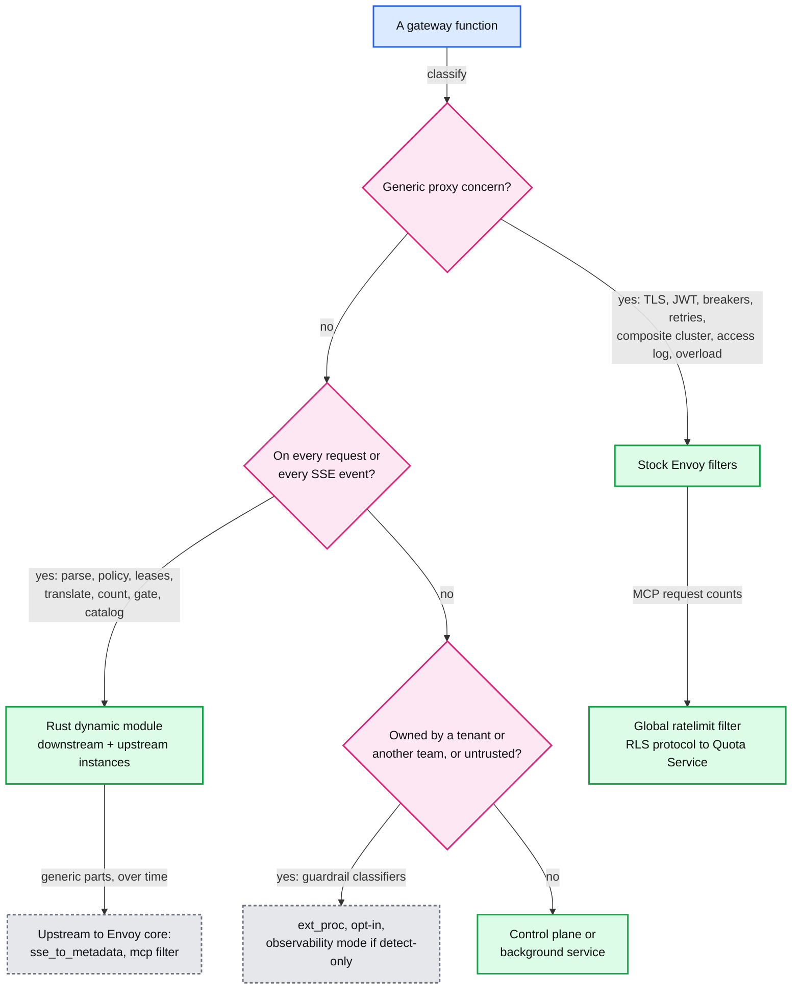

# Deep dive: where the AI logic runs in Envoy

> One-line answer: generic proxy concerns stay in stock Envoy filters; the per-request and per-event AI logic (body parse, policy, lease reservation, translation, SSE counting, the first-event gate, the MCP catalog) runs in one Rust dynamic module in two filter positions, because at 1.3M SSE events/s ext_proc would spend on the order of 160 cores and a network hop per event on what the module does in about 5 cores; ext_proc is kept for opt-in tenant guardrails that deserve a process boundary; and the module's blast radius is contained the way the binary's is, by cells, canaries, Rust and fuzzing.

Envoy mechanics: [report 08 §6.14 to §6.18](../../../popular_systems_deepdive/envoy/envoy-08-observability-and-extensibility.md) (ext_proc, dynamic modules, choosing a mechanism), [report 11](../../../popular_systems_deepdive/envoy/envoy-11-dynamic-modules.md) (dynamic modules in depth), [`interviewer-prep.md` §8](../../../popular_systems_deepdive/envoy/interviewer-prep.md) (the opinion to hold). Back to [`solution.md` §5.6](../solution.md#56-where-does-the-token-accounting-code-run-ext_proc-vs-dynamic-module-vs-native-filters).

---

## 1. The load the choice must carry

| Quantity at peak | Value | Source |
|---|---|---|
| LLM requests | 20k/s, 80% streamed | solution §2 |
| SSE events through the gateway | 1.3M/s (about 80 per streamed response) | solution §2 |
| Request bodies that must be parsed and often translated | 240 MB/s, tail bodies up to 32 MiB | solution §2 |
| Gateway latency budget | p99 < 10 ms on the request path, < 1 ms per event | solution §1.2 |

## 2. The options, with numbers

| Mechanism | How it runs | Request path cost | Per-event cost | Isolation | Maturity in v1.39.1 | Failure semantics |
|---|---|---|---|---|---|---|
| Native C++ filter | Compiled into Envoy | Lowest | Lowest | None | n/a (our own) | A crash takes the process |
| Dynamic module (Rust) | `.so` loaded by a stock binary, C ABI, zero-copy access to headers and bodies, HTTP callouts from the filter or the filter config, schedulers to resume a stream ([abi.h:2697, 2814](https://github.com/envoyproxy/envoy/blob/v1.39.1/source/extensions/dynamic_modules/abi/abi.h#L2697)) | Parse cost only, about 0.1 to 0.3 ms typical | 1 to 3 us **[inferred]** | None, same address space | HTTP filter stable since 1.38; posture `requires_trusted_downstream_and_upstream` ([extensions_metadata.yaml:2426-2432](https://github.com/envoyproxy/envoy/blob/v1.39.1/source/extensions/extensions_metadata.yaml#L2426)) | A panic becomes a failed request in the Rust SDK; a memory bug takes the process |
| Lua | Interpreter state per worker, copies | Low | Copy and parse in Lua | Script sandbox | Stable | Script error fails the request |
| Wasm (proxy-wasm) | VM per worker, copies across the boundary | Moderate | Copy plus parse in the VM | Memory-isolated sandbox | Alpha | VM failure fails requests on it |
| ext_proc | One bidirectional gRPC stream per HTTP stream; each enabled phase is a message and a reply ([report 08 §4.3](../../../popular_systems_deepdive/envoy/envoy-08-observability-and-extensibility.md)) | One round trip per phase, 0.3 to 1 ms in-zone, several ms at p99; `message_timeout` 200 ms | One message and reply per chunk in `STREAMED` mode, or "send and go" in observability mode, which cannot mutate | A separate process | Stable, `robust_to_untrusted_downstream_and_upstream` | `failure_mode_allow: false` by default: 504 on timeout, 500 otherwise |
| Native building blocks only | `sse_to_metadata` (alpha) plus rate limit `apply_on_stream_done` | One RLS round trip | Parse in the filter | n/a | Alpha plus stable | Fire-and-forget charging, fail open |

## 3. The arithmetic behind the recommendation

**ext_proc.** A streamed request needs, per direction: request headers, request body (buffered, to translate), response headers, and about 80 response body chunks. Call it 83 messages each way.
- `16k streamed req/s x 83 = 1.33M messages/s` each way, 2.66M/s in total.
- Assumption: 30 us of CPU per message per side (protobuf, gRPC framing, HTTP/2, copies) **[inferred]**. Envoy side: `1.33M x 2 x 30 us = 80 cores`; processor side the same: **about 160 cores**.
- Bytes: 240 MB/s of request bodies and 320 MB/s of response bodies go out to the processor and come back.
- Latency: two round trips on the request path (headers and body) and a round trip per chunk unless observability mode. With observability mode, counting works but translation and the first-event gate do not.

**Dynamic module.** Request parse and translation `20k/s x 100 us = 2 cores`; event scanning `1.3M/s x 2 us = 2.6 cores`: **about 5 cores**, no network, no new failure domain.

**Native building blocks.** Cheapest of all for what they do, and they do post-hoc token charging well. With `json_to_metadata` (alpha) they can even route on the body's `model` through a route `dynamic_metadata` match. They cannot translate formats, force `include_usage` (a body rewrite), reserve and refund, bound a budget, or account for disconnects.

## 4. What goes where

## 5. The module's design

- **Two instances of one crate.** The downstream HTTP filter (before the router) does parse, identity, policy, admission, affinity and accounting. The upstream HTTP filter, configured on each provider cluster, does translation, the credential, the first-event gate and response normalization. The dynamic modules HTTP filter supports both positions ([extensions_metadata.yaml:2426-2432](https://github.com/envoyproxy/envoy/blob/v1.39.1/source/extensions/extensions_metadata.yaml#L2426) lists the upstream category, stable).
- **State.** Per-stream state in the filter instance on its worker. Process-wide state behind the filter config: the policy snapshot (pointer swap), the lease table (sharded mutexes), fair queues, catalog cache. See solution §10.1.
- **I/O.** Grants, commits, feed polling, broker fetches and catalog refetches use the ABI's HTTP callouts: per-filter callouts when a request must wait (a cold grant), filter-config callouts for background work (feed, commits). The ABI offers HTTP callouts rather than gRPC ones, so the internal APIs are HTTP/2 with protobuf bodies.
- **Resuming a paused stream.** Fair-queue admission and cold grants pause the request (stop iteration) and resume it from a scheduler event on the stream's own worker.
- **Fail policy per function.**

| Function | On internal error | Why |
|---|---|---|
| Identity and policy | Fail closed (401 or 403) | Security |
| Quota grant unavailable | Fail static (solution Flow 7) | Availability with a bounded dollar exposure |
| Translation error | Fail closed (500 with a reason) | Sending a malformed body to a provider wastes money |
| SSE parse error | Pass bytes through, mark usage estimated | Never break a paying stream to protect a count |
| Catalog fetch error | Serve stale, then an error after 3x TTL | Tool lists change slowly |

## 6. Containing the blast radius

The cost of in-process code is that a bug can take the process down, with its 7k to 11k streams.
- **Language.** Rust, no `unsafe` outside the SDK. The Rust SDK contains panics so a panic fails one request instead of the process ([report 08 §6.18](../../../popular_systems_deepdive/envoy/envoy-08-observability-and-extensibility.md)).
- **Inputs.** The JSON and SSE parsers are the attack surface (provider and client bytes). They are fuzzed in CI with depth, size and duplicate-key limits.
- **Shipping.** The module is built in the same pipeline as the Envoy image, tested against that exact binary, and shipped as one image. Canary one cell (1/8 of a region) for an hour, then a quarter of the cells, then all, one region at a time. Rollback is the previous image.
- **Compatibility.** In v1.39.1 a module built for X.Y is guaranteed on X.Y and X.(Y+1) only, and a version mismatch merely logs a warning ([report 08 §6.16](../../../popular_systems_deepdive/envoy/envoy-08-observability-and-extensibility.md)); so we rebuild every quarterly release rather than rely on the check. On main, released ABI is now frozen and grows by `_v2` additions (#47435, 2026-09-14), which will ease this after the next release.
- **Isolation by placement.** Shuffle-sharded cells mean a poison input from one tenant can crash at most its two cells.

## 7. The opinion to say out loud

For code the platform team owns and tests, in-process is the right bet: native speed, every extension point, and Rust plus a C ABI buys most of the safety a sandbox was paying for. The price is blast radius, so ship the module like the binary: same pipeline, canaried by cell, rolled back as a unit, panics contained, fail closed where security needs it and fail open where money is only being counted. For code we do not control, such as a tenant's guardrail model, keep a process boundary (ext_proc) or a sandbox, because "same address space" is only acceptable when you control what is in it. This matches the direction Databricks and Netflix describe for replacing C++ forks and Wasm with Rust modules (KubeCon Japan 2026 abstract, summarized in [`interviewer-prep.md` §8](../../../popular_systems_deepdive/envoy/interviewer-prep.md)).

## 8. What to upstream, and what stays private

| Piece | Generic? | Where it belongs |
|---|---|---|
| SSE usage extraction per provider format | Yes | `sse_to_metadata` content parsers, or `ai_protocol_manager` (work in progress, extracts token usage from response bodies) |
| MCP header and body verification | Yes | The `mcp` filter, which already has `reject_duplicate_keys` and a body size limit |
| Catalog caching with `ttlMs` | Yes | `mcp_router`, once it implements the stateless spec |
| Lease protocol client | Partly | The shape of `rate_limit_quota`; would move there when an open-source RLQS server exists |
| Tenant policy snapshot, pricing, budgets, fair queues | No | Stays in the module |

Every piece that moves upstream shrinks the private module, and with it the code we must rebuild every quarter.
