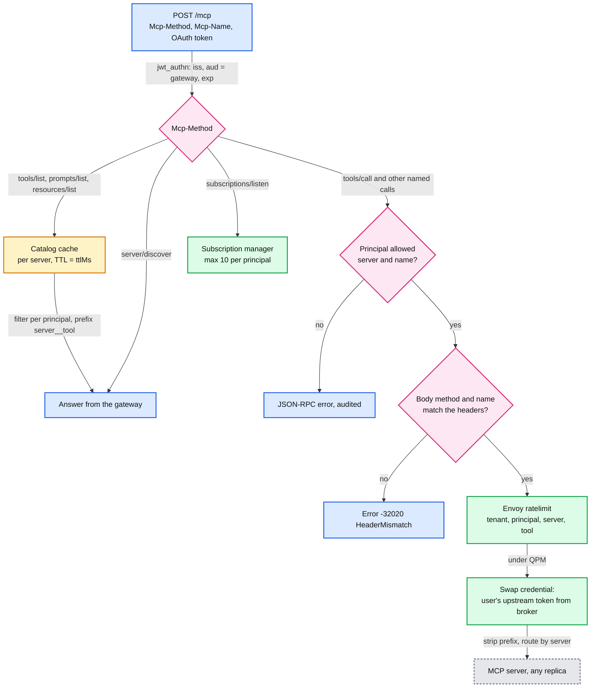
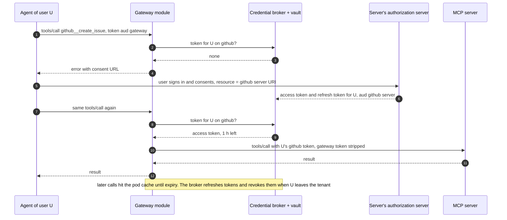

# Deep dive: MCP governance under the stateless 2026-07-28 spec

> One-line answer: the 2026-07-28 revision made MCP stateless and put `Mcp-Method` and `Mcp-Name` on every Streamable HTTP POST, so the gateway routes and authorizes on headers with no session map and no affinity, verifies the headers against the body before trusting them, answers `tools/list` and `server/discover` itself from per-server catalogs cached for the server's `ttlMs` and filtered per principal, and calls each server with the user's own upstream token from a credential broker, because the spec forbids token passthrough.

Sources: [changelog](https://modelcontextprotocol.io/specification/2026-07-28/changelog), [release post](https://blog.modelcontextprotocol.io/posts/2026-07-28/), [SEP-2575 stateless MCP](https://modelcontextprotocol.io/seps/2575-stateless-mcp), [authorization](https://modelcontextprotocol.io/specification/2026-07-28/basic/authorization), [Streamable HTTP transport](https://modelcontextprotocol.io/specification/2026-07-28/basic/transports/streamable-http), [security best practices](https://modelcontextprotocol.io/docs/2026-07-28/tutorials/security/security_best_practices). Envoy side: [report 12](../../../popular_systems_deepdive/envoy/envoy-12-mcp-and-ai-gateway.md) and [`interviewer-prep.md` §4](../../../popular_systems_deepdive/envoy/interviewer-prep.md). Back to [`solution.md` §5.5](../solution.md#55-mcp-under-the-stateless-2026-07-28-spec-governance-at-the-gateway).

---

## 1. What changed, and what did not

Changed for gateways (full table in solution §5.5): no `initialize`, no `Mcp-Session-Id`, `server/discover` instead; `Mcp-Method` and `Mcp-Name` headers on POSTs; `subscriptions/listen` instead of the GET stream and `resources/subscribe`; Multi Round-Trip Requests (`resultType: "input_required"`) instead of server-initiated sampling, elicitation and roots; no SSE resumability; `ping` and `logging/setLevel` removed; `ttlMs` and `cacheScope` on list results; Client ID Metadata Documents instead of Dynamic Client Registration (deprecated); RFC 9207 issuer validation.

Unchanged and still load-bearing: the server is an OAuth resource server; clients request tokens with the `resource` parameter (RFC 8707) and servers validate the audience; and "MCP servers MUST NOT accept any tokens that were not explicitly issued for the MCP server" ([authorization](https://modelcontextprotocol.io/specification/2026-07-28/basic/authorization)). A gateway is a resource server for its clients and an OAuth client of every server behind it.

Why a gateway still exists once sessions are gone: aggregation and prefixing across servers, central authorization per tool, rate limits and cost attribution per agent and per tool, and catalog caching ([Tyk's gateway guide](https://tyk.io/learning-center/mcp-gateway-architecture-technical-guide/) lists the same jobs; it is a vendor page, not a primary source).

## 2. The request path



## 3. Routing on headers, and why the body must still be checked

- **Native routing.** Envoy route matchers see headers, so the method and the server prefix route without a body parse. A sketch of the route (header names are matched case-insensitively):

```yaml
# Route MCP tool calls for the github server by header alone (sketch).
- match:
    prefix: /mcp
    headers:
    - name: mcp-method
      string_match: { exact: tools/call }
    - name: mcp-name
      string_match: { prefix: github__ }
  route: { cluster: mcp-github, timeout: 60s }
```

- **Tenant-registered servers** do not get a cluster each (thousands of tenants times several servers would bloat every pod's config). They go through one dynamic forward proxy cluster; the module resolves `(tenant, prefix) -> server URL` from the snapshot and sets the upstream host.
- **Why verify the body.** The header is what the gateway authorizes; the body is what the server executes. A client can send `Mcp-Name: github__search_issues` with a body that calls `delete_repo`. The spec defines a HeaderMismatch error (`-32020`) for exactly this disagreement ([spec](https://modelcontextprotocol.io/specification/2026-07-28)), but a gateway cannot assume every third-party server enforces it. The module parses the first 8 KB of the body with a streaming parser (the same default size the Envoy `mcp` filter buffers for JSON-RPC parsing), extracts `method` and `params.name`, and rejects a mismatch. Duplicate keys are rejected so a body cannot carry two names. About 20 us per call.
- **Which name.** `Mcp-Name` carries the name of the tool or prompt the call targets **[inferred for methods other than `tools/call`; check the transport spec per method]**.

## 4. The aggregated catalog

- **Keying.** One cache entry per `(server, scope)`. A list the server marks as shareable in `cacheScope` is cached once per server; any other list is cached per principal **[inferred reading of `cacheScope` semantics]**. TTL is the server's `ttlMs`; 5 minutes when absent (our choice).
- **Stampedes.** Single-flight per server per pod, stale-while-revalidate, and ±10% TTL jitter per pod, so 72 pods refetch over a few seconds instead of at once.
- **Filtering and prefixing.** The principal's tool policy is applied to the cached list on every `tools/list` (a hash-set lookup per tool). Names become `server__tool`, where `server` is a registry-assigned prefix unique within the tenant. Filtering also shrinks the prompt: tool definitions sent to a model cost input tokens on every turn, which is why Agent Router filters its unified catalog per user to minimise the context window ([MCP docs](https://theagentrouter.ai/docs/capabilities/mcp/)).
- **A cap.** At most 200 tools in one merged catalog per principal by default; beyond that the admin must narrow the policy. Large catalogs degrade tool selection and cost tokens.
- **Change notification.** The gateway owns the merged catalog, so it emits `notifications/tools/list_changed` on a client's `subscriptions/listen` stream when the registry changes or a refetch returns a different list.
- **Numbers.** About 4k `tools/list` per second at peak become about 50 upstream fetches per second.

## 5. Credentials without passthrough

- **Per-user upstream tokens.** The credential broker stores, per `(principal, server)`, a token issued by the server's own authorization server for that server's URI (RFC 8707 resource indicator), plus its refresh token, in a vault.
- **First use.** No token yet: the gateway returns an error that carries the consent URL; the user completes the server's OAuth flow once; the broker stores the token. This is the single-sign-on experience Databricks describes, where developers "authenticate once with Databricks credentials for all tools including GitHub, Atlassian" ([governance post](https://www.databricks.com/blog/governing-coding-agent-sprawl-unity-ai-gateway)).
- **Every call.** The module fetches the token on a pod cache miss, caches it until expiry (encrypted in memory), replaces `Authorization`, and strips the client's token.
- **Service credentials** are allowed only for tools with no user context (for example a shared read-only search index), approved per server by an admin, and logged as a service principal.



## 6. Multi Round-Trip Requests and subscriptions

- **`input_required`.** When a server needs user input or a model sample, it returns a result with `resultType: "input_required"` instead of opening a request back to the client. The gateway passes it through untouched. The client's follow-up is an ordinary new request with the same `Mcp-Name`, so it is routed to the same server, any replica, on any gateway pod. No state at the gateway.
- **Gateway-issued confirmation.** For tools an admin flags as destructive, the gateway can itself answer the first call with an `input_required` asking the user to confirm **[inferred use of the mechanism; not described in the spec as a gateway feature]**.
- **`subscriptions/listen`.** A long-lived POST response stream. The gateway caps them at 10 per principal and counts them against concurrency, not QPM. For resource subscriptions it opens one upstream listen per server the client subscribed to and merges them into the client's stream, tagged by subscription id. No resumability: if the stream breaks, the client listens again.

## 7. Registry, approval and egress

- **Registration.** HTTPS only; the host must resolve to public addresses (the security guidance lists the private ranges to block: 10.0.0.0/8, 172.16.0.0/12, 192.168.0.0/16, 127.0.0.0/8, ::1); the gateway probes `server/discover` and `tools/list` and stores the catalog.
- **Approval.** New servers start read-only: the admin sees real tool names and approves them per group. Tool policies support patterns (`github/*_read`) and explicit denies.
- **Egress at connect time.** The dynamic forward proxy's resolved addresses are checked again against the private ranges, which stops DNS rebinding after registration. Egress runs in a network segment with no route to internal services.

## 8. Rate limits for MCP

MCP has no tokens, so request counts are the right unit, and Databricks likewise offers only queries per minute for MCP services ([docs](https://docs.databricks.com/aws/en/ai-gateway/rate-limits)). Envoy's global rate limit filter fits exactly: descriptors `(tenant)`, `(tenant, principal)`, `(tenant, principal, server, tool)`, answered by the Quota Service speaking the rate limit service protocol. RLS call timeout 20 ms, fail open. LLM calls that tools trigger are metered on the LLM path.

## 9. Envoy's MCP filters: status and plan

| Filter (v1.39.1) | Status | What it does | Our use |
|---|---|---|---|
| `envoy.filters.http.mcp` | alpha, proto work in progress | Parses JSON-RPC, publishes method and ids as metadata for RBAC, ext_authz and rate limits; strict mode knows the session-era GET and DELETE | Not on the path yet; header extraction and validation for 2026-07-28 merged to main on 2026-09-02 ([#46817](https://github.com/envoyproxy/envoy/pull/46817)), not in a release yet |
| `envoy.filters.http.mcp_router` | alpha | Terminal filter: fans out initialize and lists, routes calls by tool prefix, composite session ids | Not yet: session-based. The target home for aggregation once it speaks 2026-07-28 |
| `envoy.filters.http.mcp_json_rest_bridge` | alpha | Exposes REST backends as MCP tools | Candidate for wrapping internal REST APIs later |
| `envoy.clusters.mcp_multicluster` | alpha, requires trusted | Multi-cluster MCP backends | Not used |

Plan: header routing and the module now; pin the Envoy version because MCP protos are work in progress; move the catalog merge into `mcp_router` when it implements the stateless spec and leaves alpha, and contribute the pieces we built (header and body verification, `ttlMs`-driven caching) upstream. Say "landing on main", not "Envoy supports the new spec".
