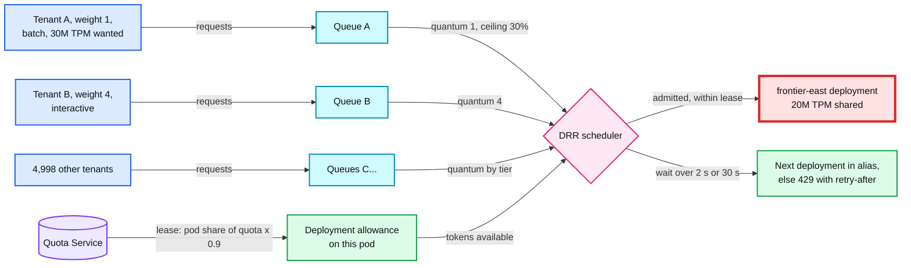
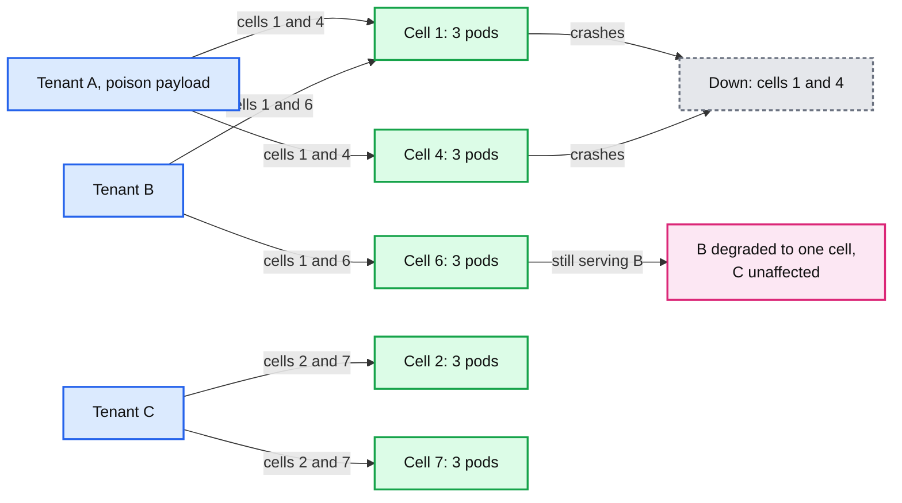

# Deep dive: multi-tenant isolation and noisy neighbors

> One-line answer: tenant limits protect our bill, not our neighbors, because tenant limits sum to about three times the provider quota; isolation needs a second layer at the scarce resource, so the Quota Service leases each provider deployment's quota to pods, each pod shares its lease across tenants by weighted deficit round robin with a 30% per-tenant ceiling, concurrency is capped in leased slots because long streams consume concurrency rather than rate, Envoy's breakers and retry budgets are resized for 20-second streams, and pods are grouped into cells with tenants shuffle-sharded onto two of eight.

Reusable blocks: [`concepts/rate-limiting-and-load-shedding.md`](../../../concepts/rate-limiting-and-load-shedding.md), [`hld/network-throttling/deep-dives/hierarchical-fair-allocation.md`](../../network-throttling/deep-dives/hierarchical-fair-allocation.md). Envoy mechanics: [report 05](../../../popular_systems_deepdive/envoy/envoy-05-resilience.md). Back to [`solution.md` §5.2](../solution.md#52-one-tenants-batch-job-must-not-starve-4999-others-isolation-and-noisy-neighbors).

---

## 1. The scarce resource

| Resource | Can we add more in minutes? | What happens when it runs out |
|---|---|---|
| Envoy pods | Yes, autoscale | Latency, then shedding |
| Quota Service | Yes, it is under 1% used | Fail static (see the token deep dive) |
| **Provider deployment quota (TPM, RPM)** | **No. Bought per deployment, often months ahead** | **429 for every tenant on that deployment** |
| Self-hosted GPU pool | Hours to days | Queueing, then timeouts |

The numbers: peak demand is 3.3B tokens/min across about 200 deployments, 16M TPM each on average; the busiest frontier deployment runs at 90% of its quota at peak because idle quota is expensive. Tenants use about a fifth of their TPM limits on average (assumption), so selling limits that sum to 3x the quota is how the business works. It is also why one tenant using its full limit can take a deployment away from everyone.

## 2. Lease the provider quota

- The deployment table holds each deployment's quota. The Quota Service leases `quota x 0.9` to pods in proportion to their recent demand for that deployment, 10 s at a time, with the same `Grant` protocol as key leases.
- The fleet cannot send more than the lease in aggregate. So a provider 429 is not normal traffic; it means the quota model is wrong (the provider cut quota, or counts differently), and it pages.
- The 10% margin absorbs estimation error (reservations are estimates) and the provider's own window alignment.
- On a 429 with `retry-after`, the module marks that deployment's local allowance empty until then and the Quota Service shrinks the deployment's leasable quota by the observed shortfall **[inferred control loop]**.

## 3. Fair queuing per deployment, per pod

When a pod's allowance for a deployment is spent, requests wait in per-tenant queues instead of failing:

- **Deficit round robin.** Each tenant queue gets a quantum per round proportional to its weight (1 standard, 4 enterprise; batch priority 0.25). A request is admitted when the queue's deficit covers its token estimate. Cost per decision: O(1).
- **Ceiling.** No tenant takes more than 30% of a deployment's allowance while any other tenant is waiting. With no one waiting, a tenant can use all of it (work conserving).
- **Maximum wait.** 2 s for interactive, 30 s for `x-gw-priority: batch`. On timeout: the next deployment in the alias if it has leased headroom, else 429 with `retry-after`.
- **Global fairness from local fairness.** Connections land on pods at random, so each tenant's demand spreads across pods roughly in proportion. Per-pod DRR then approximates global weighted fairness without a global queue. A tenant concentrated on few pods (one long-lived HTTP/2 connection) is still bounded by its own leases.

## 4. Concurrency, not rate

Little's law: in-flight = arrival rate x duration. A tenant sending 10 req/s of 10-minute agent streams holds 6,000 streams, while one sending 100 req/s of 2 s chats holds 200. A rate limit sees the second as ten times heavier; the pods and the provider see the first as thirty times heavier.

- **Per key:** 16 slots, leased (global, not per pod). Also what makes the budget headroom `H(k)` finite.
- **Per tenant:** slots by tier (for example 500 standard, 5,000 enterprise), leased the same way.
- **Envoy has no per-tenant concurrency limiter.** Circuit breakers are per cluster; `local_ratelimit` is a rate (one bucket per filter config, shared by workers) and its `filter_enabled` and `filter_enforced` default to 0%; adaptive concurrency is per filter config. So slots live in the module.

## 5. Resizing Envoy's resilience knobs for long streams

| Knob | Default | Why it breaks here | Our value |
|---|---|---|---|
| Circuit breaker `max_requests` per cluster per Envoy | 1024 | After a region loss a pod holds 11k streams, about 6.6k to the busiest provider cluster: 503 `UO` with a healthy provider | about 20k: `deployment concurrency / pods x 1.5` |
| `max_pending_requests` | 1024 | Envoy's pending queue is FIFO across tenants | Small (100); the module's fair queue is the queue |
| Retry budget `budget_percent`, `min_retry_concurrency` | 20%, 3 | 20% of 6.6k active is 1,300 concurrent retries into a provider already saying 429 | 5%, 3 |
| Outlier `consecutive_5xx` | 5, enforced | Fine | 5 |
| Outlier `consecutive_gateway_failure` enforcement | 0% (counted, not enforced) | 502, 503, 504 from a bad endpoint never eject it | 100% |
| Outlier `max_ejection_percent` | 10% | With fewer than 10 hosts nothing is ejected unless one host is always allowed | `always_eject_one_host` on small clusters |

Breakers are shared per cluster across workers with atomics, and check-then-increment is not one step, so a limit can be exceeded briefly by about one request per racing worker ([report 05 §6.3](../../../popular_systems_deepdive/envoy/envoy-05-resilience.md)). That is fine for a safety limit; it is why the precise limits (leases, slots) live in the module.

## 6. Isolation inside a pod

- **Parse CPU.** A tenant sending 4 MB prompts at 100/s costs 400 MB/s of JSON parsing on the pods it lands on. A per-tenant request-byte rate limit (`local_ratelimit` keyed by a tenant descriptor the module sets, enforcement explicitly 100%) bounds it.
- **Memory.** The overload manager: `reset_high_memory_stream` at 90% heap resets streams in the largest memory bucket first; `stop_accepting_requests` at 95%.
- **Poison requests.** A payload that crashes the module (a parser bug) would crash every pod it reaches if a tenant's traffic could land anywhere.

## 7. Cells and shuffle sharding

- Each region's 24 pods form 8 cells of 3 pods, one per zone, so a cell survives a zone loss.
- Every tenant is assigned 2 of the 8 cells: 28 possible pairs. The L4 layer routes a tenant's connections only to its cells (by a tenant hint in SNI or the first request, then connection reuse) **[inferred mechanism]**.
- A poison request from tenant A can take down at most A's 2 cells. Another tenant loses service only if it has exactly the same pair: probability 1/28, and then only in that region. The top 20 tenants by spend are placed so no two share a pair.
- Code rollouts go cell by cell, so a bad build hits one cell (1/8 of a region) before anything else.

## 8. Checking the isolation NFR

The NFR: one tenant at 10x adds under 1 ms to another tenant's gateway p99 and under 0.1 percentage points to its provider 429 rate.

- **Gateway p99.** The heavy tenant's parse CPU is bounded by its byte limit and spread over its 2 cells (6 pods). Other tenants on those cells share CPU running under 30%; queueing delay at 30% utilization is small. Tenants on other cells see nothing.
- **Provider 429 rate.** Leases stop the fleet exceeding the deployment quota, so the provider does not 429 at all; the heavy tenant waits in its own queue, capped at 30% of the allowance while others wait.
- **What the other tenant does see:** if the deployment is saturated, a fair-queue wait of up to a few hundred ms at its weight, and possibly a fallback deployment. That is the price of shared capacity, and it is visible on the queue-wait dashboard by tier.
