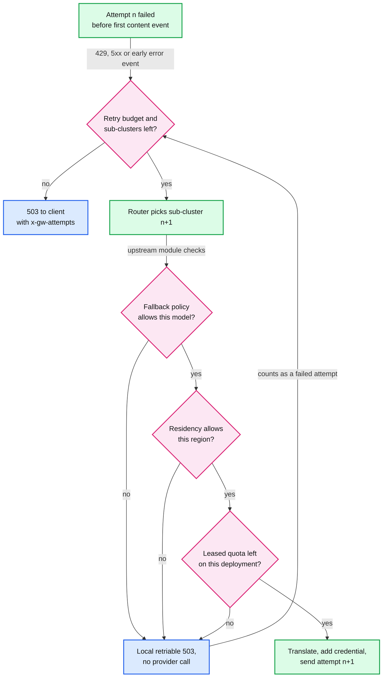
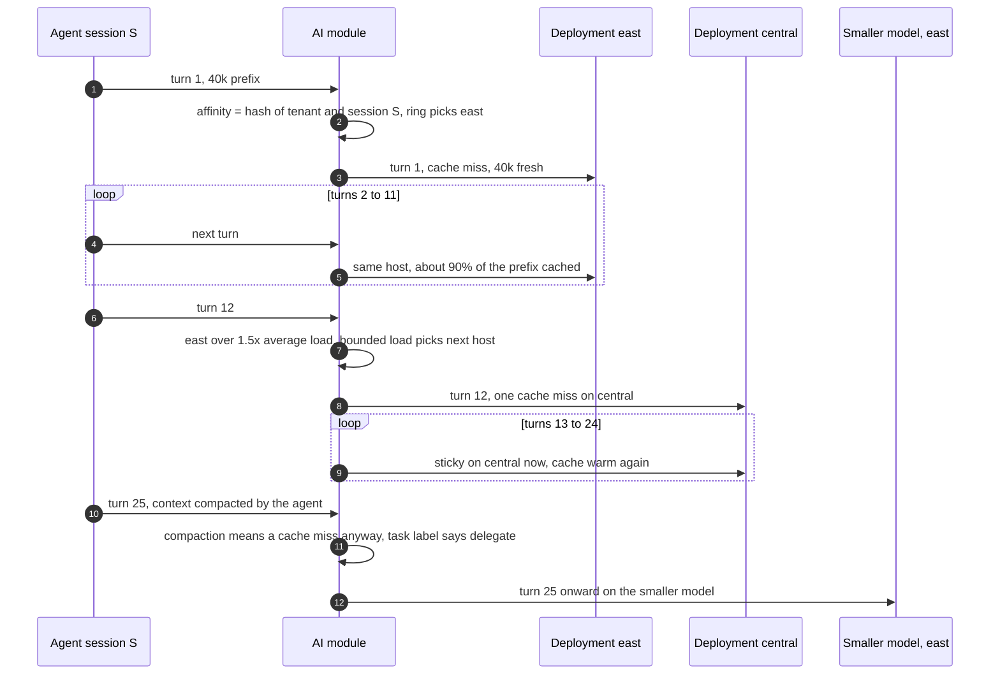

# Deep dive: routing and fallback

> One-line answer: model each `provider x model` as an Envoy cluster whose hosts are that model's deployments, route an alias to a composite cluster so retry attempt n goes to sub-cluster n, let a per-cluster upstream module instance translate the body and add the credential so a retry to another provider just works, fail over only before the first content event, and keep every session on one deployment with a ring hash on an affinity key with bounded load, because prompt-cache hit rate, not list price, dominates cost at agent scale.

Envoy mechanics: [report 04](../../../popular_systems_deepdive/envoy/envoy-04-cluster-manager-and-load-balancing.md) (load balancers, ring hash, bounded load), [report 05 §6.5](../../../popular_systems_deepdive/envoy/envoy-05-resilience.md) (retries). Back to [`solution.md` §5.4](../solution.md#54-route-across-200-deployments-fail-over-and-keep-prompt-caches-warm-routing-and-fallback).

---

## 1. Modeling providers in Envoy

| Concept | Envoy object | Example |
|---|---|---|
| A model at one provider | Cluster | `anthropic.claude-large` |
| One deployment of it (region, account) | Host in that cluster, with metadata (quota id, credential reference) | `east`, `central` |
| A tenant alias with fallbacks | Composite cluster listing clusters in order | `alias.T.claude-large -> [anthropic.claude-large, anthropic.claude-large.acct2, other.equivalent-large]` |
| Per-provider translation and credential | Upstream HTTP filter configured on the cluster (`HttpProtocolOptions.http_filters`, [http_protocol_options.proto:175](https://github.com/envoyproxy/envoy/blob/v1.39.1/api/envoy/extensions/upstreams/http/v3/http_protocol_options.proto#L175)) | The module's upstream instance |

- **Composite cluster.** Added in 1.37, status stable: "retries automatically fall back to different sub-clusters based on retry attempt count", and a request fails with no host once attempts exceed the list ([changelog](https://github.com/envoyproxy/envoy/blob/v1.39.1/changelogs/1.37.0.yaml#L710), [cluster.proto:43-54](https://github.com/envoyproxy/envoy/blob/v1.39.1/api/envoy/extensions/clusters/composite/v3/cluster.proto#L43)). Unlike the aggregate cluster, which fails over by health and priority, it is deterministic per attempt, which is what an ordered fallback list wants.
- **Why the translation must be per cluster.** A retry to a different provider needs a different body and a different credential. A downstream filter runs once per request; an upstream filter on the cluster runs once per attempt against that cluster. So the downstream instance keeps the original OpenAI-format body, and each attempt's upstream instance produces its own provider format **[inferred: verify that the upstream filter sees the selected host's metadata for the credential lookup]**.
- **Why not one cluster per deployment and let the module pick.** 200 deployments as 200 clusters works for routing, but it moves load balancing and health into the module. Keeping deployments as hosts lets Envoy's outlier detection, ring hash and bounded load do their jobs.

## 2. Retry and fallback rules

- `retry_on: 5xx, reset, connect-failure, retriable-status-codes` with 429 listed. `num_retries` = number of fallbacks, at most 2.
- Retry budget 5% of active plus pending, minimum 3 (default is 20%).
- **Only before the first content event.** The upstream module holds the provider's headers until the first content event and rewrites an early error event into a retriable 503 (see [`streaming-and-usage-accounting.md` §4](streaming-and-usage-accounting.md#4-the-first-event-gate-failover-before-the-first-byte)). After that, no retry.
- **Body replay needs the buffer.** The router replays the buffered request body on each attempt, which is one more reason for the 32 MiB `request_body_buffer_limit` on LLM routes.
- **429 is a signal about the deployment, not the request.** On a 429 the module marks that deployment's allowance empty until `retry-after`, so the next requests skip it without trying. Envoy's `rate_limited_retry_back_off` with `reset_headers` would instead wait and retry the same upstream ([route_components.proto:1685](https://github.com/envoyproxy/envoy/blob/v1.39.1/api/envoy/config/route/v3/route_components.proto#L1685)); for a gateway with fallbacks, moving on is better than waiting.
- **Fallback reads the provider leases.** A sub-cluster whose leased quota is already spent is skipped: falling back into a deployment that the same surge has exhausted only adds an attempt.
- Response header `x-gw-attempts: 2, served-by anthropic.claude-large.acct2/central` for debugging.

How a skip works, since the composite cluster maps attempts to sub-clusters deterministically: the upstream module instance on a sub-cluster that must be skipped (policy, residency, or no leased quota) answers the attempt locally with a retriable 503 without calling the provider, so the router moves to the next sub-cluster after one jittered back-off (25 ms base) **[inferred: verify in a test that the router retries a local reply from an upstream filter]**.

## 3. The economics of cache hits

Assumption for the arithmetic: a cache read costs 10% of fresh input (check each provider's price sheet; Agent Router's example cost expression weights cached tokens at 0.1, [docs](https://theagentrouter.ai/docs/0.7/capabilities/traffic/usage-based-ratelimiting/)). An agent turn re-sends a 40k-token prefix.

| Cache hit rate on the prefix | Input cost per turn (token-equivalents) | vs 90% |
|---|---|---|
| 0% | 40,000 | 5.3x |
| 50% | 22,000 | 2.9x |
| 80% | 11,200 | 1.5x |
| 90% | 7,600 | 1.0x |
| 95% | 5,800 | 0.76x |

- Round robin across 3 deployments of the same model: each deployment has its own cache (provider caches are per account or deployment **[inferred]**), so a session's turns land on a cold cache about two thirds of the time.
- Switching model mid-session costs one full miss on the new model: 40k instead of 7.6k on that turn. The new model must be more than 5x cheaper per token just to break even on the switch turn, and it then rebuilds its cache.
- Databricks reached the same conclusion from production data: "at scale, costs are dominated by cache hit rate", so they chose task-aware routing, which keeps consecutive turns on one model, over per-request routing ([smart routing post](https://www.databricks.com/blog/smart-routing-unity-ai-gateway-match-frontier-quality-30-lower-cost-task)).

## 4. Affinity with bounded load

- **Affinity key.** `hash(tenant, x-gw-session)` when the client sends a session or conversation id; otherwise a hash of the first 2 KB of the prompt (the system prompt and first user turn), which is stable across the turns of one agent task. The module writes it into `x-gw-affinity`.
- **Ring hash on the key.** The cluster's `hash_policy` hashes `x-gw-affinity`; `ring_hash` picks the host. Removing one of N hosts moves about 1/N of sessions, so a deployment outage costs a cache miss only for its own sessions.
- **Bounded load.** `hash_balance_factor: 150` caps any host at 1.5x the average request load; an overloaded host's new requests go to the next host on the ring. "Typical value for this parameter is between 120 and 200" ([cluster.proto:612-628](https://github.com/envoyproxy/envoy/blob/v1.39.1/api/envoy/config/cluster/v3/cluster.proto#L612)). It is O(N) per pick, fine for a handful of deployments per cluster.
- **Self-hosted pools.** The same key picks the replica that holds the prefix in its KV cache. This is the same principle one level down: route for cache locality first, balance second.

## 5. Task-aware model choice (credited)

For tenants that set `model: auto`, the gateway follows the published design ([smart routing post](https://www.databricks.com/blog/smart-routing-unity-ai-gateway-match-frontier-quality-30-lower-cost-task), 2026-08-13):
- A small, fast classifier labels the task from its description and signals such as the files touched or the failure being fixed.
- The router defaults to a medium model and escalates to a frontier model or delegates to a cheaper one by label.
- Consecutive turns stay on the chosen model. The post's future work is routing after a few turns and switching at context compaction, where a cache miss happens anyway.
- Reported results: 35% savings on their internal benchmark and 56% on public coding benchmarks.

The gateway's part is mechanical: store the choice per session (keyed like the affinity key, TTL 1 hour), and only re-decide at compaction or on an explicit client change.

## 6. Fallback policy per alias

| Policy | What it allows | Default for |
|---|---|---|
| `same_model_only` | Other deployments and accounts of the same model | Everyone |
| `equivalent_models` | A listed equivalent model at another provider | Tenants that opt in per alias |
| `none` | No fallback, 503 when the primary is down | Evaluation workloads that need one exact model |

Cross-provider fallback is not free. The output differs (quality, tool-calling behaviour); the tokenizer differs, so estimates and budgets shift; the price differs; and data residency may forbid it (an EU-pinned tenant never falls back outside the EU). That is why it is opt-in and visible in `x-gw-attempts`.
