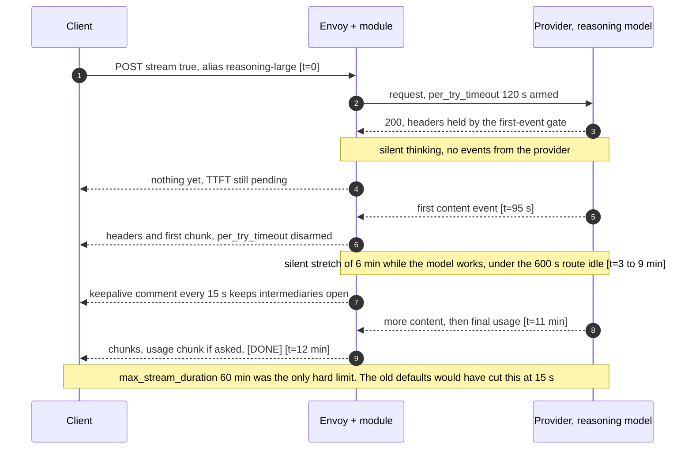
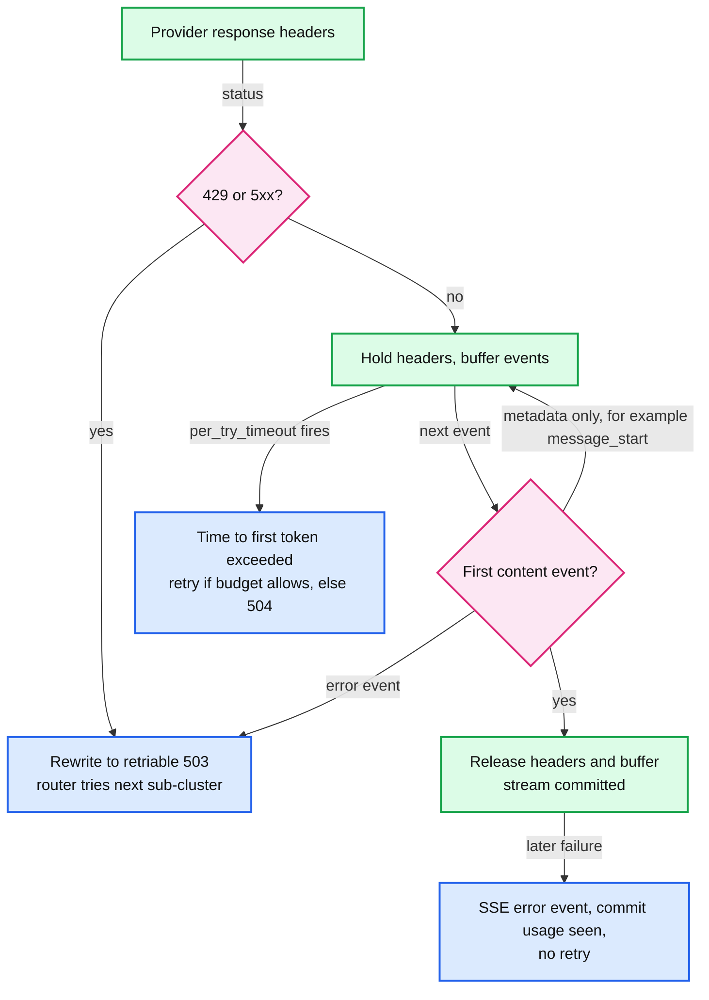

# Deep dive: streaming and usage accounting

> One-line answer: pass SSE events through without buffering, normalize every provider to one OpenAI-style chunk format with a final usage chunk at the upstream edge, force providers to report usage, disable Envoy's 15 s route timeout and replace it with per-class idle and maximum durations plus 15 s keepalive comments, buffer requests (up to 32 MiB) because translation and retry need the body, hold the provider's headers until the first content event so failover can happen before the client sees a byte, and treat every count the gateway makes itself as an estimate to be reconciled against the provider's export.

Reusable block: [`concepts/realtime-client-server-communication.md`](../../../concepts/realtime-client-server-communication.md) (SSE vs WebSocket vs long polling). Envoy mechanics: [report 03 §6.5 and §6.7](../../../popular_systems_deepdive/envoy/envoy-03-http-connection-manager-and-routing.md) (flow control, HCM timers), [report 05 §6.4](../../../popular_systems_deepdive/envoy/envoy-05-resilience.md) (timeout matrix). Back to [`solution.md` §5.3](../solution.md#53-streams-last-10-minutes-and-must-be-billed-exactly-streaming-correctness).

---

## 1. SSE on the wire, per provider

An SSE stream is `text/event-stream`: lines of `field: value`, an event ends at a blank line, and a line starting with `:` is a comment that clients ignore. That last rule is what makes keepalives free.

| Provider | Where usage appears | What the gateway must do |
|---|---|---|
| OpenAI Chat Completions | Only if the request sets `stream_options.include_usage: true`. Then usage is null on every chunk except the last, which carries `prompt_tokens`, `completion_tokens`, `total_tokens`; the stream ends with `data: [DONE]` ([streaming events](https://developers.openai.com/api/reference/resources/chat/subresources/completions/streaming-events), [guide](https://developers.openai.com/api/docs/guides/streaming-responses)) | Inject `include_usage: true`. If the client did not ask for it, drop the extra final chunk before forwarding **[inferred choice, some clients mishandle a chunk with empty choices]** |
| Anthropic Messages | `message_start` carries `usage` with the input tokens and `output_tokens: 1`; each `message_delta` carries cumulative usage; the stream ends with `message_stop` ([streaming docs](https://platform.claude.com/docs/en/build-with-claude/streaming)) | Exact input at the first event. Translate the event sequence into OpenAI chunks and emit one final usage chunk |
| Other providers | Adapter per provider | Same contract: the upstream instance emits OpenAI chunks plus one final usage chunk |

**Normalize at the upstream edge, account at the downstream edge.** The upstream instance of the module (one per provider cluster) translates the provider's stream into OpenAI chunks, including a final usage chunk. The downstream instance then parses a single format for accounting, whatever cluster served the attempt. Cached-input counts are carried as a separate token type, priced separately (Agent Router's cost configuration has the same split: `InputToken`, `CachedInputToken`, `OutputToken`, [docs](https://theagentrouter.ai/docs/0.7/capabilities/traffic/usage-based-ratelimiting/)).

## 2. The timeout matrix for a long stream

Every Envoy timer, what it bounds, and what a 12-minute reasoning stream needs. Defaults are v1.39.1 ([facts from reports 03 and 05](../../../popular_systems_deepdive/envoy/envoy-05-resilience.md)).

| Timer | Default | Clock | What it would do to a long stream | Our value (chat / reasoning) |
|---|---|---|---|---|
| Route `timeout` | 15 s | from request complete to response complete | 504 before headers, reset after: kills every stream past 15 s | 0 (disabled) / 0 |
| Route `idle_timeout` | unset (HCM value applies) | reset on every event | kills a silent stretch | 120 s / 600 s |
| HCM `stream_idle_timeout` | 5 min | reset on every event | kills a reasoning model silent for 6 min | 10 min (outer bound) |
| `max_stream_duration` | unset | from stream start | nothing unless set | 30 min / 60 min (safety cap) |
| `per_try_timeout` | unset (route timeout) | until response headers of an attempt | with the first-event gate (§4), bounds time to first token | 20 s / 120 s |
| Cluster `connect_timeout` | 5 s | TCP and TLS connect | slow failover | 1 s |
| Upstream connection `idle_timeout` | 1 h | pool connection with no streams | nothing | default |
| Rate limit and `ext_authz` `timeout` | 20 ms / 200 ms | one call | since 1.38, `0s` means infinite, not fail fast | 20 ms / 200 ms, never 0 |

Two more things a long stream needs:
- **Keepalive comments.** The module writes `: keepalive` downstream every 15 s while the upstream is silent. Clients ignore comment lines. It keeps corporate proxies and cloud load balancers from dropping an idle flow **[inferred: typical intermediary idle limits are a few minutes]**. Envoy's own idle timers are sized per route class above, so they do not depend on the keepalives.
- **Drain on deploy.** Envoy's default drain time is 600 s, in the same range as the longest normal streams, so rolling a pod does not cut most of them.

## 3. Buffering and flow control

- **Requests are buffered.** The module needs the whole JSON to route by `model` and to translate, and the router keeps the body to replay it on a retry. The listener's `per_connection_buffer_limit_bytes` is 1 MiB, so without a change a 4 MB prompt gets 413. `request_body_buffer_limit` (route or virtual host, the replacement for the deprecated `per_request_buffer_limit_bytes`) raises it to 32 MiB on LLM routes only ([route_components.proto:229-247](https://github.com/envoyproxy/envoy/blob/v1.39.1/api/envoy/config/route/v3/route_components.proto#L229)).
- **The cost of store-and-forward.** The provider cannot start prefill before the last byte, so buffering adds only the gateway-to-provider transfer: about 1 ms per 100 KB at 1 Gbps per stream, 30 ms for a 4 MB prompt. Gateway overhead is measured from the last request byte in.
- **Responses are never buffered.** Each chunk is scanned in place and forwarded. The downstream H2 stream buffer's high watermark is the 16 MiB stream window and the connection buffer is 1 MiB; a slow reader fills them and Envoy pauses reading from the upstream stream. A typical response is 16 KB, so it fits in the buffers and the provider never feels a slow client.
- **Memory is the real risk.** 11k streams per pod at a few KB of buffered response each is tens of MB; the worst case (clients that stop reading large responses) is bounded by the overload manager's `reset_high_memory_stream`, which resets streams in the largest memory bucket first, and by `stream_flush_timeout`, which resets a stream that cannot flush.

## 4. The first-event gate: failover before the first byte

Envoy retries only until the response headers go downstream. Many providers send `200` and headers early, then an error event if they are overloaded. Without help, that error reaches the client and there is no retry.

The gate lives in the **upstream** instance of the module, attached to each provider cluster, because upstream filters run per attempt, before the router commits a response downstream:
1. On provider response headers: if the status is 429 or 5xx, rewrite to a retriable 503 at once. Otherwise hold the headers.
2. On body data: parse events. If the first content event arrives (OpenAI: a chunk with content or tool call deltas; Anthropic: a content block event, not `message_start`), release the held headers and everything buffered so far. The stream is now committed.
3. If an error event arrives before any content, rewrite the held response to a retriable 503. The router's retry policy sends the next attempt to the next sub-cluster of the composite cluster.
4. While the headers are held the router has not seen them, so `per_try_timeout` keeps running: it has become a time-to-first-token timeout.

This behaviour follows from how upstream filters and the router interact, but it is **[inferred]**: it must be proven with an integration test per Envoy release before relying on it.

Holding the headers costs the client nothing it would notice: headers without a token are not useful, and the first chunk arrives together with them. The buffer held per stream is a few hundred bytes.

## 5. Usage accounting, end to end

- **Truth.** The provider's reported usage is what we are billed. Every gateway count is an estimate.
- **Normal completion.** The downstream module reads the final usage chunk: input, cached input, output. Cost uses the deployment's price version. The record goes to the Quota Service (counters) and to the access log (ledger).
- **Estimated completion.** No usage chunk (client disconnect, upstream reset, a format change): output is estimated from the content bytes seen times the calibrated tokens-per-byte ratio; input from `message_start` if seen, else from the estimate; `estimated=true`.
- **Reconciliation.** Daily, per deployment: join estimated records to the provider's usage export by provider response id where the export has one, otherwise compare hourly aggregates per deployment and distribute the difference over that hour's estimated records. Differences become adjustment records keyed by `(request_id, adjustment_version)`.
- **The alarm.** `estimated_ratio` per provider: normally about 0.1% (disconnects). Above 0.5% it pages, because it usually means a provider changed its stream format.

## 6. Client disconnects and cancellation

- On a downstream reset, Envoy resets the upstream stream. That is the right default: it stops generation, which is the only thing that stops spend.
- Whether a provider bills tokens generated before the cancel is provider-specific **[unverified]**. Reconciliation is how we find out, per provider, from their own export.
- Rejected alternative: keep reading the upstream after the client leaves, to get exact usage. It turns every abandoned request into a fully generated and fully paid one, to improve a count we can correct the next day.
- Budgets and leases: the reservation is released when the estimate is committed, so an abandoned stream does not hold budget.

## 7. Cost of all this per event

| Step | Cost | At 1.3M events/s fleet-wide |
|---|---|---|
| Find the event boundary, classify | under 1 us | under 1.3 cores |
| Count content bytes | tens of ns | negligible |
| JSON-parse usage-bearing events (about 1 per stream) | 5 to 10 us | 16k/s x 10 us = 0.16 cores |
| Translate an event (non-OpenAI providers) | 1 to 3 us | up to 4 cores |
| Keepalive timers | one timer per silent stream | negligible |

Total well under 10 cores for the fleet, which is why the counting lives in-process (see [`envoy-extension-placement.md`](envoy-extension-placement.md)).
