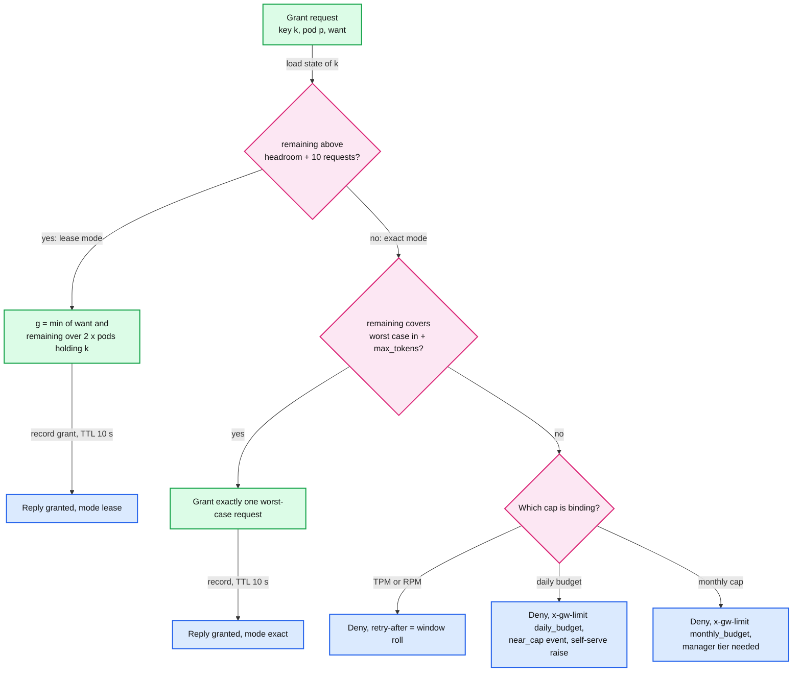
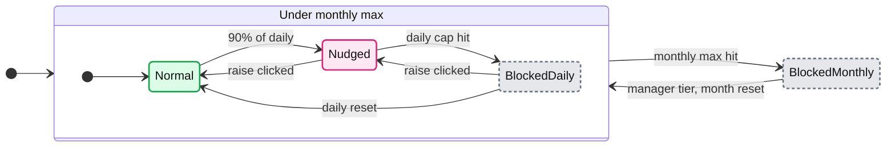

# Deep dive: token budgets and rate limiting

> One-line answer: reserve an estimate before the request (calibrated input plus the key's p95 output, with `max_tokens` capped by policy), take the reservation from a pod-local lease that the Quota Service refills in the background, commit the provider-reported actual at stream end, and switch a key to per-request worst-case grants when its remaining budget drops below the worst case of its in-flight work; the cap then holds even if every in-flight request runs to `max_tokens`, and budgets follow Databricks' daily runaway plus monthly cap design.

Reusable blocks: [`concepts/rate-limiting-and-load-shedding.md`](../../../concepts/rate-limiting-and-load-shedding.md), [`concepts/leases-fencing-clocks.md`](../../../concepts/leases-fencing-clocks.md). The same lease shape for bandwidth: [`hld/network-throttling/deep-dives/accuracy-and-overshoot.md`](../../network-throttling/deep-dives/accuracy-and-overshoot.md). Back to [`solution.md` §5.1](../solution.md#51-how-do-you-rate-limit-tokens-when-output-tokens-are-known-only-at-stream-end-reserve-lease-reconcile).

---

## 1. Why this is hard

A request-count limiter decides with everything it needs: one request is one unit. A token limiter must decide before it knows the price. Input tokens can be estimated from the body. Output tokens are known only when the stream ends, seconds to minutes later. Three families of answers exist in shipping products:

| Family | Who documents it | What goes wrong |
|---|---|---|
| Post-hoc: admit on the current counter, charge actual at the end | Agent Router ([docs](https://theagentrouter.ai/docs/0.7/capabilities/traffic/usage-based-ratelimiting/)), Databricks ("concurrent requests can burst", [docs](https://docs.databricks.com/aws/en/ai-gateway/rate-limits)) | Overshoot equals the in-flight set. 200 concurrent requests of 2,750 tokens on a 100k TPM key end the minute at 6.4x the limit |
| Pre-charge an estimate, reconcile | Kong ([docs](https://docs.konghq.com/hub/kong-inc/ai-rate-limiting-advanced/configuration/)), Azure API Management ([docs](https://learn.microsoft.com/en-us/azure/api-management/llm-token-limit-policy)), LiteLLM (reservation on by default, [docs](https://docs.litellm.ai/docs/proxy/virtual_keys)) | Better on average. With a p95 estimate, 5% of requests exceed their reservation, and nothing stops a burst of them near the cap |
| Reserve the worst case | Rarely by default | Safe but wasteful: 16k reserved for a 250-token mean gives the tenant 17% of the TPM it paid for |

Our design uses the second family far from the cap and the third near it, and moves the counter off the hot path with leases.

## 2. Estimation

- **Input.** `est_in = body bytes x r(tenant, model)`. `r` starts at 0.25 tokens per byte and is updated from every provider-reported input count as an exponentially weighted average (weight 0.05). After about 20 requests the error is under 10% for a stable workload **[inferred]**. Anthropic reports exact input in `message_start`, at the first event ([streaming docs](https://platform.claude.com/docs/en/build-with-claude/streaming)), so for those streams the input estimate lives for milliseconds.
- **Output.** `est_out = clamp(p95 output of (key, model) over the last hour, 256, max_tokens)`. The p95 is kept per key in a small histogram in the module (the module sees every completion on its pod) and seeded from the tenant's average for new keys.
- **Cap `max_tokens`.** The module rewrites `max_tokens` to at most the policy cap (16k by default, per alias). Without a cap the worst case is the model's maximum and exact mode cannot work. For reasoning models, hidden reasoning tokens count as output for billing, so the cap must bound them too **[inferred: check each provider's parameter semantics]**.
- **Dollars.** `est_usd = est_in x price_in + est_out x price_out`, using the deployment's current price version. Cached input is not predictable before the call; estimate it as uncached (conservative) and let the commit correct it.

## 3. The lease protocol

State at the Quota shard, per key `k`: sliding-minute usage per dimension (six 10 s buckets), outstanding grants per pod with expiry, slots in use, the key's mode. `remaining(k) = limit - used_last_60s - outstanding_grants`.

- **Grant.** A pod asks for `want = rate of k on this pod x 2 s`, in tokens, dollars, requests and slots. The shard grants `g = min(want, remaining / (2 x pods holding k))`, never below one request's reservation unless it denies. TTL 10 s.
- **Local spend.** Each request reserves its estimate from the local allowance and one slot. At stream end the pod returns `est - actual` to its allowance (negative if the request ran over) and the slot.
- **Refill.** When a dimension drops below 50% of the last grant, the pod asks again in the background. Only a key that is cold on the pod makes a request wait (about 1 ms).
- **Commit.** Every 100 ms the pod sends, per shard, one batch of `{request_id, key, principal, actual by token type, cost, estimated}`. The shard adds actuals to the buckets and to the principal's spend, and reduces outstanding grants by what was consumed. Duplicate `request_id`s within 15 minutes are dropped.
- **Expiry.** Unused allowance lapses after 10 s; the pod reports what it consumed in its commits. A crashed pod's grants lapse on their own.

Grant sizing is the whole trade-off: bigger grants mean fewer RPCs and more allowance stranded on a pod that stops receiving the key's traffic. `remaining / (2 x pods)` bounds stranding to half the remaining budget in the worst case, and the 10 s TTL bounds how long it stays stranded.



## 4. Exact mode, and why the cap holds

Define the headroom of key `k` as the most its in-flight work can still exceed its reservations:

```
H(k) = slots_out(k) x (max_tokens - est_out)            in tokens
H$(k) = slots_out(k) x (max_tokens - est_out) x price_out  in dollars
```

The shard switches `k` to exact mode when `remaining(k) < H(k) + 10 x average request`. From then on every grant covers one request's worst case, `est_in + max_tokens`.

Claim: usage never exceeds the limit, up to input estimation error.
- At the switch, `remaining >= H(k)`, which covers every in-flight request running to `max_tokens`.
- Every request admitted after the switch has reserved an upper bound on its own usage.
- Grants are decided on a single-threaded loop, so no two grants spend the same remainder.
- What is left: the input estimate of in-flight requests to providers that report input only at the end (about 10% of 250 tokens, times 16 slots, a cent), a pod that crashes (its streams are billed by the provider and found by reconciliation), and a price change that lands mid-stream.

Small keys, where `H(k)` is larger than the whole limit, live in exact mode: one grant per request, about 1 ms. That is the right cost for a key that sends a few requests a minute.

Slots are what make `H(k)` finite. They are leased like any other dimension, so the cap of 16 is global per key, not per pod.

## 5. Budgets: the Databricks design, credited

The design and the quotes are from [How Databricks manages its own coding agent spend with Unity AI Gateway Budgets](https://www.databricks.com/blog/how-databricks-manages-its-own-coding-agent-spend-unity-ai-gateway-budgets) (2026-07-28):

- **Two budgets for two kinds of waste.** A daily budget catches short-term runaway spend with a self-service acknowledgement; a monthly budget governs long-term extraordinary spend with manager approval.
- **Effective cap** `= min(month-to-date usage + one runaway increment, monthly max)`. The two are coupled by a fixed ratio.
- **At about 90% of the daily limit** a Slack message offers a one-click raise by one increment. "An unattended cron job cannot click a Slack button."
- **Resets** each evening at the lowest-usage hour. **Tiers** are group memberships in the gateway: roughly 2x, 5x, up to effectively unlimited, time-limited to the project.
- **Why:** the old single monthly limit had "somewhere between 500 and 1,000 engineers" hitting it every month. The post says its dollar figures are illustrative.

How we implement it (our design, not theirs):
- `BUDGET_STATE` per principal and period lives in the tenant's Quota shard. `month_to_date` is sampled at each daily reset; `cap_today = min(mtd_at_reset + increment x (1 + acks_today), monthly_max)` **[inferred reading of the formula's sampling point]**.
- Every grant and commit re-evaluates the cap. Crossing 90% emits `near_cap` once per day to a notifier (Slack, email, webhook).
- `POST /admin/budgets/{p}/raise` increments `acks_today`; it takes effect at the next grant, which is immediate for a blocked principal.
- Group tiers come from the policy snapshot; the shard reads the tier per principal from the same feed.



## 6. Worked overshoot numbers

Assumptions: frontier model at $3 per million input and $15 per million output; `max_tokens` capped at 16k; `est_out` = 1k; 16 slots.

| Cap | Post-hoc (no reservation) worst case | Reserve p95, no exact mode | Our design |
|---|---|---|---|
| $50/day principal | 16 in flight x 16k x $15/M = $3.84 past the cap once it is crossed, and unbounded if slots are not global | Up to 16 x 15k x $15/M = $3.60 past the cap | Cap holds; residual is input estimation, about a cent |
| 100k TPM key | 200 requests admitted on a 90k reading: 640k in the minute, 6.4x | Up to 16 x 15k = 240k past the limit if all run long | Key lives in exact mode (H = 240k exceeds the limit): one grant per request, cap holds |
| 10M TPM key | Overshoot is the in-flight set, a few percent | A few percent at the cap | Lease mode until 240k plus 10 requests remain, then exact: cap holds |

The NFR says max($5, 1%). The design meets it with room, and the room is spent on the cases the proof does not cover: pod crashes, price changes, and input estimation.

## 7. What Envoy offers natively, and where it stops

- **Global rate limit filter.** Request-path descriptors enforce; a descriptor with `apply_on_stream_done: true` and a `hits_addend` taken from a substitution format (for example dynamic metadata written by another filter) charges response-derived usage after the stream. The proto calls this path "fire-and-forget": it updates the budget for later requests and does not block the current one ([route_components.proto:2747-2764](https://github.com/envoyproxy/envoy/blob/v1.39.1/api/envoy/config/route/v3/route_components.proto#L2747)). `hits_addend` is a non-negative number (at most 1e9), so there is no refund. RLS call timeout 20 ms, fail open by default; since 1.38, `timeout: 0s` means no timeout. Right for MCP queries per minute; we use it there.
- **`sse_to_metadata`** (alpha) parses SSE and writes values such as `usage.total_tokens` into dynamic metadata. With the filter above it gives post-hoc token charging with zero custom code.
- **`rate_limit_quota`** (RLQS, work in progress) reports usage per bucket to a quota server at a reporting interval above 100 ms and receives per-bucket assignments; `no_assignment_behavior` defaults to allow all. It is the native form of leases. No open-source server exists yet ([report 05 §6.7](../../../popular_systems_deepdive/envoy/envoy-05-resilience.md)). We shape our protocol like it so we can move when it matures.
- **`local_ratelimit`** is one token bucket per filter config shared by all workers of a pod; `filter_enabled` and `filter_enforced` default to 0%. We use it only as a per-pod safety valve.

## 8. Fail policy when the Quota Service is unreachable

| Situation | Behaviour | Exposure |
|---|---|---|
| First 10 s | Existing allowances keep working | None beyond normal |
| 10 s to 5 min, key far from any cap | Fail static: local allowance at the key's last grant rate | At most 5 min of that key's normal rate |
| Key within 10% of a cap | Fail closed: 429 with `x-gw-limit: quota_unavailable` | None |
| Past 5 min | Fail closed for budgets, fail open for TPM with a per-pod `local_ratelimit` ceiling | Bounded by the ceiling; provider leases, held on other shards, still cap the fleet per deployment |

Why not fail open everywhere: a stolen key during a Quota outage would spend without limit. Why not fail closed everywhere: a 5-second failover would 429 every tenant. The split follows the money.
