# Diagrams: AI gateway for thousands of tenants

The D1 to D12 set from `hld/CLAUDE.md` §4. Diagrams already embedded in [`solution.md`](solution.md) are listed with a pointer, not pasted twice. Red is used for one thing only: the shared provider quota, the resource that breaks first (solution §5.2, §7, §10.3).

| # | Diagram | Where |
|---|---|---|
| D1 | Context | below |
| D2 | Data flow | below |
| D3 | Component architecture (final design) | `solution.md` §6 |
| D4 | Happy path per FR | FR1 to FR4 end to end: §6 Flow 1. FR2 identity detail: below. FR3 budget at the cap: §6 Flow 2; lease protocol: below. FR4 streaming, simple version: §4.4. FR5 MCP tool call: §5.5. FR6 usage and tracing: below |
| D5 | Failure paths | Provider error before the first token: §5.3. Client disconnect: §6 Flow 4. Quota shard dies: §6 Flow 7. Provider region outage and Envoy pod crash: §10.4. Bad policy snapshot: below |
| D6 | Decision flow | Admission per LLM request: §5.1. Routing and fallback: §5.4. SSE parser: §10.1 |
| D7 | Entity relationship | `solution.md` §3.3 |
| D8 | State machine | One LLM request: below. A principal's budget: [`deep-dives/token-budgets-and-rate-limiting.md`](deep-dives/token-budgets-and-rate-limiting.md) |
| D9 | Deployment / topology | below |
| D10 | Scaling / partitioning | below |
| D11 | Failure mode map | below |
| D12 | Rollout / migration | below |

---

## D1. Context (zoom-out)

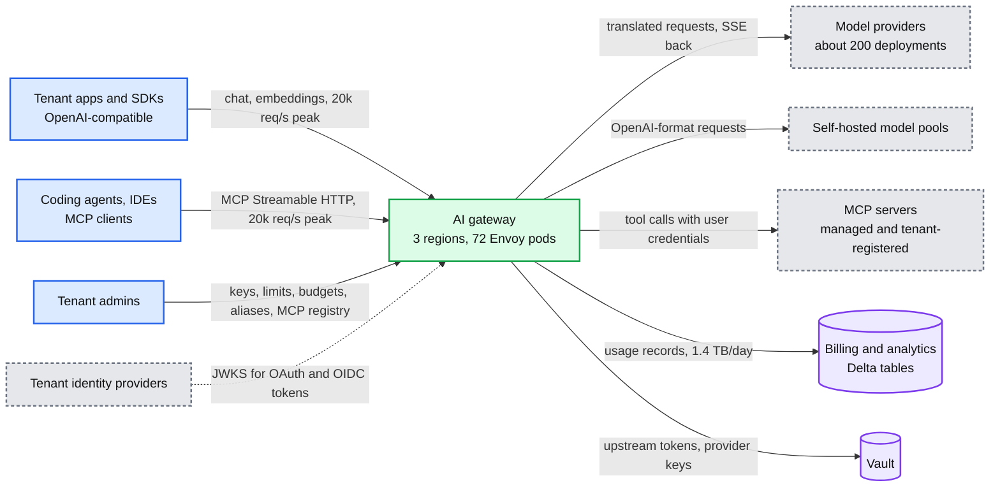

## D2. Data flow (DFD)

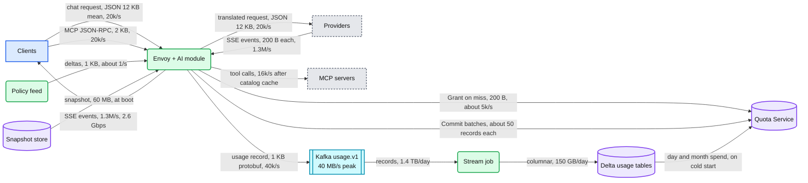

## D3. Component architecture

The final design is in [`solution.md` §6](solution.md#6-final-design-and-the-seven-core-flows). Zoom-ins: filter chain in §5.6, control plane in §5.7, multi-region in §5.8, module threads and Quota shard in §10.1.

## D4. Happy path per functional requirement

### D4, FR2: identity and grants

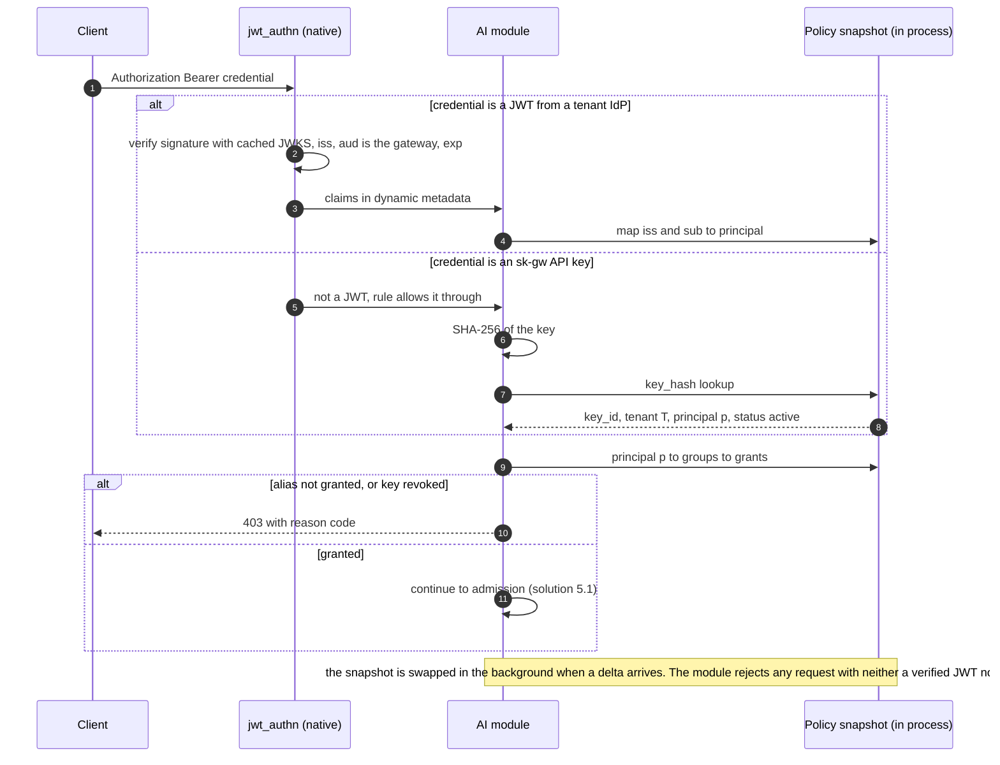

### D4, FR3: the lease protocol

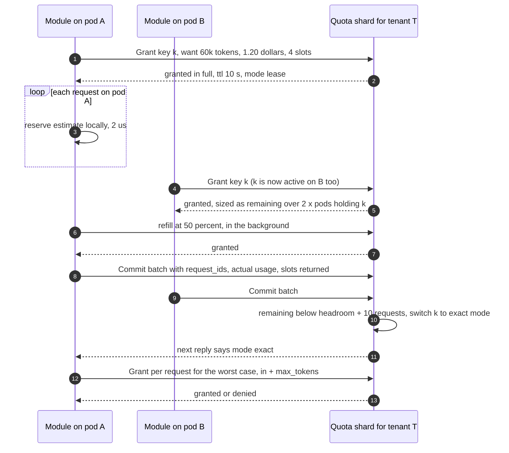

### D4, FR6: usage record and trace

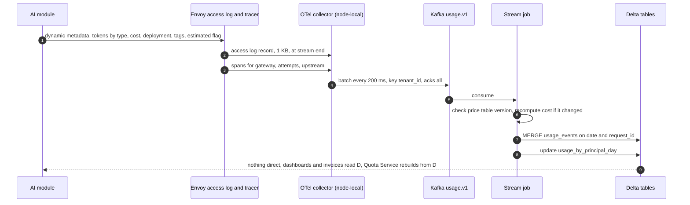

## D5. Failure path: a bad policy snapshot

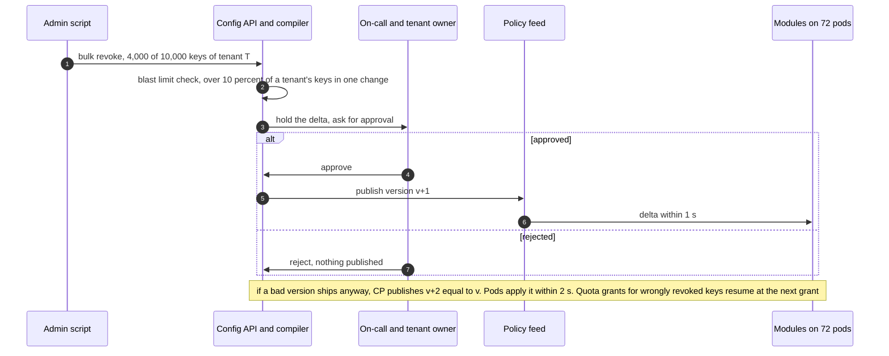

## D6. Decision flows

Admission per LLM request: [`solution.md` §5.1](solution.md#51-how-do-you-rate-limit-tokens-when-output-tokens-are-known-only-at-stream-end-reserve-lease-reconcile). Routing and fallback: [§5.4](solution.md#54-route-across-200-deployments-fail-over-and-keep-prompt-caches-warm-routing-and-fallback). SSE parser: [§10.1](solution.md#101-internals-of-each-chosen-technology).

## D7. Entity relationship

In [`solution.md` §3.3](solution.md#33-data-model), with primary keys, partition keys and TTLs.

## D8. State machine: one LLM request

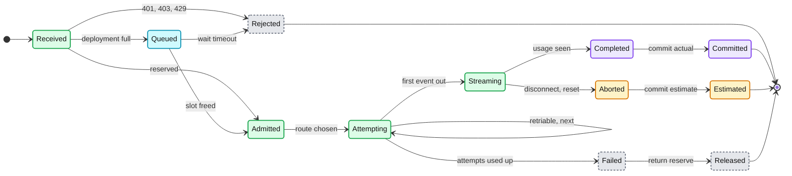

## D9. Deployment / topology

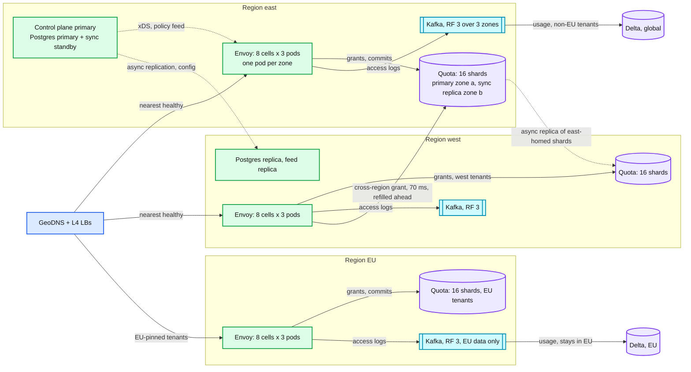

## D10. Scaling / partitioning

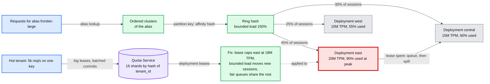

Why the Quota Service is not the hot partition: a tenant at 5k req/s on one key makes about 30 grant RPCs/s (large leases, one per pod every few seconds) and at most 240 commit batches/s to its shard, well under 1% of a single-threaded shard's capacity (solution §10.3).

## D11. Failure mode map

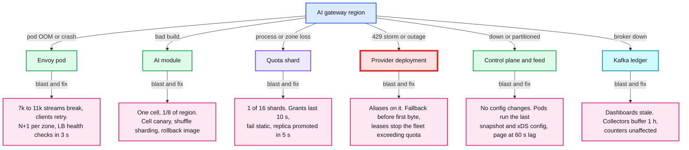

## D12. Rollout and migration

From tenants calling providers directly (or through an older proxy) to the gateway. Every phase is a per-tenant flag with its own rollback point.

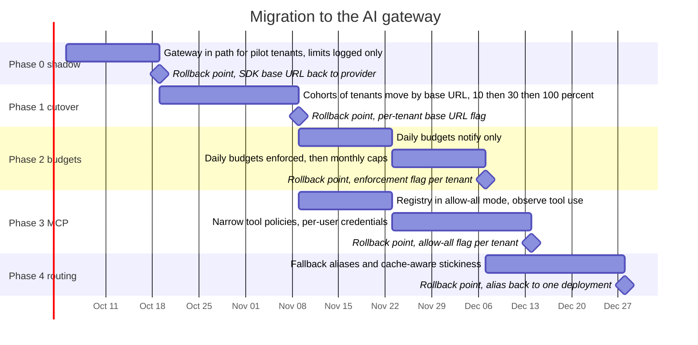
