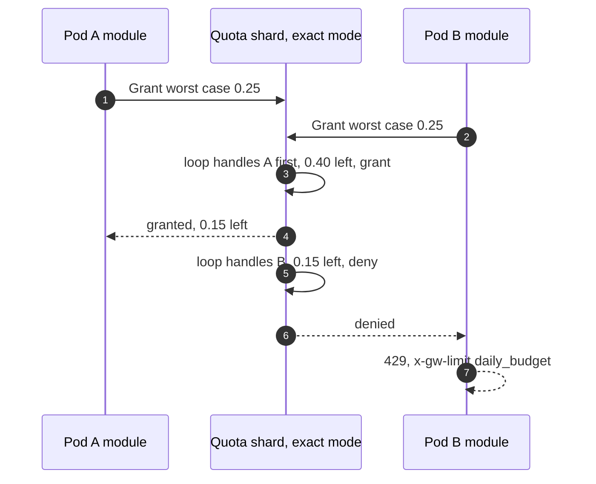

# Edge cases: AI gateway for thousands of tenants

Every entry answerable in under 60 seconds out loud. Categories: failure, consistency, scale, data, operations, security. Design reference: [`solution.md`](solution.md). Numbers are from solution §2.

---

## Failure

## Edge case: a provider deployment returns 429 to everyone
- **Trigger:** the deployment's TPM quota is exhausted by a surge, or the provider cut the quota.
- **Symptom:** provider 429 rate on `frontier-east` jumps from 0.01% to 30%; clients of every tenant on that alias see slower first tokens.
- **Answer:**
  - It should not happen: the Quota Service leases each deployment's quota minus 10% to pods, so the fleet cannot exceed it. A 429 means our quota model is wrong, and that pages.
  - Before the first content event, the upstream module turns the 429 into a retriable 503 and the composite cluster tries the next deployment. The deployment's lease is marked empty until its `retry-after`.
  - Excess demand waits in per-tenant fair queues (2 s interactive, 30 s batch), then 429 to the client with `retry-after`. No tenant gets more than 30% while others wait.
- **Diagram:** `solution.md` §5.2.
- **Confidence:** [ ] shaky  [ ] ok  [ ] confident

## Edge case: a provider region fails while 3k streams per pod are mid-response
- **Trigger:** regional outage at the provider.
- **Symptom:** connection resets on one cluster; SSE streams end early; fallback rate spikes.
- **Answer:**
  - Streams already past the first content event end with an SSE error event. No retry: a retry would duplicate output and cost, and SSE has no resume. Usage seen so far is committed as estimated.
  - New requests fail attempt 1 before the first event and go to the next sub-cluster; outlier detection ejects the endpoint after 5 consecutive 5xx.
  - Page when the fallback rate is above 20% for 2 minutes. The user-visible loss is the in-flight streams at the moment of failure.
- **Diagram:** `solution.md` §10.4.
- **Confidence:** [ ] shaky  [ ] ok  [ ] confident

## Edge case: a Quota Service shard primary dies
- **Trigger:** process crash or zone loss for shard 7.
- **Symptom:** `Grant` timeouts for tenants on shard 7; nothing user-visible for 10 s.
- **Answer:**
  - Pods keep spending allowances already granted (10 s TTL).
  - The coordinator promotes the synchronous replica in another zone in about 5 s. Because grants are replicated before they are acknowledged, the replica never grants the same budget twice.
  - In the gap, fail static: keys far from a cap keep a local allowance equal to their last grant rate for up to 5 min; keys within 10% of a cap fail closed. Commit batches are buffered and replayed, deduplicated by `request_id`.
- **Diagram:** `solution.md` §6 Flow 7.
- **Confidence:** [ ] shaky  [ ] ok  [ ] confident

## Edge case: an Envoy pod is OOM-killed with 11k open streams
- **Trigger:** memory leak, a burst of huge prompts, a module bug.
- **Symptom:** 1/24 of a region's streams reset at once; clients retry.
- **Answer:**
  - The L4 load balancer's health check removes the pod in about 3 s; retries land on other pods, which pay one cold `Grant` per key (about 1 ms).
  - The dead pod's grants expire in 10 s, so its unused headroom returns to the shard.
  - Its in-flight usage never committed; the provider export shows those requests and reconciliation adds adjustment records.
  - Prevention: overload manager resets the largest streams at 90% heap; per-tenant byte limits; 32 MiB body cap.
- **Diagram:** `solution.md` §10.4.
- **Confidence:** [ ] shaky  [ ] ok  [ ] confident

## Edge case: the control plane and policy feed are down for 30 minutes
- **Trigger:** bad control plane deploy, Postgres failover gone wrong.
- **Symptom:** `policy_version` stops advancing on every pod; the convergence alert fires at 60 s; traffic is normal.
- **Answer:**
  - Fail static: pods keep the last snapshot and the last accepted xDS config, as Envoy does when its control plane is gone.
  - What stops: new keys, revocations, limit and alias changes. Revocation during the outage can still be forced at the Quota Service (stop granting a key), which the data path consults every 10 s.
  - A pod that restarts during the outage loads the newest snapshot from object storage, not from the control plane.
- **Confidence:** [ ] shaky  [ ] ok  [ ] confident

## Edge case: the credential broker is down during MCP tool calls
- **Trigger:** vault or broker outage.
- **Symptom:** tool calls fail for users whose upstream token is not cached on the pod.
- **Answer:**
  - Upstream tokens are cached in the pod until their expiry (typically an hour), so most active users are unaffected.
  - A cache miss returns a JSON-RPC error that says the upstream credential is unavailable; the agent can retry later. We never fall back to a shared service credential: that would be the confused deputy we removed.
  - LLM traffic does not depend on the broker (provider keys come through SDS and stay in memory).
- **Confidence:** [ ] shaky  [ ] ok  [ ] confident

## Edge case: a tenant's IdP rotates its signing keys, or its JWKS endpoint is down
- **Trigger:** routine key rotation, IdP outage.
- **Symptom:** JWTs signed with a new key fail verification for that tenant only.
- **Answer:**
  - `jwt_authn` caches JWKS; on an unknown key id it refetches (rate-limited). A down endpoint means the cached keys keep working and tokens signed with them keep passing.
  - Tokens signed with a key we have never seen fail with 401 until the endpoint returns. API keys for that tenant are unaffected.
  - Blast radius is one tenant, because issuers are configured per tenant.
- **Confidence:** [ ] shaky  [ ] ok  [ ] confident

## Edge case: Kafka is down for an hour
- **Trigger:** broker outage, network partition.
- **Symptom:** dashboards stop updating; ledger lag alert.
- **Answer:**
  - The request path does not depend on Kafka. Counters live in the Quota Service and keep working.
  - Node-local collectors buffer up to 1 h of records on disk (about 40 MB/s peak per region divided over nodes) and replay; the idempotent producer and `MERGE` on `request_id` make replay safe.
  - Past 1 h, records are dropped and flagged; reconciliation against provider exports repairs billing.
- **Confidence:** [ ] shaky  [ ] ok  [ ] confident

---

## Consistency

## Edge case: the client disconnects mid-stream
- **Trigger:** laptop lid closed, client timeout, user pressed stop.
- **Symptom:** no final usage chunk; the provider may still bill for tokens generated.
- **Answer:**
  - Envoy resets the upstream stream, which stops generation.
  - The module commits input (exact if Anthropic's `message_start` was seen, else estimated) plus output estimated from content bytes seen times the calibrated tokens-per-byte ratio, flagged `estimated=true`.
  - A daily reconciliation compares estimated records with the provider's usage export and writes adjustments keyed by `request_id`.
- **Diagram:** `solution.md` §6 Flow 4.
- **Confidence:** [ ] shaky  [ ] ok  [ ] confident

## Edge case: a commit batch times out and is retried
- **Trigger:** network blip between a pod and its Quota shard.
- **Symptom:** the same usage could be counted twice.
- **Answer:**
  - Every record carries `request_id`; the shard keeps a 15-minute set of seen ids and drops duplicates.
  - The ledger path is separate (access log to Kafka) and deduplicated by `MERGE` on `(date, request_id)`.
  - One downstream request is one record, whatever the number of upstream attempts.
- **Confidence:** [ ] shaky  [ ] ok  [ ] confident

## Edge case: an admin lowers a key's TPM limit while 200 of its streams are in flight
- **Trigger:** cost control, abuse response.
- **Symptom:** the key is suddenly over its new limit.
- **Answer:**
  - In-flight streams finish; we never cut a stream for TPM.
  - The new limit reaches the Quota Service in about 1 s and applies to the next grant; allowances already granted expire within 10 s. Worst case about 20 s.
  - The key goes straight to exact mode if its remaining budget is below its headroom, so new requests reserve the worst case.
- **Confidence:** [ ] shaky  [ ] ok  [ ] confident

## Edge case: two pods race for the last dollars of a daily budget
- **Trigger:** an agent swarm with requests on several pods, near the cap.
- **Symptom:** risk of both pods admitting and overshooting.
- **Answer:**
  - Near the cap the shard is in exact mode: it grants per request, for the worst case, on a single-threaded loop. The two grants are serialized; the second is denied when the first used up the remainder.
  - Exact mode starts while the remaining budget still covers every in-flight request running to `max_tokens`, so requests admitted earlier cannot push past the cap either.
- **Diagram:**

- **Confidence:** [ ] shaky  [ ] ok  [ ] confident

## Edge case: the daily reset and clock skew
- **Trigger:** tenants in many time zones; pods with skewed clocks.
- **Symptom:** a request near midnight counted in the wrong day.
- **Answer:**
  - The daily reset is per tenant at its lowest-usage hour (the Databricks design resets in the evening at the lowest-usage hour), and the shard owns the clock: the day a record belongs to is decided by the shard on commit, not by the pod.
  - Minute windows are shard-local too. Pod clocks only drive local TTLs, which are relative durations.
- **Confidence:** [ ] shaky  [ ] ok  [ ] confident

## Edge case: a provider changes its streaming format and usage stops arriving
- **Trigger:** API change, new model with a different final event.
- **Symptom:** every stream from that provider ends without usage; records become estimated.
- **Answer:**
  - The `estimated_ratio` metric per provider pages above 0.5%, which catches it in minutes, not at invoice time.
  - Estimates keep limits and budgets roughly right (calibrated ratio, error about 10%).
  - The adapter for that provider is fixed in the module; reconciliation against the export corrects the affected records.
- **Confidence:** [ ] shaky  [ ] ok  [ ] confident

---

## Scale

## Edge case: one tenant sends 10x its usual traffic (a batch evaluation)
- **Trigger:** a tenant starts a large offline job at 30M TPM.
- **Symptom:** a deployment's lease is used up; queues form.
- **Answer:**
  - Its own TPM limit and slots apply first. Then the per-deployment fair queue gives it at most 30% while others wait, weighted by tier.
  - `x-gw-priority: batch` puts it in the 30 s queue behind interactive traffic.
  - Its requests spill to the next deployment in the alias when that one has leased headroom. Other tenants' gateway p99 moves by under 1 ms; their provider 429 rate does not move.
- **Diagram:** `solution.md` §5.2.
- **Confidence:** [ ] shaky  [ ] ok  [ ] confident

## Edge case: one API key sends 5k requests/s (a CI fleet)
- **Trigger:** a tenant shares one key across its build farm.
- **Symptom:** one key is hot on every pod.
- **Answer:**
  - Leases absorb it: each pod holds a large allowance and refills in the background, so the shard sees about 30 grants/s and batched commits, not 5k calls/s.
  - Slots bound its concurrency; the per-tenant byte limit bounds parse CPU.
  - Recommend per-machine keys; the snapshot handles 300k keys and more.
- **Confidence:** [ ] shaky  [ ] ok  [ ] confident

## Edge case: a provider recovers and every queued request is released at once
- **Trigger:** a 5-minute provider incident ends.
- **Symptom:** risk of a thundering herd that knocks the provider over again.
- **Answer:**
  - Admission is bounded by the deployment's lease, not by the queue length: pods can only send what they were granted, so the release is paced by the lease refill (10 s TTL, sized by demand).
  - Outlier detection returns the endpoint gradually (ejection expires), and the retry budget is 5%.
  - Clients that got 429 retry with the `retry-after` we set, jittered.
- **Confidence:** [ ] shaky  [ ] ok  [ ] confident

## Edge case: a popular MCP server's cached catalog expires at the same moment on every pod
- **Trigger:** `ttlMs` elapses; 4k `tools/list` per second arrive.
- **Symptom:** risk of 72 pods refetching at once.
- **Answer:**
  - Single-flight per pod: one refetch per server per pod, everyone else is served the stale catalog until the refetch returns (stale-while-revalidate).
  - Jitter the effective TTL by ±10% per pod, so refetches spread out: 72 fetches over a few seconds instead of 72 at once.
- **Confidence:** [ ] shaky  [ ] ok  [ ] confident

## Edge case: a 1M-token prompt (about 4 MB) or a 20 MB image payload
- **Trigger:** long-context coding agents, multimodal requests.
- **Symptom:** with defaults, 413 from the 1 MiB per-connection buffer.
- **Answer:**
  - `request_body_buffer_limit` is 32 MiB on LLM routes; the body cap is 32 MiB, above that 413 with a clear message.
  - The module streams the parse and only fully buffers what it must (to translate and to replay on retry).
  - Store-and-forward adds the transfer time to the provider (about 30 ms for 4 MB at 1 Gbps); acceptable because the provider cannot start prefill before the last byte anyway. Gateway overhead is measured from the last byte in.
- **Confidence:** [ ] shaky  [ ] ok  [ ] confident

---

## Data

## Edge case: a provider changes its prices mid-month
- **Trigger:** price cut or increase.
- **Symptom:** cost computed at the old price for requests in flight.
- **Answer:**
  - Prices are versioned in the deployment table with an effective timestamp; each usage record carries the price version used.
  - The stream job recomputes cost if the version was stale at commit; budgets are adjusted by the difference.
  - Budget tiers are in dollars, so a price increase tightens effective quotas immediately; admins are notified.
- **Confidence:** [ ] shaky  [ ] ok  [ ] confident

## Edge case: the usage record schema changes
- **Trigger:** new token type (for example a new cached-write category), new attribution field.
- **Symptom:** old and new records in the same topic.
- **Answer:**
  - Protobuf records with additive fields only; a schema registry rejects breaking changes.
  - Delta columns are added with defaults; old records read the default.
  - The Quota Service ignores unknown token types until its price table knows them, and the stream job backfills cost for them from the raw record.
- **Confidence:** [ ] shaky  [ ] ok  [ ] confident

## Edge case: GDPR delete of one user's prompts and usage
- **Trigger:** a data subject request from a tenant.
- **Symptom:** prompts and usage rows for one principal across payload logs, usage tables, audit.
- **Answer:**
  - Payload logs are partitioned by tenant and day and keyed by principal: `DELETE` plus `VACUUM` in Delta, and the 30-day retention bounds any copy we miss.
  - Usage records keep ids and token counts (needed for billing) but drop tags that identify a person; the principal id is pseudonymous.
  - Kafka retention is 7 days, so the raw topic ages out on its own.
- **Confidence:** [ ] shaky  [ ] ok  [ ] confident

## Edge case: three years of ledger growth
- **Trigger:** 1.4 TB/day raw, 150 GB/day compressed, and growth.
- **Symptom:** storage cost and query latency on usage tables.
- **Answer:**
  - About 165 TB compressed over three years at today's rate. Raw events kept 13 months for disputes; daily aggregates kept forever (a few TB).
  - Partition by date, cluster by tenant; compaction nightly.
  - Payload logs are the expensive part (4 TB/day) and have 30-day default retention.
- **Confidence:** [ ] shaky  [ ] ok  [ ] confident

---

## Operations

## Edge case: what pages at 3am
- **Trigger:** any of the alerts below.
- **Symptom:** the pager.
- **Answer:**
  - Gateway-caused 5xx above 0.05% for 5 min (response flags such as `UO`, `NC`, `OM`, split from provider errors).
  - Any deployment's 429 rate above 1% (the quota model is wrong); fallback rate above 20% for 2 min.
  - Estimated-usage ratio above 0.5% for a provider; policy version lag above 60 s on any pod; a Quota shard without a replica.
- **Confidence:** [ ] shaky  [ ] ok  [ ] confident

## Edge case: a new module version crashes pods in the canary cell
- **Trigger:** a bug in the Rust module or an ABI mismatch.
- **Symptom:** crash loop in one cell; its tenants fall back to their other cell.
- **Answer:**
  - Canary is one cell of 3 pods for 1 hour; shuffle sharding means every tenant in it also has a healthy cell.
  - Roll back the image for that cell (module and Envoy ship together); pods drain.
  - Root cause: panics are contained per request by the Rust SDK, so a crash means `unsafe` or a memory bug; fuzz the parser that failed.
- **Confidence:** [ ] shaky  [ ] ok  [ ] confident

## Edge case: an Envoy upgrade breaks MCP filter config or the module ABI
- **Trigger:** quarterly Envoy release.
- **Symptom:** config rejected, or the module fails to load.
- **Answer:**
  - We do not depend on the alpha MCP filters for the request path; header routing and the module do the work. Their protos are `work_in_progress` and can change between releases.
  - A module built for 1.39 is guaranteed on 1.39 and 1.40 only (in v1.39.1 a mismatch only logs a warning), so the module is rebuilt and tested against every release in the same pipeline as the Envoy image.
  - Config is validated against the new binary in CI before rollout.
- **Confidence:** [ ] shaky  [ ] ok  [ ] confident

## Edge case: migrating a tenant that calls providers directly today
- **Trigger:** onboarding.
- **Symptom:** the tenant fears latency, broken SDK features, surprise 429s.
- **Answer:**
  - Phase 0: shadow, gateway in path with limits logged only. Phase 1: change the SDK base URL; rollback is changing it back.
  - Phase 2: daily budgets notify-only for two weeks, then enforced; monthly caps after.
  - Phase 3 and 4: MCP registry and routing features per alias. Every phase is a per-tenant flag.
- **Diagram:** [`diagrams.md` D12](diagrams.md#d12-rollout-and-migration).
- **Confidence:** [ ] shaky  [ ] ok  [ ] confident

---

## Security and abuse

## Edge case: a stolen API key is used from a new network at high rate
- **Trigger:** a key leaked in a public repository.
- **Symptom:** a spend velocity anomaly on one key.
- **Answer:**
  - The daily runaway budget stops spend at one increment, and a cron-like abuser cannot click the self-serve raise.
  - Secret scanners find `sk-gw-` keys in public code; the gateway revokes on report; revocation reaches every pod within 10 s.
  - Optional per-key IP allow-lists for server-side keys.
- **Confidence:** [ ] shaky  [ ] ok  [ ] confident

## Edge case: `Mcp-Name` says one tool, the body calls another
- **Trigger:** a malicious or buggy client tries to bypass header-based authorization.
- **Symptom:** header `search_issues` (allowed), body `delete_repo` (denied).
- **Answer:**
  - The module authorizes on the headers, then checks with a bounded parse (first 8 KB) that the body's `method` and `params.name` match; a mismatch is rejected with the spec's HeaderMismatch error, `-32020`.
  - Duplicate JSON keys are rejected, so the body cannot carry two names.
  - Header-only authorization would be safe only if every server enforced the match; we do not trust third-party servers to.
- **Confidence:** [ ] shaky  [ ] ok  [ ] confident

## Edge case: a client expects its OAuth token to be forwarded to the MCP server
- **Trigger:** a client built for direct server access.
- **Symptom:** the server sees a token whose audience is the gateway.
- **Answer:**
  - The spec says a server MUST NOT accept tokens not issued for it, so forwarding is both forbidden and useless.
  - The gateway strips the client token and injects the user's own upstream token from the credential broker, obtained through the server's consent flow.
  - A user without a consented token gets an error that links to the consent flow.
- **Confidence:** [ ] shaky  [ ] ok  [ ] confident

## Edge case: a registered MCP server URL points at an internal address
- **Trigger:** SSRF attempt, or DNS rebinding after registration.
- **Symptom:** a tool call would reach the metadata service or an internal API.
- **Answer:**
  - Registration requires HTTPS and rejects hosts that resolve to private ranges (10.0.0.0/8, 172.16.0.0/12, 192.168.0.0/16, 127.0.0.0/8, ::1, as the MCP security guidance lists).
  - The dynamic forward proxy re-checks resolved addresses at connect time, which stops rebinding.
  - Egress runs from a separate network segment with no route to internal services.
- **Confidence:** [ ] shaky  [ ] ok  [ ] confident

## Edge case: a tool result carries a prompt injection that tries to exfiltrate data
- **Trigger:** an agent reads a poisoned issue or web page.
- **Symptom:** the next tool call tries to post secrets somewhere.
- **Answer:**
  - The gateway cannot see intent; classifiers reduce but do not remove the risk. Say so.
  - Least privilege limits the damage: the agent acts with its user's own credentials, tools are allow-listed, new servers are read-only, egress goes only to registered hosts.
  - Destructive tools can require confirmation via an `input_required` result; every call is audited with principal, tool and argument hash.
- **Confidence:** [ ] shaky  [ ] ok  [ ] confident

## Edge case: malformed or hostile payloads
- **Trigger:** JSON nested 10,000 deep, 30 MB bodies, duplicate keys, or a provider stream that never sends an event boundary.
- **Symptom:** parser CPU or memory blowup.
- **Answer:**
  - Parser depth capped at 64, body at 32 MiB, duplicate keys rejected: 400 or 413 before any provider call.
  - SSE carry buffer capped at 64 KB per stream; an event larger than that resets the stream as malformed.
  - The parsers are fuzzed in CI; the overload manager is the last line.
- **Confidence:** [ ] shaky  [ ] ok  [ ] confident
