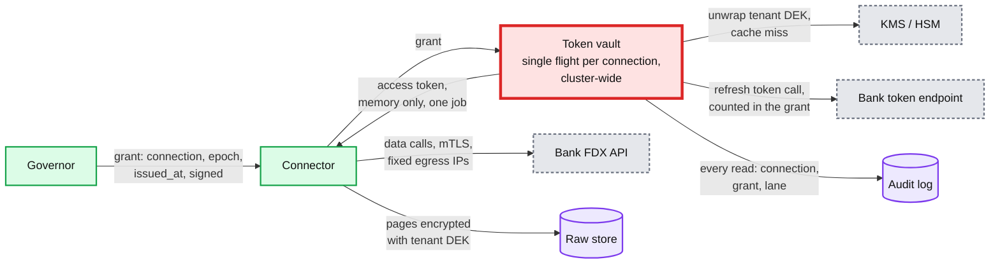
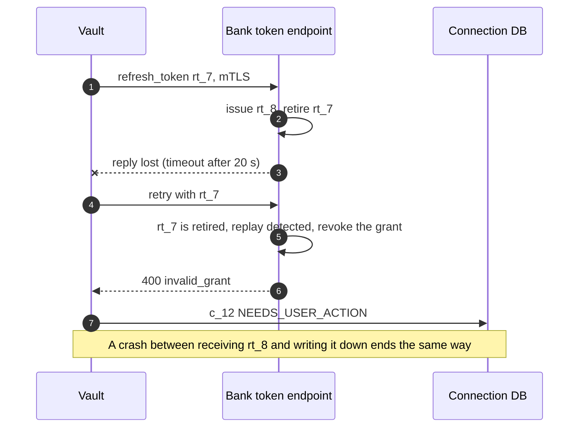

# Deep dive: connectors and credentials

> One-line answer: pick a route per institution (FDX OAuth directly for the top institutions, a partner aggregator for the long tail, OFX Direct Connect only where nothing else exists, stored credentials as the last resort), keep every secret in a vault under a per-tenant data key wrapped by KMS, and release a token only to a connector holding a live governor grant for that connection. Three details carry the design. The **OAuth refresh call is a bank call** on almost every fetch (15-minute access tokens, slots 8 h apart), so it is inside the grant or under a sibling governor key. **Refresh-token rotation turns a lost reply or two concurrent refreshes into a revoked grant**, so single flight is cluster-wide and we ask banks for certificate-bound refresh tokens instead. And a 5-minute data-key cache almost never hits when each tenant is touched every 8 h, so the vault holds the key for the life of a fetch and the KMS quota is raised.

Zoom-in on [`../solution.md`](../solution.md) §4.1, §5.7, §10.10 and §12 (security story). Concepts: [`../../../concepts/oauth.md`](../../../concepts/oauth.md), [`../../../concepts/leases-fencing-clocks.md`](../../../concepts/leases-fencing-clocks.md), [`../../../concepts/rate-limiting-and-load-shedding.md`](../../../concepts/rate-limiting-and-load-shedding.md). Siblings: [`refresh-scheduling-and-rate-limits.md`](refresh-scheduling-and-rate-limits.md) (grants), [`idempotent-ingestion.md`](idempotent-ingestion.md) (reconnect gaps). Acronyms: FDX (Financial Data Exchange), OFX (Open Financial Exchange), OAuth (open authorization), PKCE (proof key for code exchange), mTLS (mutual TLS, both sides present certificates), KMS (key management service), HSM (hardware security module), MFA (multi-factor authentication), CFPB (Consumer Financial Protection Bureau), DEK (data encryption key), TLS (Transport Layer Security), RFC (request for comments, an internet standard), SLA (service level agreement).

---

## 1. Routes, compared

| Route | Who holds the secret | MFA in the background | Stable ids | Limits we inherit | When we use it |
|---|---|---|---|---|---|
| FDX OAuth, direct | We hold an access and a refresh token; never the password | No: the user did MFA at the bank once | Yes: `transactionId` is "Long term persistent", unique within the account | The bank's contract (B1: 1,000 calls/s, 800 in flight `[estimate]`) | Top ~20 institutions, ~70% of accounts |
| Partner aggregator (Plaid, MX, Finicity) | The partner holds bank credentials or tokens; we hold the partner's access token | The partner's problem | Partner ids (Plaid `transaction_id`) | Plaid `/transactions/sync`: 2,500 calls/minute per client; `/transactions/refresh`: 2 per minute and 2,880 per day per Item ([Plaid rate limits](https://plaid.com/docs/errors/rate-limit-exceeded/)) | The long tail |
| OFX Direct Connect | We hold credentials | Breaks it: no human to answer | Often unstable | The bank's OFX server | Only where nothing else exists |
| Credentials and scraping | We hold the password | Breaks it | None | Unknown, and the bank may block us | Never as a primary route |

FDX-aligned APIs carried ~114 M customer connections in April 2025, up from 76 M a year earlier, yet "tens of millions of consumers and small businesses in North America are still sharing financial data through methods that require sharing login credentials" ([Open Banking Expo, 2025-04-28](https://www.openbankingexpo.com/news/fdx-api-adoption-hits-114m-customer-connections/)). So the token route covers most volume and the credential route does not go away soon.

## 2. The secret path



## 3. The OAuth lifecycle and the call nobody counted

- **Link.** Authorization code flow with PKCE and the least scopes (accounts, balances, transactions); the code is exchanged server side with mTLS client authentication. The user does MFA at the bank, once.
- **Tokens.** The bank issues a 15-minute access token and a long-lived refresh token (solution §4.1). A connection is fetched every 8 h, so **every scheduled fetch finds its access token expired** and the vault calls the bank's token endpoint first.
- **That is a bank call too.** A refresh is 3 data calls (accounts plus 2 windows). The token call adds `12 M refreshes/day ≈ 139 token calls/s` at B1, so **~556/s average and ~1,264/s at Monday peak** if the bank meters its token endpoint with the data API. A first draft let the vault make these calls outside the governor, invisible to the rate it was meant to hold.
- **The design (solution §5.1, §5.7).** When the bank meters the token endpoint with its data API, the grant includes the token call (4 tokens when the access token has expired, known from the vault's expiry time); when it meters it separately, the call goes to a sibling governor key. Institution relations finds out which; nobody guesses. The 95% alert counts calls at the egress proxy, so it sees token calls either way.

## 4. Refresh-token rotation: two ways to lose a grant

RFC 9700 (OAuth security best current practice) describes rotation: "the authorization server issues a new refresh token with every access token refresh response. The previous refresh token is invalidated", and if an invalidated token is presented, "it will revoke the active refresh token. This stops the attack at the cost of forcing the legitimate client to obtain a fresh authorization grant" ([RFC 9700 §4.14.2](https://www.rfc-editor.org/rfc/rfc9700.html)). For the bank, our honest retry looks exactly like an attacker.



- **Twin refresh.** Two workers refresh the same connection at once. The governor allows one lease per connection, but a zombie connector whose grant was reclaimed (solution D5a) and its replacement are two. So single flight in the vault is **cluster-wide** (solution §5.7): a row lock on the `SECRET` row for the refresh, or routing by `connection_id` to one vault node. Per-process single flight on a 9-node vault would not stop it.
- **Lost reply.** No client trick recovers a rotated token we never received. Mitigations in order: (1) ask the bank for **certificate-bound refresh tokens** instead of rotation. RFC 8705 says that for a client using mTLS the server "SHOULD also bind the refresh token to the respective certificate" ([RFC 8705](https://www.rfc-editor.org/rfc/rfc8705.html)), and RFC 9700 requires rotation or sender constraint only for public clients; we are a confidential client. (2) If the bank rotates, ask for a short reuse grace window. (3) Retry only when the request provably never left (connect or TLS handshake error), keep token-endpoint connections warm, and give that call a longer timeout than data calls. (4) **Decision:** on an ambiguous outcome, move the connection to `NEEDS_USER_ACTION` at once and prompt at next app open, instead of failing silently 8 h later. Items 1 to 3 are in solution §5.7.
- **Write before use.** The vault writes the new refresh token durably before it returns the access token to anyone, so a vault crash after use cannot lose it.

## 5. Keys and KMS load

- **Envelope encryption.** Each tenant has a DEK; KMS (backed by an HSM) wraps it. Tokens and raw pages are encrypted under the tenant DEK (solution §5.7).
- **A short cache does not hit.** A 5-minute cache of unwrapped DEKs, as first drafted, almost never hits. A tenant's connections are fetched every 8 h at hashed slots, so a scheduled fetch almost always misses, and the ingester decrypting raw pages a few seconds later misses again on a different node. That is 1 to 2 KMS decrypts per fetch: **~700 to 1,400/s average and 3k to 6k/s at the ~3k refreshes/s peak**. AWS KMS's default shared quota for symmetric cryptographic operations is 10,000 requests/s per account and Region (20,000 or 100,000 in some Regions, adjustable) ([AWS KMS request quotas](https://docs.aws.amazon.com/kms/latest/developerguide/requests-per-second.html)). Not over, but 60% of a default quota at peak, shared with everything else in the account, and a throttle there stops every fetch.
- **The design (solution §5.7).** Route vault requests by tenant so the connector and the ingester hit the same node, hold the unwrapped DEK for the life of the fetch (~3 s), and raise the quota. The further option is a middle layer: tenant DEKs wrapped by a per-shard key that stays unwrapped in vault memory for hours, so KMS sees a few calls a minute.
- **Crypto-shredding needs the backups too.** "Destroy the tenant key" makes data unreadable only when **no copy of the wrapped DEK** survives anywhere. A database backup of the key table still holds it, and the KMS key that unwraps it still exists. Deletion is complete when the last backup that held the key ages out (35 days `[estimate]`), and the deletion SLA says so (solution §5.7). **Decision:** keep wrapped DEKs in their own store with that short backup retention, and replay a tombstone list on any restore.

## 6. Grant-bound reads and blast radius

- **The vault releases a token only against a grant** signed by the governor for that connection, with the current epoch and an `issued_at` under 1 s old (the start-by rule in [`refresh-scheduling-and-rate-limits.md`](refresh-scheduling-and-rate-limits.md) §6). A read without one pages security.
- **A compromised connector** can read only tokens for jobs it is handed, within each grant's ~45 s life. **A compromised governor signing key** can mint grants for every connection of its ~470 institutions. **Decision:** keep signing keys per governor shard in an HSM, and have the vault rate-limit grants per shard to ~1.2x the institution's contract, so a forged flood is visible within a minute.
- **Network.** Connectors leave through fixed, allowlisted egress IPs with mTLS certificates per environment; the standby region's IPs are allowlisted in advance (solution §5.7).

## 7. MFA, consent expiry and the link flow as an attack surface

- **Background MFA** on a credential route cannot be answered: the connection goes to `NEEDS_USER_ACTION` and leaves every lane. The next user-present session answers it (5-minute session).
- **Consent expiry and reconnects** create gaps. The first fetch after a reconnect must read back to the last good fetch, or the gap is lost ([`idempotent-ingestion.md`](idempotent-ingestion.md) §4).
- **Credential stuffing through our link flow.** On a credential route, an attacker can use our link page to test stolen passwords, and the bank sees **our** egress IPs failing thousands of logins. It may block those IPs, which cuts every user at that bank. **Decision:** rate-limit link attempts per user, device and IP; challenge after 3 failures; give the governor a per-institution failed-login budget (for example 50 a minute `[estimate]`) that pauses new credential links when spent.

## 8. CFPB Section 1033, dated

As of the Cozen O'Connor alert of 2026-04-09: the CFPB finalized the rule in October 2024 with the first compliance date of April 1, 2026 for the largest providers; a federal district court (Eastern District of Kentucky) enjoined enforcement; the CFPB began reconsideration with an advance notice of proposed rulemaking in August 2025 ([Cozen O'Connor](https://www.cozen.com/news-resources/publications/2026/section-1033-compliance-date-open-banking-rule-enjoined-and-under-reconsideration)). Design consequence: none in the architecture. The route is per-institution configuration; institutions move from credentials to FDX tokens as they open APIs, rule or no rule. If a revised rule lets banks charge per call, the token call in §3 has a price too.

## 9. Runnable: rotation, single flight and grace windows

A fake bank implements rotation with replay detection. 20,000 connections, 3 fetches a day for 30 days, failure rates `[estimate]`. The point is the shape, not the absolute numbers: they scale linearly with the assumed rates.

```python
import random
# Refresh-token rotation with replay detection (RFC 9700 section 4.14.2): every refresh
# returns a new refresh token and retires the old one; presenting a retired token
# revokes the whole grant, so the user must re-consent at the bank.
P_CONNECT = 1e-3   # request never reached the bank (connect or TLS error)   [estimate]
P_LOST = 1e-4      # bank rotated the token, our side never saw the reply    [estimate]
P_TWIN = 1e-4      # a second worker refreshes the same connection at once   [estimate]

class Bank:
    def __init__(self, grace_s):
        self.cur, self.retired, self.dead, self.grace = {}, {}, set(), grace_s
    def refresh(self, grant, rt, now):
        if grant in self.dead:
            return "invalid_grant"
        if rt == self.cur[grant]:
            self.retired[rt] = now
            self.cur[grant] = f"{grant}.{now}.{random.random():.6f}"
            return self.cur[grant]
        if now - self.retired.get(rt, -1e9) <= self.grace:   # reuse inside the grace window
            return self.cur[grant]
        self.dead.add(grant)                                 # replay detected: revoke all
        return "invalid_grant"

def simulate(policy, grace_s, conns=20_000, days=30):
    random.seed(51)
    bank, held, calls, revoked = Bank(grace_s), {}, 0, 0
    for c in range(conns):
        bank.cur[c] = held[c] = f"{c}.0"
    for fetch in range(days * 3):                    # 3 slots a day, token always expired
        now = fetch * 8 * 3600
        for c in range(conns):
            if c in bank.dead:
                continue
            calls += 1
            r = random.random()
            if r < P_CONNECT:                        # nothing reached the bank: retry is safe
                calls += 1
                held[c] = bank.refresh(c, held[c], now + 1)
            elif r < P_CONNECT + P_LOST:
                bank.refresh(c, held[c], now)        # rotated at the bank, reply lost
                if policy == "naive retry" or grace_s:
                    calls += 1                       # naive retries at once; with a grace
                    held[c] = bank.refresh(c, held[c], now + 5)   # window that is safe
            elif r < P_CONNECT + P_LOST + P_TWIN and policy == "naive retry":
                bank.refresh(c, held[c], now)        # no cluster-wide single flight:
                calls += 1                           # the twin presents a retired token
                held[c] = bank.refresh(c, held[c], now + 1)
            else:
                held[c] = bank.refresh(c, held[c], now)
            if held[c] == "invalid_grant":
                revoked += 1
    refreshes = conns * days * 3
    per_day_b1 = revoked / refreshes * 12e6          # B1: ~12 M refreshes a day
    print(f"{policy:34} grace {grace_s:>2} s  token calls per fetch {calls / refreshes:.4f}  "
          f"grants revoked {revoked:4}  B1 re-consents/day ~{per_day_b1:,.0f}")

simulate("naive retry", 0)
simulate("single flight, retry if never sent", 0)
simulate("single flight, retry if never sent", 60)
```

Output:

```
naive retry                        grace  0 s  token calls per fetch 0.9935  grants revoked  307  B1 re-consents/day ~2,047
single flight, retry if never sent grace  0 s  token calls per fetch 0.9972  grants revoked  155  B1 re-consents/day ~1,033
single flight, retry if never sent grace 60 s  token calls per fetch 1.0010  grants revoked    0  B1 re-consents/day ~0
```

- **~1 token call per fetch** in every row: the fourth bank call in §3 is real.
- Cluster-wide single flight removes the twin half of the revocations. The lost-reply half survives any client policy; only a grace window, or certificate-bound refresh tokens with no rotation, removes it. At an assumed 1 in 10,000 lost replies, that is ~1,000 forced reconnects a day at B1 alone.

## 10. What an interviewer pushes on

1. **"Where do credentials live, and who can read them?"** In the vault, under the tenant's DEK; only a connector holding a fresh grant for that connection gets a plaintext token, in memory, for one job. Every read is logged.
2. **"Two workers refresh the same token."** With rotation, the second revokes the grant. Single flight across the vault cluster, not per process.
3. **"The token reply times out."** Do not blindly retry. Retry only if nothing was sent; otherwise prompt the user. Push banks toward certificate-bound refresh tokens.
4. **"How does the move away from scraping change the design?"** Fewer secrets we hold, no background MFA, stable ids (so dedup gets easier), and a contract with a real rate limit: the governor becomes the center of the design.
5. **"Delete a tenant. Is it really gone?"** Only when the last backup holding the wrapped DEK ages out.

## 11. Trade-offs

| Decision | Option A | Option B | Chose | Why |
|---|---|---|---|---|
| Route | One partner for all | Route per institution | Per institution | Direct FDX for the top 20 removes per-connection fees and partner limits where volume is |
| Token refresh accounting | Outside the governor | Inside the grant | Inside | It is a call to the bank on nearly every fetch |
| Refresh token safety | Rotation with retries | Certificate-bound, no rotation | Ask for certificate-bound | Rotation makes a lost reply a revoked grant |
| Single flight | Per vault process | Per connection, cluster-wide | Cluster-wide | Two vault nodes are two refreshers |
| DEK caching | 5 minutes per node | Per fetch, routed by tenant, or a per-shard middle key | Routed plus middle key | 8 h between touches means a 5-minute cache never hits |
| Legacy credentials | Hold them ourselves | Leave them with a partner | Partner where possible | Less to steal; MFA is their problem |

## 12. Numbers to say out loud

- FDX-aligned APIs: ~114 M customer connections in April 2025, up from 76 M a year earlier.
- Plaid limits we inherit on partner routes: 2,500 sync calls/minute per client; 2 refreshes/minute and 2,880/day per Item.
- Access token 15 minutes, slots 8 h apart: ~1 token call per fetch, ~139/s at B1, ~556/s with data calls.
- Rotation: a lost reply or a twin refresh revokes the grant. ~1,000 reconnects a day at B1 if 1 in 10,000 replies is lost `[estimate]`.
- KMS: 1 to 2 decrypts per fetch with a 5-minute cache; 3k to 6k/s at peak against a 10,000/s default quota.
- Deletion is complete when the last backup holding the wrapped DEK expires (35 days `[estimate]`).
