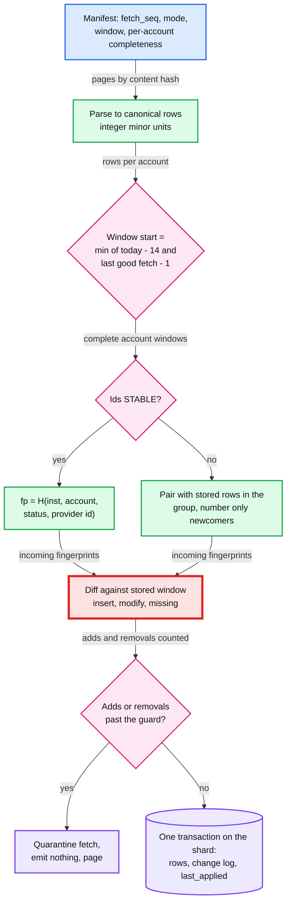

# Deep dive: idempotent ingestion

> One-line answer: every fetch lands as immutable raw pages, then one ingester applies the whole fetch in **one database transaction on one shard**, guarded by `fetch_seq`, and upserts each row on a deterministic fingerprint (the provider id when ids are stable, otherwise a content hash plus an occurrence counter). That handles retries, crashes and the 14-day overlap. Three rules exist because a simpler first draft failed in simulation. The window **reaches back to the last good fetch**, because a fixed 14-day window lost 7 days of a connection that had been broken for 20. Occurrence numbers are **assigned by pairing with stored rows**, because ranking on a field the bank can edit swapped identities and sent QuickBooks MODIFIED events for the wrong rows. And removals have a guard like the one for adds, because a bank that answers `200 OK` with an empty list would otherwise remove 14 days of books.

Zoom-in on [`../solution.md`](../solution.md) §4.3, §5.3, §5.6, §10.1 and §10.5. Concepts: [`../../../concepts/exactly-once.md`](../../../concepts/exactly-once.md), [`../../../concepts/mvcc-and-isolation.md`](../../../concepts/mvcc-and-isolation.md), [`../../../concepts/stream-processing.md`](../../../concepts/stream-processing.md). Outbox relay: [`../../cdc-pipeline/`](../../cdc-pipeline/). Siblings: [`pending-to-posted-matching.md`](pending-to-posted-matching.md), [`institution-outages-and-recovery.md`](institution-outages-and-recovery.md). Acronyms: FDX (Financial Data Exchange), OFX (Open Financial Exchange), DB (database), MFA (multi-factor authentication), UTC (Coordinated Universal Time).

---

## 1. Two kinds of duplicates

| Kind | Where it comes from | Volume | Removed by |
|---|---|---|---|
| **Delivery** duplicates | Kafka redelivery after a crash or rebalance, a connector retrying a publish, a zombie connector publishing late | Rare, bursty | `fetch_seq ≤ last_applied_fetch_seq` means skip, inside the ingest transaction |
| **Data** duplicates | The bank re-sending the same rows on purpose, every fetch, because the window overlaps | ~8.4 B rows re-read a day (README: ~8 B), ~97k rows/s, each row seen ~56 times | The fingerprint upsert; a no-op when `content_hash` is equal |

Most designs handle the first and forget the second. The second is where the subtle bugs live, because "the same row" has to be decided from content the bank is allowed to change.

## 2. The pipeline



## 3. One fetch, one transaction, and every crash point

The transaction store is partitioned by `connection_id`, so all accounts of one fetch live on one shard (32 shards, ~75 writes/s each on average). The ingester: lock `ACCOUNT_STATE` rows in account-id order, check `fetch_seq > last_applied_fetch_seq`, read the window's stored rows, diff, write rows, change log entries and balances, set `last_applied_fetch_seq`, commit, then commit the Kafka offset.

| Crash point | What survives | What happens next |
|---|---|---|
| Connector dies mid-pagination | Some pages, no manifest | Nothing is ingested. The grant expires; a new `fetch_seq` re-fetches |
| After the manifest, before the Kafka publish | Manifest, no event | A sweeper republishes any manifest older than 60 s with no `FETCH` row (solution §4.3). The connection does not look fresh meanwhile: the ingester, not the connector, sets `last_success_at` at commit |
| Ingester dies mid-transaction | Nothing (rollback) | Redelivery recomputes the same fingerprints from the same immutable bytes |
| After the DB commit, before the offset commit | The whole fetch | Redelivery fails the `fetch_seq` check: a no-op |
| A zombie publishes fetch 58 after 59 was applied | Fetch 59 | 58 is skipped. Safe because 59's window covers 58's |

**Two topics, one order.** On-demand fetches go to `raw-fetches-interactive` (solution §5.2), so a tap's fetch 59 can commit before scheduled fetch 58. Skipping 58 is safe for snapshots and for partner deltas (59 started from the older cursor, so it contains 58's changes). The `fetch_seq` check makes the order across topics irrelevant.

**Partial manifests.** Completeness is per account (solution §4.3): complete account windows are applied; an incomplete one is skipped and never counts toward removals. A first draft refused the whole manifest, so one account that always fails (closed, or a per-account `403`) blocked ingest for every account on the connection, forever.

## 4. The window and its edges

A first draft read whole posted dates `[today − 14, today]` in the bank's calendar, with a first **guard day** whose rows matched existing rows but were never inserted. The guard day exists because a date filter applied in another timezone can cut that day in half. FDX's `startTime` and `endTime` are dates that filter on `postedTimestamp`, and Plaid's FDX reference warns that it "doesn't normalize timestamps, so a local time labeled Z is read as UTC" ([Core Exchange 6.0](https://plaid.com/core-exchange/docs/reference/6.0/)). The hedge is right. The draft's edges were not:

1. **A connection broken for more than 13 days loses rows forever.** A connection sits in `NEEDS_USER_ACTION` for 20 days (expired consent, an MFA prompt nobody answered). The first fetch after the user reconnects reads 14 days. Days 1 to 6 of the gap are outside the window and day 7 is the guard day: **7 days of transactions never reach QuickBooks.** Nothing alerts, because nothing is "missing" from the window we asked for. That would break the README's "every posted transaction visible within 24 h".
2. **A row backdated by exactly 14 days was never inserted.** It is first listed when its date is the guard day: matched only, then out of the window tomorrow.
3. **A row backdated by more than 14 days** (an adjustment the bank posts with an old posted date) was never seen.

**The design (solution §5.3).**
- **Gap-aware start.** `window_start = min(today − 14, last_complete_fetch_date − 1)` per account. A 20-day gap reads 21 days once. Cost: one or two extra pages for the few connections coming back from a gap.
- **Count-based guard day.** A timezone cut can only **remove** rows from the guard day, never add them. So on the guard day, insert a row only when its group (§5) has more incoming rows than stored rows. That keeps the timezone protection and inserts real late rows.
- **A weekly deep window.** One of an active account's ~21 weekly fetches reads 60 days. At ~5 rows a day that is ~300 rows, which still fits one page of up to 500 on most routes, so bank calls stay the same. Extra rows re-read: `30 M accounts × ~230 rows ÷ 7 ≈ 1 B/day`, about +12% CPU on ~1 core. It catches backdated rows up to 59 days old.

## 5. Fingerprints and occurrence counters

A first draft, for a no-id route: group by `(status, date, amount_minor, currency, desc_norm)`, sort inside the group by transaction time, then check number, then **raw description**, and `occurrence` = rank. "Counts matter, not identities." True for rows that are fully identical. False when they differ in a field the bank can change:

- **Description edit.** Two $5.00 BLUE BOTTLE rows on one date, raw descriptions `#22 SF` and `#31 SF`, ranked 1 and 2. The bank rewrites the first to `STORE 0022 SF`. Sorting now ranks `#31` first. Both fingerprints keep existing, but each now holds the other row's content: **two MODIFIED events for posted rows, and the two `txn_id`s swap real transactions.** A QuickBooks user who matched txn #1 to an invoice would now point at the other store's charge.
- **Reversal shifts ranks.** The bank reverses `#22`. One row is left, ranked 1, so fingerprint #1 is MODIFIED to `#31`'s content and fingerprint #2 is REMOVED. QuickBooks would remove the wrong transaction.
- **Any new sort field does the same.** A bank that starts sending `transactionTimestamp` after a release re-sorts every group that has one.

**The design: pair first, then number (solution §5.3).** Inside a group, pair each incoming row with a stored row: exact equality first, then the highest description similarity, ties to the lower stored occurrence. Paired rows keep their stored occurrence (so their fingerprint). Only unpaired incoming rows get new numbers, `max + 1`. Unpaired stored rows are "missing". Fully identical rows still pair exactly, so the two coffees stay `{#1, #2}` and a third coffee becomes #3. The occurrence becomes a **stored attribute**, not something recomputed each fetch. Same machinery as the id-migration pairing in solution §5.6, so there is one pairing pass, not two.

## 6. Removals and guards

- **Two looks.** A stored row missing from a complete window gets `missing_count + 1`, and becomes REMOVED after 2 consecutive complete fetches at least 6 h apart (solution §5.3).
- **The missing guard: empty answers.** A bank in a silent outage answers `200 OK` with an empty transactions list. With two looks only, two such fetches 6 h apart would remove every row in the window: at B1 `6 M accounts × ~67 posted rows ≈ 400 M` REMOVED events to QuickBooks, the mirror image of the id-migration duplicates in solution §5.6. A spike guard that counts adds does not see it. So the design quarantines a fetch whose window would remove more than `max(5, 20%)` of the stored posted rows, and at the institution level, if more than 1% of B1's account windows in 30 minutes come back empty where the last fetch had at least 5 rows, a **data breaker** opens: raw pages are still fetched, B1's ingest stops, the on-call is paged (solution §5.3, §5.5). More in [`institution-outages-and-recovery.md`](institution-outages-and-recovery.md).
- **The add guard is scaled by days.** A flat `max(20, 5 × p99 daily adds)` would quarantine the initial 90-day history (~450 rows) and every gap-aware catch-up. So it is scaled by the days the fetch covers that we had not seen before, and `INITIAL` mode has its own budget (solution §5.3).

## 7. Replay and reprocessing

- **Parser or normalizer bug.** Never re-run the live path over old fetches: rebuild into a shadow table from raw pages in `fetch_seq` order, diff, then swap, emitting only the MODIFIED and REMOVED corrections (solution §10.9).
- **Normalizer major version.** Compute both fingerprints, match on the old, re-key to the new, account by account on its next fetch (solution §5.3). With pair-then-number this is a re-key of stored rows, not a re-rank.
- **Partner DELTA mode.** Absence means nothing, so missing counts never apply; the partner cursor is stored after the ingest commit (solution §10.1).

## 8. Runnable: the edges, reproduced and fixed

Part 1 replays daily fetches over synthetic rows with three policies: the first draft, the gap-aware start alone, and the full design (gap-aware start, count-based guard day, weekly 60-day read). Part 2 is the two-coffee group under rank and under pair-then-number.

```python
import difflib
from collections import defaultdict

# Part 1: window edges. A row is (posted_day, first_listed_day). Fetch once a day.
truth = [(d, d) for d in range(60, 141)]                     # normal rows, listed same day
truth += [(85, 98), (84, 98), (78, 98)]                      # backdated 13, 14 and 20 days
broken = range(111, 131)                                     # NEEDS_USER_ACTION for 20 days

def ingest_days(policy):
    stored, last_ok = set(), 59
    for today in range(60, 141):
        if today in broken:
            continue
        start = today - 14                                   # first draft: 14 days, guard day
        if policy != "first draft":
            start = min(start, last_ok - 1)                  # design: cover the gap
            if policy == "design" and today % 7 == 0:
                start = min(start, today - 60)               # design: weekly 60-day read
        for row in truth:
            posted, listed = row
            if start <= posted <= today and listed <= today:
                guard = posted == start
                if not guard or policy != "first draft":     # design: guard day inserts by
                    stored.add(row)                          # count (a cut only shrinks it)
        last_ok = today
    return [r for r in truth if r not in stored]

for p in ["first draft", "gap-aware only", "design"]:
    miss = ingest_days(p)
    print(f"{p:17} missed {len(miss):2} rows: {sorted(miss)[:9]}{' ...' if len(miss) > 9 else ''}")

# Part 2: occurrence counters. Two $5.00 BLUE BOTTLE rows, same date, no ids, no times.
def by_rank(rows):                                           # first draft: rank
    out, groups = {}, defaultdict(list)
    for r in rows:
        groups[("2026-10-01", 500, "BLUE BOTTLE")].append(r)
    for key, g in groups.items():
        for i, raw in enumerate(sorted(g), 1):
            out[key + (i,)] = raw
    return out

def by_assignment(stored, rows):                             # design: pair, then number
    out, free, left = {}, list(rows), dict(stored)
    pairs = sorted(((difflib.SequenceMatcher(None, raw, r).ratio(), -fp[-1], fp, r)
                    for fp, raw in stored.items() for r in rows), reverse=True)
    for score, _, fp, r in pairs:                            # best pairs win, exact first
        if fp in left and r in free:
            out[fp] = r
            del left[fp]
            free.remove(r)
    n = max([fp[-1] for fp in stored] or [0])
    for i, raw in enumerate(sorted(free), n + 1):            # only true newcomers get numbers
        out[("2026-10-01", 500, "BLUE BOTTLE", i)] = raw
    return out

def events(old, new):
    ev = [("MODIFIED", fp[-1], old[fp], new[fp]) for fp in new if fp in old and old[fp] != new[fp]]
    ev += [("ADDED", fp[-1], None, new[fp]) for fp in new if fp not in old]
    ev += [("REMOVED", fp[-1], old[fp], None) for fp in old if fp not in new]
    return ev

f1 = ["BLUE BOTTLE #22 SF", "BLUE BOTTLE #31 SF"]
f2 = ["BLUE BOTTLE STORE 0022 SF", "BLUE BOTTLE #31 SF"]      # bank edits one description
f3 = ["BLUE BOTTLE #31 SF"]                                   # bank reverses store 22
for name, fn in [("rank, first draft", lambda s, r: by_rank(r)), ("pair then number, design", by_assignment)]:
    s1 = fn({}, f1)
    s2 = fn(s1, f2)
    s3 = fn(s1, f3)
    print(f"\n{name}: fetch 1 gives {s1}")
    print("  description edit:", events(s1, s2))
    print("  reversal of #22: ", events(s1, s3))
```

Output:

```
first draft       missed  9 rows: [(78, 98), (84, 98), (111, 111), (112, 112), (113, 113), (114, 114), (115, 115), (116, 116), (117, 117)]
gap-aware only    missed  1 rows: [(78, 98)]
design            missed  0 rows: []

rank, first draft: fetch 1 gives {('2026-10-01', 500, 'BLUE BOTTLE', 1): 'BLUE BOTTLE #22 SF', ('2026-10-01', 500, 'BLUE BOTTLE', 2): 'BLUE BOTTLE #31 SF'}
  description edit: [('MODIFIED', 1, 'BLUE BOTTLE #22 SF', 'BLUE BOTTLE #31 SF'), ('MODIFIED', 2, 'BLUE BOTTLE #31 SF', 'BLUE BOTTLE STORE 0022 SF')]
  reversal of #22:  [('MODIFIED', 1, 'BLUE BOTTLE #22 SF', 'BLUE BOTTLE #31 SF'), ('REMOVED', 2, 'BLUE BOTTLE #31 SF', None)]

pair then number, design: fetch 1 gives {('2026-10-01', 500, 'BLUE BOTTLE', 1): 'BLUE BOTTLE #22 SF', ('2026-10-01', 500, 'BLUE BOTTLE', 2): 'BLUE BOTTLE #31 SF'}
  description edit: [('MODIFIED', 1, 'BLUE BOTTLE #22 SF', 'BLUE BOTTLE STORE 0022 SF')]
  reversal of #22:  [('REMOVED', 1, 'BLUE BOTTLE #22 SF', None)]
```

- The first draft loses 9 rows: the 14-day-backdated row (guard day), the 20-day one, and 7 days of the 20-day gap (6 days outside the window plus the guard day).
- Rank-based numbering turns one real edit into two MODIFIED events with swapped identities, and a reversal into a MODIFIED plus the wrong REMOVED. Pair-then-number, the design, emits exactly the one true event each time.

## 9. What an interviewer pushes on

1. **"Prove a re-fetch gives the same counters."** The counter is stored, assigned by pairing, so a re-fetch cannot change it; only a newcomer gets a new number. Ranking on sort fields would hold only while no secondary field changes.
2. **"A user reconnects after three weeks. What is missing?"** Nothing: the window reads back to the last good fetch. A fixed 14-day window would have lost everything older.
3. **"The bank returns an empty list with 200 OK."** Two looks 6 h apart would remove 14 days. Removal guard per account, data breaker per institution.
4. **"Why not Kafka exactly-once?"** The side effect is a Postgres write and the duplicates are the bank's, on purpose (solution §5.3).
5. **"How long do dedup keys live?"** The fingerprint lives as long as the row. `fetch_seq` is a counter: forever, one integer per account.

## 10. Trade-offs

| Decision | Option A | Option B | Chose | Why |
|---|---|---|---|---|
| Window | Fixed 14 days | Gap-aware, plus a weekly 60-day read | Gap-aware + weekly | A fixed window silently drops rows after any gap; the weekly read costs ~1 B rows/day of CPU, no bank calls |
| Guard day | Never insert | Insert when the group count grows | Count-based | A timezone cut only shrinks a day; real late rows still land |
| Occurrence | Rank on sort fields | Pair with stored rows, number newcomers | Pair then number | Rank swaps identities when a sort field changes |
| Removal | Two looks only | Two looks plus removal guard and data breaker | Both | Silent empty answers are a bank failure mode, not a user action |
| Manifest completeness | Whole fetch | Per account | Per account | One bad account must not block the others |
