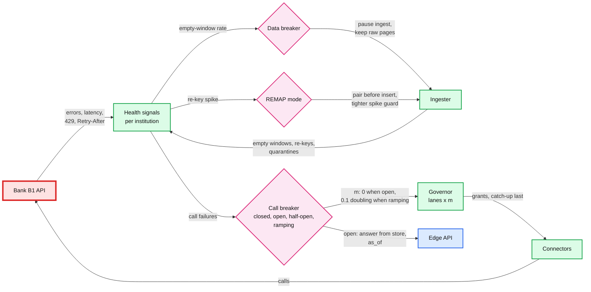

# Deep dive: institution outages and recovery

> One-line answer: one call breaker per institution lives in the governor and counts only institution-level errors; while it is open, taps get the stored data and its `as_of` time at once and nothing calls the bank; half-open canary probes close it, the multiplier ramps from 10% to 100% in ~8 minutes, and stale connections are caught up in the lowest lane, **most stale first**. Next to it sits a **data breaker**, because a bank that answers `200 OK` with empty lists looks healthy to every call check, and a first draft without one would have turned two empty fetches into ~400 M REMOVED events at B1. Recovery that lands on a Monday 9 AM is slow by arithmetic, not by design: ~100 calls/s are spare, so the catch-up ends early afternoon. And when the bank's real limit is half the assumed one, the lanes now protect retries and the schedule first, and taps queue.

Zoom-in on [`../solution.md`](../solution.md) §5.1, §5.2, §5.5, §5.6, §10.4 and §10.9. Concepts: [`../../../concepts/rate-limiting-and-load-shedding.md`](../../../concepts/rate-limiting-and-load-shedding.md) (breakers, shedding), [`../../../concepts/leases-fencing-clocks.md`](../../../concepts/leases-fencing-clocks.md). Siblings: [`refresh-scheduling-and-rate-limits.md`](refresh-scheduling-and-rate-limits.md) (lanes, grants), [`idempotent-ingestion.md`](idempotent-ingestion.md) (removal guard, pairing). Acronyms: AIMD (additive increase, multiplicative decrease), FDX (Financial Data Exchange), SLO (service level objective), ETA (estimated time of arrival).

---

## 1. Kinds of bad day

| Bad day | Signal | Response | Pages? |
|---|---|---|---|
| Down: `5xx`, timeouts | 50% of recent calls fail (§3), or p99 over 20 s | Call breaker OPEN, taps answered from store | Top-20 institution open over 30 min |
| Slow, not down | p99 over 3x baseline | AIMD halves m; the cap (in calls) bounds in-flight work | No |
| Throttling: `429`, `Retry-After` | Any `429` | m halved, `Retry-After` honored | Only if our rate was over 95% of contract (our bug) |
| Scheduled maintenance | FDX `503` "Scheduled maintenance" with `Retry-After` ([Core Exchange 6.0](https://plaid.com/core-exchange/docs/reference/6.0/)) | MAINTENANCE until that time | Never |
| **Silent: `200 OK`, empty lists** | Empty-window rate jumps (§5) | **Data breaker**: fetch raw, do not ingest | Yes: removals at stake |
| Partial: some accounts fail | Per-account error codes | Apply complete accounts only | No |
| Every id changes | Re-keyed share of rows (solution §5.6) | REMAP mode | Yes, plus institution relations |
| The partner is down | Breaker on the partner's governor key | Every bank on that partner pauses | Yes: one breaker, thousands of banks |
| Contract cut, or the bank's real limit is half | `429`s at a rate we thought was safe | AIMD settles near the real limit; §4 says who pays | Ticket to institution relations |

Per-connection errors (revoked consent, wrong password, closed account) never count toward any of these.

## 2. Where it all lives



## 3. The call breaker, precisely

- **One per institution, in the governor**, not one per worker: no fleet of breakers half-opening at once (solution §5.5).
- **The trigger: at least 20 calls, 50% failing at the institution level, counted over the last 200 calls but never further back than 5 minutes.** The count bound matters at B1, the time bound at small banks:
  - At B1 (~400 calls/s at 3 AM), 200 calls are half a second. Fast `503`s open it in under a second; timeouts open it ~22 s after the outage starts (failures complete only after the 20 s call timeout, at ~40/s). That is the "~30 s" in solution §10.4.
  - A pure 5-minute window would hold ~120k healthy calls when the outage starts: the failure share reaches 50% only after ~2.5 minutes (fast `503`s) to ~4.6 minutes (timeouts). Every one of those minutes fills the retry lane with B1 work.
  - An institution doing 0.01 calls/s never reaches 20 calls in 5 minutes, so it also opens on 5 consecutive failures.
- **Half-open.** Every 60 s, probe at 1 call per 10 s on a canary set of 20 healthy connections; 20 successes close it into RAMPING.
- **Ramp.** m = 0.1, doubling every 2 minutes while errors stay under 2%: ~8 minutes to full rate, ~300k calls of capacity given up at B1 in exchange for not knocking it over again.

## 4. Recovery, and when the limit is half

The simulation in §8 runs one Monday at B1 minute by minute through the lanes of solution §5.1. "first" is the first draft (retries with no guarantee, a 25% float, webhooks always borrowing before the schedule, a catch-up jittered over 2.8 h). "now" is the design: a 5% retry floor taken from the float, half the nightly webhooks folded into slots due within 4 h (with 8 h slots, about half of all connections have one) `[estimate]`, the schedule borrowing ahead of webhooks once it lags 15 minutes, and the catch-up served most stale first.

| Run | What happens | What it means |
|---|---|---|
| now, 1,000/s | Nothing queues; the folded webhook burst drains by 03:28 | The assumed contract is comfortable |
| now, 857/s (the real ceiling at 800 calls in flight) | **~179k taps** in the 9 AM hour get the cached view; schedule untouched | The concurrency term binds first. ~170k without the retry floor |
| first, 500/s | Retries wait up to ~12 h; webhooks borrow ahead of the schedule, so it falls **71 min** behind (p95 staleness ~8.8 h); webhooks drain at 07:55 | Why the design changed its borrow order |
| **now, 500/s** | Retries never wait; schedule lag peaks at **21 min** (p95 ~8.0 h, inside the 8 h SLO by ~3 minutes); webhooks drain at 05:15; **~438k taps** get the cached view | Taps absorb the shortfall, which is the intent |
| now, 1,000/s, outage 03:00 to 09:00 | Webhook backlog drains ~10:25, **catch-up done ~13:04**, ~132k taps get the cached view after recovery | ~14:00 if none of the webhooks can be folded |
| now, 500/s, same outage | Schedule lag 33 min (p95 ~8.2 h), catch-up not done by midnight | A small contract plus an outage costs a full day of B1 freshness |

**What degrades, in order, at 500/s.** In the first draft: retries (~12 h), then the schedule at night, then webhook freshness, then taps. With the design: taps at 9 AM first (most get the cached view and an ETA), then the schedule's slack (21 of its 24 minutes used), then webhook freshness. Never: the contract, or any other institution. The remaining lever, demoting active connections nobody read in 7 days to 2 refreshes a day, is not in the simulation; it is the margin for a bad week. The commercial fix is a user-present allowance: Plaid notes that an institution's limit "is not applied to user-present traffic (e.g., within Link)" ([Plaid rate-limit errors](https://plaid.com/docs/errors/rate-limit-exceeded/)).

**Push back on the textbook answer: "jitter the catch-up."** Jitter protects a bank from many independent clients retrying at once. Here one governor already meters every call and the connection rows are already the queue, so jitter changes only the **order** of service, and random order is worse than the obvious one: parked taps first, then most stale first, which minimizes the p95. The design dropped `now + U(0, S)` for that reason; the catch-up takes as long as spare capacity allows, and the dashboard shows that ETA.

## 5. Silent outages and the data breaker

- **The failure.** A bank's backend loses its transaction store for a few hours but its API keeps answering `200 OK` with empty lists. Every call succeeds, so the call breaker stays closed. Each account's window is "complete" and everything in it is missing. With only the two-look rule, two such fetches at least 6 h apart remove every row: at B1 `6 M accounts × ~67 posted rows ≈ 400 M` REMOVED events, all reaching QuickBooks. A spike guard that counts adds does not see it.
- **The data breaker.** Per institution, the share of account windows that come back empty where the previous fetch had at least 5 rows. Normal is a fraction of a percent (closed and idle accounts) `[estimate]`. Over 1% of fetched accounts in 30 minutes opens it: fetching continues (raw pages are cheap evidence), ingestion of that institution pauses, the on-call is paged. It closes by hand or after an hour of normal windows; then only the newest fetch per connection is ingested.
- **Per account,** the removal guard quarantines a fetch that would remove more than `max(5, 20%)` of the stored posted rows ([`idempotent-ingestion.md`](idempotent-ingestion.md) §6).

## 6. Id migrations, the hard variants

Solution §5.6 handles the base case (pair new ids with rows that went missing, REMAP mode past 1% of accounts in 30 minutes). Three variants to rehearse:
- **Rolling migration.** The bank migrates 10% of accounts a night. Each night's 300k connections cross the per-account 50% line; the institution line (1% in 30 minutes) is crossed within minutes each night. **Decision:** REMAP mode stays on until 24 h pass with no flagged fetch.
- **Ids and descriptions change together.** `content_fp` does not pair. REMAP falls back to per-day pairing on `(date, amount)` when per-day counts match exactly; otherwise quarantine for review.
- **The migration lands during an outage.** Recovery and REMAP overlap. Keep the order: ramp first (protect the bank), then REMAP decides what the rows mean.

## 7. Health score

One number per institution for the dashboard, never for automatic action beyond the switches in §2: success rate, p99 latency against its 7-day baseline, current m, empty-window rate, quarantine rate and REMAP flags, weighted by the institution's share of connections. The top 20 sit on one screen; a red top-20 institution is the morning's first conversation with institution relations.

## 8. Runnable: one Monday at B1

```python
# One Monday at B1, minute by minute, through the governor's lanes. "first" is the
# first draft: retries 0% guarantee, 25% float, webhooks always borrow before the
# schedule, catch-up jittered over 2.8 h. "now" is the design in solution 5.1, 5.2, 5.5:
# 5% retry floor (float 20%), half the nightly webhooks folded into slots due within 4 h,
# the schedule borrows ahead of webhooks once it lags 15 min, catch-up most stale first.
LANES = {"first": [(.20, .60), (.15, .45), (.40, 1.0), (0, .50)],
         "now":   [(.20, .60), (.15, .45), (.40, 1.0), (.05, .50)]}
SCHED, RETRY = 302, 8                         # calls/s: flat schedule, ~2% retries
OD_PEAK, OD_DAY = 590, 5.1e6                  # tap calls/s at Monday 9 AM, tap calls per day
shape = [.2] * 6 + [.5, 1, 2] + [0] + [2, 1.2, 1.2, 1.2, 1.2, 1.2, 1.2, 1, 1, 1, 1, .8, .5, .3]
off = (OD_DAY / 3600 - OD_PEAK) / sum(shape)  # scale the other 23 hours to 5.1 M/day
od_rate = [OD_PEAK if h == 9 else s * off for h, s in enumerate(shape)]

def day(design, contract, outage=None):
    now = design == "now"
    back = [0.0] * 5                          # on-demand, webhook, scheduled, retries, catch-up
    arrive = [[0.0] * 5 for _ in range(1440)]
    for m in range(1440):
        arrive[m][0] = od_rate[m // 60] * 60
        burst = 4.8e6 / 60 * (0.5 if now else 1)               # folded half needs no call
        arrive[m][1] = burst if 120 <= m < 180 else 0          # nightly webhook burst
        arrive[m][2], arrive[m][3] = SCHED * 60, RETRY * 60
    if outage:
        a, b = outage
        stale = sum(arrive[m][2] for m in range(a, b)) * 0.75  # 25% keep their slot
        for m in range(a, b):
            arrive[m][0] = arrive[m][2] = arrive[m][3] = 0     # taps served from store
        for k in range(1 if now else 168):                     # now: all at once; first: U(0, 2.8 h)
            arrive[b + k][4] += stale / (1 if now else 168)
    lag = od_max = demoted = retry_wait = 0
    done = {}
    for m in range(1440):
        cap = contract * 60
        if outage and outage[0] <= m < outage[1]:
            cap = 0
        elif outage and outage[1] <= m < outage[1] + 8:         # ramp 10, 20, 40, 80%
            cap *= 0.1 * 2 ** ((m - outage[1]) // 2)
        for i in range(5):
            back[i] += arrive[m][i]
        q = 0.6 * contract * 120                               # tap queue: 2 min of ceiling
        if back[0] > q:                                        # cached view + ETA, demoted
            demoted += back[0] - q; back[1] += back[0] - q; back[0] = q
        want = [back[0], back[1], back[2], back[3] + back[4]]
        floor = [back[0], back[1], back[2], back[3]]           # the 5% floor is for retries only
        give = [min(w, g * cap) for w, (g, c) in zip(floor, LANES[design])]
        spare = cap - sum(give)
        order = [0, 2, 1, 3] if now and lag > 15 else [0, 1, 2, 3]
        for i in order:                                        # borrow in priority order
            g, c = LANES[design][i]
            extra = max(0, min(want[i] - give[i], c * cap - give[i], spare))
            give[i] += extra; spare -= extra
        for i in range(3):
            back[i] -= give[i]
        r = min(back[3], give[3]); back[3] -= r; back[4] -= give[3] - r   # retries first
        lag = back[2] / SCHED / 60                             # minutes behind the slots
        for i in (1, 4):
            if back[i] < 1 and m > (outage[1] if outage else 180):
                done.setdefault(i, m)
        od_max, retry_wait = max(od_max, back[0]), max(retry_wait, back[3] / RETRY / 60)
        done["lag"] = max(done.get("lag", 0), lag)
    hhmm = lambda m: f"{m // 60:02d}:{m % 60:02d}" if m else "not today"
    p95 = 0.95 * 8 + done["lag"] / 60
    return (f"{design:>6} {contract:>5} {'yes' if outage else 'no':>4} {demoted / 3:>9,.0f} "
            f"{retry_wait:>7.0f} {done['lag']:>6.0f} {p95:>6.1f} {hhmm(done.get(1, 0)):>8} "
            f"{hhmm(done.get(4, 0)) if outage else '-':>10}")

print("design calls outage taps to retry  sched  p95    webhook   catch-up")
print("       per s         cache   wait m lag m  stale h drained   done")
for d, c, o in [("now", 1000, None), ("now", 857, None), ("first", 500, None), ("now", 500, None),
                ("now", 1000, (180, 540)), ("now", 500, (180, 540))]:
    print(day(d, c, o))
```

Output:

```
design calls outage taps to retry  sched  p95    webhook   catch-up
       per s         cache   wait m lag m  stale h drained   done
   now  1000   no         0       0      0    7.6    03:28          -
   now   857   no   179,006       0      0    7.6    03:43          -
 first   500   no   429,000     706     71    8.8    07:55          -
   now   500   no   438,440       0     21    8.0    05:15          -
   now  1000  yes   131,800       1      4    7.7    10:25      13:04
   now   500  yes   462,440       2     33    8.2    16:21  not today
```

- Columns: taps that got the cached view because the lane was full (taps during the outage itself are answered from store and not counted); the longest wait of a retry; the schedule's worst lag; a p95 staleness estimate of `0.95 × 8 h + lag`, outside the outage; when the webhook and catch-up backlogs emptied.
- The outage run is solution §5.5's scenario on a Monday. The catch-up needs ~4 h after recovery because at 9 AM taps take up to ~590 calls/s and the schedule 302, leaving ~100/s spare until the peak passes.

## 9. What an interviewer pushes on

1. **"The bank is down 6 h. What do users see?"** The stored data and its `as_of`, at once, plus an opt-in notification. Nothing is lost: the 14-day window covers the gap.
2. **"It comes back at 9 AM Monday."** Taps first, then the schedule floor, then catch-up most stale first. It takes ~4 h, and the dashboard says so.
3. **"The bank says 200 OK but sends nothing."** The call breaker cannot see it; the data breaker can. Removals are the dangerous half of an empty answer.
4. **"Your contract is really half."** With the design's borrow order, taps pay first and the schedule stays inside its SLO, barely. The first draft starved retries and the overnight schedule instead.
5. **"How fast does your breaker open?"** About 22 s on timeouts at B1, because it counts the last 200 calls. A 5-minute window alone would take ~2.5 to ~4.6 minutes.
6. **"Why not jitter?"** One governor already meters every call; order by staleness instead.

## 10. Trade-offs

| Decision | Option A | Option B | Chose | Why |
|---|---|---|---|---|
| Breaker placement | Per worker | Per institution in the governor | Governor | One view of the bank, no herd of half-open probes |
| Breaker window | Last N calls only, or last 5 minutes only | Last 200 calls, at most 5 minutes back, at least 20 calls | Both bounds | Count-only is noisy at small banks; time-only is minutes late at B1 |
| Catch-up order | Random jitter over S | Taps, then most stale first | Staleness order | The governor already meters the rate; jitter only randomizes order |
| Empty answers | Treat as data | Data breaker plus removal guard | Breaker | A silent outage would otherwise delete 14 days of books |
| Under a small limit | Webhooks before schedule | Schedule before webhooks when lagging, webhooks folded into near slots | Dynamic | The schedule carries the SLO; webhooks are hints |
| Recovery speed | Full rate at once | Ramp 10% to 100% in ~8 min | Ramp | A just-recovered bank is fragile; 8 minutes is cheap |

## 11. Numbers to say out loud

- Breaker: at least 20 calls and 50% failing over the last 200 calls (at most 5 minutes back); ~22 s to open on timeouts at B1; probes every 60 s; 20 successes to close.
- Ramp: 10%, 20%, 40%, 80%, 100%, 2 minutes each: ~8 minutes, ~300k calls of B1 capacity.
- 6 h outage at B1: ~2.2 M stale connections, ~6.5 M calls; on a Monday the catch-up ends ~13:04, ~14:00 if no webhook folds.
- At 500/s with the design: retries never wait, schedule lag 21 minutes (p95 ~8.0 h), ~438k taps get the cached view. The first draft: retries ~12 h, lag 71 minutes.
- Silent outage: ~400 M REMOVED events at B1 without a removal guard; the data breaker opens at 1% empty windows in 30 minutes.
- Rolling id migration: 300k connections a night; REMAP stays on until 24 h pass with no flagged fetch.
