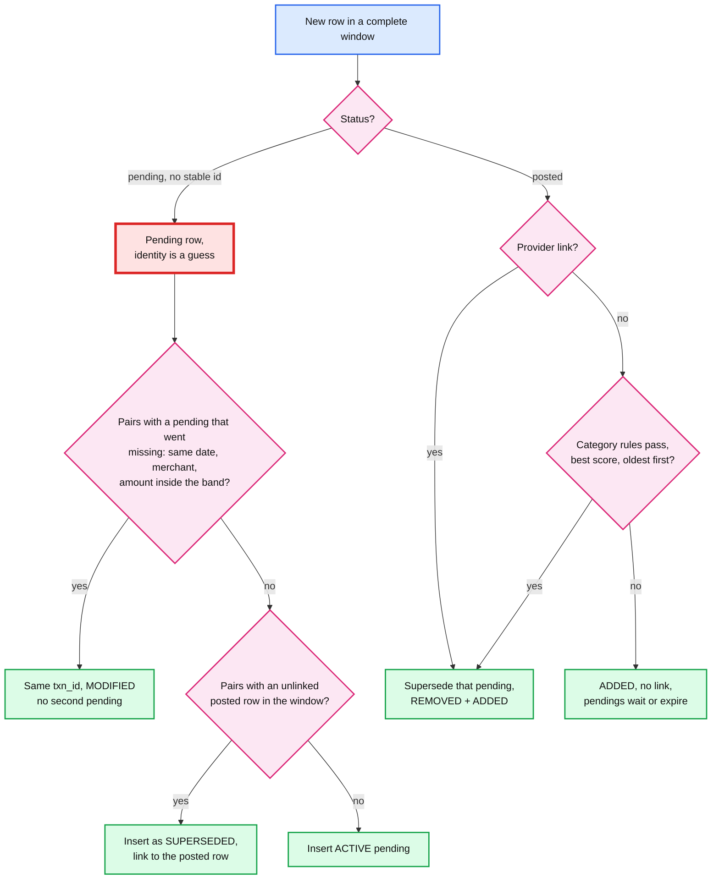

# Deep dive: pending-to-posted matching

> One-line answer: a posted row replaces its pending row by the provider's link when there is one, otherwise by category rules on amount ratio, date gap and merchant similarity, assigned oldest pending first; unmatched pendings expire after 14 days (30 for hotels and car rental), and consumers see Plaid's shape: REMOVED for the pending, ADDED for the posted, so QuickBooks reads posted only and never sees pending churn. Pending rows are display-only, so heuristics are safe. On routes without stable ids the matcher has two more rules, both inside the same transaction: **pending continuity** (a pending whose amount changes while still pending stays one row) and the **reverse match** (a pending listed after its posted row is born superseded). A first draft without them double-counted spend in Credit Karma for 8 h (24 h on dormant connections) and 16 h (up to 14 days) respectively.

Zoom-in on [`../solution.md`](../solution.md) §4.4, §5.4 and §12 (the AI scorer). Concepts: [`../../../concepts/exactly-once.md`](../../../concepts/exactly-once.md) (idempotent consumers), [`../../../concepts/stream-processing.md`](../../../concepts/stream-processing.md). Consumers: [`../../quickbooks-ledger/`](../../quickbooks-ledger/), [`../../credit-score-alerts/`](../../credit-score-alerts/). Sibling: [`idempotent-ingestion.md`](idempotent-ingestion.md) (fingerprints, pairing). Acronyms: FDX (Financial Data Exchange), MCC (merchant category code), ML (machine learning).

---

## 1. What banks actually send

| Fact | Source |
|---|---|
| "It typically takes about one to five business days for a transaction to move from pending to posted, although it can take up to fourteen days in rare situations" | [Plaid transaction states](https://plaid.com/docs/transactions/transactions-data/) |
| "the pending charge for a meal at a restaurant may not include a tip, but the posted version will include the final amount spent" | same page |
| "Pending transactions are short-lived and frequently altered or removed by the institution before finally settling" | same page |
| A pending row may "simply disappear", e.g. an authorization hold "frequently used by gas stations, hotels, and rental-car companies" | same page |
| "Some institutions, such as Capital One and USAA, do not provide pending transaction data" | same page |
| "In some rare cases, Plaid will fail to match a posted transaction to its pending counterpart" | same page |
| FDX: pending and posted versions "must have different IDs"; `referenceTransactionId` is, "for credit card posting transactions, the identity of the authorization transaction" | [Plaid Core Exchange FDX 6.0](https://plaid.com/core-exchange/docs/reference/6.0/) |
| A posted transaction "cannot necessarily be considered immutable", e.g. a refund or a recategorization | Plaid transaction states |

Two consequences. A pending row's **amount and name are mutable while it is pending**, which matters for any fingerprint that hashes them. And the pending and posted rows are **two identities**, linked by a pointer, never one row that changes status.

## 2. The matcher, with the two added rules



## 3. The stream contract consumers rely on

- **Per account, a gap-free `seq` inside an epoch**, cursor `(epoch, seq)`, retained 30 days (solution §5.4). Every entry carries the row's status.
- **Pending to posted is two entries in one transaction:** `REMOVED t_17 (SUPERSEDED)` and `ADDED t_41 (POSTED, pending_txn_id t_17)`. A reader can never see both active. This is Plaid's `/transactions/sync` shape, so consumers written against Plaid already handle it.
- **The posted filter keeps entries whose status is POSTED.** QuickBooks sees only `ADDED t_41`. Credit Karma sees both and replaces the row in place.
- **A superseded or expired row never comes back.** If the bank keeps listing a pending we already superseded, its fingerprint exists and the upsert is a no-op. If the bank edits it (a tip appears on the old pending), the row's content may be updated for audit, but **no event is emitted and its state stays terminal** (solution §5.4). Without that rule, a MODIFIED on a superseded pending could reactivate it in a consumer.
- **Consumers apply idempotently on `(account_id, seq)`.** A relay retry delivers the same `seq` twice; the second is a no-op.

## 4. Rules, assignment and the hard cases

Category bands from solution §5.4, all `[estimate]`, to be tuned on labeled data:

| Category | Posted ÷ pending | Date window | Merchant similarity |
|---|---|---|---|
| Restaurants, bars, taxis, salons | 1.00 to 1.30 | 14 days | at least 0.8 |
| Fuel | any (the pending is a hold) | 7 days | at least 0.9 |
| Lodging, car rental | 0.5 to 1.5 | 30 days | at least 0.8 |
| Foreign currency | within 3% | 14 days | at least 0.8 |
| Everything else | exact | 14 days | at least 0.8 |

- **Assignment.** Per account, score every (new posted, active pending) pair that passes, assign greedily by score, ties to the **oldest pending**, then `txn_id`. Deterministic, so a re-run of the same fetch gives the same matches.
- **Two $45.00 pendings, one $54.00 posted.** The older pending is superseded; the younger stays until its own posted row comes, or it is dropped twice, or it expires. Which of the two is superseded does not matter to the user; the count does.
- **Category comes from the MCC on the posted row** when the route provides it, else from the merchant name. A wrong MCC widens or narrows the band; worst case a pending stays on screen a day longer.
- **Split captures.** One $100 authorization posts as $60 and $40: the first supersedes, the second is ADDED with an informational link.
- **No pendings at all** (Capital One, USAA): posted rows are simply added.

## 5. Why the matcher has two more rules

**Case 1: the pending changes while pending, on a route with no stable ids.** The no-id fingerprint is `H(account, status, date, amount, currency, desc_norm, normalizer, occurrence)`. A $45.00 dinner pending on Tuesday shows as $54.00 on Wednesday, still pending. New amount, new fingerprint: a first draft inserted a **second** active pending ($54.00) and started the two-look removal clock on the first. Credit Karma showed $99.00 of dinner until the next fetch at least 6 h later: **8 h at 3 refreshes a day, 24 h for a dormant connection.** A "large spend" alert could fire on the phantom. The self-loop "edited, same txn_id" in the state diagram of solution §5.4 holds on stable-id routes because of the id, and on no-id routes only because of the rule below.

- **The rule: pending continuity.** Before inserting a new pending row, pair it with an active pending that went missing **in this same complete window**: same date, same `desc_norm`, amount inside the category band. A pair is the same `txn_id`, updated in place, one MODIFIED. It is the same pairing pass the id-migration logic uses (solution §5.6), with a looser amount rule because pending rows are display-only.

**Case 2: the pending shows up after its posted row.** Some banks list a pending a few hours behind the posted row (separate pending and posted systems), or a fast-settling debit posts before our first fetch sees its pending. A matcher that runs only on each **new posted** row finds no pending yet, so the posted row is ADDED with no link. When the pending appears, nothing matches it: it stays an active pending until dropped twice, or for 14 days if the bank keeps listing it. **16 h of double count** in the first-draft run below.

- **The rule: the reverse match.** A new pending row is also compared with **posted rows in the window that have no pending link**, same rules. A match inserts the pending directly as SUPERSEDED with the link. No event for consumers that filter to posted; Credit Karma sees nothing new.

## 6. Expiry, grace and stale lists

- **Grace for drops.** A pending missing from the bank's list is REMOVED only after 2 consecutive complete fetches at least 6 h apart. Usually its posted row arrives in the same fetch.
- **Expiry.** A sweeper marks an active pending EXPIRED after its category window (14 days, 30 for lodging and car rental), even if the bank still lists it, and appends `REMOVED (EXPIRED)`. Some banks list stale pendings for weeks; the sweeper is what keeps them off screen.
- **Late posted after expiry.** Added with no link. Nothing is double counted, because the pending is already gone.

## 7. Where a model helps, and where it must not

Solution §12 proposes a learned scorer for unlinked pairs. Labels are free: every provider-linked pair is a positive; other candidates in the same account and window are negatives. Guardrails: hard rules still gate candidates, a precision-tuned threshold, shadow first, the model version stored on every match, the rules as fallback. The two fixes above are **not** model territory: continuity and reverse matching are about identity, and identity stays deterministic.

## 8. Runnable: both cases, first draft against the design

A no-id route, fetches at 01:13, 09:13 and 17:13 (hours 1, 9, 17 of each day). Over-count = what the app would show minus the true spend.

```python
FETCHES = [h + 24 * d for d in range(4) for h in (1, 9, 17)]   # 01:13, 09:13, 17:13 slots
BAND = (1.00, 1.30)                                             # restaurant tip band

def bank_list(script, t):        # what the bank lists at hour t: (status, day, cents, desc)
    return [r for start, end, r in script if start <= t < end]

def true_spend(script, t):       # one purchase per case: posted amount wins over pending
    rows = sorted(bank_list(script, t), key=lambda r: r[0] != "POSTED")
    return rows[0][2] if rows else None

def run(script, fixed):
    rows, over = {}, []          # fingerprint -> state dict; hours of over-count
    for t in range(0, 96):
        if t in FETCHES:
            seen = {(s, d, a, n) for s, d, a, n in bank_list(script, t)}  # no-id fingerprint
            for fp in seen - rows.keys():
                new = {'fp': fp, 'state': 'ACTIVE', 'miss': None, 'link': None}
                st, day, amt, desc = fp
                gone = [r for r in rows.values() if r['state'] == 'ACTIVE'
                        and r['fp'][0] == 'PENDING' and r['fp'] not in seen]
                if fixed and st == 'PENDING':
                    mates = [r for r in gone if r['fp'][3] == desc
                             and BAND[0] <= amt / r['fp'][2] <= BAND[1]]
                    if mates:            # design: same pending, amount edited: MODIFIED
                        rows.pop(mates[0]['fp'])
                        new['miss'] = None
                    posted = [r for r in rows.values() if r['fp'][0] == 'POSTED'
                              and r['link'] is None and r['fp'][3] == desc
                              and BAND[0] <= r['fp'][2] / amt <= BAND[1]]
                    if posted:           # design: pending arrived after its posted row
                        new['state'], posted[0]['link'] = 'SUPERSEDED', fp
                rows[fp] = new
                if st == 'POSTED':       # both: match each new posted row
                    cands = sorted((r for r in rows.values() if r['state'] == 'ACTIVE'
                                    and r['fp'][0] == 'PENDING' and r['fp'][3] == desc
                                    and BAND[0] <= amt / r['fp'][2] <= BAND[1]),
                                   key=lambda r: r['fp'][1])            # oldest first
                    if cands:
                        cands[0]['state'], new['link'] = 'SUPERSEDED', cands[0]['fp']
            for r in rows.values():      # two looks at least 6 h apart before REMOVED
                if r['state'] == 'ACTIVE' and r['fp'] not in seen:
                    if r['miss'] is None:
                        r['miss'] = t
                    elif t - r['miss'] >= 6:
                        r['state'] = 'REMOVED'
                elif r['fp'] in seen:
                    r['miss'] = None
        shown = sum(r['fp'][2] for r in rows.values() if r['state'] == 'ACTIVE')
        truth = true_spend(script, t)
        if truth is not None and shown > truth:
            over.append((t, shown - truth))
    return over

cases = {
    "tip added while pending": [(19, 34, ("PENDING", 1, 4500, "CAFE ROMA")),
                                (34, 54, ("PENDING", 1, 5400, "CAFE ROMA")),
                                (54, 96, ("POSTED", 3, 5400, "CAFE ROMA"))],
    "pending listed after posted": [(8, 96, ("POSTED", 2, 1200, "BLUE BOTTLE")),
                                    (10, 20, ("PENDING", 2, 1200, "BLUE BOTTLE"))],
}
for name, script in cases.items():
    for fixed in (False, True):
        over = run(script, fixed)
        span = f"hours {over[0][0]} to {over[-1][0]}" if over else "never"
        worst = max((o for _, o in over), default=0) / 100
        print(f"{name:28} {'design' if fixed else 'first draft':11} over-counted {len(over):2} h "
              f"({span}), worst ${worst:.2f}")
```

Output:

```
tip added while pending      first draft over-counted  8 h (hours 41 to 48), worst $45.00
tip added while pending      design      over-counted  0 h (never), worst $0.00
pending listed after posted  first draft over-counted 16 h (hours 17 to 32), worst $12.00
pending listed after posted  design      over-counted  0 h (never), worst $0.00
```

- Tip case: the $54.00 pending appears at the 17:13 fetch on Wednesday (hour 41); the $45.00 one is removed only at Thursday 01:13 (hour 49), 8 h later. With continuity it is one row, MODIFIED.
- Late pending: inserted at hour 17, removed at hour 33 after two looks. With the reverse match it is born superseded.
- QuickBooks is unaffected in every row: both cases live in pending rows, which the posted filter drops. That is why the design can afford heuristics here, and also why these bugs would survive a QuickBooks-only test suite.

## 9. What an interviewer pushes on

1. **"One transaction or two?"** Two identities (pending and posted), one purchase. REMOVED + ADDED with a link, in one database transaction.
2. **"Two $45.00 pendings, one $54.00 posted?"** Oldest first, deterministic. The count is what matters.
3. **"The pending amount changes before it posts, and the bank has no ids."** Pending continuity: pair with the pending that went missing in the same window, same row, MODIFIED.
4. **"The pending shows up after the posted row."** Reverse match: insert it already superseded.
5. **"Why is a heuristic acceptable?"** Pending never reaches the books. Posted-to-posted dedup is never heuristic: that is the fingerprint's job.
6. **"Where does ML fit?"** Scoring unlinked pairs, with provider links as labels. Never in identity or dedup.

## 10. Trade-offs

| Decision | Option A | Option B | Chose | Why |
|---|---|---|---|---|
| Pending to posted | Modify the pending in place | REMOVED + ADDED with a link | Remove + add | The books need a posted identity that never changes; Plaid's consumers already know the shape |
| No-id pending identity | Content fingerprint only | Fingerprint plus continuity pairing | Pairing | Pending amounts change by design; a fingerprint alone double counts |
| Match direction | Posted looks for pending | Both directions | Both | Banks do not promise the pending arrives first |
| Matching method | Provider link only | Link, rules, then a scorer | Link + rules (+ scorer in shadow) | Rare unlinked cases and no-link routes; errors only touch display |
| Terminal states | Reactivate on new data | Terminal forever, update silently | Terminal | A resurrected pending is a double count in every consumer |
