# Deep dive: refresh scheduling and rate limits

> One-line answer: the scheduler hashes every connection into a slot so B1's (the largest bank's) scheduled load is a flat ~302 calls/s, and one governor per institution turns demand into **grants**, with lanes that decide who waits. Fencing cannot reach the bank (an epoch protects our database, not someone else's API), so the design makes a grant expire **at the holder**: its first call must start within 1 s or it is void. The cap counts **calls** in flight, not jobs, and the OAuth token call pays a token when the bank meters it with its data API. A first draft without these rules broke B1's contract in every simulated case below, up to 4,800 calls in one second; with them, a dead or paused governor can only cause under-use.

Zoom-in on [`../solution.md`](../solution.md) §2, §4.2, §5.1, §5.2, §10.1 and §10.4. Reusable blocks: [`../../../concepts/rate-limiting-and-load-shedding.md`](../../../concepts/rate-limiting-and-load-shedding.md), [`../../../concepts/leases-fencing-clocks.md`](../../../concepts/leases-fencing-clocks.md), [`../../../concepts/etcd.md`](../../../concepts/etcd.md). Hierarchical limits in general: [`../../network-throttling/`](../../network-throttling/). Siblings: [`institution-outages-and-recovery.md`](institution-outages-and-recovery.md) (what degrades when the limit is smaller), [`connectors-and-credentials.md`](connectors-and-credentials.md) (token calls). Acronyms: HTB (hierarchical token bucket), AIMD (additive increase, multiplicative decrease), GC (garbage collection), FDX (Financial Data Exchange), OAuth (open authorization), SLO (service level objective), ETA (estimated time of arrival).

---

## 1. The numbers at B1 that drive everything

| Quantity | Value | Source |
|---|---|---|
| Connections | ~3 M | solution §2 |
| Demand, scheduled lane | 302 calls/s, flat (26.1 M calls/day) | solution §2 |
| Demand, webhook lane | 56/s average; ~1,333/s for 1 h after the nightly posting run | solution §2, §5.2 |
| Demand, on-demand lane | 59/s average; ~590/s at Monday 9 AM | solution §2 |
| Total | 417/s average; ~948/s at Monday peak | solution §10.3 |
| Contract | 1,000 calls/s and 800 calls in flight | `[estimate]`, solution §2 |
| Call latency | token call ~0.3 s, accounts 0.4 s, transactions 1.2 s each | solution Flow 1 |

**The constraint hiding in the table.** Little's law: calls in flight = rate × time per call. The data calls average `(0.4 + 1.2 + 1.2) ÷ 3 = 0.93 s`, so 1,000 calls/s means ~933 calls in flight against an 800 limit. The real ceiling is `800 ÷ 0.93 ≈ 857 calls/s`, and the design plans against it. Monday peak demand (~948) is **~111% of what B1 actually lets us run**. A first draft used 0.8 s per call and called the same peak 95% of the contract.

**The call that is easy to miss.** Access tokens live ~15 minutes and slots are 8 h apart, so nearly every fetch first calls the bank's token endpoint. A refresh is 3 data calls; if B1 meters its token endpoint with its data API, the token call is a 4th token in the same grant and B1 needs ~556 calls/s on average and ~1,264/s at Monday peak. If it is metered separately, it goes to a sibling governor key. Either way the governor sees it ([`connectors-and-credentials.md`](connectors-and-credentials.md) §3).

## 2. The mechanism, end to end

```mermaid
%% Scheduler and governor for one institution: grants that expire at the holder, a cap in calls, and a token call that pays a token. The bank is red: nothing here can fence it.
flowchart LR
    SCH[Scheduler<br/>slot = hash mod 480 min,<br/>tiers, demand] -->|"next_due_at, demand"| CDB[(Connection rows<br/>the queue)]
    CDB -->|"due and demanded rows,<br/>SKIP LOCKED"| GOV[Governor leader<br/>lanes x m, one per institution]
    ETCD[(etcd lease 10 s<br/>epoch)] -->|"lease, epoch,<br/>checked every tick"| GOV
    GOV -->|"tokens: 3 data calls,<br/>+1 if token call metered"| CAP{{Cap counts calls<br/>800 at B1}}
    CAP -->|"grant: epoch, issued_at,<br/>start-by 1 s, call budget"| CW[Connectors]
    CW -->|"refresh token call,<br/>inside the grant"| VAULT[(Token vault)]
    VAULT -->|"OAuth refresh"| BANK[Bank B1<br/>cannot read epochs]
    CW -->|"accounts, 2 windows,<br/>first call before start-by"| BANK
    BANK -->|"429, latency"| AIMD[AIMD multiplier m]
    AIMD -->|"rate = contract x m"| GOV
    CW -->|"release, calls used"| GOV

    class SCH,GOV,CW,AIMD service
    class CDB,ETCD,VAULT store
    class CAP decision
    class BANK critical

    classDef service  fill:#dcfce7,stroke:#16a34a,stroke-width:2px,color:#111
    classDef store    fill:#ede9fe,stroke:#7c3aed,stroke-width:2px,color:#111
    classDef decision fill:#fce7f3,stroke:#db2777,stroke-width:2px,color:#111
    classDef critical fill:#fee2e2,stroke:#dc2626,stroke-width:4px,color:#111
```



## 3. Slots and tiers

- **Slot.** `slot = hash(connection_id) mod 480` minutes; an active connection refreshes at `slot`, `slot + 8 h`, `slot + 16 h`. 2.85 M active connections over 480 slot minutes is ~5,940 per minute, ~99 per second, ~297 calls/s at 3 calls each; the 150k dormant ones add ~5 calls/s. Total ~302. The hash is uniform, so no minute is hot.
- **Tiers.** Active (a login, a consumer read, or a new transaction in 90 days): 3 a day. Dormant: 1 a day. The idea is Yodlee's: "Refreshes are stopped for users inactive for over 90 days" ([Yodlee refresh policy](https://developer.yodlee.com/resources/yodlee/refresh-policy/docs)). Any read by the owner promotes a dormant connection (solution §5.2).
- **The SLO is thinner than it looks.** If every active connection is refreshed exactly every 8 h, its staleness at a random moment is uniform on 0 to 8 h, so the p95 is already `0.95 × 8 h = 7.6 h`. The target is p95 under 8 h. **The schedule can fall only ~24 minutes behind before the SLO breaks.** So the design pages on schedule lag over 15 minutes (solution §5.2), long before the SLO is lost. The other option, slots 7 h apart (3.4 a day, +14% scheduled calls), was not needed.
- **Connection rows are the queue.** The governor reads `(institution_id, next_due_at)` with `FOR UPDATE SKIP LOCKED`, 500 rows at a time, ~140 rows/s on average at B1. Coalescing is free: a tap on a connection that already has demand or a lease changes nothing.

## 4. Lanes: who waits

Shares from solution §5.1, as fractions of the usable rate (`contract × m`, ~857 calls/s at B1 because of the cap):

| Lane | Guarantee | Ceiling | Borrow order | Demand at B1 |
|---|---|---|---|---|
| On-demand | 20% | 60% | 1st | 59/s average, ~590/s Monday 9 AM |
| Webhook | 15% | 45% | 2nd | 56/s average, 1,333/s for 1 h at night |
| Scheduled | 40% | 100% | 3rd, 2nd once it lags 15 min | 302/s flat |
| Retries and catch-up | 5% (retries only) | 50% | 4th | ~8/s retries |
| Unassigned float | 20% | | by priority | |

- **At a healthy 1,000/s,** nothing waits: taps borrow up to 590, the schedule keeps 302, the (half-folded) webhook burst drains by ~03:30.
- **At the real ~857/s ceiling,** the on-demand lane tops out at ~514/s on Monday morning. The 2-minute queue fills, then **~179k taps in the 9 AM hour (about a quarter)** get the cached view and an ETA; the schedule is untouched (simulated in [`institution-outages-and-recovery.md`](institution-outages-and-recovery.md) §8; ~170k without the 5% retry floor, which comes out of the float). This is the design working as intended, and the reason the real fix is commercial: a user-present allowance from B1.
- **At 500/s** (a smaller real contract, or AIMD at m = 0.5 after a `429` storm), the first draft starved retries for ~12 h and let the nightly webhook burst push the schedule 71 minutes behind (p95 ~8.8 h). Three rules fixed that: webhook demand for a connection whose next slot is within 4 h folds into that slot; once the schedule lags 15 minutes it borrows **ahead** of webhooks; retries have a 5% floor. Simulated with the design: retries never wait, schedule lag peaks at 21 minutes (p95 ~8.0 h), and taps absorb the shortfall (~438k get the cached view). Demoting connections nobody read in 7 days to 2 refreshes a day is the reserve lever.
- **Fairness inside a lane, by caller.** Round robin by the **calling user or firm**, not by tenant: an accountant who refreshes 5,000 client companies is 5,000 tenants but one caller, and gets one turn per round.

## 5. The cap counts calls

A first draft made a permit one job (1 accounts call, then 2 transactions calls in parallel) and capped 800 permits. The contract is 800 **calls**.

- Healthy bank: 333 jobs/s × ~1.6 s ≈ 533 jobs in flight, under 800 permits, so the cap never bound, and calls in flight were ~933 (simulated: 924). **The contract was broken in steady state.**
- Bank 5x slower: 800 jobs, each with 2 calls in its long phase: **1,600 calls in flight, 2x the contract**, exactly when the bank is struggling.
- **The design.** A grant holds one cap unit per call it may have open. Background jobs (scheduled, webhook, catch-up) run their calls one after another and hold 1. On-demand jobs run the account windows in parallel and hold 2, because a user is waiting. Little's law then gives at most `800 ÷ 0.93 s ≈ 857 calls/s`; if B1 slows to 5 s per call, the cap alone holds us to ~160 calls/s.
- A business connection with 12 accounts costs 13 data tokens, holds at most 2 cap units, and runs its windows 2 at a time.

## 6. Grants, leases and what fencing cannot do

Fencing works when **the resource** checks the token ([`../../../concepts/leases-fencing-clocks.md`](../../../concepts/leases-fencing-clocks.md)). Our database does: `fetch_seq` and the ingest transaction reject a zombie's write. The bank does not; it answers whoever calls. So every protection on the bank side is a holder that **stops itself** before the issuer can re-issue.

| Failure | First draft, worst case at B1 | Why | With grants (the design) |
|---|---|---|---|
| Healthy bank, full rate | ~924 calls in flight (1.16x) | Cap counted jobs | 800 |
| Bank 5x slower | 1,600 in flight (2x) | Same | 800 |
| Connectors stall 150 s (vault or token endpoint slow) | 4,800 calls in one second, 3,200 in flight | Governor reclaimed at 120 s and re-granted 800 more jobs; both sets fired when the stall cleared | Grants older than 1 s are void; peak stays normal |
| Governor GC pause of 15 s past its 10 s lease, lease checked on a monotonic clock every 10 ms tick | One tick leaks: ~3 jobs, ~10 calls | The check and the send are not atomic | Late grants are older than 1 s: void |
| Same, but leadership a flag cleared by the etcd keepalive callback (~3 s) `[assumption]` | A 1 s burst bucket refilled during the pause plus 3 s at 1,000/s, on top of the new leader's 100/s: ~2,100 calls in the first second, ~1,100/s for 2 s more | Connectors that have not seen epoch 13 accept epoch 12 | Void by age, whatever the epoch |
| Token-endpoint calls metered with the data API | +1 call per fetch, ungoverned: ~556/s average, ~1,264/s Monday peak | The vault called the bank directly | The token call is inside the grant |

The simulation below reproduces rows 1 to 3.

**The design, in five rules (solution §5.1, §10.4).**
1. A grant carries `epoch`, `issued_at` (governor clock), `start_by = issued_at + 1 s`, a call budget and its cap units. A connector refuses to start the first call after `start_by`. Host clocks are kept within 100 ms; a pod whose offset is larger drains itself.
2. Later calls of the same job must start before the 25 s job deadline. The governor reclaims a grant only after `issued_at + 25 s + 20 s call timeout = 45 s`, and never re-dispatches that connection before then. A stalled connector's late calls are extra calls, but never concurrent with its replacement's.
3. The cap counts calls (§5).
4. The token refresh call is part of the grant when the bank meters it with the data API, or a sibling governor key when it is metered separately.
5. The leader checks its lease on a monotonic clock in every tick. A **planned** handoff (a deploy) passes `m` and the in-flight table to the successor, which starts at that `m`. Only an **unplanned** failover ramps from m = 0.1: a ramp costs B1 ~300k calls (~100k refreshes) of capacity over 8 minutes, so a deploy at Monday 9 AM that ramped would be a self-inflicted surge.

**Rejected: per-connector slices.** The governor would hand each connector pod a call budget for the next 1 s, and a pod could call only while it held unspent budget. Same safety property as rule 1 (a dead governor means every slice ends within a second). Rejected as the main mechanism: 15k institutions over ~400 pods, and a long-tail bank at 5 calls/s cannot be sliced 400 ways; priority lives in who gets which job, which still needs one place that sees every waiter. Rule 1 is the same idea at job granularity.

## 7. Runnable: the overshoot, measured

Six scenarios at B1. "First draft" is one permit per job, 800 permits, a 120 s reclaim. "Grants" is §6 rules 1 to 3.

```python
RATE, CAP, STEP = 1000, 800, 0.1   # B1 contract: calls/s, calls in flight; 100 ms steps
ACC, TXN = 4, 12                   # call latencies in steps: 0.4 s and 1.2 s (solution Flow 1)

def run(fixed, stall=None, slow=1, secs=320):
    """fixed=False, the first draft: one permit per job, 800 permits, the job's
    2 transaction calls run in parallel, and the governor reclaims a permit 120 s
    after issue whatever the connector is doing.
    fixed=True, the design (solution 5.1): grants count calls in flight (a
    background job runs its 3 calls one after another, so it holds 1), the first
    call must start within 1 s of issue or the grant is void, and reclaim waits
    for the 25 s job deadline plus a 20 s call timeout."""
    jobs, tokens, held, started, peak_fl = [], 0, 0, [], 0
    for t in range(int(secs / STEP)):
        tokens = min(tokens + RATE * STEP, RATE * STEP)
        for j in jobs:                                   # governor-side reclaim
            if j['held'] and t - j['t0'] > (450 if fixed else 1200):
                j['held'], held = False, held - 1
        while tokens >= 3 and held < CAP:                # dispatch: 3 tokens per job
            jobs.append({'t0': t, 'left': 3, 'busy': 0, 'end': 0, 'held': True})
            tokens, held = tokens - 3, held + 1
        stalled = stall and stall[0] <= t * STEP < stall[1]
        calls = 0
        for j in jobs:
            if j['busy'] and t >= j['end']:              # a call (or pair) returned
                j['busy'] = 0
            if j['busy'] or j['left'] == 0:
                continue
            if j['left'] == 3:                           # first call needs the token
                if stalled:
                    continue
                if fixed and t - j['t0'] > 10:           # grant older than 1 s: void
                    j['left'] = 0
                    continue
                j['left'], j['busy'], j['end'] = 2, 1, t + ACC * slow
                calls += 1
            elif fixed:                                  # serialized transactions calls
                j['left'], j['busy'], j['end'] = j['left'] - 1, 1, t + TXN * slow
                calls += 1
            else:                                        # both accounts in parallel
                j['left'], j['busy'], j['end'] = 0, 2, t + TXN * slow
                calls += 2
        for j in jobs:
            if j['left'] == 0 and not j['busy'] and j['held']:
                j['held'], held = False, held - 1
        jobs = [j for j in jobs if j['left'] or j['busy'] or j['held']]
        started.append(calls)
        peak_fl = max(peak_fl, sum(j['busy'] for j in jobs))
    per_s = max(sum(started[i:i + 10]) for i in range(len(started) - 10))
    return per_s, peak_fl, sum(started[300:600]) / 30

print(f"{'scenario':46}{'max calls in 1 s':>17}{'max in flight':>15}{'calls/s':>9}")
for name, kw in [("first draft, healthy bank", {'fixed': False}),
                 ("first draft, bank 5x slower", {'fixed': False, 'slow': 5}),
                 ("first draft, connectors stall 150 s", {'fixed': False, 'stall': (60, 210)}),
                 ("grants, healthy bank", {'fixed': True}),
                 ("grants, bank 5x slower", {'fixed': True, 'slow': 5}),
                 ("grants, connectors stall 150 s", {'fixed': True, 'stall': (60, 210)})]:
    p, f, s = run(**kw)
    over = "  OVER CONTRACT" if p > RATE or f > CAP else ""
    print(f"{name:46}{p:>17,}{f:>15,}{s:>9,.0f}{over}")
```

Output (deterministic):

```
scenario                                       max calls in 1 s  max in flight  calls/s
first draft, healthy bank                                   990            924      990  OVER CONTRACT
first draft, bank 5x slower                                 800          1,600      295  OVER CONTRACT
first draft, connectors stall 150 s                       4,800          3,200      990  OVER CONTRACT
grants, healthy bank                                        932            800      828
grants, bank 5x slower                                      470            800      184
grants, connectors stall 150 s                              932            800      828
```

- Grants run ~828 calls/s, not 990. That is not a cost of the design: 990 was reachable only by holding ~924 calls open against an 800 contract. The analytic ceiling is ~857; the 100 ms steps lose a little.
- The stall row is the herd we would cause ourselves. A 250 s stall would have re-granted twice: 2,400 jobs, ~7,200 calls released together.

## 8. What an interviewer pushes on

1. **"Your governor pauses for 15 s. Prove the bank never sees two dispatchers."** An epoch fences our database, not the bank. Grants die by age at the holder: anything the old leader sends after its pause is older than 1 s and is refused, and the new leader starts at least 2 s after the old lease ended.
2. **"1,000 calls/s and 800 in flight. Which one binds?"** The concurrency term, at Flow 1 latencies: ~857 calls/s. So Monday 9 AM queues taps even under the assumed contract.
3. **"Why not split the limit across workers?"** Autoscaling changes N, and 400 pods cannot share 5 calls/s. Per-pod slices work only for one big institution with dedicated pods.
4. **"What degrades first if the bank gives you half?"** With the design, taps (most get the cached view at 9 AM), then the schedule's slack. A naive borrow order would starve retries and the overnight schedule instead.
5. **"Do OAuth token refreshes count?"** Nearly every scheduled fetch finds a 15-minute access token expired, so yes when the bank meters them with its data API: +1 call per fetch. Ask the bank; govern it either way.
6. **"Why not Redis?"** Rate only: no priority, no lease on concurrency, and a failover can re-grant a burst (solution §5.1).

## 9. Trade-offs

| Decision | Option A | Option B | Chose | Why |
|---|---|---|---|---|
| Where the bank is protected | Epoch fencing at connectors | Grants that expire at the holder (start-by 1 s) | Expiring grants, epoch as well | The bank cannot read epochs; age works even for connectors that missed the new epoch |
| Cap unit | Jobs | Calls | Calls | The contract is in calls; jobs undercount by up to 2x when the bank is slow |
| Calls inside a background job | Parallel (1.6 s per job) | Serial (2.8 s per job) | Serial for background, parallel for taps | Same calls/s under a concurrency cap, half the cap units |
| Reclaim timing | Fixed 120 s | Job deadline + call timeout (45 s) | 45 s, after the holder's own deadline | Reclaiming while the holder may still call is how the stall stampede starts |
| Failover start rate | Always ramp from 0.1 | Ramp only when unplanned | Planned handoff keeps m | A ramp is ~100k delayed refreshes at B1's peak |
| Webhook vs schedule priority | Webhook first, always | Schedule first when it lags 15 min, near-slot webhooks folded | Dynamic | Webhooks are hints; the schedule carries the SLO |

## 10. Numbers to say out loud

- B1: 302 scheduled, 56 webhook, 59 on-demand calls/s average; ~948 Monday peak; +~139/s token calls if metered together.
- Little's law: 0.93 s per call, 800 in flight: **~857 calls/s real ceiling**; ~179k Monday 9 AM taps get the cached view.
- p95 of a perfect 8 h schedule is 7.6 h: 24 minutes of slack, paged at 15.
- First draft: 924 in flight healthy, 1,600 when slow, 4,800 calls in one second after a 150 s stall.
- Grants: start-by 1 s, reclaim at 45 s, cap in calls, token call governed. Zero overshoot in every case simulated.
