# Diagrams: bank feed aggregation

> One-line answer: twelve views of one design. A refresh scheduler writes due times and demand onto connection rows; a rate governor that owns each institution's token bucket, cap on calls in flight, lanes and breakers, and issues grants that die after 1 s, is the only way to reach a bank; connectors write immutable raw pages; an ingester applies each fetch in one transaction on a connection-sharded Postgres, keyed by a deterministic fingerprint, matches pending to posted, and appends a per-account change log that QuickBooks reads posted-only. The bank's rate limit and availability is the one red box.

The D1 to D12 set from `hld/CLAUDE.md` §4, each with a one-line caption. A diagram already in [`solution.md`](solution.md) gets a pointer here, never a second copy. Acronyms: FDX (Financial Data Exchange, the bank API standard), OFX (Open Financial Exchange, the older protocol), OAuth (open authorization), PKCE (proof key for code exchange), KMS (key management service), HSM (hardware security module), AZ (availability zone), AIMD (additive increase, multiplicative decrease), HTB (hierarchical token bucket), mTLS (mutual TLS), CDC (change data capture), MFA (multi-factor authentication). B1 is the largest institution: ~3 M connections, an assumed 1,000 calls/s and 800 in flight [estimate].

| # | Diagram | Where it lives |
|---|---|---|
| D1 | Context | below |
| D2 | Data flow | below |
| D3 | Component architecture (final design) | [solution §6](solution.md#6-final-design-and-the-six-core-flows) |
| D4 | Happy path per FR | FR1 connect: [solution §4.1](solution.md#41-connect-link-accounts-with-a-token-not-a-password). FR2 scheduled refresh: [solution §4.2](solution.md#42-refresh-on-a-schedule-on-demand-and-on-webhooks-inside-the-banks-limit); on-demand: [solution Flow 2](solution.md#flow-2-monday-9-am-at-b1-and-who-waits). FR3 ingest: [solution §4.3](solution.md#43-ingest-idempotently-every-fetch-retry-and-replay-is-a-no-op-for-rows-we-already-have). FR4 pending to posted: [solution §4.4](solution.md#44-reconcile-pending-and-posted-and-publish-a-clean-stream). Webhook-triggered partner refresh: below |
| D5 | Failure paths | Crash mid-write: [solution Flow 3](solution.md#flow-3-a-worker-crashes-halfway-through-a-write). 6-hour outage: [solution §10.4](solution.md#104-failure-timeline). A connector stalls before publishing, consent revoked during a refresh, a 429 storm: below |
| D6 | Decision flows | Fingerprint: [solution §5.3](solution.md#53-a-worker-crashes-halfway-through-a-page-two-identical-5-coffees-and-no-ids-exactly-once). Outage handling: [solution §5.5](solution.md#55-b1s-api-is-down-for-6-hours-what-do-users-see-and-what-happens-when-it-recovers). Id migration: [solution §5.6](solution.md#56-b1-migrates-its-core-system-and-every-transaction-id-changes-what-happens-to-dedup). Matcher (both directions) and snapshot vs delta: below |
| D7 | Entity relationship | [solution §3.3](solution.md#33-data-model) |
| D8 | State machines | Transaction row: [solution §5.4](solution.md#54-a-4500-pending-charge-posts-two-days-later-as-5400-with-a-new-id-one-transaction-or-two-what-if-there-were-two-4500-pendings). Connection and institution breaker: below |
| D9 | Deployment / topology | below, plus governor shard ownership |
| D10 | Scaling / partitioning | below |
| D11 | Failure mode map | below, two trees |
| D12 | Rollout / migration | below |

## D1. Context (zoom-out)

Our system as one box: apps and consumer services on one side, banks, partners and the key service on the other.

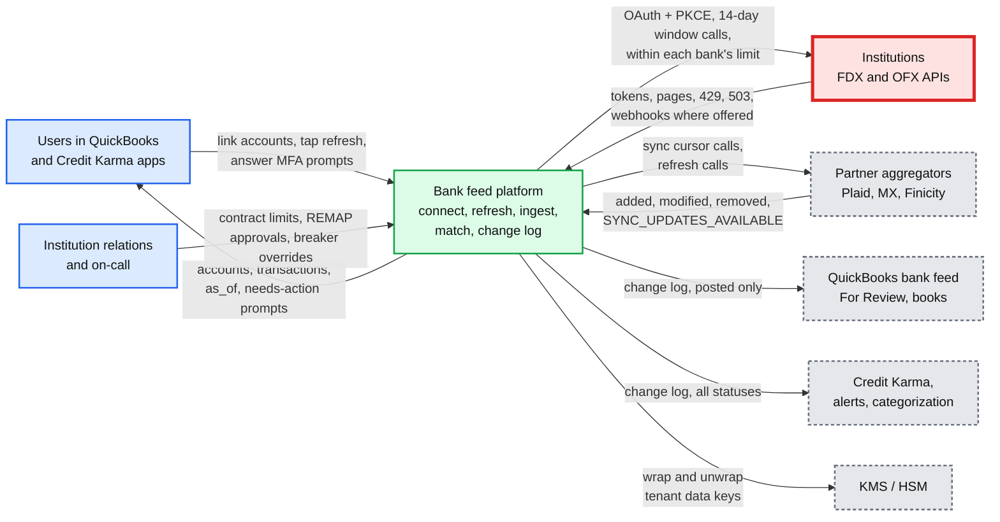

## D2. Data flow (DFD)

Inputs to outputs with format, size and rate. Averages unless marked peak; numbers from solution §2.

```mermaid
%% D2: data flow. Processes are rounded, stores are cylinders. 60 M refreshes/day, 180 M bank calls/day, 150 M new rows/day.
flowchart LR
    APP[Apps]:::client -->|"tap, JSON ~200 B,<br/>98/s avg, ~1k/s peak"| API(Edge API +<br/>scheduler):::service
    API -->|"demand + due times,<br/>~700 row writes/s"| CDB[(Connection DB<br/>15 M rows, 15 GB)]:::store
    CDB -->|"due rows, batches of 500"| GOV(Rate governor):::service
    GOV -->|"job + grant ~300 B,<br/>~700/s"| CW(Connectors):::service
    VAULT[(Vault)]:::store -->|"token ~2 KB, 700/s"| CW
    BANK[Banks and partners]:::critical -->|"JSON or OFX pages ~35 KB,<br/>2.1k calls/s, 4.5 TB/day raw"| CW
    CW -->|"gzip pages ~6 KB,<br/>0.75 TB/day"| RAW[(Raw store<br/>90 d hot, 68 TB)]:::store
    CW -->|"fetch-completed ~500 B,<br/>~700/s"| KR[[Kafka raw-fetches<br/>128 partitions]]:::queue
    KR -->|"pointer, in order<br/>per connection"| ING(Ingester + matcher):::service
    RAW -->|"pages, ~9 B rows/day re-read,<br/>14-day + weekly 60-day"| ING
    ING -->|"upserts ~1 KB, 2.4k writes/s,<br/>150 GB/day"| TXN[(Transaction store<br/>32 shards, ~60 TB)]:::store
    TXN -->|"change entries ~1 KB,<br/>2.4k/s, 210 M/day"| KC[[Kafka account-changes<br/>256 partitions]]:::queue
    KC -->|"posted only for QuickBooks"| CONS[Consumers]:::client
    classDef client   fill:#dbeafe,stroke:#2563eb,stroke-width:2px,color:#111
    classDef service  fill:#dcfce7,stroke:#16a34a,stroke-width:2px,color:#111
    classDef store    fill:#ede9fe,stroke:#7c3aed,stroke-width:2px,color:#111
    classDef queue    fill:#cffafe,stroke:#0891b2,stroke-width:2px,color:#111
    classDef critical fill:#fee2e2,stroke:#dc2626,stroke-width:4px,color:#111
```

## D3. Component architecture

The final design is [solution §6](solution.md#6-final-design-and-the-six-core-flows): 14 nodes, red on the institutions.

## D4. Happy paths, one per FR

FR1 to FR4 are in solution §4.1 to §4.4 (one `sequenceDiagram` each) and the on-demand variant of FR2 is Flow 2. The one path not drawn there: a partner's webhook triggers a DELTA refresh.

### D4b. A partner webhook triggers a cursor-based refresh

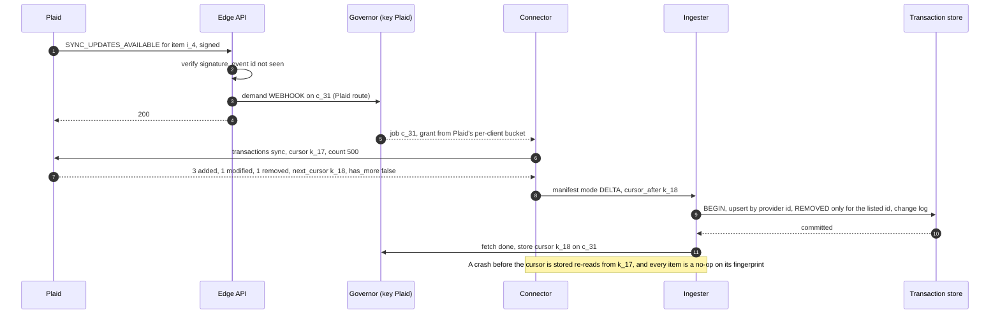

## D5. Failure paths

Crash mid-write is solution Flow 3 and the 6-hour outage is solution §10.4. Three more below.

### D5a. A connector stalls before publishing, and publishes late

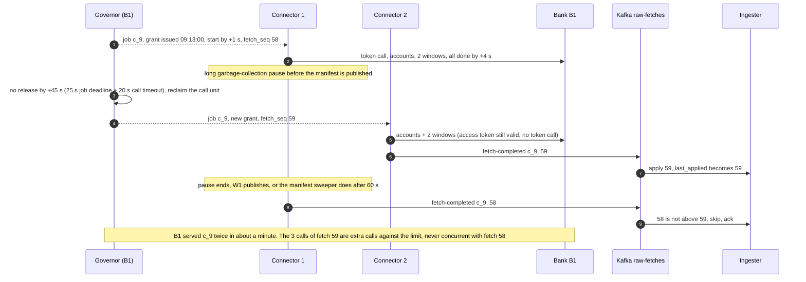

### D5b. The user revoked consent at the bank during a scheduled refresh

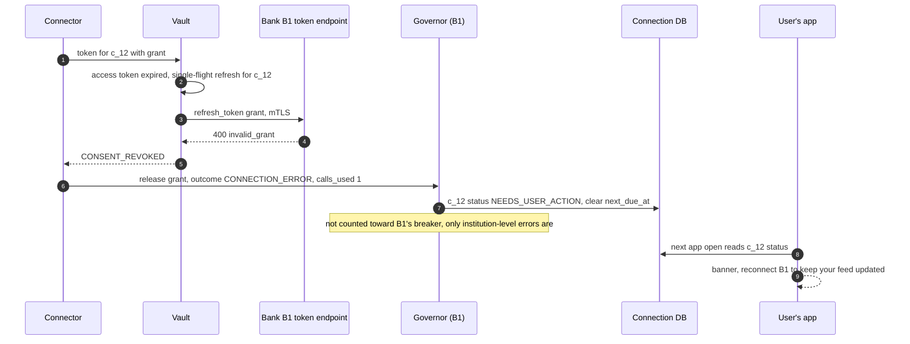

### D5c. A 429 storm at B1 under a surge

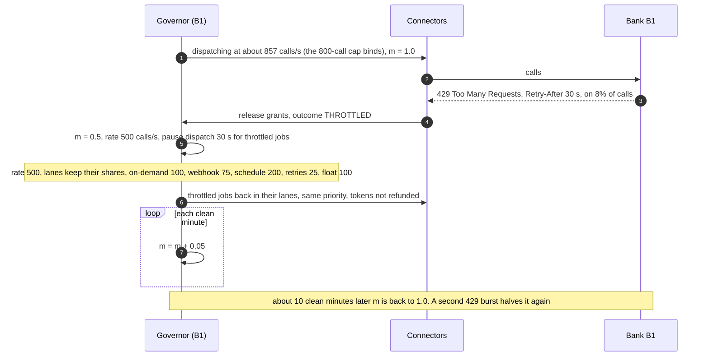

## D6. Activity / decision flows

The fingerprint flow, the outage flow and the id-migration flow are in solution §5.3, §5.5 and §5.6. Two more here.

### D6a. The matcher, in both directions

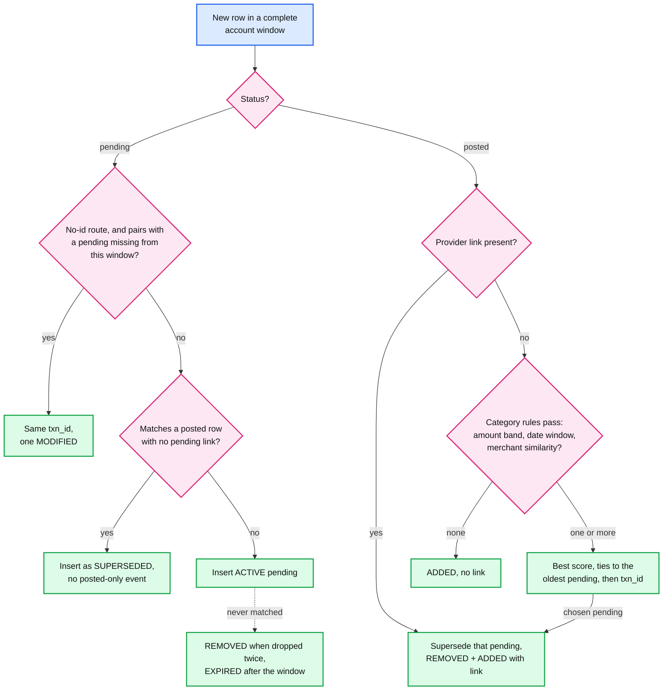

- SUPERSEDED and EXPIRED are terminal: a bank that keeps listing or edits such a row may change its stored content for audit, but no event is emitted and it is never reactivated. Both no-id gaps (an edited pending, a late pending) are reproduced in [`deep-dives/pending-to-posted-matching.md`](deep-dives/pending-to-posted-matching.md) §5.

### D6b. Snapshot vs delta ingest

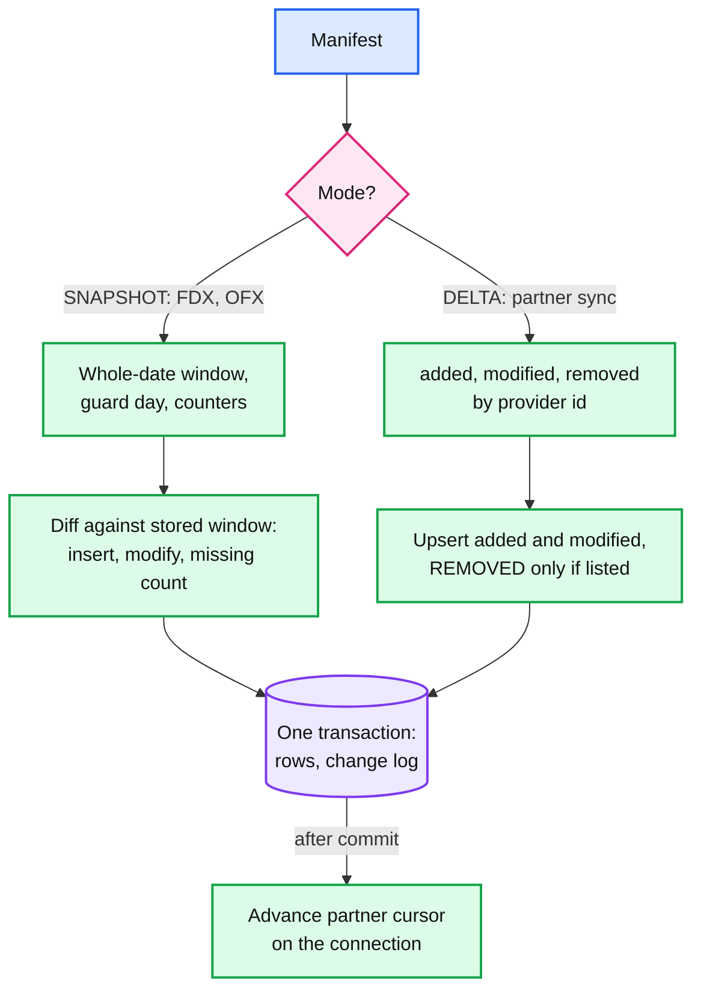

## D7. Entity relationship

In [solution §3.3](solution.md#33-data-model), with access patterns and the partition key (`connection_id` for the transaction store).

## D8. State machines

The transaction row lifecycle is in solution §5.4. Two more lifecycles matter: the connection and the institution's breaker.

### D8b. Connection

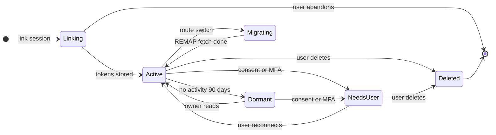

- `Active`: 3 scheduled refreshes a day. `Dormant`: 1 a day. `NeedsUser`: no bank calls at all until the user acts. `Migrating`: a credential route moving to FDX after re-consent, whose first fetch runs in REMAP mode (solution §5.6). `Deleted`: token revoked at the bank, secrets destroyed.

### D8c. Institution breaker

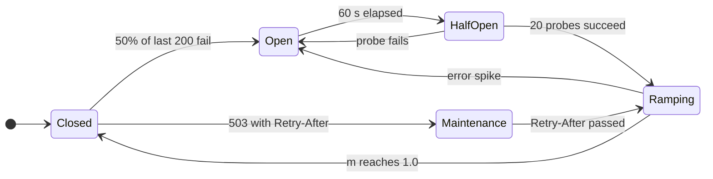

- `Open`: over the last 200 calls, never more than 5 minutes back, at least 20 calls and 50% failing at the institution level, or 5 consecutive failures at a tiny institution. At B1 on timeouts that is ~22 s after the outage starts.
- `Ramping`: m starts at 0.1 and doubles every 2 minutes (about 8 minutes to full rate). The catch-up, most stale first, starts when the breaker enters `Ramping`. `Maintenance` never pages anyone.
- A separate **data breaker** per institution watches content, not calls: over 1% of account windows empty in 30 minutes (where the last fetch had at least 5 rows) pauses ingestion while fetching continues, and pages. It closes by hand or after an hour of normal windows.

## D9. Deployment / topology

One active fetch region, a warm standby region. Fetching is single-writer per institution, so it does not go active-active; reads do.

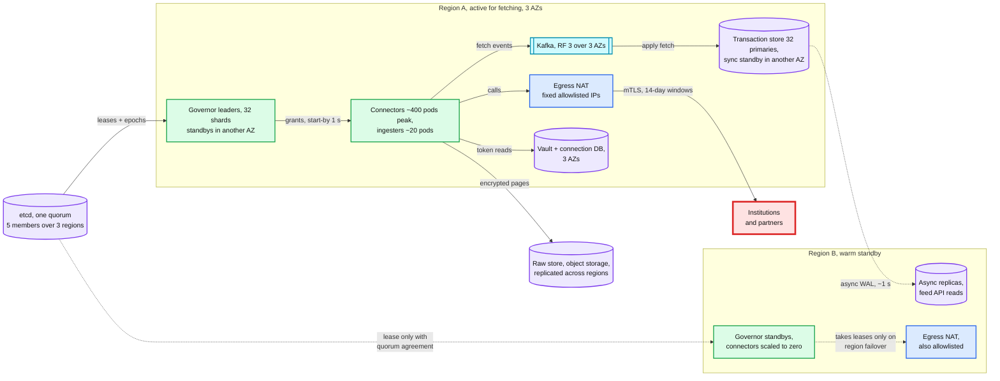

- **Crosses a region:** async WAL (write-ahead log) to replicas, raw-store replication, and on failover the governor leases. Nothing on the fetch path is synchronous across regions. A region loss loses at most ~1 s of change log; the next fetch of each affected connection rebuilds it, because the bank holds the truth. Consumers see a new cursor epoch and resync from the last common `seq`.
- **etcd spans 3 regions** (a member in a third region breaks ties), or cross-region governor failover is manual. With a 2-region etcd, a partition can elect a leader on each side, and expiring grants do not help: both sides issue fresh ones.

### D9b. Governor shard ownership

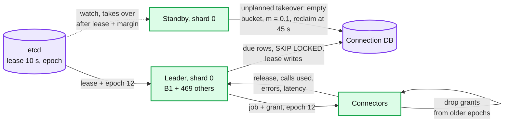

## D10. Scaling / partitioning

Three partition schemes, one per job. The hot spot is not one of our shards: it is B1's limit, which no amount of our sharding can split.

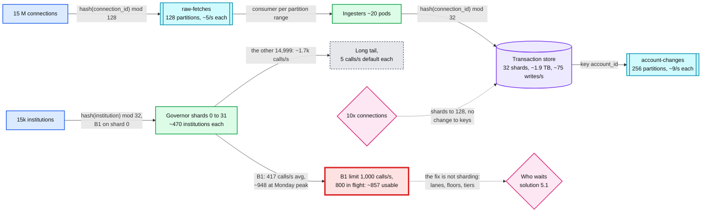

- Per partition: `raw-fetches` ~700 msg/s ÷ 128 ≈ 5/s; `account-changes` 2.4k/s ÷ 256 ≈ 9/s. Per transaction-store shard: ~75 writes/s average, ~300 at peak, ~1.9 TB hot. Storage sets the shard count, not throughput. No connection is hot: the busiest SMB account adds a few hundred rows a day. See [`../../concepts/sharding.md`](../../concepts/sharding.md).

## D11. Failure mode map

Component, what fails, blast radius, mitigation. Two trees to stay under 15 nodes each.

### D11a. Fetch path

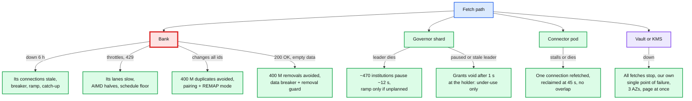

### D11b. Data path

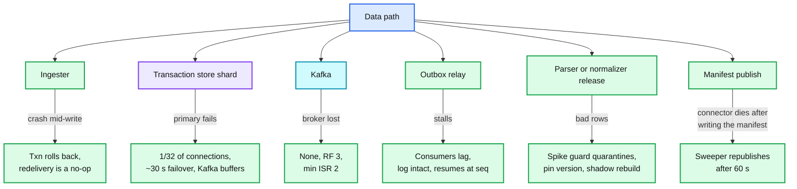

## D12. Rollout / migration

From QuickBooks' current bank-feed pipeline (and third-party aggregators) to this platform, one institution at a time. Every phase has a rollback point; the one-way door is QuickBooks accepting rows keyed by our `txn_id`, so the legacy-id mapping is kept until phase 5.

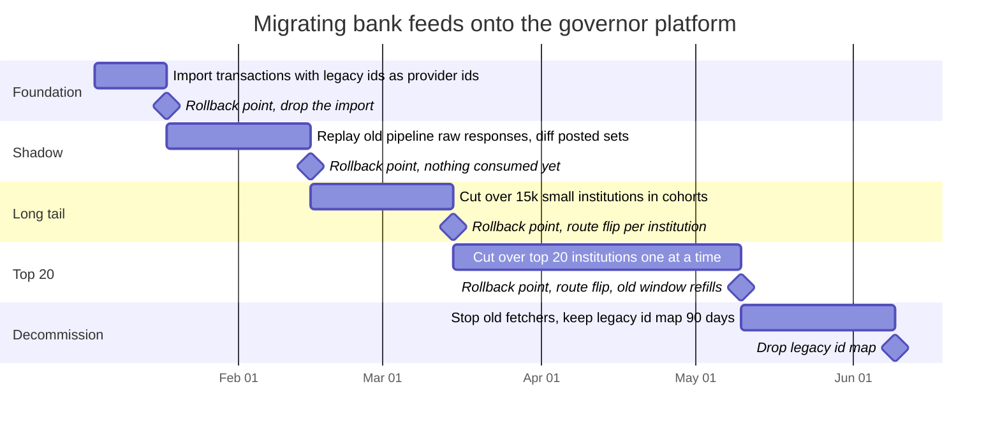

- Phase 1 never calls a bank: it replays the old pipeline's stored responses, or a 1% sample inside the old pipeline's budget. A cutover moves the institution's whole limit to the new governor in one step, because two fetchers sharing one bank limit is exactly the breach this design exists to prevent.
